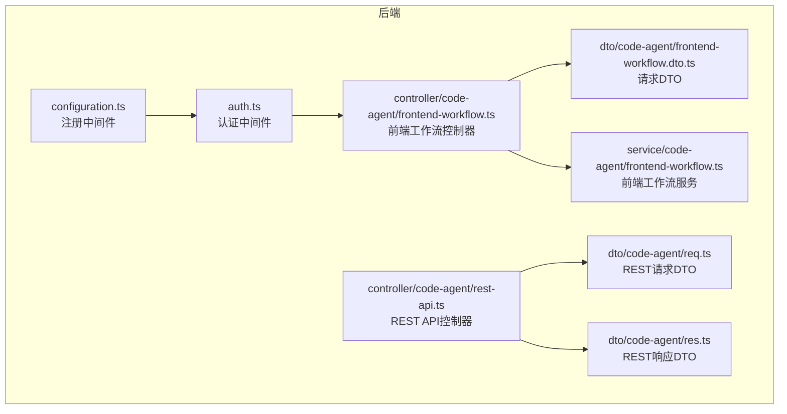
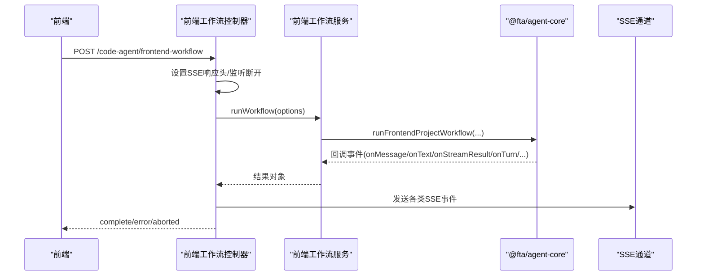
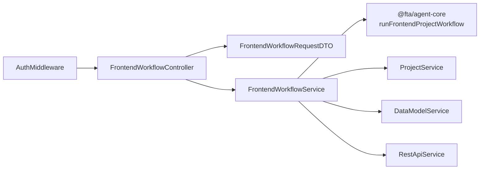

# API参考

<cite>
**本文引用的文件**
- [frontend-workflow.ts](file://code-agent-backend/src/controller/code-agent/frontend-workflow.ts)
- [frontend-workflow.dto.ts](file://code-agent-backend/src/dto/code-agent/frontend-workflow.dto.ts)
- [frontend-workflow.ts](file://code-agent-backend/src/service/code-agent/frontend-workflow.ts)
- [auth.ts](file://code-agent-backend/src/middleware/auth.ts)
- [configuration.ts](file://code-agent-backend/src/configuration.ts)
- [frontend-workflow-api.md](file://code-agent-backend/docs/frontend-workflow-api.md)
- [frontend-workflow-log-viewer.html](file://code-agent-backend/tools/frontend-workflow-log-viewer.html)
- [rest-api.ts](file://code-agent-backend/src/controller/code-agent/rest-api.ts)
- [req.ts](file://code-agent-backend/src/dto/code-agent/req.ts)
- [res.ts](file://code-agent-backend/src/dto/code-agent/res.ts)
- [apiService.ts](file://fta-layout-design/src/utils/apiService.ts)
</cite>

## 目录
1. [简介](#简介)
2. [项目结构](#项目结构)
3. [核心组件](#核心组件)
4. [架构总览](#架构总览)
5. [详细组件分析](#详细组件分析)
6. [依赖关系分析](#依赖关系分析)
7. [性能考量](#性能考量)
8. [故障排查指南](#故障排查指南)
9. [结论](#结论)
10. [附录](#附录)

## 简介
本文件为后端暴露的HTTP/SSE API参考，重点覆盖“前端工作流”控制器。内容包括：
- 每个端点的HTTP方法、URL路径、请求参数（路径、查询、Body）、请求体JSON Schema（引用DTO文件）和响应格式
- SSE端点的消息格式与事件类型说明
- 认证机制（通过auth中间件）
- 初学者curl示例与开发者前端最佳实践（使用apiService.ts中的封装方法）
- 错误码与处理策略

## 项目结构
后端采用MidwayJS框架，API集中在code-agent控制器中；认证中间件统一挂载于应用生命周期中；前端工作流通过SSE实时推送事件；REST API控制器提供CRUD接口。

图表来源
- [configuration.ts](file://code-agent-backend/src/configuration.ts#L43-L55)
- [auth.ts](file://code-agent-backend/src/middleware/auth.ts#L162-L194)
- [frontend-workflow.ts](file://code-agent-backend/src/controller/code-agent/frontend-workflow.ts#L1-L120)
- [frontend-workflow.ts](file://code-agent-backend/src/service/code-agent/frontend-workflow.ts#L1-L120)
- [frontend-workflow.dto.ts](file://code-agent-backend/src/dto/code-agent/frontend-workflow.dto.ts#L1-L60)
- [rest-api.ts](file://code-agent-backend/src/controller/code-agent/rest-api.ts#L1-L132)
- [req.ts](file://code-agent-backend/src/dto/code-agent/req.ts#L523-L578)
- [res.ts](file://code-agent-backend/src/dto/code-agent/res.ts#L390-L436)

章节来源
- [configuration.ts](file://code-agent-backend/src/configuration.ts#L43-L55)
- [auth.ts](file://code-agent-backend/src/middleware/auth.ts#L162-L194)

## 核心组件
- 前端工作流控制器：接收POST请求，设置SSE响应头，转发工具调用请求，并将工作流事件通过SSE推送到客户端。
- 前端工作流服务：组装DSL与标注摘要，准备工作目录，调用核心工作流引擎，返回标准化结果。
- 认证中间件：支持多种鉴权来源（自定义header、Cookie、SSO），并在未通过时返回401。
- REST API控制器：提供REST API的增删改查接口，返回统一响应包装。

章节来源
- [frontend-workflow.ts](file://code-agent-backend/src/controller/code-agent/frontend-workflow.ts#L83-L159)
- [frontend-workflow.ts](file://code-agent-backend/src/service/code-agent/frontend-workflow.ts#L74-L120)
- [auth.ts](file://code-agent-backend/src/middleware/auth.ts#L125-L160)
- [rest-api.ts](file://code-agent-backend/src/controller/code-agent/rest-api.ts#L1-L132)

## 架构总览

图表来源
- [frontend-workflow.ts](file://code-agent-backend/src/controller/code-agent/frontend-workflow.ts#L83-L159)
- [frontend-workflow.ts](file://code-agent-backend/src/service/code-agent/frontend-workflow.ts#L74-L120)

## 详细组件分析

### 前端工作流（SSE）API
- 端点
  - 方法：POST
  - 路径：/code-agent/frontend-workflow
  - 响应类型：text/event-stream（SSE）
- 请求参数
  - 路径参数：无
  - 查询参数：无
  - 请求体：FrontendWorkflowRequestDTO（见下方Schema）
- 请求体JSON Schema（引用DTO）
  - 文件：code-agent-backend/src/dto/code-agent/frontend-workflow.dto.ts
  - 类型：FrontendWorkflowRequestDTO
  - 字段说明：
    - designDocId: string（必填）
    - productName?: string（可选，默认“FTA-Frontend”）
    - srcTree?: TreeNode（可选）
    - apiKey?: string（可选，优先使用）
    - baseURL?: string（可选，优先使用）
    - model?: string（可选，优先使用）
  - TreeNode结构：
    - name: string
    - path: string
    - type: "file" | "directory"
    - children?: TreeNode[]
- 响应格式
  - SSE事件类型与负载：
    - info：流程信息通知
    - warning：警告信息
    - message：Agent消息（role/content/uuid/parentUuid/timestamp）
    - text_delta：流式文本增量
    - text：完整文本输出
    - stream_result：流请求结果（requestId/model/hasError/error）
    - chunk：原始流数据块（chunk/requestId）
    - turn：每轮对话统计（usage/promptTokens/completionTokens/totalTokens/startTime/endTime）
    - tool_approve：工具调用批准（当前自动批准）
    - tool_call：请求前端执行工具调用（callId/toolName/params）
    - complete：任务完成（success/sessionId/filesCount/files/workflowLogPath）
    - error：错误事件（message/stack/sessionId/executionTime/timestamp）
    - aborted：客户端中断（message/sessionId/executionTime/timestamp）
- 认证机制
  - 中间件：AuthMiddleware
  - 支持来源：X-User-Cookies header、Cookie、SSO、本地开发模式
  - 未通过时返回401 Unauthorized
- 前端调用最佳实践
  - 使用apiService.ts中的streamingPost封装，自动处理SSE事件
  - 参考：fta-layout-design/src/utils/apiService.ts
- curl示例（初学者）
  - 说明：SSE需使用支持SSE的客户端或库；curl原生不支持SSE，建议使用fetch-event-source等库
  - 示例思路（伪命令）：
    - 使用fetch-event-source或浏览器EventSource（注意：EventSource不支持POST，需改用GET或借助第三方库）
    - 或在后端增加GET变体（需改造控制器）

章节来源
- [frontend-workflow.ts](file://code-agent-backend/src/controller/code-agent/frontend-workflow.ts#L83-L159)
- [frontend-workflow.dto.ts](file://code-agent-backend/src/dto/code-agent/frontend-workflow.dto.ts#L1-L60)
- [frontend-workflow-api.md](file://code-agent-backend/docs/frontend-workflow-api.md#L1-L139)
- [apiService.ts](file://fta-layout-design/src/utils/apiService.ts#L859-L908)

### 工具结果回调（POST /code-agent/frontend-workflow/tool-result）
- 端点
  - 方法：POST
  - 路径：/code-agent/frontend-workflow/tool-result
- 请求体
  - callId: string（必填）
  - toolName: string（必填）
  - params: any（必填）
  - toolResult: ToolResult（必填）
- ToolResult结构
  - llmContent: string | (TextPart | ImagePart)[]
  - returnDisplay?: string | any
  - isError?: boolean
- 响应
  - { success: boolean }

章节来源
- [frontend-workflow.ts](file://code-agent-backend/src/controller/code-agent/frontend-workflow.ts#L48-L81)

### REST API 控制器（补充）
- 端点
  - POST /code-agent/rest-api/：创建REST API
  - PUT /code-agent/rest-api/:id：更新REST API
  - DEL /code-agent/rest-api/:id：删除REST API
  - GET /code-agent/rest-api/project/:projectId：按项目获取
  - GET /code-agent/rest-api/group/:groupId：按组获取
  - GET /code-agent/rest-api/project/:projectId/ungrouped：项目未分组
  - GET /code-agent/rest-api/:id：按ID获取详情
- 请求体/参数
  - CreateRestApiRequest/UpdateRestApiRequest（见req.ts）
  - 路径参数：id、projectId、groupId
- 响应
  - CreateRestApiResponse/UpdateRestApiResponse/DeleteRestApiResponse/RestApiDetailResponse/RestApiListResponse（见res.ts）
- 状态码
  - 200 成功
  - 400 请求错误
  - 404 资源不存在
  - 500 服务器错误

章节来源
- [rest-api.ts](file://code-agent-backend/src/controller/code-agent/rest-api.ts#L1-L132)
- [req.ts](file://code-agent-backend/src/dto/code-agent/req.ts#L523-L578)
- [res.ts](file://code-agent-backend/src/dto/code-agent/res.ts#L390-L436)

## 依赖关系分析
- 认证中间件挂载于应用生命周期，对匹配路径生效
- 前端工作流控制器依赖前端工作流服务与DTO
- 前端工作流服务依赖设计DSL服务、项目服务、数据模型服务、REST API服务，并调用@fta/agent-core核心引擎
- 前端工具调用通过toolProxy与控制器的tool-call事件交互

图表来源
- [configuration.ts](file://code-agent-backend/src/configuration.ts#L43-L55)
- [auth.ts](file://code-agent-backend/src/middleware/auth.ts#L162-L194)
- [frontend-workflow.ts](file://code-agent-backend/src/controller/code-agent/frontend-workflow.ts#L1-L120)
- [frontend-workflow.ts](file://code-agent-backend/src/service/code-agent/frontend-workflow.ts#L1-L120)

章节来源
- [configuration.ts](file://code-agent-backend/src/configuration.ts#L43-L55)
- [auth.ts](file://code-agent-backend/src/middleware/auth.ts#L162-L194)
- [frontend-workflow.ts](file://code-agent-backend/src/controller/code-agent/frontend-workflow.ts#L1-L120)
- [frontend-workflow.ts](file://code-agent-backend/src/service/code-agent/frontend-workflow.ts#L1-L120)

## 性能考量
- SSE长连接：注意客户端断开监听与清理，避免资源泄露
- 工具调用超时：控制器内置60秒超时保护，超时后reject并清理pending集合
- 令牌统计：turn事件包含promptTokens/completionTokens/totalTokens，可用于成本与性能监控
- 日志与产物：工作流产物保存在files-cache/frontend-projects/{sessionId}/，可通过日志查看器离线回放

章节来源
- [frontend-workflow.ts](file://code-agent-backend/src/controller/code-agent/frontend-workflow.ts#L151-L195)
- [frontend-workflow.ts](file://code-agent-backend/src/service/code-agent/frontend-workflow.ts#L191-L222)
- [frontend-workflow-log-viewer.html](file://code-agent-backend/tools/frontend-workflow-log-viewer.html#L1-L120)

## 故障排查指南
- 认证失败（401）
  - 检查X-User-Cookies header或Cookie是否正确传递
  - 确认SSO验证可用且passport有效
- 模型配置缺失
  - 若未提供apiKey/baseURL，服务返回错误结果（包含缺失字段）
- 客户端中断
  - 客户端断开触发aborted事件，服务端清理pending工具调用
- 错误事件
  - error事件包含message/stack/sessionId/executionTime/timestamp，便于定位问题
- 日志与回放
  - 使用前端工作流日志查看器离线回放会话与产物

章节来源
- [auth.ts](file://code-agent-backend/src/middleware/auth.ts#L125-L160)
- [frontend-workflow.ts](file://code-agent-backend/src/service/code-agent/frontend-workflow.ts#L78-L95)
- [frontend-workflow.ts](file://code-agent-backend/src/controller/code-agent/frontend-workflow.ts#L310-L344)
- [frontend-workflow-log-viewer.html](file://code-agent-backend/tools/frontend-workflow-log-viewer.html#L1-L120)

## 结论
- 前端工作流API通过SSE提供实时反馈，适合构建可视化生成流程
- 认证中间件统一拦截，支持多来源鉴权
- REST API控制器提供标准CRUD接口，配合统一响应包装
- 建议前端使用apiService.ts的封装方法进行流式请求与事件处理

## 附录

### SSE事件类型与负载说明
- info：流程信息通知
- warning：警告信息
- message：Agent消息（role/content/uuid/parentUuid/timestamp）
- text_delta：流式文本增量
- text：完整文本输出
- stream_result：流请求结果（requestId/model/hasError/error）
- chunk：原始流数据块（chunk/requestId）
- turn：每轮对话统计（usage/promptTokens/completionTokens/totalTokens/startTime/endTime）
- tool_approve：工具调用批准（当前自动批准）
- tool_call：请求前端执行工具调用（callId/toolName/params）
- complete：任务完成（success/sessionId/filesCount/files/workflowLogPath）
- error：错误事件（message/stack/sessionId/executionTime/timestamp）
- aborted：客户端中断（message/sessionId/executionTime/timestamp）

章节来源
- [frontend-workflow-api.md](file://code-agent-backend/docs/frontend-workflow-api.md#L1-L139)

### 前端调用最佳实践
- 使用apiService.ts中的streamingPost封装，自动处理SSE事件
- 参考路径：fta-layout-design/src/utils/apiService.ts

章节来源
- [apiService.ts](file://fta-layout-design/src/utils/apiService.ts#L859-L908)

### curl示例（初学者）
- 说明：SSE需使用支持SSE的客户端或库；curl原生不支持SSE
- 建议使用fetch-event-source或浏览器EventSource（注意：EventSource不支持POST，可改用GET或借助第三方库）

章节来源
- [frontend-workflow-api.md](file://code-agent-backend/docs/frontend-workflow-api.md#L203-L235)