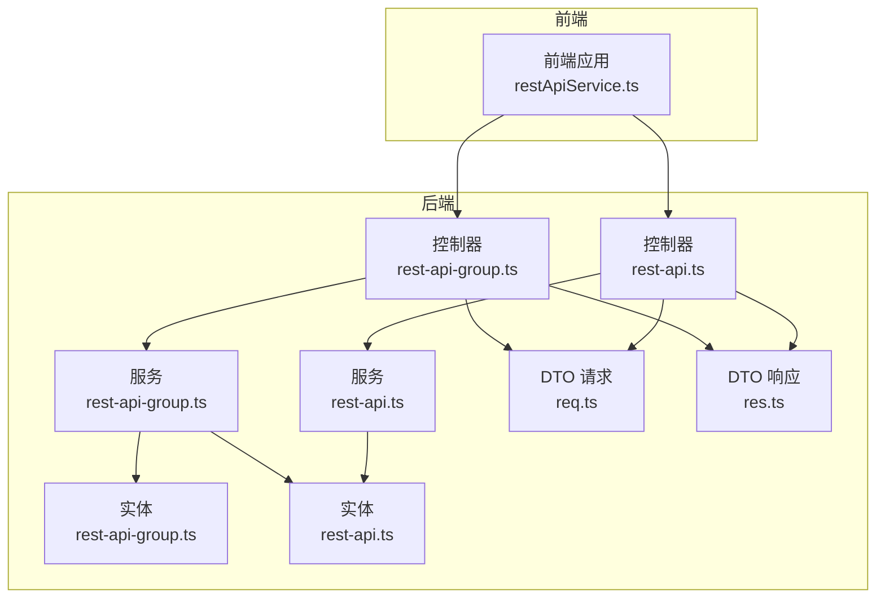
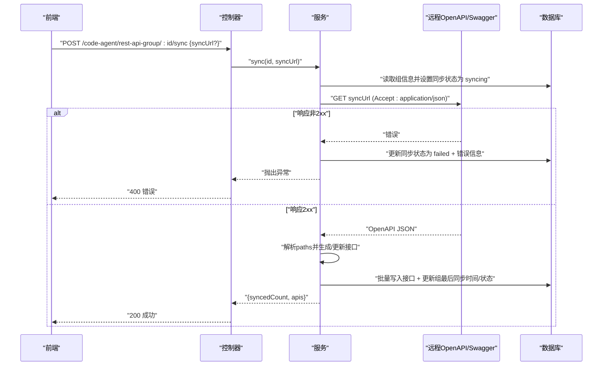
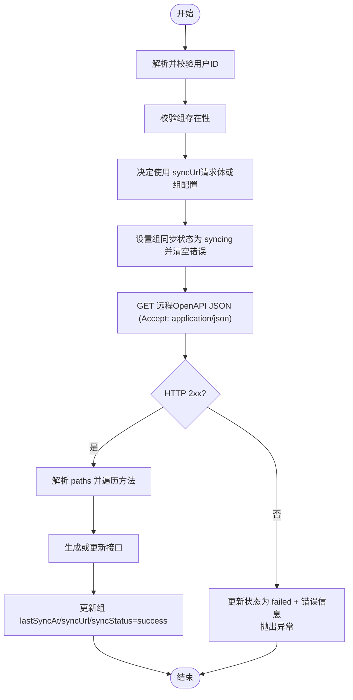
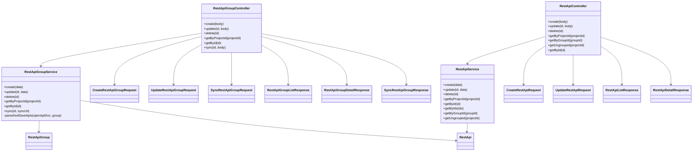

# REST API管理API

<cite>
**本文引用的文件**
- [code-agent-backend/src/controller/code-agent/rest-api-group.ts](file://code-agent-backend/src/controller/code-agent/rest-api-group.ts)
- [code-agent-backend/src/controller/code-agent/rest-api.ts](file://code-agent-backend/src/controller/code-agent/rest-api.ts)
- [code-agent-backend/src/service/code-agent/rest-api-group.ts](file://code-agent-backend/src/service/code-agent/rest-api-group.ts)
- [code-agent-backend/src/service/code-agent/rest-api.ts](file://code-agent-backend/src/service/code-agent/rest-api.ts)
- [code-agent-backend/src/entity/code-agent/rest-api-group.ts](file://code-agent-backend/src/entity/code-agent/rest-api-group.ts)
- [code-agent-backend/src/entity/code-agent/rest-api.ts](file://code-agent-backend/src/entity/code-agent/rest-api.ts)
- [code-agent-backend/src/dto/code-agent/req.ts](file://code-agent-backend/src/dto/code-agent/req.ts)
- [code-agent-backend/src/dto/code-agent/res.ts](file://code-agent-backend/src/dto/code-agent/res.ts)
- [fta-layout-design/src/services/restApiService.ts](file://fta-layout-design/src/services/restApiService.ts)
- [shared-types/src/restApi.ts](file://shared-types/src/restApi.ts)
</cite>

## 目录
1. [简介](#简介)
2. [项目结构](#项目结构)
3. [核心组件](#核心组件)
4. [架构总览](#架构总览)
5. [详细组件分析](#详细组件分析)
6. [依赖关系分析](#依赖关系分析)
7. [性能考量](#性能考量)
8. [故障排查指南](#故障排查指南)
9. [结论](#结论)
10. [附录](#附录)

## 简介
本文件面向开发者，系统性梳理“REST API管理API”的端点与实现，覆盖以下两类资源：
- REST API组：用于对一组REST API进行分组管理，并支持从远程OpenAPI/Swagger文档自动同步接口定义。
- REST API：用于存储具体的接口定义，包括名称、描述、URL、HTTP方法及关联的数据模型。

本文重点说明以下端点：
- REST API组端点：POST /code-agent/rest-api-group、PUT /code-agent/rest-api-group/:id、DELETE /code-agent/rest-api-group/:id、GET /code-agent/rest-api-group/project/:projectId、GET /code-agent/rest-api-group/:id、POST /code-agent/rest-api-group/:id/sync
- REST API端点：POST /code-agent/rest-api、PUT /code-agent/rest-api/:id、DELETE /code-agent/rest-api/:id、GET /code-agent/rest-api/project/:projectId、GET /code-agent/rest-api/group/:groupId、GET /code-agent/rest-api/:id

特别说明同步功能（sync）的实现机制：通过POST /code-agent/rest-api-group/:id/sync端点，服务端会根据请求体中的syncUrl或组配置的syncUrl，从远程拉取OpenAPI/Swagger文档，并自动创建或更新该组下的REST API条目。本文将给出调用示例与服务端处理流程图，帮助开发者快速集成与排障。

## 项目结构
后端采用MidwayJS框架，按“控制器-服务-实体-DTO”分层组织。前端通过统一的服务封装调用后端API。

图表来源
- [code-agent-backend/src/controller/code-agent/rest-api-group.ts](file://code-agent-backend/src/controller/code-agent/rest-api-group.ts#L1-L123)
- [code-agent-backend/src/controller/code-agent/rest-api.ts](file://code-agent-backend/src/controller/code-agent/rest-api.ts#L1-L132)
- [code-agent-backend/src/service/code-agent/rest-api-group.ts](file://code-agent-backend/src/service/code-agent/rest-api-group.ts#L1-L331)
- [code-agent-backend/src/service/code-agent/rest-api.ts](file://code-agent-backend/src/service/code-agent/rest-api.ts#L1-L240)
- [code-agent-backend/src/entity/code-agent/rest-api-group.ts](file://code-agent-backend/src/entity/code-agent/rest-api-group.ts#L1-L64)
- [code-agent-backend/src/entity/code-agent/rest-api.ts](file://code-agent-backend/src/entity/code-agent/rest-api.ts#L1-L69)
- [code-agent-backend/src/dto/code-agent/req.ts](file://code-agent-backend/src/dto/code-agent/req.ts#L492-L580)
- [code-agent-backend/src/dto/code-agent/res.ts](file://code-agent-backend/src/dto/code-agent/res.ts#L339-L436)

章节来源
- [code-agent-backend/src/controller/code-agent/rest-api-group.ts](file://code-agent-backend/src/controller/code-agent/rest-api-group.ts#L1-L123)
- [code-agent-backend/src/controller/code-agent/rest-api.ts](file://code-agent-backend/src/controller/code-agent/rest-api.ts#L1-L132)

## 核心组件
- 控制器层
  - RestApiGroupController：暴露REST API组的增删改查与同步端点。
  - RestApiController：暴露REST API的增删改查端点。
- 服务层
  - RestApiGroupService：负责组的业务逻辑、权限校验、同步远程OpenAPI文档、解析并创建/更新接口。
  - RestApiService：负责接口的增删改查与按项目/组查询。
- 实体层
  - RestApiGroup：组实体，包含同步URL、状态、错误信息等。
  - RestApi：接口实体，包含URL、方法、关联模型ID等。
- DTO层
  - 请求DTO：CreateRestApiGroupRequest、UpdateRestApiGroupRequest、SyncRestApiGroupRequest、CreateRestApiRequest、UpdateRestApiRequest。
  - 响应DTO：RestApiGroup*Response、RestApi*Response，统一返回结构。

章节来源
- [code-agent-backend/src/controller/code-agent/rest-api-group.ts](file://code-agent-backend/src/controller/code-agent/rest-api-group.ts#L1-L123)
- [code-agent-backend/src/controller/code-agent/rest-api.ts](file://code-agent-backend/src/controller/code-agent/rest-api.ts#L1-L132)
- [code-agent-backend/src/service/code-agent/rest-api-group.ts](file://code-agent-backend/src/service/code-agent/rest-api-group.ts#L1-L331)
- [code-agent-backend/src/service/code-agent/rest-api.ts](file://code-agent-backend/src/service/code-agent/rest-api.ts#L1-L240)
- [code-agent-backend/src/entity/code-agent/rest-api-group.ts](file://code-agent-backend/src/entity/code-agent/rest-api-group.ts#L1-L64)
- [code-agent-backend/src/entity/code-agent/rest-api.ts](file://code-agent-backend/src/entity/code-agent/rest-api.ts#L1-L69)
- [code-agent-backend/src/dto/code-agent/req.ts](file://code-agent-backend/src/dto/code-agent/req.ts#L492-L580)
- [code-agent-backend/src/dto/code-agent/res.ts](file://code-agent-backend/src/dto/code-agent/res.ts#L339-L436)

## 架构总览
下图展示REST API组与REST API的端到端交互，以及同步流程的关键步骤。

图表来源
- [code-agent-backend/src/controller/code-agent/rest-api-group.ts](file://code-agent-backend/src/controller/code-agent/rest-api-group.ts#L105-L121)
- [code-agent-backend/src/service/code-agent/rest-api-group.ts](file://code-agent-backend/src/service/code-agent/rest-api-group.ts#L197-L260)
- [code-agent-backend/src/service/code-agent/rest-api-group.ts](file://code-agent-backend/src/service/code-agent/rest-api-group.ts#L262-L331)

## 详细组件分析

### REST API组端点
- POST /code-agent/rest-api-group
  - 功能：创建REST API组。请求体字段来自CreateRestApiGroupRequest，包括projectId、name、description、syncUrl。
  - 返回：CreateRestApiGroupResponse。
  - 权限与校验：服务层解析用户ID并校验项目归属，失败抛错。
  - 章节来源
    - [code-agent-backend/src/controller/code-agent/rest-api-group.ts](file://code-agent-backend/src/controller/code-agent/rest-api-group.ts#L26-L40)
    - [code-agent-backend/src/dto/code-agent/req.ts](file://code-agent-backend/src/dto/code-agent/req.ts#L492-L504)
    - [code-agent-backend/src/dto/code-agent/res.ts](file://code-agent-backend/src/dto/code-agent/res.ts#L366-L376)
    - [code-agent-backend/src/service/code-agent/rest-api-group.ts](file://code-agent-backend/src/service/code-agent/rest-api-group.ts#L84-L111)

- PUT /code-agent/rest-api-group/:id
  - 功能：更新REST API组。请求体字段来自UpdateRestApiGroupRequest，支持name、description、syncUrl。
  - 返回：UpdateRestApiGroupResponse。
  - 章节来源
    - [code-agent-backend/src/controller/code-agent/rest-api-group.ts](file://code-agent-backend/src/controller/code-agent/rest-api-group.ts#L41-L55)
    - [code-agent-backend/src/dto/code-agent/req.ts](file://code-agent-backend/src/dto/code-agent/req.ts#L506-L515)
    - [code-agent-backend/src/dto/code-agent/res.ts](file://code-agent-backend/src/dto/code-agent/res.ts#L372-L376)
    - [code-agent-backend/src/service/code-agent/rest-api-group.ts](file://code-agent-backend/src/service/code-agent/rest-api-group.ts#L116-L142)

- DELETE /code-agent/rest-api-group/:id
  - 功能：删除REST API组，并级联删除组内所有接口。
  - 返回：DeleteRestApiGroupResponse。
  - 章节来源
    - [code-agent-backend/src/controller/code-agent/rest-api-group.ts](file://code-agent-backend/src/controller/code-agent/rest-api-group.ts#L56-L69)
    - [code-agent-backend/src/dto/code-agent/res.ts](file://code-agent-backend/src/dto/code-agent/res.ts#L378-L382)
    - [code-agent-backend/src/service/code-agent/rest-api-group.ts](file://code-agent-backend/src/service/code-agent/rest-api-group.ts#L144-L162)

- GET /code-agent/rest-api-group/project/:projectId
  - 功能：获取项目下的所有REST API组，按创建时间倒序。
  - 返回：RestApiGroupListResponse。
  - 章节来源
    - [code-agent-backend/src/controller/code-agent/rest-api-group.ts](file://code-agent-backend/src/controller/code-agent/rest-api-group.ts#L71-L83)
    - [code-agent-backend/src/dto/code-agent/res.ts](file://code-agent-backend/src/dto/code-agent/res.ts#L354-L358)
    - [code-agent-backend/src/service/code-agent/rest-api-group.ts](file://code-agent-backend/src/service/code-agent/rest-api-group.ts#L164-L179)

- GET /code-agent/rest-api-group/:id
  - 功能：获取单个REST API组详情。
  - 返回：RestApiGroupDetailResponse；不存在时返回404。
  - 章节来源
    - [code-agent-backend/src/controller/code-agent/rest-api-group.ts](file://code-agent-backend/src/controller/code-agent/rest-api-group.ts#L84-L103)
    - [code-agent-backend/src/dto/code-agent/res.ts](file://code-agent-backend/src/dto/code-agent/res.ts#L360-L364)
    - [code-agent-backend/src/service/code-agent/rest-api-group.ts](file://code-agent-backend/src/service/code-agent/rest-api-group.ts#L181-L192)

- POST /code-agent/rest-api-group/:id/sync
  - 功能：同步远程OpenAPI/Swagger文档，自动创建或更新该组下的REST API。
  - 请求体：SyncRestApiGroupRequest，支持显式传入syncUrl（若不传则使用组配置的syncUrl）。
  - 返回：SyncRestApiGroupResponse，包含syncedCount与apis列表。
  - 处理流程要点：
    - 校验用户ID与组存在性。
    - 设置组同步状态为syncing并清空上次错误。
    - 从syncUrl拉取JSON（Accept: application/json），解析paths并逐条生成或更新接口。
    - 成功后更新lastSyncAt、syncUrl、syncStatus为success；失败则更新syncStatus为failed与错误信息。
  - 章节来源
    - [code-agent-backend/src/controller/code-agent/rest-api-group.ts](file://code-agent-backend/src/controller/code-agent/rest-api-group.ts#L105-L121)
    - [code-agent-backend/src/dto/code-agent/req.ts](file://code-agent-backend/src/dto/code-agent/req.ts#L517-L520)
    - [code-agent-backend/src/dto/code-agent/res.ts](file://code-agent-backend/src/dto/code-agent/res.ts#L384-L388)
    - [code-agent-backend/src/service/code-agent/rest-api-group.ts](file://code-agent-backend/src/service/code-agent/rest-api-group.ts#L197-L260)
    - [code-agent-backend/src/service/code-agent/rest-api-group.ts](file://code-agent-backend/src/service/code-agent/rest-api-group.ts#L262-L331)

### REST API端点
- POST /code-agent/rest-api
  - 功能：创建REST API。请求体字段来自CreateRestApiRequest，支持groupId、name、description、url、method、requestModelIds、responseModelIds。
  - 返回：CreateRestApiResponse。
  - 章节来源
    - [code-agent-backend/src/controller/code-agent/rest-api.ts](file://code-agent-backend/src/controller/code-agent/rest-api.ts#L24-L36)
    - [code-agent-backend/src/dto/code-agent/req.ts](file://code-agent-backend/src/dto/code-agent/req.ts#L523-L551)
    - [code-agent-backend/src/dto/code-agent/res.ts](file://code-agent-backend/src/dto/code-agent/res.ts#L418-L428)
    - [code-agent-backend/src/service/code-agent/rest-api.ts](file://code-agent-backend/src/service/code-agent/rest-api.ts#L63-L96)

- PUT /code-agent/rest-api/:id
  - 功能：更新REST API。请求体字段来自UpdateRestApiRequest。
  - 返回：UpdateRestApiResponse。
  - 章节来源
    - [code-agent-backend/src/controller/code-agent/rest-api.ts](file://code-agent-backend/src/controller/code-agent/rest-api.ts#L38-L53)
    - [code-agent-backend/src/dto/code-agent/req.ts](file://code-agent-backend/src/dto/code-agent/req.ts#L553-L578)
    - [code-agent-backend/src/dto/code-agent/res.ts](file://code-agent-backend/src/dto/code-agent/res.ts#L424-L434)
    - [code-agent-backend/src/service/code-agent/rest-api.ts](file://code-agent-backend/src/service/code-agent/rest-api.ts#L98-L131)

- DELETE /code-agent/rest-api/:id
  - 功能：删除REST API。
  - 返回：DeleteRestApiResponse。
  - 章节来源
    - [code-agent-backend/src/controller/code-agent/rest-api.ts](file://code-agent-backend/src/controller/code-agent/rest-api.ts#L55-L67)
    - [code-agent-backend/src/dto/code-agent/res.ts](file://code-agent-backend/src/dto/code-agent/res.ts#L430-L434)
    - [code-agent-backend/src/service/code-agent/rest-api.ts](file://code-agent-backend/src/service/code-agent/rest-api.ts#L133-L149)

- GET /code-agent/rest-api/project/:projectId
  - 功能：获取项目下的所有REST API，按创建时间倒序。
  - 返回：RestApiListResponse。
  - 章节来源
    - [code-agent-backend/src/controller/code-agent/rest-api.ts](file://code-agent-backend/src/controller/code-agent/rest-api.ts#L69-L81)
    - [code-agent-backend/src/dto/code-agent/res.ts](file://code-agent-backend/src/dto/code-agent/res.ts#L406-L410)
    - [code-agent-backend/src/service/code-agent/rest-api.ts](file://code-agent-backend/src/service/code-agent/rest-api.ts#L151-L166)

- GET /code-agent/rest-api/group/:groupId
  - 功能：获取组内的所有REST API，按创建时间倒序。
  - 返回：RestApiListResponse。
  - 章节来源
    - [code-agent-backend/src/controller/code-agent/rest-api.ts](file://code-agent-backend/src/controller/code-agent/rest-api.ts#L83-L95)
    - [code-agent-backend/src/dto/code-agent/res.ts](file://code-agent-backend/src/dto/code-agent/res.ts#L406-L410)
    - [code-agent-backend/src/service/code-agent/rest-api.ts](file://code-agent-backend/src/service/code-agent/rest-api.ts#L201-L216)

- GET /code-agent/rest-api/project/:projectId/ungrouped
  - 功能：获取项目内未分组的REST API。
  - 返回：RestApiListResponse。
  - 章节来源
    - [code-agent-backend/src/controller/code-agent/rest-api.ts](file://code-agent-backend/src/controller/code-agent/rest-api.ts#L97-L109)
    - [code-agent-backend/src/dto/code-agent/res.ts](file://code-agent-backend/src/dto/code-agent/res.ts#L406-L410)
    - [code-agent-backend/src/service/code-agent/rest-api.ts](file://code-agent-backend/src/service/code-agent/rest-api.ts#L218-L237)

- GET /code-agent/rest-api/:id
  - 功能：获取单个REST API详情。
  - 返回：RestApiDetailResponse；不存在时返回404。
  - 章节来源
    - [code-agent-backend/src/controller/code-agent/rest-api.ts](file://code-agent-backend/src/controller/code-agent/rest-api.ts#L111-L130)
    - [code-agent-backend/src/dto/code-agent/res.ts](file://code-agent-backend/src/dto/code-agent/res.ts#L412-L416)
    - [code-agent-backend/src/service/code-agent/rest-api.ts](file://code-agent-backend/src/service/code-agent/rest-api.ts#L171-L179)

### 同步功能（POST /code-agent/rest-api-group/:id/sync）详解
- 调用示例（前端）
  - 使用前端封装的服务进行同步：
    - 调用restApiGroupService.sync(id, syncUrl?)，返回{syncedCount, apis}。
  - 章节来源
    - [fta-layout-design/src/services/restApiService.ts](file://fta-layout-design/src/services/restApiService.ts#L63-L70)

- 服务端处理流程（算法）
  - 步骤概览
    1) 校验用户ID与组存在性。
    2) 决定使用的syncUrl（请求体优先，否则使用组配置）。
    3) 设置组同步状态为syncing并清空错误。
    4) 发起HTTP请求获取OpenAPI JSON（Accept: application/json）。
    5) 若响应非2xx，更新状态为failed并抛错。
    6) 若响应2xx，解析paths，遍历每个path与HTTP方法，生成或更新接口。
    7) 成功后更新组的lastSyncAt、syncUrl、syncStatus为success。
  - 章节来源
    - [code-agent-backend/src/service/code-agent/rest-api-group.ts](file://code-agent-backend/src/service/code-agent/rest-api-group.ts#L197-L260)
    - [code-agent-backend/src/service/code-agent/rest-api-group.ts](file://code-agent-backend/src/service/code-agent/rest-api-group.ts#L262-L331)

- 同步流程图

图表来源
- [code-agent-backend/src/service/code-agent/rest-api-group.ts](file://code-agent-backend/src/service/code-agent/rest-api-group.ts#L197-L260)
- [code-agent-backend/src/service/code-agent/rest-api-group.ts](file://code-agent-backend/src/service/code-agent/rest-api-group.ts#L262-L331)

## 依赖关系分析
- 控制器依赖服务，服务依赖实体模型与上下文。
- DTO在控制器与服务之间传递请求/响应结构。
- 共享类型HttpMethod在服务与实体间复用。

图表来源
- [code-agent-backend/src/controller/code-agent/rest-api-group.ts](file://code-agent-backend/src/controller/code-agent/rest-api-group.ts#L1-L123)
- [code-agent-backend/src/controller/code-agent/rest-api.ts](file://code-agent-backend/src/controller/code-agent/rest-api.ts#L1-L132)
- [code-agent-backend/src/service/code-agent/rest-api-group.ts](file://code-agent-backend/src/service/code-agent/rest-api-group.ts#L1-L331)
- [code-agent-backend/src/service/code-agent/rest-api.ts](file://code-agent-backend/src/service/code-agent/rest-api.ts#L1-L240)
- [code-agent-backend/src/entity/code-agent/rest-api-group.ts](file://code-agent-backend/src/entity/code-agent/rest-api-group.ts#L1-L64)
- [code-agent-backend/src/entity/code-agent/rest-api.ts](file://code-agent-backend/src/entity/code-agent/rest-api.ts#L1-L69)
- [code-agent-backend/src/dto/code-agent/req.ts](file://code-agent-backend/src/dto/code-agent/req.ts#L492-L580)
- [code-agent-backend/src/dto/code-agent/res.ts](file://code-agent-backend/src/dto/code-agent/res.ts#L339-L436)

章节来源
- [code-agent-backend/src/dto/code-agent/req.ts](file://code-agent-backend/src/dto/code-agent/req.ts#L492-L580)
- [code-agent-backend/src/dto/code-agent/res.ts](file://code-agent-backend/src/dto/code-agent/res.ts#L339-L436)
- [shared-types/src/restApi.ts](file://shared-types/src/restApi.ts#L1-L11)

## 性能考量
- 同步性能
  - 单次同步可能涉及大量接口创建/更新，建议在服务端对paths遍历与数据库写入做批量优化（如批量插入/更新）。
  - 对远程OpenAPI文档的拉取建议设置合理的超时与重试策略，避免阻塞请求线程。
- 查询性能
  - 按projectId与groupId的查询已使用索引字段，建议在数据库层面确保相关字段建立索引以提升排序与筛选效率。
- 并发与幂等
  - 同步过程中应避免并发重复触发导致的状态竞态，可在组上增加锁或状态机控制。
- 前端体验
  - 建议前端在发起同步后轮询或监听同步状态，避免频繁刷新造成抖动。

## 故障排查指南
- 常见错误与定位
  - 用户ID缺失：服务层解析用户ID失败会抛错。检查鉴权中间件与上下文。
  - 项目不存在：创建/更新组时需校验项目归属。
  - 组不存在：更新/删除/同步均需先确认组存在。
  - 远程文档不可达：HTTP非2xx会更新状态为failed并记录错误信息。
- 建议排查步骤
  - 检查请求头Accept是否正确（服务端要求application/json）。
  - 校验syncUrl可达且返回合法的OpenAPI JSON。
  - 查看组实体的syncStatus与syncError字段，定位失败原因。
- 章节来源
  - [code-agent-backend/src/service/code-agent/rest-api-group.ts](file://code-agent-backend/src/service/code-agent/rest-api-group.ts#L197-L260)
  - [code-agent-backend/src/entity/code-agent/rest-api-group.ts](file://code-agent-backend/src/entity/code-agent/rest-api-group.ts#L35-L50)

## 结论
本文系统梳理了REST API组与REST API的管理API，明确了各端点的功能、请求/响应结构与服务端处理流程。同步功能通过POST /code-agent/rest-api-group/:id/sync实现了从远程OpenAPI/Swagger自动拉取并创建/更新接口的能力，适合在CI/CD或自动化场景中使用。建议结合数据库索引、批量写入与重试策略进一步优化同步性能与稳定性。

## 附录
- 前端调用参考
  - 使用restApiGroupService.sync(id, syncUrl?)进行同步，返回{syncedCount, apis}。
  - 使用restApiService.getByProjectId/getByGroupId/getUngrouped等方法获取接口列表。
  - 章节来源
    - [fta-layout-design/src/services/restApiService.ts](file://fta-layout-design/src/services/restApiService.ts#L1-L138)