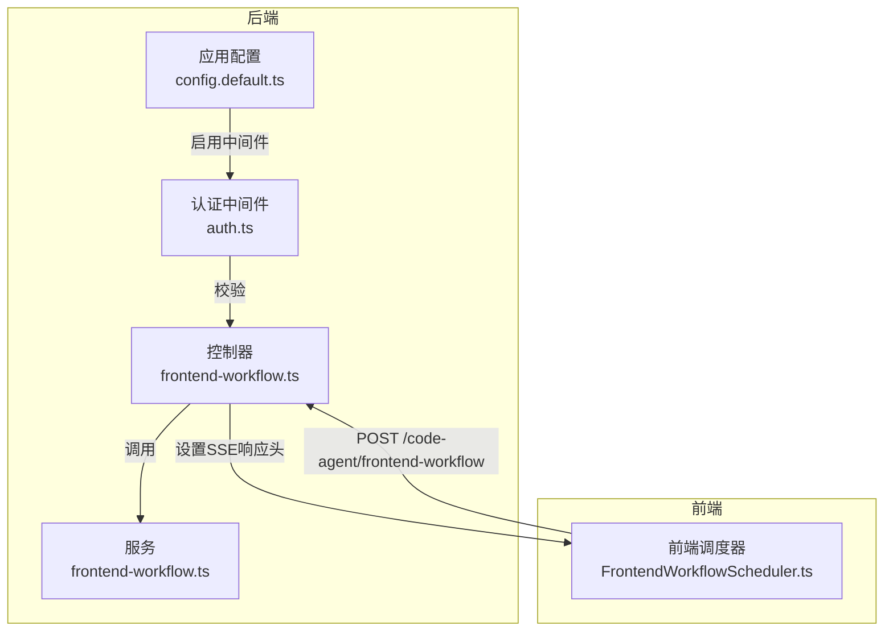
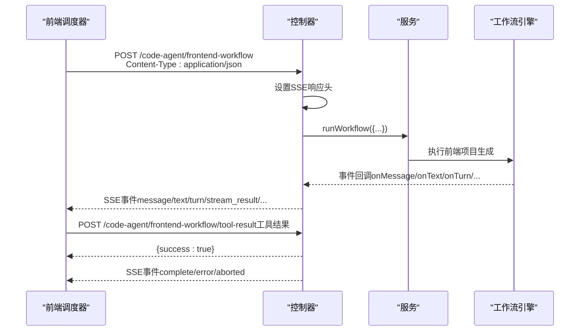
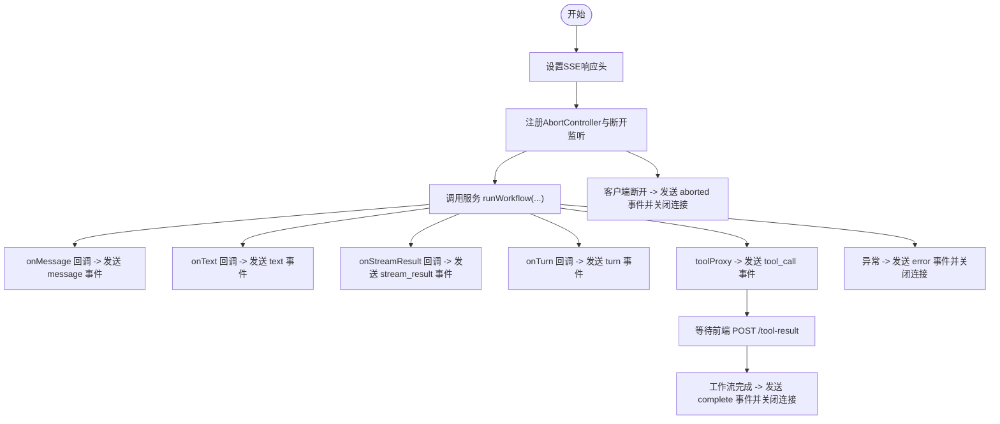
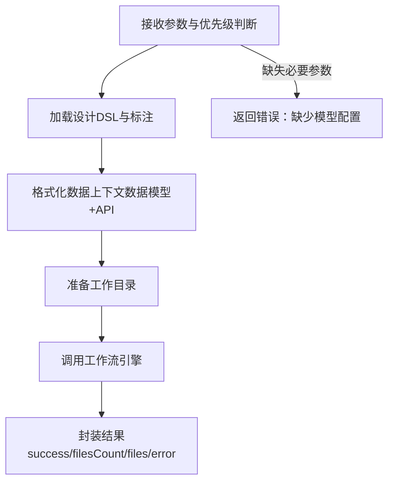
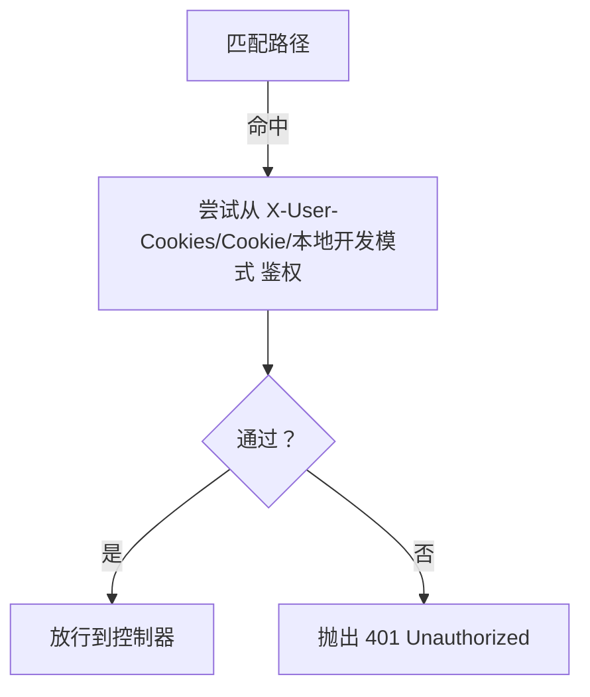
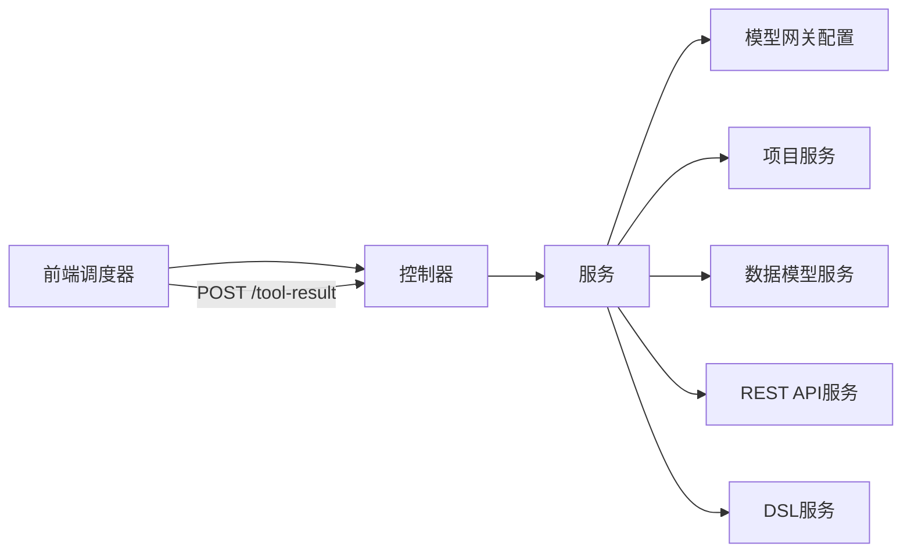

# 前端工作流API

<cite>
**本文引用的文件列表**
- [前端工作流控制器](file://code-agent-backend/src/controller/code-agent/frontend-workflow.ts)
- [前端工作流请求DTO](file://code-agent-backend/src/dto/code-agent/frontend-workflow.dto.ts)
- [前端工作流服务](file://code-agent-backend/src/service/code-agent/frontend-workflow.ts)
- [认证中间件](file://code-agent-backend/src/middleware/auth.ts)
- [应用配置（含鉴权规则）](file://code-agent-backend/src/config/config.default.ts)
- [前端工作流API文档](file://code-agent-backend/docs/frontend-workflow-api.md)
- [前端工作流调度器（前端侧）](file://fta-layout-design/src/pages/EditorPage/services/FrontendWorkflowScheduler.ts)
</cite>

## 目录
1. [简介](#简介)
2. [项目结构与入口](#项目结构与入口)
3. [核心组件](#核心组件)
4. [架构总览](#架构总览)
5. [详细组件分析](#详细组件分析)
6. [依赖关系分析](#依赖关系分析)
7. [性能与稳定性建议](#性能与稳定性建议)
8. [故障排查指南](#故障排查指南)
9. [结论](#结论)
10. [附录：使用示例与最佳实践](#附录使用示例与最佳实践)

## 简介
本文件面向前端与全栈开发者，系统化说明“前端工作流API”的使用方法与实现机制，重点覆盖以下方面：
- POST 接口路径与请求头要求
- 请求体结构与字段语义（FrontendWorkflowRequestDTO）
- SSE（Server-Sent Events）事件类型与数据格式
- 认证机制与中间件行为
- 前端使用 fetch-event-source 的完整TypeScript示例与流式响应处理
- 错误处理策略（断开连接监听、超时处理）

## 项目结构与入口
- 后端控制器位于 code-agent-backend/src/controller/code-agent/frontend-workflow.ts，提供 /code-agent/frontend-workflow 与 /code-agent/frontend-workflow/tool-result 两个端点。
- 请求体校验由 FrontendWorkflowRequestDTO 完成。
- 业务逻辑由 FrontendWorkflowService 执行，调用底层工作流引擎生成前端项目。
- 全局认证中间件 AuthMiddleware 通过配置启用，拦截匹配路径的请求。

图表来源
- [前端工作流控制器](file://code-agent-backend/src/controller/code-agent/frontend-workflow.ts#L83-L120)
- [前端工作流服务](file://code-agent-backend/src/service/code-agent/frontend-workflow.ts#L74-L120)
- [认证中间件](file://code-agent-backend/src/middleware/auth.ts#L162-L193)
- [应用配置（含鉴权规则）](file://code-agent-backend/src/config/config.default.ts#L123-L129)
- [前端工作流调度器（前端侧）](file://fta-layout-design/src/pages/EditorPage/services/FrontendWorkflowScheduler.ts#L130-L170)

章节来源
- [前端工作流控制器](file://code-agent-backend/src/controller/code-agent/frontend-workflow.ts#L83-L120)
- [前端工作流服务](file://code-agent-backend/src/service/code-agent/frontend-workflow.ts#L74-L120)
- [认证中间件](file://code-agent-backend/src/middleware/auth.ts#L162-L193)
- [应用配置（含鉴权规则）](file://code-agent-backend/src/config/config.default.ts#L123-L129)
- [前端工作流API文档](file://code-agent-backend/docs/frontend-workflow-api.md#L1-L40)

## 核心组件
- 接口路径
  - POST /code-agent/frontend-workflow
  - POST /code-agent/frontend-workflow/tool-result
- 请求头
  - Content-Type: application/json
  - Accept: text/event-stream（SSE）
- 请求体结构（FrontendWorkflowRequestDTO）
  - designDocId: string（必填）
  - productName?: string（可选，默认“FTA-Frontend”）
  - srcTree?: TreeNode（可选，源码树结构）
  - apiKey?: string（可选，优先使用）
  - baseURL?: string（可选，优先使用）
  - model?: string（可选，优先使用）
- SSE 响应头
  - Content-Type: text/event-stream; charset=utf-8
  - Cache-Control: no-cache
  - Connection: keep-alive

章节来源
- [前端工作流API文档](file://code-agent-backend/docs/frontend-workflow-api.md#L1-L40)
- [前端工作流控制器](file://code-agent-backend/src/controller/code-agent/frontend-workflow.ts#L83-L120)
- [前端工作流请求DTO](file://code-agent-backend/src/dto/code-agent/frontend-workflow.dto.ts#L1-L60)

## 架构总览
后端采用“控制器-服务”分层：
- 控制器负责HTTP与SSE交互、事件派发、异常处理与连接生命周期管理。
- 服务负责业务编排：加载DSL、聚合标注与数据模型、准备工作目录、调用工作流引擎、封装结果。
- 前端通过 fetch-event-source 或原生 fetch + ReadableStream 解析SSE事件，同时通过 /code-agent/frontend-workflow/tool-result 回传工具执行结果。

图表来源
- [前端工作流控制器](file://code-agent-backend/src/controller/code-agent/frontend-workflow.ts#L140-L310)
- [前端工作流服务](file://code-agent-backend/src/service/code-agent/frontend-workflow.ts#L170-L222)
- [前端工作流调度器（前端侧）](file://fta-layout-design/src/pages/EditorPage/services/FrontendWorkflowScheduler.ts#L130-L170)

## 详细组件分析

### 控制器：/code-agent/frontend-workflow 与 /code-agent/frontend-workflow/tool-result
- /code-agent/frontend-workflow
  - 设置SSE响应头，注册断开连接监听，包装 toolProxy 与各类回调（onMessage、onText、onStreamResult、onTurn），在工作流完成后发送 complete 事件并关闭连接。
  - 断开连接通过 AbortController 捕获，向客户端发送 aborted 事件。
  - 工作流异常时发送 error 事件并关闭连接。
- /code-agent/frontend-workflow/tool-result
  - 用于回传工具执行结果；根据 ToolResult.isError 决定 resolve/reject 对应的 pending 工具调用。

图表来源
- [前端工作流控制器](file://code-agent-backend/src/controller/code-agent/frontend-workflow.ts#L83-L310)

章节来源
- [前端工作流控制器](file://code-agent-backend/src/controller/code-agent/frontend-workflow.ts#L83-L310)

### 服务：前端工作流服务
- 参数优先级：请求参数 > 配置文件（modelGateway.default）> 抛错。
- 业务流程：获取DSL与标注摘要、聚合数据模型与REST API、准备工作目录、调用工作流引擎、返回标准化结果。
- 中断处理：在关键回调处检查 signal.aborted，抛出 AbortError，保证优雅退出。

图表来源
- [前端工作流服务](file://code-agent-backend/src/service/code-agent/frontend-workflow.ts#L74-L279)

章节来源
- [前端工作流服务](file://code-agent-backend/src/service/code-agent/frontend-workflow.ts#L74-L279)

### 认证中间件：全局鉴权
- 中间件启用规则：config.authMiddleware.match 匹配路径（示例包含 /api/、/custom/、.*）。
- 鉴权来源：X-User-Cookies 头、Cookie、本地开发模式。
- 未通过鉴权时抛出 401。

图表来源
- [认证中间件](file://code-agent-backend/src/middleware/auth.ts#L162-L193)
- [应用配置（含鉴权规则）](file://code-agent-backend/src/config/config.default.ts#L123-L129)

章节来源
- [认证中间件](file://code-agent-backend/src/middleware/auth.ts#L129-L160)
- [应用配置（含鉴权规则）](file://code-agent-backend/src/config/config.default.ts#L123-L129)

## 依赖关系分析
- 控制器依赖服务与上下文（Context）。
- 服务依赖模型网关配置（modelGateway.default）与若干业务服务（项目、数据模型、REST API、DSL处理）。
- 前端调度器依赖 ApiService、workstationConnector 与浏览器 fetch/ReadableStream。

图表来源
- [前端工作流控制器](file://code-agent-backend/src/controller/code-agent/frontend-workflow.ts#L83-L120)
- [前端工作流服务](file://code-agent-backend/src/service/code-agent/frontend-workflow.ts#L49-L83)
- [前端工作流调度器（前端侧）](file://fta-layout-design/src/pages/EditorPage/services/FrontendWorkflowScheduler.ts#L504-L511)

章节来源
- [前端工作流控制器](file://code-agent-backend/src/controller/code-agent/frontend-workflow.ts#L83-L120)
- [前端工作流服务](file://code-agent-backend/src/service/code-agent/frontend-workflow.ts#L49-L83)
- [前端工作流调度器（前端侧）](file://fta-layout-design/src/pages/EditorPage/services/FrontendWorkflowScheduler.ts#L504-L511)

## 性能与稳定性建议
- SSE 连接保持：服务端设置 keep-alive，前端需正确解析事件边界，避免阻塞主线程。
- 工具调用超时：后端对 tool_call 设置60秒超时，前端应在工具执行期间维持连接稳定。
- 中断处理：前端应监听 AbortController 信号，及时取消长任务，避免资源浪费。
- 日志与可观测性：服务端在关键节点打印日志，便于定位问题。

[本节为通用建议，不直接分析具体文件]

## 故障排查指南
- 401 未授权
  - 检查 X-User-Cookies 头或 Cookie 是否正确传递。
  - 确认中间件匹配规则与路径一致。
- 缺少模型配置
  - 请求参数或配置文件中未提供 apiKey/baseURL。
- 客户端断开
  - 控制器捕获 AbortController 信号，发送 aborted 事件；前端应据此清理UI状态。
- 工具调用超时
  - 前端在60秒内未回传 /tool-result，后端会拒绝并清理挂起调用。
- 错误事件
  - 控制器发送 error 事件，包含 message/stack/sessionId/executionTime 等字段。

章节来源
- [认证中间件](file://code-agent-backend/src/middleware/auth.ts#L129-L160)
- [前端工作流控制器](file://code-agent-backend/src/controller/code-agent/frontend-workflow.ts#L310-L366)
- [前端工作流服务](file://code-agent-backend/src/service/code-agent/frontend-workflow.ts#L74-L120)

## 结论
前端工作流API通过SSE实现实时流式输出，结合工具代理与结果回传，形成完整的前端项目生成闭环。配合全局认证中间件与严格的中断/超时处理，可在复杂场景下保持稳定与可控。前端侧可通过 fetch-event-source 或原生流式解析实现高效集成。

[本节为总结，不直接分析具体文件]

## 附录：使用示例与最佳实践

### 接口定义与请求体
- URL：POST /code-agent/frontend-workflow
- 请求头：Content-Type: application/json；Accept: text/event-stream
- 请求体字段（FrontendWorkflowRequestDTO）
  - designDocId: string（必填）
  - productName?: string（可选）
  - srcTree?: TreeNode（可选）
  - apiKey?: string（可选，优先使用）
  - baseURL?: string（可选，优先使用）
  - model?: string（可选，优先使用）

章节来源
- [前端工作流请求DTO](file://code-agent-backend/src/dto/code-agent/frontend-workflow.dto.ts#L1-L60)
- [前端工作流API文档](file://code-agent-backend/docs/frontend-workflow-api.md#L1-L40)

### SSE 事件类型与数据格式
- init（旧版文档提及，当前实现未见对应事件）
- message
  - 字段：role, content, uuid, parentUuid, timestamp
- text
  - 字段：text
- stream_result
  - 字段：requestId, model, hasError, error（可选）
- turn
  - 字段：usage, startTime, endTime
- tool_call
  - 字段：callId, toolName, params
- complete
  - 字段：success, sessionId, filesCount, files, executionTime, timestamp
- error
  - 字段：message, stack, sessionId, executionTime, timestamp
- aborted
  - 字段：message, sessionId, executionTime, timestamp

章节来源
- [前端工作流API文档](file://code-agent-backend/docs/frontend-workflow-api.md#L25-L138)
- [前端工作流控制器](file://code-agent-backend/src/controller/code-agent/frontend-workflow.ts#L196-L310)

### 认证机制
- 中间件启用：config.authMiddleware.match 匹配路径
- 鉴权来源：X-User-Cookies 头、Cookie、本地开发模式
- 未通过：抛出 401 Unauthorized

章节来源
- [认证中间件](file://code-agent-backend/src/middleware/auth.ts#L162-L193)
- [应用配置（含鉴权规则）](file://code-agent-backend/src/config/config.default.ts#L123-L129)

### 前端使用 fetch-event-source 的完整TypeScript示例
- 前端侧通过 fetch-event-source 或原生 fetch + ReadableStream 解析SSE事件。
- 建议：
  - 使用 AbortController 监听用户取消或页面卸载。
  - 对 message 事件进行 content 解析（字符串或数组），提取文本片段。
  - 对 tool_call 事件，调用 /code-agent/frontend-workflow/tool-result 回传 ToolResult。
  - 对 complete/error/aborted 事件，更新UI状态并清理资源。

章节来源
- [前端工作流API文档](file://code-agent-backend/docs/frontend-workflow-api.md#L203-L235)
- [前端工作流调度器（前端侧）](file://fta-layout-design/src/pages/EditorPage/services/FrontendWorkflowScheduler.ts#L130-L215)
- [前端工作流调度器（前端侧）](file://fta-layout-design/src/pages/EditorPage/services/FrontendWorkflowScheduler.ts#L295-L314)
- [前端工作流调度器（前端侧）](file://fta-layout-design/src/pages/EditorPage/services/FrontendWorkflowScheduler.ts#L504-L511)

### 错误处理策略
- 客户端断开连接
  - 监听 AbortController 信号，捕获 AbortError，停止后续操作。
- 超时处理
  - 工具调用默认60秒超时；前端应在超时前完成工具执行并回传结果。
- 服务端异常
  - 控制器发送 error 事件，前端展示错误信息并允许重试或回退。

章节来源
- [前端工作流控制器](file://code-agent-backend/src/controller/code-agent/frontend-workflow.ts#L176-L195)
- [前端工作流控制器](file://code-agent-backend/src/controller/code-agent/frontend-workflow.ts#L310-L366)
- [前端工作流调度器（前端侧）](file://fta-layout-design/src/pages/EditorPage/services/FrontendWorkflowScheduler.ts#L91-L125)