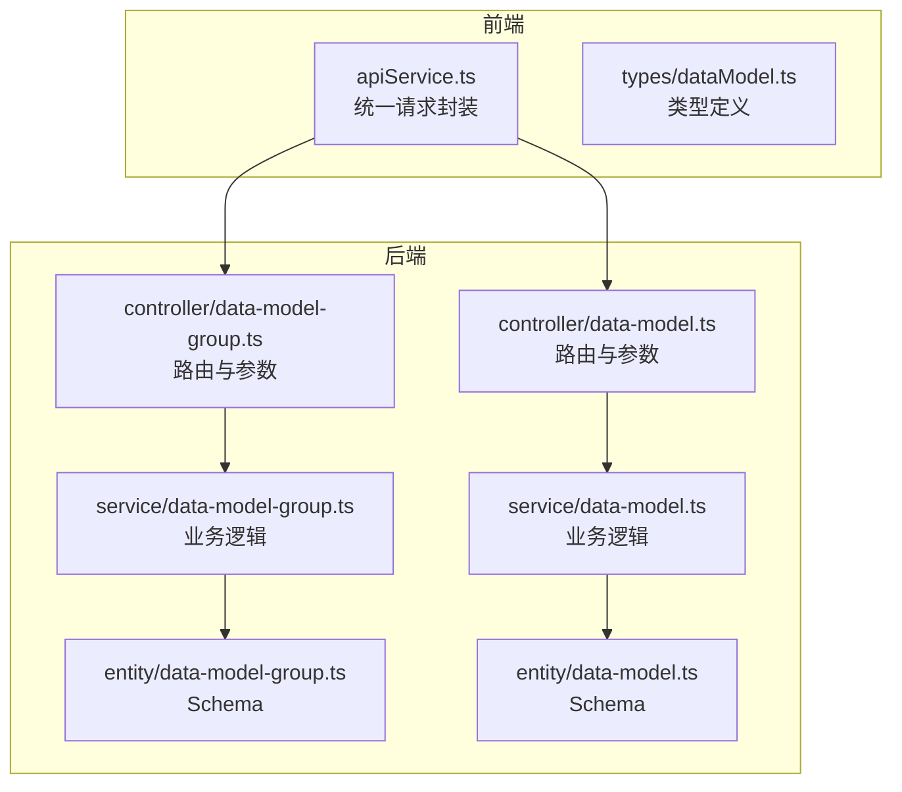
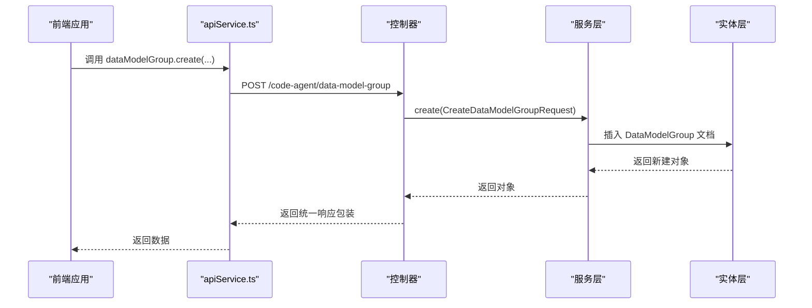
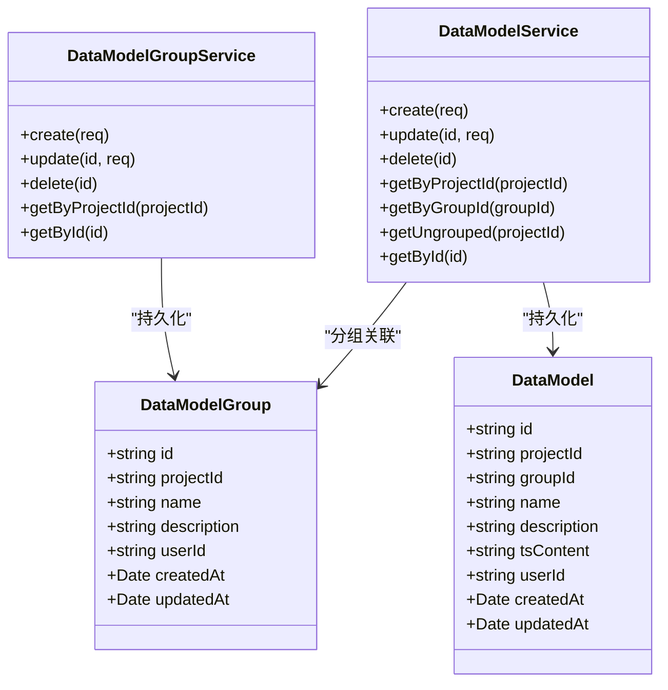
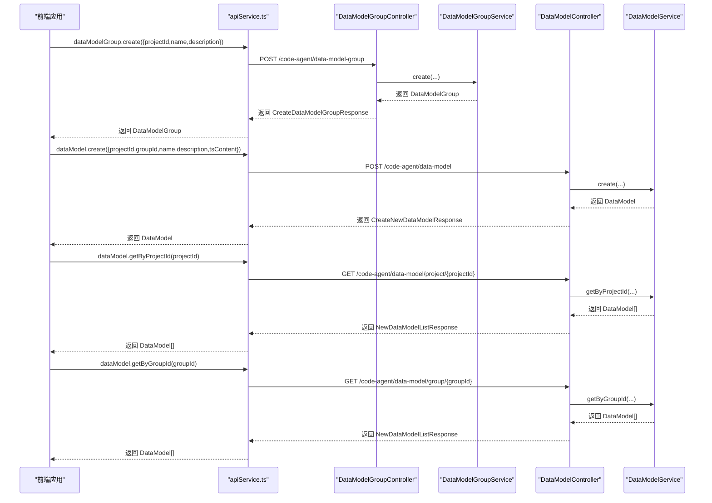

# 数据模型API

<cite>
**本文引用的文件**
- [code-agent-backend/src/controller/code-agent/data-model-group.ts](file://code-agent-backend/src/controller/code-agent/data-model-group.ts)
- [code-agent-backend/src/controller/code-agent/data-model.ts](file://code-agent-backend/src/controller/code-agent/data-model.ts)
- [code-agent-backend/src/service/code-agent/data-model-group.ts](file://code-agent-backend/src/service/code-agent/data-model-group.ts)
- [code-agent-backend/src/service/code-agent/data-model.ts](file://code-agent-backend/src/service/code-agent/data-model.ts)
- [code-agent-backend/src/entity/code-agent/data-model-group.ts](file://code-agent-backend/src/entity/code-agent/data-model-group.ts)
- [code-agent-backend/src/entity/code-agent/data-model.ts](file://code-agent-backend/src/entity/code-agent/data-model.ts)
- [code-agent-backend/src/dto/code-agent/req.ts](file://code-agent-backend/src/dto/code-agent/req.ts)
- [code-agent-backend/src/dto/code-agent/res.ts](file://code-agent-backend/src/dto/code-agent/res.ts)
- [fta-layout-design/src/config/api.ts](file://fta-layout-design/src/config/api.ts)
- [fta-layout-design/src/utils/apiService.ts](file://fta-layout-design/src/utils/apiService.ts)
- [fta-layout-design/src/services/dataModelService.ts](file://fta-layout-design/src/services/dataModelService.ts)
- [shared-types/src/dataModel.ts](file://shared-types/src/dataModel.ts)
- [fta-layout-design/src/types/dataModel.ts](file://fta-layout-design/src/types/dataModel.ts)
</cite>

## 目录
1. [简介](#简介)
2. [项目结构](#项目结构)
3. [核心组件](#核心组件)
4. [架构总览](#架构总览)
5. [详细组件分析](#详细组件分析)
6. [依赖分析](#依赖分析)
7. [性能考虑](#性能考虑)
8. [故障排查指南](#故障排查指南)
9. [结论](#结论)
10. [附录](#附录)

## 简介
本文件面向后端与前端开发者，系统化梳理“数据模型API”的设计与使用，覆盖数据模型组与数据模型两大资源的增删改查能力，并明确其父子关系与数据隔离策略（基于项目ID与分组ID）。文档同时给出各端点的请求参数、响应格式、错误处理与典型调用序列，帮助快速集成与排障。

## 项目结构
- 后端采用 Midway 控制器-服务-实体三层结构：
  - 控制器负责路由与参数校验，返回统一响应包装。
  - 服务层负责业务逻辑与数据访问，结合上下文鉴权与用户隔离。
  - 实体层定义 MongoDB Schema，承载数据模型组与数据模型的持久化结构。
- 前端通过统一的 API 工具封装请求，按端点路径调用后端接口。

图表来源
- [fta-layout-design/src/utils/apiService.ts](file://fta-layout-design/src/utils/apiService.ts#L708-L775)
- [code-agent-backend/src/controller/code-agent/data-model-group.ts](file://code-agent-backend/src/controller/code-agent/data-model-group.ts#L1-L104)
- [code-agent-backend/src/controller/code-agent/data-model.ts](file://code-agent-backend/src/controller/code-agent/data-model.ts#L1-L125)
- [code-agent-backend/src/service/code-agent/data-model-group.ts](file://code-agent-backend/src/service/code-agent/data-model-group.ts#L1-L156)
- [code-agent-backend/src/service/code-agent/data-model.ts](file://code-agent-backend/src/service/code-agent/data-model.ts#L1-L219)
- [code-agent-backend/src/entity/code-agent/data-model-group.ts](file://code-agent-backend/src/entity/code-agent/data-model-group.ts#L1-L48)
- [code-agent-backend/src/entity/code-agent/data-model.ts](file://code-agent-backend/src/entity/code-agent/data-model.ts#L1-L55)

章节来源
- [fta-layout-design/src/config/api.ts](file://fta-layout-design/src/config/api.ts#L32-L107)
- [code-agent-backend/src/controller/code-agent/data-model-group.ts](file://code-agent-backend/src/controller/code-agent/data-model-group.ts#L1-L104)
- [code-agent-backend/src/controller/code-agent/data-model.ts](file://code-agent-backend/src/controller/code-agent/data-model.ts#L1-L125)

## 核心组件
- 数据模型组（DataModelGroup）
  - 作用：在项目维度对数据模型进行分组管理，便于组织与检索。
  - 关键字段：id、projectId、name、description、userId、createdAt、updatedAt。
- 数据模型（DataModel）
  - 作用：以 TypeScript 接口定义为核心的数据结构描述，支持挂载到分组或未分组。
  - 关键字段：id、projectId、groupId（可选）、name、description、tsContent、userId、createdAt、updatedAt。
- 隔离策略
  - 通过 userId 与 projectId 进行用户级与项目级隔离，保证不同用户与项目间的数据互不可见。
  - 通过 groupId 建立父子关系：数据模型属于某个数据模型组（可为空表示未分组）。

章节来源
- [code-agent-backend/src/entity/code-agent/data-model-group.ts](file://code-agent-backend/src/entity/code-agent/data-model-group.ts#L1-L48)
- [code-agent-backend/src/entity/code-agent/data-model.ts](file://code-agent-backend/src/entity/code-agent/data-model.ts#L1-L55)
- [code-agent-backend/src/service/code-agent/data-model-group.ts](file://code-agent-backend/src/service/code-agent/data-model-group.ts#L36-L50)
- [code-agent-backend/src/service/code-agent/data-model.ts](file://code-agent-backend/src/service/code-agent/data-model.ts#L40-L54)

## 架构总览
- 前端通过 apiService.ts 的方法调用后端端点，端点由 API_ENDPOINTS 统一定义。
- 控制器将请求参数绑定到 DTO，并交由服务层执行业务逻辑。
- 服务层读取上下文中的用户信息，结合 projectId/groupId 进行数据隔离与查询。
- 实体层映射 MongoDB 集合，完成持久化。

图表来源
- [fta-layout-design/src/utils/apiService.ts](file://fta-layout-design/src/utils/apiService.ts#L708-L736)
- [code-agent-backend/src/controller/code-agent/data-model-group.ts](file://code-agent-backend/src/controller/code-agent/data-model-group.ts#L24-L36)
- [code-agent-backend/src/service/code-agent/data-model-group.ts](file://code-agent-backend/src/service/code-agent/data-model-group.ts#L55-L80)
- [code-agent-backend/src/entity/code-agent/data-model-group.ts](file://code-agent-backend/src/entity/code-agent/data-model-group.ts#L1-L48)

## 详细组件分析

### 数据模型组 API

- 端点与方法
  - POST /code-agent/data-model-group
    - 功能：创建数据模型组
    - 请求体：CreateDataModelGroupRequest
    - 响应体：CreateDataModelGroupResponse
  - PUT /code-agent/data-model-group/{id}
    - 功能：更新数据模型组
    - 路径参数：id
    - 请求体：UpdateDataModelGroupRequest
    - 响应体：UpdateDataModelGroupResponse
  - DELETE /code-agent/data-model-group/{id}
    - 功能：删除数据模型组
    - 路径参数：id
    - 响应体：DeleteDataModelGroupResponse
  - GET /code-agent/data-model-group/project/{projectId}
    - 功能：获取项目的所有数据模型组
    - 路径参数：projectId
    - 响应体：DataModelGroupListResponse
  - GET /code-agent/data-model-group/{id}
    - 功能：获取单个数据模型组详情
    - 路径参数：id
    - 响应体：DataModelGroupDetailResponse

- 请求参数与响应格式
  - 请求参数
    - CreateDataModelGroupRequest：projectId、name、description
    - UpdateDataModelGroupRequest：name、description
  - 响应格式
    - 成功：BaseResponse 或 List/Detail 包装，包含 data、message、code、success
    - 失败：根据控制器设置状态码并抛出异常

- 数据隔离与权限
  - 服务层解析上下文中的用户ID，仅允许操作当前用户下的项目数据。
  - 查询按 projectId 与 userId 过滤，避免跨用户/跨项目访问。

- 错误处理
  - 不存在或无权限：返回 400/404/500，控制器设置对应状态码并抛错。
  - 参数校验：控制器使用 DTO，服务层进一步校验项目存在性。

章节来源
- [code-agent-backend/src/controller/code-agent/data-model-group.ts](file://code-agent-backend/src/controller/code-agent/data-model-group.ts#L24-L101)
- [code-agent-backend/src/dto/code-agent/req.ts](file://code-agent-backend/src/dto/code-agent/req.ts#L439-L457)
- [code-agent-backend/src/dto/code-agent/res.ts](file://code-agent-backend/src/dto/code-agent/res.ts#L255-L294)
- [code-agent-backend/src/service/code-agent/data-model-group.ts](file://code-agent-backend/src/service/code-agent/data-model-group.ts#L55-L154)

### 数据模型 API

- 端点与方法
  - POST /code-agent/data-model
    - 功能：创建数据模型
    - 请求体：CreateNewDataModelRequest
    - 响应体：CreateNewDataModelResponse
  - PUT /code-agent/data-model/{id}
    - 功能：更新数据模型
    - 路径参数：id
    - 请求体：UpdateNewDataModelRequest
    - 响应体：UpdateNewDataModelResponse
  - DELETE /code-agent/data-model/{id}
    - 功能：删除数据模型
    - 路径参数：id
    - 响应体：DeleteNewDataModelResponse
  - GET /code-agent/data-model/project/{projectId}
    - 功能：获取项目的所有数据模型
    - 路径参数：projectId
    - 响应体：NewDataModelListResponse
  - GET /code-agent/data-model/group/{groupId}
    - 功能：获取分组内的数据模型
    - 路径参数：groupId
    - 响应体：NewDataModelListResponse
  - GET /code-agent/data-model/project/{projectId}/ungrouped
    - 功能：获取未分组的数据模型
    - 路径参数：projectId
    - 响应体：NewDataModelListResponse
  - GET /code-agent/data-model/{id}
    - 功能：获取单个数据模型详情
    - 路径参数：id
    - 响应体：NewDataModelDetailResponse

- 请求参数与响应格式
  - 请求参数
    - CreateNewDataModelRequest：projectId、groupId（可选）、name、description、tsContent
    - UpdateNewDataModelRequest：groupId（可设为 null 移出分组）、name、description、tsContent
  - 响应格式
    - 成功：BaseResponse 或 List/Detail 包装，包含 data、message、code、success
    - 失败：根据控制器设置状态码并抛错

- 数据隔离与权限
  - 服务层解析上下文中的用户ID，仅允许操作当前用户下的项目数据。
  - 查询按 projectId/groupId/未分组条件与 userId 过滤。

- 错误处理
  - 不存在或无权限：返回 400/404/500，控制器设置对应状态码并抛错。
  - 更新支持将 groupId 设为 null，实现从分组移出。

章节来源
- [code-agent-backend/src/controller/code-agent/data-model.ts](file://code-agent-backend/src/controller/code-agent/data-model.ts#L21-L124)
- [code-agent-backend/src/dto/code-agent/req.ts](file://code-agent-backend/src/dto/code-agent/req.ts#L460-L489)
- [code-agent-backend/src/dto/code-agent/res.ts](file://code-agent-backend/src/dto/code-agent/res.ts#L296-L338)
- [code-agent-backend/src/service/code-agent/data-model.ts](file://code-agent-backend/src/service/code-agent/data-model.ts#L59-L218)

### 前端调用与类型定义

- 端点路径
  - 数据模型组：/code-agent/data-model-group
  - 数据模型：/code-agent/data-model
- 前端封装
  - apiService.ts 提供统一请求方法，按 API_ENDPOINTS 构建完整 URL。
  - dataModelService.ts 对接后端，封装 create/update/delete/list/detail 等常用操作。
- 类型定义
  - shared-types/src/dataModel.ts 定义 DataModelDefinition、CreateDataModelRequest、UpdateDataModelRequest。
  - fta-layout-design/src/types/dataModel.ts 重导出共享类型并补充前端侧接口定义。

章节来源
- [fta-layout-design/src/config/api.ts](file://fta-layout-design/src/config/api.ts#L90-L107)
- [fta-layout-design/src/utils/apiService.ts](file://fta-layout-design/src/utils/apiService.ts#L708-L775)
- [fta-layout-design/src/services/dataModelService.ts](file://fta-layout-design/src/services/dataModelService.ts#L1-L132)
- [shared-types/src/dataModel.ts](file://shared-types/src/dataModel.ts#L1-L54)
- [fta-layout-design/src/types/dataModel.ts](file://fta-layout-design/src/types/dataModel.ts#L1-L89)

## 依赖分析

图表来源
- [code-agent-backend/src/entity/code-agent/data-model-group.ts](file://code-agent-backend/src/entity/code-agent/data-model-group.ts#L1-L48)
- [code-agent-backend/src/entity/code-agent/data-model.ts](file://code-agent-backend/src/entity/code-agent/data-model.ts#L1-L55)
- [code-agent-backend/src/service/code-agent/data-model-group.ts](file://code-agent-backend/src/service/code-agent/data-model-group.ts#L1-L156)
- [code-agent-backend/src/service/code-agent/data-model.ts](file://code-agent-backend/src/service/code-agent/data-model.ts#L1-L219)

章节来源
- [code-agent-backend/src/service/code-agent/data-model-group.ts](file://code-agent-backend/src/service/code-agent/data-model-group.ts#L1-L156)
- [code-agent-backend/src/service/code-agent/data-model.ts](file://code-agent-backend/src/service/code-agent/data-model.ts#L1-L219)

## 性能考虑
- 查询排序与索引建议
  - 按 createdAt 倒序返回，适合在集合上建立复合索引：{ projectId: 1, userId: 1, createdAt: -1 }，提升分页与筛选性能。
  - 分组查询按 groupId 建立索引：{ groupId: 1, userId: 1 }，优化分组内模型检索。
- 批量操作
  - 若需批量更新/删除，可在服务层合并为单次事务或批量写入，减少往返次数。
- 前端缓存
  - 对于只读列表与详情，建议前端做轻量缓存，避免重复请求相同数据。

[本节为通用指导，无需特定文件引用]

## 故障排查指南
- 常见错误与定位
  - 400/404/500：控制器在异常分支设置状态码并抛错，检查请求参数与资源是否存在。
  - 用户ID缺失：服务层解析用户ID失败会抛错，确认登录态与上下文注入。
  - 项目不存在：创建/更新/查询前先校验项目存在性。
- 前端错误处理
  - apiService.ts 统一校验响应 code/success，非成功响应抛出 ApiError，前端捕获并提示。
  - 超时/网络错误：统一捕获并返回相应错误码，便于前端展示与重试。

章节来源
- [code-agent-backend/src/controller/code-agent/data-model-group.ts](file://code-agent-backend/src/controller/code-agent/data-model-group.ts#L37-L101)
- [code-agent-backend/src/controller/code-agent/data-model.ts](file://code-agent-backend/src/controller/code-agent/data-model.ts#L21-L124)
- [code-agent-backend/src/service/code-agent/data-model-group.ts](file://code-agent-backend/src/service/code-agent/data-model-group.ts#L36-L50)
- [code-agent-backend/src/service/code-agent/data-model.ts](file://code-agent-backend/src/service/code-agent/data-model.ts#L40-L54)
- [fta-layout-design/src/utils/apiService.ts](file://fta-layout-design/src/utils/apiService.ts#L1-L150)

## 结论
- 数据模型组与数据模型通过 projectId 与 groupId 实现清晰的数据隔离与父子关系。
- 后端提供完善的 CRUD 与查询接口，前端通过 apiService 与 dataModelService 封装调用。
- 建议在生产环境完善索引、缓存与错误监控，保障性能与稳定性。

[本节为总结，无需特定文件引用]

## 附录

### 端点一览与调用序列示例

- 创建数据模型组并为其添加数据模型（完整调用序列）
  1) 前端调用
     - POST /code-agent/data-model-group
     - 请求体：{ projectId, name, description }
     - 返回：DataModelGroup
  2) 前端调用
     - POST /code-agent/data-model
     - 请求体：{ projectId, groupId（来自步骤1返回的 id），name, description, tsContent }
     - 返回：DataModel
  3) 前端调用
     - GET /code-agent/data-model/project/{projectId}
     - 返回：DataModel[]（包含步骤2创建的模型）
  4) 前端调用
     - GET /code-agent/data-model/group/{groupId}
     - 返回：DataModel[]（仅包含步骤2创建的模型）

图表来源
- [fta-layout-design/src/utils/apiService.ts](file://fta-layout-design/src/utils/apiService.ts#L708-L775)
- [code-agent-backend/src/controller/code-agent/data-model-group.ts](file://code-agent-backend/src/controller/code-agent/data-model-group.ts#L24-L36)
- [code-agent-backend/src/controller/code-agent/data-model.ts](file://code-agent-backend/src/controller/code-agent/data-model.ts#L21-L47)
- [code-agent-backend/src/service/code-agent/data-model-group.ts](file://code-agent-backend/src/service/code-agent/data-model-group.ts#L55-L80)
- [code-agent-backend/src/service/code-agent/data-model.ts](file://code-agent-backend/src/service/code-agent/data-model.ts#L59-L86)

### 请求参数与响应格式对照

- 数据模型组
  - POST /code-agent/data-model-group
    - 请求体：CreateDataModelGroupRequest
      - projectId: string
      - name: string
      - description?: string
    - 响应体：CreateDataModelGroupResponse
  - PUT /code-agent/data-model-group/{id}
    - 请求体：UpdateDataModelGroupRequest
      - name?: string
      - description?: string
    - 响应体：UpdateDataModelGroupResponse
  - DELETE /code-agent/data-model-group/{id}
    - 响应体：DeleteDataModelGroupResponse
  - GET /code-agent/data-model-group/project/{projectId}
    - 响应体：DataModelGroupListResponse
  - GET /code-agent/data-model-group/{id}
    - 响应体：DataModelGroupDetailResponse

- 数据模型
  - POST /code-agent/data-model
    - 请求体：CreateNewDataModelRequest
      - projectId: string
      - groupId?: string
      - name: string
      - description?: string
      - tsContent?: string
    - 响应体：CreateNewDataModelResponse
  - PUT /code-agent/data-model/{id}
    - 请求体：UpdateNewDataModelRequest
      - groupId?: string | null
      - name?: string
      - description?: string
      - tsContent?: string
    - 响应体：UpdateNewDataModelResponse
  - DELETE /code-agent/data-model/{id}
    - 响应体：DeleteNewDataModelResponse
  - GET /code-agent/data-model/project/{projectId}
    - 响应体：NewDataModelListResponse
  - GET /code-agent/data-model/group/{groupId}
    - 响应体：NewDataModelListResponse
  - GET /code-agent/data-model/project/{projectId}/ungrouped
    - 响应体：NewDataModelListResponse
  - GET /code-agent/data-model/{id}
    - 响应体：NewDataModelDetailResponse

章节来源
- [code-agent-backend/src/dto/code-agent/req.ts](file://code-agent-backend/src/dto/code-agent/req.ts#L439-L489)
- [code-agent-backend/src/dto/code-agent/res.ts](file://code-agent-backend/src/dto/code-agent/res.ts#L255-L338)
- [fta-layout-design/src/config/api.ts](file://fta-layout-design/src/config/api.ts#L90-L107)