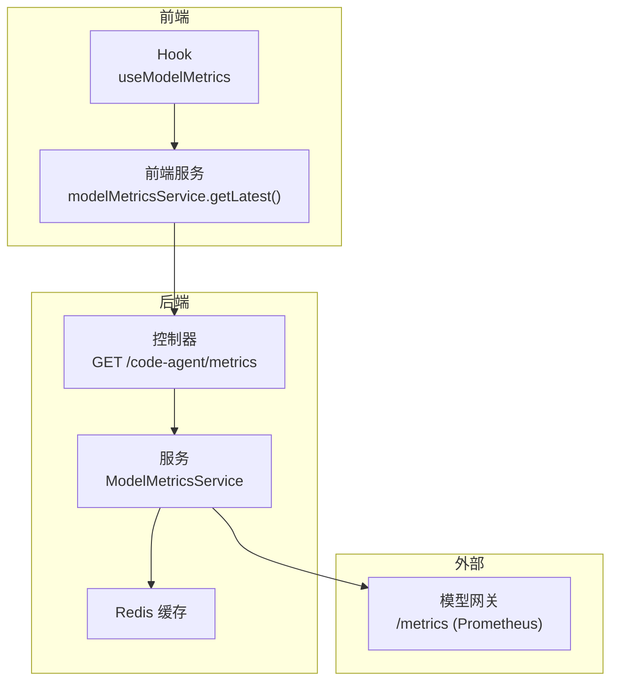
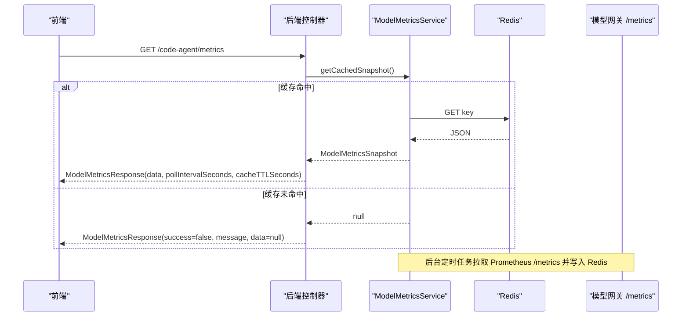
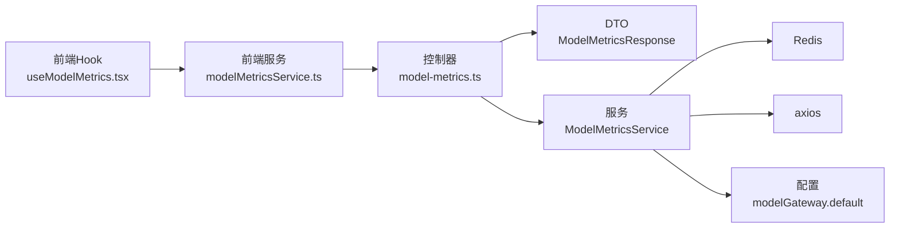

# 模型指标API

<cite>
**本文引用的文件列表**
- [code-agent-backend/src/controller/code-agent/model-metrics.ts](file://code-agent-backend/src/controller/code-agent/model-metrics.ts)
- [code-agent-backend/src/dto/model-metrics.ts](file://code-agent-backend/src/dto/model-metrics.ts)
- [code-agent-backend/src/service/common/model-metrics.service.ts](file://code-agent-backend/src/service/common/model-metrics.service.ts)
- [shared-types/src/modelMetrics.ts](file://shared-types/src/modelMetrics.ts)
- [fta-layout-design/src/services/modelMetricsService.ts](file://fta-layout-design/src/services/modelMetricsService.ts)
- [fta-layout-design/src/pages/EditorPage/components/LayerTreePanel/useModelMetrics.tsx](file://fta-layout-design/src/pages/EditorPage/components/LayerTreePanel/useModelMetrics.tsx)
- [code-agent-backend/src/config/config.default.ts](file://code-agent-backend/src/config/config.default.ts)
- [CLAUDE.md](file://CLAUDE.md)
</cite>

## 目录
1. [简介](#简介)
2. [项目结构](#项目结构)
3. [核心组件](#核心组件)
4. [架构总览](#架构总览)
5. [详细组件分析](#详细组件分析)
6. [依赖关系分析](#依赖关系分析)
7. [性能与可靠性](#性能与可靠性)
8. [故障排查指南](#故障排查指南)
9. [结论](#结论)
10. [附录](#附录)

## 简介
本文件面向开发者，系统性说明“模型指标API”的设计与实现，重点覆盖后端控制器 GET /code-agent/metrics 端点、响应结构 ModelMetricsResponse 及其 data 字段（ModelMetricsSnapshot），以及后端定时任务从模型网关的 Prometheus 格式 /metrics 拉取并缓存到 Redis 的机制。同时提供前端 modelMetricsService.ts 中 getLatest 方法的调用示例与错误处理、降级策略说明，帮助快速集成与排障。

## 项目结构
围绕模型指标API的关键文件分布如下：
- 后端控制器与DTO：负责对外暴露 GET /code-agent/metrics，封装响应结构。
- 后端服务：负责定时轮询 Prometheus /metrics、解析、缓存到 Redis。
- 共享类型：定义 ModelMetricsSnapshot 与 ModelMetricsApiResponse 的结构。
- 前端服务与Hook：负责调用后端API、展示状态与错误处理。

图表来源
- [code-agent-backend/src/controller/code-agent/model-metrics.ts](file://code-agent-backend/src/controller/code-agent/model-metrics.ts#L1-L31)
- [code-agent-backend/src/service/common/model-metrics.service.ts](file://code-agent-backend/src/service/common/model-metrics.service.ts#L1-L120)
- [shared-types/src/modelMetrics.ts](file://shared-types/src/modelMetrics.ts#L1-L64)
- [fta-layout-design/src/services/modelMetricsService.ts](file://fta-layout-design/src/services/modelMetricsService.ts#L1-L33)
- [fta-layout-design/src/pages/EditorPage/components/LayerTreePanel/useModelMetrics.tsx](file://fta-layout-design/src/pages/EditorPage/components/LayerTreePanel/useModelMetrics.tsx#L1-L77)

章节来源
- [code-agent-backend/src/controller/code-agent/model-metrics.ts](file://code-agent-backend/src/controller/code-agent/model-metrics.ts#L1-L31)
- [code-agent-backend/src/service/common/model-metrics.service.ts](file://code-agent-backend/src/service/common/model-metrics.service.ts#L1-L120)
- [shared-types/src/modelMetrics.ts](file://shared-types/src/modelMetrics.ts#L1-L64)
- [fta-layout-design/src/services/modelMetricsService.ts](file://fta-layout-design/src/services/modelMetricsService.ts#L1-L33)
- [fta-layout-design/src/pages/EditorPage/components/LayerTreePanel/useModelMetrics.tsx](file://fta-layout-design/src/pages/EditorPage/components/LayerTreePanel/useModelMetrics.tsx#L1-L77)

## 核心组件
- 后端控制器：提供 GET /code-agent/metrics，读取缓存快照，构造 ModelMetricsResponse。
- 后端服务：定时轮询 Prometheus /metrics，解析为 ModelMetricsSnapshot 并写入 Redis；提供缓存读取与轮询周期、缓存TTL查询。
- 共享类型：定义 ModelMetricsSnapshot 与 ModelMetricsApiResponse 的字段与语义。
- 前端服务：封装调用后端 API 的 getLatest 方法，包含错误捕获与降级回退。
- 前端 Hook：消费后端返回，计算模型状态（忙碌/空闲/未知/错误），并格式化显示。

章节来源
- [code-agent-backend/src/controller/code-agent/model-metrics.ts](file://code-agent-backend/src/controller/code-agent/model-metrics.ts#L1-L31)
- [code-agent-backend/src/dto/model-metrics.ts](file://code-agent-backend/src/dto/model-metrics.ts#L1-L20)
- [code-agent-backend/src/service/common/model-metrics.service.ts](file://code-agent-backend/src/service/common/model-metrics.service.ts#L1-L120)
- [shared-types/src/modelMetrics.ts](file://shared-types/src/modelMetrics.ts#L1-L64)
- [fta-layout-design/src/services/modelMetricsService.ts](file://fta-layout-design/src/services/modelMetricsService.ts#L1-L33)
- [fta-layout-design/src/pages/EditorPage/components/LayerTreePanel/useModelMetrics.tsx](file://fta-layout-design/src/pages/EditorPage/components/LayerTreePanel/useModelMetrics.tsx#L1-L77)

## 架构总览
后端通过 ModelMetricsService 在后台定时任务中拉取 Prometheus /metrics，解析为 ModelMetricsSnapshot 并写入 Redis；前端通过 GET /code-agent/metrics 获取最近一次成功采集的快照，并携带 pollIntervalSeconds 与 cacheTTLSeconds 两个元数据字段，指导前端刷新节奏与缓存策略。

图表来源
- [code-agent-backend/src/controller/code-agent/model-metrics.ts](file://code-agent-backend/src/controller/code-agent/model-metrics.ts#L1-L31)
- [code-agent-backend/src/service/common/model-metrics.service.ts](file://code-agent-backend/src/service/common/model-metrics.service.ts#L44-L144)
- [code-agent-backend/src/dto/model-metrics.ts](file://code-agent-backend/src/dto/model-metrics.ts#L1-L20)

## 详细组件分析

### 后端控制器：GET /code-agent/metrics
- 职责：读取缓存快照，构造 ModelMetricsResponse，若缓存为空则返回 503。
- 关键点：
  - 通过 ModelMetricsService.getPollIntervalSeconds() 与 getCacheTTLSeconds() 返回前端刷新与缓存策略提示。
  - 当缓存为空时，设置 success=false、message，并返回 503。

章节来源
- [code-agent-backend/src/controller/code-agent/model-metrics.ts](file://code-agent-backend/src/controller/code-agent/model-metrics.ts#L1-L31)
- [code-agent-backend/src/dto/model-metrics.ts](file://code-agent-backend/src/dto/model-metrics.ts#L1-L20)

### 后端服务：ModelMetricsService
- 定时轮询：
  - 仅在非特定提供商（bigmodel、openrouter、volces）时启动轮询。
  - 使用 Redis SET NX EX 实现分布式锁，避免并发重复拉取。
  - 拉取频率：固定轮询周期（秒级）；缓存TTL：固定秒数。
- Prometheus 拉取与解析：
  - 从 modelGateway.default.baseURL 构造 /metrics URL（去除末尾斜杠与 /v1）。
  - 支持 Authorization 头（Bearer apiKey）。
  - 解析 Prometheus 文本格式，按指标名聚合/计算派生指标（如吞吐、首token耗时、前缀缓存命中率等）。
- 缓存：
  - 将解析后的快照以 JSON 形式写入 Redis，带 TTL。

章节来源
- [code-agent-backend/src/service/common/model-metrics.service.ts](file://code-agent-backend/src/service/common/model-metrics.service.ts#L1-L120)
- [code-agent-backend/src/service/common/model-metrics.service.ts](file://code-agent-backend/src/service/common/model-metrics.service.ts#L101-L192)
- [code-agent-backend/src/service/common/model-metrics.service.ts](file://code-agent-backend/src/service/common/model-metrics.service.ts#L185-L310)
- [code-agent-backend/src/config/config.default.ts](file://code-agent-backend/src/config/config.default.ts#L214-L228)

### 响应结构：ModelMetricsResponse 与 ModelMetricsSnapshot
- ModelMetricsResponse
  - data：ModelMetricsSnapshot 或 null
  - pollIntervalSeconds：后端轮询周期（秒）
  - cacheTTLSeconds：Redis 缓存有效期（秒）
- ModelMetricsSnapshot（关键字段说明）
  - modelName：模型名称（来自标签或配置）
  - fetchedAt：采集时间戳（毫秒）
  - throughput：解码阶段整体吞吐（tokens/s）
  - tpot：每个输出token耗时（seconds/token）
  - ttft：首token耗时（seconds）
  - numRequestsRunning：当前运行中的请求数
  - numRequestsWaiting：等待调度的请求数
  - kvCacheUsagePerc：KV缓存使用率（0-1）
  - promptTokensTotal：已处理的前缀 tokens 总量
  - generationTokensTotal：已生成 tokens 总量
  - requestSuccessTotal：成功请求数量（含不同 finish reason 的总和）
  - requestSuccessByReason：不同 finish reason 对应的成功请求数量
  - prefixCacheHitRate：前缀缓存命中率（0-1）
  - prefixCacheHitsTotal：前缀缓存命中次数
  - prefixCacheQueriesTotal：前缀缓存查询次数

章节来源
- [shared-types/src/modelMetrics.ts](file://shared-types/src/modelMetrics.ts#L1-L64)
- [code-agent-backend/src/dto/model-metrics.ts](file://code-agent-backend/src/dto/model-metrics.ts#L1-L20)
- [code-agent-backend/src/service/common/model-metrics.service.ts](file://code-agent-backend/src/service/common/model-metrics.service.ts#L185-L310)

### 前端调用与错误处理：modelMetricsService.getLatest()
- 调用方式：通过 api.metrics.latest<ModelMetricsSnapshot | null>() 获取最新指标。
- 错误处理与降级：
  - 若捕获到 ApiError 且响应可克隆为 JSON，则尝试读取后端返回的 message、data、pollIntervalSeconds、cacheTTLSeconds，并将 success 设为 false，返回给调用方。
  - 若无法解析响应体，则抛出原始错误。
- 使用建议：
  - 结合 pollIntervalSeconds 与 cacheTTLSeconds 设置前端轮询节拍与本地缓存策略。
  - 当 data 为 null 时，前端应提示“暂无可用指标”或采用降级显示。

章节来源
- [fta-layout-design/src/services/modelMetricsService.ts](file://fta-layout-design/src/services/modelMetricsService.ts#L1-L33)

### 前端状态评估与展示：useModelMetrics
- 状态判定规则：
  - 若 snapshot 为空：unknown
  - 若 numRequestsRunning > 0 或 numRequestsWaiting > 0 或 kvCacheUsagePerc ≥ 0.85：busy
  - 否则：idle
- 展示辅助：
  - 百分比格式化与时间戳格式化。
  - 将后端 message（非“Success”时）作为状态提示。

章节来源
- [fta-layout-design/src/pages/EditorPage/components/LayerTreePanel/useModelMetrics.tsx](file://fta-layout-design/src/pages/EditorPage/components/LayerTreePanel/useModelMetrics.tsx#L1-L77)

## 依赖关系分析
- 后端
  - 控制器依赖服务层，服务层依赖 Redis 与 axios。
  - Prometheus /metrics 来自 modelGateway.default.baseURL。
- 前端
  - 通过统一 API 服务访问后端；Hook 消费服务返回值并渲染。

图表来源
- [code-agent-backend/src/controller/code-agent/model-metrics.ts](file://code-agent-backend/src/controller/code-agent/model-metrics.ts#L1-L31)
- [code-agent-backend/src/dto/model-metrics.ts](file://code-agent-backend/src/dto/model-metrics.ts#L1-L20)
- [code-agent-backend/src/service/common/model-metrics.service.ts](file://code-agent-backend/src/service/common/model-metrics.service.ts#L1-L120)
- [code-agent-backend/src/config/config.default.ts](file://code-agent-backend/src/config/config.default.ts#L214-L228)
- [fta-layout-design/src/services/modelMetricsService.ts](file://fta-layout-design/src/services/modelMetricsService.ts#L1-L33)
- [fta-layout-design/src/pages/EditorPage/components/LayerTreePanel/useModelMetrics.tsx](file://fta-layout-design/src/pages/EditorPage/components/LayerTreePanel/useModelMetrics.tsx#L1-L77)

## 性能与可靠性
- 轮询与缓存
  - 后端固定轮询周期与缓存TTL，前端据此设置本地轮询节拍与缓存过期策略，避免频繁请求与抖动。
- 分布式锁
  - 使用 Redis SET NX EX 实现互斥，避免多实例并发拉取导致的资源浪费与数据竞争。
- Prometheus 解析
  - 采用行级解析与正则匹配，对注释行与无效行进行跳过，保证健壮性。
- 错误隔离
  - 拉取失败与解析失败均记录日志并返回 null，前端可降级显示。

章节来源
- [code-agent-backend/src/service/common/model-metrics.service.ts](file://code-agent-backend/src/service/common/model-metrics.service.ts#L68-L120)
- [code-agent-backend/src/service/common/model-metrics.service.ts](file://code-agent-backend/src/service/common/model-metrics.service.ts#L158-L183)
- [code-agent-backend/src/service/common/model-metrics.service.ts](file://code-agent-backend/src/service/common/model-metrics.service.ts#L185-L310)

## 故障排查指南
- 后端未返回指标
  - 现象：GET /code-agent/metrics 返回 success=false、message、data=null，HTTP 503。
  - 排查：确认 Redis 是否有缓存；检查 modelGateway.default.baseURL 是否配置；确认 /metrics 可达且返回 Prometheus 文本。
- 指标为空或不更新
  - 现象：data 为 null 或 fetchedAt 未变化。
  - 排查：检查轮询是否被禁用（特定提供商）；查看服务初始化逻辑；确认 Redis 连接正常。
- 前端调用异常
  - 现象：getLatest 抛错或返回降级数据。
  - 排查：确认后端返回的 message、pollIntervalSeconds、cacheTTLSeconds 是否存在；检查网络与跨域；必要时使用降级回退逻辑。
- 模型网关配置
  - 确认 OPENAI_BASE_URL、OPENAI_API_KEY、MODEL_TIMEOUT、OPENAI_MODEL 等环境变量正确配置。

章节来源
- [code-agent-backend/src/controller/code-agent/model-metrics.ts](file://code-agent-backend/src/controller/code-agent/model-metrics.ts#L1-L31)
- [code-agent-backend/src/service/common/model-metrics.service.ts](file://code-agent-backend/src/service/common/model-metrics.service.ts#L1-L120)
- [code-agent-backend/src/config/config.default.ts](file://code-agent-backend/src/config/config.default.ts#L214-L228)
- [CLAUDE.md](file://CLAUDE.md#L51-L61)

## 结论
模型指标API通过“后端定时拉取 + Redis 缓存 + 前端友好展示”的模式，实现了稳定、低延迟的指标可视化能力。后端以 Prometheus 文本格式解析关键指标，前端基于返回的元数据合理安排轮询与缓存，整体具备良好的可维护性与扩展性。

## 附录

### API 定义与调用示例
- 端点：GET /code-agent/metrics
- 响应：ModelMetricsResponse
  - data：ModelMetricsSnapshot | null
  - pollIntervalSeconds：number
  - cacheTTLSeconds：number
- 前端调用示例（路径参考）
  - 前端服务：[fta-layout-design/src/services/modelMetricsService.ts](file://fta-layout-design/src/services/modelMetricsService.ts#L1-L33)
  - 前端Hook：[fta-layout-design/src/pages/EditorPage/components/LayerTreePanel/useModelMetrics.tsx](file://fta-layout-design/src/pages/EditorPage/components/LayerTreePanel/useModelMetrics.tsx#L1-L77)

### Prometheus 指标映射与派生指标
- 原始指标
  - vllm:num_requests_running
  - vllm:num_requests_waiting
  - vllm:kv_cache_usage_perc
  - vllm:prompt_tokens_total
  - vllm:generation_tokens_total
  - vllm:request_success_total（含 finished_reason 标签）
  - vllm:prefix_cache_hits_total
  - vllm:prefix_cache_queries_total
  - vllm:request_decode_time_seconds_sum
  - vllm:request_prefill_time_seconds_sum
  - vllm:request_prefill_time_seconds_count
- 派生指标
  - throughput = generationTokensTotal / decodeTimeSum
  - tpot = decodeTimeSum / generationTokensTotal
  - ttft = prefillTimeSum / prefillTimeCount
  - prefixCacheHitRate = prefixCacheHitsTotal / prefixCacheQueriesTotal
  - requestSuccessByReason：按 finish reason 聚合统计

章节来源
- [code-agent-backend/src/service/common/model-metrics.service.ts](file://code-agent-backend/src/service/common/model-metrics.service.ts#L185-L310)