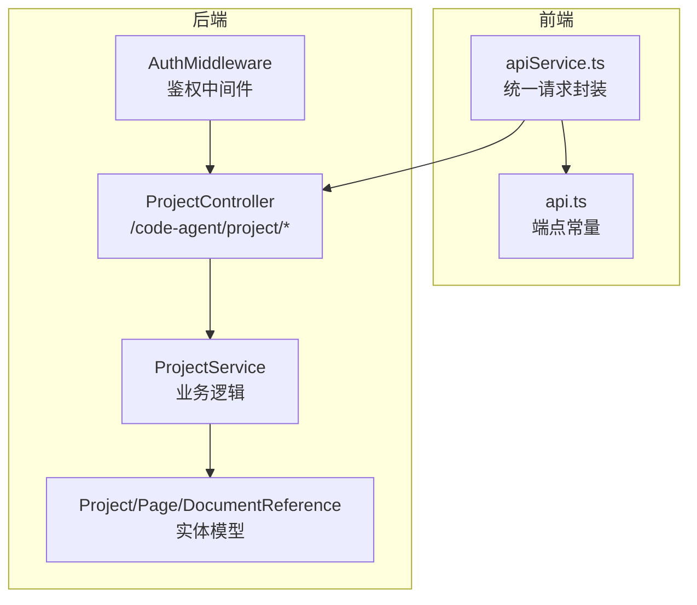
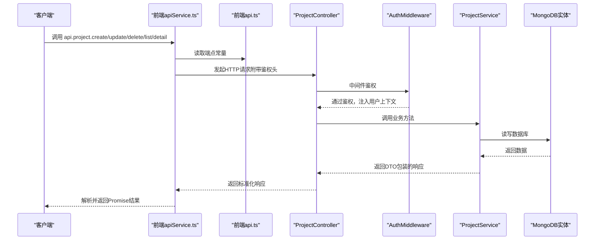
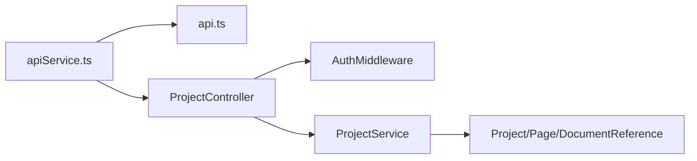

# 项目管理API

<cite>
**本文引用的文件**
- [code-agent-backend/src/controller/code-agent/project.ts](file://code-agent-backend/src/controller/code-agent/project.ts)
- [code-agent-backend/src/dto/code-agent/req.ts](file://code-agent-backend/src/dto/code-agent/req.ts)
- [code-agent-backend/src/dto/code-agent/res.ts](file://code-agent-backend/src/dto/code-agent/res.ts)
- [code-agent-backend/src/middleware/auth.ts](file://code-agent-backend/src/middleware/auth.ts)
- [code-agent-backend/src/service/code-agent/project.ts](file://code-agent-backend/src/service/code-agent/project.ts)
- [code-agent-backend/src/entity/code-agent/project.ts](file://code-agent-backend/src/entity/code-agent/project.ts)
- [code-agent-backend/src/configuration.ts](file://code-agent-backend/src/configuration.ts)
- [fta-layout-design/src/config/api.ts](file://fta-layout-design/src/config/api.ts)
- [fta-layout-design/src/utils/apiService.ts](file://fta-layout-design/src/utils/apiService.ts)
- [README.md](file://README.md)
</cite>

## 目录
1. [简介](#简介)
2. [项目结构](#项目结构)
3. [核心组件](#核心组件)
4. [架构总览](#架构总览)
5. [详细组件分析](#详细组件分析)
6. [依赖关系分析](#依赖关系分析)
7. [性能考量](#性能考量)
8. [故障排查指南](#故障排查指南)
9. [结论](#结论)
10. [附录](#附录)

## 简介
本文件系统性梳理“项目管理API”的设计与实现，覆盖项目与页面的CRUD操作，明确各端点的HTTP方法、URL路径、请求参数与响应结构，并结合后端DTO与前端apiService封装，帮助初学者快速上手，同时为开发者提供与后端交互的完整参考。

## 项目结构
- 后端采用Midway框架，控制器位于 code-agent-backend/src/controller/code-agent/project.ts，服务层位于 code-agent-backend/src/service/code-agent/project.ts，数据模型位于 code-agent-backend/src/entity/code-agent/project.ts，认证中间件位于 code-agent-backend/src/middleware/auth.ts。
- 前端通过 fta-layout-design/src/config/api.ts 定义端点常量，通过 fta-layout-design/src/utils/apiService.ts 封装统一请求与响应处理，自动附加鉴权头并支持超时与错误处理。

图表来源
- [code-agent-backend/src/controller/code-agent/project.ts](file://code-agent-backend/src/controller/code-agent/project.ts#L1-L256)
- [code-agent-backend/src/service/code-agent/project.ts](file://code-agent-backend/src/service/code-agent/project.ts#L1-L767)
- [code-agent-backend/src/entity/code-agent/project.ts](file://code-agent-backend/src/entity/code-agent/project.ts#L1-L167)
- [code-agent-backend/src/middleware/auth.ts](file://code-agent-backend/src/middleware/auth.ts#L1-L194)
- [fta-layout-design/src/config/api.ts](file://fta-layout-design/src/config/api.ts#L33-L57)
- [fta-layout-design/src/utils/apiService.ts](file://fta-layout-design/src/utils/apiService.ts#L1-L200)

章节来源
- [README.md](file://README.md#L150-L170)
- [code-agent-backend/src/configuration.ts](file://code-agent-backend/src/configuration.ts#L47-L51)

## 核心组件
- 项目控制器：提供项目与页面的CRUD端点，以及文档状态同步、内容获取等扩展能力。
- 项目服务：实现分页查询、创建、更新、删除、页面增删改查、文档状态与内容管理等业务逻辑。
- 实体模型：定义 Project、Page、DocumentReference 的字段与约束。
- 鉴权中间件：统一从请求头或Cookie中提取用户信息，对接SSO进行校验。
- 前端API封装：统一构建URL、附加鉴权头、处理响应与错误。

章节来源
- [code-agent-backend/src/controller/code-agent/project.ts](file://code-agent-backend/src/controller/code-agent/project.ts#L1-L256)
- [code-agent-backend/src/service/code-agent/project.ts](file://code-agent-backend/src/service/code-agent/project.ts#L1-L767)
- [code-agent-backend/src/entity/code-agent/project.ts](file://code-agent-backend/src/entity/code-agent/project.ts#L1-L167)
- [code-agent-backend/src/middleware/auth.ts](file://code-agent-backend/src/middleware/auth.ts#L1-L194)
- [fta-layout-design/src/utils/apiService.ts](file://fta-layout-design/src/utils/apiService.ts#L1-L200)

## 架构总览
后端通过控制器接收请求，经鉴权中间件校验后交由服务层处理，服务层读写MongoDB实体，最终返回标准化响应。前端通过apiService封装统一请求，自动附加鉴权头，便于跨端一致的交互体验。

图表来源
- [fta-layout-design/src/utils/apiService.ts](file://fta-layout-design/src/utils/apiService.ts#L1-L200)
- [fta-layout-design/src/config/api.ts](file://fta-layout-design/src/config/api.ts#L33-L57)
- [code-agent-backend/src/controller/code-agent/project.ts](file://code-agent-backend/src/controller/code-agent/project.ts#L1-L256)
- [code-agent-backend/src/middleware/auth.ts](file://code-agent-backend/src/middleware/auth.ts#L1-L194)
- [code-agent-backend/src/service/code-agent/project.ts](file://code-agent-backend/src/service/code-agent/project.ts#L1-L767)

## 详细组件分析

### 项目CRUD端点
- 列表查询
  - 方法与路径：GET /code-agent/project/list
  - 查询参数：
    - page：页码，默认1
    - size：每页数量，默认10
  - 请求体：无
  - 响应：分页响应，包含列表、总数、当前页、每页大小
  - 参考DTO：ProjectListRequest、ProjectListResponse
  - 章节来源
    - [code-agent-backend/src/controller/code-agent/project.ts](file://code-agent-backend/src/controller/code-agent/project.ts#L50-L59)
    - [code-agent-backend/src/dto/code-agent/req.ts](file://code-agent-backend/src/dto/code-agent/req.ts#L1-L10)
    - [code-agent-backend/src/dto/code-agent/res.ts](file://code-agent-backend/src/dto/code-agent/res.ts#L81-L86)

- 创建项目
  - 方法与路径：POST /code-agent/project/create
  - 请求体字段（CreateProjectRequest）：
    - name：字符串，必填
    - description：字符串，可选
    - gitRepository：字符串，可选
    - manager：字符串，必填
    - status：枚举 active/paused/completed/archived，可选
    - progress：数值 0-100，可选
    - members：数值 ≥1，可选
    - tags：字符串数组，可选
    - avatar：字符串，可选
    - workdirs：字符串数组，可选
  - 响应：CreateProjectResponse
  - 章节来源
    - [code-agent-backend/src/controller/code-agent/project.ts](file://code-agent-backend/src/controller/code-agent/project.ts#L91-L100)
    - [code-agent-backend/src/dto/code-agent/req.ts](file://code-agent-backend/src/dto/code-agent/req.ts#L12-L63)
    - [code-agent-backend/src/dto/code-agent/res.ts](file://code-agent-backend/src/dto/code-agent/res.ts#L94-L100)

- 更新项目
  - 方法与路径：POST /code-agent/project/update
  - 请求体字段（UpdateProjectRequest）：
    - id：字符串，必填（作为路径参数）
    - name/description/gitRepository/manager/status/progress/members/tags/avatar/workdirs：均为可选
  - 响应：UpdateProjectResponse
  - 章节来源
    - [code-agent-backend/src/controller/code-agent/project.ts](file://code-agent-backend/src/controller/code-agent/project.ts#L105-L114)
    - [code-agent-backend/src/dto/code-agent/req.ts](file://code-agent-backend/src/dto/code-agent/req.ts#L65-L116)
    - [code-agent-backend/src/dto/code-agent/res.ts](file://code-agent-backend/src/dto/code-agent/res.ts#L100-L104)

- 删除项目
  - 方法与路径：POST /code-agent/project/delete
  - 请求体字段：id（字符串，必填）
  - 响应：DeleteProjectResponse
  - 章节来源
    - [code-agent-backend/src/controller/code-agent/project.ts](file://code-agent-backend/src/controller/code-agent/project.ts#L119-L128)
    - [code-agent-backend/src/dto/code-agent/req.ts](file://code-agent-backend/src/dto/code-agent/req.ts#L127-L134)
    - [code-agent-backend/src/dto/code-agent/res.ts](file://code-agent-backend/src/dto/code-agent/res.ts#L106-L110)

- 项目详情
  - 方法与路径：GET /code-agent/project/detail
  - 查询参数：id（字符串，必填）
  - 响应：ProjectDetailResponse
  - 章节来源
    - [code-agent-backend/src/controller/code-agent/project.ts](file://code-agent-backend/src/controller/code-agent/project.ts#L133-L142)
    - [code-agent-backend/src/dto/code-agent/req.ts](file://code-agent-backend/src/dto/code-agent/req.ts#L118-L125)
    - [code-agent-backend/src/dto/code-agent/res.ts](file://code-agent-backend/src/dto/code-agent/res.ts#L88-L93)

### 页面CRUD端点
- 创建页面
  - 方法与路径：POST /code-agent/project/page/create
  - 请求体字段（CreatePageRequest）：
    - projectId：字符串，必填
    - name：字符串，必填
    - routePath：字符串，必填
    - description：字符串，可选
    - designUrls/prdUrls/openapiUrls：字符串数组，可选
  - 响应：CreatePageResponse
  - 章节来源
    - [code-agent-backend/src/controller/code-agent/project.ts](file://code-agent-backend/src/controller/code-agent/project.ts#L147-L156)
    - [code-agent-backend/src/dto/code-agent/req.ts](file://code-agent-backend/src/dto/code-agent/req.ts#L137-L174)
    - [code-agent-backend/src/dto/code-agent/res.ts](file://code-agent-backend/src/dto/code-agent/res.ts#L112-L118)

- 更新页面
  - 方法与路径：POST /code-agent/project/page/update
  - 请求体字段（UpdatePageRequest）：
    - projectId：字符串，必填
    - pageId：字符串，必填
    - name/routePath/description/designUrls/prdUrls/openapiUrls：均为可选
  - 响应：UpdatePageResponse
  - 章节来源
    - [code-agent-backend/src/controller/code-agent/project.ts](file://code-agent-backend/src/controller/code-agent/project.ts#L161-L170)
    - [code-agent-backend/src/dto/code-agent/req.ts](file://code-agent-backend/src/dto/code-agent/req.ts#L176-L216)
    - [code-agent-backend/src/dto/code-agent/res.ts](file://code-agent-backend/src/dto/code-agent/res.ts#L118-L124)

- 删除页面
  - 方法与路径：POST /code-agent/project/page/delete
  - 请求体字段（DeletePageRequest）：
    - projectId：字符串，可选
    - pageId：字符串，必填
  - 响应：DeletePageResponse
  - 章节来源
    - [code-agent-backend/src/controller/code-agent/project.ts](file://code-agent-backend/src/controller/code-agent/project.ts#L175-L184)
    - [code-agent-backend/src/dto/code-agent/req.ts](file://code-agent-backend/src/dto/code-agent/req.ts#L218-L228)
    - [code-agent-backend/src/dto/code-agent/res.ts](file://code-agent-backend/src/dto/code-agent/res.ts#L124-L130)

- 页面详情
  - 方法与路径：GET /code-agent/project/page/detail
  - 查询参数：pageId（字符串，必填），projectId（字符串，可选）
  - 响应：PageDetailResponse
  - 章节来源
    - [code-agent-backend/src/controller/code-agent/project.ts](file://code-agent-backend/src/controller/code-agent/project.ts#L189-L198)
    - [code-agent-backend/src/dto/code-agent/req.ts](file://code-agent-backend/src/dto/code-agent/req.ts#L230-L240)
    - [code-agent-backend/src/dto/code-agent/res.ts](file://code-agent-backend/src/dto/code-agent/res.ts#L147-L151)

### 文档相关端点（扩展能力）
- 更新文档状态
  - 方法与路径：POST /code-agent/project/document/status
  - 请求体字段（UpdateDocumentStatusRequest）：
    - projectId：字符串，必填
    - pageId：字符串，必填
    - type：枚举 design/prd/openapi，必填
    - documentId：字符串，必填
    - status：枚举 pending/syncing/synced/failed/completed，必填
  - 响应：UpdateDocumentStatusResponse
  - 章节来源
    - [code-agent-backend/src/controller/code-agent/project.ts](file://code-agent-backend/src/controller/code-agent/project.ts#L203-L212)
    - [code-agent-backend/src/dto/code-agent/req.ts](file://code-agent-backend/src/dto/code-agent/req.ts#L243-L272)
    - [code-agent-backend/src/dto/code-agent/res.ts](file://code-agent-backend/src/dto/code-agent/res.ts#L153-L159)

- 同步文档
  - 方法与路径：POST /code-agent/project/document/sync
  - 请求体字段（SyncDocumentRequest）：同上
  - 响应：SyncDocumentResponse
  - 章节来源
    - [code-agent-backend/src/controller/code-agent/project.ts](file://code-agent-backend/src/controller/code-agent/project.ts#L217-L226)
    - [code-agent-backend/src/dto/code-agent/req.ts](file://code-agent-backend/src/dto/code-agent/req.ts#L274-L295)
    - [code-agent-backend/src/dto/code-agent/res.ts](file://code-agent-backend/src/dto/code-agent/res.ts#L159-L163)

- 获取文档内容
  - 方法与路径：GET /code-agent/project/document/content
  - 查询参数：documentId（字符串，必填），projectId/pageId/type（可选）
  - 响应：GetDocumentContentResponse
  - 章节来源
    - [code-agent-backend/src/controller/code-agent/project.ts](file://code-agent-backend/src/controller/code-agent/project.ts#L245-L254)
    - [code-agent-backend/src/dto/code-agent/req.ts](file://code-agent-backend/src/dto/code-agent/req.ts#L297-L316)
    - [code-agent-backend/src/dto/code-agent/res.ts](file://code-agent-backend/src/dto/code-agent/res.ts#L165-L169)

- 更新文档信息
  - 方法与路径：POST /code-agent/project/document/update
  - 请求体字段（UpdateDocumentRequest）：
    - projectId：字符串，必填
    - pageId：字符串，必填
    - type：枚举 design/prd/openapi，必填
    - documentId：字符串，必填
    - content：对象，必填
    - name/url：可选
  - 响应：UpdateDocumentResponse
  - 章节来源
    - [code-agent-backend/src/controller/code-agent/project.ts](file://code-agent-backend/src/controller/code-agent/project.ts#L231-L240)
    - [code-agent-backend/src/dto/code-agent/req.ts](file://code-agent-backend/src/dto/code-agent/req.ts#L318-L351)
    - [code-agent-backend/src/dto/code-agent/res.ts](file://code-agent-backend/src/dto/code-agent/res.ts#L171-L175)

### 前端调用示例
- 使用apiService封装的方法
  - 列表：api.project.list({ page, size })
  - 创建：api.project.create(payload)
  - 更新：api.project.update({ id, ...payload })
  - 删除：api.project.delete({ id })
  - 详情：api.project.detail({ id })
  - 页面创建：api.project.page.create({ projectId, ...payload })
  - 页面更新：api.project.page.update({ projectId, pageId, ...payload })
  - 页面删除：api.project.page.delete({ projectId, pageId })
  - 页面详情：api.project.page.detail({ pageId, projectId? })
  - 文档状态更新：api.project.document.updateStatus({ projectId, pageId, documentId, type, status })
  - 文档同步：api.project.document.sync({ projectId, pageId, documentId, type })
  - 文档内容：api.project.document.getContent({ documentId, ...params })
  - 文档更新：api.project.document.update({ id, ...payload })
- 章节来源
  - [fta-layout-design/src/utils/apiService.ts](file://fta-layout-design/src/utils/apiService.ts#L461-L565)
  - [fta-layout-design/src/config/api.ts](file://fta-layout-design/src/config/api.ts#L33-L57)

### 鉴权机制
- 中间件作用：从请求头 X-User-Cookies 或 Cookie 中提取用户凭证，调用SSO校验，通过后将用户信息注入上下文并设置 user-id 头。
- 匹配规则：由配置决定是否对特定路径启用中间件。
- 章节来源
  - [code-agent-backend/src/middleware/auth.ts](file://code-agent-backend/src/middleware/auth.ts#L1-L194)
  - [code-agent-backend/src/configuration.ts](file://code-agent-backend/src/configuration.ts#L47-L51)

### 数据模型与复杂度
- Project/Page/DocumentReference 实体定义了字段、索引与约束，服务层在查询与更新时遵循用户隔离（userId）与分页策略。
- 复杂度分析
  - 列表查询：分页查询，时间复杂度 O(n)（n为分页条数），数据库层面使用 skip/limit。
  - 创建/更新/删除：单文档写入/更新，时间复杂度 O(1)，涉及多集合写入时为 O(k)（k为关联文档数量）。
  - 页面详情：支持按项目或全局查找，全局查找需额外聚合。
- 章节来源
  - [code-agent-backend/src/entity/code-agent/project.ts](file://code-agent-backend/src/entity/code-agent/project.ts#L1-L167)
  - [code-agent-backend/src/service/code-agent/project.ts](file://code-agent-backend/src/service/code-agent/project.ts#L244-L343)

## 依赖关系分析
- 控制器依赖服务层，服务层依赖实体模型与第三方服务（如MasterGo、GitLab）。
- 前端通过apiService封装统一请求，自动附加鉴权头，减少重复逻辑。
- 鉴权中间件贯穿控制器层，保证所有端点受保护。

图表来源
- [fta-layout-design/src/utils/apiService.ts](file://fta-layout-design/src/utils/apiService.ts#L1-L200)
- [fta-layout-design/src/config/api.ts](file://fta-layout-design/src/config/api.ts#L33-L57)
- [code-agent-backend/src/controller/code-agent/project.ts](file://code-agent-backend/src/controller/code-agent/project.ts#L1-L256)
- [code-agent-backend/src/middleware/auth.ts](file://code-agent-backend/src/middleware/auth.ts#L1-L194)
- [code-agent-backend/src/service/code-agent/project.ts](file://code-agent-backend/src/service/code-agent/project.ts#L1-L767)
- [code-agent-backend/src/entity/code-agent/project.ts](file://code-agent-backend/src/entity/code-agent/project.ts#L1-L167)

章节来源
- [code-agent-backend/src/configuration.ts](file://code-agent-backend/src/configuration.ts#L47-L51)

## 性能考量
- 分页查询：合理设置 page/size，避免一次性拉取过多数据。
- 批量操作：页面文档URL合并采用异步并发，提升批量处理效率。
- 缓存与索引：建议在高频查询字段上建立索引，减少查询延迟。
- 超时与重试：前端请求具备超时控制，后端中间件与服务层抛错时及时返回，避免长时间占用连接。

## 故障排查指南
- 401 未授权
  - 确认请求头 X-User-Cookies 是否正确传递，或 Cookie 中的 ymmoa_passport 是否存在。
  - 本地开发模式下检查 NODE_ENV 是否为 local。
  - 章节来源
    - [code-agent-backend/src/middleware/auth.ts](file://code-agent-backend/src/middleware/auth.ts#L125-L160)

- 404 项目/页面不存在
  - 确认 id 是否正确，且当前用户拥有对应权限。
  - 章节来源
    - [code-agent-backend/src/service/code-agent/project.ts](file://code-agent-backend/src/service/code-agent/project.ts#L188-L201)
    - [code-agent-backend/src/service/code-agent/project.ts](file://code-agent-backend/src/service/code-agent/project.ts#L213-L242)

- 400 参数错误
  - 检查请求体字段类型与范围（如 progress 0-100、members≥1、status枚举值）。
  - 章节来源
    - [code-agent-backend/src/dto/code-agent/req.ts](file://code-agent-backend/src/dto/code-agent/req.ts#L12-L63)
    - [code-agent-backend/src/dto/code-agent/req.ts](file://code-agent-backend/src/dto/code-agent/req.ts#L65-L116)

- 前端错误处理
  - apiService对响应进行统一校验，支持超时与异常捕获，便于定位问题。
  - 章节来源
    - [fta-layout-design/src/utils/apiService.ts](file://fta-layout-design/src/utils/apiService.ts#L1-L150)

## 结论
本项目管理API围绕“项目”和“页面”两大核心实体，提供了完善的CRUD能力与文档同步扩展，配合统一的前端封装与严格的鉴权中间件，既满足初学者快速上手，也为开发者提供了清晰的交互边界与可维护的架构。

## 附录

### curl 示例（创建项目）
- 基本步骤
  - 准备请求头：X-User-Cookies（包含 ymmoa_passport 等）
  - 发送 POST 请求到 /code-agent/project/create
  - 请求体包含 name、manager 等必填字段
- 注意事项
  - 若使用浏览器或本地开发，确保前端已注入 cookies 并由 apiService 自动转发
  - 章节来源
    - [fta-layout-design/src/utils/apiService.ts](file://fta-layout-design/src/utils/apiService.ts#L70-L110)
    - [code-agent-backend/src/dto/code-agent/req.ts](file://code-agent-backend/src/dto/code-agent/req.ts#L12-L63)

### JSON Schema（基于DTO）
- 列表查询
  - 查询参数：page(number, default 1), size(number, default 10)
  - 响应：分页对象，包含 list(array), total(number), page(number), size(number)
  - 章节来源
    - [code-agent-backend/src/dto/code-agent/req.ts](file://code-agent-backend/src/dto/code-agent/req.ts#L1-L10)
    - [code-agent-backend/src/dto/code-agent/res.ts](file://code-agent-backend/src/dto/code-agent/res.ts#L25-L60)

- 创建项目
  - 请求体字段：name(string, required), description(string), gitRepository(string), manager(string, required), status(enum), progress(number 0-100), members(number≥1), tags(string[]), avatar(string), workdirs(string[])
  - 响应：包含项目对象的 BaseResponse
  - 章节来源
    - [code-agent-backend/src/dto/code-agent/req.ts](file://code-agent-backend/src/dto/code-agent/req.ts#L12-L63)
    - [code-agent-backend/src/dto/code-agent/res.ts](file://code-agent-backend/src/dto/code-agent/res.ts#L94-L100)

- 更新项目
  - 请求体字段：id(string, required) + 以上可选字段
  - 响应：包含项目对象的 BaseResponse
  - 章节来源
    - [code-agent-backend/src/dto/code-agent/req.ts](file://code-agent-backend/src/dto/code-agent/req.ts#L65-L116)
    - [code-agent-backend/src/dto/code-agent/res.ts](file://code-agent-backend/src/dto/code-agent/res.ts#L100-L104)

- 删除项目
  - 请求体字段：id(string, required)
  - 响应：success=true 的 BaseResponse
  - 章节来源
    - [code-agent-backend/src/dto/code-agent/req.ts](file://code-agent-backend/src/dto/code-agent/req.ts#L127-L134)
    - [code-agent-backend/src/dto/code-agent/res.ts](file://code-agent-backend/src/dto/code-agent/res.ts#L106-L110)

- 项目详情
  - 查询参数：id(string, required)
  - 响应：包含项目对象的 BaseResponse
  - 章节来源
    - [code-agent-backend/src/dto/code-agent/req.ts](file://code-agent-backend/src/dto/code-agent/req.ts#L118-L125)
    - [code-agent-backend/src/dto/code-agent/res.ts](file://code-agent-backend/src/dto/code-agent/res.ts#L88-L93)

- 页面CRUD
  - 创建：projectId(string, required), name(string, required), routePath(string, required), description(string), designUrls/prdUrls/openapiUrls(string[])
  - 更新：projectId(string, required), pageId(string, required), 以上可选字段
  - 删除：projectId(string, optional), pageId(string, required)
  - 详情：pageId(string, required), projectId(string, optional)
  - 响应：对应 Create/Update/Delete/PageDetail 的 BaseResponse/PaginatedResponse
  - 章节来源
    - [code-agent-backend/src/dto/code-agent/req.ts](file://code-agent-backend/src/dto/code-agent/req.ts#L137-L240)
    - [code-agent-backend/src/dto/code-agent/res.ts](file://code-agent-backend/src/dto/code-agent/res.ts#L112-L151)

- 文档相关
  - 更新状态：projectId, pageId, type(enum), documentId, status(enum)
  - 同步：type(enum), documentId
  - 获取内容：documentId, projectId, pageId, type
  - 更新文档：projectId, pageId, type, documentId, content(object), name, url
  - 响应：对应 UpdateDocumentStatus/Sync/GetDocumentContent/UpdateDocument 的 BaseResponse
  - 章节来源
    - [code-agent-backend/src/dto/code-agent/req.ts](file://code-agent-backend/src/dto/code-agent/req.ts#L243-L351)
    - [code-agent-backend/src/dto/code-agent/res.ts](file://code-agent-backend/src/dto/code-agent/res.ts#L153-L175)