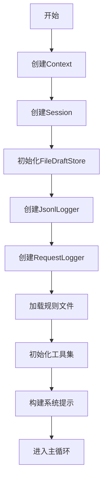
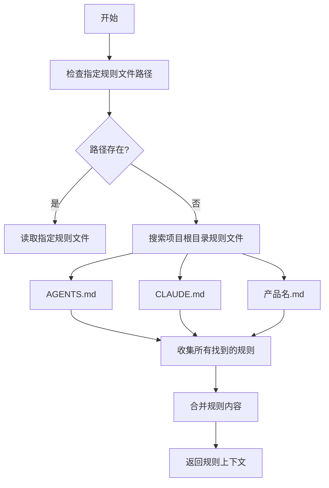
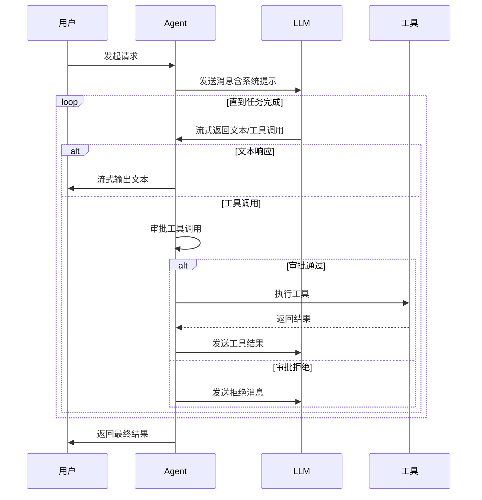
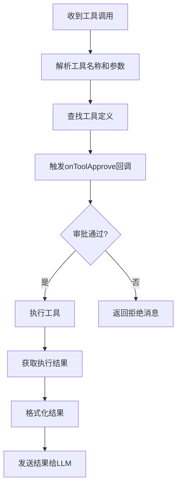
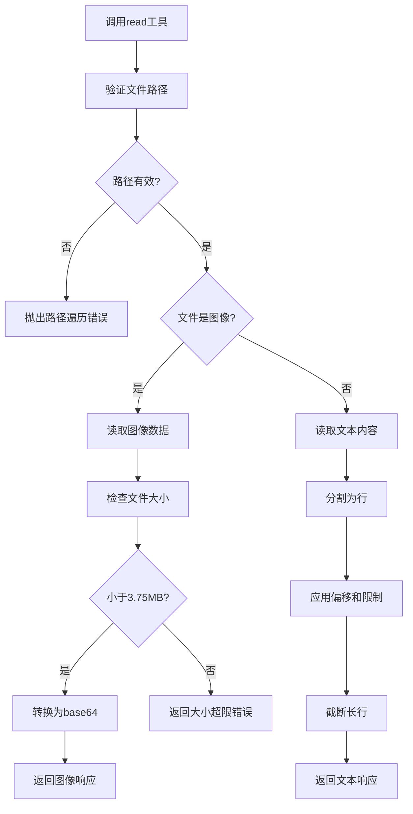
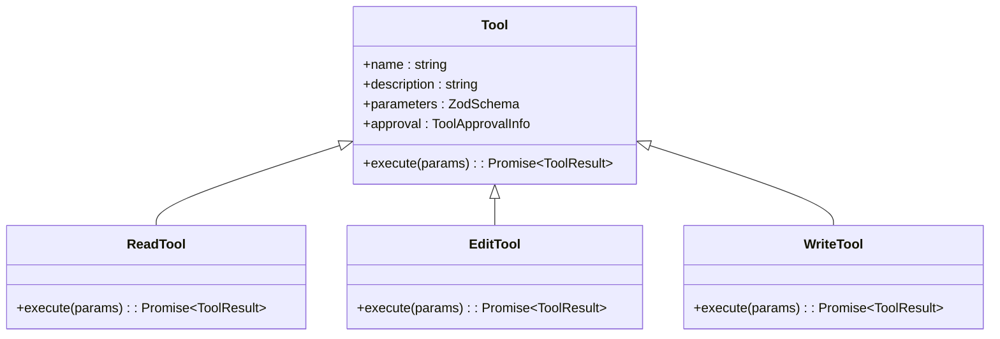
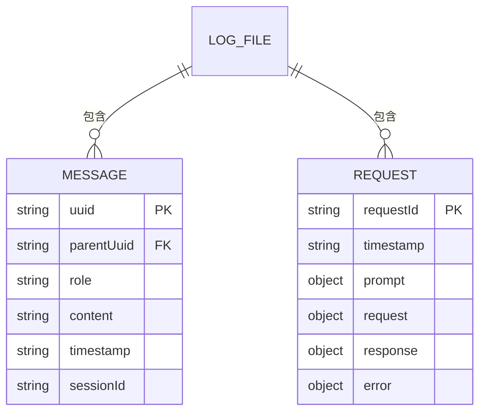

# Agent执行流程

<cite>
**本文档中引用的文件**  
- [frontendProjectService.ts](file://fta-agent-core/src/frontendProjectService.ts)
- [context.ts](file://fta-agent-core/src/context.ts)
- [session.ts](file://fta-agent-core/src/session.ts)
- [loop.ts](file://fta-agent-core/src/loop.ts)
- [tool.ts](file://fta-agent-core/src/tool.ts)
- [jsonl.ts](file://fta-agent-core/src/jsonl.ts)
- [rules.ts](file://fta-agent-core/src/rules.ts)
- [llmsContext.ts](file://fta-agent-core/src/llmsContext.ts)
- [read.ts](file://fta-agent-core/src/tools/read.ts)
- [edit.ts](file://fta-agent-core/src/tools/edit.ts)
- [write.ts](file://fta-agent-core/src/tools/write.ts)
- [project.ts](file://fta-agent-core/src/project.ts)
</cite>

## 目录
1. [执行流程概述](#执行流程概述)
2. [核心组件初始化](#核心组件初始化)
3. [Agent决策循环机制](#agent决策循环机制)
4. [上下文与会话管理](#上下文与会话管理)
5. [工具调用与文件操作](#工具调用与文件操作)
6. [日志记录与监控](#日志记录与监控)
7. [性能瓶颈分析](#性能瓶颈分析)

## 执行流程概述

Agent Core的执行流程始于`runFrontendProjectWorkflow`函数，该函数作为前端项目工作流的入口点，协调整个代码生成过程。工作流从接收用户需求开始，通过构建初始提示、加载规则文件、初始化工具集，最终进入主循环处理LLM响应。整个流程设计为可监控和可追溯，通过回调函数和日志系统提供完整的执行追踪。

**Section sources**
- [frontendProjectService.ts](file://fta-agent-core/src/frontendProjectService.ts#L139-L348)

## 核心组件初始化

### 上下文（Context）创建
执行流程首先通过`Context.create`方法创建执行上下文，该上下文包含工作目录、产品名称、版本号等关键信息。上下文还管理配置、路径、后台任务和MCP（Model Control Protocol）服务器，为整个执行过程提供环境支持。



**Diagram sources**
- [frontendProjectService.ts](file://fta-agent-core/src/frontendProjectService.ts#L142-L153)
- [context.ts](file://fta-agent-core/src/context.ts#L57-L84)

### 会话（Session）与历史（History）管理
会话通过`Session.create`方法生成，包含唯一的会话ID和任务历史记录。历史管理器（History）负责维护对话的完整消息链，支持消息压缩和路径过滤，确保上下文不会无限增长。会话还支持从日志文件恢复，实现任务的断点续传。

**Section sources**
- [session.ts](file://fta-agent-core/src/session.ts#L25-L44)
- [history.ts](file://fta-agent-core/src/history.ts#L18-L37)

### 规则文件加载
系统通过`resolveLlmsRules`函数加载规则文件，这些规则定义了代码风格、架构约束和最佳实践。规则文件按优先级顺序加载，包括项目级规则（AGENTS.md、CLAUDE.md）和全局配置规则，确保生成的代码符合预设标准。



**Diagram sources**
- [rules.ts](file://fta-agent-core/src/rules.ts#L47-L72)
- [llmsContext.ts](file://fta-agent-core/src/llmsContext.ts#L49-L57)

### 工具集（Tools）初始化
工具集通过`resolveBaseTools`函数初始化，包含读取、写入、编辑、列出文件等基本操作工具。工具管理器（Tools）将这些工具组织为可调用的集合，并提供类型安全的执行接口。工具调用需要经过审批机制，确保安全性。

**Section sources**
- [tool.ts](file://fta-agent-core/src/tool.ts#L27-L70)
- [frontendProjectService.ts](file://fta-agent-core/src/frontendProjectService.ts#L166-L182)

## Agent决策循环机制

### 主循环（runLoop）执行流程
主循环是Agent的核心，通过`runLoop`函数实现。循环持续与LLM交互，处理文本流和工具调用，直到任务完成或达到终止条件。循环包含错误重试机制，使用指数退避策略处理API错误。



**Diagram sources**
- [loop.ts](file://fta-agent-core/src/loop.ts#L109-L531)
- [frontendProjectService.ts](file://fta-agent-core/src/frontendProjectService.ts#L250-L302)

### LLM响应处理
系统通过流式处理LLM响应，实时接收文本增量（text-delta）和工具调用（tool-call）。文本增量通过`onTextDelta`回调传递给用户界面，实现即时反馈。工具调用被解析为结构化数据，准备执行。

**Section sources**
- [loop.ts](file://fta-agent-core/src/loop.ts#L258-L273)

### 工具调用解析与执行
当LLM返回工具调用时，系统解析工具名称和参数，通过工具管理器查找对应工具。工具执行前会触发`onToolApprove`回调，允许外部系统审批或拒绝调用。执行结果被格式化后返回给LLM，形成闭环。



**Diagram sources**
- [loop.ts](file://fta-agent-core/src/loop.ts#L432-L498)
- [tool.ts](file://fta-agent-core/src/tool.ts#L118-L144)

## 上下文与会话管理

### 上下文压缩机制
为防止上下文过长导致token超限，系统实现自动压缩机制。当使用量接近模型限制时，`History.compress`方法调用LLM生成对话摘要，替换历史消息。压缩阈值根据模型上下文窗口动态计算。

```mermaid
classDiagram
class Context {
+cwd : string
+productName : string
+version : string
+config : Config
+paths : Paths
+mcpManager : MCPManager
+backgroundTaskManager : BackgroundTaskManager
+create(opts) : Context
+destroy() : Promise~void~
}
class Session {
+id : SessionId
+usage : Usage
+history : History
+create() : Session
+resume(opts) : Session
}
class History {
+messages : NormalizedMessage[]
+addMessage(message) : Promise~void~
+getMessagesToUuid(uuid) : NormalizedMessage[]
+toLanguageV2Messages() : LanguageModelV2Message[]
+compress(model) : Promise~{compressed : boolean, summary? : string}~
}
Context --> Session : "包含"
Session --> History : "包含"
```

**Diagram sources**
- [context.ts](file://fta-agent-core/src/context.ts#L28-L85)
- [session.ts](file://fta-agent-core/src/session.ts#L11-L44)
- [history.ts](file://fta-agent-core/src/history.ts#L18-L287)

### 会话状态转换
会话状态通过消息链维护，每条消息包含UUID和父UUID，形成树状结构。系统通过`getMessagesToUuid`方法重建从根到当前消息的路径，确保上下文的连贯性。会话配置支持审批模式和工具白名单。

**Section sources**
- [session.ts](file://fta-agent-core/src/session.ts#L118-L156)

## 工具调用与文件操作

### 文件读取（read）工具
`read`工具允许Agent读取文件内容，支持文本和图像文件。对于文本文件，可指定行偏移和限制；对于图像文件，自动转换为base64编码并设置适当的MIME类型。工具实施路径安全检查，防止目录遍历攻击。



**Diagram sources**
- [read.ts](file://fta-agent-core/src/tools/read.ts#L72-L203)

### 文件编辑（edit）与写入（write）工具
`edit`工具通过字符串替换修改文件，要求先读取文件内容以确保上下文正确。`write`工具直接覆盖文件内容，用于创建新文件或大规模修改。两个工具都支持通过代理模式在前端执行，实现更安全的文件操作。



**Diagram sources**
- [edit.ts](file://fta-agent-core/src/tools/edit.ts#L8-L75)
- [write.ts](file://fta-agent-core/src/tools/write.ts)
- [tool.ts](file://fta-agent-core/src/tool.ts#L211-L279)

## 日志记录与监控

### JSONL日志系统
系统使用JSONL格式记录所有消息和请求，每行一个JSON对象。`JsonlLogger`记录消息流，`RequestLogger`记录API请求详情，包括提示、响应和错误。日志文件按会话ID组织，便于事后分析和调试。



**Diagram sources**
- [jsonl.ts](file://fta-agent-core/src/jsonl.ts#L7-L100)

### 回调函数（callbacks）监控
通过回调函数，外部系统可以实时监控执行过程。关键回调包括：
- `onMessage`: 消息创建时触发
- `onTextDelta`: 文本增量到达时触发
- `onToolApprove`: 工具调用需要审批时触发
- `onTurn`: 完成一轮对话时触发

这些回调允许集成UI更新、审批工作流和性能监控。

**Section sources**
- [frontendProjectService.ts](file://fta-agent-core/src/frontendProjectService.ts#L248-L287)
- [project.ts](file://fta-agent-core/src/project.ts#L248-L308)

## 性能瓶颈分析

### LLM调用延迟
LLM调用是主要性能瓶颈，受网络延迟和模型推理速度影响。系统通过流式响应缓解感知延迟，但完整响应时间仍取决于模型性能。错误重试机制可能增加额外延迟，特别是在网络不稳定时。

### 工具执行效率
文件操作工具的效率取决于磁盘I/O性能。`read`工具对大文件的处理可能较慢，特别是需要读取数千行时。建议通过`offset`和`limit`参数分页读取大文件，避免一次性加载过多内容。

### 循环终止条件
主循环受以下条件限制：
- 最大轮次（maxTurns）：默认50轮，防止无限循环
- Token限制：自动压缩机制在接近上下文窗口时触发
- 用户取消：通过AbortSignal支持外部取消
- 工具拒绝：当工具调用被拒绝时立即终止

这些条件确保任务在合理时间内完成，避免资源浪费。

**Section sources**
- [loop.ts](file://fta-agent-core/src/loop.ts#L173-L187)
- [history.ts](file://fta-agent-core/src/history.ts#L173-L211)