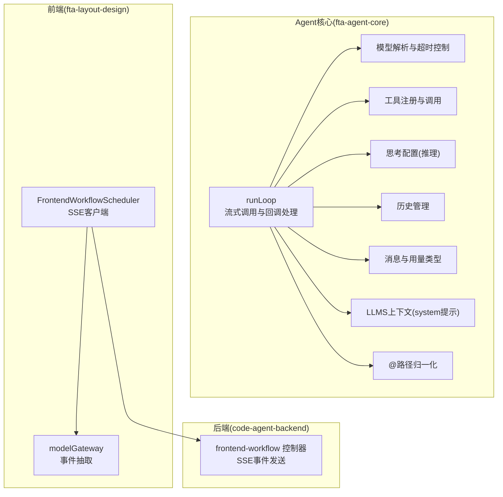
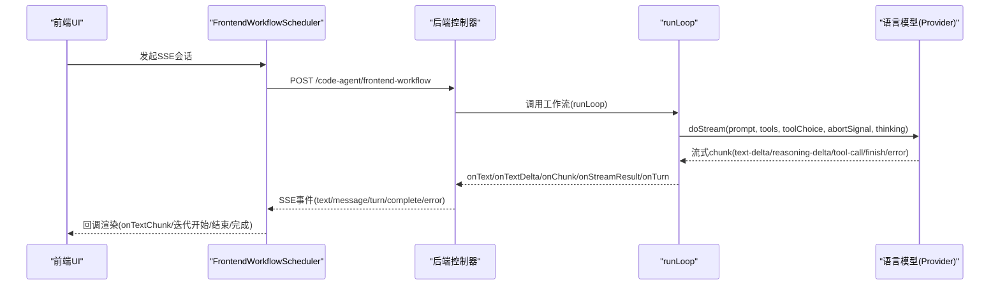
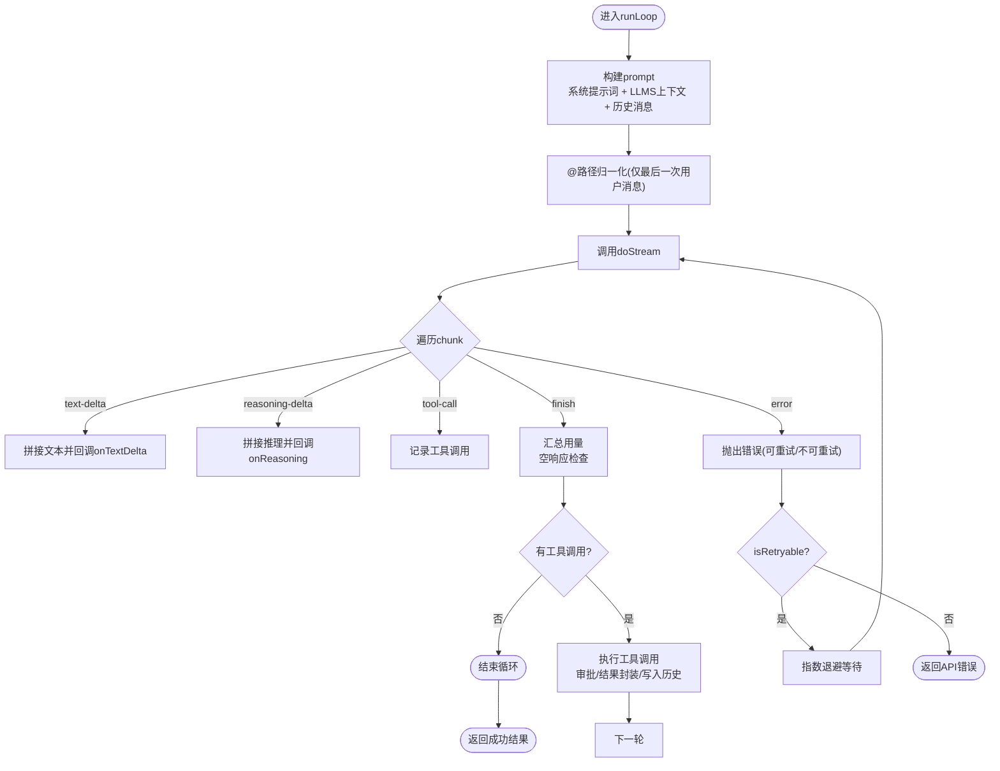
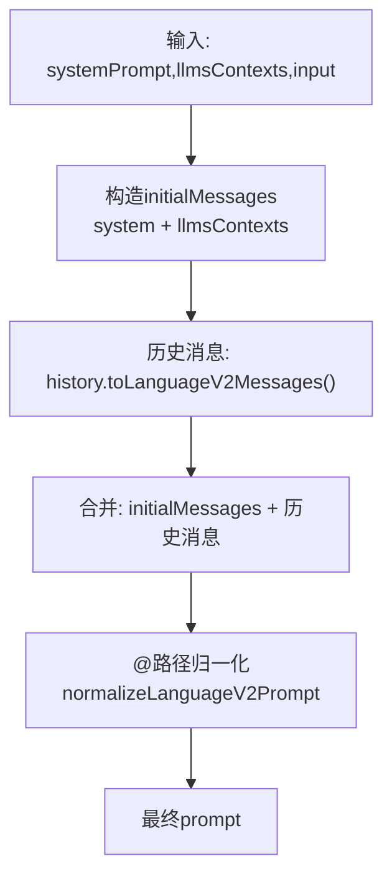
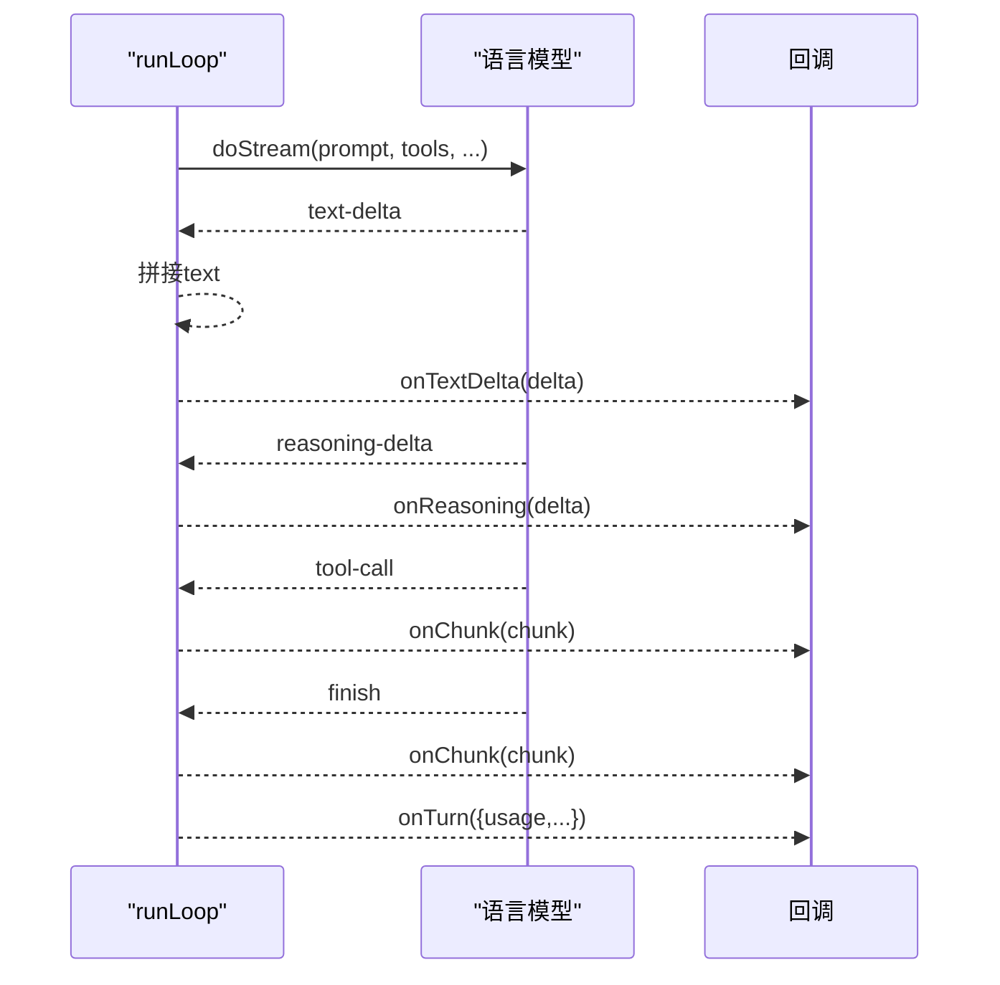
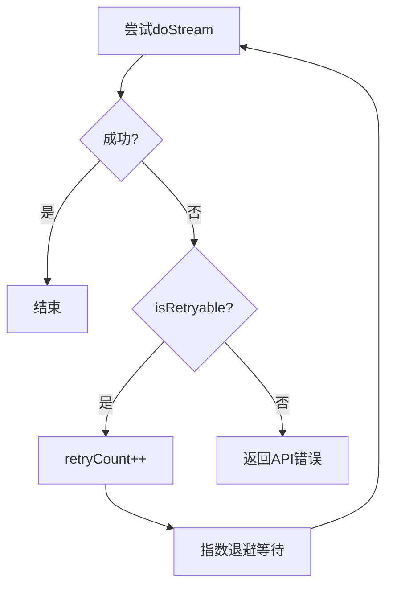
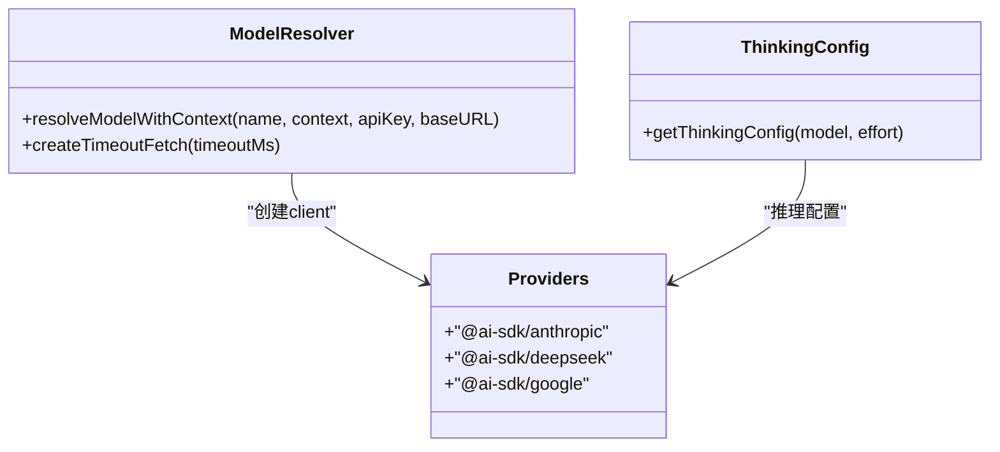
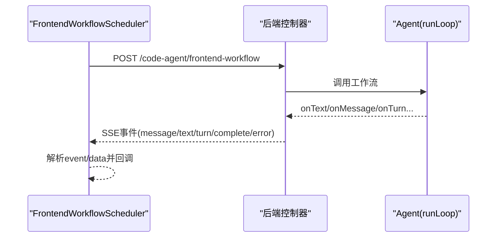
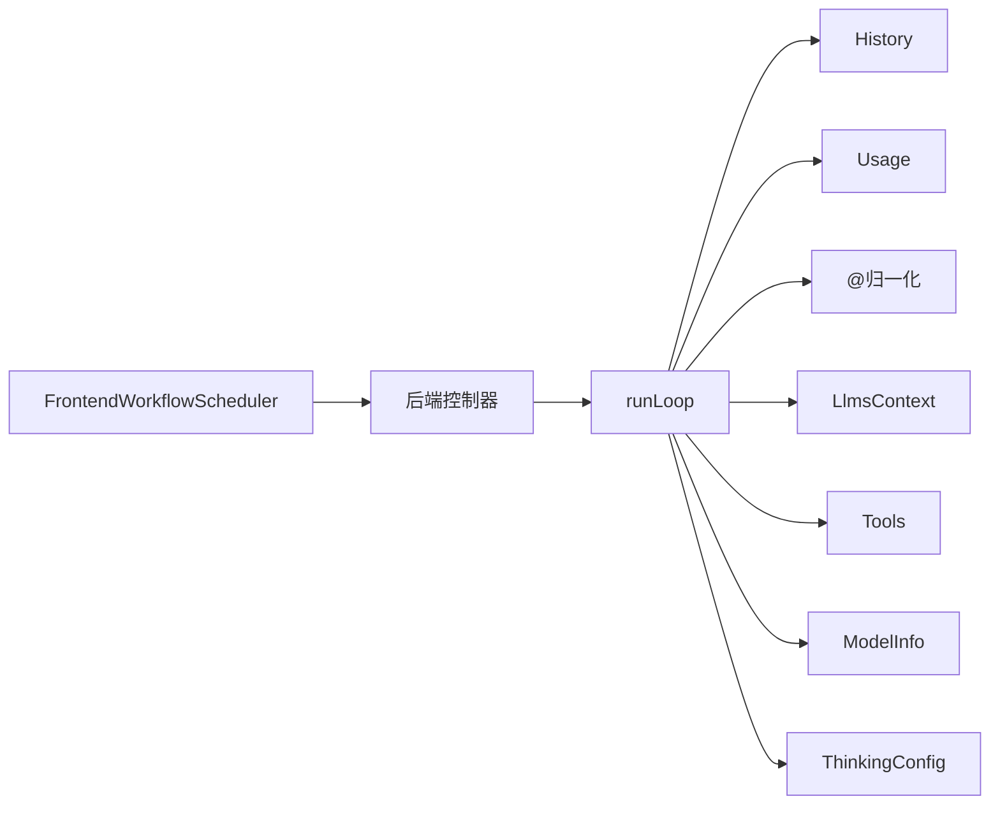
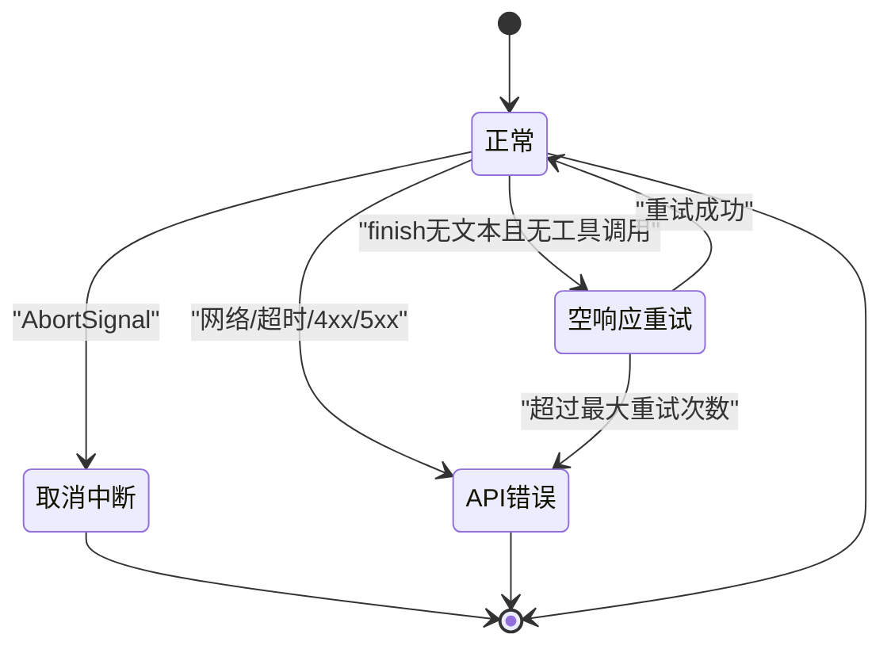

# LLM交互机制

<cite>
**本文引用的文件列表**
- [loop.ts](file://fta-agent-core/src/loop.ts)
- [model.ts](file://fta-agent-core/src/model.ts)
- [tool.ts](file://fta-agent-core/src/tool.ts)
- [thinking-config.ts](file://fta-agent-core/src/thinking-config.ts)
- [history.ts](file://fta-agent-core/src/history.ts)
- [message.ts](file://fta-agent-core/src/message.ts)
- [usage.ts](file://fta-agent-core/src/usage.ts)
- [llmsContext.ts](file://fta-agent-core/src/llmsContext.ts)
- [at.ts](file://fta-agent-core/src/at.ts)
- [frontendProjectService.ts](file://fta-agent-core/src/frontendProjectService.ts)
- [project.ts](file://fta-agent-core/src/project.ts)
- [query.ts](file://fta-agent-core/src/query.ts)
- [FrontendWorkflowScheduler.ts](file://fta-layout-design/src/pages/EditorPage/services/FrontendWorkflowScheduler.ts)
- [modelGateway.ts](file://fta-layout-design/src/pages/EditorPage/utils/modelGateway.ts)
- [frontend-workflow.ts](file://code-agent-backend/src/controller/code-agent/frontend-workflow.ts)
- [yarn.lock](file://yarn.lock)
</cite>

## 目录
1. [引言](#引言)
2. [项目结构](#项目结构)
3. [核心组件](#核心组件)
4. [架构总览](#架构总览)
5. [详细组件分析](#详细组件分析)
6. [依赖关系分析](#依赖关系分析)
7. [性能考量](#性能考量)
8. [故障排查指南](#故障排查指南)
9. [结论](#结论)
10. [附录](#附录)

## 引言
本文件聚焦于Agent与LLM的交互流程，围绕runLoop函数中doStream调用的实现机制展开，系统阐述prompt构造过程（系统提示词、上下文消息、历史记录整合）、流式响应处理（onTextDelta、onReasoning、onChunk等回调）、错误处理与指数退避重试策略，并给出不同LLM提供商的兼容性处理方案。文档同时提供关键流程的可视化图示，帮助读者快速把握整体运行机制。

## 项目结构
该仓库采用分层与功能模块化组织：
- fta-agent-core：Agent核心逻辑（runLoop、prompt构造、工具、历史、用量统计、模型与思考配置等）
- fta-layout-design：前端工作流与SSE客户端调度器
- code-agent-backend：后端控制器与服务，负责将Agent回调映射为SSE事件
- shared-types：共享类型定义
- docs：设计文档与实现计划

图表来源
- [loop.ts](file://fta-agent-core/src/loop.ts#L109-L531)
- [model.ts](file://fta-agent-core/src/model.ts#L40-L114)
- [tool.ts](file://fta-agent-core/src/tool.ts#L97-L165)
- [thinking-config.ts](file://fta-agent-core/src/thinking-config.ts#L1-L26)
- [history.ts](file://fta-agent-core/src/history.ts#L1-L37)
- [message.ts](file://fta-agent-core/src/message.ts#L1-L221)
- [llmsContext.ts](file://fta-agent-core/src/llmsContext.ts#L1-L88)
- [at.ts](file://fta-agent-core/src/at.ts#L156-L178)
- [FrontendWorkflowScheduler.ts](file://fta-layout-design/src/pages/EditorPage/services/FrontendWorkflowScheduler.ts#L1-L521)
- [modelGateway.ts](file://fta-layout-design/src/pages/EditorPage/utils/modelGateway.ts#L119-L185)
- [frontend-workflow.ts](file://code-agent-backend/src/controller/code-agent/frontend-workflow.ts#L192-L244)

章节来源
- [loop.ts](file://fta-agent-core/src/loop.ts#L109-L531)
- [model.ts](file://fta-agent-core/src/model.ts#L40-L114)
- [tool.ts](file://fta-agent-core/src/tool.ts#L97-L165)
- [thinking-config.ts](file://fta-agent-core/src/thinking-config.ts#L1-L26)
- [history.ts](file://fta-agent-core/src/history.ts#L1-L37)
- [message.ts](file://fta-agent-core/src/message.ts#L1-L221)
- [llmsContext.ts](file://fta-agent-core/src/llmsContext.ts#L1-L88)
- [at.ts](file://fta-agent-core/src/at.ts#L156-L178)
- [FrontendWorkflowScheduler.ts](file://fta-layout-design/src/pages/EditorPage/services/FrontendWorkflowScheduler.ts#L1-L521)
- [modelGateway.ts](file://fta-layout-design/src/pages/EditorPage/utils/modelGateway.ts#L119-L185)
- [frontend-workflow.ts](file://code-agent-backend/src/controller/code-agent/frontend-workflow.ts#L192-L244)

## 核心组件
- runLoop：主循环，负责构建prompt、调用doStream、处理流式增量、工具调用、历史记录与用量统计、错误与重试、最大轮次限制。
- 模型与思考配置：模型解析、超时控制、推理能力适配（Anthropic Thinking）。
- 工具系统：工具注册、参数校验、工具调用与结果封装。
- 历史与消息：消息规范化、历史压缩、用量统计。
- 上下文与归一化：LLMS上下文system提示、@路径归一化注入文件内容。
- 前端SSE与事件映射：SSE客户端、事件解析、回调映射。

章节来源
- [loop.ts](file://fta-agent-core/src/loop.ts#L109-L531)
- [model.ts](file://fta-agent-core/src/model.ts#L40-L114)
- [tool.ts](file://fta-agent-core/src/tool.ts#L97-L165)
- [thinking-config.ts](file://fta-agent-core/src/thinking-config.ts#L1-L26)
- [history.ts](file://fta-agent-core/src/history.ts#L1-L37)
- [message.ts](file://fta-agent-core/src/message.ts#L1-L221)
- [llmsContext.ts](file://fta-agent-core/src/llmsContext.ts#L1-L88)
- [at.ts](file://fta-agent-core/src/at.ts#L156-L178)

## 架构总览
Agent与LLM交互的关键路径如下：
- 输入层：用户输入、附件、历史消息、LLMS上下文、系统提示词
- Prompt构造：系统提示词 + LLMS上下文 + 历史消息 + 归一化后的用户消息
- 流式调用：m.doStream(prompt, tools, toolChoice, abortSignal, 思考配置)
- 流式处理：遍历chunk，分发到onTextDelta、onReasoning、onChunk等回调
- 结束条件：finish事件汇总用量；若无文本且无工具调用则判定为空响应并按策略重试
- 工具调用：根据工具名与参数执行，支持审批与结果回写
- 历史与用量：将assistant消息、tool结果写入历史，累计用量
- 错误与重试：捕获异常，区分可重试与不可重试，指数退避重试，达到上限后返回错误

图表来源
- [FrontendWorkflowScheduler.ts](file://fta-layout-design/src/pages/EditorPage/services/FrontendWorkflowScheduler.ts#L1-L521)
- [frontend-workflow.ts](file://code-agent-backend/src/controller/code-agent/frontend-workflow.ts#L192-L244)
- [loop.ts](file://fta-agent-core/src/loop.ts#L236-L311)

## 详细组件分析

### runLoop与doStream实现机制
- Prompt构造
  - 系统提示词：opts.systemPrompt作为system消息加入初始消息
  - LLMS上下文：opts.llmsContexts中的多条system消息注入
  - 历史消息：history.toLanguageV2Messages()追加至prompt
  - @路径归一化：仅对最后一次用户消息进行归一化，注入@引用的文件内容
- doStream调用
  - 参数：prompt、tools、toolChoice、abortSignal、思考配置
  - onStreamResult：上报请求与响应元数据
  - 流式遍历：for await (const chunk of result.stream)
- 流式处理
  - onChunk：每块回调，便于日志与监控
  - onTextDelta：增量文本拼接与回调
  - onReasoning：推理内容增量（当存在）
  - finish：用量汇总；若无文本且无工具调用，抛出“空响应”错误并标记可重试
  - error：解析错误消息，设置isRetryable与statusCode，抛出不可重试错误
- 重试与取消
  - 指数退避：exponentialBackoffWithCancellation，支持AbortSignal中断
  - 最大重试次数：errorRetryTurns，默认10
  - 取消：opts.signal.aborted时返回取消结果
- 工具调用
  - onToolUse/onToolApprove：工具调用前钩子与审批
  - 工具执行：Tools.invoke，JSON参数解析，结果封装为ToolResult
  - 工具结果写入历史：tool消息，累计用量
- 结果收敛
  - 若本轮无工具调用，循环结束；否则继续下一轮
  - 返回最终文本、历史、用量与元信息

图表来源
- [loop.ts](file://fta-agent-core/src/loop.ts#L197-L311)
- [loop.ts](file://fta-agent-core/src/loop.ts#L252-L309)

章节来源
- [loop.ts](file://fta-agent-core/src/loop.ts#L197-L311)
- [loop.ts](file://fta-agent-core/src/loop.ts#L252-L309)

### prompt构造过程
- 系统提示词：opts.systemPrompt作为role='system'的消息加入initialMessages
- LLMS上下文：opts.llmsContexts数组逐条转为system消息，增强环境与规则上下文
- 历史记录：history.toLanguageV2Messages()将历史消息序列化为模型V2消息
- @路径归一化：normalizeLanguageV2Prompt仅对最后一次用户消息进行归一化，扫描@路径，读取文件内容并注入到用户消息文本末尾
- 初始消息：initialMessages + 历史消息构成最终prompt

图表来源
- [loop.ts](file://fta-agent-core/src/loop.ts#L135-L148)
- [llmsContext.ts](file://fta-agent-core/src/llmsContext.ts#L64-L87)
- [history.ts](file://fta-agent-core/src/history.ts#L1-L37)
- [at.ts](file://fta-agent-core/src/at.ts#L156-L178)

章节来源
- [loop.ts](file://fta-agent-core/src/loop.ts#L135-L148)
- [llmsContext.ts](file://fta-agent-core/src/llmsContext.ts#L64-L87)
- [history.ts](file://fta-agent-core/src/history.ts#L1-L37)
- [at.ts](file://fta-agent-core/src/at.ts#L156-L178)

### 流式响应处理机制
- onTextDelta：增量文本拼接与回调，适合实时渲染
- onReasoning：推理内容增量，便于展示思考过程
- onChunk：每块回调，便于日志、监控与调试
- finish：用量汇总；空响应检查（无文本且无工具调用）触发可重试错误
- error：解析错误消息，设置isRetryable与statusCode，抛出不可重试错误

图表来源
- [loop.ts](file://fta-agent-core/src/loop.ts#L252-L309)

章节来源
- [loop.ts](file://fta-agent-core/src/loop.ts#L252-L309)

### 错误处理与指数退避重试
- 可重试错误：空响应（无文本且无工具调用）标记isRetryable=true
- 不可重试错误：解析错误消息，设置isRetryable=false与statusCode
- 指数退避：exponentialBackoffWithCancellation，基于attempt计算延迟，支持AbortSignal提前退出
- 最大重试次数：errorRetryTurns，默认10
- 达到上限后返回API错误，包含重试次数、错误详情

图表来源
- [loop.ts](file://fta-agent-core/src/loop.ts#L311-L359)
- [loop.ts](file://fta-agent-core/src/loop.ts#L24-L36)

章节来源
- [loop.ts](file://fta-agent-core/src/loop.ts#L24-L36)
- [loop.ts](file://fta-agent-core/src/loop.ts#L311-L359)

### 不同LLM提供商的兼容性处理
- 模型解析与超时：resolveModelWithContext通过@ai-sdk/openai创建client，支持baseURL与超时控制
- 推理能力适配：getThinkingConfig针对Claude启用Thinking，设置预算tokens
- Provider生态：yarn.lock显示@ai-sdk/anthropic、@ai-sdk/deepseek、@ai-sdk/google等依赖，表明对多家Provider的支持

图表来源
- [model.ts](file://fta-agent-core/src/model.ts#L40-L114)
- [thinking-config.ts](file://fta-agent-core/src/thinking-config.ts#L1-L26)
- [yarn.lock](file://yarn.lock#L1-L28)

章节来源
- [model.ts](file://fta-agent-core/src/model.ts#L40-L114)
- [thinking-config.ts](file://fta-agent-core/src/thinking-config.ts#L1-L26)
- [yarn.lock](file://yarn.lock#L1-L28)

### 前端SSE与事件映射
- FrontendWorkflowScheduler：发起SSE请求，自定义解析event/data行，映射到回调（迭代开始/文本片段/会话完成/错误/工具调用）
- 后端控制器：将Agent回调映射为SSE事件（message/text/turn/complete/error），并支持中断信号包装
- modelGateway：从payload中抽取text/todo等事件，兼容choices.delta/content/message/output/data等字段

图表来源
- [FrontendWorkflowScheduler.ts](file://fta-layout-design/src/pages/EditorPage/services/FrontendWorkflowScheduler.ts#L1-L521)
- [frontend-workflow.ts](file://code-agent-backend/src/controller/code-agent/frontend-workflow.ts#L192-L244)
- [modelGateway.ts](file://fta-layout-design/src/pages/EditorPage/utils/modelGateway.ts#L119-L185)

章节来源
- [FrontendWorkflowScheduler.ts](file://fta-layout-design/src/pages/EditorPage/services/FrontendWorkflowScheduler.ts#L1-L521)
- [frontend-workflow.ts](file://code-agent-backend/src/controller/code-agent/frontend-workflow.ts#L192-L244)
- [modelGateway.ts](file://fta-layout-design/src/pages/EditorPage/utils/modelGateway.ts#L119-L185)

## 依赖关系分析
- runLoop依赖：History、Usage、At、LlmsContext、Tools、ModelInfo、ThinkingConfig
- 模型层：@ai-sdk/openai创建client，支持超时与baseURL
- 工具层：工具注册、参数schema、执行与结果封装
- 前后端：SSE事件映射，前端自定义解析

图表来源
- [loop.ts](file://fta-agent-core/src/loop.ts#L109-L531)
- [history.ts](file://fta-agent-core/src/history.ts#L1-L37)
- [usage.ts](file://fta-agent-core/src/usage.ts#L1-L62)
- [at.ts](file://fta-agent-core/src/at.ts#L156-L178)
- [llmsContext.ts](file://fta-agent-core/src/llmsContext.ts#L1-L88)
- [tool.ts](file://fta-agent-core/src/tool.ts#L97-L165)
- [model.ts](file://fta-agent-core/src/model.ts#L40-L114)
- [thinking-config.ts](file://fta-agent-core/src/thinking-config.ts#L1-L26)
- [FrontendWorkflowScheduler.ts](file://fta-layout-design/src/pages/EditorPage/services/FrontendWorkflowScheduler.ts#L1-L521)
- [frontend-workflow.ts](file://code-agent-backend/src/controller/code-agent/frontend-workflow.ts#L192-L244)

章节来源
- [loop.ts](file://fta-agent-core/src/loop.ts#L109-L531)
- [history.ts](file://fta-agent-core/src/history.ts#L1-L37)
- [usage.ts](file://fta-agent-core/src/usage.ts#L1-L62)
- [at.ts](file://fta-agent-core/src/at.ts#L156-L178)
- [llmsContext.ts](file://fta-agent-core/src/llmsContext.ts#L1-L88)
- [tool.ts](file://fta-agent-core/src/tool.ts#L97-L165)
- [model.ts](file://fta-agent-core/src/model.ts#L40-L114)
- [thinking-config.ts](file://fta-agent-core/src/thinking-config.ts#L1-L26)
- [FrontendWorkflowScheduler.ts](file://fta-layout-design/src/pages/EditorPage/services/FrontendWorkflowScheduler.ts#L1-L521)
- [frontend-workflow.ts](file://code-agent-backend/src/controller/code-agent/frontend-workflow.ts#L192-L244)

## 性能考量
- 流式增量处理：onTextDelta与onChunk降低首屏延迟，提升交互体验
- 历史压缩：autoCompact触发时对历史进行压缩，减少上下文长度
- 用量统计：Usage聚合prompt/completion tokens，便于成本控制与限额预警
- 超时控制：模型层统一fetch超时，避免长时间阻塞
- 工具调用：工具参数JSON解析与schema限制，减少无效调用

章节来源
- [loop.ts](file://fta-agent-core/src/loop.ts#L189-L194)
- [usage.ts](file://fta-agent-core/src/usage.ts#L1-L62)
- [model.ts](file://fta-agent-core/src/model.ts#L61-L114)
- [tool.ts](file://fta-agent-core/src/tool.ts#L142-L165)

## 故障排查指南
- 空响应重试
  - 现象：finish后无文本且无工具调用
  - 处理：标记isRetryable=true，指数退避后重试
- API错误
  - 现象：网络错误、4xx/5xx、超时
  - 处理：解析错误消息与statusCode，不可重试，返回API错误
- 取消中断
  - 现象：AbortSignal被触发
  - 处理：立即返回取消结果，避免资源占用
- 工具调用失败
  - 现象：工具参数解析失败或执行异常
  - 处理：封装ToolResult(isError=true)，写入历史并返回错误
- SSE前端解析
  - 现象：事件格式不匹配
  - 处理：FrontendWorkflowScheduler自定义解析event/data行，确保正确映射

图表来源
- [loop.ts](file://fta-agent-core/src/loop.ts#L277-L309)
- [loop.ts](file://fta-agent-core/src/loop.ts#L311-L359)
- [FrontendWorkflowScheduler.ts](file://fta-layout-design/src/pages/EditorPage/services/FrontendWorkflowScheduler.ts#L1-L521)

章节来源
- [loop.ts](file://fta-agent-core/src/loop.ts#L277-L309)
- [loop.ts](file://fta-agent-core/src/loop.ts#L311-L359)
- [FrontendWorkflowScheduler.ts](file://fta-layout-design/src/pages/EditorPage/services/FrontendWorkflowScheduler.ts#L1-L521)

## 结论
本机制通过runLoop统一管理prompt构造、流式调用、增量处理、工具调用与历史记录，结合指数退避重试与SSE事件映射，实现了稳定、可观测、可扩展的Agent-LLM交互流程。对不同LLM提供商的兼容通过Provider抽象与配置化实现，便于后续扩展更多模型与推理能力。

## 附录
- 入口与调用链参考
  - 前端工作流入口：frontendProjectService.ts中调用runLoop并传递回调
  - 查询入口：query.ts构造消息与模型后调用runLoop
  - 工程入口：project.ts解析模型与上下文后调用runLoop

章节来源
- [frontendProjectService.ts](file://fta-agent-core/src/frontendProjectService.ts#L250-L302)
- [query.ts](file://fta-agent-core/src/query.ts#L1-L44)
- [project.ts](file://fta-agent-core/src/project.ts#L131-L207)