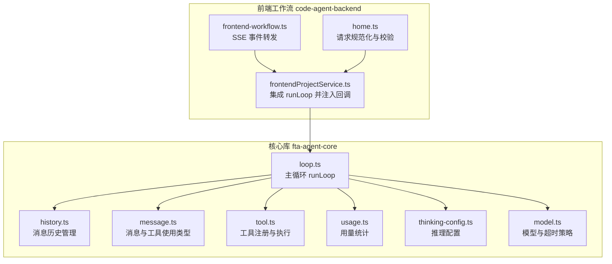
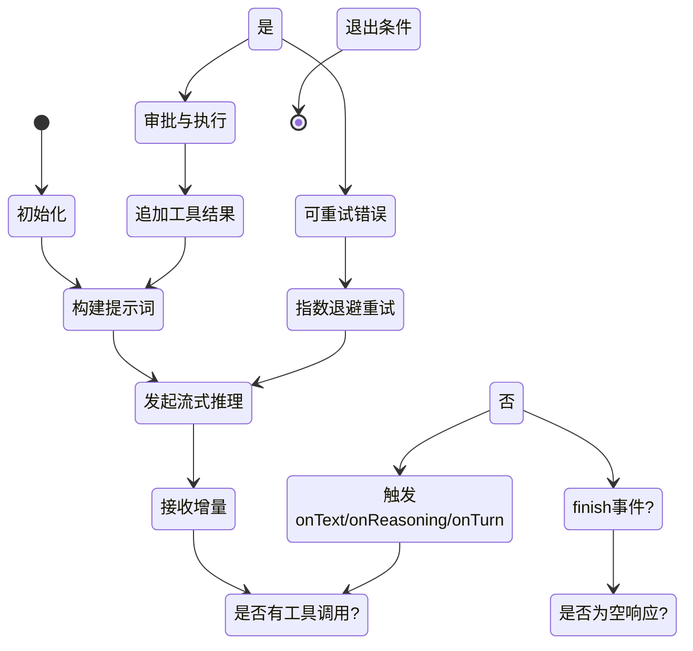
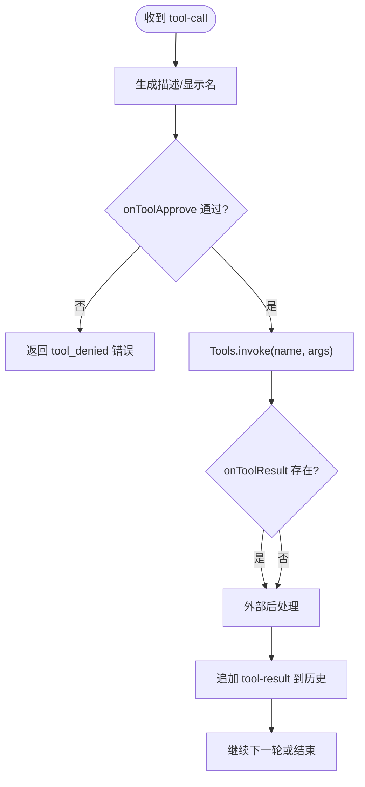
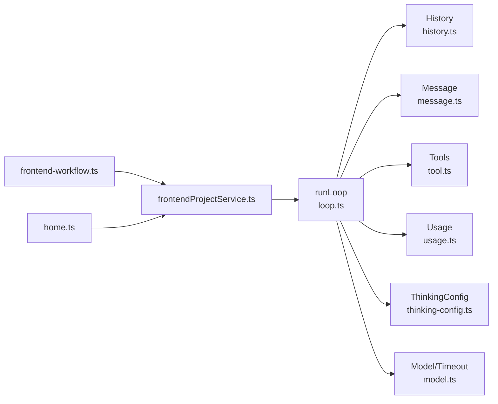

# 主循环控制机制

<cite>
**本文引用的文件**
- [loop.ts](file://fta-agent-core/src/loop.ts)
- [history.ts](file://fta-agent-core/src/history.ts)
- [message.ts](file://fta-agent-core/src/message.ts)
- [tool.ts](file://fta-agent-core/src/tool.ts)
- [usage.ts](file://fta-agent-core/src/usage.ts)
- [thinking-config.ts](file://fta-agent-core/src/thinking-config.ts)
- [model.ts](file://fta-agent-core/src/model.ts)
- [frontendProjectService.ts](file://fta-agent-core/src/frontendProjectService.ts)
- [query.ts](file://fta-agent-core/src/query.ts)
- [frontend-workflow.ts](file://code-agent-backend/src/controller/code-agent/frontend-workflow.ts)
- [home.ts](file://code-agent-backend/src/controller/home.ts)
</cite>

## 目录
1. [引言](#引言)
2. [项目结构](#项目结构)
3. [核心组件](#核心组件)
4. [架构总览](#架构总览)
5. [详细组件分析](#详细组件分析)
6. [依赖关系分析](#依赖关系分析)
7. [性能考量](#性能考量)
8. [故障排查指南](#故障排查指南)
9. [结论](#结论)

## 引言
本文件围绕 Agent 的主循环 runLoop 函数展开，系统性解析其执行机制与迭代流程，重点覆盖：
- 每个循环周期内 LLM 推理请求的构造、发送与响应解析
- 工具调用（Tool Call）的识别与处理
- 文本流式输出（onTextDelta）的回调与累积
- 循环终止条件（最大轮次、取消、空响应重试等）
- 回调函数 onMessage、onTurn、onStreamResult 的触发时机与数据流向
- 性能瓶颈与优化建议
- 错误处理与重试机制的实际代码路径

## 项目结构
本项目采用分层模块化组织，Agent 主循环位于核心库 fta-agent-core，前端工作流控制器在 code-agent-backend，二者通过回调与事件进行解耦协作。



图表来源
- [loop.ts](file://fta-agent-core/src/loop.ts#L109-L531)
- [history.ts](file://fta-agent-core/src/history.ts#L1-L288)
- [message.ts](file://fta-agent-core/src/message.ts#L1-L221)
- [tool.ts](file://fta-agent-core/src/tool.ts#L1-L275)
- [usage.ts](file://fta-agent-core/src/usage.ts#L1-L62)
- [thinking-config.ts](file://fta-agent-core/src/thinking-config.ts#L1-L26)
- [model.ts](file://fta-agent-core/src/model.ts#L47-L113)
- [frontendProjectService.ts](file://fta-agent-core/src/frontendProjectService.ts#L250-L302)
- [frontend-workflow.ts](file://code-agent-backend/src/controller/code-agent/frontend-workflow.ts#L161-L257)
- [home.ts](file://code-agent-backend/src/controller/home.ts#L38-L114)

章节来源
- [loop.ts](file://fta-agent-core/src/loop.ts#L109-L531)
- [frontendProjectService.ts](file://fta-agent-core/src/frontendProjectService.ts#L250-L302)

## 核心组件
- runLoop：主循环入口，负责构建提示词、驱动 LLM 流式推理、解析增量输出、处理工具调用、更新历史与用量、触发回调、判定终止条件与重试。
- History：维护消息历史，支持将内部消息格式转换为 LLM V2 消息，支持压缩与回溯。
- Tools：工具注册与执行，将工具暴露为 LLM 可用的 function 工具，并执行工具调用。
- Usage：用量统计，支持从事件与助手消息中汇总 prompt/completion/total tokens。
- Thinking 配置：根据模型能力启用推理模式（如 Claude Thinking）。
- 模型与超时：统一的模型创建与超时策略，合并外部 AbortSignal 与内部超时控制。

章节来源
- [loop.ts](file://fta-agent-core/src/loop.ts#L109-L531)
- [history.ts](file://fta-agent-core/src/history.ts#L1-L288)
- [tool.ts](file://fta-agent-core/src/tool.ts#L1-L275)
- [usage.ts](file://fta-agent-core/src/usage.ts#L1-L62)
- [thinking-config.ts](file://fta-agent-core/src/thinking-config.ts#L1-L26)
- [model.ts](file://fta-agent-core/src/model.ts#L47-L113)

## 架构总览
下图展示了 Agent 主循环在一次完整迭代中的关键交互与回调触发点。

```mermaid
sequenceDiagram
participant Caller as "调用方<br/>frontendProjectService.ts"
participant Loop as "runLoop<br/>loop.ts"
participant Hist as "History<br/>history.ts"
participant LLM as "模型客户端<br/>model.ts"
participant Tools as "工具集<br/>tool.ts"
participant SSE as "SSE 控制器<br/>frontend-workflow.ts"
Caller->>Loop : 初始化参数与回调
Loop->>Hist : 构建初始消息与历史
Loop->>Loop : 计算提示词系统+上下文+历史
Loop->>LLM : doStream(prompt, tools, toolChoice, abortSignal, ...)
LLM-->>Loop : 流式事件(text-delta/reasoning-delta/tool-call/finish/error)
Loop->>Caller : onTextDelta(textDelta)
Loop->>Caller : onChunk(chunk, requestId)
alt 收到 tool-call
Loop->>Caller : onToolUse(toolUse)
Loop->>Caller : onToolApprove(toolUse)
alt 审批通过
Loop->>Tools : invoke(name, args)
Tools-->>Loop : toolResult
Loop->>Caller : onToolResult(toolUse, toolResult, approved)
Loop->>Hist : 追加 tool 结果消息
else 审批拒绝
Loop-->>Caller : 返回 tool_denied 错误
end
else finish
Loop->>Caller : onText(text)
Loop->>Caller : onReasoning(reasoning)
Loop->>Caller : onTurn({usage, startTime, endTime})
end
Loop->>Caller : onStreamResult({requestId, prompt, model, tools, request, response, error?})
opt SSE 场景
Caller->>SSE : 转发 stream_result 等事件
end
```

图表来源
- [loop.ts](file://fta-agent-core/src/loop.ts#L109-L531)
- [frontendProjectService.ts](file://fta-agent-core/src/frontendProjectService.ts#L250-L302)
- [frontend-workflow.ts](file://code-agent-backend/src/controller/code-agent/frontend-workflow.ts#L222-L257)

## 详细组件分析

### runLoop 主循环与迭代状态机
- 迭代控制
  - 最大轮次限制：超过阈值返回“max_turns_exceeded”。
  - 取消信号：外部 AbortSignal 或内部超时合并后触发 cancel。
  - 历史压缩：可按阈值自动压缩历史以降低上下文开销。
- 提示词构建
  - 初始系统消息 + llmsContexts + 历史消息（转为 LLM V2 消息）。
  - 首轮对用户消息进行 At 归一化（注入文件/目录内容）。
- 流式推理
  - 使用 doStream 发送请求，遍历流事件，累计文本与推理内容，收集工具调用。
  - finish 事件用于汇总用量；error 事件用于构造可诊断错误。
- 终止条件
  - 无工具调用且无文本：抛出可重试错误，进入指数退避重试。
  - 审批拒绝：立即返回 tool_denied。
  - 无工具调用：本轮结束，退出主循环。
- 回调触发
  - onTextDelta/onChunk/onText/onReasoning/onTurn/onStreamResult 在不同阶段触发。
  - onToolUse/onToolApprove/onToolResult 用于工具调用链路。



图表来源
- [loop.ts](file://fta-agent-core/src/loop.ts#L109-L531)

章节来源
- [loop.ts](file://fta-agent-core/src/loop.ts#L109-L531)

### LLM 推理请求构造、发送与响应解析
- 请求构造
  - prompt：系统消息 + llmsContexts + 历史消息（V2 格式）。
  - tools：由 Tools.toLanguageV2Tools 生成函数工具列表。
  - toolChoice：自动选择。
  - abortSignal：分离的 AbortController，避免 ReadStream 锁定问题。
  - thinkingConfig：根据模型能力启用推理模式。
- 发送与流式解析
  - doStream 返回可迭代流，逐个事件处理：
    - text-delta：累积文本并触发 onTextDelta。
    - reasoning-delta：累积推理内容。
    - tool-call：记录工具调用（id/name/input）。
    - finish：汇总用量，若无文本且无工具调用则抛出可重试错误。
    - error：构造错误信息并标记是否可重试。
- 回调 onStreamResult
  - 每次推理循环结束后上报请求/响应元数据，便于日志与监控。

章节来源
- [loop.ts](file://fta-agent-core/src/loop.ts#L216-L369)
- [thinking-config.ts](file://fta-agent-core/src/thinking-config.ts#L1-L26)
- [model.ts](file://fta-agent-core/src/model.ts#L47-L113)

### 工具调用（Tool Call）识别与处理
- 识别
  - 流事件 tool-call 会累积到当前轮次的 toolCalls 列表。
- 描述与显示
  - 将工具调用转换为助手消息中的 tool_use 部分，附带描述与显示名。
- 执行前链路
  - onToolUse：允许外部修改工具调用参数。
  - onToolApprove：决定是否允许执行（默认通过），并可附加审批类别。
- 执行
  - Tools.invoke：解析参数并调用对应工具，返回 ToolResult。
  - onToolResult：允许外部对结果进行二次处理（如格式化、过滤）。
- 结果归档
  - 将工具结果转换为 tool-result 消息并写入历史。
- 终止条件
  - 若审批被拒绝，立即返回 tool_denied 错误。



图表来源
- [loop.ts](file://fta-agent-core/src/loop.ts#L371-L514)
- [tool.ts](file://fta-agent-core/src/tool.ts#L114-L140)

章节来源
- [loop.ts](file://fta-agent-core/src/loop.ts#L371-L514)
- [tool.ts](file://fta-agent-core/src/tool.ts#L114-L140)

### 文本流式输出（onTextDelta）与累积
- onTextDelta：每收到一个 text-delta 事件即触发，适合实时渲染。
- 累积逻辑：在循环内维护 text 字符串，finish 后触发 onText。
- reasoning：同理，累积 reasoning-delta 并在 finish 后触发 onReasoning。

章节来源
- [loop.ts](file://fta-agent-core/src/loop.ts#L252-L283)

### 回调函数触发时机与数据流向
- onMessage：历史消息添加时触发，可用于持久化与跨层同步。
- onTextDelta：增量文本到达时触发。
- onChunk：每次流事件到达时触发，便于日志与监控。
- onText：本轮文本累积完成时触发。
- onReasoning：本轮推理内容累积完成时触发。
- onTurn：每轮结束时触发，携带用量与时间戳。
- onStreamResult：每轮推理完成后触发，携带请求/响应元数据与错误信息。

章节来源
- [loop.ts](file://fta-agent-core/src/loop.ts#L109-L169)
- [loop.ts](file://fta-agent-core/src/loop.ts#L243-L250)
- [loop.ts](file://fta-agent-core/src/loop.ts#L252-L309)
- [loop.ts](file://fta-agent-core/src/loop.ts#L366-L376)
- [frontendProjectService.ts](file://fta-agent-core/src/frontendProjectService.ts#L250-L302)

### 历史管理与消息格式转换
- History.toLanguageV2Messages：将内部消息转换为 LLM V2 消息，支持 text、reasoning、tool-call、tool-result 等类型映射。
- 压缩：基于最近助手消息用量与模型上下文限制，按阈值进行压缩，减少 token 消耗。
- 追加消息：onMessage 回调用于持久化与通知。

章节来源
- [history.ts](file://fta-agent-core/src/history.ts#L68-L171)
- [history.ts](file://fta-agent-core/src/history.ts#L213-L288)

### 用量统计与上下文压缩
- Usage：支持从事件与助手消息中汇总 prompt/completion/total tokens。
- 压缩阈值：根据模型上下文限制与输出上限计算压缩阈值，必要时进行摘要压缩。

章节来源
- [usage.ts](file://fta-agent-core/src/usage.ts#L1-L62)
- [history.ts](file://fta-agent-core/src/history.ts#L213-L288)

### 错误处理与重试机制
- 可重试错误
  - 空响应（无文本且无工具调用）：抛出 isRetryable=true 的错误，进入指数退避重试。
  - 流式 error 事件：构造错误并标记是否可重试。
- 指数退避
  - 基于 attempt 计算延迟，期间轮询检查取消信号。
- 最终失败
  - 超过最大重试次数后返回 api_error，包含状态码、堆栈与重试次数等信息。
- 取消
  - 外部 AbortSignal 或内部超时合并后触发 cancel，返回 canceled 错误。

章节来源
- [loop.ts](file://fta-agent-core/src/loop.ts#L277-L309)
- [loop.ts](file://fta-agent-core/src/loop.ts#L312-L359)
- [loop.ts](file://fta-agent-core/src/loop.ts#L24-L36)
- [model.ts](file://fta-agent-core/src/model.ts#L47-L113)

### 与前端工作流的集成
- 前端服务集成
  - 前端项目服务调用 runLoop，并注入 onMessage/onTextDelta/onStreamResult/onChunk/onTurn/onToolApprove 等回调，用于日志与 UI 更新。
- SSE 事件
  - 控制器监听 onStreamResult 并转发为 SSE 事件，便于浏览器实时展示。
- 请求规范化
  - 后端控制器确保 OpenAI 风格 messages 与系统消息存在，并支持从请求体提取模型配置参数。

章节来源
- [frontendProjectService.ts](file://fta-agent-core/src/frontendProjectService.ts#L250-L302)
- [frontend-workflow.ts](file://code-agent-backend/src/controller/code-agent/frontend-workflow.ts#L222-L257)
- [home.ts](file://code-agent-backend/src/controller/home.ts#L38-L114)

## 依赖关系分析
- runLoop 依赖 History、Message、Tools、Usage、Thinking 配置、Model 超时策略。
- History 依赖 Message 类型与 Usage。
- Tools 依赖工具实现与 MCP 管理器。
- 前端工作流通过回调与 SSE 与 runLoop 解耦。



图表来源
- [loop.ts](file://fta-agent-core/src/loop.ts#L109-L531)
- [history.ts](file://fta-agent-core/src/history.ts#L1-L288)
- [message.ts](file://fta-agent-core/src/message.ts#L1-L221)
- [tool.ts](file://fta-agent-core/src/tool.ts#L1-L275)
- [usage.ts](file://fta-agent-core/src/usage.ts#L1-L62)
- [thinking-config.ts](file://fta-agent-core/src/thinking-config.ts#L1-L26)
- [model.ts](file://fta-agent-core/src/model.ts#L47-L113)
- [frontendProjectService.ts](file://fta-agent-core/src/frontendProjectService.ts#L250-L302)
- [frontend-workflow.ts](file://code-agent-backend/src/controller/code-agent/frontend-workflow.ts#L161-L257)
- [home.ts](file://code-agent-backend/src/controller/home.ts#L38-L114)

## 性能考量
- LLM 响应延迟
  - 流式事件逐块到达，onTextDelta 与 onChunk 可能成为 UI 更新瓶颈。建议前端侧节流/防抖渲染。
  - 超时策略：模型层统一超时控制，避免长时间阻塞；runLoop 内部指数退避重试，避免忙轮询。
- 工具执行阻塞
  - 工具执行可能阻塞主循环，建议：
    - 对高风险命令进行审批与隔离（已在工具层实现）。
    - 长任务后台化（如 bash 工具支持后台执行与输出查询）。
- 上下文膨胀
  - 历史压缩阈值与摘要策略可显著降低 token 使用，建议开启 autoCompact 并合理设置阈值。
- 并发与资源
  - 多轮工具调用时，注意工具执行的并发与资源占用，避免重复扫描或大文件读取。

[本节为通用指导，不直接分析具体文件]

## 故障排查指南
- 空响应重试
  - 现象：finish 事件后无文本且无工具调用。
  - 处理：runLoop 抛出可重试错误，指数退避后再次尝试。
  - 参考路径：[loop.ts](file://fta-agent-core/src/loop.ts#L277-L309)
- 流式错误
  - 现象：error 事件导致非可重试错误。
  - 处理：onStreamResult 汇报状态码与详情，最终返回 api_error。
  - 参考路径：[loop.ts](file://fta-agent-core/src/loop.ts#L283-L309)
- 取消操作
  - 现象：外部取消或超时。
  - 处理：返回 canceled 错误，包含轮次、历史与用量。
  - 参考路径：[loop.ts](file://fta-agent-core/src/loop.ts#L149-L158)
- 工具审批拒绝
  - 现象：onToolApprove 返回 false。
  - 处理：立即返回 tool_denied 错误。
  - 参考路径：[loop.ts](file://fta-agent-core/src/loop.ts#L458-L498)
- 前端事件转发
  - 现象：SSE stream_result 事件。
  - 处理：控制器记录并转发，便于前端实时展示。
  - 参考路径：[frontend-workflow.ts](file://code-agent-backend/src/controller/code-agent/frontend-workflow.ts#L222-L257)

章节来源
- [loop.ts](file://fta-agent-core/src/loop.ts#L149-L158)
- [loop.ts](file://fta-agent-core/src/loop.ts#L277-L309)
- [loop.ts](file://fta-agent-core/src/loop.ts#L458-L498)
- [frontend-workflow.ts](file://code-agent-backend/src/controller/code-agent/frontend-workflow.ts#L222-L257)

## 结论
runLoop 通过清晰的状态机与丰富的回调机制，实现了从提示词构建、流式推理、工具调用到历史归档与用量统计的闭环。其错误处理与重试策略兼顾鲁棒性与可观测性，配合前端工作流的 SSE 事件转发，能够支撑复杂交互场景下的稳定运行。建议在生产环境中启用历史压缩、合理设置最大轮次与重试次数，并对高风险工具执行进行审批与后台化处理，以获得更佳的性能与安全性。