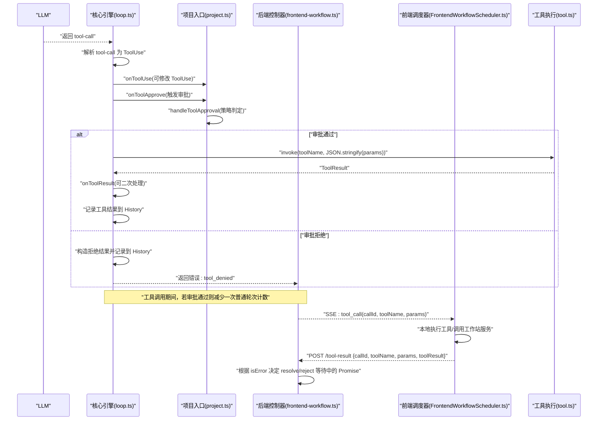
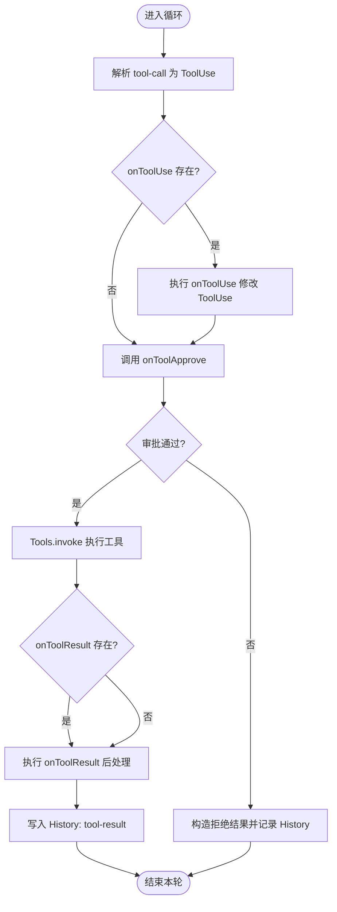
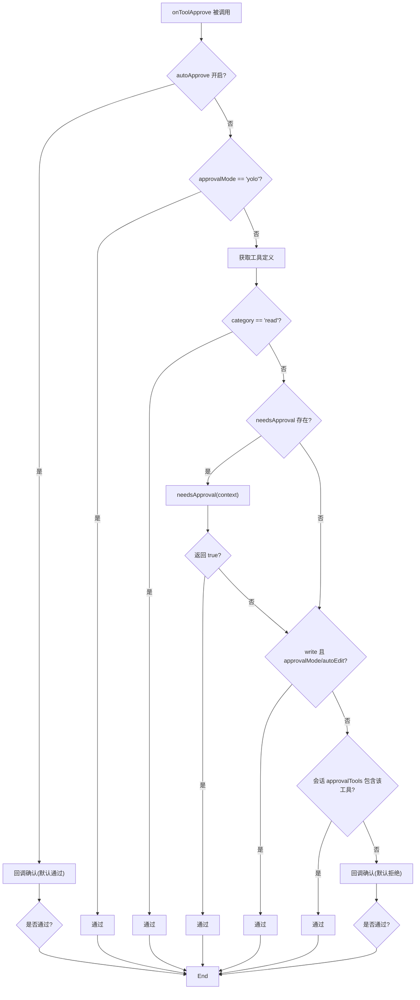
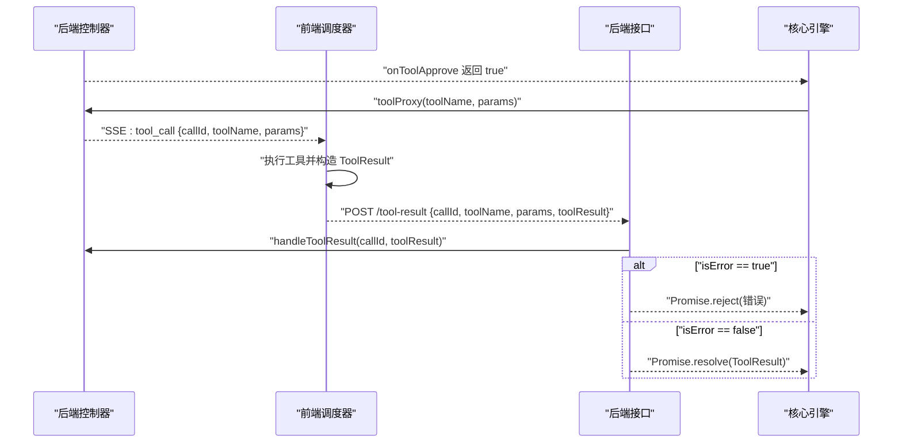

# 工具调用决策

<cite>
**本文引用的文件列表**
- [frontend-workflow.ts](file://code-agent-backend/src/controller/code-agent/frontend-workflow.ts)
- [frontend-workflow.service.ts](file://code-agent-backend/src/service/code-agent/frontend-workflow.ts)
- [frontend-workflow.dto.ts](file://code-agent-backend/src/dto/code-agent/frontend-workflow.dto.ts)
- [FrontendWorkflowScheduler.ts](file://fta-layout-design/src/pages/EditorPage/services/FrontendWorkflowScheduler.ts)
- [project.ts](file://fta-agent-core/src/project.ts)
- [loop.ts](file://fta-agent-core/src/loop.ts)
- [tool.ts](file://fta-agent-core/src/tool.ts)
- [history.ts](file://fta-agent-core/src/history.ts)
- [session.ts](file://fta-agent-core/src/session.ts)
- [usage.ts](file://fta-agent-core/src/usage.ts)
- [frontend-workflow-api.md](file://code-agent-backend/docs/frontend-workflow-api.md)
</cite>

## 目录
1. [引言](#引言)
2. [项目结构](#项目结构)
3. [核心组件](#核心组件)
4. [架构总览](#架构总览)
5. [详细组件分析](#详细组件分析)
6. [依赖关系分析](#依赖关系分析)
7. [性能考量](#性能考量)
8. [故障排查指南](#故障排查指南)
9. [结论](#结论)

## 引言
本文围绕“工具调用决策”主题，系统梳理从 LLM 返回 tool-call 响应到工具执行与审批的完整流程，重点覆盖以下方面：
- 工具调用的解析与参数处理
- 审批机制与 onToolApprove 回调的触发时机与决策逻辑
- 用户干预对工作流的影响（前端通过 tool_call 事件与 /tool-result 接口进行交互）
- 工具执行结果的处理（成功与拒绝两种分支）
- 工具调用历史记录的管理方式
- 工具调用对对话轮次计数的影响机制

## 项目结构
该功能横跨后端控制器、服务层、前端调度器与核心引擎四部分：
- 后端控制器负责 SSE 事件推送与工具结果回传接口
- 服务层封装工作流执行入口，注入回调与工具代理
- 前端调度器负责解析 SSE 事件、发起工具调用、回传结果
- 核心引擎负责工具解析、审批、执行、历史记录与统计

```mermaid
graph TB
subgraph "后端"
C["控制器<br/>frontend-workflow.ts"]
S["服务层<br/>frontend-workflow.service.ts"]
end
subgraph "前端"
FWS["前端调度器<br/>FrontendWorkflowScheduler.ts"]
end
subgraph "核心引擎"
P["项目入口与审批<br/>project.ts"]
L["循环与工具执行<br/>loop.ts"]
T["工具定义与执行<br/>tool.ts"]
H["历史记录<br/>history.ts"]
SESS["会话与配置<br/>session.ts"]
U["用量统计<br/>usage.ts"]
end
C --> S
S --> P
P --> L
L --> T
L --> H
L --> U
C <- --> FWS
SESS -.-> P
```

图表来源
- [frontend-workflow.ts](file://code-agent-backend/src/controller/code-agent/frontend-workflow.ts#L83-L309)
- [frontend-workflow.service.ts](file://code-agent-backend/src/service/code-agent/frontend-workflow.ts#L74-L279)
- [FrontendWorkflowScheduler.ts](file://fta-layout-design/src/pages/EditorPage/services/FrontendWorkflowScheduler.ts#L130-L521)
- [project.ts](file://fta-agent-core/src/project.ts#L202-L247)
- [loop.ts](file://fta-agent-core/src/loop.ts#L371-L531)
- [tool.ts](file://fta-agent-core/src/tool.ts#L114-L141)
- [history.ts](file://fta-agent-core/src/history.ts#L26-L37)
- [session.ts](file://fta-agent-core/src/session.ts#L21-L23)
- [usage.ts](file://fta-agent-core/src/usage.ts#L1-L61)

章节来源
- [frontend-workflow.ts](file://code-agent-backend/src/controller/code-agent/frontend-workflow.ts#L83-L309)
- [frontend-workflow.service.ts](file://code-agent-backend/src/service/code-agent/frontend-workflow.ts#L74-L279)
- [FrontendWorkflowScheduler.ts](file://fta-layout-design/src/pages/EditorPage/services/FrontendWorkflowScheduler.ts#L130-L521)
- [project.ts](file://fta-agent-core/src/project.ts#L202-L247)
- [loop.ts](file://fta-agent-core/src/loop.ts#L371-L531)
- [tool.ts](file://fta-agent-core/src/tool.ts#L114-L141)
- [history.ts](file://fta-agent-core/src/history.ts#L26-L37)
- [session.ts](file://fta-agent-core/src/session.ts#L21-L23)
- [usage.ts](file://fta-agent-core/src/usage.ts#L1-L61)

## 核心组件
- 工具调用解析与执行：核心引擎在循环中解析 LLM 返回的 tool-call，构造 ToolUse，调用 onToolUse/onToolApprove/onToolResult，并通过 Tools.invoke 执行具体工具。
- 审批策略：项目入口提供 handleToolApproval，综合 autoApprove、approvalMode、工具分类、needsApproval、会话配置与回调决定是否放行。
- 前后端协作：后端通过 SSE 推送 tool_call 事件；前端收到事件后执行工具并回传 /tool-result；后端据此恢复等待中的工具调用 Promise。
- 历史记录与统计：工具结果写入 History；对话轮次与工具调用次数在循环中统计并返回。

章节来源
- [loop.ts](file://fta-agent-core/src/loop.ts#L371-L531)
- [project.ts](file://fta-agent-core/src/project.ts#L258-L308)
- [frontend-workflow.ts](file://code-agent-backend/src/controller/code-agent/frontend-workflow.ts#L141-L195)
- [FrontendWorkflowScheduler.ts](file://fta-layout-design/src/pages/EditorPage/services/FrontendWorkflowScheduler.ts#L290-L521)
- [history.ts](file://fta-agent-core/src/history.ts#L26-L37)

## 架构总览
下面的序列图展示了从 LLM 返回 tool-call 到工具执行与审批的端到端流程，以及前端用户干预的关键节点。



图表来源
- [loop.ts](file://fta-agent-core/src/loop.ts#L371-L531)
- [project.ts](file://fta-agent-core/src/project.ts#L258-L308)
- [frontend-workflow.ts](file://code-agent-backend/src/controller/code-agent/frontend-workflow.ts#L141-L195)
- [FrontendWorkflowScheduler.ts](file://fta-layout-design/src/pages/EditorPage/services/FrontendWorkflowScheduler.ts#L290-L521)
- [tool.ts](file://fta-agent-core/src/tool.ts#L114-L141)

## 详细组件分析

### 工具调用解析与执行（核心引擎）
- 解析阶段：将 LLM 返回的 tool-call 转换为 ToolUse，同时尝试解析输入参数为 JSON。
- 生命周期钩子：
  - onToolUse：允许在执行前修改 ToolUse（例如补充描述或显示名）。
  - onToolApprove：核心审批入口，默认委托给 handleToolApproval。
  - onToolResult：允许在结果返回后进行二次处理。
- 执行阶段：通过 Tools.invoke 执行工具，内部对参数进行 JSON 解析并调用工具 execute。
- 结果记录：将工具结果以 tool-result 形式写入 History，便于后续上下文压缩与调试。



图表来源
- [loop.ts](file://fta-agent-core/src/loop.ts#L371-L531)
- [tool.ts](file://fta-agent-core/src/tool.ts#L114-L141)
- [history.ts](file://fta-agent-core/src/history.ts#L26-L37)

章节来源
- [loop.ts](file://fta-agent-core/src/loop.ts#L371-L531)
- [tool.ts](file://fta-agent-core/src/tool.ts#L114-L141)
- [history.ts](file://fta-agent-core/src/history.ts#L26-L37)

### 审批机制与 onToolApprove 决策逻辑
onToolApprove 默认由项目入口的 handleToolApproval 实现，决策链路如下：
- autoApprove：若开启，则直接调用回调进行最终确认（默认通过）。
- approvalMode：若为 yolo，则直接放行。
- 工具分类：read 类工具默认放行；write 类工具若会话模式为 autoEdit 或全局 approvalMode 为 autoEdit 则放行。
- needsApproval：若工具声明了 needsApproval，按其返回值决定是否放行。
- 会话配置：若工具名在会话 approvalTools 列表中则放行。
- 回调：最后调用 onToolApprove 回调，若未显式返回则默认拒绝。



图表来源
- [project.ts](file://fta-agent-core/src/project.ts#L258-L308)

章节来源
- [project.ts](file://fta-agent-core/src/project.ts#L258-L308)

### 前后端协作：SSE 事件与工具结果回传
- 后端推送：当核心引擎需要执行工具时，后端通过 toolProxy 创建 callId 并推送 SSE 事件 tool_call，携带 toolName、params、callId。
- 前端接收：前端调度器解析 tool_call 事件，根据工具名分派到对应执行逻辑（如 read/write/ls/grep/glob/edit/rm/verify/bash 等），并将结果通过 /tool-result 接口回传。
- 后端回填：后端控制器根据 toolResult.isError 决定 resolve 或 reject 对应 callId 的等待 Promise，从而恢复核心引擎的执行。



图表来源
- [frontend-workflow.ts](file://code-agent-backend/src/controller/code-agent/frontend-workflow.ts#L141-L195)
- [frontend-workflow.ts](file://code-agent-backend/src/controller/code-agent/frontend-workflow.ts#L48-L81)
- [FrontendWorkflowScheduler.ts](file://fta-layout-design/src/pages/EditorPage/services/FrontendWorkflowScheduler.ts#L290-L521)

章节来源
- [frontend-workflow.ts](file://code-agent-backend/src/controller/code-agent/frontend-workflow.ts#L141-L195)
- [frontend-workflow.ts](file://code-agent-backend/src/controller/code-agent/frontend-workflow.ts#L48-L81)
- [FrontendWorkflowScheduler.ts](file://fta-layout-design/src/pages/EditorPage/services/FrontendWorkflowScheduler.ts#L290-L521)

### 工具执行结果处理：成功与拒绝
- 成功执行：工具返回 ToolResult，onToolResult 可对其进行二次处理，随后写入 History 的 tool 消息，最终返回给上层。
- 拒绝执行：构造包含错误信息的 ToolResult（isError=true），同样写入 History，并返回错误类型 tool_denied，终止当前轮次。

章节来源
- [loop.ts](file://fta-agent-core/src/loop.ts#L432-L498)
- [history.ts](file://fta-agent-core/src/history.ts#L26-L37)

### 工具调用历史记录管理
- 写入位置：工具结果以 tool-result 形式追加到 History.messages。
- 读取与转换：History.toLanguageV2Messages 会将 tool-result 转换为标准的 tool 角色消息，供模型消费。
- 会话恢复：Session.resume 从日志加载消息并构建 History，支持断点续跑。

章节来源
- [loop.ts](file://fta-agent-core/src/loop.ts#L472-L513)
- [history.ts](file://fta-agent-core/src/history.ts#L134-L167)
- [session.ts](file://fta-agent-core/src/session.ts#L35-L44)

### 对话轮次计数与工具调用计数
- 工具调用计数：审批通过后，toolCallsCount++，用于统计工具调用次数。
- 轮次计数：工具调用期间，为避免因工具调用导致普通轮次被过早终止，会将 turnsCount--，从而放宽轮次限制。
- 最终统计：循环结束后，metadata 中包含 turnsCount、toolCallsCount、duration 等指标。

章节来源
- [loop.ts](file://fta-agent-core/src/loop.ts#L442-L457)
- [loop.ts](file://fta-agent-core/src/loop.ts#L516-L531)

## 依赖关系分析
- 控制器依赖服务层执行工作流，并注入 toolProxy 与回调。
- 服务层依赖项目入口（project.ts）提供的工作流执行能力，将回调与工具代理传入核心引擎。
- 前端调度器依赖后端 SSE 事件与 /tool-result 接口，实现用户干预与工具执行闭环。
- 核心引擎依赖工具集合（tool.ts）、历史记录（history.ts）、会话（session.ts）与用量（usage.ts）。

```mermaid
graph LR
Ctrl["frontend-workflow.ts"] --> Svc["frontend-workflow.service.ts"]
Svc --> Proj["project.ts"]
Proj --> Loop["loop.ts"]
Loop --> Tool["tool.ts"]
Loop --> Hist["history.ts"]
Proj --> Sess["session.ts"]
Loop --> Usage["usage.ts"]
Ctrl <- --> FE["FrontendWorkflowScheduler.ts"]
```

图表来源
- [frontend-workflow.ts](file://code-agent-backend/src/controller/code-agent/frontend-workflow.ts#L83-L309)
- [frontend-workflow.service.ts](file://code-agent-backend/src/service/code-agent/frontend-workflow.ts#L74-L279)
- [project.ts](file://fta-agent-core/src/project.ts#L202-L247)
- [loop.ts](file://fta-agent-core/src/loop.ts#L371-L531)
- [tool.ts](file://fta-agent-core/src/tool.ts#L114-L141)
- [history.ts](file://fta-agent-core/src/history.ts#L26-L37)
- [session.ts](file://fta-agent-core/src/session.ts#L21-L23)
- [usage.ts](file://fta-agent-core/src/usage.ts#L1-L61)
- [FrontendWorkflowScheduler.ts](file://fta-layout-design/src/pages/EditorPage/services/FrontendWorkflowScheduler.ts#L130-L521)

## 性能考量
- 工具调用计数与轮次计数：工具调用不会增加普通轮次上限，有助于避免因工具调用导致的过早终止。
- 历史压缩：History.compress 基于用量阈值与模型上下文限制进行压缩，降低上下文成本。
- 参数解析：工具参数 JSON 解析失败时快速返回错误，避免无效执行。

章节来源
- [loop.ts](file://fta-agent-core/src/loop.ts#L442-L457)
- [history.ts](file://fta-agent-core/src/history.ts#L244-L287)
- [tool.ts](file://fta-agent-core/src/tool.ts#L131-L139)

## 故障排查指南
- 工具调用超时：后端在 toolProxy 中为每个 callId 设置 60 秒超时，超时后会清理并 reject，检查前端是否及时回传 /tool-result。
- 审批未生效：确认 onToolApprove 是否被正确覆盖；若使用 autoApprove 或 approvalMode=yolo，审批将自动通过。
- 参数解析失败：工具参数 JSON 解析失败会返回错误结果，检查前端传参格式与后端参数 schema。
- 历史记录异常：若历史记录无法加载或转换异常，检查日志文件格式与字段完整性。
- 前端中断：前端 AbortController 中断会触发后端 aborted 事件，检查前端中断逻辑与后端清理流程。

章节来源
- [frontend-workflow.ts](file://code-agent-backend/src/controller/code-agent/frontend-workflow.ts#L176-L194)
- [frontend-workflow.ts](file://code-agent-backend/src/controller/code-agent/frontend-workflow.ts#L310-L344)
- [project.ts](file://fta-agent-core/src/project.ts#L258-L308)
- [tool.ts](file://fta-agent-core/src/tool.ts#L131-L139)
- [session.ts](file://fta-agent-core/src/session.ts#L158-L175)

## 结论
本系统通过清晰的生命周期钩子与前后端协作，实现了可控、可观测的工具调用决策与执行闭环。onToolApprove 作为关键决策点，结合工具分类、会话配置与回调，既保证安全，又兼顾灵活性。工具执行结果统一写入历史记录，便于后续分析与压缩。对话轮次计数在工具调用期间进行补偿，确保工作流的稳定性与效率。