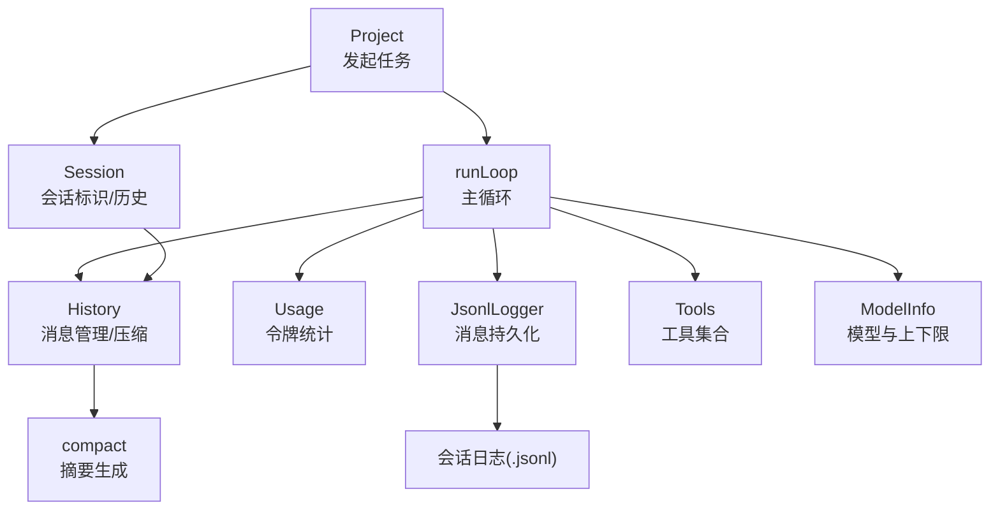
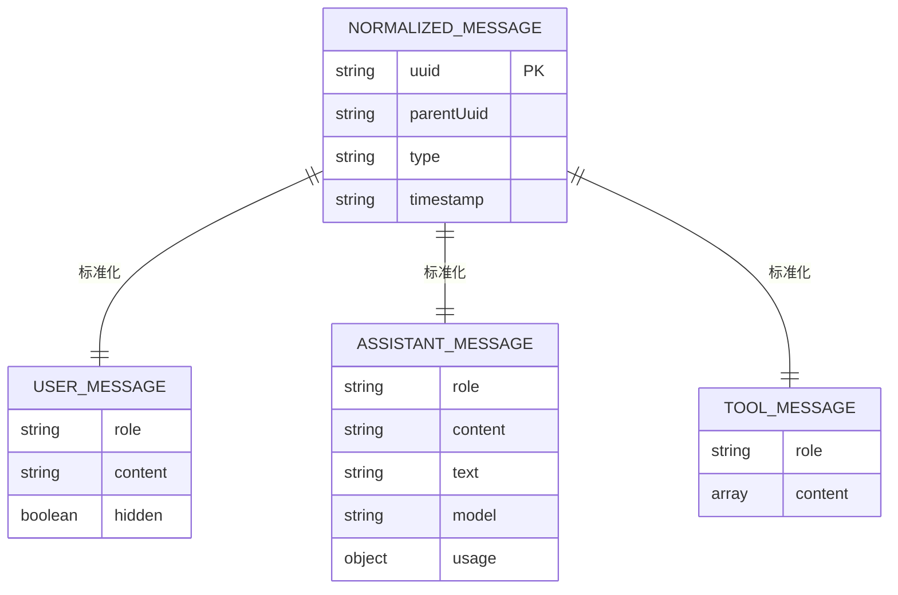
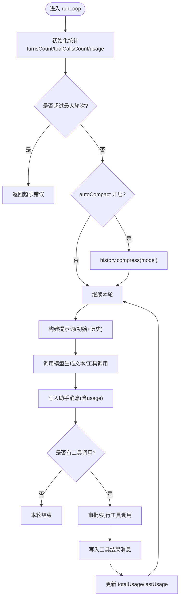
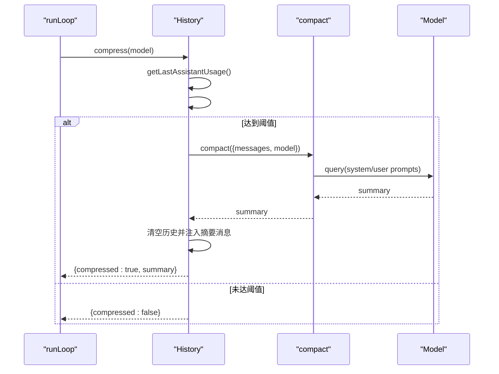
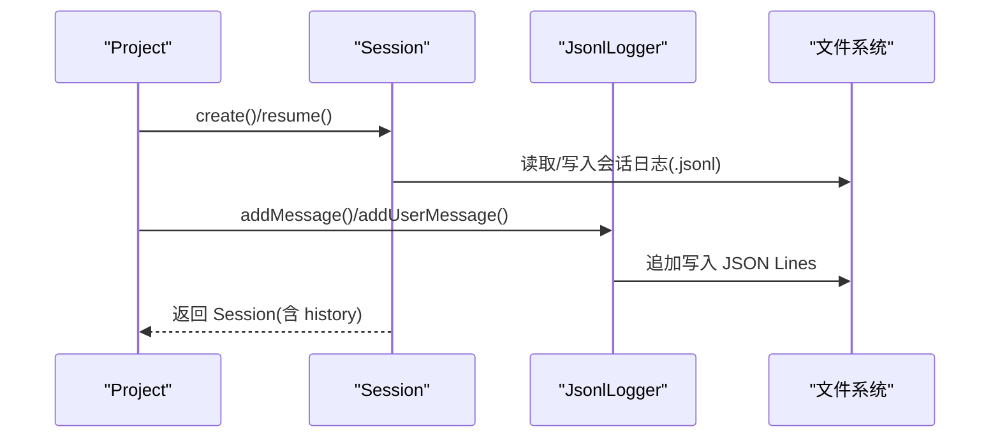
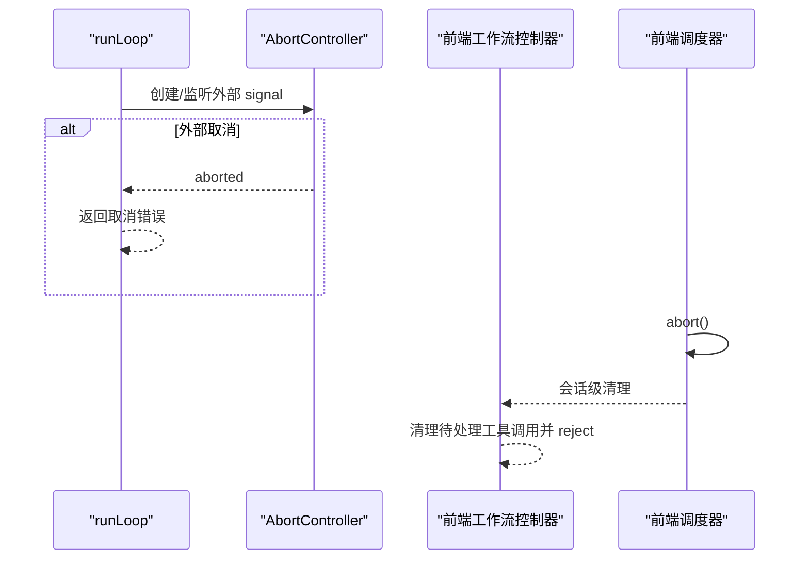
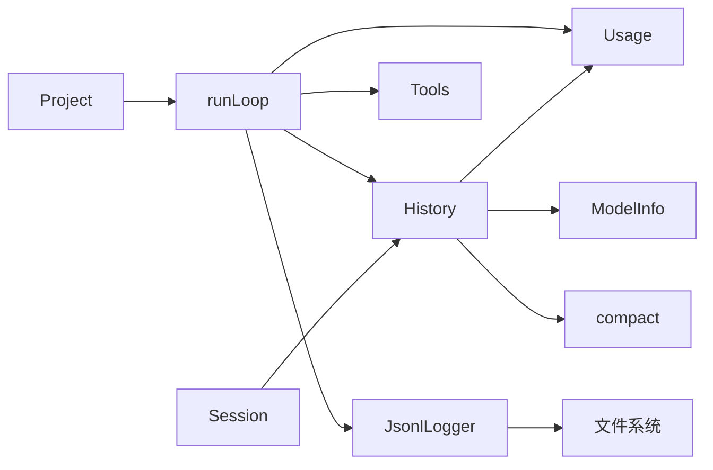

# 状态管理机制

<cite>
**本文引用的文件列表**
- [fta-agent-core/src/history.ts](file://fta-agent-core/src/history.ts)
- [fta-agent-core/src/message.ts](file://fta-agent-core/src/message.ts)
- [fta-agent-core/src/usage.ts](file://fta-agent-core/src/usage.ts)
- [fta-agent-core/src/loop.ts](file://fta-agent-core/src/loop.ts)
- [fta-agent-core/src/session.ts](file://fta-agent-core/src/session.ts)
- [fta-agent-core/src/jsonl.ts](file://fta-agent-core/src/jsonl.ts)
- [fta-agent-core/src/compact.ts](file://fta-agent-core/src/compact.ts)
- [fta-agent-core/src/constants.ts](file://fta-agent-core/src/constants.ts)
- [fta-agent-core/src/model.ts](file://fta-agent-core/src/model.ts)
- [fta-agent-core/src/project.ts](file://fta-agent-core/src/project.ts)
- [code-agent-backend/src/controller/code-agent/frontend-workflow.ts](file://code-agent-backend/src/controller/code-agent/frontend-workflow.ts)
- [fta-layout-design/src/pages/EditorPage/services/FrontendWorkflowScheduler.ts](file://fta-layout-design/src/pages/EditorPage/services/FrontendWorkflowScheduler.ts)
</cite>

## 目录
1. [引言](#引言)
2. [项目结构与角色定位](#项目结构与角色定位)
3. [核心组件总览](#核心组件总览)
4. [架构概览](#架构概览)
5. [详细组件分析](#详细组件分析)
6. [依赖关系分析](#依赖关系分析)
7. [性能与资源控制](#性能与资源控制)
8. [故障排查指南](#故障排查指南)
9. [结论](#结论)

## 引言
本文件系统性解析 Agent 运行时的状态管理机制，重点聚焦 History 类在对话历史管理中的职责与实现；阐明用户消息、助手消息与工具结果消息的组织结构；解释对话轮次(turnsCount)、工具调用计数(toolCallsCount)与使用量统计(usage)的维护逻辑；深入分析自动压缩(autoCompact)的触发条件与实现流程；结合代码路径说明会话状态的持久化策略，并解释 AbortController 在状态取消与清理中的应用。

## 项目结构与角色定位
- 核心运行时位于 fta-agent-core：
  - 历史管理：History 类负责消息的增删改查、格式转换、压缩与使用量统计辅助
  - 消息模型：Message/NormalizedMessage 定义消息结构与类型
  - 使用量统计：Usage 类提供令牌统计与聚合
  - 循环执行：runLoop 负责一轮或多轮对话、工具调用、消息写入与统计
  - 会话管理：Session 封装会话标识、历史与配置
  - 日志记录：JsonlLogger/RequestLogger 提供消息与请求元数据的持久化
  - 压缩：compact 调用模型对历史进行总结压缩
  - 常量与模型：MIN_TOKEN_THRESHOLD、模型上下文限制等
- 前端工作流控制器与调度器：
  - 后端控制器：前端工作流中对工具调用的挂起与清理
  - 前端调度器：通过 AbortController 终止 SSE 连接

**Section sources**
- [fta-agent-core/src/history.ts](file://fta-agent-core/src/history.ts#L1-L288)
- [fta-agent-core/src/message.ts](file://fta-agent-core/src/message.ts#L1-L221)
- [fta-agent-core/src/usage.ts](file://fta-agent-core/src/usage.ts#L1-L62)
- [fta-agent-core/src/loop.ts](file://fta-agent-core/src/loop.ts#L1-L200)
- [fta-agent-core/src/session.ts](file://fta-agent-core/src/session.ts#L1-L175)
- [fta-agent-core/src/jsonl.ts](file://fta-agent-core/src/jsonl.ts#L1-L101)
- [fta-agent-core/src/compact.ts](file://fta-agent-core/src/compact.ts#L1-L33)
- [fta-agent-core/src/constants.ts](file://fta-agent-core/src/constants.ts#L1-L18)
- [fta-agent-core/src/model.ts](file://fta-agent-core/src/model.ts#L1-L114)
- [code-agent-backend/src/controller/code-agent/frontend-workflow.ts](file://code-agent-backend/src/controller/code-agent/frontend-workflow.ts#L161-L367)
- [fta-layout-design/src/pages/EditorPage/services/FrontendWorkflowScheduler.ts](file://fta-layout-design/src/pages/EditorPage/services/FrontendWorkflowScheduler.ts#L502-L520)

## 核心组件总览
- History：维护 NormalizedMessage 列表，支持按 UUID 获取路径、转换为模型输入格式、计算最近一次助手消息的使用量、基于阈值与模型上下限决定是否压缩、执行压缩并替换为摘要消息
- Message/NormalizedMessage：统一用户、助手、工具消息的结构，包含 parentUuid、uuid、timestamp、type 等通用字段
- Usage：令牌统计对象，支持从事件或助手消息构造、加法与克隆
- runLoop：主执行循环，维护 turnsCount、toolCallsCount、totalUsage，按需调用 History.compress，将消息写入历史并更新使用量
- Session：封装会话标识、历史与配置，支持创建与恢复（从日志）
- JsonlLogger/RequestLogger：以 JSON Lines 方式记录消息与请求元数据
- compact：调用模型生成摘要，替换历史
- AbortController：在多处用于取消与清理，包括 LLM 超时合并、前端工作流工具调用清理、前端调度器中断

**Section sources**
- [fta-agent-core/src/history.ts](file://fta-agent-core/src/history.ts#L1-L288)
- [fta-agent-core/src/message.ts](file://fta-agent-core/src/message.ts#L1-L221)
- [fta-agent-core/src/usage.ts](file://fta-agent-core/src/usage.ts#L1-L62)
- [fta-agent-core/src/loop.ts](file://fta-agent-core/src/loop.ts#L1-L200)
- [fta-agent-core/src/session.ts](file://fta-agent-core/src/session.ts#L1-L175)
- [fta-agent-core/src/jsonl.ts](file://fta-agent-core/src/jsonl.ts#L1-L101)
- [fta-agent-core/src/compact.ts](file://fta-agent-core/src/compact.ts#L1-L33)

## 架构概览
下图展示从 Project 发起任务到 runLoop 执行、History 管理历史、Usage 统计、JsonlLogger 记录、History 压缩的整体流程。



**Diagram sources**
- [fta-agent-core/src/project.ts](file://fta-agent-core/src/project.ts#L1-L200)
- [fta-agent-core/src/loop.ts](file://fta-agent-core/src/loop.ts#L1-L200)
- [fta-agent-core/src/history.ts](file://fta-agent-core/src/history.ts#L1-L288)
- [fta-agent-core/src/usage.ts](file://fta-agent-core/src/usage.ts#L1-L62)
- [fta-agent-core/src/jsonl.ts](file://fta-agent-core/src/jsonl.ts#L1-L101)
- [fta-agent-core/src/compact.ts](file://fta-agent-core/src/compact.ts#L1-L33)
- [fta-agent-core/src/model.ts](file://fta-agent-core/src/model.ts#L1-L114)
- [fta-agent-core/src/session.ts](file://fta-agent-core/src/session.ts#L1-L175)

## 详细组件分析

### History 类：对话历史管理与压缩
- 消息存储结构
  - NormalizedMessage：统一字段包括 parentUuid、uuid、timestamp、type 等，便于回溯路径与序列化
  - 用户消息：role=user，content 支持字符串或文本+图片片段数组
  - 助手消息：role=assistant，content 支持字符串、文本、推理(reasoning)与工具调用(tool_use)
  - 工具结果消息：role=tool，content 为工具结果片段数组，兼容旧格式
- 路径查询与过滤
  - getMessagesToUuid：基于 uuid 映射与父链回溯，返回从目标消息到根的消息子集
  - filterMessages：仅保留 type=message 的消息，并沿 parent 链回溯至根，得到活跃路径
- 模型输入转换
  - toLanguageV2Messages：将内部消息转换为模型期望的结构，处理文本、图片、推理、工具调用与工具结果
- 使用量统计辅助
  - getLastAssistantUsage：从尾部向前扫描，定位当前会话边界与最近一次助手消息，返回其使用量
- 压缩触发与实现
  - #shouldCompress：基于最小令牌阈值、模型上下文限制、输出上限与预留空间计算压缩阈值，判断是否需要压缩
  - compress：若满足阈值，调用 compact 生成摘要，清空历史并注入一条摘要消息，同时触发 onMessage 回调

```mermaid
classDiagram
class History {
+messages : NormalizedMessage[]
+onMessage? : OnMessage
+addMessage(message, uuid?) void
+getMessagesToUuid(uuid) NormalizedMessage[]
+toLanguageV2Messages() LanguageModelV2Message[]
-#shouldCompress(model, usage) boolean
-#getLastAssistantUsage() Usage
+compress(model) Promise<{compressed : boolean, summary? : string}>
}
class Usage {
+promptTokens : number
+completionTokens : number
+totalTokens : number
+fromAssistantMessage(message) Usage
+add(other) void
+clone() Usage
}
class Message {
<<interface>>
}
class NormalizedMessage {
<<interface>>
}
History --> Usage : "使用"
History --> Message : "管理"
History --> NormalizedMessage : "管理"
```

**Diagram sources**
- [fta-agent-core/src/history.ts](file://fta-agent-core/src/history.ts#L1-L288)
- [fta-agent-core/src/usage.ts](file://fta-agent-core/src/usage.ts#L1-L62)
- [fta-agent-core/src/message.ts](file://fta-agent-core/src/message.ts#L1-L221)

**Section sources**
- [fta-agent-core/src/history.ts](file://fta-agent-core/src/history.ts#L1-L288)
- [fta-agent-core/src/message.ts](file://fta-agent-core/src/message.ts#L1-L221)
- [fta-agent-core/src/usage.ts](file://fta-agent-core/src/usage.ts#L1-L62)

### 对话消息的存储结构与组织方式
- 用户消息(UserMessage)
  - role='user'，content 支持字符串或文本+图片片段
  - 通过 createUserMessage 创建，携带 parentUuid、uuid、timestamp
- 助手消息(AssistantMessage)
  - role='assistant'，content 支持字符串、文本、推理与工具调用
  - 包含模型名与 usage 字段，用于统计输入/输出令牌
- 工具结果消息(ToolMessage/ToolMessage2)
  - role='tool' 或 'user'（兼容旧格式），content 为工具结果片段数组
  - 每个片段包含工具调用ID、名称、输入与结果
- NormalizedMessage
  - 统一字段：type='message'、timestamp、uuid、parentUuid
  - 作为 History 内部的标准消息形态，便于路径回溯与序列化



**Diagram sources**
- [fta-agent-core/src/message.ts](file://fta-agent-core/src/message.ts#L1-L221)

**Section sources**
- [fta-agent-core/src/message.ts](file://fta-agent-core/src/message.ts#L1-L221)

### 对话轮次(turnsCount)、工具调用计数(toolCallsCount)与使用量统计(usage)的维护逻辑
- runLoop 初始化
  - turnsCount、toolCallsCount、finalText、lastUsage、totalUsage 初始化
  - 构造 History 并设置 onMessage 回调
- 轮次推进
  - 每轮开始前自增 turnsCount；超过最大轮次阈值则返回错误结果
  - 若开启 autoCompact，则在每轮开始前尝试压缩历史
- 使用量统计
  - 每轮开始重置 lastUsage；根据助手消息的 usage 字段累加到 totalUsage
  - History.getLastAssistantUsage 用于获取最近一次助手消息的使用量，作为压缩阈值依据
- 工具调用计数
  - 工具调用成功后 toolCallsCount++；被拒绝时也计入，但不会增加正常轮次计数
- 结果返回
  - metadata 中包含 turnsCount、toolCallsCount、duration



**Diagram sources**
- [fta-agent-core/src/loop.ts](file://fta-agent-core/src/loop.ts#L1-L200)
- [fta-agent-core/src/history.ts](file://fta-agent-core/src/history.ts#L1-L288)
- [fta-agent-core/src/usage.ts](file://fta-agent-core/src/usage.ts#L1-L62)

**Section sources**
- [fta-agent-core/src/loop.ts](file://fta-agent-core/src/loop.ts#L1-L200)
- [fta-agent-core/src/history.ts](file://fta-agent-core/src/history.ts#L1-L288)
- [fta-agent-core/src/usage.ts](file://fta-agent-core/src/usage.ts#L1-L62)

### 自动压缩(autoCompact)：触发条件与实现机制
- 触发时机
  - runLoop 每轮开始时，若配置了 autoCompact，则调用 history.compress(model)
- 触发条件判定
  - #shouldCompress：当最近一次助手消息的 totalTokens 超过 MIN_TOKEN_THRESHOLD 且达到基于模型上下文限制与输出上限计算出的阈值时，触发压缩
- 实现流程
  - 调用 compact 生成摘要文本
  - 清空历史消息并注入一条带有摘要内容的用户消息
  - 触发 onMessage 回调，通知上层历史已更新
- 失败处理
  - 生成摘要为空或失败时抛出异常，阻止继续推进



**Diagram sources**
- [fta-agent-core/src/history.ts](file://fta-agent-core/src/history.ts#L173-L286)
- [fta-agent-core/src/compact.ts](file://fta-agent-core/src/compact.ts#L1-L33)
- [fta-agent-core/src/loop.ts](file://fta-agent-core/src/loop.ts#L189-L194)
- [fta-agent-core/src/constants.ts](file://fta-agent-core/src/constants.ts#L1-L18)
- [fta-agent-core/src/model.ts](file://fta-agent-core/src/model.ts#L1-L114)

**Section sources**
- [fta-agent-core/src/history.ts](file://fta-agent-core/src/history.ts#L173-L286)
- [fta-agent-core/src/compact.ts](file://fta-agent-core/src/compact.ts#L1-L33)
- [fta-agent-core/src/loop.ts](file://fta-agent-core/src/loop.ts#L189-L194)
- [fta-agent-core/src/constants.ts](file://fta-agent-core/src/constants.ts#L1-L18)
- [fta-agent-core/src/model.ts](file://fta-agent-core/src/model.ts#L1-L114)

### 会话状态的持久化策略
- 会话创建与恢复
  - Session.create：生成新的会话标识，初始化空历史
  - Session.resume：从指定日志路径加载消息，构建 History 并恢复会话
- 消息持久化
  - JsonlLogger.addMessage：以 JSON Lines 追加写入，包含 sessionId、uuid、parentUuid、timestamp 等
  - JsonlLogger.addUserMessage：便捷创建用户消息并写入
  - RequestLogger：记录请求元数据（prompt、model、tools、request/response/error）到独立文件
- 日志读取与过滤
  - loadSessionMessages：按行解析日志，过滤非消息类型条目
  - filterMessages：仅保留 type=message 的消息，并沿 parent 链回溯至根，得到活跃路径
- 会话配置
  - SessionConfigManager：读取/写入会话配置（如审批模式、粘贴映射等），以 JSON Lines 形式追加到日志文件头部



**Diagram sources**
- [fta-agent-core/src/session.ts](file://fta-agent-core/src/session.ts#L1-L175)
- [fta-agent-core/src/jsonl.ts](file://fta-agent-core/src/jsonl.ts#L1-L101)
- [fta-agent-core/src/project.ts](file://fta-agent-core/src/project.ts#L1-L200)

**Section sources**
- [fta-agent-core/src/session.ts](file://fta-agent-core/src/session.ts#L1-L175)
- [fta-agent-core/src/jsonl.ts](file://fta-agent-core/src/jsonl.ts#L1-L101)
- [fta-agent-core/src/project.ts](file://fta-agent-core/src/project.ts#L1-L200)

### AbortController 在状态取消与清理中的应用
- LLM 超时与信号合并
  - model.ts 中创建超时控制器，将外部 signal 与超时信号合并，确保 fetch 可被取消
- 前端工作流工具调用清理
  - 后端控制器在会话终止时，遍历该会话的待处理工具调用，逐个 reject 并清理映射，避免内存泄漏
- 前端调度器中断
  - 前端调度器提供 abort 方法，直接调用 AbortController.abort，中断 SSE 连接



**Diagram sources**
- [fta-agent-core/src/model.ts](file://fta-agent-core/src/model.ts#L67-L113)
- [code-agent-backend/src/controller/code-agent/frontend-workflow.ts](file://code-agent-backend/src/controller/code-agent/frontend-workflow.ts#L161-L367)
- [fta-layout-design/src/pages/EditorPage/services/FrontendWorkflowScheduler.ts](file://fta-layout-design/src/pages/EditorPage/services/FrontendWorkflowScheduler.ts#L502-L520)

**Section sources**
- [fta-agent-core/src/model.ts](file://fta-agent-core/src/model.ts#L67-L113)
- [code-agent-backend/src/controller/code-agent/frontend-workflow.ts](file://code-agent-backend/src/controller/code-agent/frontend-workflow.ts#L161-L367)
- [fta-layout-design/src/pages/EditorPage/services/FrontendWorkflowScheduler.ts](file://fta-layout-design/src/pages/EditorPage/services/FrontendWorkflowScheduler.ts#L502-L520)

## 依赖关系分析
- 组件耦合
  - runLoop 依赖 History、Usage、Tools、ModelInfo、JsonlLogger
  - History 依赖 Usage、ModelInfo、compact
  - Session 依赖 History、fs/path
  - JsonlLogger 依赖 fs/path、message 工具函数
- 关键依赖链
  - Project -> runLoop -> History -> Usage/ModelInfo/compact
  - Project -> Session -> History
  - runLoop -> JsonlLogger -> 文件系统



**Diagram sources**
- [fta-agent-core/src/project.ts](file://fta-agent-core/src/project.ts#L1-L200)
- [fta-agent-core/src/loop.ts](file://fta-agent-core/src/loop.ts#L1-L200)
- [fta-agent-core/src/history.ts](file://fta-agent-core/src/history.ts#L1-L288)
- [fta-agent-core/src/usage.ts](file://fta-agent-core/src/usage.ts#L1-L62)
- [fta-agent-core/src/jsonl.ts](file://fta-agent-core/src/jsonl.ts#L1-L101)
- [fta-agent-core/src/session.ts](file://fta-agent-core/src/session.ts#L1-L175)

**Section sources**
- [fta-agent-core/src/project.ts](file://fta-agent-core/src/project.ts#L1-L200)
- [fta-agent-core/src/loop.ts](file://fta-agent-core/src/loop.ts#L1-L200)
- [fta-agent-core/src/history.ts](file://fta-agent-core/src/history.ts#L1-L288)
- [fta-agent-core/src/usage.ts](file://fta-agent-core/src/usage.ts#L1-L62)
- [fta-agent-core/src/jsonl.ts](file://fta-agent-core/src/jsonl.ts#L1-L101)
- [fta-agent-core/src/session.ts](file://fta-agent-core/src/session.ts#L1-L175)

## 性能与资源控制
- 令牌阈值与上下限
  - MIN_TOKEN_THRESHOLD：小模型保留 20% 缓冲，避免频繁压缩
  - 模型上下文限制与输出上限：用于计算压缩阈值与最大允许大小
- 压缩比率与预留
  - 不同上下文大小采用不同预留与压缩比，保证压缩后仍有足够空间
- 轮次与重试
  - 默认最大轮次与错误重试轮次，防止无限循环
- 超时控制
  - LLM 超时通过 AbortController 合并外部信号，及时中断长耗时请求

**Section sources**
- [fta-agent-core/src/constants.ts](file://fta-agent-core/src/constants.ts#L1-L18)
- [fta-agent-core/src/history.ts](file://fta-agent-core/src/history.ts#L173-L211)
- [fta-agent-core/src/model.ts](file://fta-agent-core/src/model.ts#L61-L113)
- [fta-agent-core/src/loop.ts](file://fta-agent-core/src/loop.ts#L1-L200)

## 故障排查指南
- 压缩失败
  - 现象：History.compress 抛出异常或摘要为空
  - 排查：检查 #shouldCompress 的阈值计算、模型上下文限制、compact 输出
  - 参考路径：[fta-agent-core/src/history.ts](file://fta-agent-core/src/history.ts#L244-L286)、[fta-agent-core/src/compact.ts](file://fta-agent-core/src/compact.ts#L1-L33)
- 令牌统计异常
  - 现象：Usage 为负或 totalTokens 不一致
  - 排查：确认 fromAssistantMessage 与 add 的调用顺序与数值有效性
  - 参考路径：[fta-agent-core/src/usage.ts](file://fta-agent-core/src/usage.ts#L1-L62)
- 会话恢复失败
  - 现象：loadSessionMessages 解析错误或 filterMessages 返回空
  - 排查：检查日志文件格式、行解析异常、消息类型过滤
  - 参考路径：[fta-agent-core/src/session.ts](file://fta-agent-core/src/session.ts#L158-L175)
- 工具调用未完成
  - 现象：会话取消后存在未完成的工具调用
  - 排查：使用 findIncompleteToolUses 检测最后助手消息中未匹配的工具调用
  - 参考路径：[fta-agent-core/src/message.ts](file://fta-agent-core/src/message.ts#L157-L221)
- 取消与清理
  - 现象：前端工作流或 SSE 无法中断
  - 排查：确认 AbortController.abort 是否被调用、待处理工具调用映射是否清理
  - 参考路径：[code-agent-backend/src/controller/code-agent/frontend-workflow.ts](file://code-agent-backend/src/controller/code-agent/frontend-workflow.ts#L161-L367)、[fta-layout-design/src/pages/EditorPage/services/FrontendWorkflowScheduler.ts](file://fta-layout-design/src/pages/EditorPage/services/FrontendWorkflowScheduler.ts#L502-L520)

**Section sources**
- [fta-agent-core/src/history.ts](file://fta-agent-core/src/history.ts#L244-L286)
- [fta-agent-core/src/compact.ts](file://fta-agent-core/src/compact.ts#L1-L33)
- [fta-agent-core/src/usage.ts](file://fta-agent-core/src/usage.ts#L1-L62)
- [fta-agent-core/src/session.ts](file://fta-agent-core/src/session.ts#L158-L175)
- [fta-agent-core/src/message.ts](file://fta-agent-core/src/message.ts#L157-L221)
- [code-agent-backend/src/controller/code-agent/frontend-workflow.ts](file://code-agent-backend/src/controller/code-agent/frontend-workflow.ts#L161-L367)
- [fta-layout-design/src/pages/EditorPage/services/FrontendWorkflowScheduler.ts](file://fta-layout-design/src/pages/EditorPage/services/FrontendWorkflowScheduler.ts#L502-L520)

## 结论
History 类在 Agent 运行时状态管理中扮演核心角色：它不仅维护消息的树形结构与路径回溯能力，还承担了与模型输入格式转换、使用量统计辅助与历史压缩的关键职责。结合 runLoop 的轮次与工具调用计数、Usage 的令牌统计、Session 的会话生命周期管理以及 JsonlLogger 的持久化策略，形成了完整的状态管理闭环。AbortController 在多场景下提供了可靠的取消与清理能力，保障了系统的稳定性与可中断性。自动压缩机制在合理阈值与模型上下限约束下，有效控制上下文长度，提升长期会话的可行性。