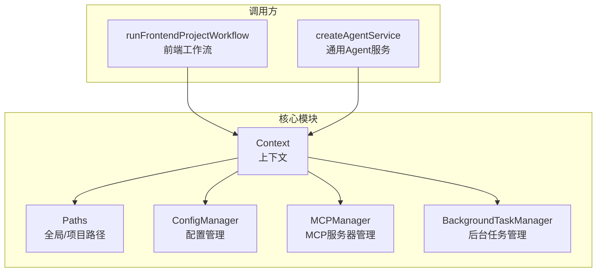
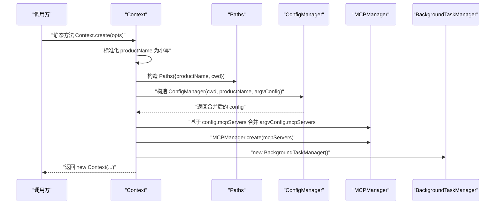
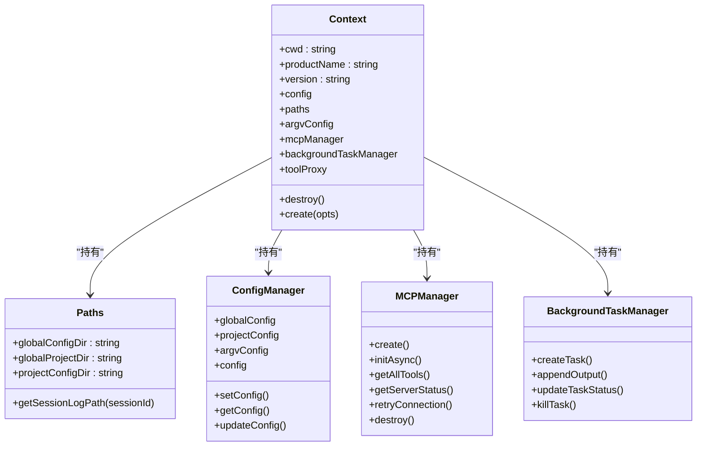

# 上下文构建

<cite>
**本文引用的文件**
- [fta-agent-core/src/context.ts](file://fta-agent-core/src/context.ts)
- [fta-agent-core/src/paths.ts](file://fta-agent-core/src/paths.ts)
- [fta-agent-core/src/config.ts](file://fta-agent-core/src/config.ts)
- [fta-agent-core/src/mcp.ts](file://fta-agent-core/src/mcp.ts)
- [fta-agent-core/src/backgroundTaskManager.ts](file://fta-agent-core/src/backgroundTaskManager.ts)
- [fta-agent-core/src/frontendProjectService.ts](file://fta-agent-core/src/frontendProjectService.ts)
- [fta-agent-core/src/agentService.ts](file://fta-agent-core/src/agentService.ts)
- [fta-agent-core/src/session.ts](file://fta-agent-core/src/session.ts)
</cite>

## 目录
1. [引言](#引言)
2. [项目结构](#项目结构)
3. [核心组件](#核心组件)
4. [架构总览](#架构总览)
5. [详细组件分析](#详细组件分析)
6. [依赖关系分析](#依赖关系分析)
7. [性能考量](#性能考量)
8. [故障排查指南](#故障排查指南)
9. [结论](#结论)
10. [附录](#附录)

## 引言
本文件围绕 Agent 工作流中的“上下文（Context）”创建过程进行系统性说明，重点解析 Context.create 方法的参数配置与内部初始化逻辑，阐明 cwd、productName、version 等核心参数的作用，以及 argvConfig 的配置覆盖机制。同时覆盖全局路径生成、配置目录初始化与资源管理器（MCP、后台任务）的建立流程，并结合实际使用场景给出构建模式与常见问题排查建议。

## 项目结构
- 上下文创建位于核心模块 fta-agent-core 中，涉及路径计算、配置合并、MCP 管理器与后台任务管理器的初始化。
- 前端工作流与通用 Agent 服务均通过 Context.create 构建上下文，随后进入会话与工具链执行阶段。

图表来源
- [fta-agent-core/src/context.ts](file://fta-agent-core/src/context.ts#L57-L84)
- [fta-agent-core/src/paths.ts](file://fta-agent-core/src/paths.ts#L24-L44)
- [fta-agent-core/src/config.ts](file://fta-agent-core/src/config.ts#L82-L107)
- [fta-agent-core/src/mcp.ts](file://fta-agent-core/src/mcp.ts#L44-L63)
- [fta-agent-core/src/backgroundTaskManager.ts](file://fta-agent-core/src/backgroundTaskManager.ts#L24-L41)
- [fta-agent-core/src/frontendProjectService.ts](file://fta-agent-core/src/frontendProjectService.ts#L139-L170)
- [fta-agent-core/src/agentService.ts](file://fta-agent-core/src/agentService.ts#L24-L44)

章节来源
- [fta-agent-core/src/context.ts](file://fta-agent-core/src/context.ts#L57-L84)
- [fta-agent-core/src/paths.ts](file://fta-agent-core/src/paths.ts#L24-L44)
- [fta-agent-core/src/config.ts](file://fta-agent-core/src/config.ts#L82-L107)
- [fta-agent-core/src/mcp.ts](file://fta-agent-core/src/mcp.ts#L44-L63)
- [fta-agent-core/src/backgroundTaskManager.ts](file://fta-agent-core/src/backgroundTaskManager.ts#L24-L41)
- [fta-agent-core/src/frontendProjectService.ts](file://fta-agent-core/src/frontendProjectService.ts#L139-L170)
- [fta-agent-core/src/agentService.ts](file://fta-agent-core/src/agentService.ts#L24-L44)

## 核心组件
- Context：封装工作流所需的所有运行期资源，包括工作目录、产品名、版本、配置、路径、MCP 管理器、后台任务管理器等。
- Paths：负责全局日志目录、项目日志目录与项目配置目录的生成与会话日志路径解析。
- ConfigManager：负责全局与项目级配置的读取、合并与持久化，支持 argv 覆盖。
- MCPManager：负责 MCP 服务器的连接、状态管理与工具聚合。
- BackgroundTaskManager：负责后台任务生命周期与输出截断。

章节来源
- [fta-agent-core/src/context.ts](file://fta-agent-core/src/context.ts#L28-L56)
- [fta-agent-core/src/paths.ts](file://fta-agent-core/src/paths.ts#L24-L44)
- [fta-agent-core/src/config.ts](file://fta-agent-core/src/config.ts#L82-L107)
- [fta-agent-core/src/mcp.ts](file://fta-agent-core/src/mcp.ts#L44-L63)
- [fta-agent-core/src/backgroundTaskManager.ts](file://fta-agent-core/src/backgroundTaskManager.ts#L24-L41)

## 架构总览
以下序列图展示 Context.create 的完整调用链路与初始化顺序。

图表来源
- [fta-agent-core/src/context.ts](file://fta-agent-core/src/context.ts#L57-L84)
- [fta-agent-core/src/paths.ts](file://fta-agent-core/src/paths.ts#L24-L34)
- [fta-agent-core/src/config.ts](file://fta-agent-core/src/config.ts#L82-L107)
- [fta-agent-core/src/mcp.ts](file://fta-agent-core/src/mcp.ts#L44-L63)

## 详细组件分析

### Context.create 参数与初始化逻辑
- 关键参数
  - cwd：工作目录，用于定位项目配置目录与会话日志路径。
  - productName：产品名，用于生成全局日志目录与项目配置目录名称；在创建时会被转为小写。
  - version：版本号，作为上下文元信息保存。
  - argvConfig：命令行或外部传入的配置覆盖，优先级最高。
  - toolProxy：可选的工具代理函数，用于统一拦截与转发工具调用。
- 初始化步骤
  1) 生成 Paths 实例，确定全局日志目录、项目日志目录与项目配置目录。
  2) 创建 ConfigManager 并合并配置：argvConfig → 项目配置 → 全局配置 → 默认配置。
  3) 合并 MCP 服务器配置：config.mcpServers 与 argvConfig.mcpServers 合并，后者优先。
  4) 基于合并后的 MCP 配置创建 MCPManager。
  5) 创建 BackgroundTaskManager。
  6) 返回 Context 实例，包含上述所有资源。

章节来源
- [fta-agent-core/src/context.ts](file://fta-agent-core/src/context.ts#L57-L84)
- [fta-agent-core/src/paths.ts](file://fta-agent-core/src/paths.ts#L24-L34)
- [fta-agent-core/src/config.ts](file://fta-agent-core/src/config.ts#L82-L107)
- [fta-agent-core/src/mcp.ts](file://fta-agent-core/src/mcp.ts#L44-L63)
- [fta-agent-core/src/backgroundTaskManager.ts](file://fta-agent-core/src/backgroundTaskManager.ts#L24-L41)

### 全局路径生成与配置目录初始化
- 全局路径
  - 全局配置目录：用户主目录下以产品名为名的隐藏目录，用于存放全局配置与数据。
  - 全局项目目录：全局日志目录下按项目工作目录规范化路径分组，用于存放项目会话日志。
  - 项目配置目录：项目根目录下以产品名为名的隐藏目录，用于存放项目级配置与本地配置。
- 目录初始化策略
  - 读取配置时：若配置文件不存在则返回空对象，避免抛错中断启动。
  - 写入配置时：自动创建目录（递归），并将默认值过滤后写入，确保最小化变更。
- 会话日志路径解析
  - 支持绝对路径、相对路径与会话 ID 三种输入，分别映射到指定位置。

章节来源
- [fta-agent-core/src/paths.ts](file://fta-agent-core/src/paths.ts#L24-L44)
- [fta-agent-core/src/config.ts](file://fta-agent-core/src/config.ts#L290-L312)
- [fta-agent-core/src/session.ts](file://fta-agent-core/src/session.ts#L70-L116)

### 配置覆盖机制（argvConfig）
- 合并顺序
  - argvConfig → 项目配置 → 全局配置 → 默认配置。
  - 对象型键（如 mcpServers、commit）采用深合并策略，数组型键与布尔型键按类型转换处理。
- 键有效性与类型校验
  - 仅允许白名单内的键存在，非法键会抛出错误。
  - 对嵌套键（如 commit.xxx）进行路径导航与类型校验，不支持的对象键不允许设置嵌套属性。
- 写入与更新
  - setConfig 支持扁平与嵌套键，自动转换布尔/数组/对象类型。
  - updateConfig 使用深合并策略更新配置并持久化。

章节来源
- [fta-agent-core/src/config.ts](file://fta-agent-core/src/config.ts#L82-L107)
- [fta-agent-core/src/config.ts](file://fta-agent-core/src/config.ts#L169-L287)
- [fta-agent-core/src/config.ts](file://fta-agent-core/src/config.ts#L290-L312)

### 资源管理器的建立
- MCP 管理器
  - 基于合并后的 mcpServers 配置创建，支持 stdio、sse、http 三种传输方式。
  - 初始化采用并发连接策略，记录每个服务器的状态、错误与工具清单。
  - 提供重连、状态查询与工具聚合能力。
- 后台任务管理器
  - 维护任务生命周期（创建、运行、完成/失败/被杀）、输出截断与进程组管理。
  - 在 Windows 与类 Unix 系统上分别采用不同的终止策略。

章节来源
- [fta-agent-core/src/mcp.ts](file://fta-agent-core/src/mcp.ts#L44-L63)
- [fta-agent-core/src/mcp.ts](file://fta-agent-core/src/mcp.ts#L95-L147)
- [fta-agent-core/src/mcp.ts](file://fta-agent-core/src/mcp.ts#L198-L212)
- [fta-agent-core/src/backgroundTaskManager.ts](file://fta-agent-core/src/backgroundTaskManager.ts#L24-L41)
- [fta-agent-core/src/backgroundTaskManager.ts](file://fta-agent-core/src/backgroundTaskManager.ts#L88-L124)

### 不同项目场景下的上下文构建模式
- 前端工作流（设计驱动）
  - 通过 runFrontendProjectWorkflow 构建 Context，随后创建会话、日志器与工具集，进入生成循环。
  - 适合需要结合设计标注、组件文档与规则约束的前端工程自动化。
- 通用 Agent 服务
  - 通过 createAgentService 构建 Context，绑定 Project 任务执行器，支持发送消息与制定计划。
  - 适合通用对话式任务编排与多轮交互。

章节来源
- [fta-agent-core/src/frontendProjectService.ts](file://fta-agent-core/src/frontendProjectService.ts#L139-L170)
- [fta-agent-core/src/agentService.ts](file://fta-agent-core/src/agentService.ts#L24-L44)

## 依赖关系分析
- Context 依赖
  - Paths：用于路径解析与会话日志定位。
  - ConfigManager：用于配置合并与持久化。
  - MCPManager：用于 MCP 服务器连接与工具聚合。
  - BackgroundTaskManager：用于后台任务生命周期管理。
- 调用方依赖
  - runFrontendProjectWorkflow 与 createAgentService 通过 Context.create 获取上下文，再进入后续工作流。

图表来源
- [fta-agent-core/src/context.ts](file://fta-agent-core/src/context.ts#L28-L56)
- [fta-agent-core/src/paths.ts](file://fta-agent-core/src/paths.ts#L24-L44)
- [fta-agent-core/src/config.ts](file://fta-agent-core/src/config.ts#L82-L107)
- [fta-agent-core/src/mcp.ts](file://fta-agent-core/src/mcp.ts#L44-L63)
- [fta-agent-core/src/backgroundTaskManager.ts](file://fta-agent-core/src/backgroundTaskManager.ts#L24-L41)

## 性能考量
- 并发初始化：MCPManager 在初始化阶段并发尝试连接多个服务器，缩短整体就绪时间。
- 输出截断：后台任务输出超过阈值时进行截断，避免内存膨胀。
- 最小化配置写入：写入配置前过滤默认值，减少磁盘 IO 与冗余内容。

章节来源
- [fta-agent-core/src/mcp.ts](file://fta-agent-core/src/mcp.ts#L95-L112)
- [fta-agent-core/src/backgroundTaskManager.ts](file://fta-agent-core/src/backgroundTaskManager.ts#L51-L63)
- [fta-agent-core/src/config.ts](file://fta-agent-core/src/config.ts#L301-L312)

## 故障排查指南

### 环境变量加载失败
- 现象
  - MCP 服务器通过 stdio 启动时，若未正确传递 PATH 或其他环境变量，可能导致命令不可用。
- 排查要点
  - 确认 MCP 配置中的 env 是否包含必要的 PATH。
  - 检查命令是否存在且具备可执行权限。
- 参考实现
  - stdio 传输时会将传入 env 与系统 PATH 合并，确保命令解析正常。

章节来源
- [fta-agent-core/src/mcp.ts](file://fta-agent-core/src/mcp.ts#L292-L306)

### 配置目录权限错误
- 现象
  - 写入配置或创建日志目录时报权限错误。
- 排查要点
  - 确认用户对全局与项目配置目录具有写权限。
  - 若目录不存在，确认父目录可创建。
- 参考实现
  - 写入配置前会自动创建目录（递归），若仍失败请检查权限与磁盘空间。

章节来源
- [fta-agent-core/src/config.ts](file://fta-agent-core/src/config.ts#L301-L312)
- [fta-agent-core/src/paths.ts](file://fta-agent-core/src/paths.ts#L115-L118)

### MCP 服务器连接失败
- 现象
  - 服务器状态为 failed，错误信息提示网络或配置问题。
- 排查要点
  - 检查 URL/命令是否正确，网络连通性与鉴权头是否有效。
  - 区分临时错误与永久错误，必要时重试或修正配置。
- 参考实现
  - 连接测试失败会关闭客户端并记录错误；支持重连与状态查询。

章节来源
- [fta-agent-core/src/mcp.ts](file://fta-agent-core/src/mcp.ts#L114-L147)
- [fta-agent-core/src/mcp.ts](file://fta-agent-core/src/mcp.ts#L244-L290)

### 会话日志无法写入
- 现象
  - 会话日志文件创建或写入失败。
- 排查要点
  - 确认全局项目目录存在且可写。
  - 检查磁盘空间与文件句柄限制。
- 参考实现
  - 日志写入前会创建目录，异常时抛出明确错误信息。

章节来源
- [fta-agent-core/src/session.ts](file://fta-agent-core/src/session.ts#L90-L116)

## 结论
Context.create 通过标准化参数、路径与配置合并，将工作流所需的全部资源在初始化阶段一次性建立。argvConfig 的高优先级覆盖机制使得运行时定制灵活可控；MCP 与后台任务管理器的并发初始化提升了整体效率。结合本文提供的场景模式与故障排查建议，可在不同项目中稳定地构建与运行 Agent 工作流。

## 附录

### 参数与职责速览
- cwd：工作目录，决定项目配置与日志路径。
- productName：产品名，决定全局与项目配置目录命名。
- version：版本号，作为上下文元信息。
- argvConfig：命令行/外部传入的配置覆盖，优先级最高。
- toolProxy：可选工具代理，便于统一拦截与转发。

章节来源
- [fta-agent-core/src/context.ts](file://fta-agent-core/src/context.ts#L19-L26)
- [fta-agent-core/src/context.ts](file://fta-agent-core/src/context.ts#L57-L84)