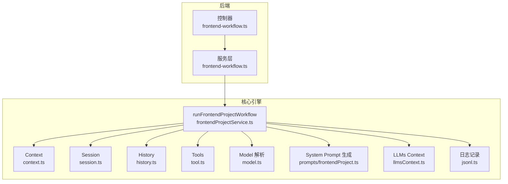
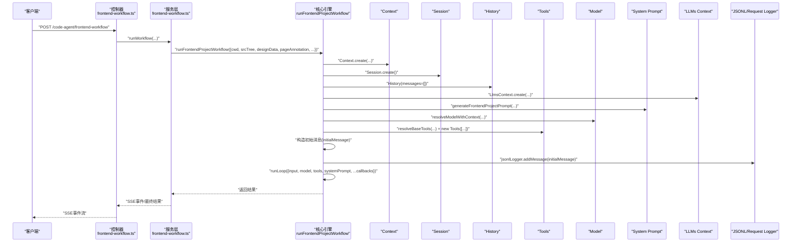
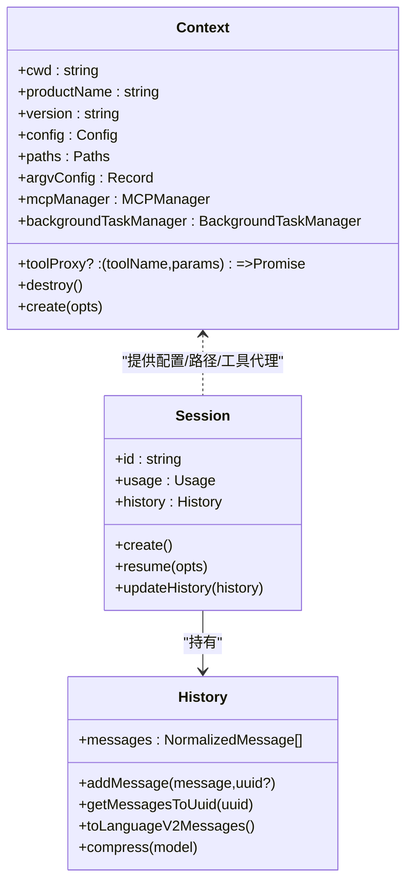
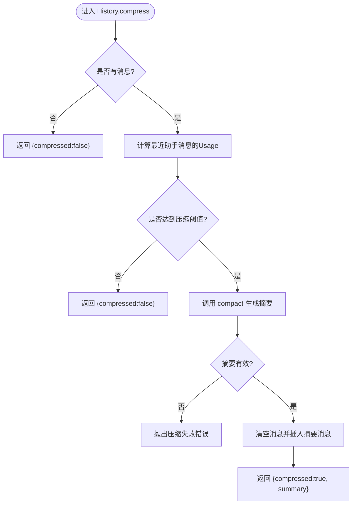
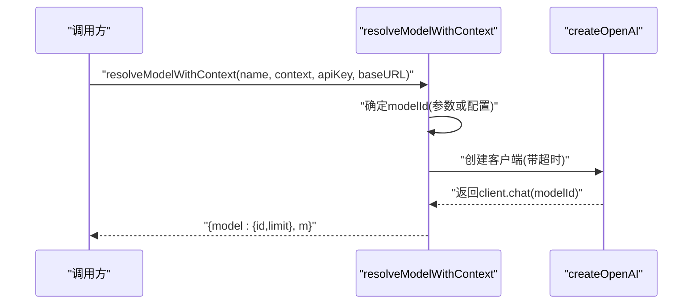
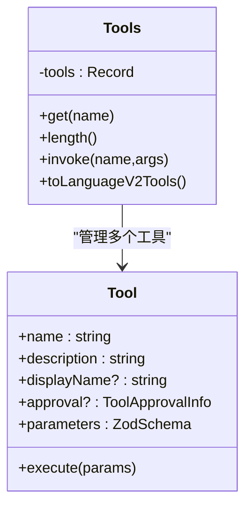
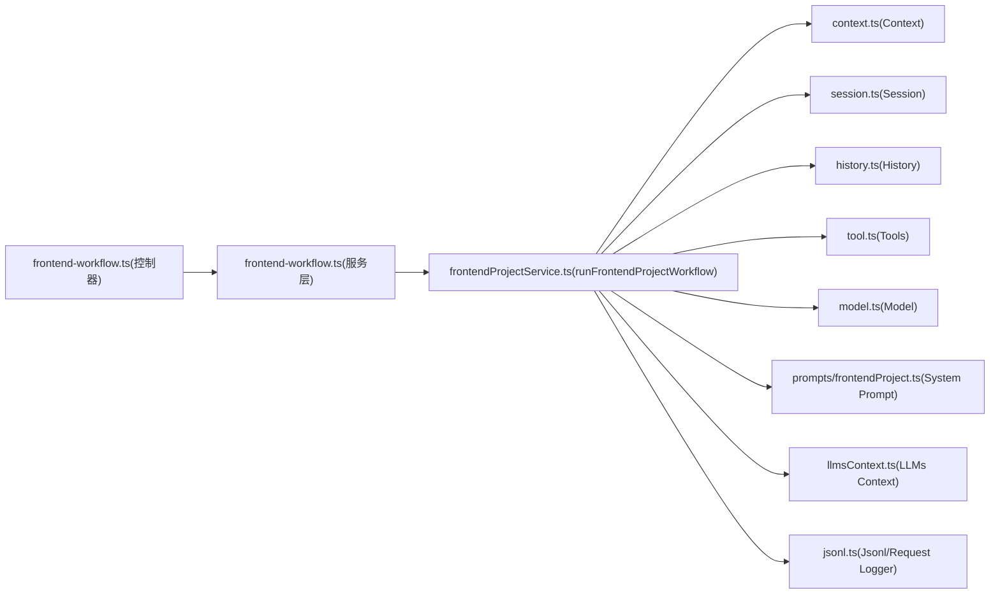

# 工作流初始化

<cite>
**本文引用的文件**
- [fta-agent-core/src/index.ts](file://fta-agent-core/src/index.ts)
- [fta-agent-core/src/query.ts](file://fta-agent-core/src/query.ts)
- [fta-agent-core/src/frontendProjectService.ts](file://fta-agent-core/src/frontendProjectService.ts)
- [code-agent-backend/src/controller/code-agent/frontend-workflow.ts](file://code-agent-backend/src/controller/code-agent/frontend-workflow.ts)
- [code-agent-backend/src/service/code-agent/frontend-workflow.ts](file://code-agent-backend/src/service/code-agent/frontend-workflow.ts)
- [fta-agent-core/src/context.ts](file://fta-agent-core/src/context.ts)
- [fta-agent-core/src/session.ts](file://fta-agent-core/src/session.ts)
- [fta-agent-core/src/history.ts](file://fta-agent-core/src/history.ts)
- [fta-agent-core/src/model.ts](file://fta-agent-core/src/model.ts)
- [fta-agent-core/src/tool.ts](file://fta-agent-core/src/tool.ts)
- [fta-agent-core/src/jsonl.ts](file://fta-agent-core/src/jsonl.ts)
- [fta-agent-core/src/llmsContext.ts](file://fta-agent-core/src/llmsContext.ts)
- [fta-agent-core/src/prompts/frontendProject.ts](file://fta-agent-core/src/prompts/frontendProject.ts)
- [fta-agent-core/src/message.ts](file://fta-agent-core/src/message.ts)
- [code-agent-backend/src/dto/code-agent/frontend-workflow.dto.ts](file://code-agent-backend/src/dto/code-agent/frontend-workflow.dto.ts)
</cite>

## 目录
1. [简介](#简介)
2. [项目结构](#项目结构)
3. [核心组件](#核心组件)
4. [架构总览](#架构总览)
5. [详细组件分析](#详细组件分析)
6. [依赖关系分析](#依赖关系分析)
7. [性能考量](#性能考量)
8. [故障排查指南](#故障排查指南)
9. [结论](#结论)

## 简介
本文件聚焦于Agent工作流的初始化过程，从两种入口开始：
- runFrontendProjectWorkflow：面向“前端项目工作流”的完整初始化路径
- query：面向通用Agent查询的最小化初始化路径

我们将系统性说明如何构建初始上下文（Context）、会话（Session）、历史消息（History），如何加载系统提示（systemPrompt）与项目配置，以及初始消息构造、模型解析（resolveModelWithContext）与工具管理器（Tools）初始化流程。同时覆盖用户提示注入、回调函数注册机制与日志记录器（jsonlLogger）的集成方式，并给出不同调用场景下的参数传递模式与常见初始化失败的排查要点。

## 项目结构
- 前端工作流入口位于后端控制器与服务层，负责接收请求、组装参数、触发核心工作流引擎。
- 核心工作流引擎位于fta-agent-core，负责Context/Session/History/Tools/Model/System Prompt等初始化与运行循环。
- 日志与上下文扩展由独立模块提供，贯穿初始化与运行期。

图表来源
- [code-agent-backend/src/controller/code-agent/frontend-workflow.ts](file://code-agent-backend/src/controller/code-agent/frontend-workflow.ts#L83-L367)
- [code-agent-backend/src/service/code-agent/frontend-workflow.ts](file://code-agent-backend/src/service/code-agent/frontend-workflow.ts#L74-L279)
- [fta-agent-core/src/frontendProjectService.ts](file://fta-agent-core/src/frontendProjectService.ts#L139-L348)
- [fta-agent-core/src/context.ts](file://fta-agent-core/src/context.ts#L57-L84)
- [fta-agent-core/src/session.ts](file://fta-agent-core/src/session.ts#L1-L60)
- [fta-agent-core/src/history.ts](file://fta-agent-core/src/history.ts#L1-L40)
- [fta-agent-core/src/tool.ts](file://fta-agent-core/src/tool.ts#L28-L66)
- [fta-agent-core/src/model.ts](file://fta-agent-core/src/model.ts#L40-L59)
- [fta-agent-core/src/prompts/frontendProject.ts](file://fta-agent-core/src/prompts/frontendProject.ts#L15-L46)
- [fta-agent-core/src/llmsContext.ts](file://fta-agent-core/src/llmsContext.ts#L22-L87)
- [fta-agent-core/src/jsonl.ts](file://fta-agent-core/src/jsonl.ts#L1-L49)

章节来源
- [code-agent-backend/src/controller/code-agent/frontend-workflow.ts](file://code-agent-backend/src/controller/code-agent/frontend-workflow.ts#L83-L367)
- [code-agent-backend/src/service/code-agent/frontend-workflow.ts](file://code-agent-backend/src/service/code-agent/frontend-workflow.ts#L74-L279)
- [fta-agent-core/src/frontendProjectService.ts](file://fta-agent-core/src/frontendProjectService.ts#L139-L348)

## 核心组件
- Context：封装工作流所需的全局配置、路径、MCP管理器、后台任务管理器与工具代理。
- Session：会话标识、使用统计与历史管理；支持创建与恢复。
- History：消息集合与压缩策略，提供标准化消息序列与上下文压缩能力。
- Tools：工具集管理器，支持只读/写入/待办/后台命令等工具的动态装配。
- Model：模型解析与客户端创建，支持超时控制与默认限制。
- System Prompt：基于规则与组件清单生成系统提示。
- LLMs Context：基于项目状态、目录结构、规则与README生成上下文字符串。
- JSONL Logger：按会话写入消息日志，Request Logger记录请求元数据与分片。

章节来源
- [fta-agent-core/src/context.ts](file://fta-agent-core/src/context.ts#L28-L84)
- [fta-agent-core/src/session.ts](file://fta-agent-core/src/session.ts#L1-L60)
- [fta-agent-core/src/history.ts](file://fta-agent-core/src/history.ts#L1-L40)
- [fta-agent-core/src/tool.ts](file://fta-agent-core/src/tool.ts#L97-L165)
- [fta-agent-core/src/model.ts](file://fta-agent-core/src/model.ts#L40-L59)
- [fta-agent-core/src/prompts/frontendProject.ts](file://fta-agent-core/src/prompts/frontendProject.ts#L15-L46)
- [fta-agent-core/src/llmsContext.ts](file://fta-agent-core/src/llmsContext.ts#L22-L87)
- [fta-agent-core/src/jsonl.ts](file://fta-agent-core/src/jsonl.ts#L1-L49)

## 架构总览
下面以“前端项目工作流”为主线，展示从HTTP请求到核心引擎的初始化与运行流程。

图表来源
- [code-agent-backend/src/controller/code-agent/frontend-workflow.ts](file://code-agent-backend/src/controller/code-agent/frontend-workflow.ts#L83-L367)
- [code-agent-backend/src/service/code-agent/frontend-workflow.ts](file://code-agent-backend/src/service/code-agent/frontend-workflow.ts#L174-L247)
- [fta-agent-core/src/frontendProjectService.ts](file://fta-agent-core/src/frontendProjectService.ts#L139-L348)
- [fta-agent-core/src/context.ts](file://fta-agent-core/src/context.ts#L57-L84)
- [fta-agent-core/src/session.ts](file://fta-agent-core/src/session.ts#L1-L60)
- [fta-agent-core/src/history.ts](file://fta-agent-core/src/history.ts#L1-L40)
- [fta-agent-core/src/tool.ts](file://fta-agent-core/src/tool.ts#L28-L66)
- [fta-agent-core/src/model.ts](file://fta-agent-core/src/model.ts#L40-L59)
- [fta-agent-core/src/prompts/frontendProject.ts](file://fta-agent-core/src/prompts/frontendProject.ts#L15-L46)
- [fta-agent-core/src/llmsContext.ts](file://fta-agent-core/src/llmsContext.ts#L22-L87)
- [fta-agent-core/src/jsonl.ts](file://fta-agent-core/src/jsonl.ts#L1-L49)

## 详细组件分析

### 入口一：runFrontendProjectWorkflow（前端项目工作流）
- 初始化步骤
  - 构建Context：解析argvConfig、合并全局/项目配置、创建MCP与后台任务管理器。
  - 创建Session：生成会话ID，初始化Usage与History。
  - 初始化日志：创建JsonlLogger与RequestLogger，定位会话日志路径。
  - 组装工具集：resolveBaseTools + 组件文档读取工具 + 待办工具。
  - 生成系统提示：根据规范与组件清单生成systemPrompt。
  - 解析模型：resolveModelWithContext，支持从Context或显式参数获取模型。
  - 构造初始消息：将页面标注、DSL与srcTree拼接为用户提示，作为第一条消息。
  - 注册回调：onMessage/onText/onStreamResult/onChunk/onTurn/onToolApprove等。
  - 启动循环：runLoop，传入input、model、tools、systemPrompt、llmsContexts与回调。

- 参数传递模式
  - 基础参数：designData、pageAnnotation、productName、version、cwd、configOverrides、rulesFilePath、promptFilePath、apiKey、baseURL、todoStorageMode、toolProxy。
  - 回调函数：onMessage、onText、onStreamResult、onChunk、onTurn、onToolApprove。
  - 工具代理：toolProxy用于跨进程/跨界面的工具调用桥接。

- 关键实现位置
  - Context创建与销毁：[fta-agent-core/src/context.ts](file://fta-agent-core/src/context.ts#L57-L84)
  - Session创建与历史加载：[fta-agent-core/src/session.ts](file://fta-agent-core/src/session.ts#L1-L60)
  - Tools装配与调用：[fta-agent-core/src/tool.ts](file://fta-agent-core/src/tool.ts#L28-L66)、[fta-agent-core/src/tool.ts](file://fta-agent-core/src/tool.ts#L97-L165)
  - System Prompt生成：[fta-agent-core/src/prompts/frontendProject.ts](file://fta-agent-core/src/prompts/frontendProject.ts#L15-L46)
  - LLMs Context生成：[fta-agent-core/src/llmsContext.ts](file://fta-agent-core/src/llmsContext.ts#L22-L87)
  - 模型解析：[fta-agent-core/src/model.ts](file://fta-agent-core/src/model.ts#L40-L59)
  - 初始消息构造与日志：[fta-agent-core/src/frontendProjectService.ts](file://fta-agent-core/src/frontendProjectService.ts#L232-L249)、[fta-agent-core/src/jsonl.ts](file://fta-agent-core/src/jsonl.ts#L1-L49)

章节来源
- [fta-agent-core/src/frontendProjectService.ts](file://fta-agent-core/src/frontendProjectService.ts#L139-L348)
- [fta-agent-core/src/context.ts](file://fta-agent-core/src/context.ts#L57-L84)
- [fta-agent-core/src/session.ts](file://fta-agent-core/src/session.ts#L1-L60)
- [fta-agent-core/src/tool.ts](file://fta-agent-core/src/tool.ts#L28-L66)
- [fta-agent-core/src/tool.ts](file://fta-agent-core/src/tool.ts#L97-L165)
- [fta-agent-core/src/prompts/frontendProject.ts](file://fta-agent-core/src/prompts/frontendProject.ts#L15-L46)
- [fta-agent-core/src/llmsContext.ts](file://fta-agent-core/src/llmsContext.ts#L22-L87)
- [fta-agent-core/src/model.ts](file://fta-agent-core/src/model.ts#L40-L59)
- [fta-agent-core/src/jsonl.ts](file://fta-agent-core/src/jsonl.ts#L1-L49)

### 入口二：query（通用Agent查询）
- 初始化步骤
  - 构造初始消息：将userPrompt包装为一条用户消息，追加到opts.messages。
  - 校验模型来源：若未提供opts.model，则必须提供opts.context（内部会调用resolveModelWithContext）。
  - 解析模型：resolveModelWithContext，读取OPENAI_API_KEY与OPENAI_BASE_URL。
  - 启动循环：runLoop，传入input、model、空工具集（Tools([])）、systemPrompt与onMessage回调。

- 参数传递模式
  - 必填：userPrompt；可选：messages、context、model、systemPrompt、onMessage。
  - 环境变量：OPENAI_API_KEY、OPENAI_BASE_URL（必填）。

- 关键实现位置
  - 初始消息构造与校验：[fta-agent-core/src/query.ts](file://fta-agent-core/src/query.ts#L17-L31)
  - 模型解析与循环启动：[fta-agent-core/src/query.ts](file://fta-agent-core/src/query.ts#L32-L44)

章节来源
- [fta-agent-core/src/query.ts](file://fta-agent-core/src/query.ts#L1-L45)

### 上下文（Context）与会话（Session）
- Context
  - 负责产品名、版本、路径、配置、MCP与后台任务管理器的创建与注入。
  - 支持通过argvConfig覆盖配置，支持toolProxy注入。
- Session
  - 生成会话ID，维护Usage与History。
  - 支持从日志恢复历史消息（loadSessionMessages）与过滤活跃路径（filterMessages）。

图表来源
- [fta-agent-core/src/context.ts](file://fta-agent-core/src/context.ts#L28-L84)
- [fta-agent-core/src/session.ts](file://fta-agent-core/src/session.ts#L1-L60)
- [fta-agent-core/src/history.ts](file://fta-agent-core/src/history.ts#L1-L40)

章节来源
- [fta-agent-core/src/context.ts](file://fta-agent-core/src/context.ts#L28-L84)
- [fta-agent-core/src/session.ts](file://fta-agent-core/src/session.ts#L1-L60)
- [fta-agent-core/src/history.ts](file://fta-agent-core/src/history.ts#L1-L40)

### 历史消息（History）与消息格式
- History负责消息的标准化、父子关系追踪、转语言模型消息格式与压缩。
- 支持将消息序列转换为ai-sdk的LanguageModelV2Message数组，兼容文本、图片、工具调用与工具结果。
- 压缩阈值与策略依据模型上下文限制与输出限制计算，必要时生成摘要并替换历史。

图表来源
- [fta-agent-core/src/history.ts](file://fta-agent-core/src/history.ts#L244-L287)

章节来源
- [fta-agent-core/src/history.ts](file://fta-agent-core/src/history.ts#L1-L40)
- [fta-agent-core/src/history.ts](file://fta-agent-core/src/history.ts#L244-L287)

### 模型解析（resolveModelWithContext）
- 从参数或Context.config中解析模型ID，创建OpenAI客户端，返回ModelInfo（含模型元数据与LanguageModelV2实例）。
- 支持超时控制与fetch代理，确保长请求不会阻塞。

图表来源
- [fta-agent-core/src/model.ts](file://fta-agent-core/src/model.ts#L40-L59)

章节来源
- [fta-agent-core/src/model.ts](file://fta-agent-core/src/model.ts#L40-L59)

### 工具管理器（Tools）初始化
- resolveBaseTools：按上下文与会话ID装配只读/写入/待办/后台命令工具。
- resolveTools：并发解析模型依赖工具与MCP工具，合并为完整工具集。
- Tools类：以名称索引工具，支持invoke、toLanguageV2Tools与长度统计。

图表来源
- [fta-agent-core/src/tool.ts](file://fta-agent-core/src/tool.ts#L97-L165)
- [fta-agent-core/src/tool.ts](file://fta-agent-core/src/tool.ts#L207-L275)

章节来源
- [fta-agent-core/src/tool.ts](file://fta-agent-core/src/tool.ts#L28-L66)
- [fta-agent-core/src/tool.ts](file://fta-agent-core/src/tool.ts#L97-L165)
- [fta-agent-core/src/tool.ts](file://fta-agent-core/src/tool.ts#L207-L275)

### 系统提示（systemPrompt）与LLMs上下文
- systemPrompt：基于规范列表与组件清单生成，可指定自定义模板路径。
- LlmsContext：动态生成上下文字符串，包含git状态、目录结构、规则与README内容。

章节来源
- [fta-agent-core/src/prompts/frontendProject.ts](file://fta-agent-core/src/prompts/frontendProject.ts#L15-L46)
- [fta-agent-core/src/llmsContext.ts](file://fta-agent-core/src/llmsContext.ts#L22-L87)

### 用户提示注入与回调注册
- runFrontendProjectWorkflow中：
  - 将页面标注、DSL与srcTree拼接为用户提示，构造初始消息并写入日志。
  - 注册onMessage/onText/onStreamResult/onChunk/onTurn/onToolApprove等回调，转发给上层。
- 控制器/服务层：
  - 控制器通过SSE向客户端推送message/text/stream_result/turn/complete/aborted/error事件。
  - 服务层包装回调，注入AbortController信号检查，支持中断。

章节来源
- [fta-agent-core/src/frontendProjectService.ts](file://fta-agent-core/src/frontendProjectService.ts#L232-L302)
- [code-agent-backend/src/controller/code-agent/frontend-workflow.ts](file://code-agent-backend/src/controller/code-agent/frontend-workflow.ts#L196-L307)
- [code-agent-backend/src/service/code-agent/frontend-workflow.ts](file://code-agent-backend/src/service/code-agent/frontend-workflow.ts#L191-L218)

### 日志记录器（jsonlLogger）集成
- JsonlLogger：按会话写入消息，支持添加用户消息与读取最新uuid。
- RequestLogger：按requestId写入请求元数据与分片，便于调试与审计。

章节来源
- [fta-agent-core/src/jsonl.ts](file://fta-agent-core/src/jsonl.ts#L1-L49)
- [fta-agent-core/src/jsonl.ts](file://fta-agent-core/src/jsonl.ts#L51-L101)

## 依赖关系分析
- 控制器依赖服务层，服务层依赖核心引擎runFrontendProjectWorkflow。
- 核心引擎依赖Context、Session、History、Tools、Model、System Prompt、LLMs Context与日志模块。
- Tools依赖Context提供的路径、产品名与后台任务管理器。
- Model依赖环境变量OPENAI_API_KEY与OPENAI_BASE_URL。

图表来源
- [code-agent-backend/src/controller/code-agent/frontend-workflow.ts](file://code-agent-backend/src/controller/code-agent/frontend-workflow.ts#L83-L367)
- [code-agent-backend/src/service/code-agent/frontend-workflow.ts](file://code-agent-backend/src/service/code-agent/frontend-workflow.ts#L74-L279)
- [fta-agent-core/src/frontendProjectService.ts](file://fta-agent-core/src/frontendProjectService.ts#L139-L348)

章节来源
- [code-agent-backend/src/controller/code-agent/frontend-workflow.ts](file://code-agent-backend/src/controller/code-agent/frontend-workflow.ts#L83-L367)
- [code-agent-backend/src/service/code-agent/frontend-workflow.ts](file://code-agent-backend/src/service/code-agent/frontend-workflow.ts#L74-L279)
- [fta-agent-core/src/frontendProjectService.ts](file://fta-agent-core/src/frontendProjectService.ts#L139-L348)

## 性能考量
- 历史压缩：当累计token接近上下文限制时自动压缩，减少上下文开销。
- 模型超时：统一设置LLM超时，避免长时间阻塞。
- 并发工具解析：模型依赖工具与MCP工具并行解析，缩短初始化时间。
- 日志分片：RequestLogger按requestId拆分日志，便于定位问题。

章节来源
- [fta-agent-core/src/history.ts](file://fta-agent-core/src/history.ts#L244-L287)
- [fta-agent-core/src/model.ts](file://fta-agent-core/src/model.ts#L61-L114)
- [fta-agent-core/src/tool.ts](file://fta-agent-core/src/tool.ts#L80-L84)
- [fta-agent-core/src/jsonl.ts](file://fta-agent-core/src/jsonl.ts#L51-L101)

## 故障排查指南
- 环境变量缺失
  - OPENAI_API_KEY：query与resolveModelWithContext均要求此变量存在，否则会抛出错误。
  - OPENAI_BASE_URL：作为可选基地址，缺失时仍可使用默认OpenAI端点。
  - LLM_TIMEOUT：可选，用于设置LLM请求超时，默认120秒。
  - 配置参数缺失：服务层在缺少apiKey/baseURL时会返回明确的错误信息，提示通过请求参数或配置文件提供。

- 模型配置错误
  - 未指定模型ID：resolveModelWithContext要求modelId来自参数或Context.config，否则断言失败。
  - 模型不支持：若外部模型不可用，需检查baseURL与网络连通性。

- 工具代理与SSE
  - 工具代理：控制器通过toolProxy将工具调用请求为SSE事件，等待前端返回tool_result。
  - 超时与中断：工具调用设置60秒超时；客户端断开或AbortController触发会清理待处理工具调用。

- 日志与回溯
  - 会话日志：JsonlLogger按会话写入消息，可用于复盘与重放。
  - 请求日志：RequestLogger记录每个请求的元数据与分片，便于定位问题。

- 常见错误定位
  - 缺少必需参数：服务层会在缺失apiKey/baseURL时返回明确错误，包含缺失字段列表。
  - 设计文档缺失：若设计文档不存在或DSL为空，服务层会返回相应错误。
  - 压缩失败：History.compress失败会抛出错误，需检查上下文与输出限制。

章节来源
- [fta-agent-core/src/query.ts](file://fta-agent-core/src/query.ts#L28-L31)
- [fta-agent-core/src/model.ts](file://fta-agent-core/src/model.ts#L40-L59)
- [code-agent-backend/src/service/code-agent/frontend-workflow.ts](file://code-agent-backend/src/service/code-agent/frontend-workflow.ts#L83-L95)
- [code-agent-backend/src/controller/code-agent/frontend-workflow.ts](file://code-agent-backend/src/controller/code-agent/frontend-workflow.ts#L151-L195)
- [fta-agent-core/src/history.ts](file://fta-agent-core/src/history.ts#L244-L287)
- [fta-agent-core/src/jsonl.ts](file://fta-agent-core/src/jsonl.ts#L1-L49)

## 结论
本文从两种入口出发，系统梳理了Agent工作流的初始化过程：Context/Session/History/Tools/Model/System Prompt/LLMs Context与日志模块的协同作用。通过清晰的参数传递模式与回调机制，实现了从HTTP请求到核心引擎的顺畅衔接，并提供了完善的日志与错误处理能力。针对常见初始化失败场景，给出了明确的排查指引，帮助快速定位与修复问题。