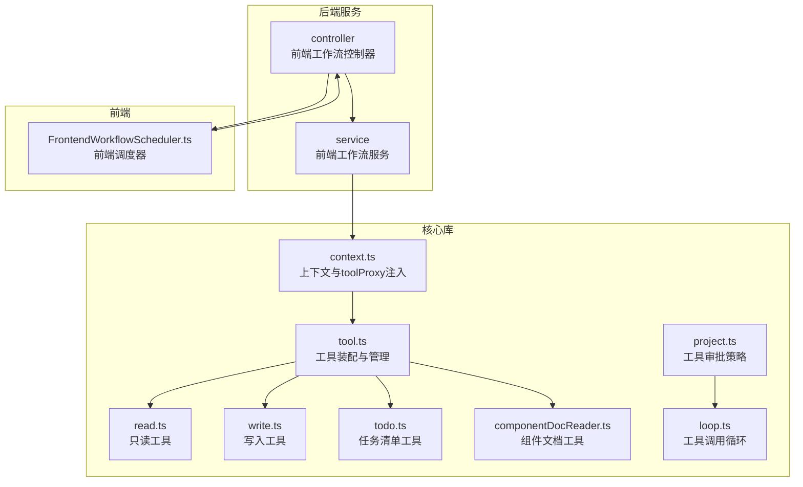
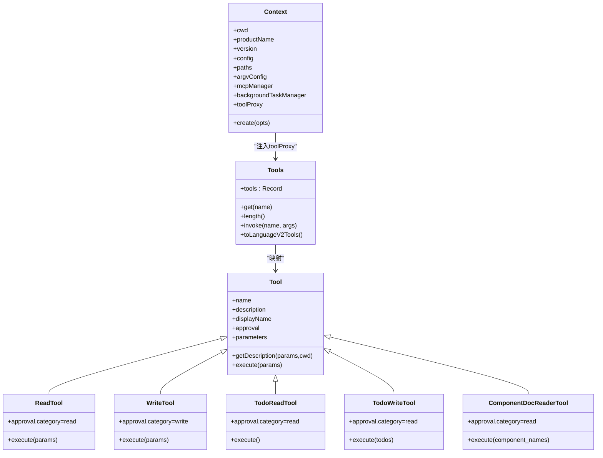
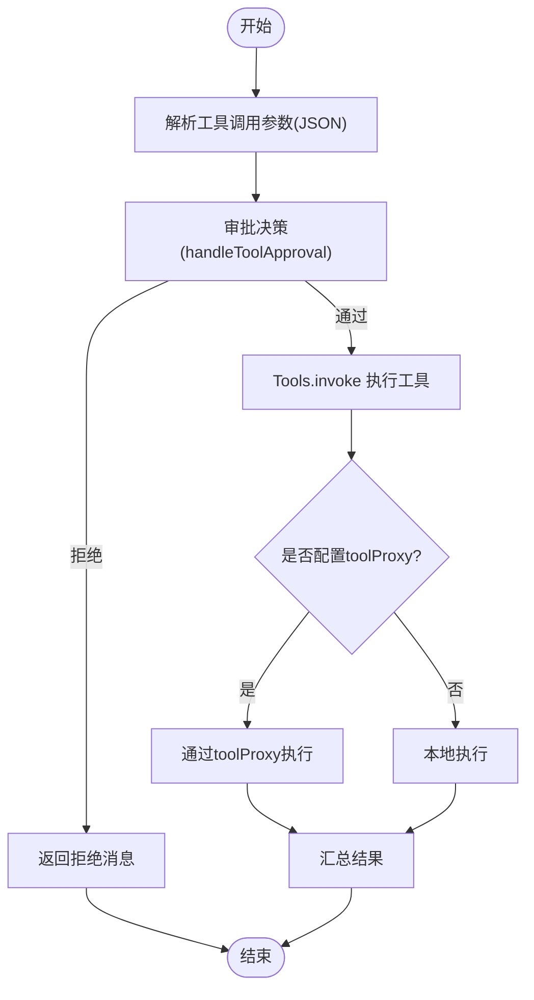

# 工具管理器初始化

<cite>
**本文引用的文件列表**
- [fta-agent-core/src/tool.ts](file://fta-agent-core/src/tool.ts)
- [fta-agent-core/src/tools/todo.ts](file://fta-agent-core/src/tools/todo.ts)
- [fta-agent-core/src/tools/componentDocReader.ts](file://fta-agent-core/src/tools/componentDocReader.ts)
- [fta-agent-core/src/tools/read.ts](file://fta-agent-core/src/tools/read.ts)
- [fta-agent-core/src/tools/write.ts](file://fta-agent-core/src/tools/write.ts)
- [fta-agent-core/src/constants.ts](file://fta-agent-core/src/constants.ts)
- [fta-agent-core/src/context.ts](file://fta-agent-core/src/context.ts)
- [fta-agent-core/src/project.ts](file://fta-agent-core/src/project.ts)
- [fta-agent-core/src/loop.ts](file://fta-agent-core/src/loop.ts)
- [code-agent-backend/src/controller/code-agent/frontend-workflow.ts](file://code-agent-backend/src/controller/code-agent/frontend-workflow.ts)
- [code-agent-backend/src/service/code-agent/frontend-workflow.ts](file://code-agent-backend/src/service/code-agent/frontend-workflow.ts)
- [fta-layout-design/src/pages/EditorPage/services/FrontendWorkflowScheduler.ts](file://fta-layout-design/src/pages/EditorPage/services/FrontendWorkflowScheduler.ts)
</cite>

## 目录
1. [简介](#简介)
2. [项目结构](#项目结构)
3. [核心组件](#核心组件)
4. [架构总览](#架构总览)
5. [详细组件分析](#详细组件分析)
6. [依赖关系分析](#依赖关系分析)
7. [性能考量](#性能考量)
8. [故障排查指南](#故障排查指南)
9. [结论](#结论)
10. [附录](#附录)

## 简介
本文件系统性解析 Agent 工作流中的工具管理器（Tools）初始化流程，重点覆盖：
- baseTools 的构成与扩展机制
- todoReadTool、todoWriteTool、componentDocReaderTool 等核心工具的注册过程
- toolset 集合的组装逻辑
- 工具代理（toolProxy）的注入方式、工具权限控制与执行策略
- 自定义工具的集成方法
- 工具注册失败、依赖缺失等常见问题的诊断方案

## 项目结构
围绕工具管理器的关键模块分布如下：
- 工具管理与装配：fta-agent-core/src/tool.ts
- 基础工具实现：fta-agent-core/src/tools/read.ts、write.ts 等
- 特定功能工具：fta-agent-core/src/tools/todo.ts、componentDocReader.ts
- 上下文与代理注入：fta-agent-core/src/context.ts
- 权限审批与执行策略：fta-agent-core/src/project.ts、loop.ts
- 前端工作流对接：code-agent-backend/src/controller/code-agent/frontend-workflow.ts、service、前端调度器



图表来源
- [fta-agent-core/src/tool.ts](file://fta-agent-core/src/tool.ts#L28-L84)
- [fta-agent-core/src/tools/read.ts](file://fta-agent-core/src/tools/read.ts#L72-L204)
- [fta-agent-core/src/tools/write.ts](file://fta-agent-core/src/tools/write.ts#L1-L74)
- [fta-agent-core/src/tools/todo.ts](file://fta-agent-core/src/tools/todo.ts#L219-L336)
- [fta-agent-core/src/tools/componentDocReader.ts](file://fta-agent-core/src/tools/componentDocReader.ts#L21-L107)
- [fta-agent-core/src/context.ts](file://fta-agent-core/src/context.ts#L1-L86)
- [fta-agent-core/src/project.ts](file://fta-agent-core/src/project.ts#L258-L308)
- [fta-agent-core/src/loop.ts](file://fta-agent-core/src/loop.ts#L432-L468)
- [code-agent-backend/src/controller/code-agent/frontend-workflow.ts](file://code-agent-backend/src/controller/code-agent/frontend-workflow.ts#L120-L190)
- [code-agent-backend/src/service/code-agent/frontend-workflow.ts](file://code-agent-backend/src/service/code-agent/frontend-workflow.ts#L206-L244)
- [fta-layout-design/src/pages/EditorPage/services/FrontendWorkflowScheduler.ts](file://fta-layout-design/src/pages/EditorPage/services/FrontendWorkflowScheduler.ts#L367-L453)

章节来源
- [fta-agent-core/src/tool.ts](file://fta-agent-core/src/tool.ts#L28-L84)
- [fta-agent-core/src/context.ts](file://fta-agent-core/src/context.ts#L1-L86)

## 核心组件
- 工具装配函数 resolveBaseTools：按上下文参数动态组合基础工具集（只读、写入、任务清单、后台命令或校验工具）
- 工具类 Tools：以名称索引工具，支持查询、长度统计与统一调用
- 工具接口 Tool 与 createTool：标准化工具定义、参数模式、描述生成与可选审批信息
- 上下文 Context：承载工具代理 toolProxy 注入点，贯穿工具创建与调用链
- 权限审批 handleToolApproval：基于工具类别、会话配置与用户回调进行审批决策
- 工具调用循环 loop：在工作流中收集工具调用、执行前审批、执行并回传结果

章节来源
- [fta-agent-core/src/tool.ts](file://fta-agent-core/src/tool.ts#L28-L84)
- [fta-agent-core/src/tool.ts](file://fta-agent-core/src/tool.ts#L97-L165)
- [fta-agent-core/src/tool.ts](file://fta-agent-core/src/tool.ts#L207-L275)
- [fta-agent-core/src/context.ts](file://fta-agent-core/src/context.ts#L1-L86)
- [fta-agent-core/src/project.ts](file://fta-agent-core/src/project.ts#L258-L308)
- [fta-agent-core/src/loop.ts](file://fta-agent-core/src/loop.ts#L432-L468)

## 架构总览
工具管理器初始化与调用的整体流程如下：

```mermaid
sequenceDiagram
participant Caller as "调用方"
participant Ctx as "Context"
participant Resolver as "resolveTools"
participant Base as "resolveBaseTools"
participant ToolsMgr as "Tools"
participant Loop as "loop"
participant Proxy as "toolProxy(可选)"
participant Backend as "后端控制器/服务"
participant Front as "前端调度器"
Caller->>Ctx : 创建上下文(含toolProxy)
Caller->>Resolver : 请求工具集合
Resolver->>Base : 组装基础工具集
Base-->>Resolver : 返回基础工具数组
Resolver-->>Caller : 返回完整工具集
Caller->>ToolsMgr : 构造工具映射
Caller->>Loop : 启动工作流
Loop->>ToolsMgr : invoke(工具名, 参数JSON)
alt 使用toolProxy
ToolsMgr->>Proxy : 转发调用
Proxy-->>ToolsMgr : 返回结果
else 本地执行
ToolsMgr->>Loop : 执行工具execute
end
Loop-->>Caller : 汇总工具结果
note over Backend,Front : 前端通过SSE请求工具执行，后端转发至前端调度器
```

图表来源
- [fta-agent-core/src/tool.ts](file://fta-agent-core/src/tool.ts#L28-L84)
- [fta-agent-core/src/context.ts](file://fta-agent-core/src/context.ts#L57-L86)
- [fta-agent-core/src/loop.ts](file://fta-agent-core/src/loop.ts#L432-L468)
- [code-agent-backend/src/controller/code-agent/frontend-workflow.ts](file://code-agent-backend/src/controller/code-agent/frontend-workflow.ts#L120-L190)
- [fta-layout-design/src/pages/EditorPage/services/FrontendWorkflowScheduler.ts](file://fta-layout-design/src/pages/EditorPage/services/FrontendWorkflowScheduler.ts#L367-L453)

## 详细组件分析

### baseTools 的构成与扩展机制
- 基础工具集由 resolveBaseTools 动态拼装：
  - 只读工具：read、ls、glob、grep
  - 写入工具：write、edit、rm（可选）
  - 任务清单工具：todoReadTool、todoWriteTool（可选）
  - 后台工具：bash、bash_output、kill_bash 或 verify（可选）
- 通过上下文参数控制是否启用写入、任务清单、后台命令等开关
- 最终返回工具数组，供上层统一注册为 Tools 映射

章节来源
- [fta-agent-core/src/tool.ts](file://fta-agent-core/src/tool.ts#L28-L66)

### 核心工具注册与装配
- todoReadTool/todoWriteTool
  - 通过 createTodoTool 创建，支持本地文件与 toolProxy 两种执行路径
  - 支持审批类别为“读”（read），便于在审批策略中放行
  - 文件路径按会话 ID 组织，避免冲突
- componentDocReaderTool
  - 通过 createComponentDocReaderTool 创建，基于组件规范目录注册表读取文档
  - 支持审批类别为“读”
- read/write 工具
  - 通过 createReadTool/createWriteTool 创建，支持 toolProxy 与本地执行
  - read 工具对图片与长文本有安全与截断处理
  - write 工具返回差异视图，便于前端展示

章节来源
- [fta-agent-core/src/tools/todo.ts](file://fta-agent-core/src/tools/todo.ts#L219-L336)
- [fta-agent-core/src/tools/componentDocReader.ts](file://fta-agent-core/src/tools/componentDocReader.ts#L21-L107)
- [fta-agent-core/src/tools/read.ts](file://fta-agent-core/src/tools/read.ts#L72-L204)
- [fta-agent-core/src/tools/write.ts](file://fta-agent-core/src/tools/write.ts#L1-L74)

### toolset 集合的组装逻辑
- resolveTools 并行获取三部分工具：
  - baseTools：来自 resolveBaseTools
  - modelDependentTools：依赖模型的工具（如 fetch）
  - mcpTools：MCP 管理器加载的外部工具
- 最终合并为完整工具集，供 Tools 类构造映射

章节来源
- [fta-agent-core/src/tool.ts](file://fta-agent-core/src/tool.ts#L68-L84)

### 工具代理（toolProxy）的注入方式
- Context.create 接收 toolProxy 回调，保存在上下文中
- 工具在执行时优先尝试通过 toolProxy 转发到前端执行，失败则回退本地执行
- 前端通过后端控制器/服务发起 SSE 请求，等待前端调度器返回结果

章节来源
- [fta-agent-core/src/context.ts](file://fta-agent-core/src/context.ts#L57-L86)
- [fta-agent-core/src/tools/read.ts](file://fta-agent-core/src/tools/read.ts#L109-L120)
- [fta-agent-core/src/tools/write.ts](file://fta-agent-core/src/tools/write.ts#L21-L32)
- [fta-agent-core/src/tools/todo.ts](file://fta-agent-core/src/tools/todo.ts#L237-L269)
- [code-agent-backend/src/controller/code-agent/frontend-workflow.ts](file://code-agent-backend/src/controller/code-agent/frontend-workflow.ts#L120-L190)
- [code-agent-backend/src/service/code-agent/frontend-workflow.ts](file://code-agent-backend/src/service/code-agent/frontend-workflow.ts#L206-L244)
- [fta-layout-design/src/pages/EditorPage/services/FrontendWorkflowScheduler.ts](file://fta-layout-design/src/pages/EditorPage/services/FrontendWorkflowScheduler.ts#L367-L453)

### 工具权限控制与执行策略
- 审批策略 handleToolApproval：
  - autoApprove 模式直接放行
  - approvalMode 为 yolo 时放行
  - 工具 approval.category 为 read 时放行
  - 针对 write 类别，若会话配置为 autoEdit 则放行
  - 若工具名在 approvalTools 白名单中则放行
  - 其他情况调用 onToolApprove 回调决定
- 执行策略 loop：
  - 解析工具调用参数 JSON
  - 调用 onToolApprove 决策
  - approved=true 时执行工具并回传结果；否则返回拒绝消息

章节来源
- [fta-agent-core/src/project.ts](file://fta-agent-core/src/project.ts#L258-L308)
- [fta-agent-core/src/loop.ts](file://fta-agent-core/src/loop.ts#L432-L468)

### 自定义工具的集成方法
- 定义工具：
  - 使用 createTool 包装工具，提供 name、description、parameters（Zod 模式）、execute、可选 approval
  - 可通过 getDescription 动态生成描述
- 注册工具：
  - 将工具加入 baseTools 组装逻辑，或在 resolveTools 中并行加载
  - 通过 Tools 类构造映射，按名称访问
- 审批与参数：
  - 为工具设置 approval.category（read/write/command/network）
  - 使用 Zod 模式定义参数，确保参数校验与 Schema 导出

章节来源
- [fta-agent-core/src/tool.ts](file://fta-agent-core/src/tool.ts#L207-L275)
- [fta-agent-core/src/tool.ts](file://fta-agent-core/src/tool.ts#L97-L165)

## 依赖关系分析



图表来源
- [fta-agent-core/src/context.ts](file://fta-agent-core/src/context.ts#L1-L86)
- [fta-agent-core/src/tool.ts](file://fta-agent-core/src/tool.ts#L97-L165)
- [fta-agent-core/src/tools/read.ts](file://fta-agent-core/src/tools/read.ts#L72-L204)
- [fta-agent-core/src/tools/write.ts](file://fta-agent-core/src/tools/write.ts#L1-L74)
- [fta-agent-core/src/tools/todo.ts](file://fta-agent-core/src/tools/todo.ts#L219-L336)
- [fta-agent-core/src/tools/componentDocReader.ts](file://fta-agent-core/src/tools/componentDocReader.ts#L21-L107)

章节来源
- [fta-agent-core/src/context.ts](file://fta-agent-core/src/context.ts#L1-L86)
- [fta-agent-core/src/tool.ts](file://fta-agent-core/src/tool.ts#L97-L165)

## 性能考量
- 并行加载：resolveTools 并行获取 modelDependentTools 与 mcpTools，减少总等待时间
- 工具描述长度限制：toLanguageV2Tools 对描述进行截断，适配部分供应商的限制
- 工具调用循环：在审批通过后再执行，避免无效调用；拒绝时快速返回，降低资源消耗

章节来源
- [fta-agent-core/src/tool.ts](file://fta-agent-core/src/tool.ts#L80-L84)
- [fta-agent-core/src/tool.ts](file://fta-agent-core/src/tool.ts#L142-L165)
- [fta-agent-core/src/loop.ts](file://fta-agent-core/src/loop.ts#L432-L468)

## 故障排查指南

### 工具注册失败
- 症状：工具未出现在工具集中
- 排查要点：
  - 确认 resolveBaseTools 的开关参数（write、todo、bash）是否正确
  - 确认 resolveTools 是否包含 modelDependentTools 与 mcpTools 的并行加载
  - 检查 MCP 管理器初始化是否抛错（resolveMcpTools 会捕获异常并记录警告）

章节来源
- [fta-agent-core/src/tool.ts](file://fta-agent-core/src/tool.ts#L28-L84)
- [fta-agent-core/src/tool.ts](file://fta-agent-core/src/tool.ts#L76-L95)

### 依赖缺失
- 症状：运行时报错提示缺少 OPENAI_API_KEY
- 排查要点：
  - resolveModelDependentTools 依赖 OPENAI_API_KEY，需在环境变量中配置

章节来源
- [fta-agent-core/src/tool.ts](file://fta-agent-core/src/tool.ts#L68-L74)

### 工具执行被拒绝
- 症状：工具调用返回“被用户拒绝”
- 排查要点：
  - 检查 approvalMode 与会话配置
  - 检查工具 approval.category 与 approvalTools 白名单
  - 确认 onToolApprove 回调返回值

章节来源
- [fta-agent-core/src/project.ts](file://fta-agent-core/src/project.ts#L258-L308)
- [fta-agent-core/src/loop.ts](file://fta-agent-core/src/loop.ts#L432-L468)

### toolProxy 未生效
- 症状：工具未走前端执行，仍使用本地实现
- 排查要点：
  - 确认 Context.create 时传入了 toolProxy
  - 确认后端控制器/服务将 toolProxy 透传给工作流
  - 确认前端调度器收到 SSE 请求并返回结果

章节来源
- [fta-agent-core/src/context.ts](file://fta-agent-core/src/context.ts#L57-L86)
- [code-agent-backend/src/controller/code-agent/frontend-workflow.ts](file://code-agent-backend/src/controller/code-agent/frontend-workflow.ts#L120-L190)
- [code-agent-backend/src/service/code-agent/frontend-workflow.ts](file://code-agent-backend/src/service/code-agent/frontend-workflow.ts#L206-L244)
- [fta-layout-design/src/pages/EditorPage/services/FrontendWorkflowScheduler.ts](file://fta-layout-design/src/pages/EditorPage/services/FrontendWorkflowScheduler.ts#L367-L453)

### 图像读取过大
- 症状：读取图像文件报错，提示超过最大大小
- 排查要点：
  - read 工具对图像文件设置了大小上限，需压缩后再读取

章节来源
- [fta-agent-core/src/tools/read.ts](file://fta-agent-core/src/tools/read.ts#L17-L20)

### 参数解析失败
- 症状：工具调用返回“参数解析失败”
- 排查要点：
  - Tools.invoke 会对传入的参数字符串进行 JSON.parse，需确保格式正确

章节来源
- [fta-agent-core/src/tool.ts](file://fta-agent-core/src/tool.ts#L114-L140)

## 结论
- 工具管理器通过 resolveBaseTools 与 resolveTools 实现灵活的工具装配，支持只读、写入、任务清单与后台命令等能力
- toolProxy 作为注入点，使工具可在前端执行，提升交互体验与安全性
- 审批策略通过 approvalMode、工具类别与白名单等多维控制，保障执行安全
- 自定义工具可通过 createTool 快速接入，并遵循参数校验与审批约定

## 附录

### 关键流程图：工具调用与审批



图表来源
- [fta-agent-core/src/project.ts](file://fta-agent-core/src/project.ts#L258-L308)
- [fta-agent-core/src/loop.ts](file://fta-agent-core/src/loop.ts#L432-L468)
- [fta-agent-core/src/tool.ts](file://fta-agent-core/src/tool.ts#L114-L140)
- [fta-agent-core/src/tools/read.ts](file://fta-agent-core/src/tools/read.ts#L109-L120)
- [fta-agent-core/src/tools/write.ts](file://fta-agent-core/src/tools/write.ts#L21-L32)
- [fta-agent-core/src/tools/todo.ts](file://fta-agent-core/src/tools/todo.ts#L237-L269)