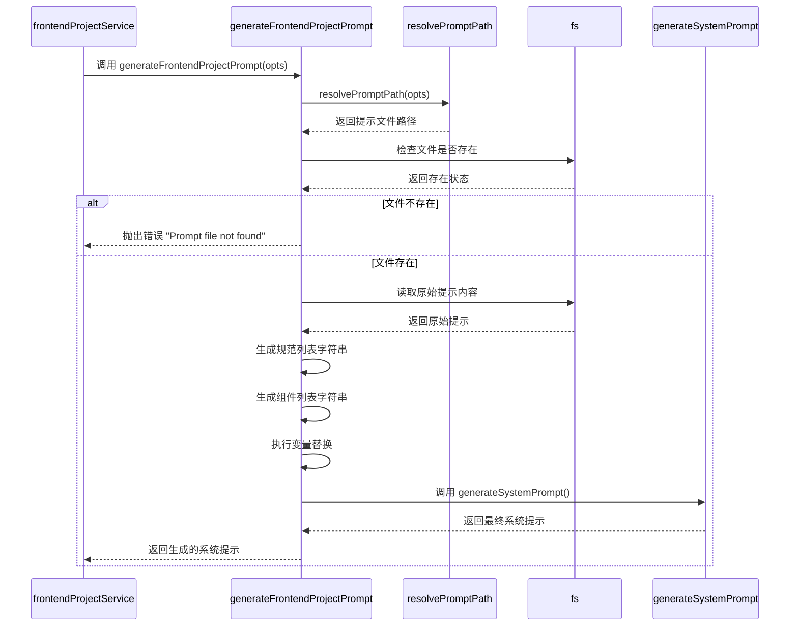
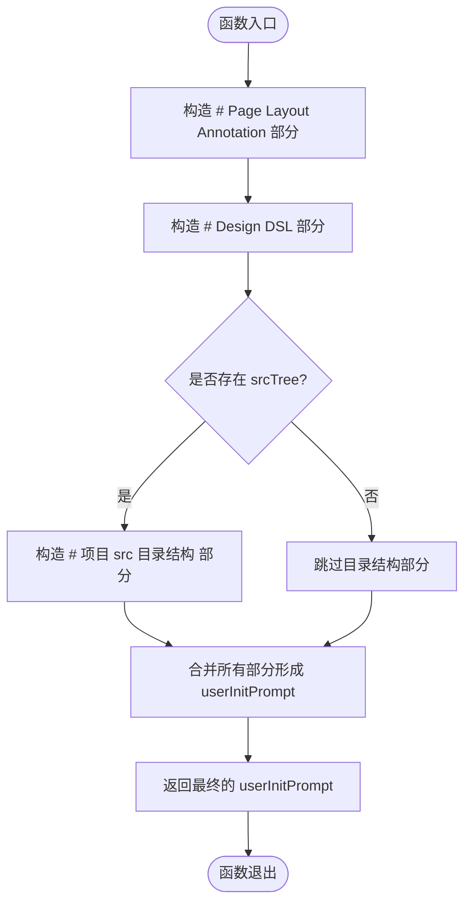
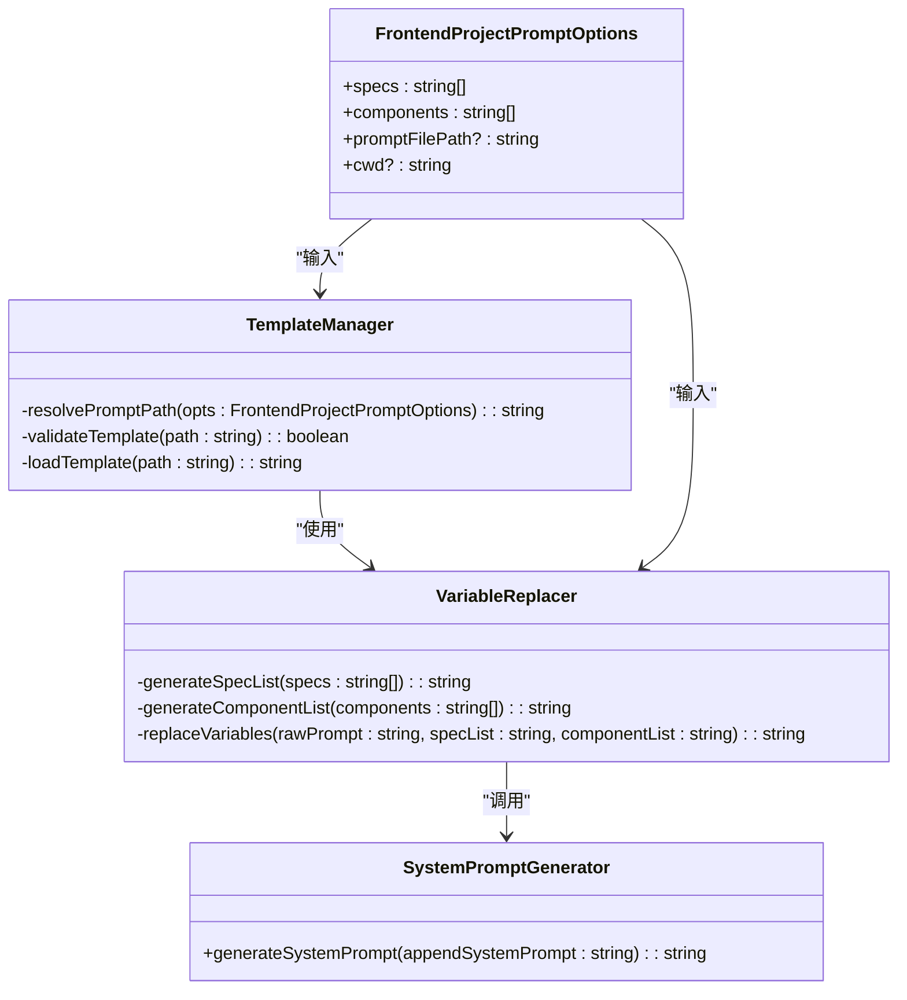
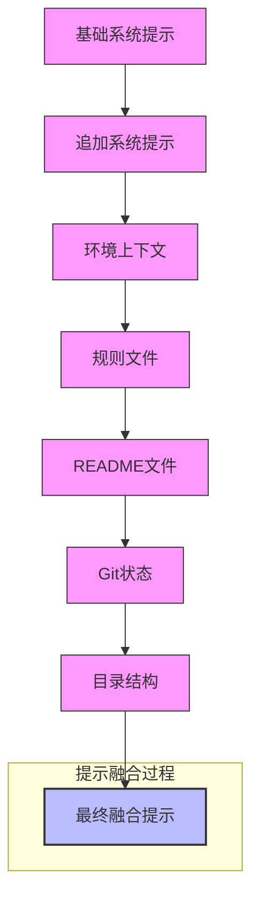
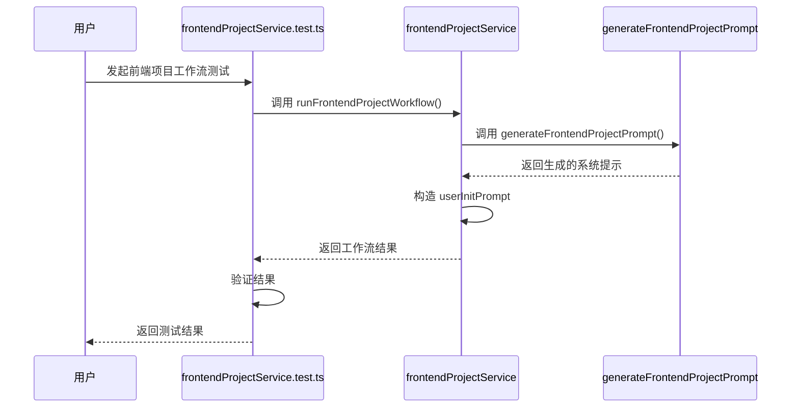

# 提示工程与系统提示加载

<cite>
**本文档引用的文件**  
- [frontendProjectService.ts](file://fta-agent-core/src/frontendProjectService.ts)
- [frontendProject.ts](file://fta-agent-core/src/prompts/frontendProject.ts)
- [systemPrompt.ts](file://fta-agent-core/src/prompts/systemPrompt.ts)
- [specReader.ts](file://fta-agent-core/src/tools/specReader.ts)
- [componentDocReader.ts](file://fta-agent-core/src/tools/componentDocReader.ts)
- [frontend-project.md](file://fta-agent-core/src/prompts/frontend-project.md)
- [directory.md](file://fta-agent-core/mock-specs/directory.md)
- [llmsContext.ts](file://fta-agent-core/src/llmsContext.ts)
</cite>

## 目录
1. [引言](#引言)
2. [核心组件分析](#核心组件分析)
3. [系统提示生成机制](#系统提示生成机制)
4. [用户初始提示构造](#用户初始提示构造)
5. [提示模板管理与变量替换](#提示模板管理与变量替换)
6. [多层级提示融合策略](#多层级提示融合策略)
7. [实际案例分析](#实际案例分析)
8. [常见问题与解决方案](#常见问题与解决方案)
9. [结论](#结论)

## 引言
本文档深入解析Agent工作流中提示工程的实现机制，重点描述`generateFrontendProjectPrompt`函数如何根据项目规范（specs）和组件文档（components）动态生成系统提示。文档涵盖提示模板管理、变量替换逻辑和多层级提示融合策略，并提供提示注入失败、模板加载异常等问题的解决方案。

## 核心组件分析

**Section sources**
- [frontendProjectService.ts](file://fta-agent-core/src/frontendProjectService.ts#L1-L230)
- [frontendProject.ts](file://fta-agent-core/src/prompts/frontendProject.ts#L1-L46)

## 系统提示生成机制

**Diagram sources**
- [frontendProject.ts](file://fta-agent-core/src/prompts/frontendProject.ts#L15-L46)
- [frontendProjectService.ts](file://fta-agent-core/src/frontendProjectService.ts#L223-L228)

**Section sources**
- [frontendProject.ts](file://fta-agent-core/src/prompts/frontendProject.ts#L1-L46)
- [systemPrompt.ts](file://fta-agent-core/src/prompts/systemPrompt.ts#L64-L117)

## 用户初始提示构造

**Diagram sources**
- [frontendProjectService.ts](file://fta-agent-core/src/frontendProjectService.ts#L185-L191)

**Section sources**
- [frontendProjectService.ts](file://fta-agent-core/src/frontendProjectService.ts#L185-L191)
- [llmsContext.ts](file://fta-agent-core/src/llmsContext.ts#L193-L196)

## 提示模板管理与变量替换

**Diagram sources**
- [frontendProject.ts](file://fta-agent-core/src/prompts/frontendProject.ts#L6-L46)
- [systemPrompt.ts](file://fta-agent-core/src/prompts/systemPrompt.ts#L64-L117)

**Section sources**
- [frontendProject.ts](file://fta-agent-core/src/prompts/frontendProject.ts#L6-L46)
- [systemPrompt.ts](file://fta-agent-core/src/prompts/systemPrompt.ts#L64-L117)

## 多层级提示融合策略

**Diagram sources**
- [llmsContext.ts](file://fta-agent-core/src/llmsContext.ts#L22-L86)
- [systemPrompt.ts](file://fta-agent-core/src/prompts/systemPrompt.ts#L64-L117)

**Section sources**
- [llmsContext.ts](file://fta-agent-core/src/llmsContext.ts#L22-L86)
- [systemPrompt.ts](file://fta-agent-core/src/prompts/systemPrompt.ts#L64-L117)

## 实际案例分析

**Diagram sources**
- [frontendProjectService.test.ts](file://fta-agent-core/src/frontendProjectService.test.ts#L125-L147)
- [frontendProjectService.ts](file://fta-agent-core/src/frontendProjectService.ts#L176-L201)

**Section sources**
- [frontendProjectService.test.ts](file://fta-agent-core/src/frontendProjectService.test.ts#L125-L147)
- [frontendProjectService.ts](file://fta-agent-core/src/frontendProjectService.ts#L125-L230)

## 常见问题与解决方案

### 提示注入失败
当`generateFrontendProjectPrompt`函数无法找到指定的提示文件时，会抛出"Prompt file not found"错误。这通常发生在以下情况：
- `promptFilePath`参数指定的路径不存在
- 工作目录(cwd)设置不正确
- 文件权限问题导致无法读取

**解决方案**：
1. 验证`promptFilePath`参数的正确性
2. 确保工作目录(cwd)设置正确
3. 检查文件系统权限
4. 使用绝对路径而非相对路径

### 模板加载异常
模板加载异常可能由以下原因引起：
- 模板文件编码问题（非UTF-8）
- 模板文件内容损坏
- 变量占位符格式错误

**解决方案**：
1. 确保模板文件使用UTF-8编码
2. 验证模板文件完整性
3. 检查变量占位符格式是否正确（如`{{SPEC_LIST}}`）

### 组件文档读取失败
组件文档读取失败通常发生在`createComponentDocReaderTool`创建的工具中，原因包括：
- 组件名称未注册
- 组件文档文件不存在
- 文件路径解析错误

**解决方案**：
1. 确保组件名称已正确注册
2. 验证组件文档文件的存在性
3. 检查文件路径解析逻辑

**Section sources**
- [frontendProject.ts](file://fta-agent-core/src/prompts/frontendProject.ts#L26-L28)
- [componentDocReader.ts](file://fta-agent-core/src/tools/componentDocReader.ts#L53-L60)
- [specReader.ts](file://fta-agent-core/src/tools/specReader.ts#L77-L80)

## 结论
本文档详细解析了Agent工作流中提示工程的实现机制，重点阐述了`generateFrontendProjectPrompt`函数如何根据项目规范和组件文档动态生成系统提示。通过分析用户初始提示的构造规则、提示模板管理、变量替换逻辑和多层级提示融合策略，为开发者提供了深入理解提示工程实现的全面视角。同时，文档提供了常见问题的解决方案，有助于提高系统的稳定性和可靠性。