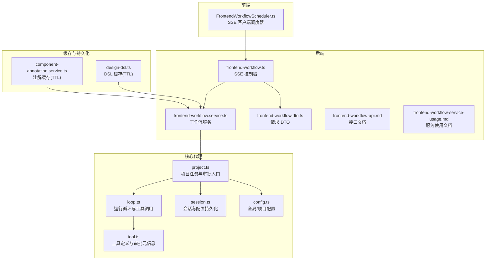
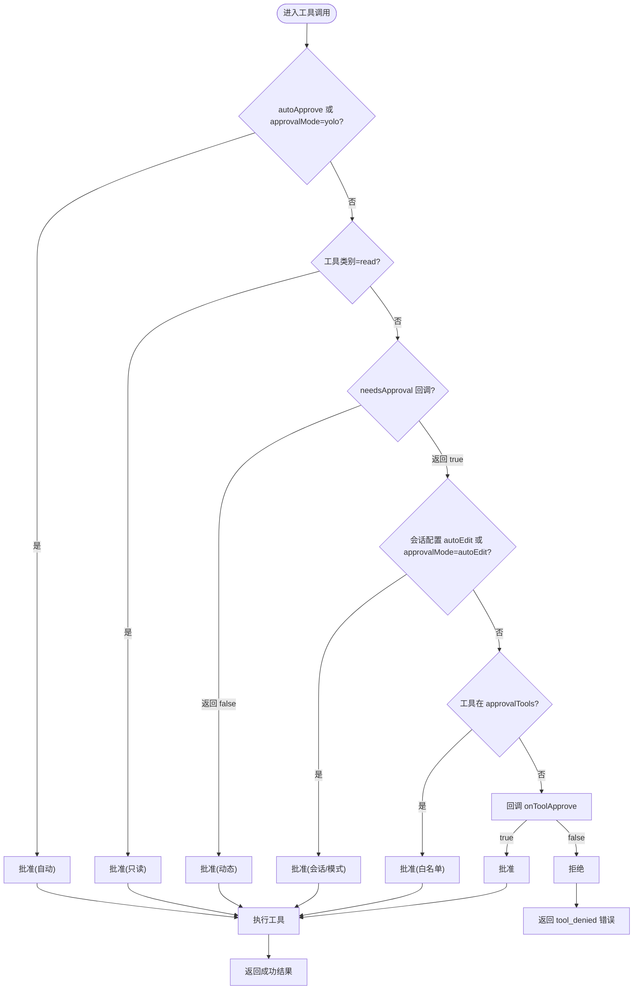
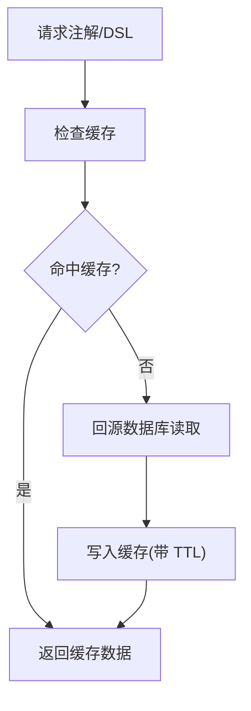
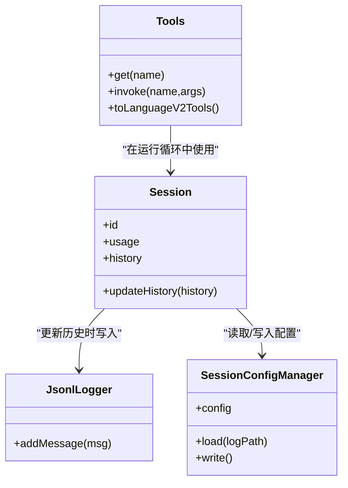
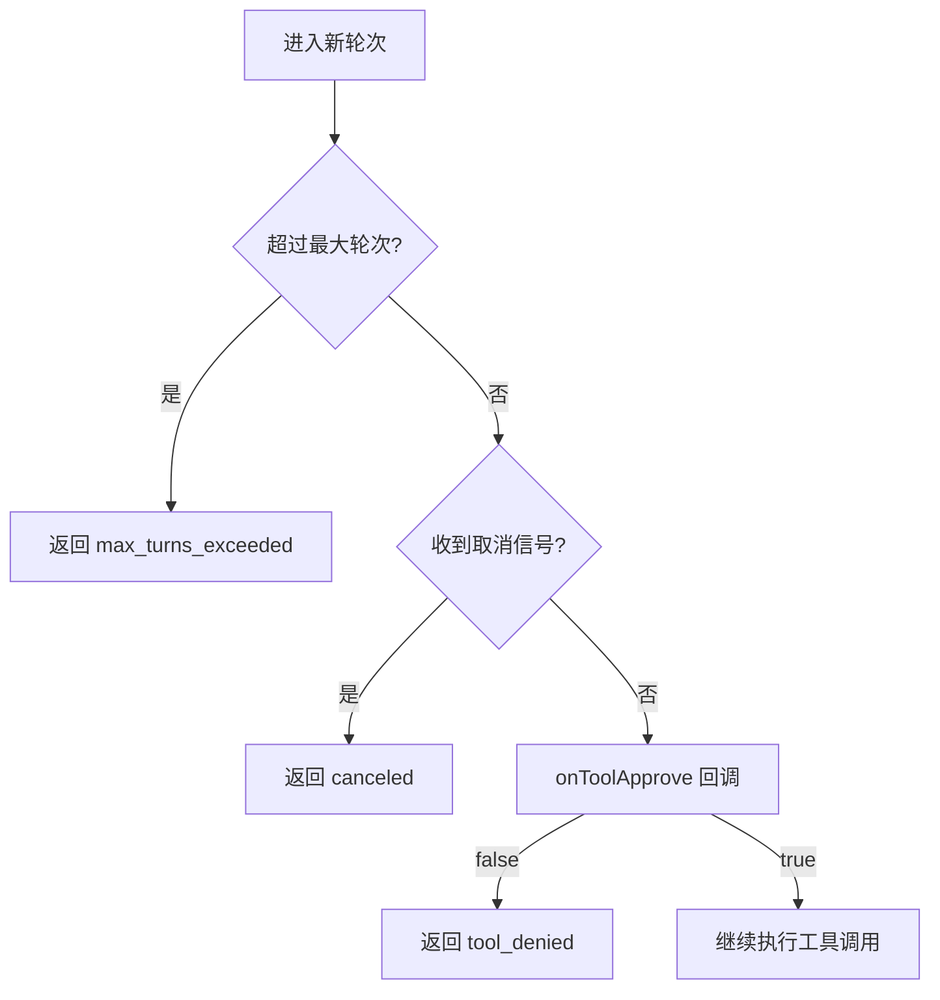
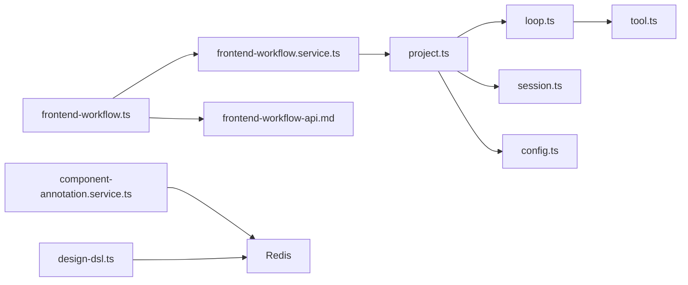

# 审批状态管理

<cite>
**本文引用的文件列表**
- [project.ts](file://fta-agent-core/src/project.ts)
- [loop.ts](file://fta-agent-core/src/loop.ts)
- [tool.ts](file://fta-agent-core/src/tool.ts)
- [session.ts](file://fta-agent-core/src/session.ts)
- [config.ts](file://fta-agent-core/src/config.ts)
- [frontend-workflow.ts](file://code-agent-backend/src/controller/code-agent/frontend-workflow.ts)
- [frontend-workflow.service.ts](file://code-agent-backend/src/service/code-agent/frontend-workflow.ts)
- [frontend-workflow.dto.ts](file://code-agent-backend/src/dto/code-agent/frontend-workflow.dto.ts)
- [frontend-workflow-api.md](file://code-agent-backend/docs/frontend-workflow-api.md)
- [frontend-workflow-service-usage.md](file://code-agent-backend/docs/frontend-workflow-service-usage.md)
- [component-annotation.service.ts](file://code-agent-backend/src/service/design/component-annotation.service.ts)
- [design-dsl.ts](file://code-agent-backend/src/service/design/design-dsl.ts)
</cite>

## 目录
1. [引言](#引言)
2. [项目结构](#项目结构)
3. [核心组件](#核心组件)
4. [架构总览](#架构总览)
5. [详细组件分析](#详细组件分析)
6. [依赖关系分析](#依赖关系分析)
7. [性能与并发特性](#性能与并发特性)
8. [故障排查指南](#故障排查指南)
9. [结论](#结论)

## 引言
本文围绕“审批状态的生命周期管理”进行系统化梳理，重点覆盖以下主题：
- 审批状态的生命周期：待审批、已批准、已拒绝、超时失效等状态转换规则
- 基于 TTL 的状态时效性控制策略
- 状态存储结构设计：内存缓存与持久化层的协同
- 审批超时或用户未响应时的自动回滚逻辑
- 通过 RunLoopOpts 中的 onToolApprove 事件处理状态变更
- 高并发场景下的状态一致性保障方案

## 项目结构
本仓库包含三个主要子模块：
- fta-agent-core：核心代理运行循环与工具系统，负责审批决策与工具调用
- code-agent-backend：后端控制器与服务，负责前端工作流的 SSE 推送与回调桥接
- fta-layout-design：前端调度器与页面服务，负责发起工作流并消费事件流



图表来源
- [project.ts](file://fta-agent-core/src/project.ts#L1-L120)
- [loop.ts](file://fta-agent-core/src/loop.ts#L83-L120)
- [tool.ts](file://fta-agent-core/src/tool.ts#L195-L230)
- [session.ts](file://fta-agent-core/src/session.ts#L47-L116)
- [config.ts](file://fta-agent-core/src/config.ts#L27-L65)
- [frontend-workflow.ts](file://code-agent-backend/src/controller/code-agent/frontend-workflow.ts#L80-L159)
- [frontend-workflow.service.ts](file://code-agent-backend/src/service/code-agent/frontend-workflow.ts#L34-L120)
- [frontend-workflow.dto.ts](file://code-agent-backend/src/dto/code-agent/frontend-workflow.dto.ts#L1-L59)
- [frontend-workflow-api.md](file://code-agent-backend/docs/frontend-workflow-api.md#L1-L120)
- [frontend-workflow-service-usage.md](file://code-agent-backend/docs/frontend-workflow-service-usage.md#L57-L108)
- [component-annotation.service.ts](file://code-agent-backend/src/service/design/component-annotation.service.ts#L58-L88)
- [design-dsl.ts](file://code-agent-backend/src/service/design/design-dsl.ts#L165-L201)

章节来源
- [project.ts](file://fta-agent-core/src/project.ts#L1-L120)
- [loop.ts](file://fta-agent-core/src/loop.ts#L83-L120)
- [frontend-workflow.ts](file://code-agent-backend/src/controller/code-agent/frontend-workflow.ts#L80-L159)

## 核心组件
- 审批决策与状态流转
  - 项目任务入口与审批回调：在项目任务执行过程中，通过 onToolApprove 回调触发审批决策
  - 工具调用循环：在每次工具调用前，由 RunLoopOpts.onToolApprove 决定是否允许执行
  - 工具元信息：每个工具可声明审批类别与条件，影响审批策略
- 会话与配置持久化
  - 会话配置管理器：将审批模式、工具白名单等写入会话日志文件，实现持久化
  - 全局/项目配置：提供 approvalMode、autoEdit、yolo 等模式开关
- 缓存与 TTL
  - 后端服务对注解与 DSL 的缓存采用 TTL，提升读取性能并降低后端压力
- 前后端协作
  - SSE 控制器将工具调用请求推送到前端，前端通过回调决定是否批准

章节来源
- [project.ts](file://fta-agent-core/src/project.ts#L180-L247)
- [loop.ts](file://fta-agent-core/src/loop.ts#L432-L498)
- [tool.ts](file://fta-agent-core/src/tool.ts#L195-L230)
- [session.ts](file://fta-agent-core/src/session.ts#L47-L116)
- [config.ts](file://fta-agent-core/src/config.ts#L27-L65)
- [component-annotation.service.ts](file://code-agent-backend/src/service/design/component-annotation.service.ts#L58-L88)
- [design-dsl.ts](file://code-agent-backend/src/service/design/design-dsl.ts#L165-L201)
- [frontend-workflow.ts](file://code-agent-backend/src/controller/code-agent/frontend-workflow.ts#L80-L159)

## 架构总览
审批状态生命周期贯穿“请求发起—审批决策—工具执行—结果回传”的闭环。关键路径如下：
- 前端通过 SSE 控制器发起工作流，后端服务调用核心代理
- 核心代理在工具调用前通过 onToolApprove 决策
- 审批策略由工具类别、会话配置、全局配置共同决定
- 审批结果影响工具执行分支，最终形成“已批准/已拒绝/超时失效”等状态

```mermaid
sequenceDiagram
participant FE as "前端调度器"
participant CTRL as "SSE 控制器"
participant SVC as "工作流服务"
participant PRJ as "项目任务(project.ts)"
participant LOOP as "运行循环(loop.ts)"
participant TOOL as "工具(tool.ts)"
participant SESS as "会话配置(session.ts)"
FE->>CTRL : 发起 /code-agent/frontend-workflow
CTRL->>SVC : 传入回调与参数
SVC->>PRJ : 调用 runWorkflow(...)
PRJ->>LOOP : runLoop({...})
LOOP->>TOOL : onToolUse -> onToolApprove
TOOL-->>LOOP : 审批结果(已批准/已拒绝)
LOOP->>TOOL : invoke(已批准) / 记录拒绝(已拒绝)
LOOP-->>PRJ : 返回结果(含历史/用量)
PRJ->>SESS : 更新会话历史
CTRL-->>FE : 通过 SSE 推送事件
```

图表来源
- [frontend-workflow.ts](file://code-agent-backend/src/controller/code-agent/frontend-workflow.ts#L80-L159)
- [frontend-workflow.service.ts](file://code-agent-backend/src/service/code-agent/frontend-workflow.ts#L74-L120)
- [project.ts](file://fta-agent-core/src/project.ts#L180-L247)
- [loop.ts](file://fta-agent-core/src/loop.ts#L432-L498)
- [tool.ts](file://fta-agent-core/src/tool.ts#L195-L230)
- [session.ts](file://fta-agent-core/src/session.ts#L11-L45)

## 详细组件分析

### 审批状态生命周期与转换规则
- 状态定义
  - 待审批：工具调用进入循环，等待 onToolApprove 决策
  - 已批准：onToolApprove 返回 true，执行工具调用
  - 已拒绝：onToolApprove 返回 false，记录拒绝并终止当前轮次
  - 超时失效：当达到最大轮次限制或外部取消信号时，循环结束并返回相应错误类型
- 转换规则
  - 自动批准路径：当 autoApprove 为真或 approvalMode 为 yolo 时，直接批准
  - 工具类别影响：read 类工具通常自动批准；write 类工具受会话配置 autoEdit 或 approvalMode 影响
  - 会话工具白名单：若工具名在 approvalTools 列表中，则自动批准
  - 动态审批：工具可提供 needsApproval 回调，按上下文动态判断是否需要审批
- 结果与回退
  - 已拒绝：返回 tool_denied 错误，历史记录包含拒绝原因
  - 超时/取消：返回 max_turns_exceeded 或 canceled 错误，保留历史与用量统计



图表来源
- [project.ts](file://fta-agent-core/src/project.ts#L231-L308)
- [loop.ts](file://fta-agent-core/src/loop.ts#L432-L498)
- [tool.ts](file://fta-agent-core/src/tool.ts#L226-L230)
- [session.ts](file://fta-agent-core/src/session.ts#L47-L116)
- [config.ts](file://fta-agent-core/src/config.ts#L27-L65)

章节来源
- [project.ts](file://fta-agent-core/src/project.ts#L231-L308)
- [loop.ts](file://fta-agent-core/src/loop.ts#L432-L498)
- [tool.ts](file://fta-agent-core/src/tool.ts#L226-L230)
- [session.ts](file://fta-agent-core/src/session.ts#L47-L116)
- [config.ts](file://fta-agent-core/src/config.ts#L27-L65)

### 基于 TTL 的状态时效性控制策略
- 缓存 TTL 设计
  - 注解缓存：component-annotation.service 对注解数据设置 TTL，避免重复拉取
  - DSL 缓存：design-dsl.ts 对转换结果设置 TTL，优先命中缓存再落库
- TTL 生效流程
  - 写入：redisSet 支持带 TTL 的写入，未指定 TTL 时按默认策略处理
  - 读取：redisGet 优先返回缓存，缓存缺失时回源数据库并回填缓存
- TTL 与状态一致性
  - TTL 仅作用于读取路径，不改变审批状态本身；但可减少后端压力，间接提升审批决策的及时性
  - 当缓存过期或失效时，系统会回源数据库刷新，保证数据新鲜度



图表来源
- [component-annotation.service.ts](file://code-agent-backend/src/service/design/component-annotation.service.ts#L58-L88)
- [design-dsl.ts](file://code-agent-backend/src/service/design/design-dsl.ts#L165-L201)

章节来源
- [component-annotation.service.ts](file://code-agent-backend/src/service/design/component-annotation.service.ts#L58-L88)
- [design-dsl.ts](file://code-agent-backend/src/service/design/design-dsl.ts#L165-L201)

### 状态存储结构设计（内存缓存与持久化层协同）
- 内存缓存
  - 工具注册与调用：Tools 类在内存中维护工具字典，快速定位工具并执行
  - 会话对象：Session 在内存中维护会话 ID、用量与历史，便于快速访问
- 持久化层
  - 会话配置持久化：SessionConfigManager 将审批模式、工具白名单等写入会话日志文件，实现跨进程/重启恢复
  - 历史消息持久化：JsonlLogger 将消息写入会话日志，供后续恢复与分析
- 协同策略
  - 内存用于高频读写，持久化用于容灾与恢复
  - 审批策略读取自会话配置文件，避免每次重新解析



图表来源
- [tool.ts](file://fta-agent-core/src/tool.ts#L97-L165)
- [session.ts](file://fta-agent-core/src/session.ts#L11-L45)
- [session.ts](file://fta-agent-core/src/session.ts#L62-L116)
- [project.ts](file://fta-agent-core/src/project.ts#L120-L179)

章节来源
- [tool.ts](file://fta-agent-core/src/tool.ts#L97-L165)
- [session.ts](file://fta-agent-core/src/session.ts#L11-L45)
- [session.ts](file://fta-agent-core/src/session.ts#L62-L116)
- [project.ts](file://fta-agent-core/src/project.ts#L120-L179)

### 审批超时或用户未响应时的自动回滚逻辑
- 超时判定
  - 最大轮次限制：当超过 maxTurns 时，循环返回 max_turns_exceeded 错误
  - 取消信号：当收到 AbortSignal 时，循环返回 canceled 错误
- 自动回滚
  - 已拒绝：返回 tool_denied 错误，并记录拒绝原因与历史
  - 超时/取消：返回错误类型并保留历史与用量统计，便于上层感知与处理
- 用户未响应
  - onToolApprove 默认行为：若回调未返回，按 false 处理（拒绝），从而触发回滚



图表来源
- [loop.ts](file://fta-agent-core/src/loop.ts#L170-L188)
- [loop.ts](file://fta-agent-core/src/loop.ts#L360-L364)
- [loop.ts](file://fta-agent-core/src/loop.ts#L484-L498)

章节来源
- [loop.ts](file://fta-agent-core/src/loop.ts#L170-L188)
- [loop.ts](file://fta-agent-core/src/loop.ts#L360-L364)
- [loop.ts](file://fta-agent-core/src/loop.ts#L484-L498)

### 通过 RunLoopOpts 中的 onToolApprove 事件处理状态变更
- onToolApprove 的职责
  - 在工具调用前接收 ToolUse，返回布尔值决定是否执行
  - 作为审批状态的唯一决策点，统一接入工具类别、会话配置、全局配置与回调
- 事件链路
  - runLoop 在工具调用阶段触发 onToolApprove
  - project.ts 将 onToolApprove 包装为 handleToolApproval，集中处理审批策略
  - tool.ts 提供工具类别与动态审批回调，增强灵活性

```mermaid
sequenceDiagram
participant LOOP as "runLoop"
participant PRJ as "project.handleToolApproval"
participant TOOL as "tool.ts"
participant SESS as "session.ts"
participant CFG as "config.ts"
LOOP->>PRJ : onToolApprove(toolUse)
PRJ->>CFG : 读取 approvalMode
PRJ->>TOOL : 读取工具类别/needsApproval
PRJ->>SESS : 读取会话配置(approvalMode/approvalTools)
PRJ-->>LOOP : 返回 true/false
LOOP->>TOOL : invoke(已批准) / 记录拒绝(已拒绝)
```

图表来源
- [loop.ts](file://fta-agent-core/src/loop.ts#L432-L442)
- [project.ts](file://fta-agent-core/src/project.ts#L231-L308)
- [tool.ts](file://fta-agent-core/src/tool.ts#L226-L230)
- [session.ts](file://fta-agent-core/src/session.ts#L47-L116)
- [config.ts](file://fta-agent-core/src/config.ts#L27-L65)

章节来源
- [loop.ts](file://fta-agent-core/src/loop.ts#L432-L442)
- [project.ts](file://fta-agent-core/src/project.ts#L231-L308)
- [tool.ts](file://fta-agent-core/src/tool.ts#L226-L230)
- [session.ts](file://fta-agent-core/src/session.ts#L47-L116)
- [config.ts](file://fta-agent-core/src/config.ts#L27-L65)

### 高并发场景下的状态一致性保障方案
- 并发要点
  - 会话配置写入：SessionConfigManager.write 存在 TODO 注释提示需加写锁，避免并发写冲突
  - 历史消息写入：JsonlLogger.addMessage 顺序追加，天然具备线程安全
  - 缓存写入：Redis set 带 EX 参数，原子性写入 TTL
- 建议改进
  - 为 SessionConfigManager.write 增加写锁或原子替换策略
  - 对频繁读取的会话配置增加本地缓存与定期刷新
  - 对工具调用结果进行幂等处理，避免重复执行导致的状态不一致

章节来源
- [session.ts](file://fta-agent-core/src/session.ts#L90-L116)
- [design-dsl.ts](file://code-agent-backend/src/service/design/design-dsl.ts#L187-L195)

## 依赖关系分析
- 组件耦合
  - project.ts 依赖 loop.ts 的运行循环与工具调用
  - loop.ts 依赖 tool.ts 的工具集合与工具描述
  - project.ts 依赖 session.ts 的会话与配置持久化
  - project.ts 依赖 config.ts 的全局/项目配置
  - 后端控制器与服务通过 SSE 与前端调度器交互，形成端到端闭环
- 外部依赖
  - Redis：用于注解与 DSL 的缓存，提升读取性能
  - 文件系统：会话日志与历史消息持久化



图表来源
- [project.ts](file://fta-agent-core/src/project.ts#L1-L120)
- [loop.ts](file://fta-agent-core/src/loop.ts#L83-L120)
- [tool.ts](file://fta-agent-core/src/tool.ts#L97-L165)
- [session.ts](file://fta-agent-core/src/session.ts#L62-L116)
- [config.ts](file://fta-agent-core/src/config.ts#L82-L120)
- [frontend-workflow.ts](file://code-agent-backend/src/controller/code-agent/frontend-workflow.ts#L80-L159)
- [frontend-workflow.service.ts](file://code-agent-backend/src/service/code-agent/frontend-workflow.ts#L74-L120)
- [frontend-workflow-api.md](file://code-agent-backend/docs/frontend-workflow-api.md#L1-L120)
- [component-annotation.service.ts](file://code-agent-backend/src/service/design/component-annotation.service.ts#L58-L88)
- [design-dsl.ts](file://code-agent-backend/src/service/design/design-dsl.ts#L165-L201)

章节来源
- [project.ts](file://fta-agent-core/src/project.ts#L1-L120)
- [loop.ts](file://fta-agent-core/src/loop.ts#L83-L120)
- [tool.ts](file://fta-agent-core/src/tool.ts#L97-L165)
- [session.ts](file://fta-agent-core/src/session.ts#L62-L116)
- [config.ts](file://fta-agent-core/src/config.ts#L82-L120)
- [frontend-workflow.ts](file://code-agent-backend/src/controller/code-agent/frontend-workflow.ts#L80-L159)
- [frontend-workflow.service.ts](file://code-agent-backend/src/service/code-agent/frontend-workflow.ts#L74-L120)
- [frontend-workflow-api.md](file://code-agent-backend/docs/frontend-workflow-api.md#L1-L120)
- [component-annotation.service.ts](file://code-agent-backend/src/service/design/component-annotation.service.ts#L58-L88)
- [design-dsl.ts](file://code-agent-backend/src/service/design/design-dsl.ts#L165-L201)

## 性能与并发特性
- 性能优化
  - TTL 缓存：注解与 DSL 采用 TTL 缓存，显著降低后端压力
  - 历史压缩：autoCompact 选项在必要时压缩历史，控制上下文大小
  - 工具描述截断：避免工具描述过长导致的传输与解析成本
- 并发保障
  - 会话配置写入建议加锁，避免并发写冲突
  - 历史消息写入为顺序追加，天然具备线程安全
  - 工具调用采用异步执行，配合错误重试与指数退避

[本节为通用指导，不涉及具体文件分析]

## 故障排查指南
- 常见问题
  - 审批未生效：确认 onToolApprove 是否被正确注入，以及回调返回值
  - 工具类别误判：检查工具 approval.category 与 needsApproval 回调
  - 会话配置未生效：确认 SessionConfigManager.write 是否被调用且无并发写冲突
  - 缓存命中异常：检查 Redis TTL 设置与键空间，确认缓存未被意外清理
- 关键日志与指标
  - runLoop 返回的 error.type（tool_denied/max_turns_exceeded/canceled/api_error）
  - RequestLogger 与 JsonlLogger 的元数据与消息流
- 建议步骤
  - 在 onToolApprove 中打印工具名、类别与审批结果，定位策略分支
  - 在 loop.ts 中观察 maxTurns 与 errorRetryTurns 的行为
  - 在后端服务中检查 SSE 事件推送与前端消费情况

章节来源
- [loop.ts](file://fta-agent-core/src/loop.ts#L341-L358)
- [loop.ts](file://fta-agent-core/src/loop.ts#L484-L498)
- [frontend-workflow.ts](file://code-agent-backend/src/controller/code-agent/frontend-workflow.ts#L80-L159)
- [frontend-workflow-api.md](file://code-agent-backend/docs/frontend-workflow-api.md#L1-L120)

## 结论
本系统通过“工具元信息 + 会话配置 + 全局配置 + 回调”的多维审批策略，实现了灵活可控的审批状态生命周期管理。结合 TTL 缓存与会话日志持久化，既保证了性能又兼顾了可靠性。在高并发场景下，建议完善会话配置写入的并发控制，并对工具调用结果进行幂等处理，以进一步提升一致性与稳定性。