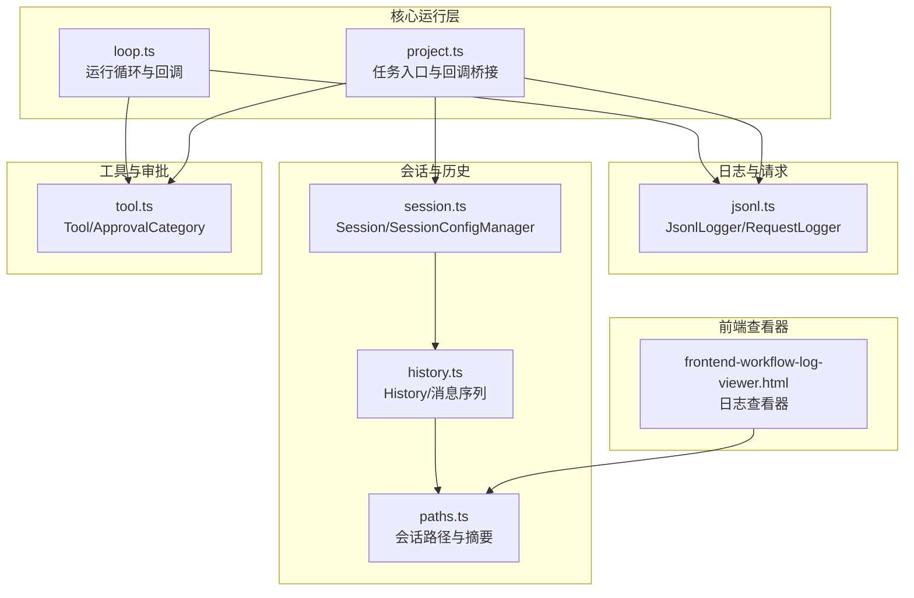
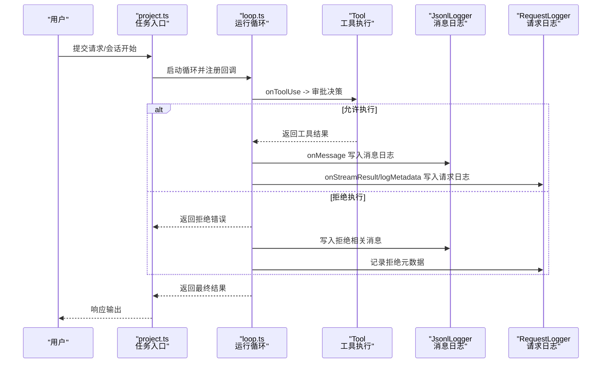
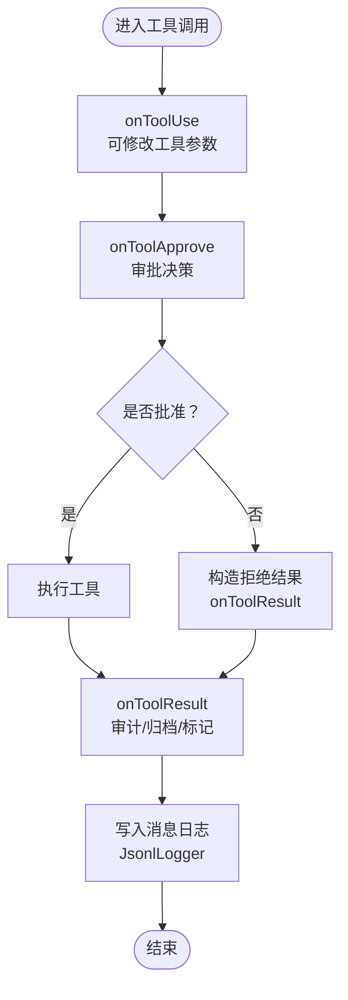
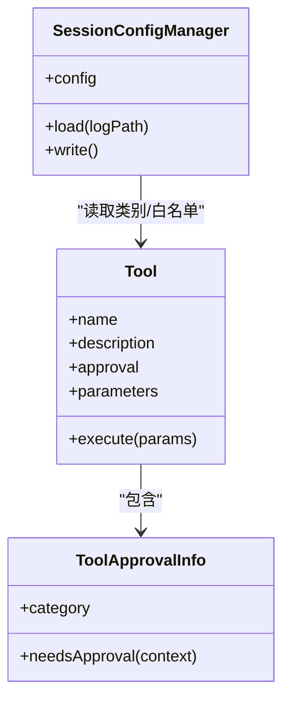
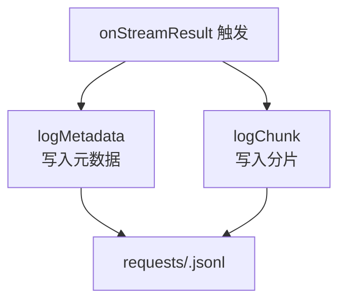
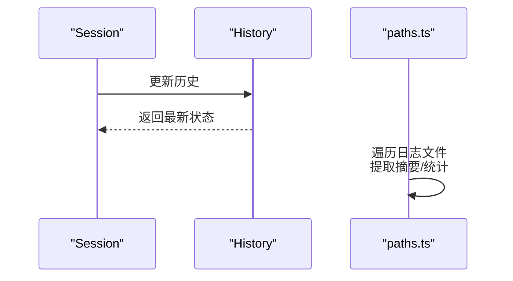
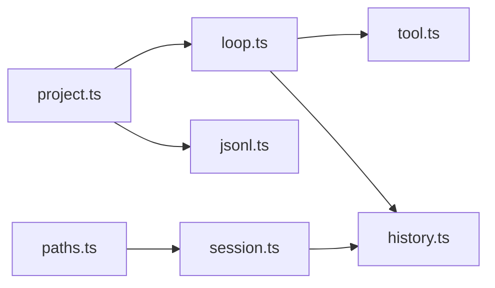

# 审计追踪与安全监控

<cite>
**本文引用的文件**
- [jsonl.ts](file://fta-agent-core/src/jsonl.ts)
- [loop.ts](file://fta-agent-core/src/loop.ts)
- [project.ts](file://fta-agent-core/src/project.ts)
- [message.ts](file://fta-agent-core/src/message.ts)
- [history.ts](file://fta-agent-core/src/history.ts)
- [session.ts](file://fta-agent-core/src/session.ts)
- [paths.ts](file://fta-agent-core/src/paths.ts)
- [tool.ts](file://fta-agent-core/src/tool.ts)
- [frontend-workflow-log-viewer.html](file://code-agent-backend/tools/frontend-workflow-log-viewer.html)
- [TechnicalPage.tsx](file://fta-layout-design/src/pages/TechnicalPage.tsx)
</cite>

## 目录
1. [引言](#引言)
2. [项目结构](#项目结构)
3. [核心组件](#核心组件)
4. [架构总览](#架构总览)
5. [详细组件分析](#详细组件分析)
6. [依赖关系分析](#依赖关系分析)
7. [性能考量](#性能考量)
8. [故障排查指南](#故障排查指南)
9. [结论](#结论)
10. [附录](#附录)

## 引言
本文件系统化阐述审批过程的审计日志记录机制，覆盖审批请求、用户响应、执行结果等关键事件的留痕策略；说明如何利用 onToolResult 和 onMessage 回调捕获敏感操作行为，实现异常行为检测（如频繁审批拒绝、高风险工具调用）；给出审计日志的数据结构设计、存储方案及合规性要求，并提供安全事件告警配置与日志分析工具集成指南。

## 项目结构
围绕审计与安全监控的关键模块分布如下：
- 日志与请求记录：JsonlLogger、RequestLogger
- 会话与历史：Session、History、paths
- 工具与审批：Tool 接口、审批流程处理
- 运行循环与回调：loop、project
- 前端日志查看器：frontend-workflow-log-viewer.html
- 技术页安全策略说明：TechnicalPage.tsx

图表来源
- [jsonl.ts](file://fta-agent-core/src/jsonl.ts#L1-L100)
- [loop.ts](file://fta-agent-core/src/loop.ts#L430-L532)
- [project.ts](file://fta-agent-core/src/project.ts#L202-L308)
- [session.ts](file://fta-agent-core/src/session.ts#L1-L175)
- [history.ts](file://fta-agent-core/src/history.ts#L1-L288)
- [paths.ts](file://fta-agent-core/src/paths.ts#L46-L126)
- [tool.ts](file://fta-agent-core/src/tool.ts#L167-L274)
- [frontend-workflow-log-viewer.html](file://code-agent-backend/tools/frontend-workflow-log-viewer.html#L1-L778)

章节来源
- [jsonl.ts](file://fta-agent-core/src/jsonl.ts#L1-L100)
- [loop.ts](file://fta-agent-core/src/loop.ts#L430-L532)
- [project.ts](file://fta-agent-core/src/project.ts#L202-L308)
- [session.ts](file://fta-agent-core/src/session.ts#L1-L175)
- [history.ts](file://fta-agent-core/src/history.ts#L1-L288)
- [paths.ts](file://fta-agent-core/src/paths.ts#L46-L126)
- [tool.ts](file://fta-agent-core/src/tool.ts#L167-L274)
- [frontend-workflow-log-viewer.html](file://code-agent-backend/tools/frontend-workflow-log-viewer.html#L1-L778)

## 核心组件
- JsonlLogger：以 JSON Lines 格式追加写入消息级审计日志，包含会话标识、时间戳、消息内容与链路关系。
- RequestLogger：按请求维度记录元数据与流式分片，便于回放与审计。
- Session/SessionConfigManager：维护会话配置（含审批模式与工具白名单），并持久化为日志中的“config”条目。
- History：统一消息模型与路径构建，支持压缩与摘要生成，便于长期留存与检索。
- Tool/ApprovalCategory：定义工具类别与审批需求，支撑高风险工具的拦截与审计。
- loop/project：在工具调用前后注入 onToolResult/onMessage 等回调，形成完整的审批与执行审计闭环。

章节来源
- [jsonl.ts](file://fta-agent-core/src/jsonl.ts#L1-L100)
- [session.ts](file://fta-agent-core/src/session.ts#L1-L175)
- [history.ts](file://fta-agent-core/src/history.ts#L1-L288)
- [tool.ts](file://fta-agent-core/src/tool.ts#L167-L274)
- [loop.ts](file://fta-agent-core/src/loop.ts#L430-L532)
- [project.ts](file://fta-agent-core/src/project.ts#L202-L308)

## 架构总览
下图展示从用户输入到工具执行再到审计落盘的整体流程，重点标注审批与审计关键节点。

图表来源
- [project.ts](file://fta-agent-core/src/project.ts#L202-L308)
- [loop.ts](file://fta-agent-core/src/loop.ts#L430-L532)
- [jsonl.ts](file://fta-agent-core/src/jsonl.ts#L1-L100)

## 详细组件分析

### 审批与工具调用审计（onToolResult/onMessage）
- onMessage：在每条消息被添加时触发，用于将用户、助手、工具等消息写入 JSON Lines 日志，保留会话链路与时间戳。
- onToolResult：在工具调用完成后触发，可用于对工具结果进行二次审计（如敏感信息脱敏、异常标记），并决定是否允许继续流程。
- onToolApprove：在工具调用前触发，结合工具类别与会话配置决定是否需要人工审批或自动放行。

图表来源
- [loop.ts](file://fta-agent-core/src/loop.ts#L430-L532)
- [project.ts](file://fta-agent-core/src/project.ts#L202-L308)
- [jsonl.ts](file://fta-agent-core/src/jsonl.ts#L1-L100)

章节来源
- [loop.ts](file://fta-agent-core/src/loop.ts#L430-L532)
- [project.ts](file://fta-agent-core/src/project.ts#L202-L308)
- [jsonl.ts](file://fta-agent-core/src/jsonl.ts#L1-L100)

### 审批策略与工具分类
- 工具类别（ApprovalCategory）：read/write/command/network，用于区分风险等级与审批策略。
- 审批模式（ApprovalMode）：default/autoEdit/yolo，影响默认审批行为与自动放行范围。
- 会话配置（SessionConfigManager）：支持在日志中持久化当前会话的审批模式与工具白名单，便于回溯与复核。

图表来源
- [tool.ts](file://fta-agent-core/src/tool.ts#L167-L274)
- [session.ts](file://fta-agent-core/src/session.ts#L47-L116)

章节来源
- [tool.ts](file://fta-agent-core/src/tool.ts#L167-L274)
- [session.ts](file://fta-agent-core/src/session.ts#L47-L116)

### 请求级审计（RequestLogger）
- 元数据记录：包含请求ID、提示词、模型、工具列表、请求/响应与错误信息。
- 分片记录：按流式分片写入，便于实时监控与回放。
- 存储位置：requests 目录下以 requestId 命名的 JSON Lines 文件。

图表来源
- [jsonl.ts](file://fta-agent-core/src/jsonl.ts#L51-L100)

章节来源
- [jsonl.ts](file://fta-agent-core/src/jsonl.ts#L51-L100)

### 会话与历史（Session/History）
- Session：封装会话ID、使用量与历史对象。
- History：统一消息模型，支持路径回溯、压缩与摘要生成，便于长期留存与检索。
- paths：列出最近会话、统计消息数与摘要，支持日志浏览与分析。

图表来源
- [session.ts](file://fta-agent-core/src/session.ts#L1-L175)
- [history.ts](file://fta-agent-core/src/history.ts#L1-L288)
- [paths.ts](file://fta-agent-core/src/paths.ts#L46-L126)

章节来源
- [session.ts](file://fta-agent-core/src/session.ts#L1-L175)
- [history.ts](file://fta-agent-core/src/history.ts#L1-L288)
- [paths.ts](file://fta-agent-core/src/paths.ts#L46-L126)

### 前端日志查看器与可视化
- 前端查看器支持加载新版 JSON 会话日志与旧版 JSONL 记录，提供离线回放、逐步查看与产物抽屉。
- 可通过查看器快速定位审批拒绝、错误事件与工具调用轨迹。

章节来源
- [frontend-workflow-log-viewer.html](file://code-agent-backend/tools/frontend-workflow-log-viewer.html#L1-L778)

## 依赖关系分析
- 运行循环（loop）依赖工具（tool）与历史（history），并通过回调桥接到项目入口（project）与日志（jsonl）。
- 项目入口（project）负责组装回调链，连接审批策略与日志记录。
- 会话（session）与路径（paths）为日志浏览与回溯提供基础能力。

图表来源
- [loop.ts](file://fta-agent-core/src/loop.ts#L430-L532)
- [project.ts](file://fta-agent-core/src/project.ts#L202-L308)
- [jsonl.ts](file://fta-agent-core/src/jsonl.ts#L1-L100)
- [session.ts](file://fta-agent-core/src/session.ts#L1-L175)
- [paths.ts](file://fta-agent-core/src/paths.ts#L46-L126)

章节来源
- [loop.ts](file://fta-agent-core/src/loop.ts#L430-L532)
- [project.ts](file://fta-agent-core/src/project.ts#L202-L308)
- [jsonl.ts](file://fta-agent-core/src/jsonl.ts#L1-L100)
- [session.ts](file://fta-agent-core/src/session.ts#L1-L175)
- [paths.ts](file://fta-agent-core/src/paths.ts#L46-L126)

## 性能考量
- 历史压缩：当上下文接近阈值时，History 会生成摘要并清理原始消息，降低日志体积与查询成本。
- 流式分片：RequestLogger 的分片写入避免一次性大块写入，提升稳定性与可观测性。
- 会话路径过滤：仅保留活跃路径的消息，减少无效数据读取与分析开销。

章节来源
- [history.ts](file://fta-agent-core/src/history.ts#L244-L288)
- [jsonl.ts](file://fta-agent-core/src/jsonl.ts#L51-L100)
- [session.ts](file://fta-agent-core/src/session.ts#L118-L175)

## 故障排查指南
- 审批拒绝导致流程中断：检查 onToolApprove 回调返回值与工具类别；确认会话配置中的审批模式与工具白名单。
- 日志解析失败：History 在解析失败时抛出带行号的错误，便于定位问题行。
- 请求日志缺失：确认 onStreamResult/onChunk 是否被正确注册；检查 requests 目录权限与磁盘空间。
- 前端查看器无法加载：确认日志文件路径与格式；检查浏览器控制台错误。

章节来源
- [loop.ts](file://fta-agent-core/src/loop.ts#L430-L532)
- [project.ts](file://fta-agent-core/src/project.ts#L202-L308)
- [history.ts](file://fta-agent-core/src/history.ts#L158-L174)
- [jsonl.ts](file://fta-agent-core/src/jsonl.ts#L51-L100)
- [frontend-workflow-log-viewer.html](file://code-agent-backend/tools/frontend-workflow-log-viewer.html#L1-L778)

## 结论
该系统通过 onToolResult/onMessage 回调与 RequestLogger/JsonlLogger 实现了从审批请求、用户响应到执行结果的全链路审计；借助工具类别与会话配置，能够对高风险工具进行精细化管控；前端查看器与路径统计为审计与复盘提供了直观手段。建议在生产环境中结合告警规则与日志分析平台，持续优化异常检测与合规性保障。

## 附录

### 审计日志数据结构设计
- 消息级日志（JsonlLogger）
  - 字段要点：会话ID、时间戳、消息类型、角色、内容、父消息UUID、链路关系等。
  - 用途：完整重现对话与工具调用链，支持溯源与取证。
- 请求级日志（RequestLogger）
  - 字段要点：请求ID、提示词、模型、工具列表、请求/响应、错误信息、分片内容。
  - 用途：跨请求对比、性能分析与异常定位。

章节来源
- [jsonl.ts](file://fta-agent-core/src/jsonl.ts#L1-L100)
- [message.ts](file://fta-agent-core/src/message.ts#L1-L221)

### 存储方案与合规性要求
- 存储位置
  - 消息日志：按会话保存为 JSON Lines 文件，便于增量备份与归档。
  - 请求日志：requests 目录下以请求ID命名，便于按请求检索。
- 合规性建议
  - 数据最小化：仅记录必要字段，避免敏感信息明文存储。
  - 访问控制：限制日志文件读写权限，设置访问审计。
  - 生命周期：制定日志保留期限与销毁策略，满足法规要求。
  - 加密传输与存储：在传输与静态存储阶段采用加密措施。
- 安全策略参考
  - 技术页中提及数据安全、访问控制与代码安全扫描等策略，可作为合规基线。

章节来源
- [jsonl.ts](file://fta-agent-core/src/jsonl.ts#L1-L100)
- [session.ts](file://fta-agent-core/src/session.ts#L1-L175)
- [TechnicalPage.tsx](file://fta-layout-design/src/pages/TechnicalPage.tsx#L220-L256)

### 异常行为检测与告警配置
- 高频审批拒绝：基于 onToolApprove 回调统计单位时间内拒绝次数，超过阈值触发告警。
- 高风险工具调用：根据工具类别（network/command/write）进行标记与分级告警。
- 流式异常：结合 RequestLogger 的错误字段与分片内容，识别超时、重试与异常响应。
- 建议指标
  - 拒绝率、平均响应时延、工具调用成功率、异常错误占比。
- 告警通道
  - 将审计事件推送至 SIEM/日志分析平台（如 ELK、Splunk、Grafana Loki），配置规则引擎与仪表板。

章节来源
- [loop.ts](file://fta-agent-core/src/loop.ts#L430-L532)
- [jsonl.ts](file://fta-agent-core/src/jsonl.ts#L51-L100)
- [tool.ts](file://fta-agent-core/src/tool.ts#L167-L274)

### 日志分析工具集成指南
- 导入方式：前端查看器支持加载新版 JSON 与旧版 JSONL，便于离线分析与对比。
- 分析维度：按会话、请求、工具、角色、时间窗口聚合统计，定位异常模式。
- 可视化建议：结合看板展示审批趋势、工具调用热力图与错误分布。

章节来源
- [frontend-workflow-log-viewer.html](file://code-agent-backend/tools/frontend-workflow-log-viewer.html#L1-L778)
- [paths.ts](file://fta-agent-core/src/paths.ts#L46-L126)