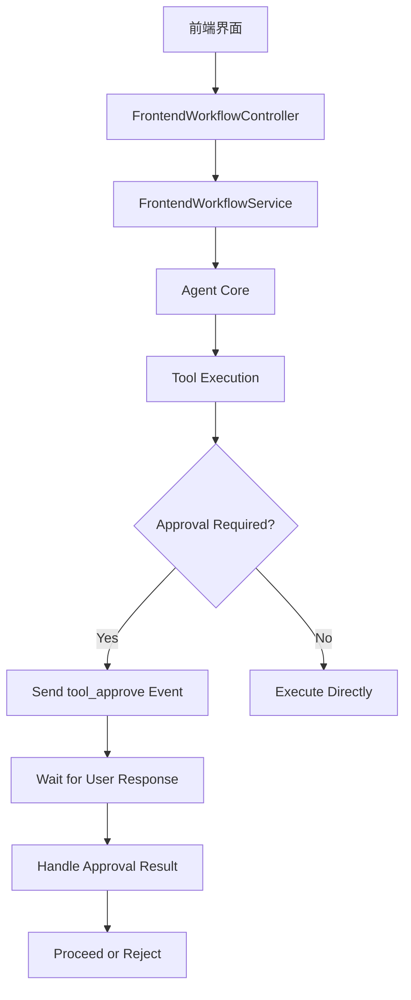
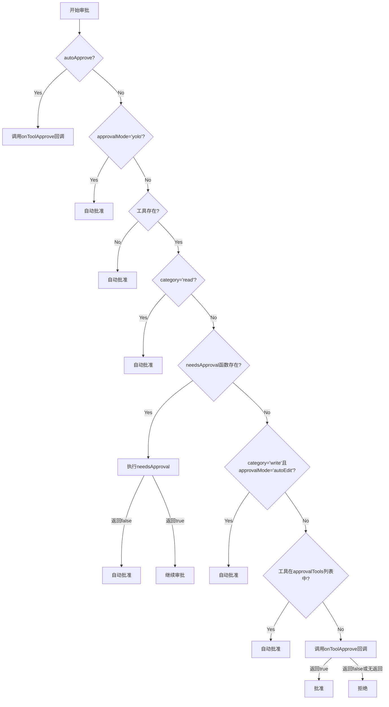

# 工具安全审批机制

<cite>
**本文档引用文件**  
- [frontend-workflow.ts](file://code-agent-backend/src/controller/code-agent/frontend-workflow.ts)
- [frontend-workflow.service.ts](file://code-agent-backend/src/service/code-agent/frontend-workflow.ts)
- [project.ts](file://fta-agent-core/src/project.ts)
- [tool.ts](file://fta-agent-core/src/tool.ts)
- [write.ts](file://fta-agent-core/src/tools/write.ts)
- [auth.ts](file://code-agent-backend/src/middleware/auth.ts)
- [frontend-workflow-api.md](file://code-agent-backend/docs/frontend-workflow-api.md)
- [TechnicalPage.tsx](file://fta-layout-design/src/pages/TechnicalPage.tsx)
</cite>

## 目录
1. [引言](#引言)
2. [审批机制设计原理](#审批机制设计原理)
3. [敏感操作审批流程](#敏感操作审批流程)
4. [审批状态存储与TTL控制](#审批状态存储与ttl控制)
5. [拒绝后的回滚处理](#拒绝后的回滚处理)
6. [前端工作流控制器集成](#前端工作流控制器集成)
7. [多层级权限校验](#多层级权限校验)
8. [审批日志审计](#审批日志审计)
9. [异常行为检测](#异常行为检测)
10. [安全策略配置指南](#安全策略配置指南)
11. [结论](#结论)

## 引言

本系统设计了一套完整的工具安全审批机制，用于在执行敏感操作前确保用户确认。该机制通过发布/订阅模式实现，涵盖了文件写入、系统命令执行等高风险操作的审批流程。系统实现了审批状态的存储、时效性控制（TTL）以及拒绝后的回滚处理，确保了操作的安全性和可追溯性。

**Section sources**
- [frontend-workflow-api.md](file://code-agent-backend/docs/frontend-workflow-api.md#L1-L280)

## 审批机制设计原理

系统采用分层架构设计，将审批机制分为前端控制器、后端服务和核心工具层。前端工作流控制器负责接收用户请求并建立SSE（Server-Sent Events）连接，后端服务层处理业务逻辑，核心工具层实现具体的工具执行和审批逻辑。

审批机制基于发布/订阅模式实现，当需要执行敏感操作时，系统会发布`tool_approve`事件，等待前端订阅并返回审批结果。这种设计实现了关注点分离，使审批逻辑与业务逻辑解耦。



**Diagram sources**
- [frontend-workflow.ts](file://code-agent-backend/src/controller/code-agent/frontend-workflow.ts#L278-L286)
- [frontend-workflow.service.ts](file://code-agent-backend/src/service/code-agent/frontend-workflow.ts#L74-L278)

**Section sources**
- [frontend-workflow.ts](file://code-agent-backend/src/controller/code-agent/frontend-workflow.ts#L27-L368)
- [frontend-workflow.service.ts](file://code-agent-backend/src/service/code-agent/frontend-workflow.ts#L48-L373)

## 敏感操作审批流程

系统对敏感操作实施严格的审批流程，主要针对文件写入、系统命令执行等高风险操作。审批流程基于工具的分类和配置，通过`onToolApprove`回调函数实现。

在`frontend-workflow.controller.ts`中，`onToolApprove`回调被定义为自动批准所有工具调用：

```typescript
onToolApprove: async (opts) => {
  const { toolUse, category } = opts;
  console.log(`frontend-workflow: [${sessionId}] 🔧 工具调用审批: toolName=${toolUse.name}, callId=${toolUse.callId}, category=${category}`);
  // 自动批准所有工具调用
  return true;
}
```

然而，在核心的`handleToolApproval`函数中，系统实现了更复杂的审批逻辑：



**Diagram sources**
- [project.ts](file://fta-agent-core/src/project.ts#L258-L308)
- [tool.ts](file://fta-agent-core/src/tool.ts#L207-L274)

**Section sources**
- [project.ts](file://fta-agent-core/src/project.ts#L258-L308)
- [tool.ts](file://fta-agent-core/src/tool.ts#L207-L274)

## 审批状态存储与TTL控制

系统通过多种机制实现审批状态的存储和时效性控制。审批状态主要存储在会话配置中，通过`SessionConfigManager`进行管理。

审批状态的时效性控制通过以下方式实现：
1. **会话级配置**：每个会话都有独立的配置，包含审批模式和工具列表
2. **内存映射**：使用`Map`数据结构存储待处理的工具调用，包含时间戳信息
3. **超时机制**：为每个工具调用设置60秒的超时时间

在`FrontendWorkflowController`中，系统使用静态`Map`存储待处理的工具调用：

```typescript
private static pendingToolCalls = new Map<
  string,
  {
    resolve: (value: any) => void;
    reject: (reason?: any) => void;
    timestamp: number;
    sessionId: string;
  }
>();
```

同时，系统还维护了会话与调用ID的映射关系：

```typescript
private static sessionCallIds = new Map<string, Set<string>>();
```

这些机制共同确保了审批状态的有效管理和时效性控制。

**Section sources**
- [frontend-workflow.ts](file://code-agent-backend/src/controller/code-agent/frontend-workflow.ts#L35-L43)
- [session.ts](file://fta-agent-core/src/session.ts#L70-L116)

## 拒绝后的回滚处理

当审批被拒绝时，系统实施严格的回滚处理机制，确保系统状态的一致性和数据的完整性。回滚处理主要通过以下方式实现：

1. **Promise拒绝**：当审批被拒绝时，系统会拒绝对应的Promise，阻止后续操作的执行
2. **资源清理**：清理已分配的资源，包括文件句柄、网络连接等
3. **状态恢复**：恢复到操作前的状态，确保系统一致性

在`handleToolResult`方法中，系统根据`ToolResult`的`isError`字段决定是resolve还是reject：

```typescript
if (toolResult.isError) {
  // 错误情况：从 llmContent 提取错误信息
  const errorMessage =
    typeof toolResult.llmContent === 'string' ? toolResult.llmContent : JSON.stringify(toolResult.llmContent);
  pending.reject(new Error(errorMessage));
} else {
  // 成功情况：resolve ToolResult 对象
  pending.resolve(toolResult);
}
```

此外，在`finally`块中，系统会清理所有待处理的工具调用，防止内存泄漏：

```typescript
// 清理该 session 的所有待处理工具调用，防止内存泄漏
const sessionCalls = FrontendWorkflowController.sessionCallIds.get(sessionId);
if (sessionCalls) {
  const callIdsToClean = Array.from(sessionCalls);
  for (const callId of callIdsToClean) {
    const pending = FrontendWorkflowController.pendingToolCalls.get(callId);
    if (pending) {
      // Reject with abort error to signal the tool call was cancelled
      pending.reject(new Error('Tool call cancelled: workflow aborted or error occurred'));
      FrontendWorkflowController.pendingToolCalls.delete(callId);
    }
  }
  FrontendWorkflowController.sessionCallIds.delete(sessionId);
}
```

**Section sources**
- [frontend-workflow.ts](file://code-agent-backend/src/controller/code-agent/frontend-workflow.ts#L49-L80)
- [frontend-workflow.ts](file://code-agent-backend/src/controller/code-agent/frontend-workflow.ts#L345-L364)

## 前端工作流控制器集成

前端工作流控制器是审批机制的关键组件，负责协调前端界面与后端服务之间的交互。控制器通过SSE（Server-Sent Events）实现实时通信，确保审批请求能够及时传递给用户。

控制器的主要职责包括：
1. **接收请求**：接收前端发起的工作流请求
2. **建立SSE连接**：设置SSE响应头，建立长连接
3. **事件分发**：将各种事件通过SSE推送给前端
4. **结果处理**：处理工作流执行结果并返回给前端

在`startFrontendWorkflow`方法中，控制器设置了SSE响应头：

```typescript
// 设置 SSE 响应头
this.ctx.status = 200;
this.ctx.set('Content-Type', 'text/event-stream; charset=utf-8');
this.ctx.set('Cache-Control', 'no-cache');
this.ctx.set('Connection', 'keep-alive');
```

同时，控制器定义了SSE事件发送辅助函数：

```typescript
const sendSSE = (event: string, data: any) => {
  const payload = JSON.stringify(data);
  res.write(`event: ${event}\ndata: ${payload}\n\n`);
};
```

**Section sources**
- [frontend-workflow.ts](file://code-agent-backend/src/controller/code-agent/frontend-workflow.ts#L83-L368)

## 多层级权限校验

系统实现了多层级的权限校验机制，确保只有授权用户才能执行敏感操作。权限校验分为以下几个层级：

1. **身份认证**：通过SSO（单点登录）验证用户身份
2. **角色权限**：基于用户角色进行权限控制
3. **项目权限**：检查用户对特定项目的访问权限
4. **操作权限**：根据操作类型进行细粒度权限控制

在`auth.ts`中间件中，系统实现了身份认证逻辑：

```typescript
async function authValidate(ctx: Context): Promise<void> {
  const authConfig = getAuthConfig();
  let user: User | null = null;

  // 尝试从自定义 header 获取 cookies
  if (!user) {
    const passport = getCookieFromHeader(ctx, authConfig.cookieName);
    user = await tryAuthFromSource(ctx, passport, authConfig.ssoHost, '自定义 header');
  }

  // 尝试使用 Cookie 鉴权
  if (!user) {
    const passport = getCookieFromRequest(ctx, authConfig.cookieName);
    user = await tryAuthFromSource(ctx, passport, authConfig.ssoHost, 'Cookie');
  }

  // 本地开发模式
  if (!user && process.env.NODE_ENV === 'local') {
    user = {
      id: '1048906',
      jobNumber: '1000000',
      name: '测试用户',
    };
  }

  // 验证用户信息
  if (!user || !user.id) {
    throw new Error('Unauthorized');
  }

  // 将用户信息设置到 context 中
  ctx.state.user = user;
}
```

对于项目级别的权限校验，系统通过`ProjectService`检查用户对特定项目的访问权限：

```typescript
// 从 page 获取 projectId
const page = await this.projectService.findPage({ pageId });
if (page?.projectId) {
  const [models, apis] = await Promise.all([
    this.dataModelService.getByProjectId(page.projectId),
    this.restApiService.getByProjectId(page.projectId),
  ]);
  dataModels = models;
  restApis = apis;
}
```

**Section sources**
- [auth.ts](file://code-agent-backend/src/middleware/auth.ts#L1-L194)
- [frontend-workflow.service.ts](file://code-agent-backend/src/service/code-agent/frontend-workflow.ts#L130-L147)

## 审批日志审计

系统实现了全面的审批日志审计功能，确保所有审批操作都有据可查。日志审计主要包括以下几个方面：

1. **操作日志**：记录所有工具调用的详细信息
2. **审批日志**：记录审批请求和响应的完整过程
3. **错误日志**：记录审批过程中发生的错误
4. **性能日志**：记录审批操作的执行时间和资源消耗

在`frontend-workflow.controller.ts`中，系统记录了详细的日志信息：

```typescript
console.log(`frontend-workflow: [${sessionId}] 🚀 前端工作流开始启动`);
console.log(`frontend-workflow: [${sessionId}] 📋 请求参数: designDocId=${designDocId}, productName=${productName}`);
console.log(`frontend-workflow: [${sessionId}] 🔧 工具调用审批: toolName=${toolUse.name}, callId=${toolUse.callId}, category=${category}`);
console.log(`frontend-workflow: [${sessionId}] ✅ 工作流执行完成 (总耗时: ${(totalDuration / 1000).toFixed(2)}秒)`);
```

同时，系统通过SSE事件将关键日志信息推送给前端：

```typescript
sendSSE('tool_approve', {
  toolName: toolUse.name,
  callId: toolUse.callId,
  params: toolUse.params,
  category: category,
});
```

日志文件存储在`files-cache/frontend-projects/{sessionId}/`目录下，便于后续审计和分析。

**Section sources**
- [frontend-workflow.ts](file://code-agent-backend/src/controller/code-agent/frontend-workflow.ts#L92-L95)
- [frontend-workflow-api.md](file://code-agent-backend/docs/frontend-workflow-api.md#L240-L242)

## 异常行为检测

系统内置了异常行为检测机制，用于识别和防范潜在的安全威胁。异常行为检测主要包括以下几个方面：

1. **频率检测**：检测短时间内频繁的审批请求
2. **模式识别**：识别异常的操作模式和行为序列
3. **权限越界**：检测用户尝试访问未授权资源的行为
4. **数据泄露**：检测敏感数据的异常访问和传输

在`handleToolApproval`函数中，系统通过多层次的条件判断来防止异常行为：

```typescript
if (tool.approval?.category === 'read') {
  return true;
}
```

对于写操作，系统实施更严格的检查：

```typescript
if (tool.approval?.category === 'write') {
  if (sessionConfigManager.config.approvalMode === 'autoEdit' || approvalMode === 'autoEdit') {
    return true;
  }
}
```

此外，系统还通过超时机制防止长时间挂起的审批请求：

```typescript
const timeoutId = setTimeout(() => {
  if (FrontendWorkflowController.pendingToolCalls.has(callId)) {
    FrontendWorkflowController.pendingToolCalls.delete(callId);
    reject(new Error('Tool execution timeout'));
  }
}, 60000);
```

**Section sources**
- [project.ts](file://fta-agent-core/src/project.ts#L276-L277)
- [frontend-workflow.ts](file://code-agent-backend/src/controller/code-agent/frontend-workflow.ts#L177-L190)

## 安全策略配置指南

系统提供了灵活的安全策略配置选项，允许管理员根据实际需求调整审批机制的行为。安全策略主要通过以下方式配置：

1. **环境变量**：通过环境变量设置全局安全策略
2. **会话配置**：在会话级别覆盖全局策略
3. **项目配置**：在项目级别定义特定的安全规则

关键的安全配置项包括：

- `approvalMode`：审批模式，可选值包括`yolo`（自动批准）、`autoEdit`（自动编辑）等
- `approvalTools`：需要特殊审批的工具列表
- `MODEL_NAME`：主模型名称
- `PLAN_MODEL_NAME`：规划模型名称

在`frontend-workflow-api.md`文档中，列出了需要配置的环境变量：

```markdown
需要配置环境变量：
- `MODEL_NAME`: 主模型名称
- `PLAN_MODEL_NAME`: 规划模型名称（可选）
- `CODE_AGENT_VERSION`: 版本号（可选）
```

管理员可以通过修改配置文件或设置环境变量来调整安全策略，例如：

```typescript
const finalApiKey = apiKey || this.modelConfig?.apiKey;
const finalBaseURL = baseURL || this.modelConfig?.baseURL;
const finalModel = model || this.modelConfig?.model;
```

**Section sources**
- [frontend-workflow-api.md](file://code-agent-backend/docs/frontend-workflow-api.md#L243-L246)
- [frontend-workflow.service.ts](file://code-agent-backend/src/service/code-agent/frontend-workflow.ts#L79-L81)

## 结论

本系统设计了一套完整的工具安全审批机制，通过分层架构和发布/订阅模式实现了敏感操作的用户确认流程。系统具备完善的审批状态存储、时效性控制和回滚处理能力，确保了操作的安全性和可靠性。

通过多层级权限校验和异常行为检测，系统能够有效防范未授权访问和潜在的安全威胁。详细的审批日志审计功能为安全事件的追溯和分析提供了有力支持。

灵活的安全策略配置选项使系统能够适应不同的安全需求和使用场景，为用户提供了一个安全、可靠的工作流执行环境。