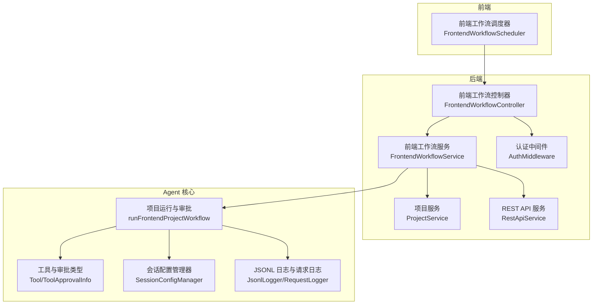
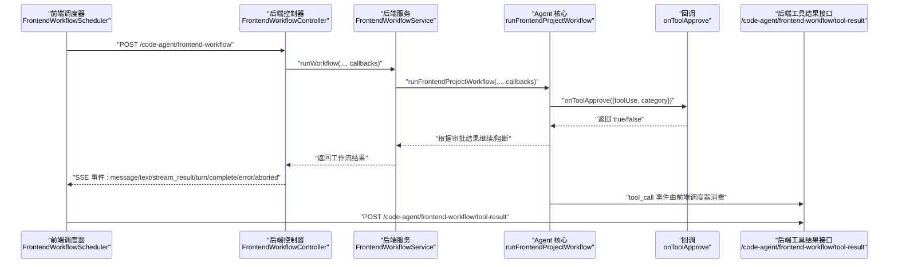
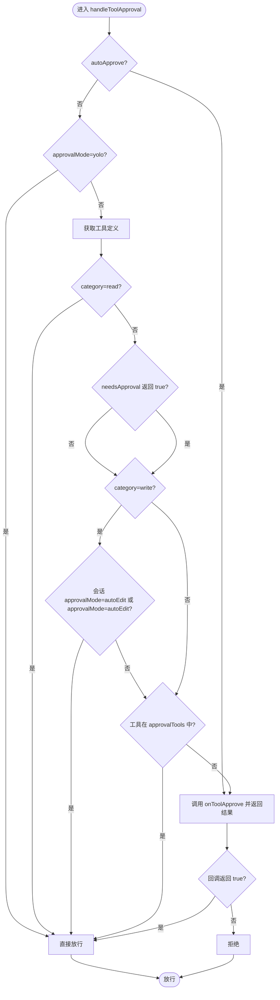
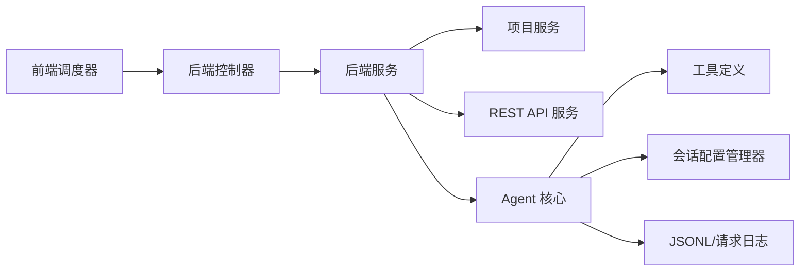

# 权限校验机制

<cite>
**本文引用的文件**
- [前端工作流控制器](file://code-agent-backend/src/controller/code-agent/frontend-workflow.ts)
- [前端工作流服务](file://code-agent-backend/src/service/code-agent/frontend-workflow.ts)
- [认证中间件](file://code-agent-backend/src/middleware/auth.ts)
- [项目服务](file://code-agent-backend/src/service/code-agent/project.ts)
- [REST API 服务](file://code-agent-backend/src/service/code-agent/rest-api.ts)
- [前端工作流 DTO](file://code-agent-backend/src/dto/code-agent/frontend-workflow.dto.ts)
- [前端工作流调度器](file://fta-layout-design/src/pages/EditorPage/services/FrontendWorkflowScheduler.ts)
- [Agent 核心项目运行与审批](file://fta-agent-core/src/project.ts)
- [工具与审批类型定义](file://fta-agent-core/src/tool.ts)
- [会话配置管理器](file://fta-agent-core/src/session.ts)
- [JSONL 日志与请求日志](file://fta-agent-core/src/jsonl.ts)
- [前端工作流日志查看器](file://code-agent-backend/tools/frontend-workflow-log-viewer.html)
</cite>

## 目录
1. [引言](#引言)
2. [项目结构](#项目结构)
3. [核心组件](#核心组件)
4. [架构总览](#架构总览)
5. [详细组件分析](#详细组件分析)
6. [依赖关系分析](#依赖关系分析)
7. [性能考量](#性能考量)
8. [故障排查指南](#故障排查指南)
9. [结论](#结论)
10. [附录](#附录)

## 引言
本文件聚焦于“工具审批中的多层级权限校验机制”，围绕以下目标展开：
- 解释项目所有者、团队管理员等角色在审批流程中的权限边界与校验逻辑；
- 说明如何通过 ProjectTaskCallbacks 中的 onToolApprove 回调实现访问控制；
- 结合前端工作流服务中的权限判断代码，阐述 RBAC 模型的具体实现方式；
- 提供权限策略配置示例、越权操作拦截机制与安全审计日志集成方案。

## 项目结构
本项目采用前后端分离与多模块协作的结构：
- 后端（MidwayJS）负责鉴权、业务服务与工作流编排；
- 前端（React + Ant Design）负责发起工作流、接收事件与工具调用；
- Agent 核心（fta-agent-core）负责工作流引擎、工具注册与审批决策；
- 日志与审计通过 JSONL 文件与专用日志查看器进行落地与可视化。

图表来源
- [前端工作流调度器](file://fta-layout-design/src/pages/EditorPage/services/FrontendWorkflowScheduler.ts#L1-L120)
- [前端工作流控制器](file://code-agent-backend/src/controller/code-agent/frontend-workflow.ts#L1-L120)
- [前端工作流服务](file://code-agent-backend/src/service/code-agent/frontend-workflow.ts#L1-L120)
- [认证中间件](file://code-agent-backend/src/middleware/auth.ts#L1-L80)
- [项目服务](file://code-agent-backend/src/service/code-agent/project.ts#L1-L120)
- [REST API 服务](file://code-agent-backend/src/service/code-agent/rest-api.ts#L147-L238)
- [Agent 核心项目运行与审批](file://fta-agent-core/src/project.ts#L200-L309)
- [工具与审批类型定义](file://fta-agent-core/src/tool.ts#L195-L274)
- [JSONL 日志与请求日志](file://fta-agent-core/src/jsonl.ts#L1-L100)

章节来源
- [前端工作流控制器](file://code-agent-backend/src/controller/code-agent/frontend-workflow.ts#L1-L120)
- [前端工作流服务](file://code-agent-backend/src/service/code-agent/frontend-workflow.ts#L1-L120)
- [认证中间件](file://code-agent-backend/src/middleware/auth.ts#L1-L80)
- [Agent 核心项目运行与审批](file://fta-agent-core/src/project.ts#L200-L309)

## 核心组件
- 前端工作流控制器：负责接收请求、建立 SSE、封装 tool_proxy、注入回调（含 onToolApprove），并将结果通过 SSE 返回。
- 前端工作流服务：负责组装工作流上下文、调用核心引擎、包装回调以支持中断信号、格式化数据上下文。
- 认证中间件：基于环境变量选择 SSO 主机与 Cookie 名称，从自定义 Header、Cookie 或本地开发模式解析用户，并将用户信息写入上下文。
- 项目服务与 REST API 服务：提供项目维度的数据模型与 API 上下文，作为工作流输入的一部分；同时在查询时强制绑定当前用户 ID。
- Agent 核心审批逻辑：在 onToolApprove 回调中综合 autoApprove、approvalMode、工具类别与会话配置，决定是否放行工具调用。
- 前端工作流调度器：负责发起 SSE、解析事件、处理 tool_call、调用后端 /code-agent/frontend-workflow/tool-result 接口回传工具结果。

章节来源
- [前端工作流控制器](file://code-agent-backend/src/controller/code-agent/frontend-workflow.ts#L270-L368)
- [前端工作流服务](file://code-agent-backend/src/service/code-agent/frontend-workflow.ts#L170-L240)
- [认证中间件](file://code-agent-backend/src/middleware/auth.ts#L125-L194)
- [项目服务](file://code-agent-backend/src/service/code-agent/project.ts#L244-L343)
- [REST API 服务](file://code-agent-backend/src/service/code-agent/rest-api.ts#L147-L238)
- [Agent 核心项目运行与审批](file://fta-agent-core/src/project.ts#L231-L308)
- [前端工作流调度器](file://fta-layout-design/src/pages/EditorPage/services/FrontendWorkflowScheduler.ts#L289-L521)

## 架构总览
下面的序列图展示了从前端发起工作流到后端审批与工具执行的关键交互，以及 onToolApprove 的调用时机。

图表来源
- [前端工作流调度器](file://fta-layout-design/src/pages/EditorPage/services/FrontendWorkflowScheduler.ts#L289-L521)
- [前端工作流控制器](file://code-agent-backend/src/controller/code-agent/frontend-workflow.ts#L278-L309)
- [前端工作流服务](file://code-agent-backend/src/service/code-agent/frontend-workflow.ts#L174-L223)
- [Agent 核心项目运行与审批](file://fta-agent-core/src/project.ts#L231-L308)

## 详细组件分析

### 前端工作流控制器与回调注入
- 控制器通过 SSE 向前端推送事件，包括 message、text、stream_result、turn、complete、error、aborted。
- 在调用 runWorkflow 时，注入了包含 onToolApprove 的 callbacks 对象，用于在 Agent 核心发起工具审批时进行决策。
- onToolApprove 当前实现为自动批准所有工具调用，便于演示与快速验证；实际生产中应结合 RBAC 与审批策略进行细化。

章节来源
- [前端工作流控制器](file://code-agent-backend/src/controller/code-agent/frontend-workflow.ts#L278-L309)

### 前端工作流服务与中断信号
- 服务层在启动核心工作流前与回调阶段均检查 AbortSignal，若检测到中断则抛出 AbortError，确保资源及时释放与前端感知。
- 服务层还负责格式化数据上下文（数据模型与 REST API），并组合页面标注与数据上下文传递给核心引擎。

章节来源
- [前端工作流服务](file://code-agent-backend/src/service/code-agent/frontend-workflow.ts#L155-L223)
- [前端工作流服务](file://code-agent-backend/src/service/code-agent/frontend-workflow.ts#L281-L373)

### 认证中间件与用户上下文
- 中间件支持从自定义 Header（X-User-Cookies）、Cookie、或本地开发模式解析用户，并将用户信息写入 ctx.state.user 与 ctx.set('user-id')。
- 后续服务层通过 ctx.get('user-id') 或 ctx.state.user.id 获取当前用户 ID，用于数据隔离与权限约束。

章节来源
- [认证中间件](file://code-agent-backend/src/middleware/auth.ts#L125-L194)
- [项目服务](file://code-agent-backend/src/service/code-agent/project.ts#L45-L55)

### 项目与 REST API 服务的用户绑定
- 项目与 REST API 查询/更新/删除均强制绑定当前用户 ID，确保每个操作仅作用于当前登录用户的资源。
- 这为后续 RBAC 实现提供了基础：当引入角色字段时，可在这些服务层增加角色校验。

章节来源
- [项目服务](file://code-agent-backend/src/service/code-agent/project.ts#L244-L343)
- [REST API 服务](file://code-agent-backend/src/service/code-agent/rest-api.ts#L147-L238)

### Agent 核心审批逻辑与 onToolApprove
- onToolApprove 由 Agent 核心在工具使用前触发，核心逻辑如下：
  - 若 autoApprove 为真，直接调用回调并默认放行；
  - 若 approvalMode 为 yolo，直接放行；
  - 若工具类别为 read，直接放行；
  - 若工具声明 needsApproval 且返回 true，则进入后续审批流程；
  - 若工具类别为 write，且会话配置 approvalMode 为 autoEdit 或 approvalMode 为 autoEdit，则放行；
  - 若工具在 approvalTools 白名单中，则放行；
  - 否则调用回调 onToolApprove，若回调返回 true 则放行，否则拒绝。

图表来源
- [Agent 核心项目运行与审批](file://fta-agent-core/src/project.ts#L258-L308)
- [工具与审批类型定义](file://fta-agent-core/src/tool.ts#L224-L230)

章节来源
- [Agent 核心项目运行与审批](file://fta-agent-core/src/project.ts#L231-L308)
- [工具与审批类型定义](file://fta-agent-core/src/tool.ts#L195-L274)

### 前端工作流调度器与工具调用
- 调度器通过 SSE 接收 tool_call 事件，解析工具名与参数，调用后端 /code-agent/frontend-workflow/tool-result 接口回传工具执行结果。
- 对特殊工具（如 todoWrite/todoRead）有专门的结果格式化逻辑；对普通工具统一将执行结果序列化为字符串。

章节来源
- [前端工作流调度器](file://fta-layout-design/src/pages/EditorPage/services/FrontendWorkflowScheduler.ts#L289-L521)
- [前端工作流控制器](file://code-agent-backend/src/controller/code-agent/frontend-workflow.ts#L48-L81)

### RBAC 模型与角色边界
- 当前代码未显式定义角色字段（如 owner、admin）。但通过以下机制可自然扩展：
  - 用户绑定：认证中间件将用户 ID 写入上下文，项目/资源 CRUD 默认绑定 userId；
  - 工具审批：Agent 核心的审批逻辑可通过 onToolApprove 回调接入角色判断；
  - 会话配置：SessionConfigManager 支持按会话粒度配置 approvalMode 与 approvalTools，可用于不同角色的差异化策略。

建议的角色边界（概念性说明）：
- 项目所有者：拥有项目完全控制权，可绕过多数审批限制；
- 团队管理员：可对项目内资源进行管理，但对写类工具仍需审批；
- 普通成员：仅可读取与有限写入，写类工具必须经审批。

章节来源
- [认证中间件](file://code-agent-backend/src/middleware/auth.ts#L125-L194)
- [项目服务](file://code-agent-backend/src/service/code-agent/project.ts#L244-L343)
- [Agent 核心项目运行与审批](file://fta-agent-core/src/project.ts#L258-L308)
- [会话配置管理器](file://fta-agent-core/src/session.ts#L70-L116)

### 权限策略配置示例
- approvalMode：
  - autoEdit：允许写类工具自动放行；
  - yolo：所有工具自动放行；
  - 其他：按工具类别与白名单策略决定。
- approvalTools：白名单工具无需审批即可放行；
- onToolApprove：在回调中加入角色判断与资源范围校验。

章节来源
- [Agent 核心项目运行与审批](file://fta-agent-core/src/project.ts#L258-L308)
- [会话配置管理器](file://fta-agent-core/src/session.ts#L70-L116)

### 越权操作拦截机制
- 用户绑定：所有资源操作均绑定 userId，避免越权访问；
- 工具审批：onToolApprove 返回 false 即可阻止工具执行；
- 中断保护：服务层在回调阶段检查 AbortSignal，确保前端断开时及时中止。

章节来源
- [项目服务](file://code-agent-backend/src/service/code-agent/project.ts#L244-L343)
- [前端工作流服务](file://code-agent-backend/src/service/code-agent/frontend-workflow.ts#L191-L219)
- [Agent 核心项目运行与审批](file://fta-agent-core/src/project.ts#L258-L308)

### 安全审计日志集成方案
- JSONL 日志：记录消息与元数据，便于回溯与审计；
- 请求日志：记录请求/响应与错误信息；
- 日志查看器：提供前端日志文件浏览与统计能力；
- 建议：在 onToolApprove 回调中记录审批决策与拒绝原因，形成完整的审计链路。

章节来源
- [JSONL 日志与请求日志](file://fta-agent-core/src/jsonl.ts#L1-L100)
- [前端工作流日志查看器](file://code-agent-backend/tools/frontend-workflow-log-viewer.html#L906-L918)

## 依赖关系分析
- 前端工作流调度器依赖后端控制器提供的 SSE 接口与工具结果回传接口；
- 后端控制器依赖认证中间件与前端工作流服务；
- 前端工作流服务依赖项目与 REST API 服务以构建数据上下文；
- Agent 核心依赖工具定义与会话配置管理器，最终通过回调与后端控制器交互。

图表来源
- [前端工作流调度器](file://fta-layout-design/src/pages/EditorPage/services/FrontendWorkflowScheduler.ts#L1-L120)
- [前端工作流控制器](file://code-agent-backend/src/controller/code-agent/frontend-workflow.ts#L1-L120)
- [前端工作流服务](file://code-agent-backend/src/service/code-agent/frontend-workflow.ts#L1-L120)
- [项目服务](file://code-agent-backend/src/service/code-agent/project.ts#L1-L120)
- [REST API 服务](file://code-agent-backend/src/service/code-agent/rest-api.ts#L147-L238)
- [Agent 核心项目运行与审批](file://fta-agent-core/src/project.ts#L200-L309)
- [工具与审批类型定义](file://fta-agent-core/src/tool.ts#L195-L274)
- [JSONL 日志与请求日志](file://fta-agent-core/src/jsonl.ts#L1-L100)

章节来源
- [前端工作流调度器](file://fta-layout-design/src/pages/EditorPage/services/FrontendWorkflowScheduler.ts#L1-L120)
- [前端工作流控制器](file://code-agent-backend/src/controller/code-agent/frontend-workflow.ts#L1-L120)
- [前端工作流服务](file://code-agent-backend/src/service/code-agent/frontend-workflow.ts#L1-L120)
- [项目服务](file://code-agent-backend/src/service/code-agent/project.ts#L1-L120)
- [REST API 服务](file://code-agent-backend/src/service/code-agent/rest-api.ts#L147-L238)
- [Agent 核心项目运行与审批](file://fta-agent-core/src/project.ts#L200-L309)
- [工具与审批类型定义](file://fta-agent-core/src/tool.ts#L195-L274)
- [JSONL 日志与请求日志](file://fta-agent-core/src/jsonl.ts#L1-L100)

## 性能考量
- SSE 事件解析与前端渲染：建议在前端侧对高频事件进行节流与批量处理，减少 UI 抖动。
- 工具调用并发：前端调度器对工具调用采用逐个处理与超时控制，避免阻塞；后端控制器对 tool_call 采用 Map 管理 callId，防止内存泄漏。
- 日志写入：JSONL 写入为追加写，建议在高并发场景下考虑异步落盘与缓冲策略。

[本节为通用指导，不涉及具体文件分析]

## 故障排查指南
- SSE 连接中断：前端调度器与后端控制器均对 AbortSignal 进行处理，若出现中断事件，检查前端中断按钮与网络状况。
- 工具调用失败：前端调度器在 handleToolCall 中捕获错误并构造 ToolResult，后端控制器在 /code-agent/frontend-workflow/tool-result 接口返回错误信息，建议查看 SSE error 事件与后端日志。
- 审批拒绝：若 onToolApprove 返回 false，Agent 核心将拒绝工具执行；可在回调中记录拒绝原因以便审计。

章节来源
- [前端工作流控制器](file://code-agent-backend/src/controller/code-agent/frontend-workflow.ts#L311-L366)
- [前端工作流调度器](file://fta-layout-design/src/pages/EditorPage/services/FrontendWorkflowScheduler.ts#L471-L521)
- [Agent 核心项目运行与审批](file://fta-agent-core/src/project.ts#L258-L308)

## 结论
本项目通过“认证中间件 + 服务层用户绑定 + Agent 核心审批回调”的组合，实现了对工具调用的多层级权限控制。当前 onToolApprove 默认放行，便于演示；在生产环境中，应结合 RBAC 模型与会话配置，将角色与资源范围纳入审批决策，同时完善审计日志与越权拦截机制，确保安全可控。

[本节为总结性内容，不涉及具体文件分析]

## 附录
- 前端工作流请求 DTO 字段说明（用于参数校验与文档生成）：
  - designDocId：设计文档 ID（必填）
  - productName：产品名称（可选）
  - srcTree：源目录树结构（可选）
  - apiKey/baseURL/model：模型相关参数（可选，优先使用）

章节来源
- [前端工作流 DTO](file://code-agent-backend/src/dto/code-agent/frontend-workflow.dto.ts#L1-L60)