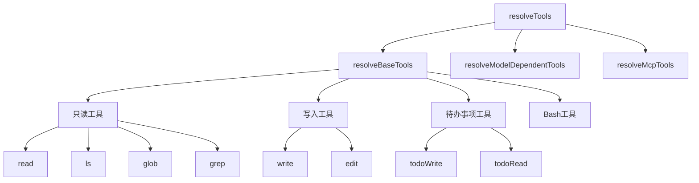
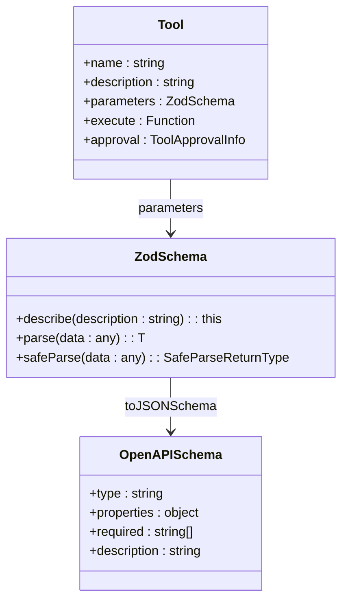
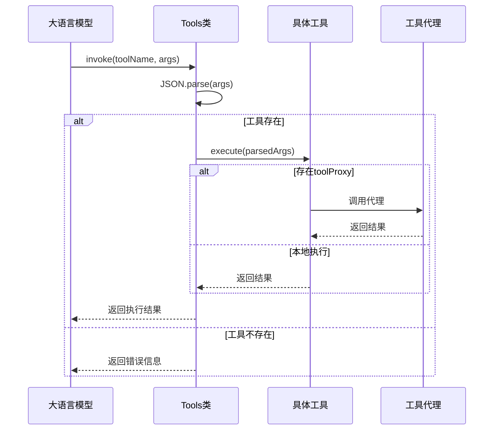
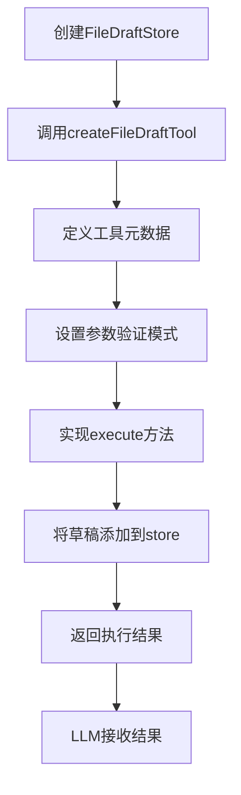

# 工具注册与管理

<cite>
**本文档引用的文件**
- [tool.ts](file://fta-agent-core/src/tool.ts)
- [read.ts](file://fta-agent-core/src/tools/read.ts)
- [write.ts](file://fta-agent-core/src/tools/write.ts)
- [todo.ts](file://fta-agent-core/src/tools/todo.ts)
- [fileDraft.ts](file://fta-agent-core/src/tools/fileDraft.ts)
- [edit.ts](file://fta-agent-core/src/tools/edit.ts)
- [context.ts](file://fta-agent-core/src/context.ts)
- [config.ts](file://fta-agent-core/src/config.ts)
</cite>

## 目录
1. [工具注册机制](#工具注册机制)
2. [工具元数据与OpenAPI Schema生成](#工具元数据与openapi-schema生成)
3. [工具生命周期与错误处理](#工具生命周期与错误处理)
4. [自定义工具开发示例](#自定义工具开发示例)

## 工具注册机制

Agent工具系统通过`tool.ts`中的`Tool`接口和`createTool`工厂函数实现工具的类型定义和实例化注册。系统采用分层注册策略，内置工具通过`resolveBaseTools`函数按功能模块进行注册，包括只读工具（read、ls、glob、grep）、写入工具（write、edit、rm）以及待办事项工具（todo）。

工具注册流程始于`resolveTools`函数，该函数通过`Promise.all`并行加载基础工具、模型依赖工具和MCP（Model Context Protocol）工具。基础工具的注册由`resolveBaseTools`函数控制，通过传入的`ResolveToolsOpts`配置对象决定是否启用写入、待办事项和Bash执行等高级功能。例如，当`opts.write`为true时，系统会注册`write`、`edit`和`rm`等写入工具。

待办事项工具的注册具有会话隔离特性，每个会话的待办事项存储在独立的JSON文件中，路径由`sessionId`确定。这种设计确保了多会话环境下的数据隔离和一致性。

**图示来源**
- [tool.ts](file://fta-agent-core/src/tool.ts#L28-L84)

**本节来源**
- [tool.ts](file://fta-agent-core/src/tool.ts#L28-L84)

## 工具元数据与OpenAPI Schema生成

工具的元数据（name、description、parameters）通过Zod库进行类型定义和参数校验。每个工具在创建时通过`createTool`函数定义其元数据，其中`parameters`字段使用Zod模式描述工具参数的结构和约束。例如，`read`工具的`file_path`参数被定义为字符串类型，并带有详细的描述信息。

系统通过`toLanguageV2Tools`方法将工具集合转换为符合OpenAI Function Calling规范的工具列表。该方法利用`z.toJSONSchema`将Zod模式转换为OpenAPI Schema格式，从而生成LLM可理解的工具描述。生成的Schema包含参数类型、必填性、描述等元信息，使LLM能够正确理解工具的使用方式。

工具描述长度受环境变量`TOOL_DESCRIPTION_LIMIT`限制，系统会自动截断过长的描述以适应不同LLM提供商的限制。这种设计确保了工具描述在不同LLM平台上的兼容性。

**图示来源**
- [tool.ts](file://fta-agent-core/src/tool.ts#L207-L215)
- [read.ts](file://fta-agent-core/src/tools/read.ts#L89-L101)

**本节来源**
- [tool.ts](file://fta-agent-core/src/tool.ts#L142-L164)
- [read.ts](file://fta-agent-core/src/tools/read.ts#L89-L101)

## 工具生命周期与错误处理

工具的生命周期管理通过`Tools`类实现，该类提供工具的注册、查询和调用功能。`invoke`方法负责工具的执行，首先通过`JSON.parse`解析参数，然后调用对应工具的`execute`方法。系统实现了完善的错误边界处理，包括参数解析失败、工具未找到等异常情况的捕获和处理。

日志追踪通过`returnDisplay`字段实现，该字段定义了工具执行结果的可视化格式。例如，`write`工具返回`diff_viewer`类型的结果，显示文件修改前后的差异；`todo`工具返回`todo_read`或`todo_write`类型的结果，展示待办事项列表的变化。这种设计使用户能够直观地理解工具执行的效果。

工具执行支持代理模式，当`toolProxy`存在时，工具调用会被转发到前端执行。这种设计实现了前后端的解耦，使工具可以在不同环境中灵活部署。

**图示来源**
- [tool.ts](file://fta-agent-core/src/tool.ts#L114-L140)
- [write.ts](file://fta-agent-core/src/tools/write.ts#L21-L32)

**本节来源**
- [tool.ts](file://fta-agent-core/src/tool.ts#L114-L140)
- [write.ts](file://fta-agent-core/src/tools/write.ts#L21-L32)

## 自定义工具开发示例

开发自定义工具需要遵循以下规范：首先使用Zod定义工具参数的验证模式，然后通过`createTool`工厂函数创建工具实例。工具的`execute`方法必须返回符合`ToolResult`类型的响应，包含`llmContent`和可选的`returnDisplay`字段。

参数校验在工具执行前自动完成，开发者无需手动验证参数。异步执行通过`async/await`语法实现，确保工具能够处理耗时操作。结果序列化遵循统一规范，文本内容通过`safeStringify`函数序列化，二进制内容（如图片）转换为Base64编码。

以下是一个文件草稿工具的开发示例，该工具用于登记即将生成的文件或目录：

**图示来源**
- [fileDraft.ts](file://fta-agent-core/src/tools/fileDraft.ts#L28-L64)

**本节来源**
- [fileDraft.ts](file://fta-agent-core/src/tools/fileDraft.ts#L28-L64)
- [tool.ts](file://fta-agent-core/src/tool.ts#L258-L274)