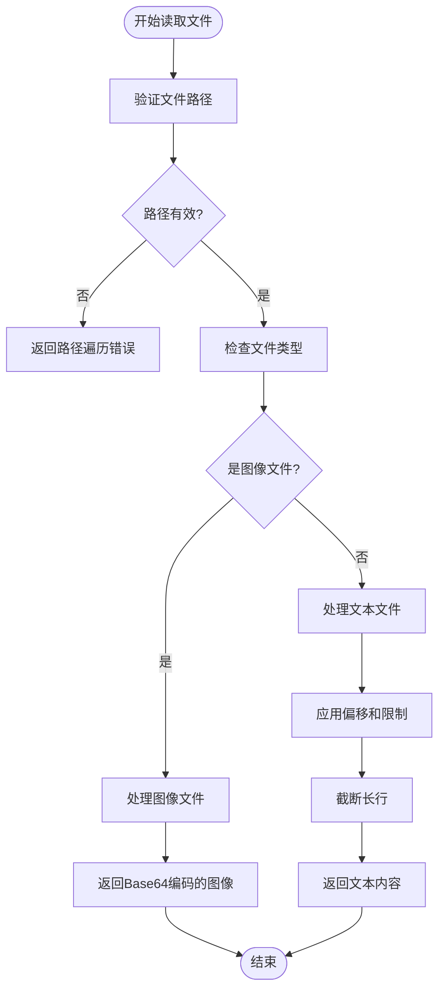
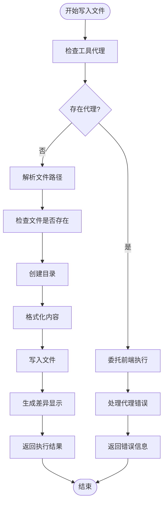
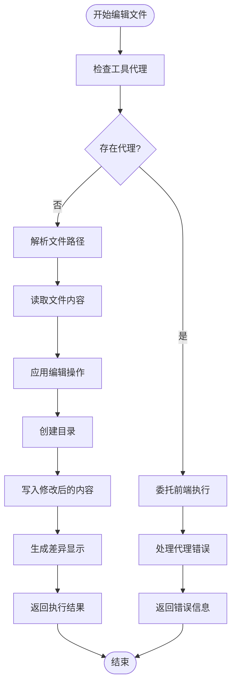
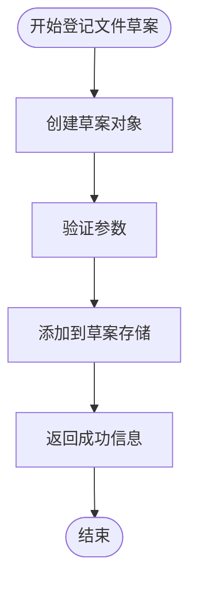
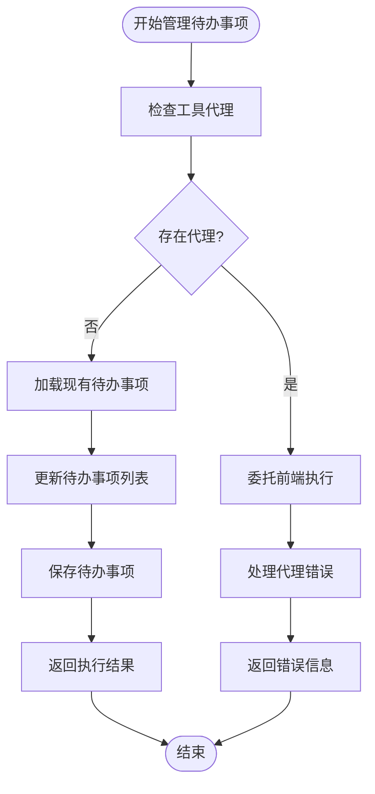
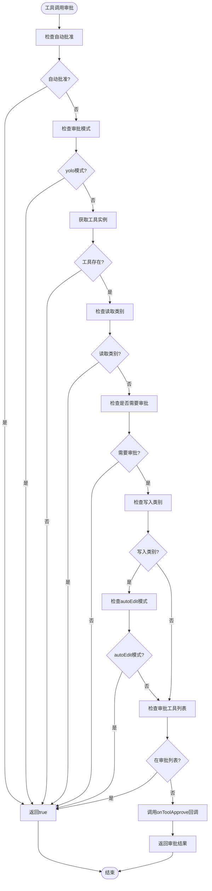
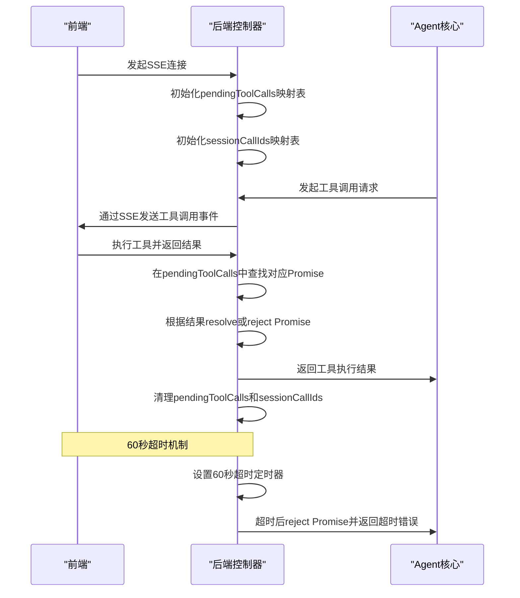
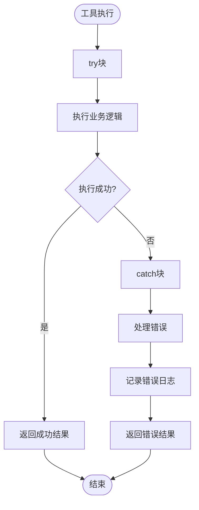
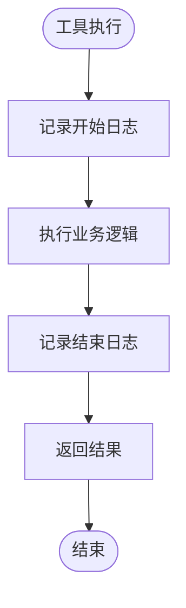

# 工具系统与执行

<cite>
**本文档引用的文件**   
- [tool.ts](file://fta-agent-core/src/tool.ts)
- [read.ts](file://fta-agent-core/src/tools/read.ts)
- [write.ts](file://fta-agent-core/src/tools/write.ts)
- [edit.ts](file://fta-agent-core/src/tools/edit.ts)
- [fileDraft.ts](file://fta-agent-core/src/tools/fileDraft.ts)
- [todo.ts](file://fta-agent-core/src/tools/todo.ts)
- [project.ts](file://fta-agent-core/src/project.ts)
- [loop.ts](file://fta-agent-core/src/loop.ts)
- [context.ts](file://fta-agent-core/src/context.ts)
- [backgroundTaskManager.ts](file://fta-agent-core/src/backgroundTaskManager.ts)
- [frontend-workflow.ts](file://code-agent-backend/src/controller/code-agent/frontend-workflow.ts)
- [session.ts](file://fta-agent-core/src/session.ts)
</cite>

## 目录
1. [工具系统架构](#工具系统架构)
2. [内置工具详解](#内置工具详解)
3. [工具执行流程](#工具执行流程)
4. [工具审批机制](#工具审批机制)
5. [异步工具调用与超时管理](#异步工具调用与超时管理)
6. [自定义工具开发指南](#自定义工具开发指南)

## 工具系统架构

工具系统是Agent的核心组件，负责管理所有内置和外部工具的注册、调用和执行。系统通过`Tools`类统一管理所有工具实例，并提供类型安全的工具调用接口。

```mermaid
classDiagram
class Tools {
+tools : Record<string, Tool>
+constructor(tools : Tool[])
+get(toolName : string) : Tool
+length() : number
+invoke(toolName : string, args : string) : Promise<ToolResult>
+toLanguageV2Tools() : LanguageModelV2FunctionTool[]
}
class Tool {
+name : string
+description : string
+getDescription? : ({ params, cwd } : { params : z.output<TSchema>; cwd : string }) => string
+displayName? : string
+execute : (params : z.output<TSchema>) => Promise<ToolResult> | ToolResult
+approval? : ToolApprovalInfo
+parameters : TSchema
}
class ToolResult {
+llmContent : string | (TextPart | ImagePart)[]
+returnDisplay? : ReturnDisplay
+isError? : boolean
}
class ToolUse {
+name : string
+params : Record<string, any>
+callId : string
}
Tools "1" *-- "0..*" Tool : 包含
Tool --> ToolResult : 执行返回
ToolUse --> Tool : 调用
```

**Diagram sources**
- [tool.ts](file://fta-agent-core/src/tool.ts#L97-L275)

**Section sources**
- [tool.ts](file://fta-agent-core/src/tool.ts#L1-L275)

## 内置工具详解

### 读取工具 (read)
读取工具允许Agent从本地文件系统读取文件内容，支持文本和图像文件的读取。



**Diagram sources**
- [read.ts](file://fta-agent-core/src/tools/read.ts#L72-L204)

**Section sources**
- [read.ts](file://fta-agent-core/src/tools/read.ts#L1-L204)

### 写入工具 (write)
写入工具允许Agent向本地文件系统写入文件，支持创建新文件或覆盖现有文件。



**Diagram sources**
- [write.ts](file://fta-agent-core/src/tools/write.ts#L6-L74)

**Section sources**
- [write.ts](file://fta-agent-core/src/tools/write.ts#L1-L74)

### 编辑工具 (edit)
编辑工具允许Agent对现有文件进行精确编辑，通过查找和替换的方式修改文件内容。



**Diagram sources**
- [edit.ts](file://fta-agent-core/src/tools/edit.ts#L7-L76)

**Section sources**
- [edit.ts](file://fta-agent-core/src/tools/edit.ts#L1-L76)

### 文件草案工具 (fileDraft)
文件草案工具用于登记即将生成的文件或目录，供服务端在会话结束后真正落地。



**Diagram sources**
- [fileDraft.ts](file://fta-agent-core/src/tools/fileDraft.ts#L28-L65)

**Section sources**
- [fileDraft.ts](file://fta-agent-core/src/tools/fileDraft.ts#L1-L65)

### 待办事项工具 (todo)
待办事项工具用于创建和管理结构化的任务列表，帮助跟踪复杂任务的进度。



**Diagram sources**
- [todo.ts](file://fta-agent-core/src/tools/todo.ts#L219-L336)

**Section sources**
- [todo.ts](file://fta-agent-core/src/tools/todo.ts#L1-L336)

## 工具执行流程

工具执行流程是Agent与LLM交互的核心环节，从LLM输出解析工具调用到执行结果返回，形成完整的闭环。

```mermaid
sequenceDiagram
participant LLM as "LLM"
participant Loop as "循环处理器"
participant Tools as "工具管理器"
participant Tool as "具体工具"
LLM->>Loop : 输出工具调用
Loop->>Loop : 解析工具调用参数
Loop->>Loop : 调用onToolUse回调
Loop->>Loop : 请求工具审批
Loop->>Tools : 调用invoke方法
Tools->>Tool : 执行具体工具
Tool->>Tool : 执行业务逻辑
Tool-->>Tools : 返回执行结果
Tools-->>Loop : 返回工具结果
Loop->>Loop : 调用onToolResult回调
Loop->>Loop : 将结果添加到历史记录
Loop->>LLM : 发送工具执行结果
```

**Diagram sources**
- [loop.ts](file://fta-agent-core/src/loop.ts#L432-L468)
- [project.ts](file://fta-agent-core/src/project.ts#L231-L240)

**Section sources**
- [loop.ts](file://fta-agent-core/src/loop.ts#L1-L532)
- [project.ts](file://fta-agent-core/src/project.ts#L248-L308)

## 工具审批机制

工具审批机制是系统安全控制的核心，通过多层策略确保工具调用的安全性和可控性。



**Diagram sources**
- [project.ts](file://fta-agent-core/src/project.ts#L258-L308)

**Section sources**
- [project.ts](file://fta-agent-core/src/project.ts#L248-L308)
- [tool.ts](file://fta-agent-core/src/tool.ts#L224-L229)

## 异步工具调用与超时管理

异步工具调用通过后端控制器中的pendingToolCalls映射表实现，结合60秒超时机制确保系统的响应性和稳定性。



**Diagram sources**
- [frontend-workflow.ts](file://code-agent-backend/src/controller/code-agent/frontend-workflow.ts#L35-L189)

**Section sources**
- [frontend-workflow.ts](file://code-agent-backend/src/controller/code-agent/frontend-workflow.ts#L1-L288)
- [session.ts](file://fta-agent-core/src/session.ts#L62-L116)

## 自定义工具开发指南

### 接口规范
自定义工具需要遵循统一的接口规范，确保与系统其他组件的兼容性。

```mermaid
classDiagram
class Tool {
<<interface>>
+name : string
+description : string
+getDescription? : ({ params, cwd } : { params : z.output<TSchema>; cwd : string }) => string
+displayName? : string
+execute : (params : z.output<TSchema>) => Promise<ToolResult> | ToolResult
+approval? : ToolApprovalInfo
+parameters : TSchema
}
class ToolResult {
+llmContent : string | (TextPart | ImagePart)[]
+returnDisplay? : ReturnDisplay
+isError? : boolean
}
class ToolApprovalInfo {
+needsApproval? : (context : ApprovalContext) => Promise<boolean> | boolean
+category? : ApprovalCategory
}
Tool --> ToolResult : execute返回
Tool --> ToolApprovalInfo : 包含
```

**Diagram sources**
- [tool.ts](file://fta-agent-core/src/tool.ts#L207-L275)

### 错误处理
自定义工具需要实现完善的错误处理机制，确保异常情况下的系统稳定性。



**Diagram sources**
- [write.ts](file://fta-agent-core/src/tools/write.ts#L35-L60)
- [read.ts](file://fta-agent-core/src/tools/read.ts#L123-L197)

### 日志集成
自定义工具需要集成系统日志，便于调试和监控。



**Section sources**
- [tool.ts](file://fta-agent-core/src/tool.ts#L258-L275)
- [context.ts](file://fta-agent-core/src/context.ts#L53-L55)