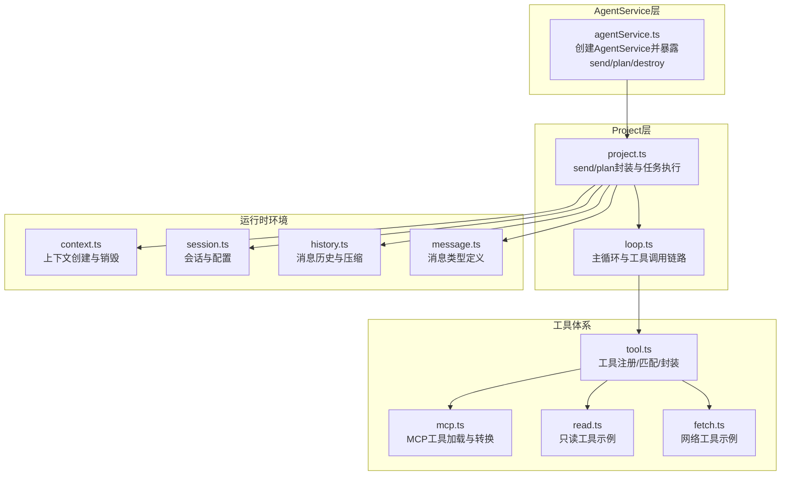
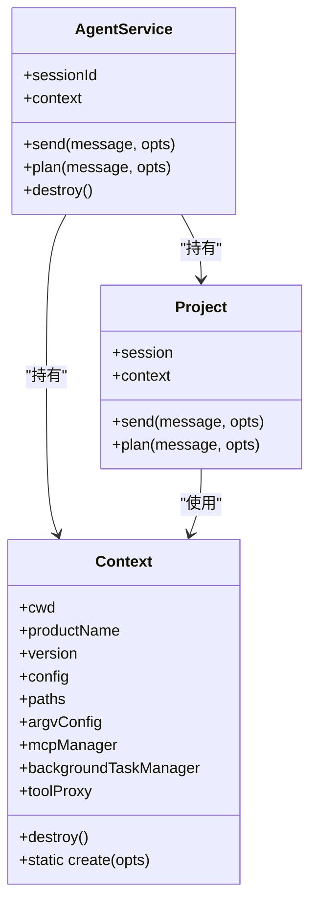
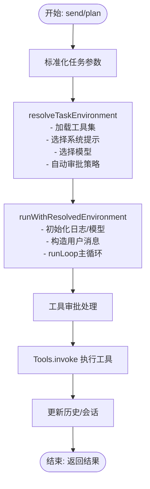
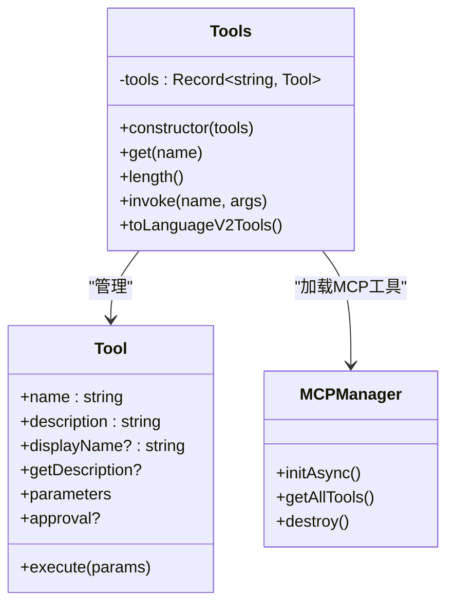
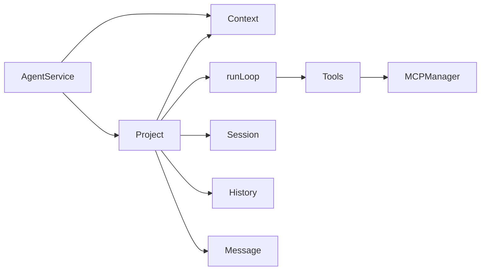

# 工具调度机制

<cite>
**本文引用的文件列表**
- [agentService.ts](file://fta-agent-core/src/agentService.ts)
- [project.ts](file://fta-agent-core/src/project.ts)
- [loop.ts](file://fta-agent-core/src/loop.ts)
- [tool.ts](file://fta-agent-core/src/tool.ts)
- [read.ts](file://fta-agent-core/src/tools/read.ts)
- [fetch.ts](file://fta-agent-core/src/tools-unadapted/fetch.ts)
- [mcp.ts](file://fta-agent-core/src/mcp.ts)
- [context.ts](file://fta-agent-core/src/context.ts)
- [session.ts](file://fta-agent-core/src/session.ts)
- [history.ts](file://fta-agent-core/src/history.ts)
- [message.ts](file://fta-agent-core/src/message.ts)
- [agentService.test.ts](file://fta-agent-core/src/agentService.test.ts)
</cite>

## 目录
1. [引言](#引言)
2. [项目结构](#项目结构)
3. [核心组件](#核心组件)
4. [架构总览](#架构总览)
5. [详细组件分析](#详细组件分析)
6. [依赖关系分析](#依赖关系分析)
7. [性能考量](#性能考量)
8. [故障排查指南](#故障排查指南)
9. [结论](#结论)

## 引言
本文件聚焦于AgentService中的工具调度核心机制，围绕以下目标展开：
- 解释createAgentService初始化过程中如何构建执行上下文与Project实例的关联关系
- 分析AgentService接口中send与plan方法如何委托至Project层发起工具调用
- 阐述Tools类的注册与匹配逻辑，包括工具函数的元数据解析、参数校验及异步执行封装
- 结合代码示例展示工具调用链路从LLM输出解析到具体工具函数执行的完整流转过程
- 说明destroy资源清理机制在调度生命周期中的作用

## 项目结构
该子系统位于fta-agent-core目录，核心文件包括：
- 上层入口与服务封装：agentService.ts
- 执行任务与循环调度：project.ts、loop.ts
- 工具注册与管理：tool.ts、mcp.ts
- 工具实现样例：read.ts、fetch.ts
- 运行时环境与会话：context.ts、session.ts、history.ts、message.ts
- 测试用例：agentService.test.ts



图表来源
- [agentService.ts](file://fta-agent-core/src/agentService.ts#L1-L45)
- [project.ts](file://fta-agent-core/src/project.ts#L1-L120)
- [loop.ts](file://fta-agent-core/src/loop.ts#L1-L120)
- [tool.ts](file://fta-agent-core/src/tool.ts#L1-L120)
- [mcp.ts](file://fta-agent-core/src/mcp.ts#L1-L120)
- [read.ts](file://fta-agent-core/src/tools/read.ts#L1-L80)
- [fetch.ts](file://fta-agent-core/src/tools-unadapted/fetch.ts#L1-L60)
- [context.ts](file://fta-agent-core/src/context.ts#L1-L86)
- [session.ts](file://fta-agent-core/src/session.ts#L1-L80)
- [history.ts](file://fta-agent-core/src/history.ts#L1-L80)
- [message.ts](file://fta-agent-core/src/message.ts#L1-L60)

章节来源
- [agentService.ts](file://fta-agent-core/src/agentService.ts#L1-L45)
- [project.ts](file://fta-agent-core/src/project.ts#L1-L120)

## 核心组件
- AgentService：对外提供send/plan/destroy接口，内部持有Context与Project实例，负责生命周期管理与委托调用
- Project：封装任务执行，根据任务类型（send/plan）解析任务环境（工具集、系统提示、模型），驱动runLoop完成多轮对话与工具调用
- Tools：工具注册表，按名称索引工具；提供invoke执行封装；支持将工具转为语言模型V2函数工具描述
- Loop：主循环，负责构造提示、流式接收文本/推理/工具调用、工具审批、执行工具、记录结果与统计
- MCPManager：动态加载MCP工具，统一转换为本地工具格式
- Context：运行时上下文，包含路径、配置、MCP管理器、后台任务管理器等
- Session/History/Message：会话与消息历史管理，支持压缩与消息序列化

章节来源
- [agentService.ts](file://fta-agent-core/src/agentService.ts#L1-L45)
- [project.ts](file://fta-agent-core/src/project.ts#L1-L120)
- [tool.ts](file://fta-agent-core/src/tool.ts#L1-L120)
- [loop.ts](file://fta-agent-core/src/loop.ts#L1-L120)
- [mcp.ts](file://fta-agent-core/src/mcp.ts#L1-L120)
- [context.ts](file://fta-agent-core/src/context.ts#L1-L86)
- [session.ts](file://fta-agent-core/src/session.ts#L1-L80)
- [history.ts](file://fta-agent-core/src/history.ts#L1-L80)
- [message.ts](file://fta-agent-core/src/message.ts#L1-L60)

## 架构总览
AgentService通过createAgentService创建Context与Project，并将send/plan方法委托给Project，Project再调用runLoop进入主循环。Loop从模型返回的工具调用中提取工具名与参数，交由Tools进行匹配与执行，期间可触发审批流程与回调钩子。

```mermaid
sequenceDiagram
participant Client as "调用方"
participant Agent as "AgentService"
participant Proj as "Project"
participant Loop as "runLoop"
participant Tools as "Tools"
participant Tool as "具体工具(read/fetch/...)"
participant Ctx as "Context/MCPManager"
Client->>Agent : 调用 send/plan(message, opts)
Agent->>Proj : 委托 send/plan(message, opts)
Proj->>Loop : executeProjectTask(...) -> runWithResolvedEnvironment(...)
Loop->>Ctx : 初始化/加载工具集(resolveTools)
Loop->>Tools : 注册工具集合(名称->工具映射)
Loop->>Loop : doStream 获取文本/推理/工具调用
Loop->>Tools : invoke(工具名, 参数字符串)
Tools->>Tool : execute(参数对象)
Tool-->>Tools : 返回ToolResult
Tools-->>Loop : 返回ToolResult
Loop-->>Proj : 返回最终结果
Proj-->>Agent : 返回结果
Agent-->>Client : 返回结果
```

图表来源
- [agentService.ts](file://fta-agent-core/src/agentService.ts#L16-L44)
- [project.ts](file://fta-agent-core/src/project.ts#L55-L119)
- [loop.ts](file://fta-agent-core/src/loop.ts#L210-L470)
- [tool.ts](file://fta-agent-core/src/tool.ts#L97-L165)
- [mcp.ts](file://fta-agent-core/src/mcp.ts#L149-L210)
- [context.ts](file://fta-agent-core/src/context.ts#L53-L86)

## 详细组件分析

### AgentService初始化与上下文/Project关联
- createAgentService负责：
  - 创建Context：解析配置、初始化MCPManager与BackgroundTaskManager，生成Paths
  - 基于Context创建Project实例，并复用其sessionId
  - 暴露send/plan/destroy方法：send/plan直接委托Project对应方法；destroy委托Context.destroy以清理MCP资源
- 关联关系：
  - AgentService持有Context与Project实例，二者贯穿任务执行周期
  - Project内部持有Session与Context，用于历史维护与日志记录



图表来源
- [agentService.ts](file://fta-agent-core/src/agentService.ts#L16-L44)
- [context.ts](file://fta-agent-core/src/context.ts#L1-L86)
- [project.ts](file://fta-agent-core/src/project.ts#L42-L74)

章节来源
- [agentService.ts](file://fta-agent-core/src/agentService.ts#L16-L44)
- [context.ts](file://fta-agent-core/src/context.ts#L53-L86)
- [project.ts](file://fta-agent-core/src/project.ts#L42-L74)

### Project层send/plan委托与任务环境解析
- send/plan：
  - 将opts(kind/context/session/message)标准化后调用executeProjectTask
- executeProjectTask：
  - 先resolveTaskEnvironment，再runWithResolvedEnvironment
- resolveTaskEnvironment：
  - 根据任务类型决定是否允许写入/待办工具（plan禁用写入/待办）
  - 通过resolveTools加载工具集（基础工具+模型依赖工具+MCP工具）
  - 选择系统提示（plan使用计划系统提示，send使用通用系统提示）
  - 设置默认模型（plan使用planModel，send使用model）
  - 自动审批策略：plan自动通过
- runWithResolvedEnvironment：
  - 初始化JsonlLogger/RequestLogger
  - 解析模型（OPENAI_API_KEY必填）
  - 构造用户消息并写入历史
  - 构建输入消息列表（历史+用户消息）
  - 实例化Tools并启动runLoop
  - 记录onMessage/onTextDelta/onStreamResult/onChunk等回调
  - 处理工具审批与结果回传



图表来源
- [project.ts](file://fta-agent-core/src/project.ts#L55-L119)
- [project.ts](file://fta-agent-core/src/project.ts#L121-L309)
- [loop.ts](file://fta-agent-core/src/loop.ts#L109-L220)

章节来源
- [project.ts](file://fta-agent-core/src/project.ts#L55-L119)
- [project.ts](file://fta-agent-core/src/project.ts#L121-L309)
- [loop.ts](file://fta-agent-core/src/loop.ts#L109-L220)

### Tools类注册与匹配逻辑
- 注册：
  - resolveTools：组合基础工具、模型依赖工具、MCP工具
  - resolveBaseTools：按write/todo/bash开关组装只读/写入/待办/后台工具
  - resolveModelDependentTools：基于OPENAI_API_KEY与模型解析创建网络抓取工具
  - getMcpTools：通过context.mcpManager.initAsync与getAllTools加载MCP工具
- 匹配与执行：
  - Tools类将工具数组归并为名称到工具对象的映射
  - invoke：解析参数字符串为对象，调用工具execute，返回ToolResult
  - toLanguageV2Tools：将工具描述转换为模型可用的函数工具schema，支持截断描述长度
- 审批：
  - handleToolApproval：根据autoApprove、approvalMode、工具类别、SessionConfigManager配置决定是否放行



图表来源
- [tool.ts](file://fta-agent-core/src/tool.ts#L28-L165)
- [mcp.ts](file://fta-agent-core/src/mcp.ts#L149-L210)

章节来源
- [tool.ts](file://fta-agent-core/src/tool.ts#L28-L165)
- [mcp.ts](file://fta-agent-core/src/mcp.ts#L149-L210)

### 工具调用链路：从LLM输出到具体工具执行
- Loop接收模型流式响应：
  - 文本/推理增量：onTextDelta/onReasoning
  - 工具调用：收集tool-call事件，提取toolCallId/toolName/input
- Loop将工具调用转为ToolUse并触发onToolUse/onToolApprove：
  - onToolUse：可修改工具调用
  - onToolApprove：决定是否执行
- 执行工具：
  - Tools.invoke解析input(JSON字符串)为参数对象
  - 调用工具execute，得到ToolResult
  - 触发onToolResult回调
- 记录结果：
  - 将tool-result写入历史，供后续回合使用

```mermaid
sequenceDiagram
participant LLM as "模型"
participant Loop as "runLoop"
participant Tools as "Tools"
participant T as "工具实例"
participant H as "History"
LLM-->>Loop : 文本/推理/工具调用
Loop->>Loop : 解析tool-call -> ToolUse
Loop->>Loop : onToolUse/onToolApprove
alt 审批通过
Loop->>Tools : invoke(name, JSON.stringify(params))
Tools->>T : execute(params)
T-->>Tools : ToolResult
Tools-->>Loop : ToolResult
Loop->>H : 写入tool-result消息
else 审批拒绝
Loop-->>Loop : 返回tool_denied错误
end
```

图表来源
- [loop.ts](file://fta-agent-core/src/loop.ts#L392-L470)
- [tool.ts](file://fta-agent-core/src/tool.ts#L114-L141)
- [history.ts](file://fta-agent-core/src/history.ts#L1-L80)

章节来源
- [loop.ts](file://fta-agent-core/src/loop.ts#L392-L470)
- [tool.ts](file://fta-agent-core/src/tool.ts#L114-L141)
- [history.ts](file://fta-agent-core/src/history.ts#L1-L80)

### 工具实现示例：read与fetch
- read工具：
  - 支持绝对/相对路径、@前缀、偏移与限制读取
  - 图片文件安全校验与大小限制，超限报错
  - 文本文件按行读取与长度截断
  - 可选toolProxy代理到前端执行
  - 审批类别为read
- fetch工具：
  - 网络抓取URL内容，HTML转纯文本
  - 缓存最近请求，TTL内命中缓存
  - 对内容长度截断，调用query对抓取内容进行二次处理
  - 审批类别为network

章节来源
- [read.ts](file://fta-agent-core/src/tools/read.ts#L72-L204)
- [fetch.ts](file://fta-agent-core/src/tools-unadapted/fetch.ts#L13-L108)

### 销毁与资源清理
- AgentService.destroy：
  - 调用context.destroy，释放MCPManager资源
- Context.destroy：
  - 调用MCPManager.destroy，关闭所有客户端连接并重置状态
- Project.destroy：
  - 无显式destroy方法；生命周期由AgentService统一管理

章节来源
- [agentService.ts](file://fta-agent-core/src/agentService.ts#L37-L44)
- [context.ts](file://fta-agent-core/src/context.ts#L53-L56)
- [mcp.ts](file://fta-agent-core/src/mcp.ts#L198-L212)

## 依赖关系分析
- 组件耦合：
  - AgentService依赖Context与Project；Project依赖Context、Session、History、Message、Tool
  - Loop依赖Model、Tools、History、Message、Usage等
  - Tools依赖MCPManager与具体工具实现
- 外部依赖：
  - OPENAI_API_KEY用于resolveModelWithContext与fetch工具
  - MCPManager通过@ai-sdk/mcp加载外部工具服务器
- 循环依赖：
  - 未发现直接循环依赖；各模块职责清晰，通过接口解耦



图表来源
- [agentService.ts](file://fta-agent-core/src/agentService.ts#L16-L44)
- [project.ts](file://fta-agent-core/src/project.ts#L1-L120)
- [loop.ts](file://fta-agent-core/src/loop.ts#L1-L120)
- [tool.ts](file://fta-agent-core/src/tool.ts#L1-L120)
- [mcp.ts](file://fta-agent-core/src/mcp.ts#L1-L120)
- [session.ts](file://fta-agent-core/src/session.ts#L1-L80)
- [history.ts](file://fta-agent-core/src/history.ts#L1-L80)
- [message.ts](file://fta-agent-core/src/message.ts#L1-L60)

章节来源
- [agentService.ts](file://fta-agent-core/src/agentService.ts#L16-L44)
- [project.ts](file://fta-agent-core/src/project.ts#L1-L120)
- [loop.ts](file://fta-agent-core/src/loop.ts#L1-L120)
- [tool.ts](file://fta-agent-core/src/tool.ts#L1-L120)
- [mcp.ts](file://fta-agent-core/src/mcp.ts#L1-L120)
- [session.ts](file://fta-agent-core/src/session.ts#L1-L80)
- [history.ts](file://fta-agent-core/src/history.ts#L1-L80)
- [message.ts](file://fta-agent-core/src/message.ts#L1-L60)

## 性能考量
- 历史压缩：当使用量达到阈值时，History.compress通过compact生成摘要并替换历史，降低上下文开销
- 流式处理：Loop对文本/推理/工具调用采用流式处理，边生成边回调，减少等待时间
- 工具并发：resolveTools并行加载模型依赖工具与MCP工具，缩短准备时间
- 重试机制：Loop对API错误进行指数退避重试，提升稳定性
- 工具参数解析：Tools.invoke对参数字符串进行JSON解析，避免Schema校验开销（当前注释掉验证逻辑）

章节来源
- [history.ts](file://fta-agent-core/src/history.ts#L244-L288)
- [loop.ts](file://fta-agent-core/src/loop.ts#L1-L120)
- [tool.ts](file://fta-agent-core/src/tool.ts#L80-L85)

## 故障排查指南
- OPENAI_API_KEY缺失：
  - Project.runWithResolvedEnvironment在解析模型前断言OPENAI_API_KEY存在
- 工具调用被拒绝：
  - handleToolApproval根据autoApprove、approvalMode、SessionConfigManager与工具approval.category判断
  - 若onToolApprove返回false或审批拒绝，Loop返回tool_denied错误
- MCP工具加载失败：
  - getMcpTools捕获异常并告警，返回空工具集
  - MCPManager.destroy确保资源释放
- 会话恢复：
  - Session.resume从日志文件加载历史消息，若不存在则为空历史
- 取消与超时：
  - Loop支持AbortSignal取消；对错误进行分类与重试控制

章节来源
- [project.ts](file://fta-agent-core/src/project.ts#L133-L140)
- [project.ts](file://fta-agent-core/src/project.ts#L258-L309)
- [tool.ts](file://fta-agent-core/src/tool.ts#L86-L95)
- [mcp.ts](file://fta-agent-core/src/mcp.ts#L198-L212)
- [session.ts](file://fta-agent-core/src/session.ts#L35-L45)
- [loop.ts](file://fta-agent-core/src/loop.ts#L1-L120)

## 结论
AgentService通过清晰的分层设计实现了“上下文—项目—循环—工具”的完整调度闭环。createAgentService负责初始化与生命周期管理；Project负责任务环境解析与委托；Loop负责工具调用链路与审批；Tools负责工具注册与执行封装；MCPManager提供外部工具扩展能力。整体架构具备良好的可扩展性与可维护性，同时在性能与稳定性方面提供了压缩、流式、重试等优化手段。destroy机制确保资源得到及时释放，避免泄漏。