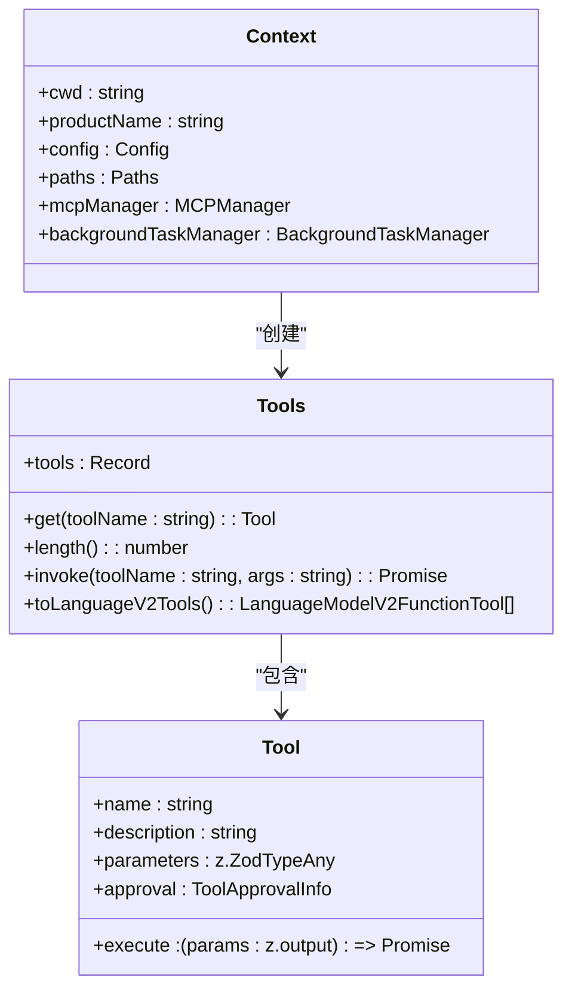
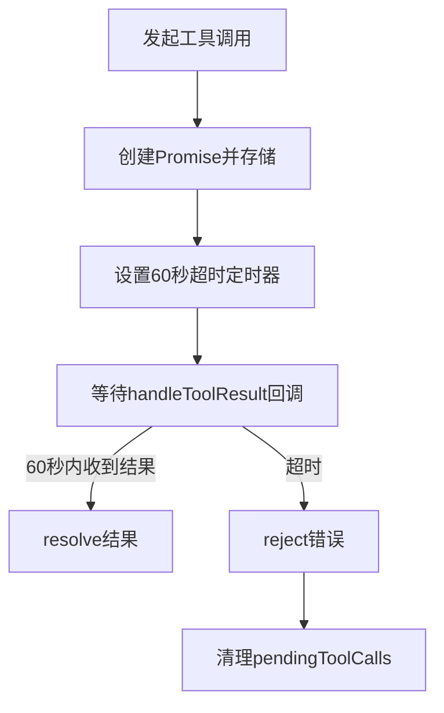

# 工具调用与执行流程

<cite>
**本文档引用的文件**   
- [agentService.ts](file://fta-agent-core/src/agentService.ts)
- [tool.ts](file://fta-agent-core/src/tool.ts)
- [loop.ts](file://fta-agent-core/src/loop.ts)
- [project.ts](file://fta-agent-core/src/project.ts)
- [context.ts](file://fta-agent-core/src/context.ts)
- [backgroundTaskManager.ts](file://fta-agent-core/src/backgroundTaskManager.ts)
- [frontend-workflow.ts](file://code-agent-backend/src/service/code-agent/frontend-workflow.ts)
- [frontend-workflow.dto.ts](file://code-agent-backend/src/dto/code-agent/frontend-workflow.dto.ts)
- [frontend-workflow.controller.ts](file://code-agent-backend/src/controller/code-agent/frontend-workflow.ts)
- [edit.ts](file://fta-agent-core/src/tools/edit.ts)
- [read.ts](file://fta-agent-core/src/tools/read.ts)
- [fetch.ts](file://fta-agent-core/src/tools-unadapted/fetch.ts)
- [mcp.ts](file://fta-agent-core/src/mcp.ts)
</cite>

## 目录
1. [工具调用执行链路概述](#工具调用执行链路概述)
2. [工具管理器与工具注册](#工具管理器与工具注册)
3. [工具调用的完整执行流程](#工具调用的完整执行流程)
4. [并发调用、超时控制与错误重试](#并发调用超时控制与错误重试)
5. [跨服务异步调用的状态管理](#跨服务异步调用的状态管理)
6. [执行上下文传递与性能监控](#执行上下文传递与性能监控)
7. [调试日志输出最佳实践](#调试日志输出最佳实践)

## 工具调用执行链路概述

工具调用（Tool Call）是AI代理系统与外部世界交互的核心机制。整个执行链路始于LLM模型的输出，经过工具管理器的解析与匹配，最终执行具体的工具函数，并将结果格式化后回传给LLM，形成一个完整的闭环。该流程确保了AI代理能够安全、高效地执行文件读写、网络请求、命令行操作等复杂任务。

**Section sources**
- [agentService.ts](file://fta-agent-core/src/agentService.ts#L1-L45)
- [tool.ts](file://fta-agent-core/src/tool.ts#L1-L275)

## 工具管理器与工具注册

系统中的工具由`Tools`类统一管理。该类接收一个工具数组，并将其转换为以工具名称为键的字典，便于快速查找。工具的注册通过`resolveTools`函数完成，该函数会根据上下文配置动态解析出基础工具、模型依赖工具和MCP（Model Context Protocol）工具。



**Diagram sources **
- [tool.ts](file://fta-agent-core/src/tool.ts#L97-L165)
- [context.ts](file://fta-agent-core/src/context.ts#L28-L86)

**Section sources**
- [tool.ts](file://fta-agent-core/src/tool.ts#L28-L84)
- [context.ts](file://fta-agent-core/src/context.ts#L57-L84)

## 工具调用的完整执行流程

工具调用的执行流程始于LLM的`tool_calls`输出。`loop.ts`中的`runLoop`函数负责处理这些调用。流程如下：
1.  **解析调用**：从LLM的流式响应中提取`toolCall`事件，获取工具名称、参数和调用ID。
2.  **权限审批**：通过`onToolApprove`回调检查工具调用是否被批准。读取类工具通常自动批准，而写入或命令类工具则需要显式批准。
3.  **执行工具**：调用`Tools`管理器的`invoke`方法，传入工具名称和参数。`invoke`方法会查找对应的`Tool`对象，解析参数，并执行其`execute`函数。
4.  **结果处理**：将执行结果封装为`tool-result`消息，添加到对话历史中，并将结果回传给LLM，以便其进行下一步推理。

```mermaid
sequenceDiagram
participant LLM as "LLM模型"
participant Loop as "runLoop"
participant Tools as "Tools管理器"
participant Tool as "具体工具"
LLM->>Loop : 发送tool_calls
Loop->>Loop : 解析toolCall事件
Loop->>Loop : 触发onToolApprove回调
alt 调用被批准
Loop->>Tools : invoke(toolName, args)
Tools->>Tool : execute(params)
Tool-->>Tools : 返回ToolResult
Tools-->>Loop : 返回ToolResult
Loop->>Loop : 将结果添加到历史记录
Loop->>LLM : 回传tool-result
else 调用被拒绝
Loop->>Loop : 生成拒绝错误
Loop->>LLM : 回传错误信息
end
```

**Diagram sources **
- [loop.ts](file://fta-agent-core/src/loop.ts#L432-L531)
- [tool.ts](file://fta-agent-core/src/tool.ts#L114-L140)
- [project.ts](file://fta-agent-core/src/project.ts#L231-L240)

**Section sources**
- [loop.ts](file://fta-agent-core/src/loop.ts#L432-L531)
- [tool.ts](file://fta-agent-core/src/tool.ts#L114-L140)

## 并发调用、超时控制与错误重试

### 并发调用
系统通过`Promise.all`实现工具的并发解析。在`resolveTools`函数中，基础工具、模型依赖工具和MCP工具的解析是并行执行的，这显著提高了工具初始化的效率。

### 超时控制（60秒timeout）
超时控制主要在`frontend-workflow`服务中实现。当通过`toolProxy`发起工具调用时，系统会为每个调用创建一个Promise，并设置60秒的超时。如果在规定时间内未收到响应，Promise将被拒绝，并抛出“Tool execution timeout”错误。



**Diagram sources **
- [frontend-workflow.controller.ts](file://code-agent-backend/src/controller/code-agent/frontend-workflow.ts#L176-L190)

### 错误重试策略
系统在多个层面实现了错误重试：
1.  **MCP连接重试**：`MCPManager`在初始化服务器连接时，会对临时性错误（如网络超时、服务不可用）进行重试，而对永久性错误（如命令不存在、权限拒绝）则不会重试。
2.  **空响应重试**：在`runLoop`中，如果LLM返回了一个既无文本也无工具调用的空响应，系统会将其视为可重试错误并抛出异常，触发重试机制。

**Section sources**
- [mcp.ts](file://fta-agent-core/src/mcp.ts#L336-L384)
- [loop.ts](file://fta-agent-core/src/loop.ts#L277-L281)

## 跨服务异步调用的状态管理

`frontend-workflow`服务通过`pendingToolCalls`映射表来管理跨服务的异步调用状态。其核心机制如下：
1.  **发起调用**：当`toolProxy`被调用时，系统生成一个唯一的`callId`，创建一个Promise，并将`resolve`和`reject`函数与`callId`、`sessionId`等信息一起存储在`pendingToolCalls`映射表中。
2.  **等待响应**：`toolProxy`返回的Promise会一直挂起，直到`handleToolResult`接口被调用。
3.  **响应同步**：前端或其他服务执行完工具后，通过调用`/tool-result`接口，传入`callId`和结果。后端服务根据`callId`查找对应的Promise，并调用`resolve`或`reject`来完成异步操作。
4.  **超时与清理**：系统通过60秒的超时机制和`sessionCallIds`映射表，在会话结束或发生错误时，能够彻底清理所有待处理的调用，防止内存泄漏。

**Section sources**
- [frontend-workflow.controller.ts](file://code-agent-backend/src/controller/code-agent/frontend-workflow.ts#L34-L367)

## 执行上下文传递与性能监控

### 执行上下文传递
执行上下文（`Context`）在系统中贯穿始终。它包含了工作目录（`cwd`）、产品名称、配置、路径管理器、MCP管理器和后台任务管理器等关键信息。这些信息通过`Project`和`executeProjectTask`等函数层层传递，确保每个工具在执行时都能访问到所需的上下文。

### 性能监控埋点
系统内置了详细的性能监控埋点：
-  **日志记录**：使用`JsonlLogger`和`RequestLogger`记录每个会话的详细日志，包括消息、请求元数据和数据块。
-  **耗时统计**：在`runLoop`和`executeProjectTask`中，通过`startTime`和`endTime`精确计算每个循环和任务的执行耗时。
-  **Token使用量**：通过`Usage`对象跟踪和累加每次请求的输入和输出Token数量。

**Section sources**
- [context.ts](file://fta-agent-core/src/context.ts#L28-L86)
- [project.ts](file://fta-agent-core/src/project.ts#L121-L130)
- [loop.ts](file://fta-agent-core/src/loop.ts#L516-L527)

## 调试日志输出最佳实践

为了便于调试，系统在关键节点输出了丰富的日志信息，遵循以下最佳实践：
1.  **结构化日志**：日志信息包含会话ID（`sessionId`），便于追踪特定会话的完整执行流程。
2.  **关键事件标记**：使用不同的emoji（如🚀、✅、❌、💥）标记启动、成功、失败和异常等关键事件，使日志更易读。
3.  **详细信息输出**：在错误发生时，不仅输出错误消息，还输出错误名称、堆栈信息和上下文详情，便于快速定位问题根源。
4.  **SSE事件日志**：在SSE（Server-Sent Events）通信中，记录所有发送的事件，确保前端与后端的通信状态透明。

**Section sources**
- [frontend-workflow.controller.ts](file://code-agent-backend/src/controller/code-agent/frontend-workflow.ts#L92-L344)
- [frontend-workflow.ts](file://code-agent-backend/src/service/code-agent/frontend-workflow.ts#L97-L278)