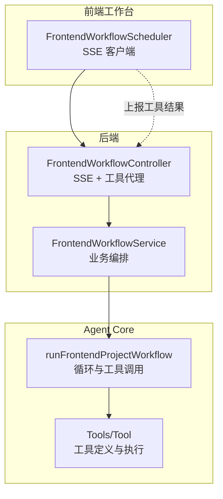
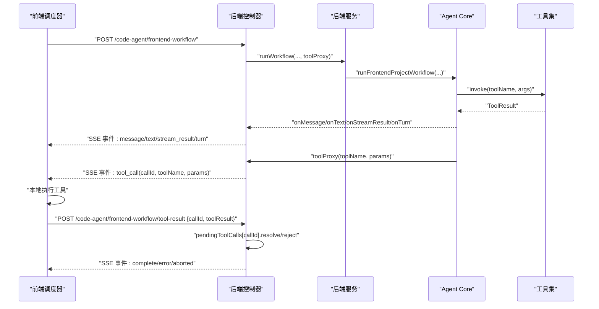
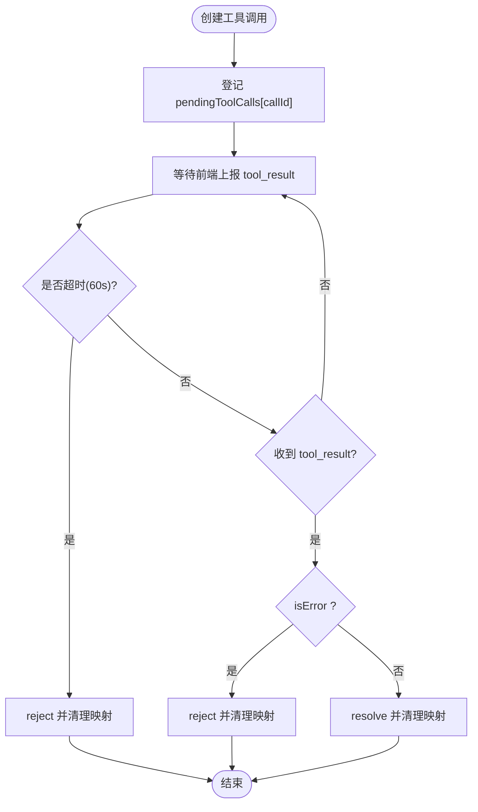
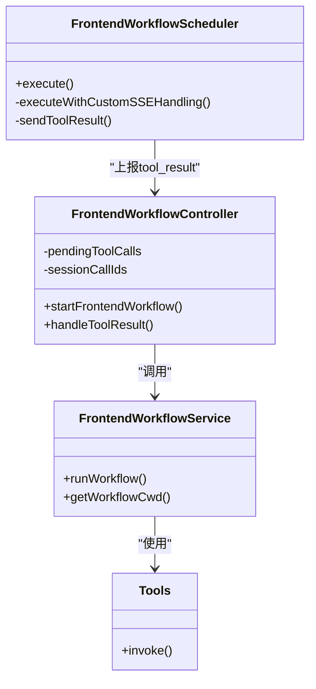

# 异步状态同步机制

<cite>
**本文引用的文件列表**
- [frontend-workflow.controller.ts](file://code-agent-backend/src/controller/code-agent/frontend-workflow.ts)
- [frontend-workflow.service.ts](file://code-agent-backend/src/service/code-agent/frontend-workflow.ts)
- [frontend-workflow.dto.ts](file://code-agent-backend/src/dto/code-agent/frontend-workflow.dto.ts)
- [frontend-workflow-api.md](file://code-agent-backend/docs/frontend-workflow-api.md)
- [FrontendWorkflowScheduler.ts](file://fta-layout-design/src/pages/EditorPage/services/FrontendWorkflowScheduler.ts)
- [tool.ts](file://fta-agent-core/src/tool.ts)
- [loop.ts](file://fta-agent-core/src/loop.ts)
- [mcp.ts](file://fta-agent-core/src/mcp.ts)
- [frontend-project-service.ts](file://fta-agent-core/src/frontendProjectService.ts)
</cite>

## 目录
1. [引言](#引言)
2. [项目结构](#项目结构)
3. [核心组件](#核心组件)
4. [架构总览](#架构总览)
5. [详细组件分析](#详细组件分析)
6. [依赖关系分析](#依赖关系分析)
7. [性能考量](#性能考量)
8. [故障排查指南](#故障排查指南)
9. [结论](#结论)

## 引言
本文围绕前端工作流服务中的“待处理工具调用映射表”（pendingToolCalls）展开，系统阐述其如何通过唯一会话ID与调用序列号（callId）维护跨服务异步调用的上下文一致性；分析工具调用生命周期的状态机转换规则；说明SSE实时通信机制如何将Agent Core的工具执行状态同步至前端工作台，覆盖错误传播、超时标记与重试计数更新等关键状态变更处理策略，并给出实际场景下的调试日志追踪路径。

## 项目结构
- 后端控制器与服务位于 code-agent-backend，负责接收请求、建立SSE、转发工具调用、回传结果与清理资源。
- 前端调度器位于 fta-layout-design，负责发起SSE、解析事件、向后端上报工具执行结果。
- Agent Core位于 fta-agent-core，负责工作流引擎、工具解析与执行、错误分类与重试策略。

图表来源
- [frontend-workflow.controller.ts](file://code-agent-backend/src/controller/code-agent/frontend-workflow.ts#L83-L309)
- [frontend-workflow.service.ts](file://code-agent-backend/src/service/code-agent/frontend-workflow.ts#L74-L279)
- [FrontendWorkflowScheduler.ts](file://fta-layout-design/src/pages/EditorPage/services/FrontendWorkflowScheduler.ts#L130-L520)
- [tool.ts](file://fta-agent-core/src/tool.ts#L114-L141)
- [loop.ts](file://fta-agent-core/src/loop.ts#L252-L468)

章节来源
- [frontend-workflow.controller.ts](file://code-agent-backend/src/controller/code-agent/frontend-workflow.ts#L83-L309)
- [frontend-workflow.service.ts](file://code-agent-backend/src/service/code-agent/frontend-workflow.ts#L74-L279)
- [frontend-workflow-api.md](file://code-agent-backend/docs/frontend-workflow-api.md#L1-L120)

## 核心组件
- 待处理工具调用映射表（pendingToolCalls）：以 callId 为键，存储对应Promise的resolve/reject、创建时间戳与所属sessionId，用于跨SSE会话的异步上下文绑定。
- 会话工具调用集合（sessionCallIds）：以 sessionId 为键，维护该会话下所有callId集合，便于批量清理。
- 工具代理（toolProxy）：在Agent Core触发工具调用时，通过SSE向前端发送“tool_call”事件，并在前端确认执行后，通过POST /code-agent/frontend-workflow/tool-result上报结果，从而解除pending状态。
- SSE事件流：后端在Controller层设置SSE响应头，按需发送message、text、stream_result、turn、complete、error、aborted等事件，前端通过自定义解析器接收并驱动UI。

章节来源
- [frontend-workflow.controller.ts](file://code-agent-backend/src/controller/code-agent/frontend-workflow.ts#L34-L81)
- [frontend-workflow.controller.ts](file://code-agent-backend/src/controller/code-agent/frontend-workflow.ts#L151-L195)
- [frontend-workflow.controller.ts](file://code-agent-backend/src/controller/code-agent/frontend-workflow.ts#L196-L309)
- [frontend-workflow.service.ts](file://code-agent-backend/src/service/code-agent/frontend-workflow.ts#L74-L279)
- [frontend-workflow-api.md](file://code-agent-backend/docs/frontend-workflow-api.md#L25-L120)

## 架构总览
后端Controller负责：
- 生成sessionId并建立SSE连接，注册各类回调事件（消息、文本、流式结果、回合统计、工具审批）。
- 通过toolProxy拦截工具调用，向前端发送“tool_call”，同时在pendingToolCalls中登记callId对应的Promise。
- 当前端上报“tool_result”时，根据isError字段决定resolve或reject，并清理映射表与会话集合。

前端调度器负责：
- 发起SSE请求，解析事件流，将“tool_call”事件映射为本地工具执行，并在完成后POST“tool_result”。
- 提供中断能力（AbortController），并在连接断开时进行清理。

Agent Core负责：
- 工作流循环与工具调用收集，自动批准工具调用（onToolApprove返回true）。
- 工具执行与结果封装（ToolResult），错误分类与重试策略（如空响应、网络临时错误等）。

图表来源
- [frontend-workflow.controller.ts](file://code-agent-backend/src/controller/code-agent/frontend-workflow.ts#L83-L309)
- [frontend-workflow.service.ts](file://code-agent-backend/src/service/code-agent/frontend-workflow.ts#L74-L279)
- [FrontendWorkflowScheduler.ts](file://fta-layout-design/src/pages/EditorPage/services/FrontendWorkflowScheduler.ts#L130-L520)
- [tool.ts](file://fta-agent-core/src/tool.ts#L114-L141)
- [loop.ts](file://fta-agent-core/src/loop.ts#L252-L468)

## 详细组件分析

### 待处理工具调用映射表（pendingToolCalls）设计与实现
- 结构与键值
  - 键：callId（全局唯一）
  - 值：包含resolve/reject、timestamp、sessionId的上下文对象
- 作用
  - 维持跨SSE会话的异步上下文一致性：前端上报tool_result时，后端通过callId定位对应Promise并完成resolve/reject。
  - 通过sessionId与sessionCallIds配合，实现按会话批量清理，避免内存泄漏。
- 生命周期
  - 创建：在toolProxy中生成callId并登记pendingToolCalls，同时将callId加入sessionCallIds[sessionId]。
  - 成功：前端上报tool_result且isError=false，后端resolve并删除映射。
  - 失败：前端上报tool_result且isError=true，后端reject并删除映射。
  - 超时：60秒定时器到期仍未收到tool_result，后端删除映射并reject。
  - 中断：会话结束或工作流中断时，遍历sessionCallIds[sessionId]，逐个reject并清理。

图表来源
- [frontend-workflow.controller.ts](file://code-agent-backend/src/controller/code-agent/frontend-workflow.ts#L151-L195)
- [frontend-workflow.controller.ts](file://code-agent-backend/src/controller/code-agent/frontend-workflow.ts#L48-L81)
- [frontend-workflow.controller.ts](file://code-agent-backend/src/controller/code-agent/frontend-workflow.ts#L350-L367)

章节来源
- [frontend-workflow.controller.ts](file://code-agent-backend/src/controller/code-agent/frontend-workflow.ts#L34-L81)
- [frontend-workflow.controller.ts](file://code-agent-backend/src/controller/code-agent/frontend-workflow.ts#L151-L195)
- [frontend-workflow.controller.ts](file://code-agent-backend/src/controller/code-agent/frontend-workflow.ts#L350-L367)

### 会话ID与调用序列号的上下文一致性
- 会话ID（sessionId）由后端生成并贯穿整个SSE会话，用于区分不同工作流实例。
- 调用序列号（callId）由后端在每次工具调用时生成，作为pendingToolCalls的键。
- 两者组合确保：
  - 前端上报tool_result时能准确匹配到后端的Promise。
  - 会话结束或中断时，能够按sessionId快速清理该会话下所有未完成的工具调用。

章节来源
- [frontend-workflow.controller.ts](file://code-agent-backend/src/controller/code-agent/frontend-workflow.ts#L83-L100)
- [frontend-workflow.controller.ts](file://code-agent-backend/src/controller/code-agent/frontend-workflow.ts#L151-L195)
- [frontend-workflow.controller.ts](file://code-agent-backend/src/controller/code-agent/frontend-workflow.ts#L350-L367)

### 工具调用生命周期状态机
- 状态
  - 待处理（Pending）：已登记pendingToolCalls，等待前端执行与上报。
  - 执行中（Executing）：前端侧正在执行工具（由前端调度器负责）。
  - 完成（Resolved）：前端上报tool_result且isError=false，后端resolve。
  - 失败（Rejected）：前端上报tool_result且isError=true，后端reject。
  - 超时（Timeout）：60秒内未收到tool_result，后端reject并清理。
- 转换规则
  - Pending -> Resolved：前端上报tool_result且isError=false。
  - Pending -> Rejected：前端上报tool_result且isError=true。
  - Pending -> Timeout：定时器到期未收到tool_result。
  - Pending -> Rejected（中断）：会话结束或工作流中断时批量reject。

章节来源
- [frontend-workflow.controller.ts](file://code-agent-backend/src/controller/code-agent/frontend-workflow.ts#L151-L195)
- [frontend-workflow.controller.ts](file://code-agent-backend/src/controller/code-agent/frontend-workflow.ts#L48-L81)
- [frontend-workflow.controller.ts](file://code-agent-backend/src/controller/code-agent/frontend-workflow.ts#L350-L367)

### SSE实时通信机制与事件同步
- 事件类型
  - message：Agent消息（含角色、uuid、父uuid、时间戳）。
  - text：完整文本输出。
  - text_delta：流式文本增量。
  - stream_result：流请求结果（包含requestId、model、hasError、error）。
  - turn：每轮对话统计（usage、startTime、endTime）。
  - tool_call：请求前端执行工具（包含callId、toolName、params）。
  - complete：工作流完成（包含success、filesCount、files、executionTime等）。
  - error：工作流错误。
  - aborted：工作流被中断。
- 前端解析
  - 使用自定义SSE解析逻辑，逐行读取“event:”和"data:"，将事件映射到回调。
  - 收到tool_call后，前端执行工具并POST tool-result；收到complete/error/aborted后终止SSE。

章节来源
- [frontend-workflow-api.md](file://code-agent-backend/docs/frontend-workflow-api.md#L25-L120)
- [frontend-workflow.controller.ts](file://code-agent-backend/src/controller/code-agent/frontend-workflow.ts#L196-L309)
- [FrontendWorkflowScheduler.ts](file://fta-layout-design/src/pages/EditorPage/services/FrontendWorkflowScheduler.ts#L130-L520)

### 错误传播、超时标记与重试计数更新
- 错误传播
  - 后端：tool_result的isError为true时，reject并携带llmContent作为错误信息；工作流异常时发送error事件。
  - 前端：收到error/aborted事件时，调用callbacks.onError并停止SSE。
- 超时标记
  - 后端在pendingToolCalls登记时设置60秒定时器，到期未收到tool_result则reject并清理。
- 重试计数更新
  - Agent Core在循环中对空响应等场景设置isRetryable标志，前端可根据业务策略决定是否重试工具调用（本仓库未见前端显式重试计数逻辑，建议在前端调度器中增加重试上限与退避策略）。

章节来源
- [frontend-workflow.controller.ts](file://code-agent-backend/src/controller/code-agent/frontend-workflow.ts#L151-L195)
- [frontend-workflow.controller.ts](file://code-agent-backend/src/controller/code-agent/frontend-workflow.ts#L48-L81)
- [loop.ts](file://fta-agent-core/src/loop.ts#L252-L468)

### 调试日志追踪路径
- 后端日志
  - 启动与参数：frontend-workflow: [sessionId] 🚀 前端工作流开始启动
  - SSE事件：frontend-workflow: [sessionId] 📡 SSE事件: {event}
  - 工具调用：frontend-workflow: [sessionId] 🔧 工具调用审批: toolName=..., callId=...
  - 文本/消息/流式结果/回合统计：对应事件的日志
  - 完成/错误/中断：frontend-workflow: [sessionId] ✅ / ❌ / ⏹️ ...
- 前端日志
  - SSE连接建立与断开
  - 事件解析与回调触发
  - tool_call接收与tool_result上报
  - 错误与中断提示

章节来源
- [frontend-workflow.controller.ts](file://code-agent-backend/src/controller/code-agent/frontend-workflow.ts#L83-L309)
- [frontend-workflow.service.ts](file://code-agent-backend/src/service/code-agent/frontend-workflow.ts#L155-L244)
- [frontend-project-service.ts](file://fta-agent-core/src/frontendProjectService.ts#L120-L137)

## 依赖关系分析
- 控制器依赖服务：FrontendWorkflowController依赖FrontendWorkflowService执行业务编排。
- 服务依赖Agent Core：FrontendWorkflowService调用runFrontendProjectWorkflow执行工作流。
- 工具定义：Agent Core的Tools类提供工具集合与invoke方法，封装ToolResult。
- 前端调度器依赖后端API：FrontendWorkflowScheduler通过fetch+自定义SSE解析与后端交互。

图表来源
- [frontend-workflow.controller.ts](file://code-agent-backend/src/controller/code-agent/frontend-workflow.ts#L83-L309)
- [frontend-workflow.service.ts](file://code-agent-backend/src/service/code-agent/frontend-workflow.ts#L74-L279)
- [FrontendWorkflowScheduler.ts](file://fta-layout-design/src/pages/EditorPage/services/FrontendWorkflowScheduler.ts#L130-L520)
- [tool.ts](file://fta-agent-core/src/tool.ts#L114-L141)

章节来源
- [frontend-workflow.controller.ts](file://code-agent-backend/src/controller/code-agent/frontend-workflow.ts#L83-L309)
- [frontend-workflow.service.ts](file://code-agent-backend/src/service/code-agent/frontend-workflow.ts#L74-L279)
- [tool.ts](file://fta-agent-core/src/tool.ts#L114-L141)

## 性能考量
- SSE长连接：后端通过keep-alive维持连接，前端需正确处理断线重连与事件去重。
- 内存管理：使用sessionCallIds按会话清理pendingToolCalls，避免长时间运行导致的内存泄漏。
- 超时控制：60秒超时保护，防止前端无响应导致的悬挂Promise。
- 错误分类：Agent Core对临时错误与永久错误进行区分，有助于前端决定是否重试。

[本节为通用指导，不直接分析具体文件]

## 故障排查指南
- 前端未收到tool_call
  - 检查SSE连接是否建立成功，确认Accept头与Content-Type设置。
  - 查看后端日志“SSE事件: tool_call”是否发出。
- 前端上报tool_result后无响应
  - 检查callId是否正确，后端是否在pendingToolCalls中存在。
  - 查看后端日志“tool_result”处理分支与isError字段。
- 超时错误
  - 确认前端是否在收到tool_call后及时执行并上报tool_result。
  - 检查前端网络与后端负载，避免延迟导致超时。
- 工作流中断
  - 检查前端AbortController是否被调用，后端是否发送aborted事件。
  - 查看后端日志“工作流已被中断”。

章节来源
- [frontend-workflow.controller.ts](file://code-agent-backend/src/controller/code-agent/frontend-workflow.ts#L151-L195)
- [frontend-workflow.controller.ts](file://code-agent-backend/src/controller/code-agent/frontend-workflow.ts#L48-L81)
- [frontend-workflow.controller.ts](file://code-agent-backend/src/controller/code-agent/frontend-workflow.ts#L350-L367)
- [frontend-workflow-api.md](file://code-agent-backend/docs/frontend-workflow-api.md#L25-L120)

## 结论
通过以callId为键的pendingToolCalls映射表与以sessionId为键的sessionCallIds集合，后端实现了跨SSE会话的工具调用上下文一致性管理。结合SSE事件流与前端调度器的工具执行与结果上报，形成了清晰的工具调用生命周期状态机。后端在60秒超时保护与会话级清理策略下，有效避免了资源泄漏；Agent Core的错误分类与重试策略为复杂场景提供了弹性保障。建议在前端调度器中补充重试计数与退避策略，以进一步提升稳定性与用户体验。