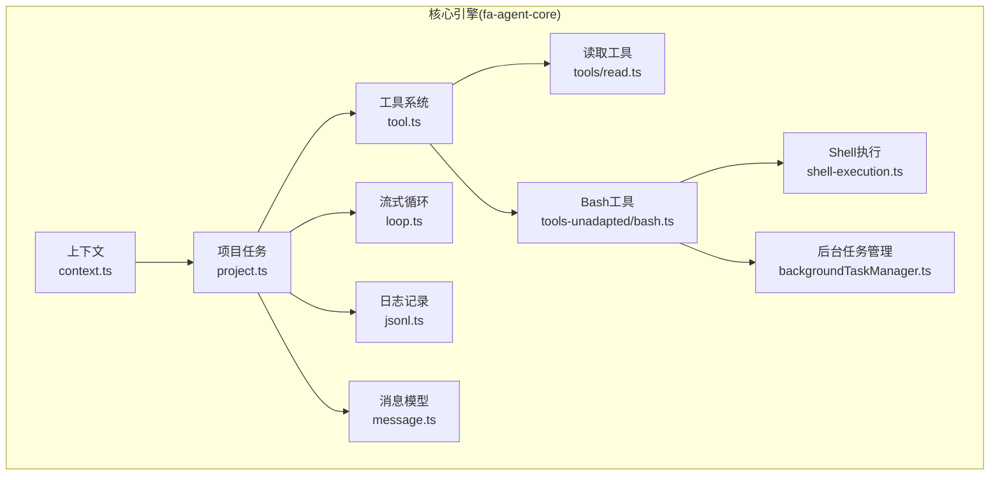
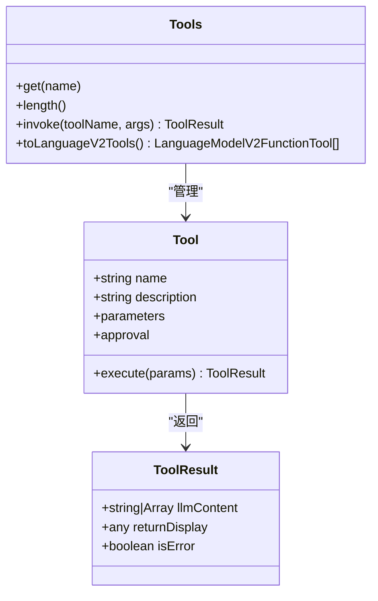
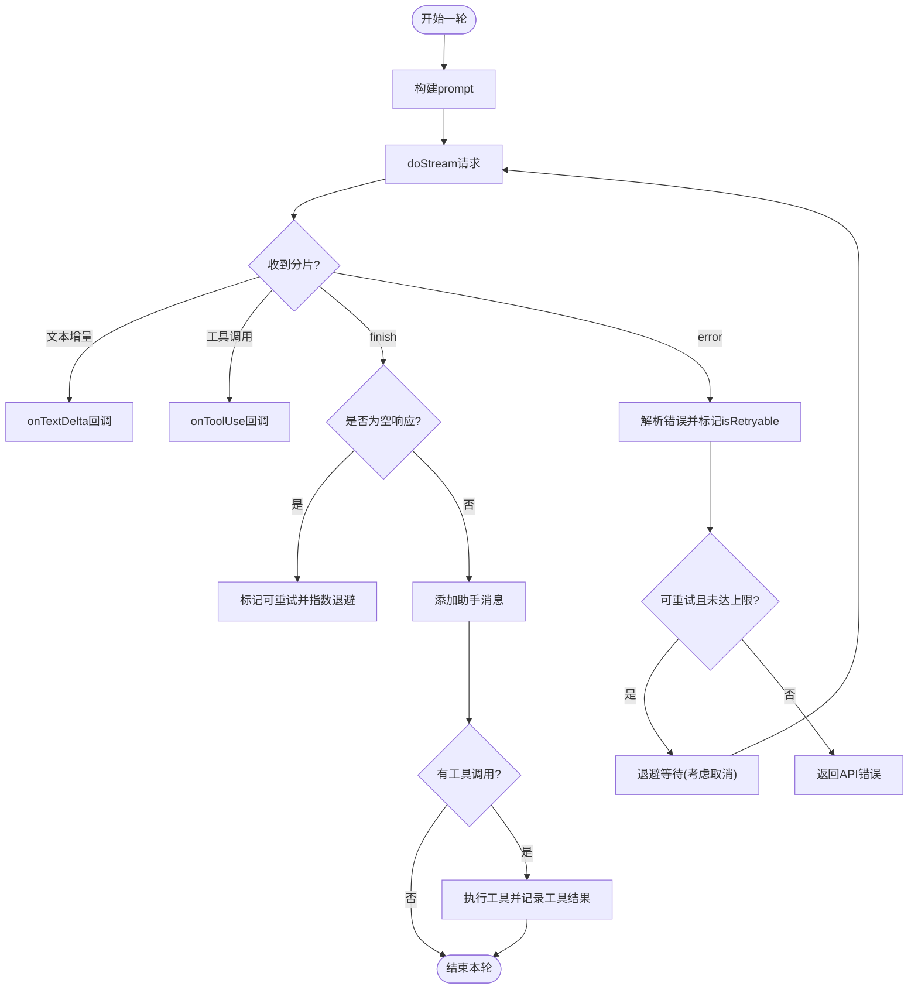
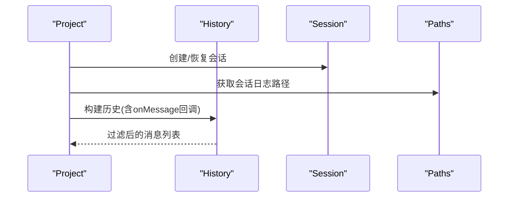
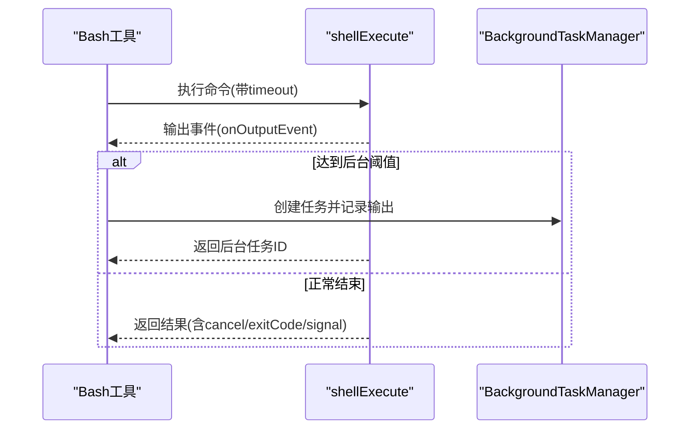
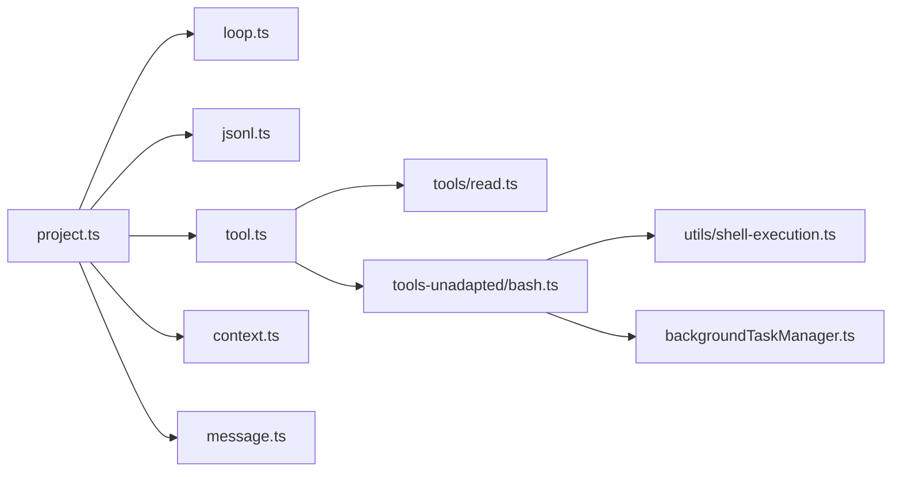

# 执行监控与最佳实践

<cite>
**本文引用的文件**
- [tool.ts](file://fta-agent-core/src/tool.ts)
- [loop.ts](file://fta-agent-core/src/loop.ts)
- [project.ts](file://fta-agent-core/src/project.ts)
- [jsonl.ts](file://fta-agent-core/src/jsonl.ts)
- [message.ts](file://fta-agent-core/src/message.ts)
- [context.ts](file://fta-agent-core/src/context.ts)
- [agentService.ts](file://fta-agent-core/src/agentService.ts)
- [backgroundTaskManager.ts](file://fta-agent-core/src/backgroundTaskManager.ts)
- [shell-execution.ts](file://fta-agent-core/src/utils/shell-execution.ts)
- [bash.ts](file://fta-agent-core/src/tools-unadapted/bash.ts)
- [read.ts](file://fta-agent-core/src/tools/read.ts)
- [error.ts](file://fta-agent-core/src/utils/error.ts)
- [safeStringify.ts](file://fta-agent-core/src/utils/safeStringify.ts)
- [config.ts](file://fta-agent-core/src/config.ts)
- [paths.ts](file://fta-agent-core/src/paths.ts)
- [history.ts](file://fta-agent-core/src/history.ts)
- [session.ts](file://fta-agent-core/src/session.ts)
- [frontend-workflow.ts](file://code-agent-backend/src/controller/code-agent/frontend-workflow.ts)
- [frontend-workflow.dto.ts](file://code-agent-backend/src/dto/code-agent/frontend-workflow.dto.ts)
- [frontend-workflow-log-viewer.html](file://code-agent-backend/tools/frontend-workflow-log-viewer.html)
- [config.default.ts](file://code-agent-backend/src/config/config.default.ts)
</cite>

## 目录
1. [引言](#引言)
2. [项目结构](#项目结构)
3. [核心组件](#核心组件)
4. [架构总览](#架构总览)
5. [详细组件分析](#详细组件分析)
6. [依赖关系分析](#依赖关系分析)
7. [性能考量](#性能考量)
8. [故障排查指南](#故障排查指南)
9. [结论](#结论)
10. [附录](#附录)

## 引言
本文件系统性总结工具调用过程中的性能监控与调试最佳实践，覆盖以下主题：
- 请求追踪ID注入与会话上下文传递
- 关键节点埋点设计（工具启动、响应返回、异常捕获）
- 利用onMessage等回调钩子实现细粒度日志与性能指标采集
- 超时控制与错误重试策略
- 日志分级与敏感信息过滤
- 故障根因定位与瓶颈识别

目标是帮助开发者在复杂工具链路中快速定位问题、优化性能，并建立可复用的监控与调试流程。

## 项目结构
该仓库包含前端布局设计、后端服务以及核心代理引擎三部分。与“工具调用监控”直接相关的核心位于fta-agent-core模块，负责：
- 工具解析与调用（工具集合、参数校验、结果封装）
- 流式循环与消息管理（流式文本、推理、工具调用、工具结果）
- 会话与历史记录（JSONL日志、会话配置、路径解析）
- 后台任务与命令执行（安全命令执行、后台任务管理、输出截断）



图表来源
- [tool.ts](file://fta-agent-core/src/tool.ts#L1-L275)
- [loop.ts](file://fta-agent-core/src/loop.ts#L1-L532)
- [project.ts](file://fta-agent-core/src/project.ts#L1-L309)
- [message.ts](file://fta-agent-core/src/message.ts#L1-L221)
- [jsonl.ts](file://fta-agent-core/src/jsonl.ts#L1-L101)
- [context.ts](file://fta-agent-core/src/context.ts#L1-L86)
- [backgroundTaskManager.ts](file://fta-agent-core/src/backgroundTaskManager.ts#L1-L125)
- [shell-execution.ts](file://fta-agent-core/src/utils/shell-execution.ts#L1-L258)
- [bash.ts](file://fta-agent-core/src/tools-unadapted/bash.ts#L1-L598)
- [read.ts](file://fta-agent-core/src/tools/read.ts#L1-L204)

章节来源
- [tool.ts](file://fta-agent-core/src/tool.ts#L1-L275)
- [loop.ts](file://fta-agent-core/src/loop.ts#L1-L532)
- [project.ts](file://fta-agent-core/src/project.ts#L1-L309)
- [jsonl.ts](file://fta-agent-core/src/jsonl.ts#L1-L101)
- [message.ts](file://fta-agent-core/src/message.ts#L1-L221)
- [context.ts](file://fta-agent-core/src/context.ts#L1-L86)
- [backgroundTaskManager.ts](file://fta-agent-core/src/backgroundTaskManager.ts#L1-L125)
- [shell-execution.ts](file://fta-agent-core/src/utils/shell-execution.ts#L1-L258)
- [bash.ts](file://fta-agent-core/src/tools-unadapted/bash.ts#L1-L598)
- [read.ts](file://fta-agent-core/src/tools/read.ts#L1-L204)

## 核心组件
- 工具系统：定义工具接口、参数Schema、执行器、审批类别与结果封装；支持工具集合解析与语言模型工具导出。
- 流式循环：驱动多轮对话，处理文本增量、推理内容、工具调用与结果回写，内置错误重试与取消信号。
- 项目任务：封装任务环境、系统提示、默认模型、工具集解析与会话交互；通过回调钩子输出中间状态。
- 消息模型：标准化用户、助手、工具消息结构，支持查找未完成工具调用、取消消息识别等。
- 日志记录：会话级JSONL日志与请求级元数据/分片日志，便于回放与分析。
- 上下文：承载配置、路径、MCP管理器、后台任务管理器与工具代理。
- 后台任务管理：跟踪后台任务生命周期、输出截断、进程组终止。
- Shell执行：带超时、内存上限、二进制检测、ANSI清理、原始输出与进度事件。
- Bash工具：命令安全校验、后台迁移、任务ID生成、输出查询与终止。
- 读取工具：文件读取、图片识别、大小限制与行数/行长限制。
- 配置与会话：全局/项目/命令行配置合并、会话配置持久化与消息过滤。

章节来源
- [tool.ts](file://fta-agent-core/src/tool.ts#L1-L275)
- [loop.ts](file://fta-agent-core/src/loop.ts#L1-L532)
- [project.ts](file://fta-agent-core/src/project.ts#L1-L309)
- [message.ts](file://fta-agent-core/src/message.ts#L1-L221)
- [jsonl.ts](file://fta-agent-core/src/jsonl.ts#L1-L101)
- [context.ts](file://fta-agent-core/src/context.ts#L1-L86)
- [backgroundTaskManager.ts](file://fta-agent-core/src/backgroundTaskManager.ts#L1-L125)
- [shell-execution.ts](file://fta-agent-core/src/utils/shell-execution.ts#L1-L258)
- [bash.ts](file://fta-agent-core/src/tools-unadapted/bash.ts#L1-L598)
- [read.ts](file://fta-agent-core/src/tools/read.ts#L1-L204)
- [config.ts](file://fta-agent-core/src/config.ts#L1-L313)
- [session.ts](file://fta-agent-core/src/session.ts#L1-L174)

## 架构总览
下面以序列图展示一次典型工具调用的监控与回调链路，包括请求追踪ID注入、关键节点埋点与性能指标采集。

```mermaid
sequenceDiagram
participant Client as "调用方"
participant Project as "Project.executeProjectTask<br/>project.ts"
participant Loop as "runLoop<br/>loop.ts"
participant Tools as "Tools.invoke<br/>tool.ts"
participant ToolImpl as "具体工具<br/>read/bash"
participant Shell as "shellExecute<br/>shell-execution.ts"
participant Logger as "Jsonl/RequestLogger<br/>jsonl.ts"
Client->>Project : 发起任务(send/plan)
Project->>Loop : 初始化环境并启动循环
Loop->>Loop : 注入requestId并触发onStreamResult/onChunk
Loop->>Tools : 解析工具调用并发起invoke
Tools->>ToolImpl : 执行execute(params)
alt 命令类工具
ToolImpl->>Shell : 执行命令(带超时/内存限制)
Shell-->>ToolImpl : 返回结果(含cancel/exitCode/signal)
end
ToolImpl-->>Tools : 返回ToolResult
Tools-->>Loop : 回传工具结果
Loop->>Logger : 写入会话JSONL与请求元数据/分片
Loop-->>Project : 返回最终结果(含turns/toolCalls/duration)
Project-->>Client : 返回结果
```

图表来源
- [project.ts](file://fta-agent-core/src/project.ts#L121-L247)
- [loop.ts](file://fta-agent-core/src/loop.ts#L216-L360)
- [tool.ts](file://fta-agent-core/src/tool.ts#L114-L140)
- [bash.ts](file://fta-agent-core/src/tools-unadapted/bash.ts#L271-L396)
- [shell-execution.ts](file://fta-agent-core/src/utils/shell-execution.ts#L69-L245)
- [jsonl.ts](file://fta-agent-core/src/jsonl.ts#L51-L101)

## 详细组件分析

### 工具系统与回调钩子
- 工具接口与结果封装：工具具备名称、描述、参数Schema、执行器与可选审批信息；执行结果统一为ToolResult，包含LLM可见内容与UI展示内容。
- 工具集合解析：按会话ID与上下文解析基础工具、模型依赖工具与MCP工具，支持并发加载。
- 回调钩子：
  - onMessage：每条消息标准化后写入JSONL并回调外部监听器。
  - onStreamResult：每次流式请求写入请求元数据日志（包含requestId、prompt、model、tools、request/response/error）。
  - onChunk：按requestId写入分片日志，便于实时观测。
  - onTurn：每轮结束统计用量与耗时，可用于性能指标采集。
  - onToolApprove：工具审批决策入口，结合审批类别与会话配置决定是否自动批准。
  - onTextDelta/onText/onReasoning：文本增量、完整文本与推理文本的回调。



图表来源
- [tool.ts](file://fta-agent-core/src/tool.ts#L114-L165)
- [tool.ts](file://fta-agent-core/src/tool.ts#L207-L275)

章节来源
- [tool.ts](file://fta-agent-core/src/tool.ts#L1-L275)
- [project.ts](file://fta-agent-core/src/project.ts#L18-L41)
- [project.ts](file://fta-agent-core/src/project.ts#L186-L247)

### 流式循环与错误重试
- 请求追踪ID：每轮循环生成requestId，贯穿onStreamResult/onChunk，便于跨组件关联。
- 文本增量与工具调用：onTextDelta/onToolUse/onToolResult等回调用于细粒度观测。
- 错误重试：指数退避与取消信号检查，支持最大重试次数；空响应场景标记为可重试。
- 取消与超限：AbortSignal触发立即退出；最大轮次超限返回错误。
- 性能指标：onTurn回调提供每轮用量与耗时，metadata汇总总时长、工具调用次数与轮次。



图表来源
- [loop.ts](file://fta-agent-core/src/loop.ts#L216-L360)
- [loop.ts](file://fta-agent-core/src/loop.ts#L360-L532)

章节来源
- [loop.ts](file://fta-agent-core/src/loop.ts#L1-L532)

### 会话与消息模型
- 会话与历史：会话持久化为JSONL，支持按父UUID筛选活动路径、加载消息与过滤非消息类型。
- 消息标准化：统一消息结构，支持取消消息、工具结果消息识别与未完成工具调用查找。
- 路径与摘要：路径解析与摘要规范化，便于日志浏览与检索。



图表来源
- [project.ts](file://fta-agent-core/src/project.ts#L42-L74)
- [session.ts](file://fta-agent-core/src/session.ts#L118-L174)
- [paths.ts](file://fta-agent-core/src/paths.ts#L84-L126)

章节来源
- [project.ts](file://fta-agent-core/src/project.ts#L1-L309)
- [session.ts](file://fta-agent-core/src/session.ts#L1-L174)
- [paths.ts](file://fta-agent-core/src/paths.ts#L84-L126)

### Shell执行与后台任务
- Shell执行：支持平台差异、编码检测、ANSI清理、二进制检测与进度上报；设置超时与内存上限；统一输出结构。
- Bash工具：命令安全校验、后台迁移、任务ID生成、输出查询与终止；对高风险命令强制审批。
- 后台任务管理：跟踪任务状态、输出截断、进程组终止；支持Windows与类Unix差异。



图表来源
- [bash.ts](file://fta-agent-core/src/tools-unadapted/bash.ts#L271-L396)
- [shell-execution.ts](file://fta-agent-core/src/utils/shell-execution.ts#L69-L245)
- [backgroundTaskManager.ts](file://fta-agent-core/src/backgroundTaskManager.ts#L1-L125)

章节来源
- [shell-execution.ts](file://fta-agent-core/src/utils/shell-execution.ts#L1-L258)
- [bash.ts](file://fta-agent-core/src/tools-unadapted/bash.ts#L1-L598)
- [backgroundTaskManager.ts](file://fta-agent-core/src/backgroundTaskManager.ts#L1-L125)

### 日志记录与请求追踪
- 会话日志：JsonlLogger按消息追加，自动维护最新uuid，便于父子关系串联。
- 请求日志：RequestLogger按requestId写入元数据与分片，支持跨组件关联。
- 请求追踪ID注入：requestId在runLoop中生成并在onStreamResult/onChunk中透传，确保端到端可追踪。

章节来源
- [jsonl.ts](file://fta-agent-core/src/jsonl.ts#L1-L101)
- [loop.ts](file://fta-agent-core/src/loop.ts#L216-L257)
- [project.ts](file://fta-agent-core/src/project.ts#L196-L226)

## 依赖关系分析
- 组件耦合：Project依赖Context、Session、Tools与LlmsContext；Tools依赖工具实现与审批信息；Loop依赖Tools、History与消息模型。
- 外部依赖：debug用于调试输出；child_process用于Shell执行；zod用于参数Schema；pathe/path用于路径处理。
- 循环依赖：未发现直接循环导入；各模块职责清晰，通过回调与日志解耦。



图表来源
- [project.ts](file://fta-agent-core/src/project.ts#L1-L309)
- [tool.ts](file://fta-agent-core/src/tool.ts#L1-L275)
- [bash.ts](file://fta-agent-core/src/tools-unadapted/bash.ts#L1-L598)
- [shell-execution.ts](file://fta-agent-core/src/utils/shell-execution.ts#L1-L258)
- [backgroundTaskManager.ts](file://fta-agent-core/src/backgroundTaskManager.ts#L1-L125)
- [context.ts](file://fta-agent-core/src/context.ts#L1-L86)
- [message.ts](file://fta-agent-core/src/message.ts#L1-L221)
- [jsonl.ts](file://fta-agent-core/src/jsonl.ts#L1-L101)

## 性能考量
- 超时控制
  - 流式循环：使用AbortSignal与最大轮次限制，避免无限循环。
  - Shell执行：统一超时与内存上限，防止内存溢出；二进制检测避免大体积输出。
  - Bash工具：默认超时较长，但受MAX_TIMEOUT约束；后台迁移减少阻塞。
- 错误重试
  - 指数退避与取消信号检查，空响应场景标记为可重试；最大重试次数可配置。
- 输出截断
  - Bash工具输出按行截断；后台任务输出按大小截断并提示。
- 日志与指标
  - onTurn提供每轮用量与耗时；onStreamResult/onChunk提供请求级元数据与分片，便于聚合统计。

章节来源
- [loop.ts](file://fta-agent-core/src/loop.ts#L1-L532)
- [shell-execution.ts](file://fta-agent-core/src/utils/shell-execution.ts#L1-L258)
- [bash.ts](file://fta-agent-core/src/tools-unadapted/bash.ts#L1-L598)
- [backgroundTaskManager.ts](file://fta-agent-core/src/backgroundTaskManager.ts#L1-L125)

## 故障排查指南
- 请求追踪与会话定位
  - 使用requestId在请求日志中定位对应元数据与分片；结合会话JSONL定位消息链路。
  - 通过findIncompleteToolUses识别未完成工具调用，辅助判断取消或异常场景。
- 工具执行失败
  - 检查工具参数Schema与execute返回的ToolResult.isError；关注审批拒绝与高风险命令。
  - 对命令类工具，查看后台任务状态与输出；必要时使用kill_bash终止。
- Shell执行异常
  - 关注cancelled、exitCode、signal与error字段；二进制输出仅上报进度，避免内存压力。
- 日志分级与敏感信息过滤
  - 建议采用统一日志格式（参考后端配置），区分debug/info/warn/error级别。
  - 对输出内容进行敏感信息过滤（如令牌、路径、密钥），避免泄露。
- 会话与历史
  - 使用Session.loadSessionMessages与filterMessages还原活动路径；核对消息类型与父子关系。

章节来源
- [message.ts](file://fta-agent-core/src/message.ts#L157-L221)
- [jsonl.ts](file://fta-agent-core/src/jsonl.ts#L1-L101)
- [session.ts](file://fta-agent-core/src/session.ts#L118-L174)
- [bash.ts](file://fta-agent-core/src/tools-unadapted/bash.ts#L398-L506)
- [shell-execution.ts](file://fta-agent-core/src/utils/shell-execution.ts#L1-L258)
- [config.default.ts](file://code-agent-backend/src/config/config.default.ts#L44-L95)

## 结论
通过在关键节点注入请求追踪ID、利用回调钩子输出中间状态、结合会话与请求日志，可以实现端到端的可观测性。配合超时控制、错误重试与输出截断，能够有效提升稳定性与性能。建议在生产环境中统一日志格式与敏感信息过滤策略，并基于onTurn/onStreamResult/onChunk等回调建立性能指标看板，持续优化工具链路。

## 附录
- 请求追踪ID注入位置
  - 在runLoop中生成requestId，并在onStreamResult/onChunk中透传。
- 关键节点埋点清单
  - 工具启动：onToolUse
  - 工具结果：onToolResult
  - 文本增量：onTextDelta
  - 文本完成：onText
  - 推理内容：onReasoning
  - 每轮结束：onTurn
  - 请求元数据：onStreamResult
  - 请求分片：onChunk
- 超时与重试
  - 流式循环：AbortSignal与最大轮次；错误重试采用指数退避。
  - Shell执行：超时与内存上限；二进制检测。
  - Bash工具：默认超时与后台迁移。
- 日志分级与过滤
  - 建议采用统一JSON格式，区分级别；对输出内容进行脱敏处理。
- 故障根因定位
  - 使用RequestLogger与JsonlLogger定位请求与会话；结合审批与高风险命令规则排查。