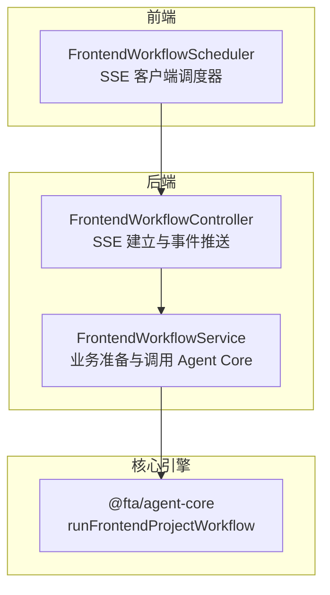
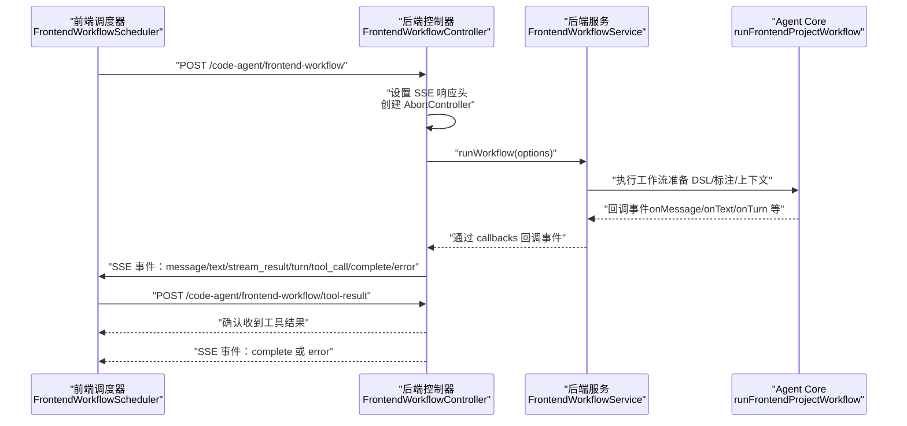
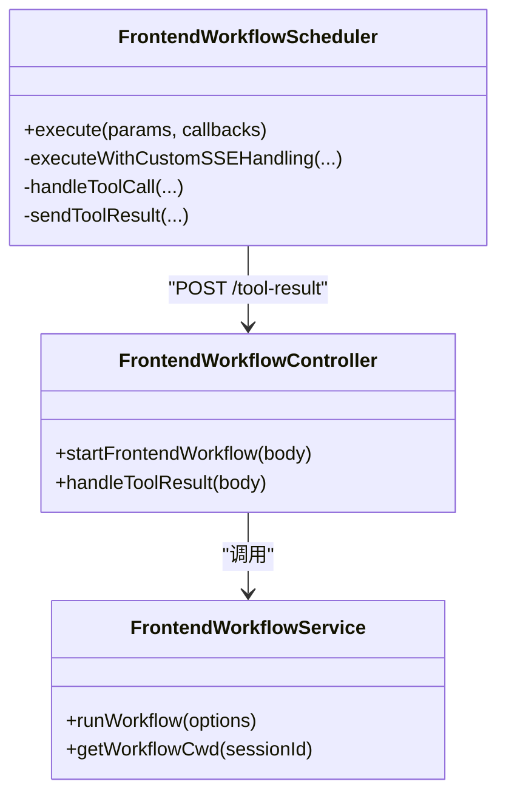

# 前端工作流

<cite>
**本文引用的文件列表**
- [code-agent-backend/src/controller/code-agent/frontend-workflow.ts](file://code-agent-backend/src/controller/code-agent/frontend-workflow.ts)
- [code-agent-backend/src/dto/code-agent/frontend-workflow.dto.ts](file://code-agent-backend/src/dto/code-agent/frontend-workflow.dto.ts)
- [code-agent-backend/src/service/code-agent/frontend-workflow.ts](file://code-agent-backend/src/service/code-agent/frontend-workflow.ts)
- [code-agent-backend/docs/frontend-workflow-api.md](file://code-agent-backend/docs/frontend-workflow-api.md)
- [code-agent-backend/docs/frontend-workflow-service-usage.md](file://code-agent-backend/docs/frontend-workflow-service-usage.md)
- [fta-layout-design/src/pages/EditorPage/services/FrontendWorkflowScheduler.ts](file://fta-layout-design/src/pages/EditorPage/services/FrontendWorkflowScheduler.ts)
- [fta-layout-design/src/pages/EditorPage/services/types.ts](file://fta-layout-design/src/pages/EditorPage/services/types.ts)
</cite>

## 目录
1. [简介](#简介)
2. [项目结构](#项目结构)
3. [核心组件](#核心组件)
4. [架构总览](#架构总览)
5. [详细组件分析](#详细组件分析)
6. [依赖关系分析](#依赖关系分析)
7. [性能考虑](#性能考虑)
8. [故障排查指南](#故障排查指南)
9. [结论](#结论)
10. [附录](#附录)

## 简介
本文档面向前端工作流的完整技术实现，覆盖从用户在前端界面触发代码生成请求，到后端 Controller 层建立 SSE 连接、Service 层协调项目、数据模型与设计 DSL 的准备，并最终调用 Agent Core 执行工作流的全过程。文档还详细解释了 SSE（Server-Sent Events）的实现机制，包括事件类型（如 tool_call、complete、error）、客户端连接管理（AbortController）与实时消息推送；为初学者提供时序图，为高级开发者提供性能优化建议（连接超时、消息压缩、错误重试策略），并结合 FrontendWorkflowScheduler 类说明前端如何解析与处理 SSE 事件流及工具调用回传机制。

## 项目结构
该仓库包含三个主要部分：
- 后端服务（code-agent-backend）：提供 /code-agent 前端工作流接口，基于 Midway 框架，使用 SSE 推送事件。
- Agent Core（fta-agent-core）：封装前端项目生成的工作流引擎，由后端 Service 调用。
- 前端调度器（fta-layout-design）：在编辑器页面中发起 SSE 请求、解析事件、处理工具调用回传。

图表来源
- [code-agent-backend/src/controller/code-agent/frontend-workflow.ts](file://code-agent-backend/src/controller/code-agent/frontend-workflow.ts#L83-L367)
- [code-agent-backend/src/service/code-agent/frontend-workflow.ts](file://code-agent-backend/src/service/code-agent/frontend-workflow.ts#L71-L279)
- [fta-layout-design/src/pages/EditorPage/services/FrontendWorkflowScheduler.ts](file://fta-layout-design/src/pages/EditorPage/services/FrontendWorkflowScheduler.ts#L1-L523)

章节来源
- [code-agent-backend/src/controller/code-agent/frontend-workflow.ts](file://code-agent-backend/src/controller/code-agent/frontend-workflow.ts#L83-L367)
- [code-agent-backend/src/service/code-agent/frontend-workflow.ts](file://code-agent-backend/src/service/code-agent/frontend-workflow.ts#L71-L279)
- [fta-layout-design/src/pages/EditorPage/services/FrontendWorkflowScheduler.ts](file://fta-layout-design/src/pages/EditorPage/services/FrontendWorkflowScheduler.ts#L1-L120)

## 核心组件
- 前端工作流控制器（Controller）
  - 负责接收请求、设置 SSE 响应头、注册事件回调、处理工具调用代理与超时、以及异常与中断处理。
- 前端工作流服务（Service）
  - 负责准备 DSL、标注摘要、数据模型与 API 上下文、工作目录、调用 Agent Core 执行工作流，并将回调事件通过 SSE 推送。
- 前端工作流调度器（FrontendWorkflowScheduler）
  - 负责发起 SSE 请求、解析事件流、将事件映射到前端回调、处理工具调用并在完成后回传结果。

章节来源
- [code-agent-backend/src/controller/code-agent/frontend-workflow.ts](file://code-agent-backend/src/controller/code-agent/frontend-workflow.ts#L83-L367)
- [code-agent-backend/src/service/code-agent/frontend-workflow.ts](file://code-agent-backend/src/service/code-agent/frontend-workflow.ts#L71-L279)
- [fta-layout-design/src/pages/EditorPage/services/FrontendWorkflowScheduler.ts](file://fta-layout-design/src/pages/EditorPage/services/FrontendWorkflowScheduler.ts#L1-L120)

## 架构总览
从前端到后端再到 Agent Core 的整体流程如下：

图表来源
- [code-agent-backend/src/controller/code-agent/frontend-workflow.ts](file://code-agent-backend/src/controller/code-agent/frontend-workflow.ts#L83-L367)
- [code-agent-backend/src/service/code-agent/frontend-workflow.ts](file://code-agent-backend/src/service/code-agent/frontend-workflow.ts#L71-L279)
- [fta-layout-design/src/pages/EditorPage/services/FrontendWorkflowScheduler.ts](file://fta-layout-design/src/pages/EditorPage/services/FrontendWorkflowScheduler.ts#L120-L215)

## 详细组件分析

### 控制器：SSE 建立与事件推送
- 请求处理
  - 接收请求体并进行校验（设计文档 ID、产品名、srcTree、API Key、Base URL、Model）。
  - 生成 sessionId，记录开始时间，设置 SSE 响应头（Content-Type: text/event-stream; charset=utf-8，Cache-Control: no-cache，Connection: keep-alive）。
- 连接管理
  - 创建 AbortController，监听请求/响应的 close/error 事件，记录中断信息。
  - 在 finally 中清理事件监听器与会话相关的待处理工具调用。
- 事件回调
  - onMessage：将消息通过 SSE 的 message 事件推送。
  - onText：将文本片段通过 SSE 的 text 事件推送。
  - onStreamResult：将流式结果通过 SSE 的 stream_result 事件推送。
  - onTurn：将令牌用量与时间戳通过 SSE 的 turn 事件推送。
  - onToolApprove：自动批准工具调用（当前实现）。
- 工具调用代理
  - 当 Agent Core 需要执行工具时，通过 tool_call 事件向前端发送 callId、toolName、params。
  - 为每个工具调用创建 Promise，等待前端回传 tool-result。
  - 默认超时时间为 60 秒，超时后清理并拒绝。
- 结束与错误
  - 工作流完成后发送 complete 事件并关闭连接。
  - 捕获异常：AbortError 表示客户端中断，发送 aborted；其他错误发送 error 事件。

章节来源
- [code-agent-backend/src/controller/code-agent/frontend-workflow.ts](file://code-agent-backend/src/controller/code-agent/frontend-workflow.ts#L83-L367)
- [code-agent-backend/src/dto/code-agent/frontend-workflow.dto.ts](file://code-agent-backend/src/dto/code-agent/frontend-workflow.dto.ts#L1-L60)

### 服务：项目、DSL 与上下文准备，调用 Agent Core
- 配置优先级
  - 优先使用请求参数中的 apiKey/baseURL/model，否则使用配置中心的 modelGateway.default。
- 数据准备
  - 获取设计文档内容，提取 DSL 与标注数据，过滤可见节点并进行 DSL 压缩。
  - 获取项目关联的数据模型与 REST API，格式化为工作流可用的文本上下文。
- 工作目录
  - 生成 files-cache/frontend-projects/{sessionId} 作为工作目录。
- 调用 Agent Core
  - 通过 runFrontendProjectWorkflow 执行工作流，传入设计数据、页面标注、产品名、规格目录、组件文档目录、提示词路径、模型配置、回调包装（在回调中检查中断信号）与工具代理。
- 结果返回
  - 标准化返回结构（success、sessionId、filesCount、files、workflowLogPath、error）。

章节来源
- [code-agent-backend/src/service/code-agent/frontend-workflow.ts](file://code-agent-backend/src/service/code-agent/frontend-workflow.ts#L71-L279)

### 前端调度器：SSE 解析与工具调用回传
- 连接与参数
  - 优先使用请求参数，若无则从本地配置读取 apiKey/baseURL/model。
  - 构造请求体，设置 Content-Type: application/json，Accept: text/event-stream。
  - 使用 fetch 发起 POST 请求，携带 cookies（X-User-Cookies）。
- 事件解析
  - 自定义解析逻辑，逐行读取 event: 与 data:，将事件类型与数据交由 handleSSEEvent 分发。
  - 支持 turn、message、complete、error、aborted、tool_call 等事件。
- 工具调用处理
  - 收到 tool_call 后，根据 toolName 调用 callService 执行相应工具（read/write/ls/grep/glob/edit/rm/verify/bash 等）。
  - 特殊工具 todoWrite/todoRead 返回预定义的 ToolResult。
  - 将工具执行结果封装为 ToolResult 并通过 POST /code-agent/frontend-workflow/tool-result 回传给后端。
- 中断与错误
  - 使用 AbortController 支持中断；捕获 AbortError 与 SSE 错误并回调 onError。
  - 完成后回调 onSessionComplete。

章节来源
- [fta-layout-design/src/pages/EditorPage/services/FrontendWorkflowScheduler.ts](file://fta-layout-design/src/pages/EditorPage/services/FrontendWorkflowScheduler.ts#L1-L523)

### SSE 事件类型与语义
- 事件类型
  - message：Agent 消息（role/content/uuid/parentUuid/timestamp）。
  - text：文本片段（text）。
  - stream_result：流式请求结果（requestId/model/hasError/error）。
  - turn：对话轮次统计（usage/startTime/endTime）。
  - tool_call：工具调用请求（callId/toolName/params）。
  - complete：工作流完成（success/sessionId/filesCount/files/executionTime/timestamp）。
  - error：工作流错误（message/stack/sessionId/executionTime/timestamp）。
  - aborted：工作流被中断（message/sessionId/executionTime/timestamp）。
- 事件解析
  - 前端使用自定义解析逻辑，逐行匹配 event: 与 data:，再按事件类型分发处理。

章节来源
- [code-agent-backend/docs/frontend-workflow-api.md](file://code-agent-backend/docs/frontend-workflow-api.md#L1-L280)
- [fta-layout-design/src/pages/EditorPage/services/FrontendWorkflowScheduler.ts](file://fta-layout-design/src/pages/EditorPage/services/FrontendWorkflowScheduler.ts#L180-L215)

### 工具调用回传机制（tool_call 与 tool-result）
- 后端
  - 生成 callId，发送 tool_call 事件，同时注册 Promise 并设置 60 秒超时。
  - 前端回传 tool-result 后，后端 resolve/reject 对应 Promise 并清理会话映射。
- 前端
  - 收到 tool_call，执行对应工具，构造 ToolResult（含 llmContent/isError/returnDisplay），POST 到后端。
  - 若发送失败，仅记录日志，避免重复请求。

章节来源
- [code-agent-backend/src/controller/code-agent/frontend-workflow.ts](file://code-agent-backend/src/controller/code-agent/frontend-workflow.ts#L141-L195)
- [code-agent-backend/src/controller/code-agent/frontend-workflow.ts](file://code-agent-backend/src/controller/code-agent/frontend-workflow.ts#L48-L81)
- [fta-layout-design/src/pages/EditorPage/services/FrontendWorkflowScheduler.ts](file://fta-layout-design/src/pages/EditorPage/services/FrontendWorkflowScheduler.ts#L290-L523)

## 依赖关系分析
- 控制器依赖服务：FrontendWorkflowController 注入 FrontendWorkflowService。
- 服务依赖 Agent Core：FrontendWorkflowService 调用 runFrontendProjectWorkflow。
- 前端依赖调度器：编辑器页面通过 FrontendWorkflowScheduler 发起 SSE 请求与工具回传。
- 事件映射：前端将后端 SSE 事件映射到回调函数，形成前后端事件闭环。

图表来源
- [code-agent-backend/src/controller/code-agent/frontend-workflow.ts](file://code-agent-backend/src/controller/code-agent/frontend-workflow.ts#L83-L367)
- [code-agent-backend/src/service/code-agent/frontend-workflow.ts](file://code-agent-backend/src/service/code-agent/frontend-workflow.ts#L71-L279)
- [fta-layout-design/src/pages/EditorPage/services/FrontendWorkflowScheduler.ts](file://fta-layout-design/src/pages/EditorPage/services/FrontendWorkflowScheduler.ts#L1-L120)

章节来源
- [code-agent-backend/src/controller/code-agent/frontend-workflow.ts](file://code-agent-backend/src/controller/code-agent/frontend-workflow.ts#L83-L367)
- [code-agent-backend/src/service/code-agent/frontend-workflow.ts](file://code-agent-backend/src/service/code-agent/frontend-workflow.ts#L71-L279)
- [fta-layout-design/src/pages/EditorPage/services/FrontendWorkflowScheduler.ts](file://fta-layout-design/src/pages/EditorPage/services/FrontendWorkflowScheduler.ts#L1-L120)

## 性能考虑
- 连接超时与中断
  - 后端为每个工具调用设置 60 秒超时，超时后清理并拒绝，避免悬挂。
  - 前端使用 AbortController 支持中断，后端在回调中检查中断信号，及时终止工作流。
- 消息压缩
  - 后端对 DSL 进行压缩后再传入 Agent Core，减少上下文体积，提升生成效率。
- 错误重试策略
  - 前端在发送 tool-result 失败时仅记录日志，避免重复请求导致的二次副作用。
  - SSE 事件解析采用逐行缓冲，保证稳定性；建议在前端增加指数退避与最大重试次数控制。
- 并发与资源
  - 服务层对数据模型与 API 的获取使用并发 Promise，缩短准备时间。
  - 工作目录按 sessionId 隔离，避免并发冲突。

章节来源
- [code-agent-backend/src/controller/code-agent/frontend-workflow.ts](file://code-agent-backend/src/controller/code-agent/frontend-workflow.ts#L176-L195)
- [code-agent-backend/src/service/code-agent/frontend-workflow.ts](file://code-agent-backend/src/service/code-agent/frontend-workflow.ts#L133-L150)
- [fta-layout-design/src/pages/EditorPage/services/FrontendWorkflowScheduler.ts](file://fta-layout-design/src/pages/EditorPage/services/FrontendWorkflowScheduler.ts#L490-L523)

## 故障排查指南
- 常见问题
  - 缺少模型配置：当请求参数与配置中心均未提供 apiKey/baseURL 时，服务层返回缺失参数错误。
  - 设计文档不存在：当设计文档或 DSL 数据缺失时，服务层返回设计文档未找到错误。
  - 工具调用超时：后端默认 60 秒超时，前端需尽快执行工具并回传结果。
  - 客户端中断：后端检测到 AbortError，发送 aborted 事件并清理资源。
- 前端调试
  - 使用自定义解析逻辑打印事件与数据，定位 message/text/turn/tool_call 等事件是否到达。
  - 检查 cookies 与 X-User-Cookies 是否正确传递。
- 后端调试
  - 查看控制台日志中的事件类型与耗时，定位阻塞点。
  - 检查 finally 中的清理逻辑是否执行，避免悬挂的 callId 与监听器。

章节来源
- [code-agent-backend/src/service/code-agent/frontend-workflow.ts](file://code-agent-backend/src/service/code-agent/frontend-workflow.ts#L83-L115)
- [code-agent-backend/src/controller/code-agent/frontend-workflow.ts](file://code-agent-backend/src/controller/code-agent/frontend-workflow.ts#L310-L367)
- [fta-layout-design/src/pages/EditorPage/services/FrontendWorkflowScheduler.ts](file://fta-layout-design/src/pages/EditorPage/services/FrontendWorkflowScheduler.ts#L120-L215)

## 结论
该前端工作流通过清晰的三层架构实现了从用户触发到代码生成的完整链路：前端调度器负责连接与事件解析，后端控制器负责 SSE 建立与事件推送，后端服务负责数据准备与调用 Agent Core。SSE 事件类型覆盖了消息、文本、流式结果、轮次统计、工具调用与完成/错误/中断等关键场景。通过 AbortController 与超时机制保障了中断与资源清理，通过工具回传机制实现了可控的工具执行闭环。对于性能优化，建议在前端增加重试与退避策略、在后端优化 DSL 压缩与并发准备、在前端对工具执行结果进行幂等处理。

## 附录
- API 使用文档与事件类型参考
  - [前端工作流 API 使用文档](file://code-agent-backend/docs/frontend-workflow-api.md#L1-L280)
  - [前端工作流服务使用指南](file://code-agent-backend/docs/frontend-workflow-service-usage.md#L1-L244)
- 类型定义参考
  - [前端调度器类型定义](file://fta-layout-design/src/pages/EditorPage/services/types.ts#L1-L80)