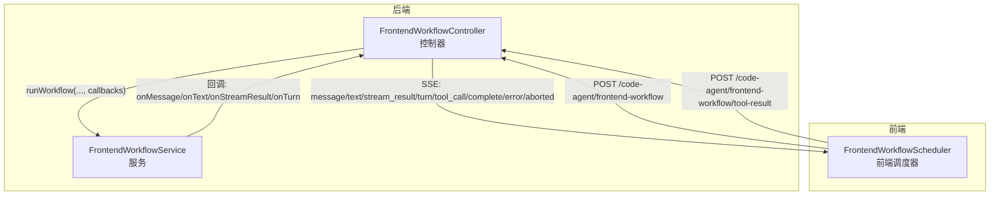
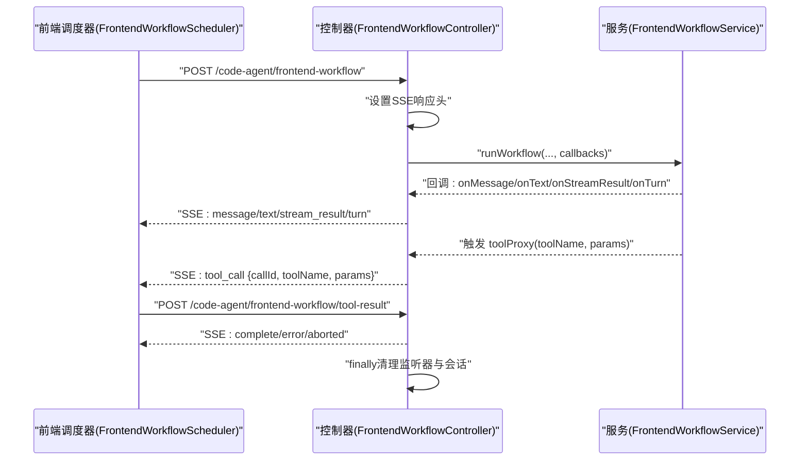
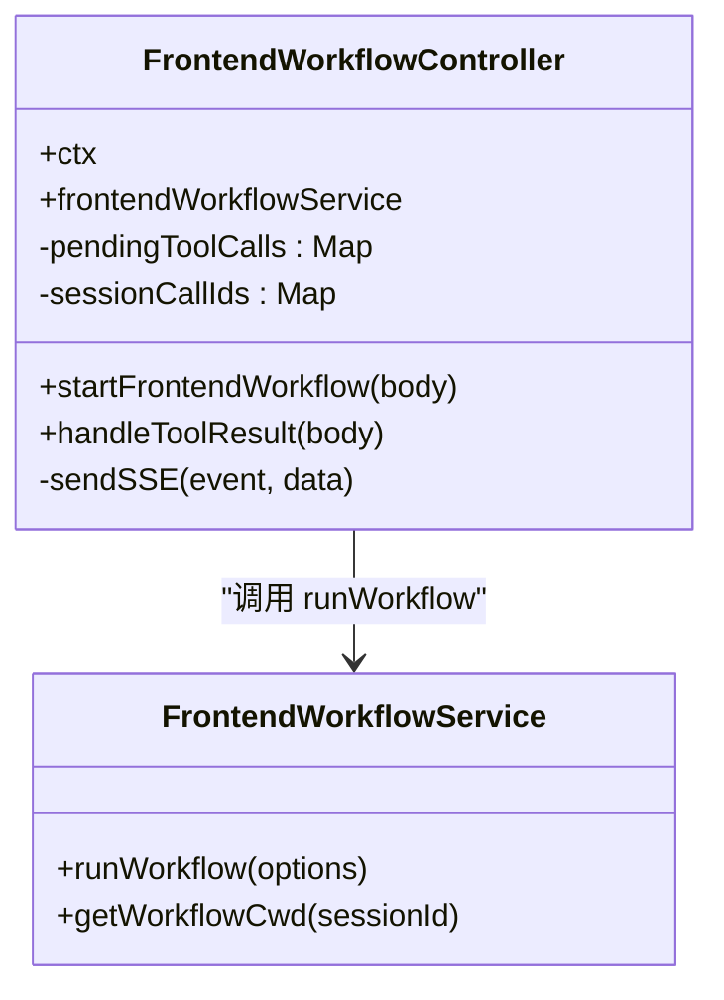
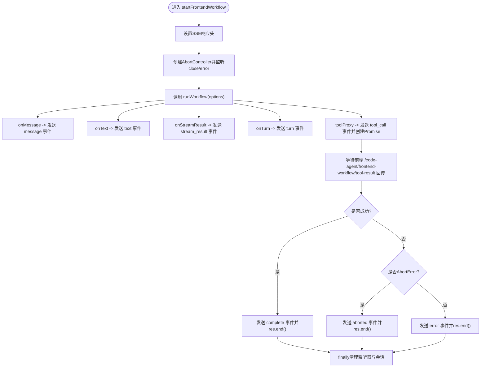
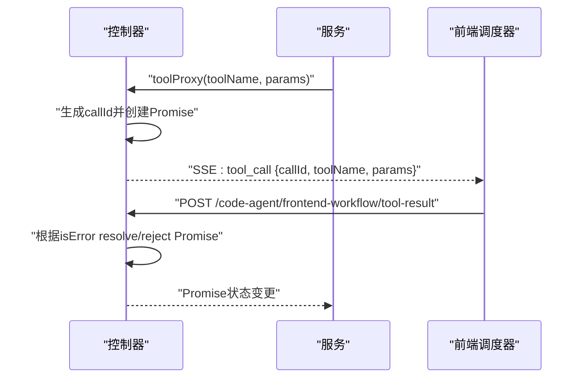
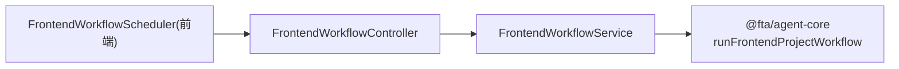

# 前端工作流控制器

<cite>
**本文引用的文件列表**
- [前端工作流控制器](file://code-agent-backend/src/controller/code-agent/frontend-workflow.ts)
- [前端工作流请求DTO](file://code-agent-backend/src/dto/code-agent/frontend-workflow.dto.ts)
- [前端工作流服务](file://code-agent-backend/src/service/code-agent/frontend-workflow.ts)
- [前端工作流API文档](file://code-agent-backend/docs/frontend-workflow-api.md)
- [前端工作流调度器（前端）](file://fta-layout-design/src/pages/EditorPage/services/FrontendWorkflowScheduler.ts)
</cite>

## 目录
1. [简介](#简介)
2. [项目结构](#项目结构)
3. [核心组件](#核心组件)
4. [架构总览](#架构总览)
5. [详细组件分析](#详细组件分析)
6. [依赖关系分析](#依赖关系分析)
7. [性能考量](#性能考量)
8. [故障排查指南](#故障排查指南)
9. [结论](#结论)
10. [附录](#附录)

## 简介
本文档聚焦于前端工作流控制器 FrontendWorkflowController 的实现，详细说明其作为 HTTP/SSE 入口点的角色，包括 startFrontendWorkflow 如何处理 POST 请求、设置 SSE 响应头（Content-Type: text/event-stream）并建立持久化连接；深入分析 SSE 事件发送机制（sendSSE 辅助函数如何格式化 event: 和 data: 消息块），以及支持的事件类型（message、text、tool_call、complete、error、aborted、stream_result、turn 等）；阐述客户端连接管理机制（AbortController 如何监听 req/res 的 close 和 error 事件以处理连接中断）；说明 toolProxy 回调如何生成 callId 并暂存 Promise 于静态 Map 中，实现工具调用的双向通信；最后提供完整的请求/响应示例及数据结构说明。

## 项目结构
- 控制器层：负责接收 HTTP 请求、设置 SSE 响应头、注册回调并将工作流事件通过 SSE 推送至前端。
- 服务层：负责业务逻辑，包括加载设计 DSL、准备工作目录、调用核心工作流引擎、封装结果。
- 前端调度器：负责发起 SSE 请求、解析事件、处理工具调用并回传结果。

图表来源
- [前端工作流控制器](file://code-agent-backend/src/controller/code-agent/frontend-workflow.ts#L83-L366)
- [前端工作流服务](file://code-agent-backend/src/service/code-agent/frontend-workflow.ts#L74-L279)
- [前端工作流调度器（前端）](file://fta-layout-design/src/pages/EditorPage/services/FrontendWorkflowScheduler.ts#L130-L215)

章节来源
- [前端工作流控制器](file://code-agent-backend/src/controller/code-agent/frontend-workflow.ts#L1-L366)
- [前端工作流服务](file://code-agent-backend/src/service/code-agent/frontend-workflow.ts#L1-L279)
- [前端工作流API文档](file://code-agent-backend/docs/frontend-workflow-api.md#L1-L280)
- [前端工作流调度器（前端）](file://fta-layout-design/src/pages/EditorPage/services/FrontendWorkflowScheduler.ts#L1-L521)

## 核心组件
- FrontendWorkflowController：HTTP/SSE 入口点，负责设置响应头、注册回调、发送 SSE 事件、处理工具代理与结果回传、连接中断与异常处理。
- FrontendWorkflowService：业务层，负责加载设计数据、准备工作目录、调用核心工作流引擎、封装结果。
- FrontendWorkflowScheduler（前端）：前端侧调度器，负责发起 SSE 请求、解析事件、处理工具调用并回传结果。

章节来源
- [前端工作流控制器](file://code-agent-backend/src/controller/code-agent/frontend-workflow.ts#L26-L366)
- [前端工作流服务](file://code-agent-backend/src/service/code-agent/frontend-workflow.ts#L21-L120)
- [前端工作流调度器（前端）](file://fta-layout-design/src/pages/EditorPage/services/FrontendWorkflowScheduler.ts#L1-L120)

## 架构总览
控制器层与服务层职责清晰分离：控制器仅处理 HTTP/SSE 与事件推送，服务层专注业务逻辑与工作流执行。前端调度器通过自定义 SSE 解析逻辑与后端进行双向通信，工具调用通过 tool_call 事件触发前端执行，并通过 /code-agent/frontend-workflow/tool-result 回传结果。

图表来源
- [前端工作流控制器](file://code-agent-backend/src/controller/code-agent/frontend-workflow.ts#L83-L366)
- [前端工作流服务](file://code-agent-backend/src/service/code-agent/frontend-workflow.ts#L174-L279)
- [前端工作流调度器（前端）](file://fta-layout-design/src/pages/EditorPage/services/FrontendWorkflowScheduler.ts#L130-L215)

## 详细组件分析

### FrontendWorkflowController 类分析
- 职责
  - 接收 POST /code-agent/frontend-workflow 请求，校验请求体并启动工作流。
  - 设置 SSE 响应头（Content-Type: text/event-stream; charset=utf-8，Cache-Control: no-cache，Connection: keep-alive）。
  - 注册回调，将工作流产生的事件通过 sendSSE 辅助函数推送到前端。
  - 管理客户端连接中断（AbortController 监听 req/res 的 close 和 error 事件）。
  - 实现 toolProxy 回调，生成 callId 并将 Promise 存入静态 Map，等待前端回传结果。
  - 处理工具结果回传 /code-agent/frontend-workflow/tool-result，按 isError 字段 resolve/reject 对应 Promise。
  - 发送 complete、error、aborted 等最终事件，并在 finally 中清理监听器与会话。

- 关键实现要点
  - SSE 响应头设置与 sendSSE 格式化：使用 res.write 写入 event: 与 data: 行，以双换行分隔。
  - 事件类型与数据结构：message、text、stream_result、turn、tool_call、complete、error、aborted。
  - 连接中断处理：AbortController 监听 req/res 的 close/error，捕获 AbortError 并发送 aborted 事件。
  - toolProxy：生成 callId，发送 tool_call 事件，创建 Promise 并存入静态 Map，超时（60 秒）自动 reject。
  - 工具结果回传：/code-agent/frontend-workflow/tool-result 接口根据 ToolResult.isError 决定 resolve 或 reject。
  - finally 清理：移除事件监听器，清理 sessionCallIds 与 pendingToolCalls，避免内存泄漏。

图表来源
- [前端工作流控制器](file://code-agent-backend/src/controller/code-agent/frontend-workflow.ts#L26-L366)
- [前端工作流服务](file://code-agent-backend/src/service/code-agent/frontend-workflow.ts#L46-L120)

章节来源
- [前端工作流控制器](file://code-agent-backend/src/controller/code-agent/frontend-workflow.ts#L26-L366)
- [前端工作流服务](file://code-agent-backend/src/service/code-agent/frontend-workflow.ts#L74-L279)

### startFrontendWorkflow 方法流程
- 参数校验与会话初始化：生成 sessionId，记录开始时间，打印日志。
- 设置 SSE 响应头：200 状态码，Content-Type: text/event-stream; charset=utf-8，Cache-Control: no-cache，Connection: keep-alive。
- sendSSE 辅助函数：将 data JSON 序列化后写入 event: 与 data: 行。
- 连接中断监听：AbortController 监听 req/res 的 close 与 error 事件。
- 调用服务 runWorkflow：传入 sessionId、signal、toolProxy、callbacks。
- callbacks 事件推送：onMessage -> message；onText -> text；onStreamResult -> stream_result；onTurn -> turn。
- toolProxy：发送 tool_call 事件，生成 callId，创建 Promise 并存入静态 Map，超时 60 秒 reject。
- 结束事件：成功 -> complete；异常 -> error；中断 -> aborted。
- finally 清理：移除监听器，清理 pendingToolCalls 与 sessionCallIds。

图表来源
- [前端工作流控制器](file://code-agent-backend/src/controller/code-agent/frontend-workflow.ts#L83-L366)

章节来源
- [前端工作流控制器](file://code-agent-backend/src/controller/code-agent/frontend-workflow.ts#L83-L366)

### toolProxy 回调与工具调用双向通信
- 生成 callId：使用 UUID 生成唯一标识。
- 发送 tool_call 事件：包含 callId、toolName、params。
- 创建 Promise 并存入静态 Map：键为 callId，值包含 resolve/reject/timestamp/sessionId。
- 会话级 callId 跟踪：将 callId 加入 sessionCallIds[sessionId] 的 Set，便于 finally 清理。
- 超时控制：60 秒后若仍未收到结果，删除 pendingToolCalls 并 reject。
- 前端回传：前端向 /code-agent/frontend-workflow/tool-result 发送 {callId, toolName, params, toolResult}。
- 后端处理：根据 ToolResult.isError 决定 reject 或 resolve；删除 pendingToolCalls 与 sessionCallIds 中对应项。

图表来源
- [前端工作流控制器](file://code-agent-backend/src/controller/code-agent/frontend-workflow.ts#L141-L194)
- [前端工作流控制器](file://code-agent-backend/src/controller/code-agent/frontend-workflow.ts#L48-L81)
- [前端工作流调度器（前端）](file://fta-layout-design/src/pages/EditorPage/services/FrontendWorkflowScheduler.ts#L490-L510)

章节来源
- [前端工作流控制器](file://code-agent-backend/src/controller/code-agent/frontend-workflow.ts#L48-L81)
- [前端工作流控制器](file://code-agent-backend/src/controller/code-agent/frontend-workflow.ts#L141-L194)
- [前端工作流调度器（前端）](file://fta-layout-design/src/pages/EditorPage/services/FrontendWorkflowScheduler.ts#L490-L510)

### SSE 事件类型与数据结构
- message：Agent 消息，字段包含 role、content、uuid、parentUuid、timestamp。
- text：文本片段，字段包含 text。
- stream_result：流请求结果，字段包含 requestId、model、hasError、error（可选）。
- turn：对话轮次统计，字段包含 usage、startTime、endTime。
- tool_call：工具调用请求，字段包含 callId、toolName、params。
- complete：工作流完成，字段包含 success、sessionId、filesCount、files、executionTime、timestamp。
- error：工作流错误，字段包含 message、stack、sessionId、executionTime、timestamp。
- aborted：工作流被中断，字段包含 message、sessionId、executionTime、timestamp。

章节来源
- [前端工作流API文档](file://code-agent-backend/docs/frontend-workflow-api.md#L25-L138)
- [前端工作流控制器](file://code-agent-backend/src/controller/code-agent/frontend-workflow.ts#L196-L309)

### 请求/响应示例与数据结构
- 请求参数（POST /code-agent/frontend-workflow）
  - designDocId: string（必填）
  - productName?: string（可选，默认 "FTA-Frontend"）
  - srcTree?: TreeNode（可选）
  - apiKey?: string（可选）
  - baseURL?: string（可选）
  - model?: string（可选）

- SSE 事件数据结构
  - message: { role, content, uuid, parentUuid, timestamp }
  - text: { text }
  - stream_result: { requestId, model, hasError, error? }
  - turn: { usage, startTime, endTime }
  - tool_call: { callId, toolName, params }
  - complete: { success, sessionId, filesCount, files?, executionTime, timestamp }
  - error: { message, stack, sessionId, executionTime, timestamp }
  - aborted: { message, sessionId, executionTime, timestamp }

- 工具结果回传（POST /code-agent/frontend-workflow/tool-result）
  - body: { callId, toolName, params, toolResult }
  - toolResult: { llmContent, returnDisplay?, isError? }

章节来源
- [前端工作流请求DTO](file://code-agent-backend/src/dto/code-agent/frontend-workflow.dto.ts#L11-L60)
- [前端工作流API文档](file://code-agent-backend/docs/frontend-workflow-api.md#L1-L280)
- [前端工作流控制器](file://code-agent-backend/src/controller/code-agent/frontend-workflow.ts#L48-L81)
- [前端工作流控制器](file://code-agent-backend/src/controller/code-agent/frontend-workflow.ts#L196-L309)

## 依赖关系分析
- 控制器依赖服务：FrontendWorkflowController 注入 FrontendWorkflowService 并调用 runWorkflow。
- 服务依赖外部工作流引擎：runFrontendProjectWorkflow（来自 @fta/agent-core）。
- 前端调度器依赖控制器：通过 SSE 与 POST /code-agent/frontend-workflow/tool-result 与后端交互。
- 事件类型与前端解析：前端调度器根据事件类型映射到回调（onTextChunk、onSessionComplete、onError 等）。

图表来源
- [前端工作流控制器](file://code-agent-backend/src/controller/code-agent/frontend-workflow.ts#L26-L366)
- [前端工作流服务](file://code-agent-backend/src/service/code-agent/frontend-workflow.ts#L174-L279)
- [前端工作流调度器（前端）](file://fta-layout-design/src/pages/EditorPage/services/FrontendWorkflowScheduler.ts#L1-L120)

章节来源
- [前端工作流控制器](file://code-agent-backend/src/controller/code-agent/frontend-workflow.ts#L26-L366)
- [前端工作流服务](file://code-agent-backend/src/service/code-agent/frontend-workflow.ts#L174-L279)
- [前端工作流调度器（前端）](file://fta-layout-design/src/pages/EditorPage/services/FrontendWorkflowScheduler.ts#L1-L120)

## 性能考量
- SSE 连接保持：使用 keep-alive 与 no-cache，确保事件及时推送。
- 事件序列化：JSON.stringify(data) 后写入，注意大对象可能影响带宽与延迟。
- 工具调用超时：60 秒超时避免挂起，超时后清理 pendingToolCalls 与 sessionCallIds。
- 会话清理：finally 中移除监听器与清理 Map，防止内存泄漏。
- 日志与监控：控制器与服务均输出关键日志，便于定位问题。

[本节为通用建议，不直接分析具体文件]

## 故障排查指南
- 客户端断开连接
  - 现象：控制器监听到 req/res 的 close/error，发送 aborted 事件并结束连接。
  - 排查：确认前端是否主动中断或网络异常。
- 工具调用超时
  - 现象：60 秒后未收到 /code-agent/frontend-workflow/tool-result，Promise 被 reject。
  - 排查：检查前端调度器是否正确发送 tool-result；核对 callId 是否匹配。
- 工具结果错误
  - 现象：toolResult.isError 为 true，后端 reject Promise。
  - 排查：查看 toolResult.llmContent 或错误栈信息。
- 工作流异常
  - 现象：发送 error 事件并结束连接。
  - 排查：查看 error.message 与 stack，结合服务层日志定位。

章节来源
- [前端工作流控制器](file://code-agent-backend/src/controller/code-agent/frontend-workflow.ts#L310-L366)
- [前端工作流控制器](file://code-agent-backend/src/controller/code-agent/frontend-workflow.ts#L141-L194)

## 结论
FrontendWorkflowController 通过清晰的职责划分与完善的事件推送机制，实现了从前端到后端再到前端的闭环工作流。其利用 SSE 实时推送多类事件，借助 toolProxy 与 /code-agent/frontend-workflow/tool-result 实现工具调用的双向通信。AbortController 与 finally 清理保障了连接中断与资源释放的可靠性。配合前端调度器的事件解析与工具执行，整体具备良好的可扩展性与可维护性。

[本节为总结性内容，不直接分析具体文件]

## 附录
- SSE 事件类型参考：见“SSE 事件类型与数据结构”章节。
- 前端使用示例：见“前端工作流API文档”的示例与注意事项。

章节来源
- [前端工作流API文档](file://code-agent-backend/docs/frontend-workflow-api.md#L1-L280)