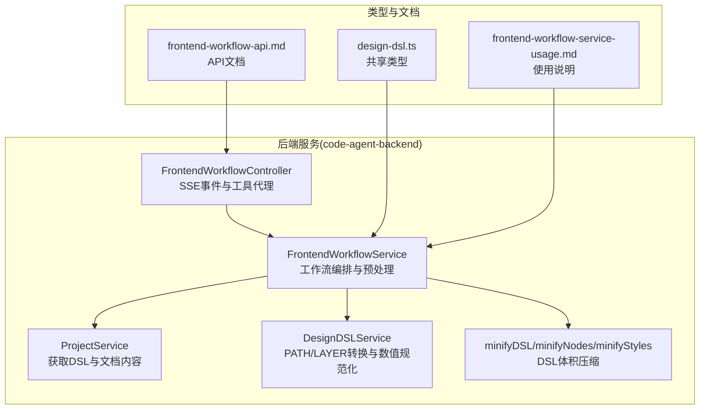
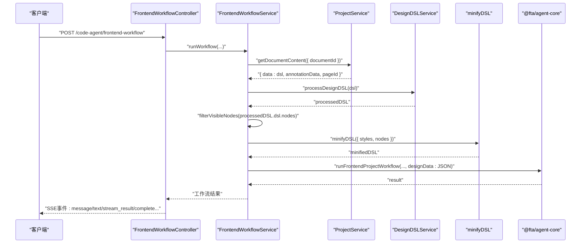
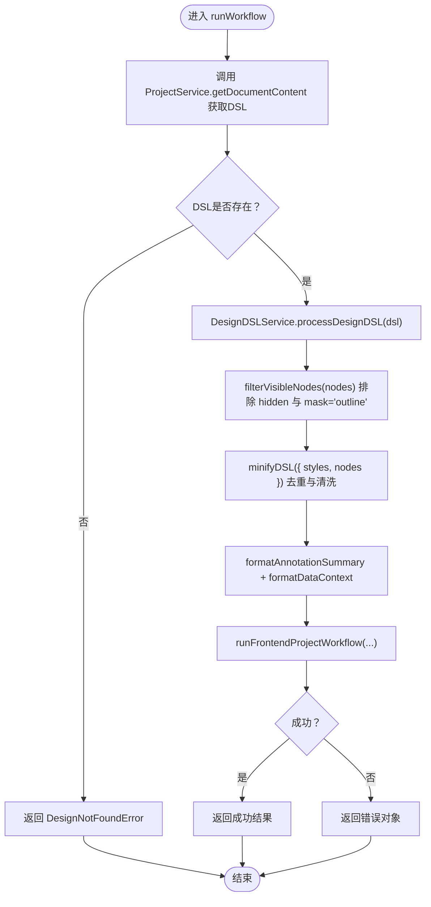
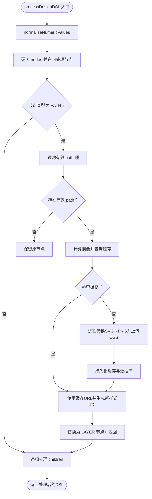
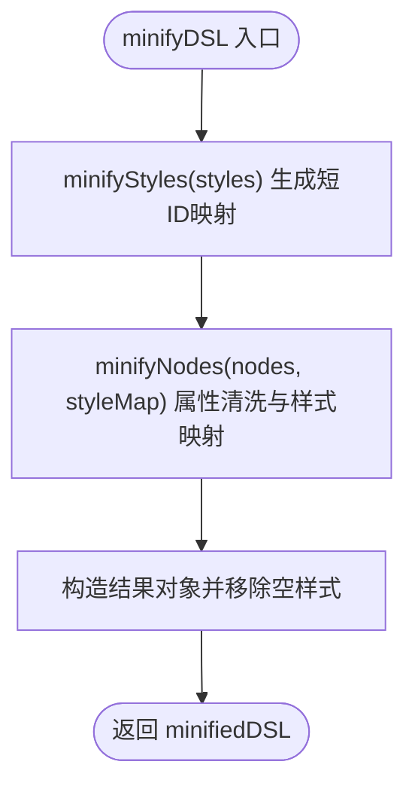
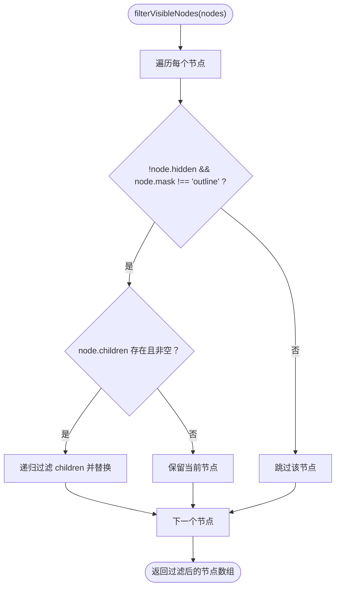
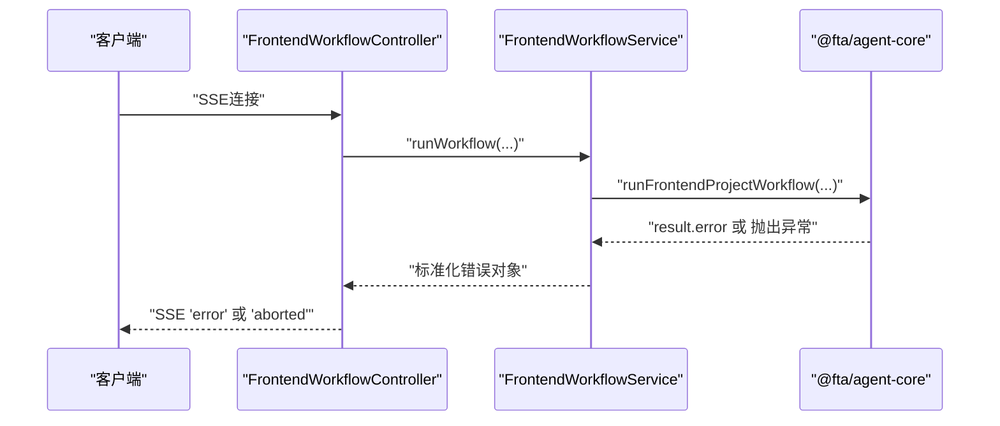
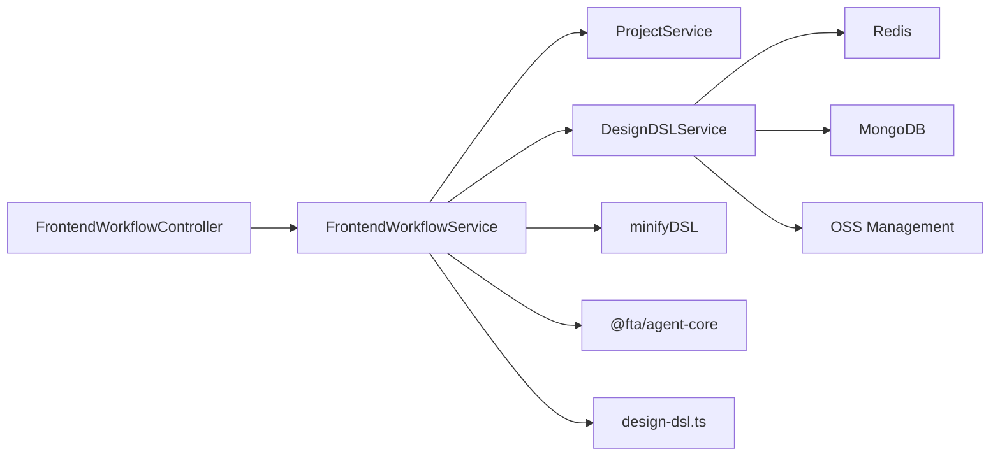

# DSL处理流程

<cite>
**本文引用的文件列表**
- [前端工作流服务 FrontendWorkflowService](file://code-agent-backend/src/service/code-agent/frontend-workflow.ts)
- [设计DSL处理服务 DesignDSLService](file://code-agent-backend/src/service/code-agent/design-dsl.ts)
- [项目服务 ProjectService](file://code-agent-backend/src/service/code-agent/project.ts)
- [最小化DSL工具 minifyDSL](file://code-agent-backend/src/utils/minify/index.ts)
- [最小化节点处理 minifyNodes](file://code-agent-backend/src/utils/minify/nodes.ts)
- [最小化样式处理 minifyStyles](file://code-agent-backend/src/utils/minify/styles.ts)
- [前端工作流控制器 FrontendWorkflowController](file://code-agent-backend/src/controller/code-agent/frontend-workflow.ts)
- [前端工作流DTO](file://code-agent-backend/src/dto/code-agent/frontend-workflow.dto.ts)
- [共享类型设计DSL类型定义](file://code-agent-backend/src/types/design-dsl.ts)
- [前端工作流使用说明](file://code-agent-backend/docs/frontend-workflow-service-usage.md)
- [前端工作流API文档](file://code-agent-backend/docs/frontend-workflow-api.md)
- [测试用例 test-minify](file://code-agent-backend/test/test-minify.ts)
- [布局设计前端DSL工具 nodeUtils](file://fta-layout-design/src/pages/EditorPage/utils/nodeUtils.ts)
</cite>

## 目录
1. [简介](#简介)
2. [项目结构](#项目结构)
3. [核心组件](#核心组件)
4. [架构总览](#架构总览)
5. [详细组件分析](#详细组件分析)
6. [依赖关系分析](#依赖关系分析)
7. [性能考量](#性能考量)
8. [故障排查指南](#故障排查指南)
9. [结论](#结论)

## 简介
本文档围绕前端工作流服务中的DSL数据获取与预处理流程展开，重点解释以下内容：
- 如何通过ProjectService.getDocumentContent获取原始DSL数据
- 如何通过DesignDSLService.processDesignDSL进行处理
- filterVisibleNodes私有方法的递归过滤逻辑（排除hidden节点与mask为'outline'的节点）
- minifyDSL工具函数在减小DSL体积方面的具体作用
- 处理大型DSL文档的性能优化建议
- DSL解析失败时的错误传播机制

## 项目结构
本仓库采用按功能域划分的服务化架构，前端工作流相关代码集中在code-agent-backend模块内，DSL处理与最小化工具位于utils/minify目录，前端控制器负责SSE事件推送与工具调用代理。

图表来源
- [前端工作流控制器 FrontendWorkflowController](file://code-agent-backend/src/controller/code-agent/frontend-workflow.ts#L1-L368)
- [前端工作流服务 FrontendWorkflowService](file://code-agent-backend/src/service/code-agent/frontend-workflow.ts#L1-L373)
- [项目服务 ProjectService](file://code-agent-backend/src/service/code-agent/project.ts#L600-L621)
- [设计DSL处理服务 DesignDSLService](file://code-agent-backend/src/service/code-agent/design-dsl.ts#L407-L420)
- [最小化DSL工具 minifyDSL](file://code-agent-backend/src/utils/minify/index.ts#L1-L46)
- [最小化节点处理 minifyNodes](file://code-agent-backend/src/utils/minify/nodes.ts#L1-L152)
- [最小化样式处理 minifyStyles](file://code-agent-backend/src/utils/minify/styles.ts#L1-L122)
- [共享类型设计DSL类型定义](file://code-agent-backend/src/types/design-dsl.ts#L1-L21)
- [前端工作流使用说明](file://code-agent-backend/docs/frontend-workflow-service-usage.md#L1-L244)
- [前端工作流API文档](file://code-agent-backend/docs/frontend-workflow-api.md#L1-L280)

章节来源
- [前端工作流控制器 FrontendWorkflowController](file://code-agent-backend/src/controller/code-agent/frontend-workflow.ts#L1-L368)
- [前端工作流服务 FrontendWorkflowService](file://code-agent-backend/src/service/code-agent/frontend-workflow.ts#L1-L373)
- [项目服务 ProjectService](file://code-agent-backend/src/service/code-agent/project.ts#L600-L621)
- [设计DSL处理服务 DesignDSLService](file://code-agent-backend/src/service/code-agent/design-dsl.ts#L407-L420)
- [最小化DSL工具 minifyDSL](file://code-agent-backend/src/utils/minify/index.ts#L1-L46)
- [最小化节点处理 minifyNodes](file://code-agent-backend/src/utils/minify/nodes.ts#L1-L152)
- [最小化样式处理 minifyStyles](file://code-agent-backend/src/utils/minify/styles.ts#L1-L122)
- [共享类型设计DSL类型定义](file://code-agent-backend/src/types/design-dsl.ts#L1-L21)
- [前端工作流使用说明](file://code-agent-backend/docs/frontend-workflow-service-usage.md#L1-L244)
- [前端工作流API文档](file://code-agent-backend/docs/frontend-workflow-api.md#L1-L280)

## 核心组件
- FrontendWorkflowService：封装前端项目生成工作流，负责获取DSL、处理DSL、过滤可见节点、最小化DSL、组装上下文并调用核心引擎。
- DesignDSLService：对DesignData进行数值规范化与PATH节点转换（PATH→LAYER），并提供统计信息。
- ProjectService：提供文档内容获取能力，返回包含DSL与注解摘要的数据结构。
- minifyDSL/minifyNodes/minifyStyles：对DSL的样式与节点进行去重、清洗与压缩，显著降低体积。
- FrontendWorkflowController：通过SSE向客户端推送事件，同时作为工具调用代理，将工具调用请求转发给前端工作流服务。

章节来源
- [前端工作流服务 FrontendWorkflowService](file://code-agent-backend/src/service/code-agent/frontend-workflow.ts#L1-L373)
- [设计DSL处理服务 DesignDSLService](file://code-agent-backend/src/service/code-agent/design-dsl.ts#L407-L420)
- [项目服务 ProjectService](file://code-agent-backend/src/service/code-agent/project.ts#L600-L621)
- [最小化DSL工具 minifyDSL](file://code-agent-backend/src/utils/minify/index.ts#L1-L46)
- [前端工作流控制器 FrontendWorkflowController](file://code-agent-backend/src/controller/code-agent/frontend-workflow.ts#L1-L368)

## 架构总览
前端工作流的执行链路如下：
- 控制器接收请求，建立SSE连接与中断信号
- 服务层先通过ProjectService获取文档内容（含DSL与注解）
- 使用DesignDSLService对DSL进行数值规范化与PATH→LAYER转换
- 进行可见性过滤（filterVisibleNodes），剔除hidden与mask为'outline'的节点
- 使用minifyDSL对样式与节点进行去重与清洗，进一步压缩体积
- 组装注解摘要与数据上下文，调用核心引擎生成前端项目
- 通过SSE事件向客户端回传进度、消息、文本、流式结果、完成状态等

图表来源
- [前端工作流控制器 FrontendWorkflowController](file://code-agent-backend/src/controller/code-agent/frontend-workflow.ts#L83-L309)
- [前端工作流服务 FrontendWorkflowService](file://code-agent-backend/src/service/code-agent/frontend-workflow.ts#L74-L279)
- [项目服务 ProjectService](file://code-agent-backend/src/service/code-agent/project.ts#L600-L621)
- [设计DSL处理服务 DesignDSLService](file://code-agent-backend/src/service/code-agent/design-dsl.ts#L407-L420)
- [最小化DSL工具 minifyDSL](file://code-agent-backend/src/utils/minify/index.ts#L1-L46)

## 详细组件分析

### 组件A：FrontendWorkflowService（DSL获取与预处理）
- 获取DSL数据
  - 通过ProjectService.getDocumentContent获取文档内容，返回包含DSL与注解摘要的对象；若DSL为空，直接返回错误。
- 处理DSL
  - 调用DesignDSLService.processDesignDSL进行数值规范化与PATH→LAYER转换。
- 可见性过滤
  - 私有方法filterVisibleNodes递归过滤节点，排除hidden为true或mask为'outline'的节点，并保留有效子树。
- 最小化DSL
  - 使用minifyDSL对样式与节点进行去重与清洗，减少体积。
- 组装上下文
  - 从注解数据生成摘要，结合数据模型与REST API形成工作流可用的文本上下文。
- 错误传播
  - 捕获异常并统一返回包含message与name的错误对象；若核心引擎返回error，也进行标准化。

图表来源
- [前端工作流服务 FrontendWorkflowService](file://code-agent-backend/src/service/code-agent/frontend-workflow.ts#L74-L279)
- [项目服务 ProjectService](file://code-agent-backend/src/service/code-agent/project.ts#L600-L621)
- [设计DSL处理服务 DesignDSLService](file://code-agent-backend/src/service/code-agent/design-dsl.ts#L407-L420)
- [最小化DSL工具 minifyDSL](file://code-agent-backend/src/utils/minify/index.ts#L1-L46)

章节来源
- [前端工作流服务 FrontendWorkflowService](file://code-agent-backend/src/service/code-agent/frontend-workflow.ts#L74-L279)
- [项目服务 ProjectService](file://code-agent-backend/src/service/code-agent/project.ts#L600-L621)
- [设计DSL处理服务 DesignDSLService](file://code-agent-backend/src/service/code-agent/design-dsl.ts#L407-L420)
- [最小化DSL工具 minifyDSL](file://code-agent-backend/src/utils/minify/index.ts#L1-L46)

### 组件B：DesignDSLService（PATH/LAYER转换与数值规范化）
- 数值规范化
  - 对DSL中的数值进行归一化处理，保证后续转换稳定性。
- PATH→LAYER转换
  - 递归遍历节点，遇到PATH节点时：
    - 过滤有效path项（含data）
    - 计算摘要并查询缓存，命中则直接返回缓存URL
    - 否则调用远程服务将SVG路径转为PNG并上传OSS，写入缓存与数据库
    - 生成新样式ID并替换为LAYER节点，保留布局样式
  - GROUP/FRAME/INSTANCE节点递归处理子节点
- 统计信息
  - 提供节点总数、PATH节点数、已转换节点数与样式数量统计

图表来源
- [设计DSL处理服务 DesignDSLService](file://code-agent-backend/src/service/code-agent/design-dsl.ts#L407-L420)
- [设计DSL处理服务 DesignDSLService](file://code-agent-backend/src/service/code-agent/design-dsl.ts#L333-L402)
- [设计DSL处理服务 DesignDSLService](file://code-agent-backend/src/service/code-agent/design-dsl.ts#L259-L331)

章节来源
- [设计DSL处理服务 DesignDSLService](file://code-agent-backend/src/service/code-agent/design-dsl.ts#L407-L420)
- [设计DSL处理服务 DesignDSLService](file://code-agent-backend/src/service/code-agent/design-dsl.ts#L333-L402)
- [设计DSL处理服务 DesignDSLService](file://code-agent-backend/src/service/code-agent/design-dsl.ts#L259-L331)

### 组件C：ProjectService（DSL数据获取）
- getDocumentContent
  - 根据documentId查询文档引用，返回包含DSL与注解数据的对象；若未找到返回null。
- 其他能力
  - 提供同步、更新、绑定项目上下文等文档管理能力，支撑工作流前置准备。

章节来源
- [项目服务 ProjectService](file://code-agent-backend/src/service/code-agent/project.ts#L600-L621)

### 组件D：minifyDSL（体积压缩）
- minifyStyles
  - 对styles进行去重与清洗，生成短ID映射，去除冗余字段，拆箱单一元素数组。
- minifyNodes
  - 对节点进行属性清洗与默认值剔除，映射样式引用，递归处理子节点。
- minifyDSL
  - 组合样式与节点的最小化结果，移除空样式，返回压缩后的DSL。

图表来源
- [最小化DSL工具 minifyDSL](file://code-agent-backend/src/utils/minify/index.ts#L1-L46)
- [最小化样式处理 minifyStyles](file://code-agent-backend/src/utils/minify/styles.ts#L1-L122)
- [最小化节点处理 minifyNodes](file://code-agent-backend/src/utils/minify/nodes.ts#L1-L152)

章节来源
- [最小化DSL工具 minifyDSL](file://code-agent-backend/src/utils/minify/index.ts#L1-L46)
- [最小化样式处理 minifyStyles](file://code-agent-backend/src/utils/minify/styles.ts#L1-L122)
- [最小化节点处理 minifyNodes](file://code-agent-backend/src/utils/minify/nodes.ts#L1-L152)

### 组件E：filterVisibleNodes（递归过滤逻辑）
- 过滤条件
  - 排除hidden为true的节点
  - 排除mask为'outline'的节点
- 递归策略
  - 若节点存在children且非空，则递归过滤子节点并保留有效子树
  - 否则直接保留当前节点

图表来源
- [前端工作流服务 FrontendWorkflowService](file://code-agent-backend/src/service/code-agent/frontend-workflow.ts#L281-L293)

章节来源
- [前端工作流服务 FrontendWorkflowService](file://code-agent-backend/src/service/code-agent/frontend-workflow.ts#L281-L293)

### 组件F：错误传播机制
- 控制器层
  - 捕获异常并发送SSE 'error'事件，包含message、stack、sessionId、executionTime等
  - 若为AbortError或信号中断，发送'SSE aborted'事件
- 服务层
  - 捕获异常并统一返回包含message与name的错误对象
  - 核心引擎返回的error也会被标准化为{ message, name }
- 工具调用代理
  - 通过tool_call事件触发工具执行，工具结果通过tool-result接口回传，错误通过isError标记区分

图表来源
- [前端工作流控制器 FrontendWorkflowController](file://code-agent-backend/src/controller/code-agent/frontend-workflow.ts#L314-L348)
- [前端工作流服务 FrontendWorkflowService](file://code-agent-backend/src/service/code-agent/frontend-workflow.ts#L246-L279)

章节来源
- [前端工作流控制器 FrontendWorkflowController](file://code-agent-backend/src/controller/code-agent/frontend-workflow.ts#L314-L348)
- [前端工作流服务 FrontendWorkflowService](file://code-agent-backend/src/service/code-agent/frontend-workflow.ts#L246-L279)

## 依赖关系分析
- FrontendWorkflowService依赖ProjectService与DesignDSLService，内部组合minifyDSL与@fta/agent-core
- DesignDSLService依赖Redis、MongoDB与OSS管理，用于路径缓存与持久化
- FrontendWorkflowController依赖FrontendWorkflowService，负责SSE事件与工具代理
- 类型定义来自共享类型包，确保前后端一致性

图表来源
- [前端工作流控制器 FrontendWorkflowController](file://code-agent-backend/src/controller/code-agent/frontend-workflow.ts#L1-L368)
- [前端工作流服务 FrontendWorkflowService](file://code-agent-backend/src/service/code-agent/frontend-workflow.ts#L1-L373)
- [设计DSL处理服务 DesignDSLService](file://code-agent-backend/src/service/code-agent/design-dsl.ts#L1-L201)
- [共享类型设计DSL类型定义](file://code-agent-backend/src/types/design-dsl.ts#L1-L21)

章节来源
- [前端工作流控制器 FrontendWorkflowController](file://code-agent-backend/src/controller/code-agent/frontend-workflow.ts#L1-L368)
- [前端工作流服务 FrontendWorkflowService](file://code-agent-backend/src/service/code-agent/frontend-workflow.ts#L1-L373)
- [设计DSL处理服务 DesignDSLService](file://code-agent-backend/src/service/code-agent/design-dsl.ts#L1-L201)
- [共享类型设计DSL类型定义](file://code-agent-backend/src/types/design-dsl.ts#L1-L21)

## 性能考量
- 大型DSL文档的处理建议
  - 使用minifyDSL对样式与节点进行去重与清洗，显著降低体积，减少序列化与网络传输成本
  - 在filterVisibleNodes阶段提前剔除不可见节点，减少后续处理与渲染压力
  - DesignDSLService的PATH→LAYER转换涉及远程服务与OSS上传，建议：
    - 合理利用缓存（Redis/Mongo），避免重复转换
    - 批量处理时复用样式映射，减少重复计算
  - 控制器层的SSE推送与工具代理需注意客户端断开的快速响应，避免资源泄露
- 性能监控
  - 建议在关键步骤记录耗时（如获取DSL、处理DSL、最小化、调用核心引擎），便于定位瓶颈

[本节为通用性能建议，无需特定文件引用]

## 故障排查指南
- 常见问题
  - 设计文档缺失或DSL为空：检查ProjectService.getDocumentContent返回值，确认documentId正确
  - PATH转换失败：查看DesignDSLService的远程转换与OSS上传日志，确认网络与鉴权配置
  - 工具调用超时：检查工具代理的callId生命周期与超时设置
  - 客户端中断：控制器会发送'aborted'事件，服务层捕获并返回标准化错误
- 定位手段
  - 查看SSE 'error'事件中的message与stack
  - 在服务层捕获异常并记录name、message、stack
  - 使用单元测试验证minifyDSL效果（参考test-minify）

章节来源
- [前端工作流控制器 FrontendWorkflowController](file://code-agent-backend/src/controller/code-agent/frontend-workflow.ts#L314-L348)
- [前端工作流服务 FrontendWorkflowService](file://code-agent-backend/src/service/code-agent/frontend-workflow.ts#L246-L279)
- [测试用例 test-minify](file://code-agent-backend/test/test-minify.ts#L1-L24)

## 结论
本文档梳理了前端工作流中DSL数据的获取与预处理全流程，明确了ProjectService、DesignDSLService、FrontendWorkflowService与minifyDSL之间的协作关系，深入解析了filterVisibleNodes的递归过滤逻辑与minifyDSL的体积压缩策略，并给出了处理大型DSL文档的性能优化建议与错误传播机制说明。开发者可据此在实际场景中高效、稳定地生成前端项目代码。