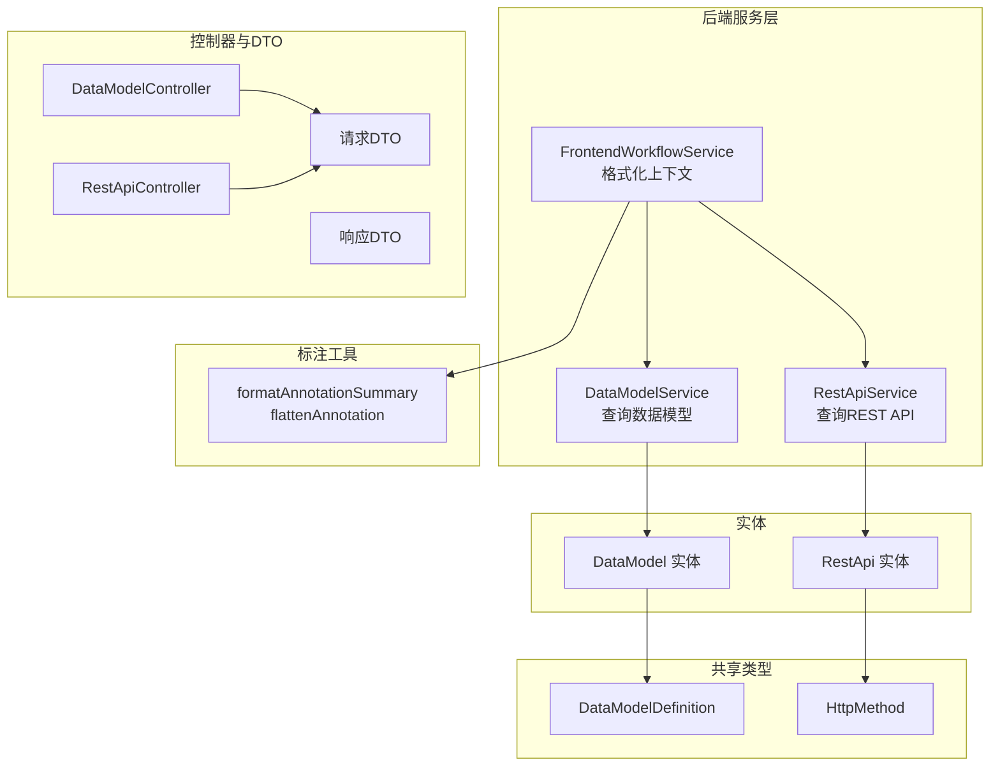
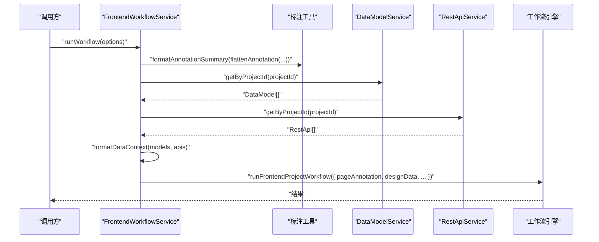
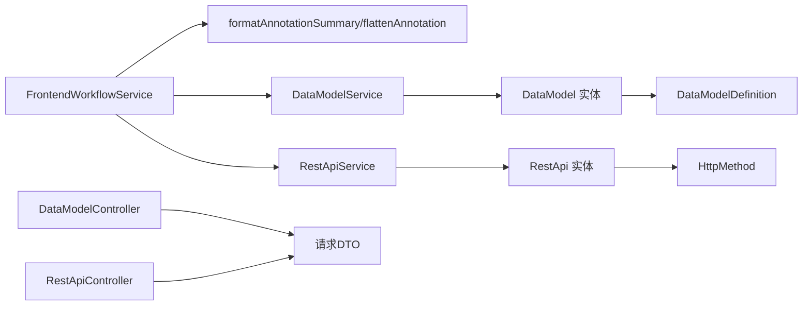

# 上下文格式化

<cite>
**本文引用的文件**
- [frontend-workflow.ts](file://code-agent-backend/src/service/code-agent/frontend-workflow.ts)
- [annotation.ts](file://fta-agent-core/src/utils/annotation.ts)
- [data-model.ts](file://code-agent-backend/src/entity/code-agent/data-model.ts)
- [rest-api.ts](file://code-agent-backend/src/entity/code-agent/rest-api.ts)
- [data-model.ts](file://code-agent-backend/src/service/code-agent/data-model.ts)
- [rest-api.ts](file://code-agent-backend/src/service/code-agent/rest-api.ts)
- [frontend-workflow.dto.ts](file://code-agent-backend/src/dto/code-agent/frontend-workflow.dto.ts)
- [req.ts](file://code-agent-backend/src/dto/code-agent/req.ts)
- [res.ts](file://code-agent-backend/src/dto/code-agent/res.ts)
- [data-model.ts](file://code-agent-backend/src/controller/code-agent/data-model.ts)
- [rest-api.ts](file://code-agent-backend/src/controller/code-agent/rest-api.ts)
- [dataModel.ts](file://shared-types/src/dataModel.ts)
- [restApi.ts](file://shared-types/src/restApi.ts)
</cite>

## 目录
1. [引言](#引言)
2. [项目结构](#项目结构)
3. [核心组件](#核心组件)
4. [架构总览](#架构总览)
5. [详细组件分析](#详细组件分析)
6. [依赖分析](#依赖分析)
7. [性能考虑](#性能考虑)
8. [故障排查指南](#故障排查指南)
9. [结论](#结论)
10. [附录](#附录)

## 引言
本文件聚焦于“上下文格式化”模块的技术实现，围绕三个私有方法展开：formatDataContext、formatDataModels、formatRestApis。目标是将数据库中的DataModel与RestApi实体转换为LLM可读的Markdown格式文本，并与组件标注摘要进行组合，形成fullPageContext，供前端工作流引擎消费。文档将深入解释：
- formatDataModels如何提取TypeScript接口定义并构建结构化文档；
- formatRestApis如何利用数据模型映射解析关联关系；
- 数据上下文与组件标注摘要的组合策略；
- 自定义上下文格式的扩展指南；
- 当数据模型为空时的优雅降级处理。

## 项目结构
与上下文格式化直接相关的代码分布在后端服务层与共享类型定义中：
- 后端服务层：负责从数据库加载DataModel与RestApi，并将其格式化为Markdown；
- 共享类型：统一DataModel与RestApi的字段定义；
- 控制器与DTO：对外暴露数据模型与REST API的增删改查接口；
- 标注工具：将页面标注拍平并格式化为摘要文本。

图表来源
- [frontend-workflow.ts](file://code-agent-backend/src/service/code-agent/frontend-workflow.ts#L1-L373)
- [data-model.ts](file://code-agent-backend/src/service/code-agent/data-model.ts#L1-L219)
- [rest-api.ts](file://code-agent-backend/src/service/code-agent/rest-api.ts#L1-L240)
- [data-model.ts](file://code-agent-backend/src/entity/code-agent/data-model.ts#L1-L55)
- [rest-api.ts](file://code-agent-backend/src/entity/code-agent/rest-api.ts#L1-L69)
- [dataModel.ts](file://shared-types/src/dataModel.ts#L1-L54)
- [restApi.ts](file://shared-types/src/restApi.ts#L1-L11)
- [data-model.ts](file://code-agent-backend/src/controller/code-agent/data-model.ts#L1-L125)
- [rest-api.ts](file://code-agent-backend/src/controller/code-agent/rest-api.ts#L1-L132)
- [annotation.ts](file://fta-agent-core/src/utils/annotation.ts#L1-L84)

章节来源
- [frontend-workflow.ts](file://code-agent-backend/src/service/code-agent/frontend-workflow.ts#L1-L373)
- [annotation.ts](file://fta-agent-core/src/utils/annotation.ts#L1-L84)

## 核心组件
- FrontendWorkflowService：封装上下文格式化与工作流调用，其中包含formatDataContext、formatDataModels、formatRestApis三个关键方法。
- DataModelService/RestApiService：提供按项目ID批量查询数据模型与REST API的能力。
- DataModel/RestApi实体：定义数据模型与REST API的字段结构。
- 共享类型：统一前后端对DataModel与HTTP方法类型的约定。
- 标注工具：将页面标注拍平并格式化为摘要文本，供fullPageContext拼接。

章节来源
- [frontend-workflow.ts](file://code-agent-backend/src/service/code-agent/frontend-workflow.ts#L295-L371)
- [data-model.ts](file://code-agent-backend/src/service/code-agent/data-model.ts#L140-L152)
- [rest-api.ts](file://code-agent-backend/src/service/code-agent/rest-api.ts#L151-L166)
- [data-model.ts](file://code-agent-backend/src/entity/code-agent/data-model.ts#L1-L55)
- [rest-api.ts](file://code-agent-backend/src/entity/code-agent/rest-api.ts#L1-L69)
- [dataModel.ts](file://shared-types/src/dataModel.ts#L1-L54)
- [restApi.ts](file://shared-types/src/restApi.ts#L1-L11)

## 架构总览
上下文格式化在前端工作流执行前完成，流程如下：
- 获取DSL与标注摘要；
- 查询项目关联的数据模型与REST API；
- 分别格式化为Markdown片段；
- 组合成fullPageContext（若无数据模型/REST API，则仅使用标注摘要）；
- 将fullPageContext与过滤后的DSL传递给工作流引擎。

图表来源
- [frontend-workflow.ts](file://code-agent-backend/src/service/code-agent/frontend-workflow.ts#L126-L173)
- [frontend-workflow.ts](file://code-agent-backend/src/service/code-agent/frontend-workflow.ts#L174-L222)
- [annotation.ts](file://fta-agent-core/src/utils/annotation.ts#L23-L48)
- [data-model.ts](file://code-agent-backend/src/service/code-agent/data-model.ts#L140-L152)
- [rest-api.ts](file://code-agent-backend/src/service/code-agent/rest-api.ts#L151-L166)

## 详细组件分析

### formatDataContext：数据上下文聚合
职责
- 将数据模型与REST API分别格式化为Markdown片段；
- 若任一集合为空，则跳过对应部分；
- 使用分隔符连接各片段，形成最终的上下文字符串。

实现要点
- 条件性格式化：仅当集合非空时才调用对应格式化方法；
- 分隔符：使用固定分隔线连接不同部分；
- 返回空字符串时，表示无可用数据上下文。

章节来源
- [frontend-workflow.ts](file://code-agent-backend/src/service/code-agent/frontend-workflow.ts#L298-L314)

### formatDataModels：TypeScript接口定义的结构化文档
职责
- 过滤掉tsContent为空的模型；
- 为每个有效模型生成标题、描述、ID等元信息；
- 以TypeScript代码块形式嵌入tsContent；
- 若无有效模型，返回空字符串。

复杂度与性能
- 时间复杂度：O(N)，N为数据模型数量；
- 空间复杂度：O(N)（输出字符串长度随模型数量增长）；
- 优化建议：若模型数量较大，可考虑分批输出或延迟渲染。

错误处理
- 当集合为空或全部tsContent为空时，返回空字符串，保证下游逻辑安全。

章节来源
- [frontend-workflow.ts](file://code-agent-backend/src/service/code-agent/frontend-workflow.ts#L319-L340)
- [data-model.ts](file://code-agent-backend/src/entity/code-agent/data-model.ts#L39-L41)

### formatRestApis：REST API与数据模型映射解析
职责
- 基于数据模型ID构建“ID->名称”的映射；
- 对每个API生成标题、描述、URL/方法、ID等元信息；
- 解析requestModelIds与responseModelIds，尝试以名称列表展示，若找不到映射则回退显示ID；
- 返回REST API部分的Markdown文本。

复杂度与性能
- 时间复杂度：O(M + K)，M为API数量，K为数据模型数量（构建映射）；
- 空间复杂度：O(K)（映射表）；
- 优化建议：若API数量巨大，可考虑分页或增量输出。

错误处理
- 映射缺失时回退显示ID，确保输出始终可用；
- 当集合为空时，返回空字符串。

章节来源
- [frontend-workflow.ts](file://code-agent-backend/src/service/code-agent/frontend-workflow.ts#L345-L371)
- [rest-api.ts](file://code-agent-backend/src/entity/code-agent/rest-api.ts#L48-L54)
- [data-model.ts](file://code-agent-backend/src/entity/code-agent/data-model.ts#L19-L29)

### fullPageContext：数据上下文与组件标注摘要的组合策略
职责
- 将标注摘要与数据上下文合并为最终的pageAnnotation；
- 若数据上下文为空，则仅使用标注摘要；
- 使用固定分隔符连接两部分，便于LLM区分来源。

实现要点
- 顺序：标注摘要在前，数据上下文在后；
- 分隔：使用标准分隔线，增强可读性；
- 降级：数据上下文为空时，不打断整体流程。

章节来源
- [frontend-workflow.ts](file://code-agent-backend/src/service/code-agent/frontend-workflow.ts#L169-L173)
- [annotation.ts](file://fta-agent-core/src/utils/annotation.ts#L23-L48)

### 数据模型与REST API的实体与服务
- DataModel实体包含id、projectId、groupId、name、description、tsContent、createdAt、updatedAt、userId等字段；
- RestApi实体包含id、projectId、groupId、name、description、url、method、requestModelIds、responseModelIds、createdAt、updatedAt、userId等字段；
- 服务层提供按项目ID批量查询、按ID查询、分组查询等能力；
- 控制器与DTO提供对外接口，支持CRUD操作与分页查询。

章节来源
- [data-model.ts](file://code-agent-backend/src/entity/code-agent/data-model.ts#L1-L55)
- [rest-api.ts](file://code-agent-backend/src/entity/code-agent/rest-api.ts#L1-L69)
- [data-model.ts](file://code-agent-backend/src/service/code-agent/data-model.ts#L140-L218)
- [rest-api.ts](file://code-agent-backend/src/service/code-agent/rest-api.ts#L151-L238)
- [data-model.ts](file://code-agent-backend/src/controller/code-agent/data-model.ts#L1-L125)
- [rest-api.ts](file://code-agent-backend/src/controller/code-agent/rest-api.ts#L1-L132)
- [req.ts](file://code-agent-backend/src/dto/code-agent/req.ts#L460-L551)
- [res.ts](file://code-agent-backend/src/dto/code-agent/res.ts#L201-L434)
- [dataModel.ts](file://shared-types/src/dataModel.ts#L1-L54)
- [restApi.ts](file://shared-types/src/restApi.ts#L1-L11)

### 标注摘要工具：flattenAnnotation与formatAnnotationSummary
- flattenAnnotation：将标注树拍平为节点概要数组，保留层级、尺寸、子节点数等信息；
- formatAnnotationSummary：将节点概要数组格式化为多行文本，便于LLM理解页面结构。

章节来源
- [annotation.ts](file://fta-agent-core/src/utils/annotation.ts#L23-L48)
- [annotation.ts](file://fta-agent-core/src/utils/annotation.ts#L55-L84)

## 依赖分析
- 前端工作流服务依赖标注工具以生成页面摘要；
- 前端工作流服务依赖数据模型与REST API服务以获取上下文数据；
- 数据模型与REST API服务依赖各自的实体模型；
- 控制器与DTO对外暴露数据访问接口；
- 共享类型确保前后端一致的字段定义。

图表来源
- [frontend-workflow.ts](file://code-agent-backend/src/service/code-agent/frontend-workflow.ts#L126-L173)
- [annotation.ts](file://fta-agent-core/src/utils/annotation.ts#L23-L48)
- [data-model.ts](file://code-agent-backend/src/service/code-agent/data-model.ts#L140-L152)
- [rest-api.ts](file://code-agent-backend/src/service/code-agent/rest-api.ts#L151-L166)
- [data-model.ts](file://code-agent-backend/src/entity/code-agent/data-model.ts#L1-L55)
- [rest-api.ts](file://code-agent-backend/src/entity/code-agent/rest-api.ts#L1-L69)
- [data-model.ts](file://code-agent-backend/src/controller/code-agent/data-model.ts#L1-L125)
- [rest-api.ts](file://code-agent-backend/src/controller/code-agent/rest-api.ts#L1-L132)
- [dataModel.ts](file://shared-types/src/dataModel.ts#L1-L54)
- [restApi.ts](file://shared-types/src/restApi.ts#L1-L11)

## 性能考虑
- 复杂度控制：formatDataModels与formatRestApis均为线性复杂度，适合大规模数据；
- 内存占用：输出字符串长度与模型数量成正比，建议在上游限制最大输出长度；
- 并发查询：项目查询数据模型与REST API已采用并发Promise，减少等待时间；
- 降级策略：当集合为空时返回空字符串，避免无效渲染与LLM困惑。

[本节为通用指导，无需特定文件引用]

## 故障排查指南
常见问题与定位
- 数据模型为空：formatDataModels返回空字符串，fullPageContext仅包含标注摘要；检查DataModelService的查询条件与权限；
- REST API为空：formatRestApis返回空字符串，不影响标注摘要；检查RestApiService的查询条件与权限；
- 标注为空：formatAnnotationSummary返回默认提示文本；确认DSL解析与标注生成是否正常；
- 组合后仍为空：若两者均为空，fullPageContext为空字符串，需检查上游数据准备逻辑。

章节来源
- [frontend-workflow.ts](file://code-agent-backend/src/service/code-agent/frontend-workflow.ts#L126-L173)
- [frontend-workflow.ts](file://code-agent-backend/src/service/code-agent/frontend-workflow.ts#L298-L314)
- [annotation.ts](file://fta-agent-core/src/utils/annotation.ts#L23-L48)

## 结论
- formatDataContext、formatDataModels、formatRestApis共同构成数据上下文的格式化管线；
- formatDataModels专注于TypeScript接口的结构化呈现，确保LLM可直接解析；
- formatRestApis通过ID->名称映射，将API与数据模型建立语义关联；
- fullPageContext的组合策略保证了标注与数据上下文的清晰分离与可读性；
- 当数据模型为空时，系统优雅降级，仅保留标注摘要，保障工作流继续执行。

[本节为总结，无需特定文件引用]

## 附录

### 扩展指南：自定义上下文格式
- 新增字段：在实体与服务层增加新字段后，可在formatDataModels或formatRestApis中追加对应元信息输出；
- 自定义分隔符：修改formatDataContext中的分隔符，以适配不同LLM的偏好；
- 自定义Markdown结构：在formatDataModels中调整标题层级与代码块包装方式；
- 自定义映射策略：在formatRestApis中扩展ID->名称映射逻辑，例如支持多语言名称或分组前缀；
- 输出裁剪：在上游限制最大模型/API数量，或在下游对输出进行截断，避免超长上下文。

章节来源
- [frontend-workflow.ts](file://code-agent-backend/src/service/code-agent/frontend-workflow.ts#L298-L371)

### 数据模型为空时的优雅降级
- 当数据模型集合为空时，formatDataModels返回空字符串；
- formatDataContext会跳过数据模型部分；
- fullPageContext仅包含标注摘要，确保工作流继续执行。

章节来源
- [frontend-workflow.ts](file://code-agent-backend/src/service/code-agent/frontend-workflow.ts#L298-L314)
- [frontend-workflow.ts](file://code-agent-backend/src/service/code-agent/frontend-workflow.ts#L169-L173)