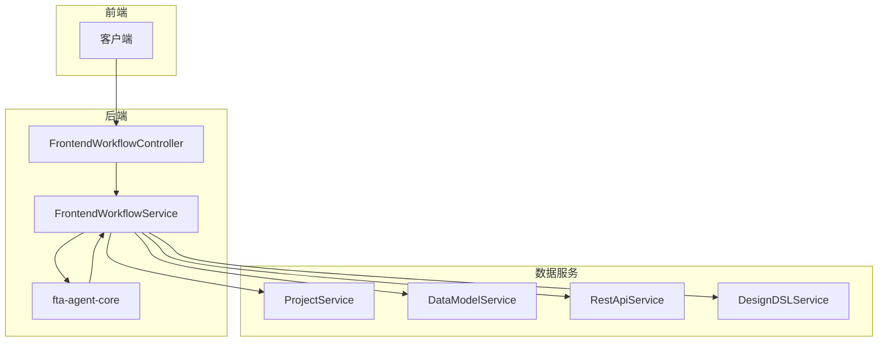
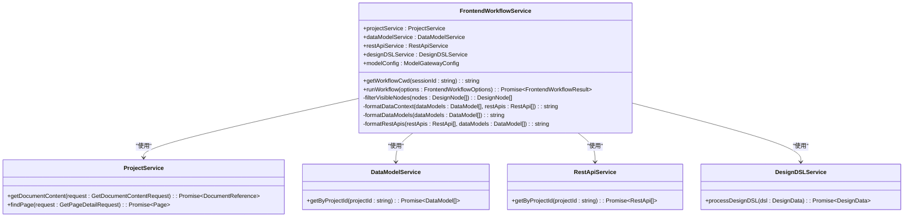
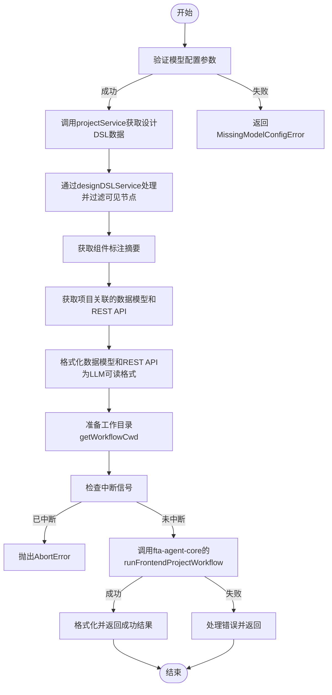
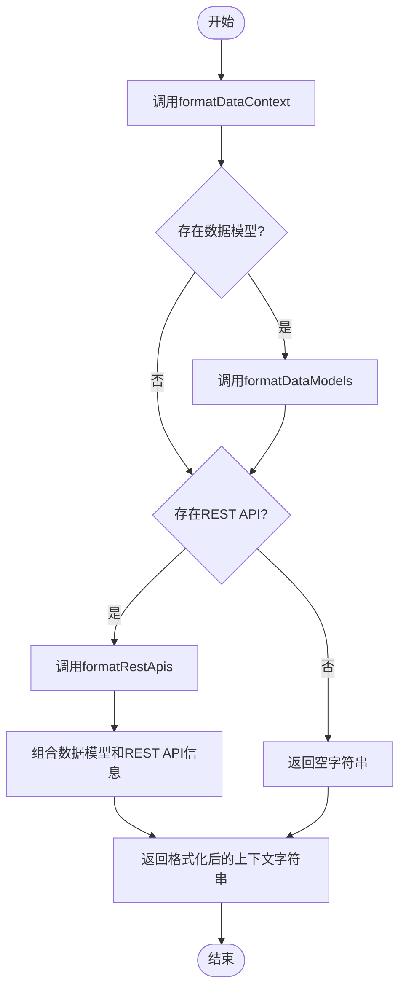
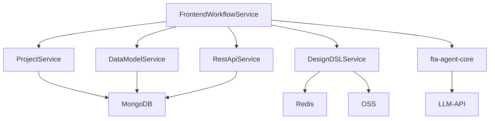

# 前端工作流服务

<cite>
**本文档引用文件**   
- [frontend-workflow.service.ts](file://code-agent-backend/src/service/code-agent/frontend-workflow.ts)
- [frontend-workflow.controller.ts](file://code-agent-backend/src/controller/code-agent/frontend-workflow.ts)
- [project.ts](file://code-agent-backend/src/service/code-agent/project.ts)
- [data-model.ts](file://code-agent-backend/src/service/code-agent/data-model.ts)
- [rest-api.ts](file://code-agent-backend/src/service/code-agent/rest-api.ts)
- [design-dsl.ts](file://code-agent-backend/src/service/code-agent/design-dsl.ts)
- [frontendProjectService.ts](file://fta-agent-core/src/frontendProjectService.ts)
</cite>

## 目录
1. [简介](#简介)
2. [项目结构](#项目结构)
3. [核心组件](#核心组件)
4. [架构概述](#架构概述)
5. [详细组件分析](#详细组件分析)
6. [依赖分析](#依赖分析)
7. [性能考虑](#性能考虑)
8. [故障排除指南](#故障排除指南)
9. [结论](#结论)

## 简介
本文档深入解析前端工作流服务层的业务逻辑实现，重点聚焦于`FrontendWorkflowService`类的`runWorkflow`方法执行流程。文档详细阐述了从模型配置验证、设计DSL数据获取与处理、上下文信息整合，到调用核心引擎生成前端代码的完整过程。同时，文档还说明了异常处理策略和在不同场景下的服务复用方法，为开发者提供全面的技术指导。

## 项目结构
项目采用分层架构设计，主要分为控制器层、服务层、实体层和工具层。前端工作流相关的核心逻辑位于`code-agent-backend/src/service/code-agent/`目录下，其中`frontend-workflow.ts`是本服务的主入口文件。该服务依赖于`projectService`、`dataModelService`、`restApiService`和`designDSLService`等多个子服务来完成复杂的业务处理。

**Section sources**
- [frontend-workflow.service.ts](file://code-agent-backend/src/service/code-agent/frontend-workflow.ts)

## 核心组件
`FrontendWorkflowService`是前端工作流的核心服务类，负责协调整个前端项目生成流程。它通过注入多个依赖服务，实现了从设计文档到可运行前端代码的自动化转换。该服务的关键方法`runWorkflow`定义了完整的执行流程，包括参数验证、数据准备、上下文构建和核心引擎调用。

**Section sources**
- [frontend-workflow.service.ts](file://code-agent-backend/src/service/code-agent/frontend-workflow.ts#L48-L278)

## 架构概述
前端工作流服务采用典型的分层架构模式，将HTTP/SSE处理逻辑与核心业务逻辑分离。控制器层负责处理客户端请求和SSE事件推送，而服务层则专注于业务流程的实现。这种设计确保了服务的可测试性和可复用性，使其不仅可以在HTTP请求中使用，还可以在队列任务或其他服务中被调用。

**Diagram sources **
- [frontend-workflow.controller.ts](file://code-agent-backend/src/controller/code-agent/frontend-workflow.ts#L27-L368)
- [frontend-workflow.service.ts](file://code-agent-backend/src/service/code-agent/frontend-workflow.ts#L48-L278)

## 详细组件分析

### FrontendWorkflowService 分析
`FrontendWorkflowService`类是前端工作流服务的核心实现，它通过组合多个子服务来完成复杂的业务逻辑。该服务的主要职责是协调整个前端项目生成流程，从接收请求参数到最终调用核心引擎生成代码。

#### 服务类图

**Diagram sources **
- [frontend-workflow.service.ts](file://code-agent-backend/src/service/code-agent/frontend-workflow.ts#L48-L278)

#### runWorkflow 方法执行流程
`runWorkflow`方法是前端工作流服务的核心，它定义了从接收到请求到生成前端代码的完整执行流程。该方法首先验证必要的模型配置参数，然后依次获取和处理各种数据，最后调用核心引擎生成代码。

**Diagram sources **
- [frontend-workflow.service.ts](file://code-agent-backend/src/service/code-agent/frontend-workflow.ts#L74-L278)

### 私有方法分析
`FrontendWorkflowService`类包含多个私有方法，用于将数据库实体转换为LLM可读的文本格式。这些方法在准备上下文信息时被调用，确保核心引擎能够理解项目的数据结构和API定义。

#### 数据上下文格式化流程

**Diagram sources **
- [frontend-workflow.service.ts](file://code-agent-backend/src/service/code-agent/frontend-workflow.ts#L298-L313)

## 依赖分析
`FrontendWorkflowService`依赖于多个内部服务和外部库来完成其功能。这些依赖关系确保了服务的模块化和可维护性，同时也明确了各组件之间的职责边界。

**Diagram sources **
- [frontend-workflow.service.ts](file://code-agent-backend/src/service/code-agent/frontend-workflow.ts#L49-L62)
- [package.json](file://code-agent-backend/package.json#L27)

## 性能考虑
前端工作流服务在设计时考虑了多项性能优化措施。首先，通过Redis缓存设计DSL中的路径转换结果，避免了重复的图像处理操作。其次，服务采用异步并行处理方式获取数据模型和REST API，减少了总的等待时间。此外，服务还实现了中断信号处理机制，允许在长时间运行的任务中及时响应客户端的取消请求，避免资源浪费。

## 故障排除指南
当遇到前端工作流执行失败时，可以按照以下步骤进行排查：

1. **检查模型配置参数**：确保`apiKey`和`baseURL`已正确配置，这些参数是调用LLM API的必要条件。
2. **验证设计文档存在性**：确认提供的`designDocId`对应的设计文档存在且包含有效的DSL数据。
3. **检查数据模型和REST API**：虽然获取这些数据是可选的，但如果项目需要它们，应确保相关数据已正确关联。
4. **查看日志输出**：服务在执行过程中会输出详细的日志信息，包括各个阶段的耗时和错误详情，这些信息对于定位问题非常有帮助。
5. **监控资源使用情况**：长时间运行的工作流可能会消耗大量计算资源，应监控服务器的CPU、内存和网络使用情况。

**Section sources**
- [frontend-workflow.service.ts](file://code-agent-backend/src/service/code-agent/frontend-workflow.ts#L258-L277)

## 结论
`FrontendWorkflowService`是一个功能强大且设计良好的服务类，它通过清晰的职责划分和模块化设计，实现了从前端设计到代码生成的自动化流程。该服务不仅能够处理复杂的业务逻辑，还具备良好的可扩展性和可复用性，可以在多种场景下被调用。通过深入理解其内部实现和执行流程，开发者可以更好地利用该服务来提升开发效率和代码质量。