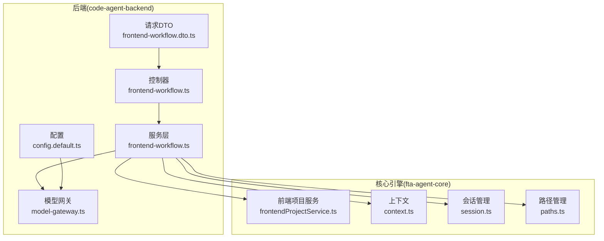
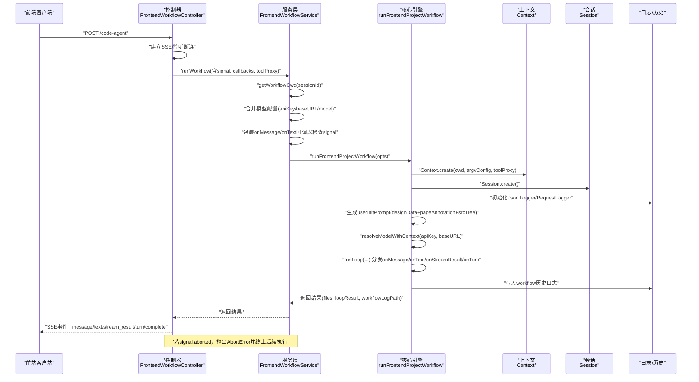
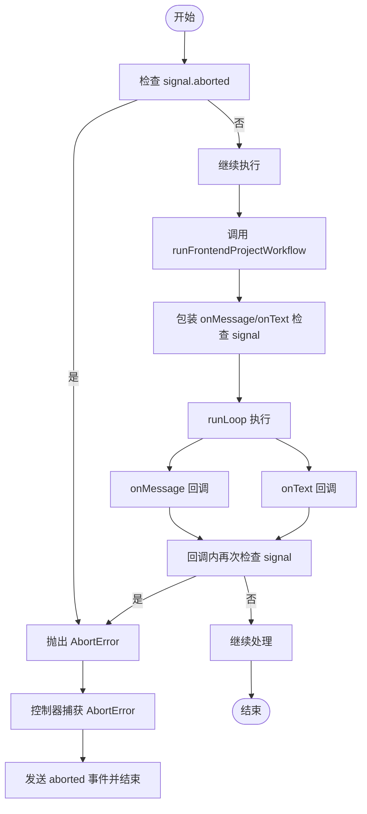
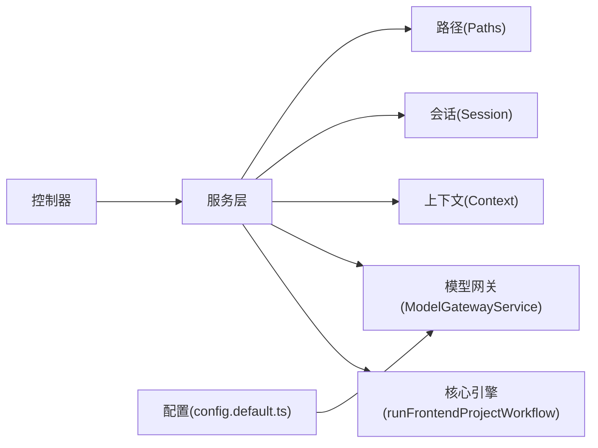

# 核心工作流执行

<cite>
**本文引用的文件**
- [code-agent-backend/src/controller/code-agent/frontend-workflow.ts](file://code-agent-backend/src/controller/code-agent/frontend-workflow.ts)
- [code-agent-backend/src/service/code-agent/frontend-workflow.ts](file://code-agent-backend/src/service/code-agent/frontend-workflow.ts)
- [code-agent-backend/src/dto/code-agent/frontend-workflow.dto.ts](file://code-agent-backend/src/dto/code-agent/frontend-workflow.dto.ts)
- [code-agent-backend/src/config/config.default.ts](file://code-agent-backend/src/config/config.default.ts)
- [code-agent-backend/src/service/common/model-gateway.ts](file://code-agent-backend/src/service/common/model-gateway.ts)
- [fta-agent-core/src/frontendProjectService.ts](file://fta-agent-core/src/frontendProjectService.ts)
- [fta-agent-core/src/context.ts](file://fta-agent-core/src/context.ts)
- [fta-agent-core/src/session.ts](file://fta-agent-core/src/session.ts)
- [fta-agent-core/src/paths.ts](file://fta-agent-core/src/paths.ts)
</cite>

## 目录
1. [简介](#简介)
2. [项目结构](#项目结构)
3. [核心组件](#核心组件)
4. [架构总览](#架构总览)
5. [详细组件分析](#详细组件分析)
6. [依赖关系分析](#依赖关系分析)
7. [性能考量](#性能考量)
8. [故障排查指南](#故障排查指南)
9. [结论](#结论)
10. [附录](#附录)

## 简介
本技术文档聚焦于“前端工作流”在后端与核心引擎之间的执行机制，围绕以下关键点展开：
- runWorkflow 方法如何调用 fta-agent-core 的 runFrontendProjectWorkflow，并在其中传递 designData、pageAnnotation 与模型配置。
- getWorkflowCwd 如何为每个会话创建隔离的工作目录。
- signal 信号量在实现工作流中断（AbortError）中的作用机制，以及回调函数包装器如何在 onMessage 和 onText 回调中传播中断信号。
- apiKey、baseURL 等模型网关配置的优先级策略（参数 > 配置文件）。
- 集成自定义回调处理器的最佳实践。

## 项目结构
后端采用 MidwayJS 框架，控制器负责接收请求、建立 SSE 通道、处理客户端断连；服务层负责组装参数、构造工作目录、注入回调包装器、调用核心引擎；核心引擎位于 fta-agent-core，负责实际的前端项目生成流程。

图表来源
- [code-agent-backend/src/controller/code-agent/frontend-workflow.ts](file://code-agent-backend/src/controller/code-agent/frontend-workflow.ts#L83-L367)
- [code-agent-backend/src/service/code-agent/frontend-workflow.ts](file://code-agent-backend/src/service/code-agent/frontend-workflow.ts#L67-L222)
- [code-agent-backend/src/config/config.default.ts](file://code-agent-backend/src/config/config.default.ts#L214-L229)
- [code-agent-backend/src/service/common/model-gateway.ts](file://code-agent-backend/src/service/common/model-gateway.ts#L36-L120)
- [fta-agent-core/src/frontendProjectService.ts](file://fta-agent-core/src/frontendProjectService.ts#L139-L349)
- [fta-agent-core/src/context.ts](file://fta-agent-core/src/context.ts#L57-L84)
- [fta-agent-core/src/session.ts](file://fta-agent-core/src/session.ts#L1-L34)
- [fta-agent-core/src/paths.ts](file://fta-agent-core/src/paths.ts#L24-L44)

章节来源
- [code-agent-backend/src/controller/code-agent/frontend-workflow.ts](file://code-agent-backend/src/controller/code-agent/frontend-workflow.ts#L83-L367)
- [code-agent-backend/src/service/code-agent/frontend-workflow.ts](file://code-agent-backend/src/service/code-agent/frontend-workflow.ts#L67-L222)
- [fta-agent-core/src/frontendProjectService.ts](file://fta-agent-core/src/frontendProjectService.ts#L139-L349)

## 核心组件
- 控制器 FrontendWorkflowController：建立 SSE 通道、监听客户端断连、封装 toolProxy、分发回调事件。
- 服务层 FrontendWorkflowService：准备工作目录、构造 designData/pageAnnotation、合并模型配置、包装回调以传播中断信号、调用核心引擎。
- 核心引擎 runFrontendProjectWorkflow：创建 Context/Session、加载提示词与规范、解析模型、运行循环、记录日志与历史。
- 模型网关 ModelGatewayService：统一模型调用、抽取文本与用量、流式处理。
- 配置 config.default.ts：提供模型网关默认配置（来自环境变量）。

章节来源
- [code-agent-backend/src/controller/code-agent/frontend-workflow.ts](file://code-agent-backend/src/controller/code-agent/frontend-workflow.ts#L83-L367)
- [code-agent-backend/src/service/code-agent/frontend-workflow.ts](file://code-agent-backend/src/service/code-agent/frontend-workflow.ts#L67-L222)
- [fta-agent-core/src/frontendProjectService.ts](file://fta-agent-core/src/frontendProjectService.ts#L139-L349)
- [code-agent-backend/src/service/common/model-gateway.ts](file://code-agent-backend/src/service/common/model-gateway.ts#L36-L120)
- [code-agent-backend/src/config/config.default.ts](file://code-agent-backend/src/config/config.default.ts#L214-L229)

## 架构总览
下图展示从前端请求到核心引擎执行的关键调用链路，以及信号中断与回调传播的机制。

图表来源
- [code-agent-backend/src/controller/code-agent/frontend-workflow.ts](file://code-agent-backend/src/controller/code-agent/frontend-workflow.ts#L138-L309)
- [code-agent-backend/src/service/code-agent/frontend-workflow.ts](file://code-agent-backend/src/service/code-agent/frontend-workflow.ts#L156-L222)
- [fta-agent-core/src/frontendProjectService.ts](file://fta-agent-core/src/frontendProjectService.ts#L139-L349)
- [fta-agent-core/src/context.ts](file://fta-agent-core/src/context.ts#L57-L84)
- [fta-agent-core/src/session.ts](file://fta-agent-core/src/session.ts#L1-L34)
- [fta-agent-core/src/paths.ts](file://fta-agent-core/src/paths.ts#L24-L44)

## 详细组件分析

### getWorkflowCwd：为每个会话创建隔离工作目录
- 作用：为当前 sessionId 生成独立的工作目录，确保多会话并行时互不干扰。
- 实现要点：
  - 使用 process.cwd() 作为根路径，拼接固定子路径与 sessionId。
  - 该目录用于核心引擎的 Context 初始化，作为项目工作区与日志存储的基础。
- 影响范围：影响 Context.create 的 cwd 参数，进而影响 Paths 的全局项目目录与会话日志路径。

章节来源
- [code-agent-backend/src/service/code-agent/frontend-workflow.ts](file://code-agent-backend/src/service/code-agent/frontend-workflow.ts#L67-L69)
- [fta-agent-core/src/context.ts](file://fta-agent-core/src/context.ts#L57-L84)
- [fta-agent-core/src/paths.ts](file://fta-agent-core/src/paths.ts#L24-L44)

### runFrontendProjectWorkflow 参数构造策略
- designData：由服务层将 DSL 数据最小化后序列化为字符串，作为“设计DSL”部分传入。
- pageAnnotation：由服务层将注释摘要与数据上下文（数据模型 + REST API）组合，作为“页面标注”部分传入。
- 模型配置：
  - 优先使用 runWorkflow 接收的 apiKey/baseURL/model。
  - 若未提供，则回退到配置文件中的 modelGateway.default。
  - 若仍缺失，直接返回错误。
- 其他关键参数：
  - cwd：来自 getWorkflowCwd(sessionId)。
  - specDirectories/componentDocDirectories：指向内置规范与组件文档目录。
  - promptFilePath：指向新提示词文件。
  - configOverrides：覆盖模型与计划模型。
  - callbacks：可被服务层包装以传播中断信号。
  - toolProxy：由控制器提供，用于与前端交互式工具调用。

章节来源
- [code-agent-backend/src/service/code-agent/frontend-workflow.ts](file://code-agent-backend/src/service/code-agent/frontend-workflow.ts#L156-L222)
- [code-agent-backend/src/dto/code-agent/frontend-workflow.dto.ts](file://code-agent-backend/src/dto/code-agent/frontend-workflow.dto.ts#L1-L60)
- [fta-agent-core/src/frontendProjectService.ts](file://fta-agent-core/src/frontendProjectService.ts#L139-L349)

### signal 信号量与中断传播机制
- 何时触发：控制器在建立 SSE 连接后创建 AbortController，并将其 signal 传给服务层；服务层在关键位置检查 signal.aborted 并抛出 AbortError。
- 回调包装：
  - 服务层在 callbacks 上包装 onMessage 与 onText，每次回调前检查 signal.aborted，若为真则抛出 AbortError。
  - 这样保证了即使核心引擎内部回调被调用，也能及时感知外部中断。
- 控制器层面：
  - 监听客户端断连事件，设置 abortController.signal。
  - 捕获 AbortError 并向前端发送 aborted 事件。
- 语义：
  - AbortError 表示用户主动中断工作流，控制器与服务层均按此语义处理。

图表来源
- [code-agent-backend/src/controller/code-agent/frontend-workflow.ts](file://code-agent-backend/src/controller/code-agent/frontend-workflow.ts#L117-L137)
- [code-agent-backend/src/service/code-agent/frontend-workflow.ts](file://code-agent-backend/src/service/code-agent/frontend-workflow.ts#L159-L218)

章节来源
- [code-agent-backend/src/controller/code-agent/frontend-workflow.ts](file://code-agent-backend/src/controller/code-agent/frontend-workflow.ts#L117-L137)
- [code-agent-backend/src/service/code-agent/frontend-workflow.ts](file://code-agent-backend/src/service/code-agent/frontend-workflow.ts#L159-L218)

### 回调函数包装器：在 onMessage 与 onText 中传播中断信号
- 包装策略：
  - 若存在 callbacks.onMessage/onText，则在每次回调前检查 signal.aborted。
  - 若为真，立即抛出 AbortError，使上层捕获并处理。
- 作用：
  - 确保在核心引擎内部回调阶段也能及时响应外部中断。
  - 与控制器的断连监听形成闭环。

章节来源
- [code-agent-backend/src/service/code-agent/frontend-workflow.ts](file://code-agent-backend/src/service/code-agent/frontend-workflow.ts#L192-L218)

### 模型网关配置优先级策略（参数 > 配置文件）
- 优先级顺序：
  1) runWorkflow 接收的 apiKey/baseURL/model（最高优先级）
  2) 配置文件 modelGateway.default（次之）
  3) 两者都缺失时，直接返回错误
- 配置来源：
  - 配置文件从环境变量读取默认值，如 OPENAI_BASE_URL、OPENAI_API_KEY、OPENAI_MODEL、MODEL_TIMEOUT、MODEL_TEMPERATURE 等。

章节来源
- [code-agent-backend/src/service/code-agent/frontend-workflow.ts](file://code-agent-backend/src/service/code-agent/frontend-workflow.ts#L78-L95)
- [code-agent-backend/src/config/config.default.ts](file://code-agent-backend/src/config/config.default.ts#L214-L229)

### 集成自定义回调处理器的最佳实践
- 建议在控制器中提供 callbacks，并在服务层进行包装，以统一处理中断信号。
- onMessage/onText/onStreamResult/onTurn/onChunk/onToolApprove 均可按需实现。
- 若需与前端交互工具调用，使用控制器提供的 toolProxy，通过 SSE 的 tool_call 事件与前端通信。
- 注意：
  - 在回调中避免阻塞，必要时异步处理。
  - 对 onMessage/onText 的包装应尽量轻量，避免引入额外延迟。
  - 对 onToolApprove 可根据工具类别决定是否自动批准，但建议在生产环境谨慎放行。

章节来源
- [code-agent-backend/src/controller/code-agent/frontend-workflow.ts](file://code-agent-backend/src/controller/code-agent/frontend-workflow.ts#L196-L287)
- [code-agent-backend/src/service/code-agent/frontend-workflow.ts](file://code-agent-backend/src/service/code-agent/frontend-workflow.ts#L192-L218)

## 依赖关系分析
- 控制器依赖服务层与模型网关，服务层依赖核心引擎与上下文/会话/路径管理。
- 核心引擎内部依赖 Context/Session/Paths，以及 LLMsContext、runLoop、工具集等。
- 配置文件提供模型网关默认值，供服务层在参数缺失时回退使用。

图表来源
- [code-agent-backend/src/controller/code-agent/frontend-workflow.ts](file://code-agent-backend/src/controller/code-agent/frontend-workflow.ts#L83-L367)
- [code-agent-backend/src/service/code-agent/frontend-workflow.ts](file://code-agent-backend/src/service/code-agent/frontend-workflow.ts#L67-L222)
- [code-agent-backend/src/config/config.default.ts](file://code-agent-backend/src/config/config.default.ts#L214-L229)
- [code-agent-backend/src/service/common/model-gateway.ts](file://code-agent-backend/src/service/common/model-gateway.ts#L36-L120)
- [fta-agent-core/src/frontendProjectService.ts](file://fta-agent-core/src/frontendProjectService.ts#L139-L349)
- [fta-agent-core/src/context.ts](file://fta-agent-core/src/context.ts#L57-L84)
- [fta-agent-core/src/session.ts](file://fta-agent-core/src/session.ts#L1-L34)
- [fta-agent-core/src/paths.ts](file://fta-agent-core/src/paths.ts#L24-L44)

章节来源
- [code-agent-backend/src/controller/code-agent/frontend-workflow.ts](file://code-agent-backend/src/controller/code-agent/frontend-workflow.ts#L83-L367)
- [code-agent-backend/src/service/code-agent/frontend-workflow.ts](file://code-agent-backend/src/service/code-agent/frontend-workflow.ts#L67-L222)
- [code-agent-backend/src/config/config.default.ts](file://code-agent-backend/src/config/config.default.ts#L214-L229)

## 性能考量
- 回调包装与信号检查为轻量操作，不会显著增加延迟。
- runLoop 的 onText/onChunk/onStreamResult 会频繁触发，建议在回调中避免重型同步操作。
- 日志与历史写入为磁盘 I/O，建议控制日志粒度，避免过度冗余。
- toolProxy 的超时控制与清理有助于防止资源泄露。

## 故障排查指南
- 中断问题：
  - 若前端断开连接，控制器会设置 abortController.signal，并在服务层与核心引擎回调处抛出 AbortError。
  - 检查控制器的断连监听与 finally 清理逻辑是否正常执行。
- 模型配置缺失：
  - 当 apiKey/baseURL 任一缺失时，服务层会返回错误并提示通过参数或配置文件提供。
  - 检查环境变量与配置文件是否正确设置。
- 工具调用：
  - tool_call 事件由控制器发出，前端需在收到后执行相应工具并返回 tool_result。
  - 若长时间无响应，控制器侧会超时并清理 pendingToolCalls。

章节来源
- [code-agent-backend/src/controller/code-agent/frontend-workflow.ts](file://code-agent-backend/src/controller/code-agent/frontend-workflow.ts#L138-L195)
- [code-agent-backend/src/service/code-agent/frontend-workflow.ts](file://code-agent-backend/src/service/code-agent/frontend-workflow.ts#L78-L95)

## 结论
本文梳理了从前端请求到核心引擎执行的完整链路，明确了：
- 工作目录隔离与参数构造策略；
- 中断信号在控制器与服务层的传播机制；
- 回调包装器在关键回调中的中断检查；
- 模型网关配置的优先级；
- 集成自定义回调的最佳实践。

这些机制共同保障了工作流的可控性、可观测性与可中断性。

## 附录
- 关键实现路径参考：
  - 控制器启动与中断监听：[code-agent-backend/src/controller/code-agent/frontend-workflow.ts](file://code-agent-backend/src/controller/code-agent/frontend-workflow.ts#L117-L137)
  - 服务层工作流入口与回调包装：[code-agent-backend/src/service/code-agent/frontend-workflow.ts](file://code-agent-backend/src/service/code-agent/frontend-workflow.ts#L156-L218)
  - 核心引擎参数构造与执行循环：[fta-agent-core/src/frontendProjectService.ts](file://fta-agent-core/src/frontendProjectService.ts#L139-L349)
  - 工作目录与路径管理：[code-agent-backend/src/service/code-agent/frontend-workflow.ts](file://code-agent-backend/src/service/code-agent/frontend-workflow.ts#L67-L69)、[fta-agent-core/src/paths.ts](file://fta-agent-core/src/paths.ts#L24-L44)
  - 模型网关默认配置来源：[code-agent-backend/src/config/config.default.ts](file://code-agent-backend/src/config/config.default.ts#L214-L229)