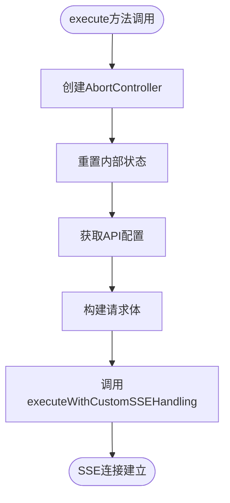
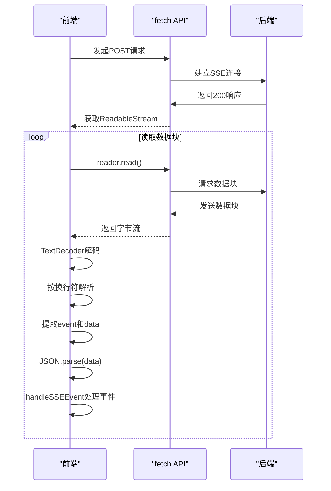
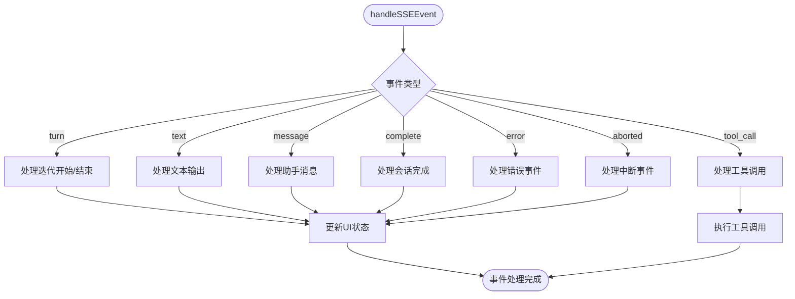
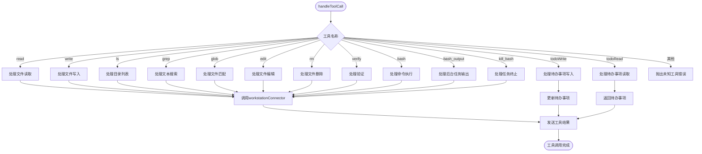
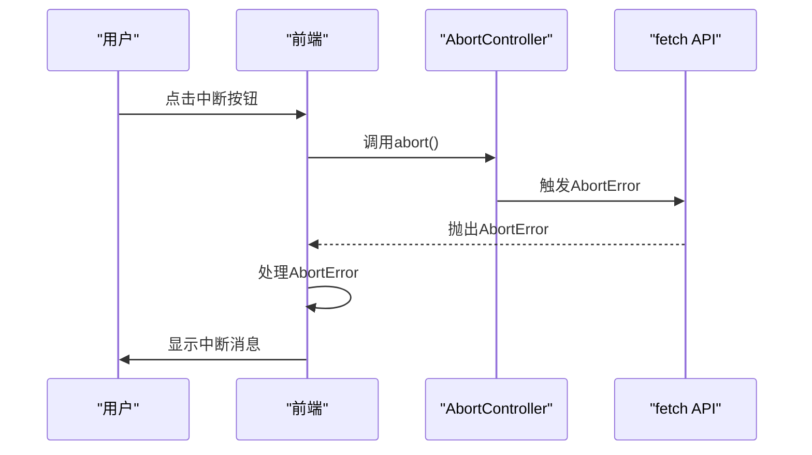
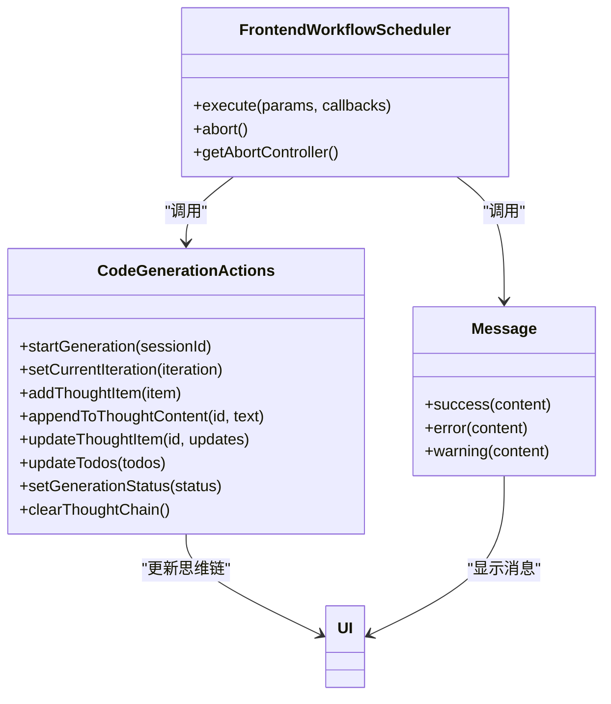
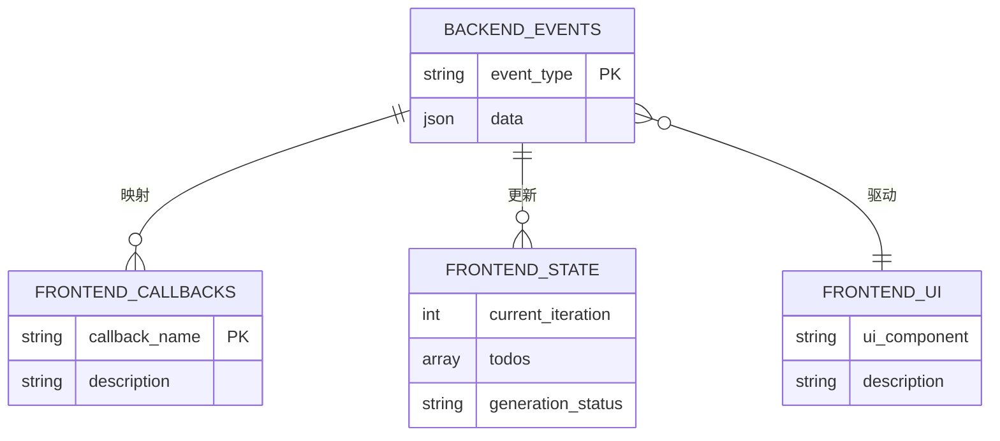

# 前端工作流调度器

<cite>
**本文档引用的文件**   
- [FrontendWorkflowScheduler.ts](file://fta-layout-design/src/pages/EditorPage/services/FrontendWorkflowScheduler.ts)
- [types.ts](file://fta-layout-design/src/pages/EditorPage/services/types.ts)
- [apiService.ts](file://fta-layout-design/src/utils/apiService.ts)
- [workstationConnector.ts](file://fta-layout-design/src/utils/workstationConnector.ts)
- [EditorPageComponentDetect.tsx](file://fta-layout-design/src/pages/EditorPage/EditorPageComponentDetect.tsx)
- [frontend-workflow-api.md](file://code-agent-backend/docs/frontend-workflow-api.md)
- [frontend-workflow.ts](file://code-agent-backend/src/service/code-agent/frontend-workflow.ts)
- [frontend-workflow.controller.ts](file://code-agent-backend/src/controller/code-agent/frontend-workflow.ts)
- [frontend-workflow.dto.ts](file://code-agent-backend/src/dto/code-agent/frontend-workflow.dto.ts)
</cite>

## 目录
1. [简介](#简介)
2. [核心组件](#核心组件)
3. [执行流程分析](#执行流程分析)
4. [SSE事件处理机制](#sse事件处理机制)
5. [工具调用处理](#工具调用处理)
6. [请求中断机制](#请求中断机制)
7. [前端集成示例](#前端集成示例)
8. [前后端事件映射关系](#前后端事件映射关系)
9. [结论](#结论)

## 简介
前端工作流调度器（FrontendWorkflowScheduler）是前端工作台中的核心组件，负责管理与后端服务的SSE（Server-Sent Events）通信。该调度器封装了复杂的流式通信逻辑，为前端应用提供了一个简洁的接口来启动和管理前端项目生成工作流。通过这个调度器，前端可以实时接收后端生成过程中的各种事件，包括文本输出、工具调用、迭代状态等，并相应地更新用户界面。

## 核心组件

FrontendWorkflowScheduler类是前端工作流调度器的核心实现，主要职责包括：
- 发起SSE请求到后端`/code-agent/frontend-workflow`接口
- 解析SSE事件流
- 将接收到的事件映射到相应的回调函数
- 管理请求的生命周期，包括启动和中断

该类通过execute方法启动工作流，通过handleSSEEvent方法处理各种SSE事件，并通过AbortController实现请求的中断功能。

**Section sources**
- [FrontendWorkflowScheduler.ts](file://fta-layout-design/src/pages/EditorPage/services/FrontendWorkflowScheduler.ts#L62-L520)

## 执行流程分析

### execute方法
execute方法是启动前端工作流的入口点。该方法首先创建一个AbortController实例来管理请求的生命周期，然后重置内部状态（当前迭代次数和待办事项列表）。接着，它会从请求参数或localStorage中获取API配置信息，构建请求体，并调用executeWithCustomSSEHandling方法来建立SSE连接。



**Diagram sources**
- [FrontendWorkflowScheduler.ts](file://fta-layout-design/src/pages/EditorPage/services/FrontendWorkflowScheduler.ts#L70-L125)

**Section sources**
- [FrontendWorkflowScheduler.ts](file://fta-layout-design/src/pages/EditorPage/services/FrontendWorkflowScheduler.ts#L70-L125)

### executeWithCustomSSEHandling方法
由于后端SSE事件格式的特殊性（event:和data:的配对），FrontendWorkflowScheduler需要自定义的SSE处理逻辑。executeWithCustomSSEHandling方法使用fetch API建立连接，通过TextDecoder处理字节流，并实现基于换行符的SSE事件解析器。

该方法首先构建请求URL和头部信息，然后使用fetch API发起POST请求。响应体被转换为ReadableStream，通过getReader()获取读取器。在读取循环中，字节流被解码为文本，并按换行符分割进行解析。当遇到"event:"行时，读取下一行的"data:"内容，解析JSON数据，并调用handleSSEEvent方法处理事件。



**Diagram sources**
- [FrontendWorkflowScheduler.ts](file://fta-layout-design/src/pages/EditorPage/services/FrontendWorkflowScheduler.ts#L130-L215)

**Section sources**
- [FrontendWorkflowScheduler.ts](file://fta-layout-design/src/pages/EditorPage/services/FrontendWorkflowScheduler.ts#L130-L215)

## SSE事件处理机制

### handleSSEEvent方法
handleSSEEvent方法是SSE事件分发的核心，根据不同的事件类型调用相应的回调函数。该方法通过switch语句处理各种事件类型：



**Diagram sources**
- [FrontendWorkflowScheduler.ts](file://fta-layout-design/src/pages/EditorPage/services/FrontendWorkflowScheduler.ts#L220-L298)

**Section sources**
- [FrontendWorkflowScheduler.ts](file://fta-layout-design/src/pages/EditorPage/services/FrontendWorkflowScheduler.ts#L220-L298)

### 迭代状态管理
当接收到"turn"事件时，调度器会递增当前迭代次数，并调用onIterationStart回调函数。如果事件数据包含endTime字段，则表示本轮迭代结束，调用onIterationEnd回调函数。这种机制使得前端可以准确地跟踪工作流的进度。

### 待办事项管理
通过"tool_call"事件中的todoWrite工具调用，调度器可以更新内部的待办事项列表。当接收到todoWrite调用时，它会解析新的待办事项数据，更新内部状态，并调用onTodoUpdate回调函数通知前端更新UI。

## 工具调用处理

### handleToolCall方法
handleToolCall方法负责处理后端发起的工具调用。该方法根据工具名称分发到不同的处理逻辑：



**Diagram sources**
- [FrontendWorkflowScheduler.ts](file://fta-layout-design/src/pages/EditorPage/services/FrontendWorkflowScheduler.ts#L318-L469)

**Section sources**
- [FrontendWorkflowScheduler.ts](file://fta-layout-design/src/pages/EditorPage/services/FrontendWorkflowScheduler.ts#L318-L469)

### 工具结果发送
工具执行完成后，通过sendToolResult方法将结果发送回后端。该方法向`/code-agent/frontend-workflow/tool-result`接口发送POST请求，包含调用ID、工具名称、参数和工具结果。如果发送失败，只记录日志而不重试，避免触发重复请求。

## 请求中断机制

### AbortController集成
FrontendWorkflowScheduler使用AbortController实现请求中断功能。在execute方法中创建AbortController实例，并将其signal传递给fetch请求。当需要中断请求时，调用abort方法，这会触发fetch请求的AbortError，从而中断SSE连接。



**Diagram sources**
- [FrontendWorkflowScheduler.ts](file://fta-layout-design/src/pages/EditorPage/services/FrontendWorkflowScheduler.ts#L514-L519)

**Section sources**
- [FrontendWorkflowScheduler.ts](file://fta-layout-design/src/pages/EditorPage/services/FrontendWorkflowScheduler.ts#L514-L519)

## 前端集成示例

### 回调函数注册
在EditorPageComponentDetect.tsx中，可以看到如何注册各种回调函数来更新用户界面：



**Diagram sources**
- [EditorPageComponentDetect.tsx](file://fta-layout-design/src/pages/EditorPage/EditorPageComponentDetect.tsx#L182-L251)

**Section sources**
- [EditorPageComponentDetect.tsx](file://fta-layout-design/src/pages/EditorPage/EditorPageComponentDetect.tsx#L182-L251)

### 集成代码示例
```typescript
// 初始化或重置 scheduler
if (!schedulerRef.current) {
  schedulerRef.current = new FrontendWorkflowScheduler();
} else {
  // 中断之前的连接
  schedulerRef.current.abort();
}

const scheduler = schedulerRef.current;

// 执行 SSE 会话
await scheduler.execute(
  {
    designDocId: selectedDocument!.id!,
    productName: 'FTA-Frontend',
    srcTree: window.workspaceInfo?.srcTree || undefined,
  },
  {
    onIterationStart: (iteration) => {
      setCurrentIteration(iteration);
      // 创建新的迭代项
      const thoughtId = `iteration-${sessionId}-${iteration}`;
      currentIterationThoughtId = thoughtId;
      addThoughtItem({
        id: thoughtId,
        title: `第 ${iteration} 轮调用`,
        status: 'in_progress',
        content: '',
        startedAt: new Date().toISOString(),
        kind: 'iteration',
      });
    },
    onTextChunk: (text) => {
      // 将文本追加到当前迭代项
      if (currentIterationThoughtId) {
        appendToThoughtContent(currentIterationThoughtId, text);
      }
    },
    onTodoUpdate: (todos) => {
      // 更新 TODO 列表
      updateTodos(todos);
    },
    onIterationEnd: () => {
      // 将当前迭代项标记为完成
      if (currentIterationThoughtId) {
        updateThoughtItem(currentIterationThoughtId, {
          status: 'success',
          finishedAt: new Date().toISOString(),
        });
      }
    },
    onSessionComplete: () => {
      message.success({ content: '代码生成完成', key: 'generate-code' });
      setGenerationStatus('completed');
    },
    onError: (errorMessage) => {
      message.error({
        content: `代码生成失败: ${errorMessage}`,
        key: 'generate-code',
      });
      setGenerationStatus('failed');
    },
  }
);
```

## 前后端事件映射关系

### 后端SSE事件
根据frontend-workflow-api.md文档，后端支持多种SSE事件类型：

| 事件类型 | 数据结构 | 用途 |
|---------|---------|------|
| info | { message: string } | 流程信息通知 |
| warning | { message: string } | 警告信息 |
| message | { role: string, content: string } | Agent消息 |
| text_delta | { text: string } | 流式文本增量 |
| text | { text: string } | 完整文本输出 |
| stream_result | { requestId: string, model: string, hasError: boolean } | 流请求结果 |
| chunk | { chunk: any, requestId: string } | 原始流数据块 |
| turn | { usage: object, startTime: string, endTime: string } | 每轮对话统计 |
| tool_approve | { toolName: string, callId: string, params: any } | 工具调用批准 |
| complete | { success: boolean, sessionId: string, filesCount: number } | 任务完成 |
| error | { message: string, stack: string } | 错误事件 |

### 前端事件处理
前端工作流调度器对后端事件进行了映射和转换：



**Diagram sources**
- [frontend-workflow-api.md](file://code-agent-backend/docs/frontend-workflow-api.md#L25-L138)
- [FrontendWorkflowScheduler.ts](file://fta-layout-design/src/pages/EditorPage/services/FrontendWorkflowScheduler.ts#L220-L298)

**Section sources**
- [frontend-workflow-api.md](file://code-agent-backend/docs/frontend-workflow-api.md#L25-L138)
- [FrontendWorkflowScheduler.ts](file://fta-layout-design/src/pages/EditorPage/services/FrontendWorkflowScheduler.ts#L220-L298)

## 结论
前端工作流调度器（FrontendWorkflowScheduler）是一个功能完整的SSE客户端实现，它有效地封装了复杂的流式通信逻辑，为前端应用提供了一个简洁而强大的接口来与后端工作流服务交互。通过自定义的SSE处理逻辑、灵活的事件分发机制和完善的错误处理，该调度器确保了前后端通信的可靠性和稳定性。

调度器的设计体现了良好的分层架构：execute方法负责请求的启动和配置，executeWithCustomSSEHandling方法处理底层的流式通信，handleSSEEvent方法负责事件的分发，而各种handleXXX方法则处理具体的业务逻辑。这种分层设计使得代码易于维护和扩展。

通过AbortController实现的请求中断机制，为用户提供了良好的控制体验。而丰富的回调函数接口则使得前端可以灵活地响应各种事件，实时更新用户界面。整体而言，前端工作流调度器是连接前端工作台与后端AI能力的关键桥梁，为智能前端开发提供了坚实的基础。