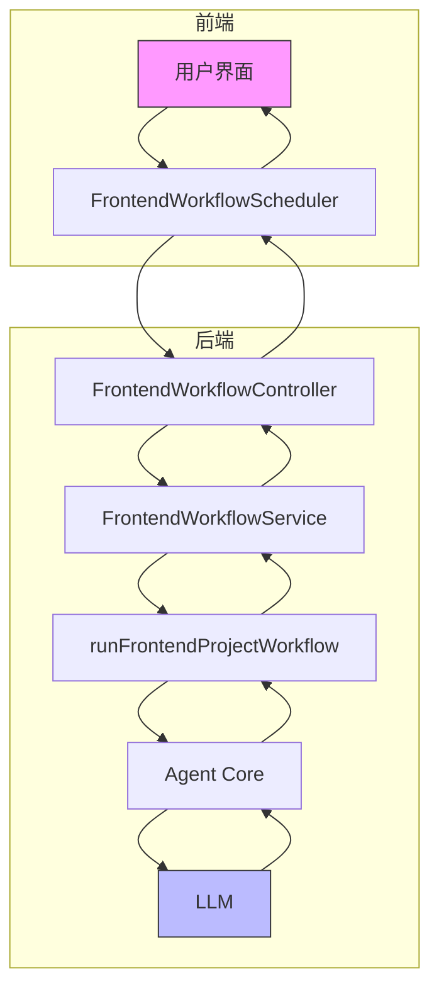
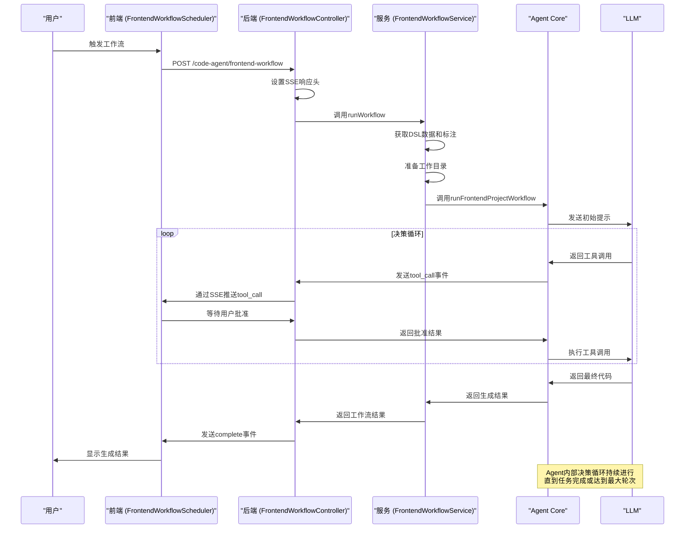
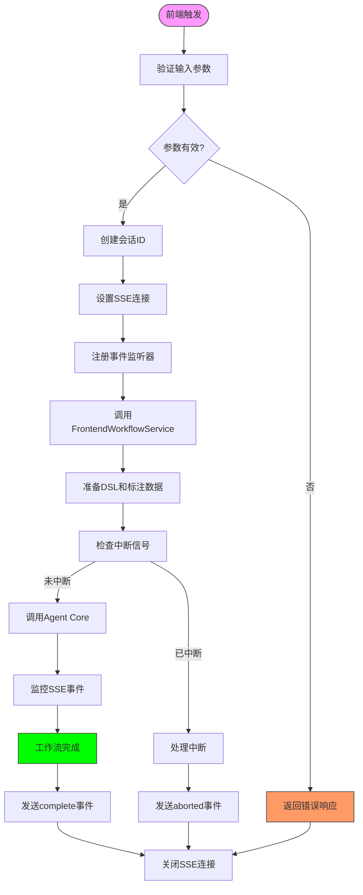
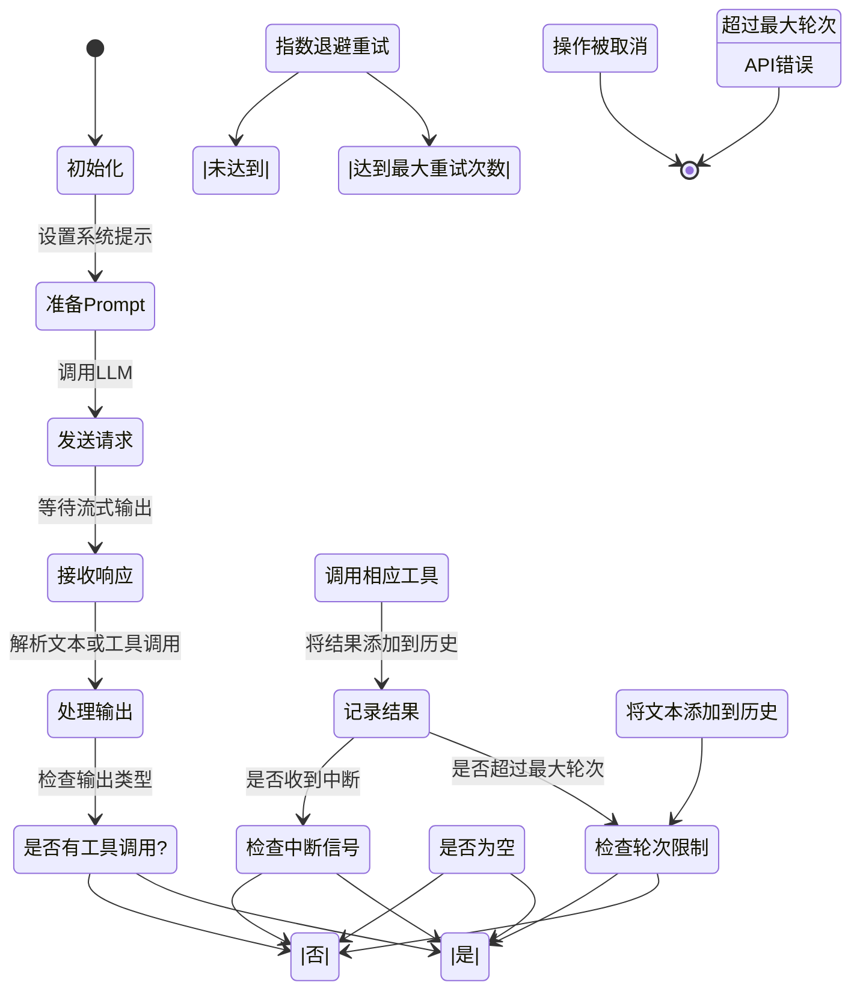

# 工作流详解

<cite>
**本文档引用的文件**   
- [frontend-workflow.ts](file://code-agent-backend/src/controller/code-agent/frontend-workflow.ts)
- [frontend-workflow.service.ts](file://code-agent-backend/src/service/code-agent/frontend-workflow.ts)
- [loop.ts](file://fta-agent-core/src/loop.ts)
- [frontendProjectService.ts](file://fta-agent-core/src/frontendProjectService.ts)
- [FrontendWorkflowScheduler.ts](file://fta-layout-design/src/pages/EditorPage/services/FrontendWorkflowScheduler.ts)
- [frontend-workflow.dto.ts](file://code-agent-backend/src/dto/code-agent/frontend-workflow.dto.ts)
- [project.ts](file://code-agent-backend/src/service/code-agent/project.ts)
</cite>

## 目录
1. [简介](#简介)
2. [工作流架构概览](#工作流架构概览)
3. [前端工作流生命周期](#前端工作流生命周期)
4. [任务调度机制](#任务调度机制)
5. [Agent内部决策循环](#agent内部决策循环)
6. [状态转换与监控](#状态转换与监控)
7. [性能分析与优化建议](#性能分析与优化建议)
8. [故障排除指南](#故障排除指南)

## 简介
本技术文档深入剖析了AI代码代理系统中的前端工作流和Agent执行流程。文档详细解释了从用户在前端触发操作到后端服务调度Agent Core，再到Agent通过LLM生成代码的完整生命周期。内容涵盖了工作流的状态转换、任务调度机制（如FrontendWorkflowScheduler）和Agent内部的决策循环（loop.ts）。为初学者提供了工作流的时序图，为高级开发者提供了性能瓶颈分析和优化建议，如任务并行化或LLM调用的缓存策略。同时包含了工作流中各环节的日志记录和监控点。

**Section sources**
- [frontend-workflow.ts](file://code-agent-backend/src/controller/code-agent/frontend-workflow.ts#L1-L368)
- [frontend-workflow.service.ts](file://code-agent-backend/src/service/code-agent/frontend-workflow.ts#L1-L373)

## 工作流架构概览



**Diagram sources**
- [FrontendWorkflowScheduler.ts](file://fta-layout-design/src/pages/EditorPage/services/FrontendWorkflowScheduler.ts#L1-L89)
- [frontend-workflow.ts](file://code-agent-backend/src/controller/code-agent/frontend-workflow.ts#L1-L368)
- [frontendProjectService.ts](file://fta-agent-core/src/frontendProjectService.ts#L1-L349)

## 前端工作流生命周期



**Diagram sources**
- [frontend-workflow.ts](file://code-agent-backend/src/controller/code-agent/frontend-workflow.ts#L1-L368)
- [frontendProjectService.ts](file://fta-agent-core/src/frontendProjectService.ts#L1-L349)
- [loop.ts](file://fta-agent-core/src/loop.ts#L1-L532)

**Section sources**
- [frontend-workflow.ts](file://code-agent-backend/src/controller/code-agent/frontend-workflow.ts#L1-L368)
- [frontendProjectService.ts](file://fta-agent-core/src/frontendProjectService.ts#L1-L349)

## 任务调度机制



**Diagram sources**
- [frontend-workflow.ts](file://code-agent-backend/src/controller/code-agent/frontend-workflow.ts#L1-L368)
- [FrontendWorkflowScheduler.ts](file://fta-layout-design/src/pages/EditorPage/services/FrontendWorkflowScheduler.ts#L1-L89)

**Section sources**
- [frontend-workflow.ts](file://code-agent-backend/src/controller/code-agent/frontend-workflow.ts#L1-L368)
- [FrontendWorkflowScheduler.ts](file://fta-layout-design/src/pages/EditorPage/services/FrontendWorkflowScheduler.ts#L1-L89)

## Agent内部决策循环



**Diagram sources**
- [loop.ts](file://fta-agent-core/src/loop.ts#L1-L532)
- [frontendProjectService.ts](file://fta-agent-core/src/frontendProjectService.ts#L1-L349)

**Section sources**
- [loop.ts](file://fta-agent-core/src/loop.ts#L1-L532)

## 状态转换与监控

```mermaid
erDiagram
SESSION ||--o{ EVENT : 包含
SESSION ||--o{ LOG : 记录
SESSION ||--o{ METRIC : 统计
SESSION {
string sessionId PK
timestamp startTime
timestamp endTime
enum status
string designDocId
string productName
string model
}
EVENT {
string eventId PK
string sessionId FK
string eventType
json eventData
timestamp timestamp
}
LOG {
string logId PK
string sessionId FK
string level
string message
timestamp timestamp
}
METRIC {
string metricId PK
string sessionId FK
string metricName
number value
timestamp timestamp
}
class SESSION "会话"
class EVENT "事件"
class LOG "日志"
class METRIC "指标"
```

**Diagram sources**
- [frontend-workflow.ts](file://code-agent-backend/src/controller/code-agent/frontend-workflow.ts#L1-L368)
- [frontendProjectService.ts](file://fta-agent-core/src/frontendProjectService.ts#L1-L349)

**Section sources**
- [frontend-workflow.ts](file://code-agent-backend/src/controller/code-agent/frontend-workflow.ts#L1-L368)
- [frontendProjectService.ts](file://fta-agent-core/src/frontendProjectService.ts#L1-L349)

## 性能分析与优化建议

### 性能瓶颈分析表

| 瓶颈类型 | 描述 | 影响 | 监控点 |
|---------|------|------|--------|
| **LLM响应延迟** | LLM生成响应时间过长 | 整个工作流耗时增加 | `stream_result`事件中的`duration`字段 |
| **工具调用阻塞** | 工具调用需要等待用户批准 | 工作流暂停 | `tool_call`和`tool_result`事件的时间差 |
| **内存泄漏** | 会话数据未及时清理 | 服务器内存占用持续增加 | `pendingToolCalls`和`sessionCallIds`的大小 |
| **文件I/O瓶颈** | 文件读写操作频繁 | 生成代码速度变慢 | `file_draft_write`工具调用的频率和耗时 |

### 优化建议

1. **任务并行化**：对于独立的代码生成任务，可以考虑并行执行多个工作流实例，充分利用多核CPU资源。
2. **LLM调用缓存**：对于重复的提示和相似的上下文，可以实现LLM响应缓存机制，避免重复计算。
3. **连接池优化**：使用连接池管理数据库连接，减少连接创建和销毁的开销。
4. **异步处理**：将非关键路径的操作（如日志记录）改为异步处理，减少主线程阻塞。
5. **资源限制**：设置合理的超时和重试机制，防止长时间运行的任务占用过多资源。

**Section sources**
- [frontend-workflow.ts](file://code-agent-backend/src/controller/code-agent/frontend-workflow.ts#L1-L368)
- [loop.ts](file://fta-agent-core/src/loop.ts#L1-L532)

## 故障排除指南

### 常见问题及解决方案

| 问题现象 | 可能原因 | 解决方案 |
|---------|--------|---------|
| **SSE连接断开** | 客户端网络不稳定或服务器超时 | 检查网络连接，增加服务器超时时间 |
| **工作流卡住** | 工具调用未收到批准 | 检查前端是否正确处理`tool_call`事件 |
| **生成代码不完整** | LLM返回空响应 | 检查提示工程，增加重试机制 |
| **内存占用过高** | 会话数据未清理 | 检查`pendingToolCalls`清理逻辑 |
| **模型配置错误** | API Key或Base URL缺失 | 检查环境变量配置 |

### 监控点配置

- **日志级别**：设置适当的日志级别，确保关键信息被记录
- **性能指标**：监控每个会话的执行时间、token使用量等
- **错误追踪**：记录所有异常的堆栈信息，便于调试
- **资源使用**：监控CPU、内存、网络等系统资源使用情况

**Section sources**
- [frontend-workflow.ts](file://code-agent-backend/src/controller/code-agent/frontend-workflow.ts#L1-L368)
- [frontendProjectService.ts](file://fta-agent-core/src/frontendProjectService.ts#L1-L349)
- [loop.ts](file://fta-agent-core/src/loop.ts#L1-L532)