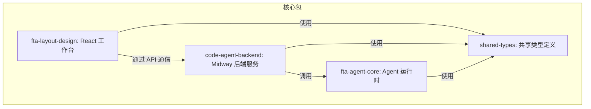

# 开发指南

<cite>
**本文档中引用的文件**   
- [package.json](file://package.json)
- [code-agent-backend/package.json](file://code-agent-backend/package.json)
- [fta-agent-core/package.json](file://fta-agent-core/package.json)
- [fta-layout-design/package.json](file://fta-layout-design/package.json)
- [shared-types/package.json](file://shared-types/package.json)
- [.eslintrc.json](file://.eslintrc.json)
- [.prettierrc](file://.prettierrc)
- [code-agent-backend/jest.config.js](file://code-agent-backend/jest.config.js)
- [code-agent-backend/jest.setup.js](file://code-agent-backend/jest.setup.js)
- [fta-agent-core/vitest.config.ts](file://fta-agent-core/vitest.config.ts)
- [code-agent-backend/tsconfig.json](file://code-agent-backend/tsconfig.json)
- [fta-agent-core/tsconfig.json](file://fta-agent-core/tsconfig.json)
- [fta-layout-design/vite.config.ts](file://fta-layout-design/vite.config.ts)
- [README.md](file://README.md)
</cite>

## 目录
1. [简介](#简介)
2. [项目结构](#项目结构)
3. [开发环境搭建](#开发环境搭建)
4. [代码质量与格式化](#代码质量与格式化)
5. [测试策略](#测试策略)
6. [Yarn Workspaces 多包开发工作流](#yarn-workspaces-多包开发工作流)
7. [贡献流程](#贡献流程)
8. [调试技巧](#调试技巧)
9. [代码审查标准](#代码审查标准)
10. [附录](#附录)

## 简介
本开发指南旨在为贡献者提供全面的开发环境搭建和贡献流程说明。文档涵盖了代码格式化、静态检查、测试策略和提交规范，详细解释了在 Yarn Workspaces 环境下的多包开发工作流，包括如何在不同包之间进行调试和版本发布。同时提供了编写新功能或修复 Bug 的标准流程，为初学者提供开发工具的安装配置指南，并为团队成员提供代码审查的标准。

## 项目结构
本项目采用 Yarn Workspaces 管理多个包，形成了一个完整的前后端一体化平台。项目结构清晰，各包职责分明，共同实现了从设计稿到代码的自动化流程。



**Diagram sources**
- [package.json](file://package.json#L5-L11)
- [README.md](file://README.md#L74-L77)

**Section sources**
- [package.json](file://package.json#L1-L31)
- [README.md](file://README.md#L67-L80)

## 开发环境搭建
### Node.js 和 Yarn 安装
本项目要求 Node.js 版本为 20，已在 `package.json` 的 `engines` 字段中明确指定。建议使用 Node Version Manager (nvm) 来管理 Node.js 版本。

```bash
# 安装 nvm (如果尚未安装)
curl -o- https://raw.githubusercontent.com/nvm-sh/nvm/v0.39.0/install.sh | bash

# 安装并使用 Node.js 20
nvm install 20
nvm use 20
```

Yarn 是本项目推荐的包管理器。安装 Yarn：

```bash
npm install -g yarn
```

### 项目依赖安装
项目根目录下的 `package.json` 文件定义了 Yarn Workspaces，可以一次性安装所有包的依赖。

```bash
# 在项目根目录执行
yarn install
```

此命令会根据 `package.json` 中的 `workspaces` 配置，安装 `shared-types`、`code-agent-backend`、`fta-layout-design` 和 `fta-agent-core` 四个包的依赖。

### 环境变量配置
项目需要配置环境变量才能正常运行。请参考 `README.md` 中的 "环境变量速览" 部分进行配置。

- **后端 (`code-agent-backend`)**: 需要配置模型服务、数据库和 MasterGo 相关的环境变量。
- **前端 (`fta-layout-design`)**: 主要配置 `VITE_API_BASE_URL` 指向后端服务地址。
- **CLI 工具**: 复用模型相关的环境变量。

**Section sources**
- [package.json](file://package.json#L28-L29)
- [README.md](file://README.md#L125-L138)

## 代码质量与格式化
### Prettier 代码格式化
项目使用 Prettier 进行代码格式化，配置文件为根目录下的 `.prettierrc`。该配置定义了统一的代码风格，包括缩进、引号、分号等。

```json
{
  "tabWidth": 2,
  "singleQuote": true,
  "semi": true,
  "printWidth": 120,
  "trailingComma": "es5"
}
```

**格式化命令**:
- **运行格式化**: `yarn prettier "**/*.{js,jsx,tsx,ts,less,md,json}"`
- **在后端包中运行**: `npm run prettier` (已定义在 `code-agent-backend/package.json` 中)

### ESLint 静态检查
项目使用 ESLint 进行静态代码分析，配置文件为根目录下的 `.eslintrc.json`。ESLint 配置继承了 `mwts` (Midway TypeScript Style) 规范，并根据项目需要进行了调整。

```json
{
  "extends": "./node_modules/mwts/",
  "ignorePatterns": ["node_modules", "dist", "test", "jest.config.js", "typings"],
  "env": {
    "jest": true
  },
  "rules": {
    "@typescript-eslint/no-unused-vars": "off",
    "@prettier/prettier": "off"
  }
}
```

**静态检查命令**:
- **检查代码**: `yarn lint` (在 `code-agent-backend` 包中)
- **自动修复**: `yarn lint:fix` (在 `code-agent-backend` 包中)

**Section sources**
- [.prettierrc](file://.prettierrc#L1-L19)
- [.eslintrc.json](file://.eslintrc.json#L1-L14)
- [code-agent-backend/package.json](file://code-agent-backend/package.json#L6-L16)

## 测试策略
项目针对不同包采用了不同的测试框架和策略。

### Jest (后端)
`code-agent-backend` 包使用 Jest 作为测试框架，配置文件为 `jest.config.js` 和 `jest.setup.js`。

```javascript
// code-agent-backend/jest.config.js
module.exports = {
  preset: 'ts-jest',
  testEnvironment: 'node',
  setupFilesAfterEnv: ['./jest.setup.js'],
};
```

```javascript
// code-agent-backend/jest.setup.js
jest.setTimeout(30000); // 设置测试超时时间为30秒
```

**测试命令**:
- `npm run test`: 运行所有测试
- `npm run cov`: 运行测试并生成覆盖率报告

### Vitest (Agent Core)
`fta-agent-core` 包使用 Vitest 作为测试框架，配置文件为 `vitest.config.ts`。

```typescript
// fta-agent-core/vitest.config.ts
export default defineConfig({
  test: {
    environment: 'node',
    include: ['src/**/*.test.ts'],
    testTimeout: 10 * 360 * 1000, // 设置超长测试超时时间
  },
});
```

**测试命令**:
- `npx vitest`: 运行所有测试

### 前端测试
`fta-layout-design` 包目前以手动测试为主，对于新增的复杂逻辑，可以使用 Vitest 和 React Testing Library (RTL) 进行单元测试。

**Section sources**
- [code-agent-backend/jest.config.js](file://code-agent-backend/jest.config.js#L1-L8)
- [code-agent-backend/jest.setup.js](file://code-agent-backend/jest.setup.js#L1-L2)
- [fta-agent-core/vitest.config.ts](file://fta-agent-core/vitest.config.ts#L1-L11)

## Yarn Workspaces 多包开发工作流
### 多包结构
项目使用 Yarn Workspaces 管理四个核心包：
- `shared-types`: 提供跨包共享的 TypeScript 类型定义。
- `code-agent-backend`: 基于 Midway 框架的后端服务。
- `fta-layout-design`: 基于 React 和 Vite 的前端工作台。
- `fta-agent-core`: 核心的 Agent 运行时逻辑。

### 包间依赖与调试
Yarn Workspaces 会自动处理包间的依赖关系。例如，`code-agent-backend` 依赖 `@fta/agent-core`，Yarn 会将其链接到本地的 `fta-agent-core` 包，而不是从 npm 下载。

**调试工作流**:
1. 在 `fta-agent-core` 中修改代码并运行 `yarn build`。
2. 在 `code-agent-backend` 中启动服务，它将自动使用最新的 `fta-agent-core` 构建结果。
3. 通过前端工作台触发相关功能，即可测试修改后的 Agent Core 逻辑。

### 版本发布
当需要发布新版本时，应遵循以下流程：
1. 在 `shared-types` 包中更新版本号并发布。
2. 更新其他包对 `shared-types` 的依赖版本。
3. 分别构建和发布 `fta-agent-core`、`code-agent-backend` 和 `fta-layout-design`。

**Section sources**
- [package.json](file://package.json#L5-L11)
- [README.md](file://README.md#L15-L31)

## 贡献流程
### 开发流程
1. **启动后端**: 进入 `code-agent-backend` 目录，运行 `npm run dev`。
2. **启动前端**: 进入 `fta-layout-design` 目录，运行 `npm run dev`。
3. **编写代码**: 根据需求在相应包中修改代码。
4. **格式化与检查**: 运行 Prettier 和 ESLint 确保代码质量。
5. **运行测试**: 执行相关测试用例。
6. **提交代码**: 遵循提交规范进行提交。

### 编写新功能
1. 在 `fta-agent-core` 中实现核心逻辑和工具。
2. 在 `code-agent-backend` 中创建新的控制器和服务来暴露 API。
3. 在 `fta-layout-design` 中开发前端界面和交互逻辑。
4. 使用 `shared-types` 定义跨包共享的数据结构。

### 修复 Bug
1. 定位 Bug 所在的包和模块。
2. 编写复现 Bug 的测试用例。
3. 修复代码并确保测试通过。
4. 提交修复。

### 提交规范
项目遵循 Angular Conventional Commits 规范，使用中文祈使句。

**示例**:
- `feat(api): 添加新的需求文档生成接口`
- `fix(controller): 修复项目创建时的权限校验漏洞`
- `docs(readme): 更新快速开始指南`

**Section sources**
- [README.md](file://README.md#L184-L185)
- [package.json](file://package.json#L17-L23)

## 调试技巧
### 调试 Agent Core 执行流程
`fta-agent-core` 是整个系统的核心，调试其执行流程至关重要。

**调试步骤**:
1. **启用日志**: `fta-agent-core` 使用 `debug` 库进行日志输出。通过设置环境变量 `DEBUG=*` 可以查看所有调试信息。
   ```bash
   DEBUG=* node dist/index.js
   ```
2. **分析 JSONL 日志**: Agent Core 的执行日志以 JSONL 格式输出到 `dist` 目录。这些日志记录了每一步的输入、输出和状态，是调试的主要依据。
3. **使用断点调试**: 在 VS Code 中配置调试器，直接在 `fta-agent-core/src` 的源代码上设置断点。
4. **模拟输入**: 使用 `messages-replayer` CLI 工具回放 `messages.log`，可以精确复现特定的执行流程。

### 通用调试技巧
- **后端调试**: 使用 `midway-bin dev --ts` 启动开发服务器，支持热重载和源码调试。
- **前端调试**: 使用 Vite 的开发服务器，结合浏览器开发者工具进行调试。
- **网络请求**: 使用 `src/utils/apiService.ts` 中的工具，可以方便地查看和调试前后端通信。

**Section sources**
- [fta-agent-core/src/utils/debug.ts](file://fta-agent-core/src/utils/debug.ts)
- [README.md](file://README.md#L62-L63)

## 代码审查标准
代码审查是保证代码质量的关键环节。审查时应重点关注以下方面：

### 代码质量
- **可读性**: 代码是否清晰易懂，命名是否恰当。
- **一致性**: 是否遵循了项目的代码风格和设计模式。
- **复杂度**: 函数和类的复杂度是否过高，是否需要重构。

### 功能正确性
- **逻辑正确**: 代码是否正确实现了需求。
- **边界条件**: 是否处理了所有可能的边界情况和错误场景。
- **测试覆盖**: 是否有足够的测试用例覆盖主要功能和异常路径。

### 性能与安全
- **性能**: 代码是否存在性能瓶颈，如不必要的循环或数据库查询。
- **安全**: 是否存在安全漏洞，如 SQL 注入、XSS 等。

### 文档与注释
- **API 文档**: 新增的 API 是否有清晰的文档说明。
- **复杂逻辑**: 复杂的算法或业务逻辑是否有必要的注释解释。

**Section sources**
- [README.md](file://README.md#L181-L186)

## 附录
### 常用命令汇总
| 包 | 开发/运行 | 质量/测试 |
| --- | --- | --- |
| `code-agent-backend` | `npm run dev` / `npm run build && npm start` | `npm run lint` / `npm run lint:fix` / `npm run prettier` / `npm run test` |
| `fta-layout-design` | `npm run dev` / `npm run build` | （默认手测） |
| `fta-agent-core` | `yarn build` | `yarn typecheck`，`npx vitest` |

### 参考资料
- `AGENTS.md`: 作业规范与指南
- `CLAUDE.md`: Claude Code 深度指南
- `MasterGoDSL.md`: DSL 归一化讨论与类型定义范式

**Section sources**
- [README.md](file://README.md#L141-L149)
- [README.md](file://README.md#L189-L194)