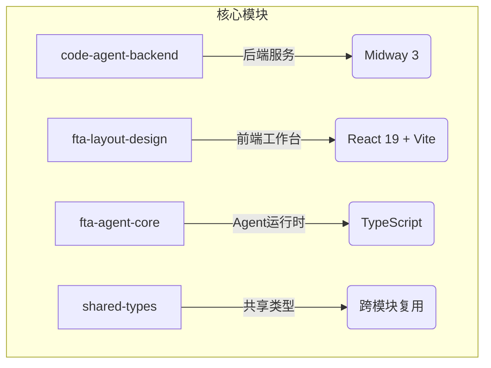

# 快速入门指南

<cite>
**本文档中引用的文件**  
- [README.md](file://README.md)
- [bootstrap.js](file://code-agent-backend/bootstrap.js)
- [main.tsx](file://fta-layout-design/src/main.tsx)
- [package.json](file://package.json)
- [code-agent-backend/package.json](file://code-agent-backend/package.json)
- [fta-layout-design/package.json](file://fta-layout-design/package.json)
- [code-agent-backend/src/config/config.default.ts](file://code-agent-backend/src/config/config.default.ts)
- [code-agent-backend/src/config/config.local.ts](file://code-agent-backend/src/config/config.local.ts)
- [code-agent-backend/src/config/config.dev.ts](file://code-agent-backend/src/config/config.dev.ts)
- [fta-layout-design/.env.example](file://fta-layout-design/.env.example)
- [fta-layout-design/vite.config.ts](file://fta-layout-design/vite.config.ts)
- [code-agent-backend/start.sh](file://code-agent-backend/start.sh)
- [Dockerfile](file://Dockerfile)
</cite>

## 目录
1. [简介](#简介)
2. [项目结构概览](#项目结构概览)
3. [环境准备](#环境准备)
4. [本地开发环境搭建](#本地开发环境搭建)
5. [系统入口点说明](#系统入口点说明)
6. [首次体验：解析设计稿](#首次体验：解析设计稿)
7. [常见问题排查](#常见问题排查)
8. [Docker容器化部署](#docker容器化部署)
9. [总结](#总结)

## 简介

本指南旨在帮助开发者快速搭建 `amh_code_agent` 项目的开发环境，从零开始运行后端服务和前端工作台。该项目是一个面向企业的「设计稿 → 代码」一体化平台，包含后端服务、React 工作台、Agent 运行时等核心模块。

通过本指南，您将学习如何：
- 克隆仓库并安装依赖
- 配置必要的环境变量
- 启动后端与前端服务
- 通过具体示例完成首次体验
- 使用 Docker 进行容器化部署
- 排查常见启动问题

**Section sources**
- [README.md](file://README.md)

## 项目结构概览

`amh_code_agent` 是一个 Yarn Workspaces 管理的多包项目，主要由以下几个核心模块组成：



**Diagram sources**
- [README.md](file://README.md)

**Section sources**
- [README.md](file://README.md)

## 环境准备

在开始之前，请确保您的开发环境已安装以下工具：

- **Node.js**：版本要求为 `=20`（请严格匹配）
- **Yarn**：包管理工具
- **Git**：版本控制工具

您可以通过以下命令验证环境是否正确安装：

```bash
node --version  # 应输出 v20.x.x
yarn --version   # 应输出 1.x 或更高版本
git --version    # 应输出 git version 2.x.x
```

**Section sources**
- [package.json](file://package.json)
- [code-agent-backend/package.json](file://code-agent-backend/package.json)
- [fta-layout-design/package.json](file://fta-layout-design/package.json)

## 本地开发环境搭建

### 1. 克隆仓库

```bash
git clone https://your-repo-url/amh_code_agent.git
cd amh_code_agent
```

### 2. 安装依赖

项目使用 Yarn Workspaces 管理多个子包，所有依赖在根目录统一安装：

```bash
yarn install
```

该命令将安装以下四个主要包的依赖：
- `code-agent-backend`
- `fta-layout-design`
- `fta-agent-core`
- `shared-types`

**Section sources**
- [README.md](file://README.md)
- [package.json](file://package.json)

### 3. 配置环境变量

#### 后端配置 (`code-agent-backend`)

后端服务的配置主要通过环境变量控制。开发环境可使用 `config.local.ts` 或 `config.dev.ts` 覆盖默认配置。

关键环境变量包括：
- `YMM_GLOBAL_PORT`：服务端口，默认 `7001`
- `MONGODB_URI`：MongoDB 连接地址
- `REDIS_HOST/PORT/DB`：Redis 配置
- `MASTERGO_BASE_URL` 和 `MASTERGO_TOKEN`：MasterGo 接口认证
- `MODEL_ENDPOINT`, `MODEL_API_KEY`, `MODEL_NAME`：模型网关配置

示例配置文件位于：
- [code-agent-backend/src/config/config.local.ts](file://code-agent-backend/src/config/config.local.ts)
- [code-agent-backend/src/config/config.dev.ts](file://code-agent-backend/src/config/config.dev.ts)

#### 前端配置 (`fta-layout-design`)

前端需要创建 `.env` 文件以配置 API 地址：

```bash
cp fta-layout-design/.env.example fta-layout-design/.env.development
```

编辑 `.env.development`，取消注释并设置开发环境 API 地址：

```env
VITE_API_BASE_URL=http://127.0.0.1:7001
VITE_REQUEST_TIMEOUT=30000
VITE_ENABLE_MOCK=false
```

**Section sources**
- [fta-layout-design/.env.example](file://fta-layout-design/.env.example)
- [code-agent-backend/src/config/config.default.ts](file://code-agent-backend/src/config/config.default.ts)
- [code-agent-backend/src/config/config.local.ts](file://code-agent-backend/src/config/config.local.ts)
- [code-agent-backend/src/config/config.dev.ts](file://code-agent-backend/src/config/config.dev.ts)

### 4. 启动后端服务

进入后端目录并启动开发服务器：

```bash
cd code-agent-backend
npm run dev
```

预期输出：
```
MIDWAY_HTTP_PORT====> 7001 

[Midway] Start server on 7001
[Midway] Server started at http://127.0.0.1:7001
```

您也可以通过脚本直接启动：
```bash
./start.sh 7001
```

**Section sources**
- [bootstrap.js](file://code-agent-backend/bootstrap.js)
- [start.sh](file://code-agent-backend/start.sh)
- [code-agent-backend/package.json](file://code-agent-backend/package.json)

### 5. 启动前端工作台

打开新终端窗口，启动前端服务：

```bash
cd fta-layout-design
npm run dev
```

预期输出：
```
vite v5.4.0 dev server running at:

> Local: http://localhost:5173/
> Network: use `--host` to expose

ready in 2.1s.
```

访问 `http://localhost:5173` 即可进入前端工作台。

**Section sources**
- [main.tsx](file://fta-layout-design/src/main.tsx)
- [vite.config.ts](file://fta-layout-design/vite.config.ts)
- [fta-layout-design/package.json](file://fta-layout-design/package.json)

## 系统入口点说明

### 后端入口点

后端服务的启动入口为 `bootstrap.js`，其核心逻辑如下：

```js
console.log('MIDWAY_HTTP_PORT====>', process.env.YMM_GLOBAL_PORT, '\n');
const { Bootstrap } = require('@midwayjs/bootstrap');
Bootstrap.run();
```

该文件通过 Midway 框架的 `Bootstrap` 类启动应用，读取 `YMM_GLOBAL_PORT` 环境变量作为服务端口。

**Section sources**
- [bootstrap.js](file://code-agent-backend/bootstrap.js)

### 前端入口点

前端工作台的入口文件为 `main.tsx`，负责初始化 React 应用：

```tsx
import ReactDOM from 'react-dom/client';
import App from './App.tsx';
import './styles/globals.css';

ReactDOM.createRoot(document.getElementById('root')!).render(
  <App />
);
```

该文件挂载根组件 `App` 到 DOM 节点 `#root`，并引入全局样式。

**Section sources**
- [main.tsx](file://fta-layout-design/src/main.tsx)

## 首次体验：解析设计稿

完成环境搭建后，可通过以下步骤完成首次体验：

1. **确保后端和前端均已启动**
2. **访问前端工作台**：打开浏览器访问 `http://localhost:5173`
3. **绑定项目**：在工作台中输入 MasterGo 设计稿链接
4. **触发解析**：点击「AI解析」按钮，系统将：
   - 从 MasterGo 拉取 DSL 数据
   - 通过后端服务进行 PATH → PNG 转换
   - 在 Redis 和 MongoDB 中缓存结果
   - 通过 SSE 流式返回解析进度
5. **查看结果**：在编辑器中查看生成的 DSL 结构、标注树和需求文档

预期行为：前端应成功加载设计稿内容，并在控制台看到与后端的 SSE 通信日志。

**Section sources**
- [README.md](file://README.md)

## 常见问题排查

### 端口冲突

**问题**：`Error: listen EADDRINUSE: address already in use 7001`

**解决方案**：
- 更换后端端口：`YMM_GLOBAL_PORT=7002 npm run dev`
- 或终止占用进程：`lsof -i :7001` → `kill -9 <PID>`

### 依赖缺失

**问题**：`Module not found` 或 `Cannot find module`

**解决方案**：
- 确保在根目录执行 `yarn install`
- 检查 `node_modules` 是否完整
- 尝试清理缓存：`yarn cache clean` 后重新安装

### MongoDB/Redis 连接失败

**问题**：`Failed to connect to MongoDB/Redis`

**解决方案**：
- 检查 `config.local.ts` 中的连接地址和凭证
- 确保数据库服务正在运行
- 开发环境可使用本地实例配置

### 前端无法连接后端

**问题**：前端请求返回 `404` 或 `CORS` 错误

**解决方案**：
- 检查 `.env.development` 中 `VITE_API_BASE_URL` 是否正确指向 `http://127.0.0.1:7001`
- 确认后端服务已启动
- 查看浏览器控制台和网络面板确认请求路径

**Section sources**
- [code-agent-backend/src/config/config.default.ts](file://code-agent-backend/src/config/config.default.ts)
- [fta-layout-design/.env.example](file://fta-layout-design/.env.example)

## Docker容器化部署

项目提供 Docker 支持，可通过以下步骤进行容器化部署：

```dockerfile
FROM harbor.ymmoa.com/base/phantom-ymm-centos-node-20-19
MAINTAINER Phantom "phantom@amh-group.com"
COPY --chown=ymmapp package.zip /data
COPY ymm_env.sh /etc/profile.d
```

**构建与运行步骤**：

1. 构建镜像：
```bash
docker build -t amh-code-agent .
```

2. 运行容器：
```bash
docker run -d \
  -p 7001:7001 \
  -e YMM_GLOBAL_PORT=7001 \
  -e MONGODB_URI=mongodb://mongo:27017/fta \
  --name code-agent \
  amh-code_agent
```

**注意事项**：
- 需提前准备 `package.zip` 包含编译后的代码
- 环境变量需通过 `-e` 参数传入
- 建议将日志目录挂载为卷以持久化日志

**Section sources**
- [Dockerfile](file://Dockerfile)

## 总结

本指南详细介绍了 `amh_code_agent` 项目的快速入门流程，涵盖了从环境搭建到首次体验的完整路径。您已学会：

- 如何克隆仓库并安装依赖
- 配置后端与前端的环境变量
- 启动 `code-agent-backend` 和 `fta-layout-design` 服务
- 理解系统的核心入口点 `bootstrap.js` 和 `main.tsx`
- 通过实际示例完成设计稿解析体验
- 排查常见的启动问题
- 使用 Docker 进行容器化部署

下一步建议阅读项目中的 `AGENTS.md` 和 `CLAUDE.md` 文档，深入了解作业规范与深度指南。

**Section sources**
- [README.md](file://README.md)
- [AGENTS.md](file://AGENTS.md)
- [CLAUDE.md](file://CLAUDE.md)