# 技术栈与架构

<cite>
**本文档中引用的文件**  
- [code-agent-backend/package.json](file://code-agent-backend/package.json)
- [fta-agent-core/package.json](file://fta-agent-core/package.json)
- [fta-layout-design/package.json](file://fta-layout-design/package.json)
- [shared-types/package.json](file://shared-types/package.json)
- [package.json](file://package.json)
- [code-agent-backend/src/configuration.ts](file://code-agent-backend/src/configuration.ts)
- [code-agent-backend/src/config/config.default.ts](file://code-agent-backend/src/config/config.default.ts)
- [fta-layout-design/vite.config.ts](file://fta-layout-design/vite.config.ts)
- [fta-agent-core/src/index.ts](file://fta-agent-core/src/index.ts)
- [shared-types/src/index.ts](file://shared-types/src/index.ts)
- [code-agent-backend/src/controller/code-agent/frontend-workflow.ts](file://code-agent-backend/src/controller/code-agent/frontend-workflow.ts)
- [code-agent-backend/src/service/code-agent/frontend-workflow.ts](file://code-agent-backend/src/service/code-agent/frontend-workflow.ts)
- [code-agent-backend/src/dto/code-agent/frontend-workflow.dto.ts](file://code-agent-backend/src/dto/code-agent/frontend-workflow.dto.ts)
- [code-agent-backend/src/entity/code-agent/project.ts](file://code-agent-backend/src/entity/code-agent/project.ts)
- [code-agent-backend/src/middleware/auth.ts](file://code-agent-backend/src/middleware/auth.ts)
</cite>

## 目录

1. [技术栈全景](#技术栈全景)
2. [后端架构：Midway.js MVC 分层](#后端架构midwayjs-mvc分层)
3. [前端架构：React 19 + Vite](#前端架构react-19--vite)
4. [Agent Core：事件驱动执行模型](#agent-core事件驱动执行模型)
5. [关键技术选型](#关键技术选型)
6. [Yarn Workspaces 与共享类型](#yarn-workspaces与共享类型)
7. [架构权衡分析](#架构权衡分析)

## 技术栈全景

本项目采用全栈 TypeScript 技术体系，构建了一个现代化的 AI 代码生成平台。技术栈分为四个核心部分：

1. **后端服务**：基于 Midway.js 框架，采用 MVC 分层架构（controller-service-entity-dto），提供 RESTful API 和 SSE 实时通信。
2. **前端应用**：基于 React 19 + Vite 构建，采用现代化 UI 架构，支持组件化开发和高效构建。
3. **智能代理核心**：基于事件驱动模型的`fta-agent-core`，负责执行复杂的代码生成工作流。
4. **多包管理**：通过 Yarn Workspaces 统一管理多个 NPM 包，实现依赖共享和类型复用。

整个系统通过 TypeScript 实现类型安全，确保前后端接口的一致性，并通过共享类型包`@fta/shared`实现跨包类型共享。

**Section sources**

- [code-agent-backend/package.json](file://code-agent-backend/package.json)
- [fta-agent-core/package.json](file://fta-agent-core/package.json)
- [fta-layout-design/package.json](file://fta-layout-design/package.json)
- [shared-types/package.json](file://shared-types/package.json)
- [package.json](file://package.json)

## 后端架构：Midway.js MVC 分层

后端采用 Midway.js 框架实现 MVC 分层架构，清晰地分离了关注点，提高了代码的可维护性和可测试性。

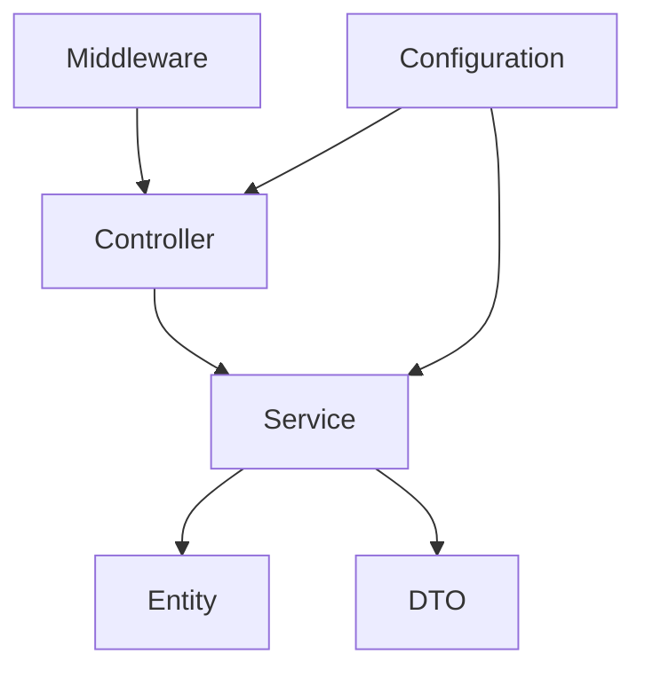

**Diagram sources**

- [code-agent-backend/src/configuration.ts](file://code-agent-backend/src/configuration.ts)
- [code-agent-backend/src/controller/code-agent/frontend-workflow.ts](file://code-agent-backend/src/controller/code-agent/frontend-workflow.ts)
- [code-agent-backend/src/service/code-agent/frontend-workflow.ts](file://code-agent-backend/src/service/code-agent/frontend-workflow.ts)

### Controller 层

Controller 层负责处理 HTTP 请求，是 MVC 架构的入口。以`frontend-workflow`控制器为例，它处理前端工作流的启动请求，并通过 SSE（Server-Sent Events）实现代码生成过程的实时状态推送。

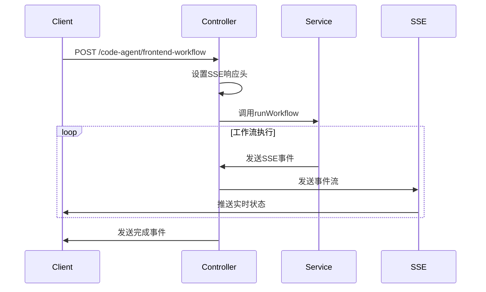

**Diagram sources**

- [code-agent-backend/src/controller/code-agent/frontend-workflow.ts](file://code-agent-backend/src/controller/code-agent/frontend-workflow.ts)

### Service 层

Service 层包含核心业务逻辑，负责协调数据访问和业务规则。`FrontendWorkflowService`服务通过依赖注入获取其他服务实例，体现了 Midway.js 的 IoC（控制反转）特性。

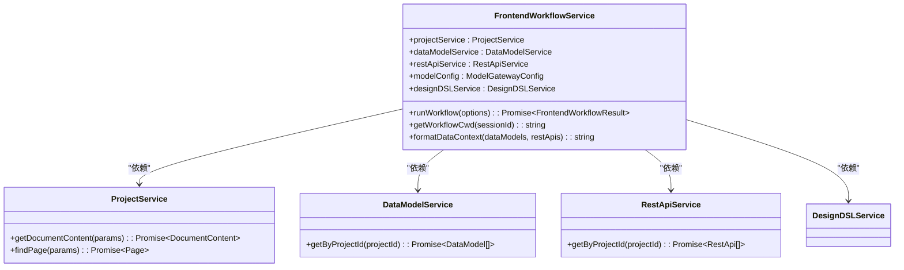

**Diagram sources**

- [code-agent-backend/src/service/code-agent/frontend-workflow.ts](file://code-agent-backend/src/service/code-agent/frontend-workflow.ts)
- [code-agent-backend/src/service/code-agent/project.ts](file://code-agent-backend/src/service/code-agent/project.ts)

### Entity 层

Entity 层定义了数据持久化模型，使用 Typegoose 与 MongoDB 进行映射。`DocumentReference`、`Page`和`Project`实体通过装饰器定义了数据库集合和字段约束。

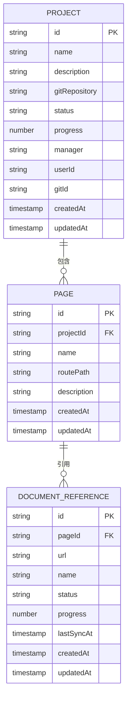

**Diagram sources**

- [code-agent-backend/src/entity/code-agent/project.ts](file://code-agent-backend/src/entity/code-agent/project.ts)

### DTO 层

DTO（Data Transfer Object）层定义了 API 的输入输出结构，通过`@midwayjs/validate`实现请求参数验证。`FrontendWorkflowRequestDTO`类使用装饰器定义了字段的验证规则和 Swagger 文档。

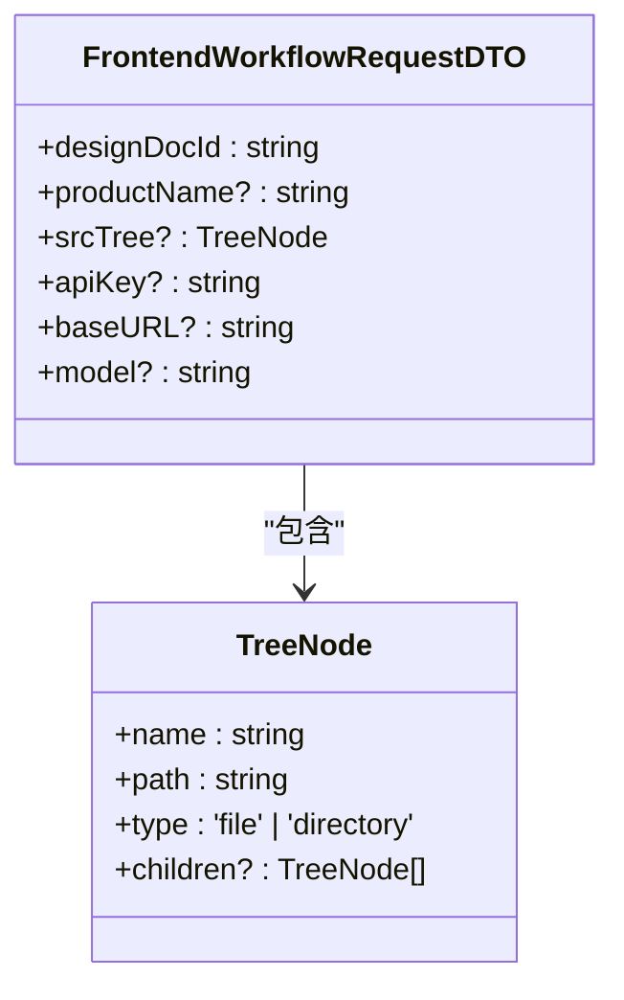

**Diagram sources**

- [code-agent-backend/src/dto/code-agent/frontend-workflow.dto.ts](file://code-agent-backend/src/dto/code-agent/frontend-workflow.dto.ts)

**Section sources**

- [code-agent-backend/src/controller/code-agent/frontend-workflow.ts](file://code-agent-backend/src/controller/code-agent/frontend-workflow.ts)
- [code-agent-backend/src/service/code-agent/frontend-workflow.ts](file://code-agent-backend/src/service/code-agent/frontend-workflow.ts)
- [code-agent-backend/src/dto/code-agent/frontend-workflow.dto.ts](file://code-agent-backend/src/dto/code-agent/frontend-workflow.dto.ts)
- [code-agent-backend/src/entity/code-agent/project.ts](file://code-agent-backend/src/entity/code-agent/project.ts)

## 前端架构：React 19 + Vite

前端应用采用 React 19 + Vite 的现代化 UI 架构，提供了高效的开发体验和优化的生产构建。

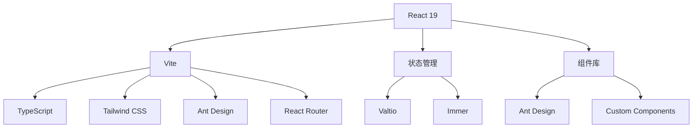

**Diagram sources**

- [fta-layout-design/package.json](file://fta-layout-design/package.json)
- [fta-layout-design/vite.config.ts](file://fta-layout-design/vite.config.ts)

### Vite 构建配置

Vite 配置文件定义了项目别名、插件和构建选项，优化了开发和构建体验。

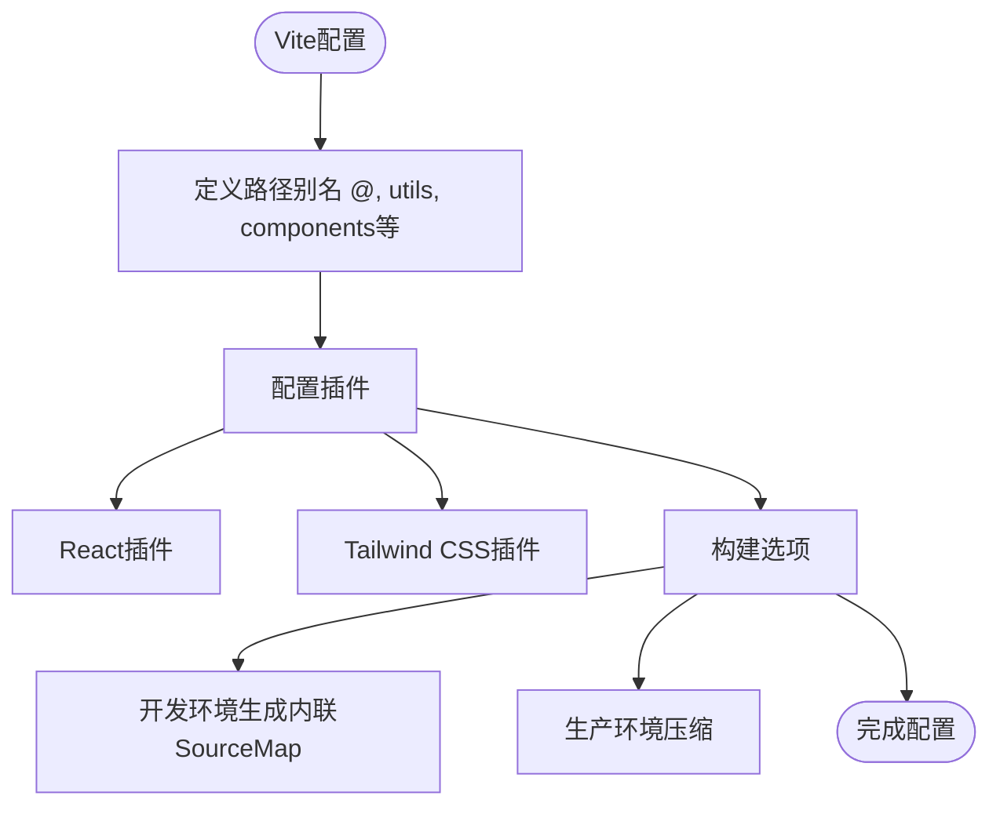

**Diagram sources**

- [fta-layout-design/vite.config.ts](file://fta-layout-design/vite.config.ts)

### 组件架构

前端采用组件化架构，将 UI 分解为可重用的组件。`EditorPage`作为核心页面，通过 Context API 管理状态。

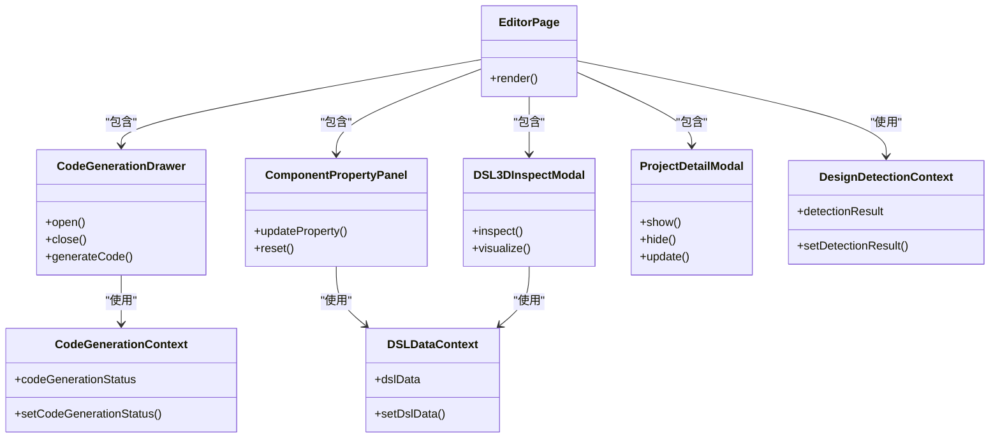

**Diagram sources**

- [fta-layout-design/src/pages/EditorPage/EditorPageComponentDetect.tsx](file://fta-layout-design/src/pages/EditorPage/EditorPageComponentDetect.tsx)
- [fta-layout-design/src/contexts/CodeGenerationContext.tsx](file://fta-layout-design/src/contexts/CodeGenerationContext.tsx)

**Section sources**

- [fta-layout-design/package.json](file://fta-layout-design/package.json)
- [fta-layout-design/vite.config.ts](file://fta-layout-design/vite.config.ts)

## Agent Core：事件驱动执行模型

`fta-agent-core`是系统的核心引擎，采用事件驱动模型执行复杂的代码生成工作流。

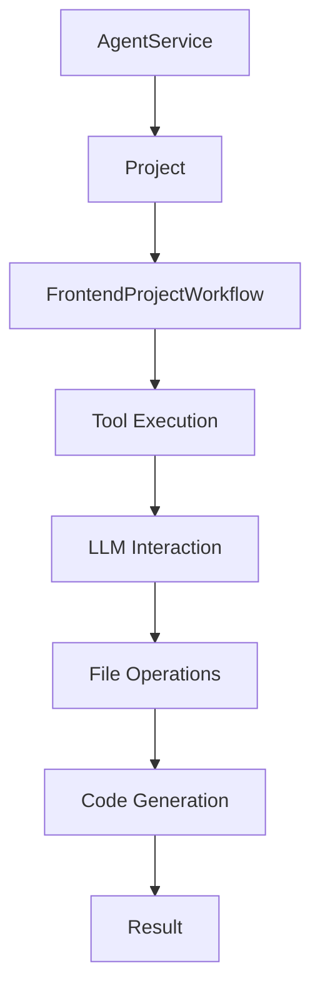

**Diagram sources**

- [fta-agent-core/src/index.ts](file://fta-agent-core/src/index.ts)
- [fta-agent-core/src/frontendProjectService.ts](file://fta-agent-core/src/frontendProjectService.ts)

### 核心模块

Agent Core 的核心模块通过事件回调机制实现异步通信和状态更新。

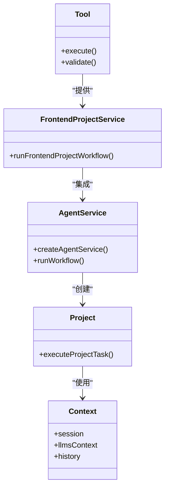

**Diagram sources**

- [fta-agent-core/src/index.ts](file://fta-agent-core/src/index.ts)

### 执行流程

事件驱动的执行流程确保了工作流的灵活性和可扩展性。

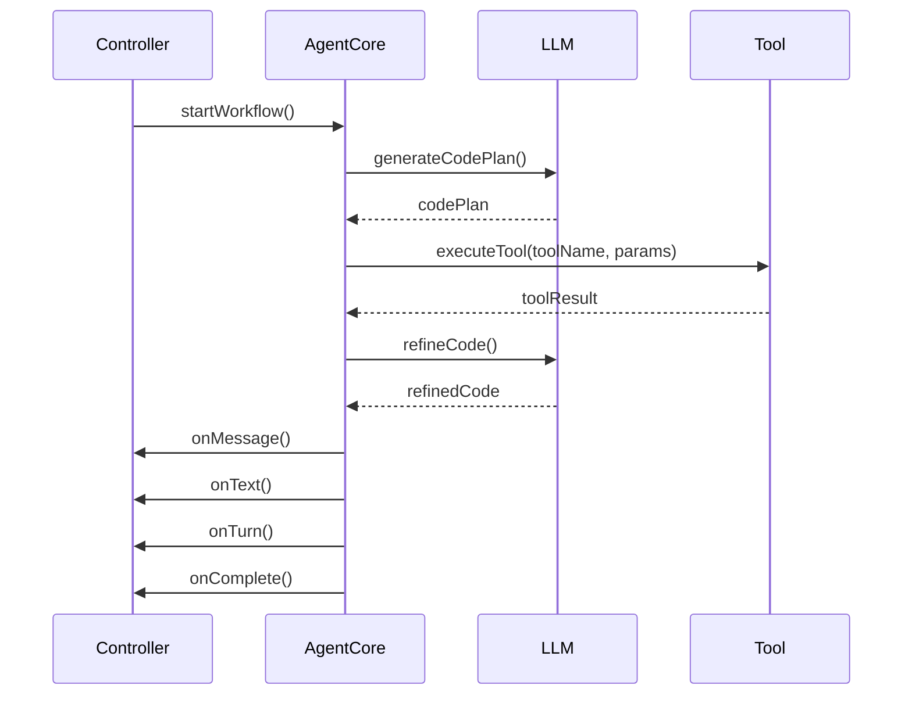

**Diagram sources**

- [fta-agent-core/src/frontendProjectService.ts](file://fta-agent-core/src/frontendProjectService.ts)

**Section sources**

- [fta-agent-core/package.json](file://fta-agent-core/package.json)
- [fta-agent-core/src/index.ts](file://fta-agent-core/src/index.ts)

## 关键技术选型

### SSE 实时状态推送

Server-Sent Events（SSE）用于实现代码生成过程的实时状态推送，相比 WebSocket 更轻量且更适合单向数据流场景。

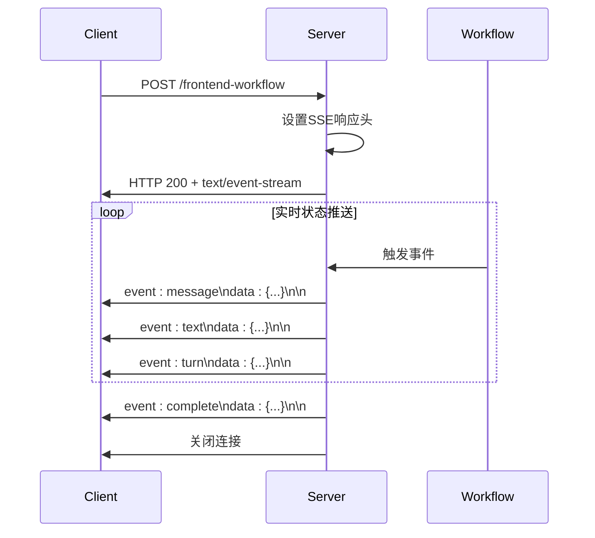

**Diagram sources**

- [code-agent-backend/src/controller/code-agent/frontend-workflow.ts](file://code-agent-backend/src/controller/code-agent/frontend-workflow.ts)

### MongoDB 存储设计 DSL 数据

MongoDB 作为 NoSQL 数据库，非常适合存储结构灵活的 DSL（Domain Specific Language）数据，支持嵌套文档和动态模式。

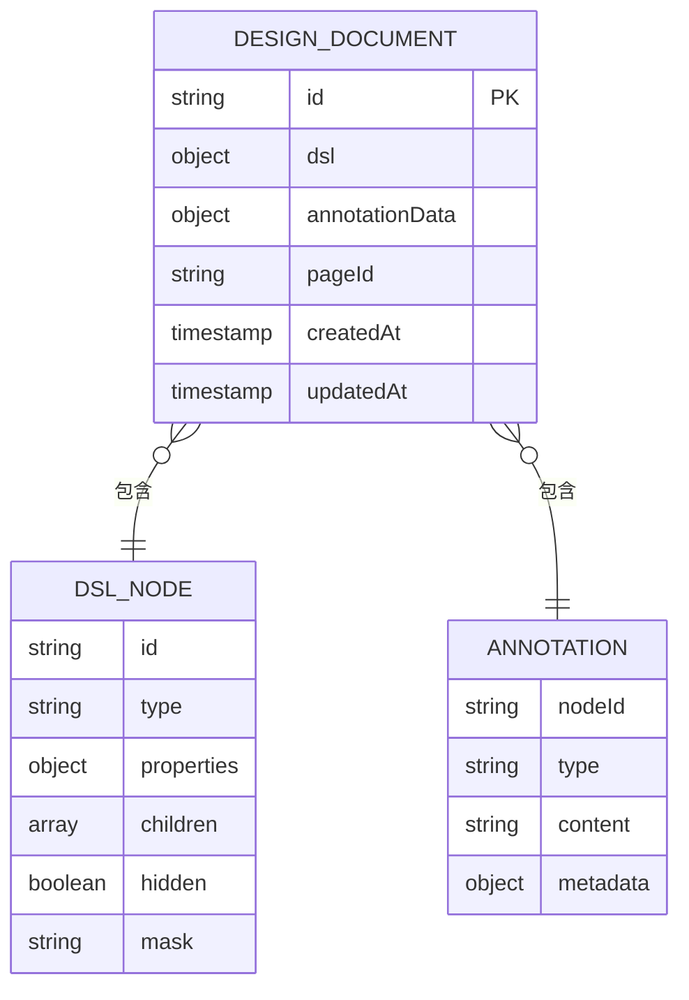

**Diagram sources**

- [code-agent-backend/src/entity/code-agent/design-dsl/path-asset.ts](file://code-agent-backend/src/entity/code-agent/design-dsl/path-asset.ts)

### Redis 缓存加速

Redis 用于缓存高频访问的数据，如设计 DSL 和组件注解，显著提升系统性能。

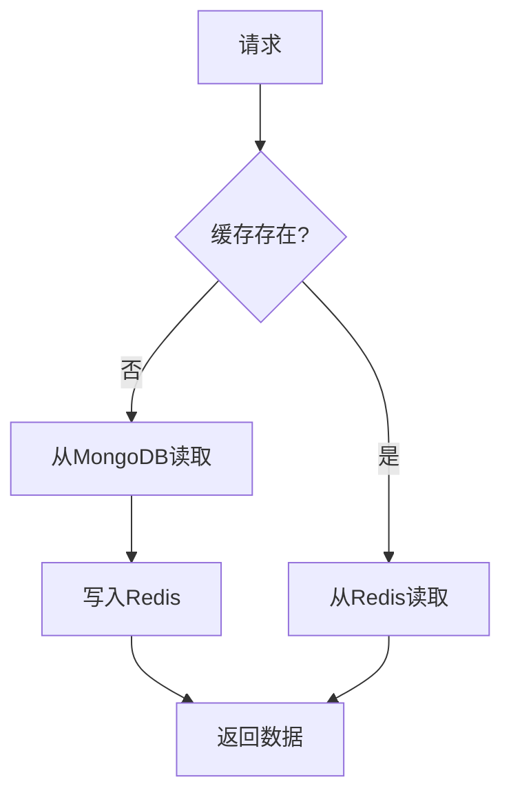

**Diagram sources**

- [code-agent-backend/src/config/config.default.ts](file://code-agent-backend/src/config/config.default.ts)

**Section sources**

- [code-agent-backend/src/controller/code-agent/frontend-workflow.ts](file://code-agent-backend/src/controller/code-agent/frontend-workflow.ts)
- [code-agent-backend/src/config/config.default.ts](file://code-agent-backend/src/config/config.default.ts)

## Yarn Workspaces 与共享类型

### Yarn Workspaces 配置

Yarn Workspaces 用于管理多包依赖，实现依赖共享和版本统一。

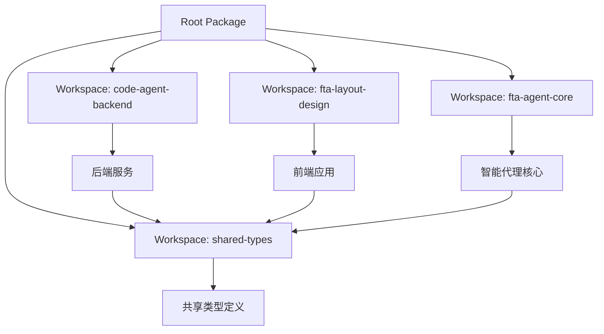

**Diagram sources**

- [package.json](file://package.json)

### 共享类型机制

`@fta/shared`包定义了跨服务共享的类型，确保类型一致性。

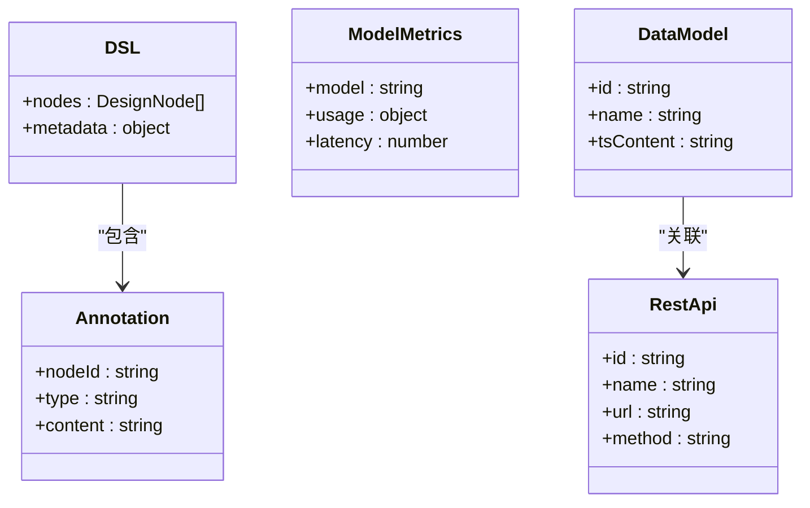

**Diagram sources**

- [shared-types/src/index.ts](file://shared-types/src/index.ts)

**Section sources**

- [package.json](file://package.json)
- [shared-types/package.json](file://shared-types/package.json)
- [shared-types/src/index.ts](file://shared-types/src/index.ts)

## 架构权衡分析

### 分层架构的优势

分层架构带来了显著的可维护性优势：

1. **关注点分离**：每个层有明确的职责，降低了代码耦合度。
2. **可测试性**：各层可以独立测试，Service 层可以轻松进行单元测试。
3. **可扩展性**：新增功能只需在相应层添加代码，不影响其他层。
4. **团队协作**：不同团队可以并行开发不同层的代码。

### 潜在的性能开销

分层架构也带来了一些潜在的性能开销：

1. **调用链路长**：请求需要经过 Controller->Service->Entity 多层调用，增加了函数调用开销。
2. **数据转换成本**：DTO 与 Entity 之间的转换需要额外的序列化/反序列化操作。
3. **内存占用**：分层架构可能导致更多的对象创建和内存占用。

### 优化策略

为缓解性能开销，系统采用了以下优化策略：

1. **缓存机制**：使用 Redis 缓存高频访问的数据，减少数据库查询。
2. **批量操作**：对数据库操作进行批量处理，减少 I/O 开销。
3. **流式处理**：使用 SSE 实现流式响应，避免一次性加载大量数据。
4. **类型复用**：通过共享类型减少重复定义和类型转换。

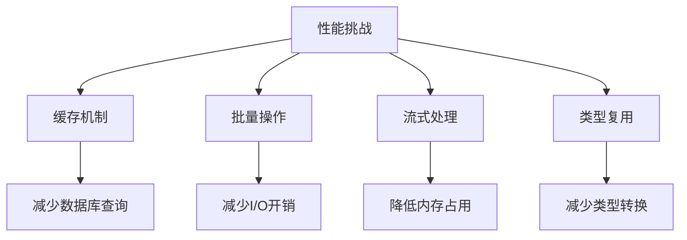

**Diagram sources**

- [code-agent-backend/src/config/config.default.ts](file://code-agent-backend/src/config/config.default.ts)
- [code-agent-backend/src/controller/code-agent/frontend-workflow.ts](file://code-agent-backend/src/controller/code-agent/frontend-workflow.ts)

**Section sources**

- [code-agent-backend/src/configuration.ts](file://code-agent-backend/src/configuration.ts)
- [code-agent-backend/src/config/config.default.ts](file://code-agent-backend/src/config/config.default.ts)
