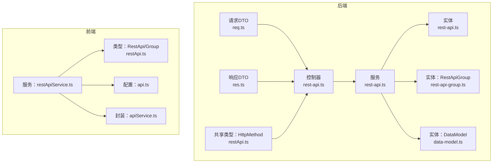
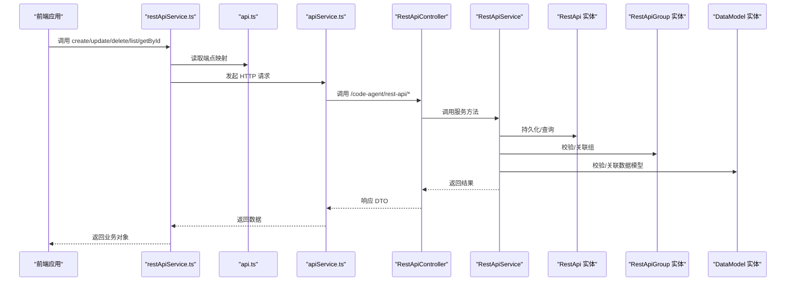
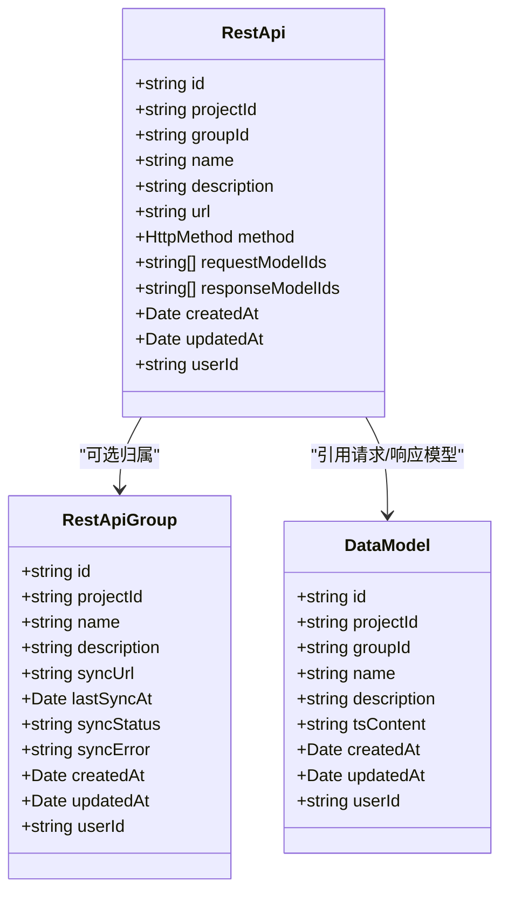

# REST API 实体

<cite>
**本文引用的文件**
- [rest-api.ts（实体）](file://code-agent-backend/src/entity/code-agent/rest-api.ts)
- [rest-api.ts（控制器）](file://code-agent-backend/src/controller/code-agent/rest-api.ts)
- [rest-api.ts（服务）](file://code-agent-backend/src/service/code-agent/rest-api.ts)
- [req.ts（请求DTO）](file://code-agent-backend/src/dto/code-agent/req.ts)
- [res.ts（响应DTO）](file://code-agent-backend/src/dto/code-agent/res.ts)
- [rest-api.ts（前端类型）](file://fta-layout-design/src/types/restApi.ts)
- [restApiService.ts（前端服务）](file://fta-layout-design/src/services/restApiService.ts)
- [api.ts（前端API配置）](file://fta-layout-design/src/config/api.ts)
- [apiService.ts（前端通用API封装）](file://fta-layout-design/src/utils/apiService.ts)
- [rest-api-group.ts（实体）](file://code-agent-backend/src/entity/code-agent/rest-api-group.ts)
- [data-model.ts（实体）](file://code-agent-backend/src/entity/code-agent/data-model.ts)
- [restApi.ts（共享类型）](file://shared-types/src/restApi.ts)
</cite>

## 目录
1. [简介](#简介)
2. [项目结构](#项目结构)
3. [核心组件](#核心组件)
4. [架构总览](#架构总览)
5. [详细组件分析](#详细组件分析)
6. [依赖关系分析](#依赖关系分析)
7. [性能考量](#性能考量)
8. [故障排查指南](#故障排查指南)
9. [结论](#结论)
10. [附录](#附录)

## 简介
本文件围绕后端实体与前后端协作流程，系统性梳理 REST API 实体的定义、持久化、与数据模型的关系、以及 CRUD 生命周期管理。重点覆盖：
- REST API 实体的核心字段与语义（id、projectId、groupId、name、description、url、method、requestModelIds、responseModelIds 等）
- 与数据模型（DataModel）的关联方式（通过 requestModelIds、responseModelIds 引用）
- 在数据库中的集合命名与查询策略
- 与 REST API 组（RestApiGroup）的层级关系
- 后端 Service 的 CRUD 实现与前端 restApiService 的调用链路

## 项目结构
REST API 相关代码分布在后端实体/控制器/服务层与前端类型/服务/配置层：
- 后端
  - 实体：code-agent-backend/src/entity/code-agent/rest-api.ts
  - 控制器：code-agent-backend/src/controller/code-agent/rest-api.ts
  - 服务：code-agent-backend/src/service/code-agent/rest-api.ts
  - DTO：code-agent-backend/src/dto/code-agent/req.ts、res.ts
  - 共享类型：shared-types/src/restApi.ts
- 前端
  - 类型：fta-layout-design/src/types/restApi.ts
  - 服务：fta-layout-design/src/services/restApiService.ts
  - API 配置：fta-layout-design/src/config/api.ts
  - 通用封装：fta-layout-design/src/utils/apiService.ts

图表来源
- [rest-api.ts（实体）](file://code-agent-backend/src/entity/code-agent/rest-api.ts#L1-L69)
- [rest-api.ts（控制器）](file://code-agent-backend/src/controller/code-agent/rest-api.ts#L1-L132)
- [rest-api.ts（服务）](file://code-agent-backend/src/service/code-agent/rest-api.ts#L1-L240)
- [req.ts（请求DTO）](file://code-agent-backend/src/dto/code-agent/req.ts#L523-L578)
- [res.ts（响应DTO）](file://code-agent-backend/src/dto/code-agent/res.ts#L390-L436)
- [rest-api-group.ts（实体）](file://code-agent-backend/src/entity/code-agent/rest-api-group.ts#L1-L64)
- [data-model.ts（实体）](file://code-agent-backend/src/entity/code-agent/data-model.ts#L1-L55)
- [rest-api.ts（前端类型）](file://fta-layout-design/src/types/restApi.ts#L37-L65)
- [restApiService.ts（前端服务）](file://fta-layout-design/src/services/restApiService.ts#L75-L134)
- [api.ts（前端API配置）](file://fta-layout-design/src/config/api.ts#L118-L126)
- [apiService.ts（前端通用API封装）](file://fta-layout-design/src/utils/apiService.ts#L461-L520)

章节来源
- [rest-api.ts（实体）](file://code-agent-backend/src/entity/code-agent/rest-api.ts#L1-L69)
- [rest-api.ts（控制器）](file://code-agent-backend/src/controller/code-agent/rest-api.ts#L1-L132)
- [rest-api.ts（服务）](file://code-agent-backend/src/service/code-agent/rest-api.ts#L1-L240)
- [rest-api.ts（前端类型）](file://fta-layout-design/src/types/restApi.ts#L37-L65)
- [restApiService.ts（前端服务）](file://fta-layout-design/src/services/restApiService.ts#L75-L134)
- [api.ts（前端API配置）](file://fta-layout-design/src/config/api.ts#L118-L126)
- [apiService.ts（前端通用API封装）](file://fta-layout-design/src/utils/apiService.ts#L461-L520)

## 核心组件
- REST API 实体（MongoDB 集合：code_agent_rest_api）
  - 字段要点：id、projectId、groupId、name、description、url、method、requestModelIds、responseModelIds、createdAt、updatedAt、userId
  - 关键约束：id 必填；projectId 必填；method 限定枚举；requestModelIds/responseModelIds 默认空数组
- REST API 组（MongoDB 集合：code_agent_rest_api_group）
  - 字段要点：id、projectId、name、description、syncUrl、lastSyncAt、syncStatus、syncError、createdAt、updatedAt、userId
- 数据模型（MongoDB 集合：code_agent_data_model）
  - 字段要点：id、projectId、groupId、name、description、tsContent、createdAt、updatedAt、userId
- 前后端类型与服务
  - 后端 DTO：CreateRestApiRequest、UpdateRestApiRequest、RestApiListResponse、RestApiDetailResponse 等
  - 前端类型：RestApi、CreateRestApiRequest、UpdateRestApiRequest 等
  - 前端服务：restApiService 提供 create/update/delete/list/getById 等方法
  - API 配置：统一端点映射与基础 URL 构建
  - 通用封装：apiService 统一封装请求/响应/错误处理

章节来源
- [rest-api.ts（实体）](file://code-agent-backend/src/entity/code-agent/rest-api.ts#L1-L69)
- [rest-api-group.ts（实体）](file://code-agent-backend/src/entity/code-agent/rest-api-group.ts#L1-L64)
- [data-model.ts（实体）](file://code-agent-backend/src/entity/code-agent/data-model.ts#L1-L55)
- [req.ts（请求DTO）](file://code-agent-backend/src/dto/code-agent/req.ts#L523-L578)
- [res.ts（响应DTO）](file://code-agent-backend/src/dto/code-agent/res.ts#L390-L436)
- [rest-api.ts（前端类型）](file://fta-layout-design/src/types/restApi.ts#L37-L65)
- [restApiService.ts（前端服务）](file://fta-layout-design/src/services/restApiService.ts#L75-L134)
- [api.ts（前端API配置）](file://fta-layout-design/src/config/api.ts#L118-L126)
- [apiService.ts（前端通用API封装）](file://fta-layout-design/src/utils/apiService.ts#L461-L520)

## 架构总览
REST API 的定义与管理贯穿“前端 -> 后端控制器 -> 服务 -> 实体”的完整链路，同时与 REST API 组、数据模型形成层级与引用关系。

图表来源
- [restApiService.ts（前端服务）](file://fta-layout-design/src/services/restApiService.ts#L75-L134)
- [api.ts（前端API配置）](file://fta-layout-design/src/config/api.ts#L118-L126)
- [apiService.ts（前端通用API封装）](file://fta-layout-design/src/utils/apiService.ts#L461-L520)
- [rest-api.ts（控制器）](file://code-agent-backend/src/controller/code-agent/rest-api.ts#L1-L132)
- [rest-api.ts（服务）](file://code-agent-backend/src/service/code-agent/rest-api.ts#L1-L240)
- [rest-api.ts（实体）](file://code-agent-backend/src/entity/code-agent/rest-api.ts#L1-L69)
- [rest-api-group.ts（实体）](file://code-agent-backend/src/entity/code-agent/rest-api-group.ts#L1-L64)
- [data-model.ts（实体）](file://code-agent-backend/src/entity/code-agent/data-model.ts#L1-L55)

## 详细组件分析

### REST API 实体与字段语义
- id：全局唯一标识，服务层生成
- projectId：所属项目标识，用于隔离与权限校验
- groupId：所属 REST API 组标识，可为空表示未分组
- name/description：接口名称与描述
- url/method：接口地址与 HTTP 方法（枚举限定）
- requestModelIds/responseModelIds：分别引用数据模型 id 列表，用于定义请求体与响应体结构
- createdAt/updatedAt：时间戳
- userId：创建者或归属用户，用于多租户隔离

持久化集合名：code_agent_rest_api

章节来源
- [rest-api.ts（实体）](file://code-agent-backend/src/entity/code-agent/rest-api.ts#L1-L69)

### 与数据模型（DataModel）的关联
- requestModelIds 与 responseModelIds 存储的是 DataModel 的 id 列表
- 服务层在创建/更新时会解析这些 id，但不会直接嵌入 DataModel 的 tsContent
- 建议在前端渲染或生成代码时，根据这些 id 拉取对应 DataModel 的 tsContent，以保证类型一致性
- 若需要强一致的 Schema 定义，可在服务层扩展：将 DataModel 的 tsContent 合并为 requestSchema/responseSchema 字段（当前实体未内置该字段）

章节来源
- [rest-api.ts（实体）](file://code-agent-backend/src/entity/code-agent/rest-api.ts#L48-L54)
- [data-model.ts（实体）](file://code-agent-backend/src/entity/code-agent/data-model.ts#L1-L55)

### 与 REST API 组（RestApiGroup）的层级关系
- RestApiGroup 用于对一组 REST API 进行分组管理，支持从远程 URL 同步接口
- RestApi 可通过 groupId 归属到某个组，未设置则视为未分组
- 服务层提供按组查询与未分组查询能力

章节来源
- [rest-api-group.ts（实体）](file://code-agent-backend/src/entity/code-agent/rest-api-group.ts#L1-L64)
- [rest-api.ts（服务）](file://code-agent-backend/src/service/code-agent/rest-api.ts#L201-L237)

### 后端 Service 的 CRUD 与权限校验
- 权限校验：通过 ctx 上下文解析 userId，所有 CRUD 操作均以 userId 作为安全边界
- 创建：生成 id、校验项目存在、写入默认时间戳、返回实体
- 更新：仅更新允许字段，自动更新时间戳
- 删除：先校验存在性再删除
- 查询：
  - 按项目：按创建时间倒序
  - 按组：按创建时间倒序
  - 未分组：groupId 为空或不存在
- 服务层未对 requestModelIds/responseModelIds 做额外校验（如数据模型存在性），建议在业务层补充

章节来源
- [rest-api.ts（服务）](file://code-agent-backend/src/service/code-agent/rest-api.ts#L47-L237)

### 前端 restApiService 的调用链
- restApiService 封装了 create/update/delete/list/getById 等方法
- 通过 api.ts 的端点映射与 apiService.ts 的通用封装发起请求
- 返回值为前端类型定义的 RestApi 对象

章节来源
- [restApiService.ts（前端服务）](file://fta-layout-design/src/services/restApiService.ts#L75-L134)
- [api.ts（前端API配置）](file://fta-layout-design/src/config/api.ts#L118-L126)
- [apiService.ts（前端通用API封装）](file://fta-layout-design/src/utils/apiService.ts#L461-L520)
- [rest-api.ts（前端类型）](file://fta-layout-design/src/types/restApi.ts#L37-L65)

### 示例：定义 GET /users 获取用户列表并关联“用户信息”数据模型
- 步骤
  - 在前端创建数据模型“用户信息”，记录其 id
  - 在前端创建 REST API：方法为 GET，路径为 /users，groupId 可选，responseModelIds 填写“用户信息”模型 id
  - 调用 restApiService.create 完成创建
- 注意
  - requestModelIds 通常为空（GET 无请求体），若需要查询参数，可单独定义数据模型并在请求时引用
  - 响应体 schema 由 responseModelIds 指向的 DataModel tsContent 决定

章节来源
- [req.ts（请求DTO）](file://code-agent-backend/src/dto/code-agent/req.ts#L523-L578)
- [res.ts（响应DTO）](file://code-agent-backend/src/dto/code-agent/res.ts#L390-L436)
- [restApiService.ts（前端服务）](file://fta-layout-design/src/services/restApiService.ts#L75-L134)
- [data-model.ts（实体）](file://code-agent-backend/src/entity/code-agent/data-model.ts#L1-L55)

## 依赖关系分析

图表来源
- [rest-api.ts（实体）](file://code-agent-backend/src/entity/code-agent/rest-api.ts#L1-L69)
- [rest-api-group.ts（实体）](file://code-agent-backend/src/entity/code-agent/rest-api-group.ts#L1-L64)
- [data-model.ts（实体）](file://code-agent-backend/src/entity/code-agent/data-model.ts#L1-L55)

章节来源
- [rest-api.ts（实体）](file://code-agent-backend/src/entity/code-agent/rest-api.ts#L1-L69)
- [rest-api-group.ts（实体）](file://code-agent-backend/src/entity/code-agent/rest-api-group.ts#L1-L64)
- [data-model.ts（实体）](file://code-agent-backend/src/entity/code-agent/data-model.ts#L1-L55)

## 性能考量
- 查询排序：按 createdAt 倒序，适合高频读取场景
- 空间占用：requestModelIds/responseModelIds 采用字符串数组存储，便于快速检索与去重
- 索引建议（基于现有实现）：可考虑为 projectId、groupId、userId 建立复合索引以优化查询
- 数据一致性：当前实体未内置 requestSchema/responseSchema 字段，若需强一致 schema，可在服务层聚合 DataModel 的 tsContent 后落库

## 故障排查指南
- 404/400/500 状态
  - 控制器对异常进行状态码设置与抛错，前端可通过 apiService 的错误处理捕获
- 用户 ID 缺失
  - 服务层解析 userId 失败会抛出错误，需检查鉴权中间件与上下文
- 项目不存在
  - 创建/更新/查询前会校验项目存在性，需确认 projectId 与 userId 的匹配
- 未分组查询
  - 服务层使用 $or 条件查询 groupId 为空或不存在的 API，注意 MongoDB 索引与性能

章节来源
- [rest-api.ts（控制器）](file://code-agent-backend/src/controller/code-agent/rest-api.ts#L24-L130)
- [rest-api.ts（服务）](file://code-agent-backend/src/service/code-agent/rest-api.ts#L63-L149)
- [apiService.ts（前端通用API封装）](file://fta-layout-design/src/utils/apiService.ts#L118-L149)

## 结论
REST API 实体以清晰的字段语义与严格的权限边界支撑了 API 定义与管理。通过 requestModelIds/responseModelIds 与 DataModel 关联，实现了类型一致性与可演进的 Schema 管理。配合 RestApiGroup 的分组能力与前端 restApiService 的统一调用，形成了从前端到后端的闭环。建议在业务层补充对引用数据模型的存在性校验与 Schema 聚合，进一步提升系统的健壮性与可维护性。

## 附录

### 字段对照表
- 后端实体字段与前端类型字段一一对应，便于跨层传递
- HttpMethod 由共享类型定义，前后端保持一致

章节来源
- [rest-api.ts（实体）](file://code-agent-backend/src/entity/code-agent/rest-api.ts#L1-L69)
- [rest-api.ts（前端类型）](file://fta-layout-design/src/types/restApi.ts#L37-L65)
- [restApi.ts（共享类型）](file://shared-types/src/restApi.ts#L1-L11)