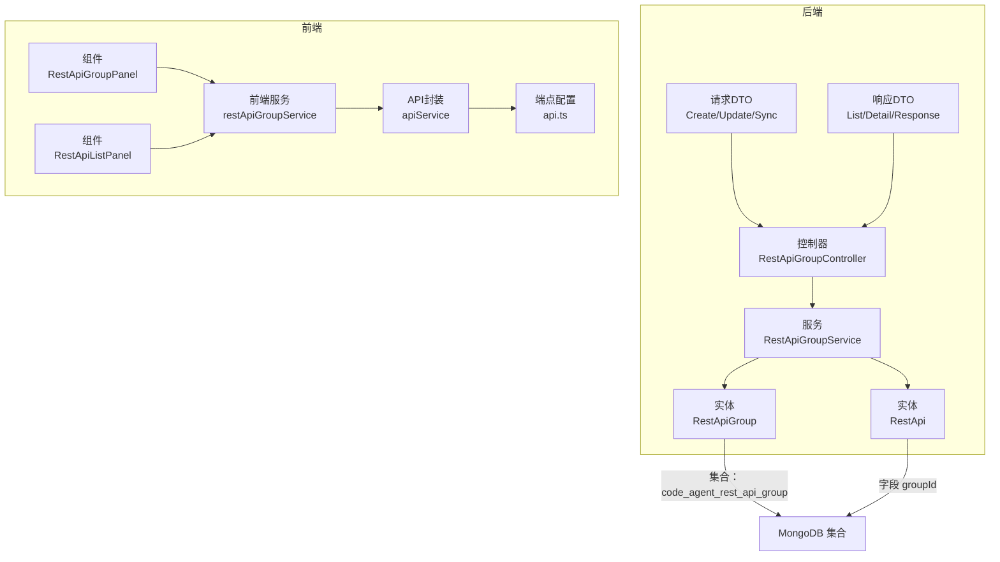
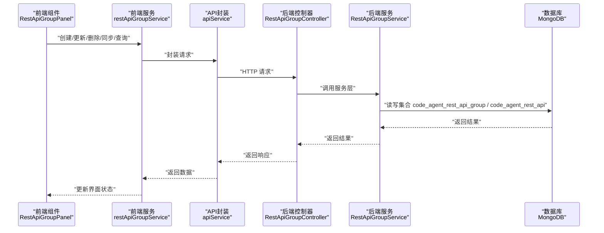
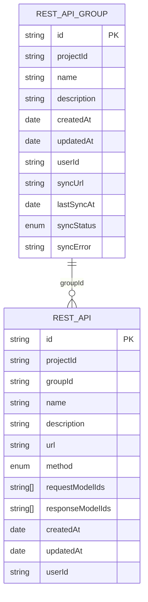
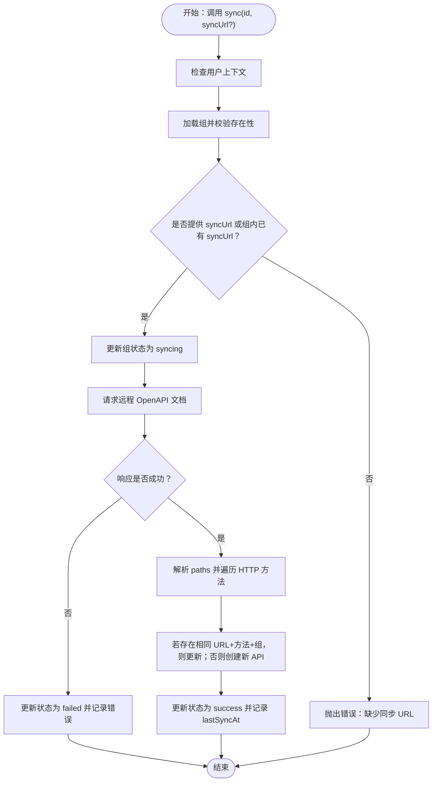
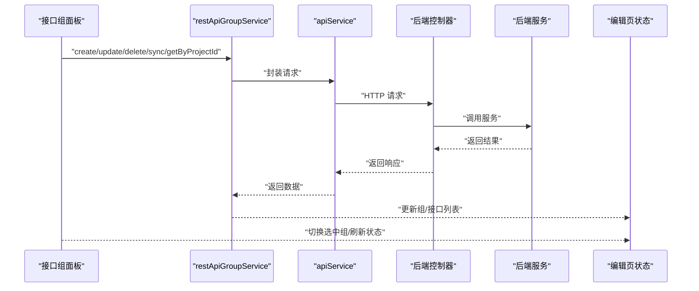
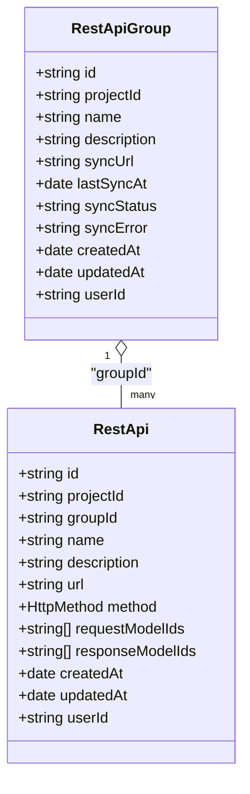
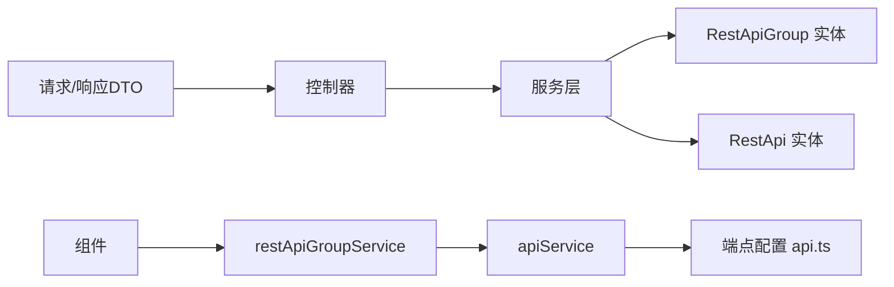

# REST API 组

<cite>
**本文引用的文件**
- [rest-api-group.ts（实体）](file://code-agent-backend/src/entity/code-agent/rest-api-group.ts)
- [rest-api.ts（实体）](file://code-agent-backend/src/entity/code-agent/rest-api.ts)
- [rest-api-group.ts（控制器）](file://code-agent-backend/src/controller/code-agent/rest-api-group.ts)
- [rest-api-group.ts（服务）](file://code-agent-backend/src/service/code-agent/rest-api-group.ts)
- [req.ts（请求DTO）](file://code-agent-backend/src/dto/code-agent/req.ts)
- [res.ts（响应DTO）](file://code-agent-backend/src/dto/code-agent/res.ts)
- [restApiService.ts（前端服务）](file://fta-layout-design/src/services/restApiService.ts)
- [apiService.ts（前端API封装）](file://fta-layout-design/src/utils/apiService.ts)
- [api.ts（前端端点配置）](file://fta-layout-design/src/config/api.ts)
- [RestApiGroupPanel（前端组件）](file://fta-layout-design/src/pages/EditorPage/components/RestApiGroupPanel/index.tsx)
- [RestApiListPanel（前端组件）](file://fta-layout-design/src/pages/EditorPage/components/RestApiListPanel/index.tsx)
- [restApi.ts（共享类型）](file://shared-types/src/restApi.ts)
</cite>

## 目录
1. [简介](#简介)
2. [项目结构](#项目结构)
3. [核心组件](#核心组件)
4. [架构总览](#架构总览)
5. [详细组件分析](#详细组件分析)
6. [依赖关系分析](#依赖关系分析)
7. [性能考虑](#性能考虑)
8. [故障排查指南](#故障排查指南)
9. [结论](#结论)
10. [附录](#附录)

## 简介
本篇文档围绕“REST API 组（RestApiGroup）”展开，系统性说明其作为 REST API 端点集合的管理能力。重点涵盖：
- 字段语义与用途：id、projectId、name、description、createdAt、updatedAt、userId，以及用于远程同步的 syncUrl、lastSyncAt、syncStatus、syncError。
- 数据库存储与关系：集合名为 code_agent_rest_api_group；与 REST API 实体通过 groupId 形成“一对多”关系。
- 前后端工作流：前端通过 restApiGroupService 调用后端接口，实现创建、更新、删除、查询与同步；前端界面以“接口组”为筛选维度组织 API 列表。
- 实际应用示例：如何创建“支付服务”组，并将相关支付 API（如创建订单、查询支付状态）归入其中。

## 项目结构
REST API 组涉及后端实体与服务、控制器、DTO，以及前端服务、API 封装与界面组件。

图表来源
- [rest-api-group.ts（实体）](file://code-agent-backend/src/entity/code-agent/rest-api-group.ts#L1-L64)
- [rest-api.ts（实体）](file://code-agent-backend/src/entity/code-agent/rest-api.ts#L1-L69)
- [rest-api-group.ts（控制器）](file://code-agent-backend/src/controller/code-agent/rest-api-group.ts#L1-L123)
- [rest-api-group.ts（服务）](file://code-agent-backend/src/service/code-agent/rest-api-group.ts#L1-L331)
- [req.ts（请求DTO）](file://code-agent-backend/src/dto/code-agent/req.ts#L492-L521)
- [res.ts（响应DTO）](file://code-agent-backend/src/dto/code-agent/res.ts#L339-L389)
- [restApiService.ts（前端服务）](file://fta-layout-design/src/services/restApiService.ts#L1-L71)
- [apiService.ts（前端API封装）](file://fta-layout-design/src/utils/apiService.ts#L779-L811)
- [api.ts（前端端点配置）](file://fta-layout-design/src/config/api.ts#L109-L116)
- [RestApiGroupPanel（前端组件）](file://fta-layout-design/src/pages/EditorPage/components/RestApiGroupPanel/index.tsx#L1-L440)
- [RestApiListPanel（前端组件）](file://fta-layout-design/src/pages/EditorPage/components/RestApiListPanel/index.tsx#L1-L178)

章节来源
- [rest-api-group.ts（实体）](file://code-agent-backend/src/entity/code-agent/rest-api-group.ts#L1-L64)
- [rest-api.ts（实体）](file://code-agent-backend/src/entity/code-agent/rest-api.ts#L1-L69)
- [rest-api-group.ts（控制器）](file://code-agent-backend/src/controller/code-agent/rest-api-group.ts#L1-L123)
- [rest-api-group.ts（服务）](file://code-agent-backend/src/service/code-agent/rest-api-group.ts#L1-L331)
- [restApiService.ts（前端服务）](file://fta-layout-design/src/services/restApiService.ts#L1-L71)
- [apiService.ts（前端API封装）](file://fta-layout-design/src/utils/apiService.ts#L779-L811)
- [api.ts（前端端点配置）](file://fta-layout-design/src/config/api.ts#L109-L116)
- [RestApiGroupPanel（前端组件）](file://fta-layout-design/src/pages/EditorPage/components/RestApiGroupPanel/index.tsx#L1-L440)
- [RestApiListPanel（前端组件）](file://fta-layout-design/src/pages/EditorPage/components/RestApiListPanel/index.tsx#L1-L178)

## 核心组件
- 后端实体
  - RestApiGroup：用于对 REST API 进行逻辑分组，支持远程 OpenAPI/Swagger 文档同步。
  - RestApi：REST API 定义，通过 groupId 与 RestApiGroup 建立“一对多”关系。
- 控制器与服务
  - RestApiGroupController：提供创建、更新、删除、按项目查询、按 ID 查询、同步等接口。
  - RestApiGroupService：负责鉴权、数据校验、持久化、OpenAPI 文档解析与同步。
- 前端服务与界面
  - restApiGroupService：封装 REST API 组的 CRUD 与同步调用。
  - apiService：统一请求封装、错误处理与超时控制。
  - RestApiGroupPanel：接口组列表与操作入口，支持创建、编辑、删除、同步。
  - RestApiListPanel：基于组筛选与搜索的 API 列表视图。

章节来源
- [rest-api-group.ts（实体）](file://code-agent-backend/src/entity/code-agent/rest-api-group.ts#L1-L64)
- [rest-api.ts（实体）](file://code-agent-backend/src/entity/code-agent/rest-api.ts#L1-L69)
- [rest-api-group.ts（控制器）](file://code-agent-backend/src/controller/code-agent/rest-api-group.ts#L1-L123)
- [rest-api-group.ts（服务）](file://code-agent-backend/src/service/code-agent/rest-api-group.ts#L1-L331)
- [restApiService.ts（前端服务）](file://fta-layout-design/src/services/restApiService.ts#L1-L71)
- [apiService.ts（前端API封装）](file://fta-layout-design/src/utils/apiService.ts#L779-L811)
- [RestApiGroupPanel（前端组件）](file://fta-layout-design/src/pages/EditorPage/components/RestApiGroupPanel/index.tsx#L1-L440)
- [RestApiListPanel（前端组件）](file://fta-layout-design/src/pages/EditorPage/components/RestApiListPanel/index.tsx#L1-L178)

## 架构总览
后端采用控制器-服务-实体三层结构，前端通过统一 API 封装调用后端端点，界面组件负责交互与筛选。

图表来源
- [rest-api-group.ts（控制器）](file://code-agent-backend/src/controller/code-agent/rest-api-group.ts#L1-L123)
- [rest-api-group.ts（服务）](file://code-agent-backend/src/service/code-agent/rest-api-group.ts#L1-L331)
- [restApiService.ts（前端服务）](file://fta-layout-design/src/services/restApiService.ts#L1-L71)
- [apiService.ts（前端API封装）](file://fta-layout-design/src/utils/apiService.ts#L779-L811)
- [RestApiGroupPanel（前端组件）](file://fta-layout-design/src/pages/EditorPage/components/RestApiGroupPanel/index.tsx#L1-L440)

## 详细组件分析

### 字段与语义说明
- id：组唯一标识，服务层生成。
- projectId：所属项目 ID，用于隔离不同项目的 API 组。
- name：组名称，用于在前端界面中显示与筛选。
- description：组描述，便于团队理解用途。
- createdAt/updatedAt：时间戳，由 Typegoose 自动维护。
- userId：用户 ID，用于鉴权与数据隔离。
- syncUrl：远程 OpenAPI/Swagger 文档地址，支持从远程同步接口。
- lastSyncAt：最近一次同步时间。
- syncStatus：同步状态（idle/syncing/success/failed）。
- syncError：同步错误信息。

章节来源
- [rest-api-group.ts（实体）](file://code-agent-backend/src/entity/code-agent/rest-api-group.ts#L1-L64)
- [rest-api-group.ts（服务）](file://code-agent-backend/src/service/code-agent/rest-api-group.ts#L197-L260)

### 数据库存储与关系
- 集合命名：code_agent_rest_api_group（RestApiGroup）、code_agent_rest_api（RestApi）。
- 关系模型：RestApiGroup 与 RestApi 为“一对多”，RestApi 的 groupId 指向 RestApiGroup 的 id。

图表来源
- [rest-api-group.ts（实体）](file://code-agent-backend/src/entity/code-agent/rest-api-group.ts#L1-L64)
- [rest-api.ts（实体）](file://code-agent-backend/src/entity/code-agent/rest-api.ts#L1-L69)

章节来源
- [rest-api-group.ts（实体）](file://code-agent-backend/src/entity/code-agent/rest-api-group.ts#L1-L64)
- [rest-api.ts（实体）](file://code-agent-backend/src/entity/code-agent/rest-api.ts#L1-L69)

### 后端服务：同步 OpenAPI 文档流程
服务层支持从远程 OpenAPI/Swagger 文档解析并创建/更新对应 API，同时维护组的同步状态与错误信息。

图表来源
- [rest-api-group.ts（服务）](file://code-agent-backend/src/service/code-agent/rest-api-group.ts#L197-L328)

章节来源
- [rest-api-group.ts（服务）](file://code-agent-backend/src/service/code-agent/rest-api-group.ts#L197-L328)

### 前端工作流：接口组管理与筛选
- 接口组面板（RestApiGroupPanel）
  - 提供创建、编辑、删除、同步等操作。
  - 支持“全部/未分组/各组”的筛选，统计各组下接口数量。
  - 同步完成后刷新组状态与新增接口列表。
- 接口列表面板（RestApiListPanel）
  - 基于组筛选与关键词搜索，展示接口名称、方法、URL 与描述。
  - 支持删除接口与查看详情。

图表来源
- [RestApiGroupPanel（前端组件）](file://fta-layout-design/src/pages/EditorPage/components/RestApiGroupPanel/index.tsx#L1-L440)
- [RestApiListPanel（前端组件）](file://fta-layout-design/src/pages/EditorPage/components/RestApiListPanel/index.tsx#L1-L178)
- [restApiService.ts（前端服务）](file://fta-layout-design/src/services/restApiService.ts#L1-L71)
- [apiService.ts（前端API封装）](file://fta-layout-design/src/utils/apiService.ts#L779-L811)
- [rest-api-group.ts（控制器）](file://code-agent-backend/src/controller/code-agent/rest-api-group.ts#L1-L123)
- [rest-api-group.ts（服务）](file://code-agent-backend/src/service/code-agent/rest-api-group.ts#L1-L331)

章节来源
- [RestApiGroupPanel（前端组件）](file://fta-layout-design/src/pages/EditorPage/components/RestApiGroupPanel/index.tsx#L1-L440)
- [RestApiListPanel（前端组件）](file://fta-layout-design/src/pages/EditorPage/components/RestApiListPanel/index.tsx#L1-L178)
- [restApiService.ts（前端服务）](file://fta-layout-design/src/services/restApiService.ts#L1-L71)
- [apiService.ts（前端API封装）](file://fta-layout-design/src/utils/apiService.ts#L779-L811)
- [rest-api-group.ts（控制器）](file://code-agent-backend/src/controller/code-agent/rest-api-group.ts#L1-L123)
- [rest-api-group.ts（服务）](file://code-agent-backend/src/service/code-agent/rest-api-group.ts#L1-L331)

### 类与关系图（代码级）

图表来源
- [rest-api-group.ts（实体）](file://code-agent-backend/src/entity/code-agent/rest-api-group.ts#L1-L64)
- [rest-api.ts（实体）](file://code-agent-backend/src/entity/code-agent/rest-api.ts#L1-L69)
- [restApi.ts（共享类型）](file://shared-types/src/restApi.ts#L1-L11)

章节来源
- [rest-api-group.ts（实体）](file://code-agent-backend/src/entity/code-agent/rest-api-group.ts#L1-L64)
- [rest-api.ts（实体）](file://code-agent-backend/src/entity/code-agent/rest-api.ts#L1-L69)
- [restApi.ts（共享类型）](file://shared-types/src/restApi.ts#L1-L11)

## 依赖关系分析
- 后端
  - 控制器依赖服务层；服务层依赖实体模型与上下文；实体模型使用 Typegoose 注解与 Typegoose Typegoose。
  - DTO 定义请求与响应结构，控制器与服务通过 DTO 进行输入输出约束。
- 前端
  - restApiGroupService 依赖 apiService；apiService 依赖端点配置 api.ts；组件依赖状态与上下文。

图表来源
- [req.ts（请求DTO）](file://code-agent-backend/src/dto/code-agent/req.ts#L492-L521)
- [res.ts（响应DTO）](file://code-agent-backend/src/dto/code-agent/res.ts#L339-L389)
- [rest-api-group.ts（控制器）](file://code-agent-backend/src/controller/code-agent/rest-api-group.ts#L1-L123)
- [rest-api-group.ts（服务）](file://code-agent-backend/src/service/code-agent/rest-api-group.ts#L1-L331)
- [restApiService.ts（前端服务）](file://fta-layout-design/src/services/restApiService.ts#L1-L71)
- [apiService.ts（前端API封装）](file://fta-layout-design/src/utils/apiService.ts#L779-L811)
- [api.ts（前端端点配置）](file://fta-layout-design/src/config/api.ts#L109-L116)
- [RestApiGroupPanel（前端组件）](file://fta-layout-design/src/pages/EditorPage/components/RestApiGroupPanel/index.tsx#L1-L440)

章节来源
- [req.ts（请求DTO）](file://code-agent-backend/src/dto/code-agent/req.ts#L492-L521)
- [res.ts（响应DTO）](file://code-agent-backend/src/dto/code-agent/res.ts#L339-L389)
- [rest-api-group.ts（控制器）](file://code-agent-backend/src/controller/code-agent/rest-api-group.ts#L1-L123)
- [rest-api-group.ts（服务）](file://code-agent-backend/src/service/code-agent/rest-api-group.ts#L1-L331)
- [restApiService.ts（前端服务）](file://fta-layout-design/src/services/restApiService.ts#L1-L71)
- [apiService.ts（前端API封装）](file://fta-layout-design/src/utils/apiService.ts#L779-L811)
- [api.ts（前端端点配置）](file://fta-layout-design/src/config/api.ts#L109-L116)
- [RestApiGroupPanel（前端组件）](file://fta-layout-design/src/pages/EditorPage/components/RestApiGroupPanel/index.tsx#L1-L440)

## 性能考虑
- 同步策略
  - 仅在必要时触发同步，避免频繁请求远程文档。
  - 对远程文档响应进行缓存与错误重试策略（建议在服务层扩展）。
- 数据量优化
  - 查询组列表时按时间倒序，减少前端排序成本。
  - 组件侧按组筛选与搜索，降低渲染压力。
- 网络与超时
  - 前端统一超时与错误处理，避免阻塞 UI。
  - 同步状态可视化，及时反馈用户。

[本节为通用指导，无需特定文件引用]

## 故障排查指南
- 常见错误与定位
  - 用户上下文缺失：服务层会检查 userId，若为空则抛错。请确认登录态与用户上下文传递。
  - 组不存在：更新/删除/同步前需确保组存在且属于当前用户。
  - 缺少同步 URL：同步前需提供 syncUrl 或组内已配置 syncUrl。
  - 远程文档不可达：HTTP 状态非 2xx 时会记录失败状态与错误信息。
- 前端提示
  - 同步状态标签会显示“同步中/已同步/同步失败/待同步”，失败时可在组详情查看错误信息。
  - 删除组时会提示组内接口数量，避免误删。

章节来源
- [rest-api-group.ts（服务）](file://code-agent-backend/src/service/code-agent/rest-api-group.ts#L81-L162)
- [rest-api-group.ts（服务）](file://code-agent-backend/src/service/code-agent/rest-api-group.ts#L197-L260)
- [RestApiGroupPanel（前端组件）](file://fta-layout-design/src/pages/EditorPage/components/RestApiGroupPanel/index.tsx#L130-L191)

## 结论
REST API 组为 REST API 的逻辑分组与远程同步提供了完整能力。后端通过服务层实现鉴权、校验与 OpenAPI 文档解析，前端通过统一的服务封装与界面组件实现便捷的管理体验。通过“接口组”这一维度，团队可以更高效地组织与检索 API，提升协作效率。

[本节为总结，无需特定文件引用]

## 附录

### 实际应用示例：创建“支付服务”组并归集相关 API
- 步骤
  1) 在前端“接口组面板”创建组，命名为“支付服务”，可选填写描述与同步 URL。
  2) 若提供同步 URL，可选择立即同步，系统将从远程 OpenAPI 文档解析并创建/更新对应接口。
  3) 在“接口列表面板”中选择“支付服务”组，即可看到已同步的支付相关接口。
  4) 如需手动维护，可在接口列表中为具体接口设置 groupId，使其归属“支付服务”。

章节来源
- [RestApiGroupPanel（前端组件）](file://fta-layout-design/src/pages/EditorPage/components/RestApiGroupPanel/index.tsx#L54-L129)
- [RestApiListPanel（前端组件）](file://fta-layout-design/src/pages/EditorPage/components/RestApiListPanel/index.tsx#L33-L56)
- [rest-api-group.ts（服务）](file://code-agent-backend/src/service/code-agent/rest-api-group.ts#L262-L328)