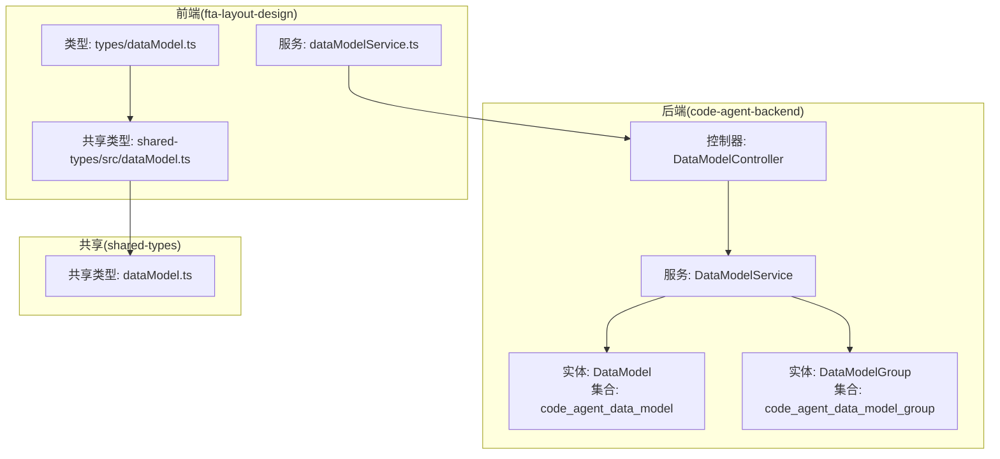
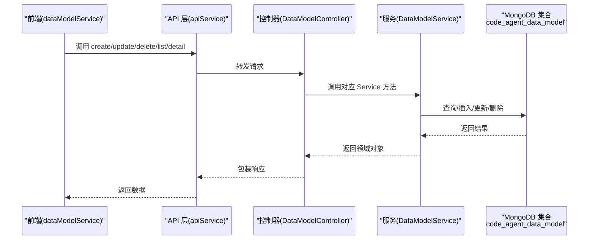
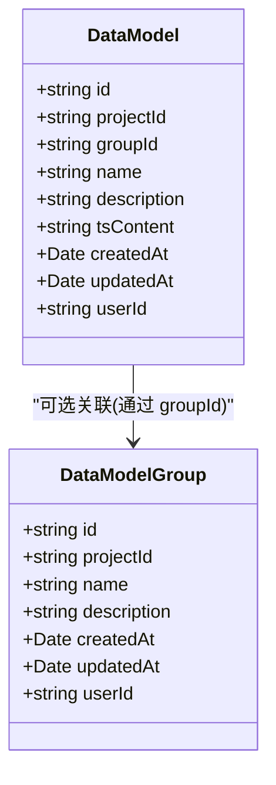
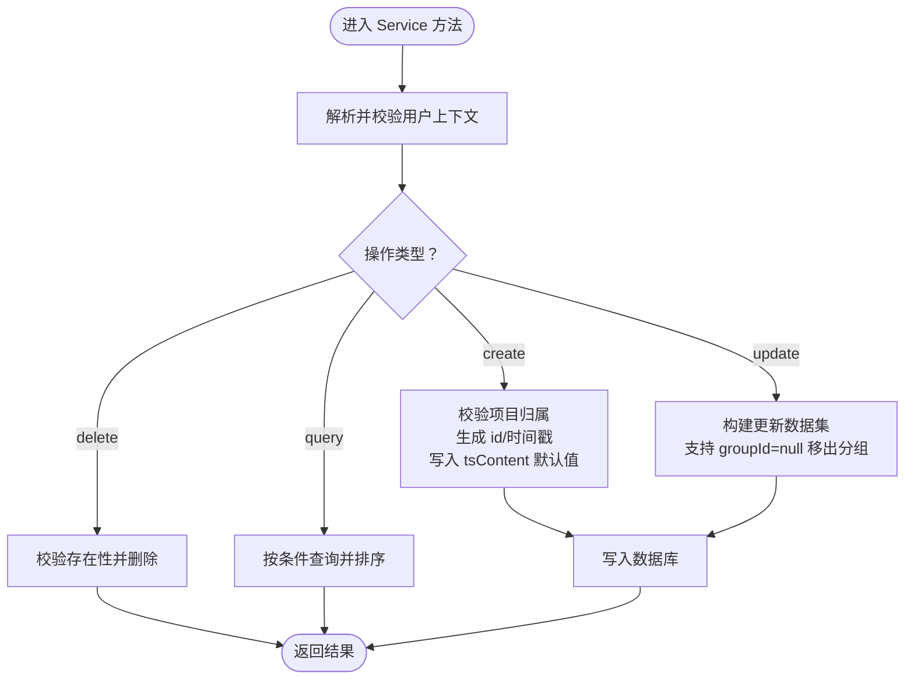
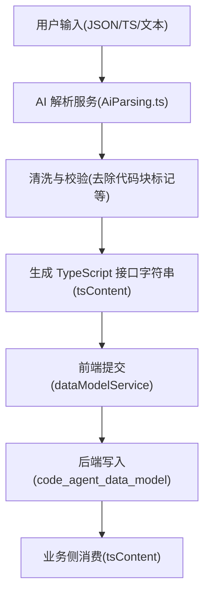
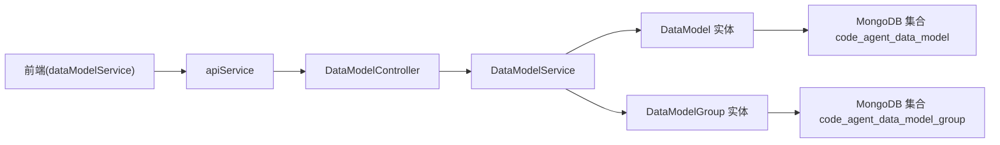

# 数据模型

<cite>
**本文引用的文件**
- [code-agent-backend/src/entity/code-agent/data-model.ts](file://code-agent-backend/src/entity/code-agent/data-model.ts)
- [code-agent-backend/src/service/code-agent/data-model.ts](file://code-agent-backend/src/service/code-agent/data-model.ts)
- [code-agent-backend/src/controller/code-agent/data-model.ts](file://code-agent-backend/src/controller/code-agent/data-model.ts)
- [code-agent-backend/src/dto/code-agent/req.ts](file://code-agent-backend/src/dto/code-agent/req.ts)
- [code-agent-backend/src/dto/code-agent/res.ts](file://code-agent-backend/src/dto/code-agent/res.ts)
- [code-agent-backend/src/entity/code-agent/data-model-group.ts](file://code-agent-backend/src/entity/code-agent/data-model-group.ts)
- [fta-layout-design/src/services/dataModelService.ts](file://fta-layout-design/src/services/dataModelService.ts)
- [fta-layout-design/src/utils/apiService.ts](file://fta-layout-design/src/utils/apiService.ts)
- [shared-types/src/dataModel.ts](file://shared-types/src/dataModel.ts)
- [fta-layout-design/src/types/dataModel.ts](file://fta-layout-design/src/types/dataModel.ts)
- [fta-layout-design/src/pages/EditorPage/services/AiParsing.ts](file://fta-layout-design/src/pages/EditorPage/services/AiParsing.ts)
- [docs/implementation_plan.md](file://docs/implementation_plan.md)
</cite>

## 目录
1. [简介](#简介)
2. [项目结构](#项目结构)
3. [核心组件](#核心组件)
4. [架构总览](#架构总览)
5. [详细组件分析](#详细组件分析)
6. [依赖分析](#依赖分析)
7. [性能考虑](#性能考虑)
8. [故障排查指南](#故障排查指南)
9. [结论](#结论)
10. [附录](#附录)

## 简介
本文件围绕数据模型（DataModel）实体的设计与实现进行全面说明，重点覆盖：
- 字段定义与用途：id、projectId、groupId、name、description、tsContent、createdAt、updatedAt、userId
- tsContent 字段如何承载 TypeScript 接口定义内容，并用于代码生成流程
- MongoDB 持久化方式（集合名称推断为 code_agent_data_model）
- 与 DataModelGroup 的关联关系（通过 groupId 实现可选分组）
- 后端 Service 方法（如 getById、getByProjectId）与前端 dataModelService 的 API 调用
- 开发者使用示例：通过 DTO（CreateDataModelRequest/UpdateDataModelRequest）进行数据验证

## 项目结构
数据模型功能横跨后端（code-agent-backend）、前端（fta-layout-design）与共享类型（shared-types）三个部分：
- 后端负责实体定义、服务层逻辑与控制器暴露 API
- 前端封装 API 调用，提供数据模型组与数据模型的 CRUD 能力
- 共享类型确保前后端一致的数据契约

图表来源
- [code-agent-backend/src/entity/code-agent/data-model.ts](file://code-agent-backend/src/entity/code-agent/data-model.ts#L1-L55)
- [code-agent-backend/src/entity/code-agent/data-model-group.ts](file://code-agent-backend/src/entity/code-agent/data-model-group.ts#L1-L48)
- [code-agent-backend/src/service/code-agent/data-model.ts](file://code-agent-backend/src/service/code-agent/data-model.ts#L1-L219)
- [code-agent-backend/src/controller/code-agent/data-model.ts](file://code-agent-backend/src/controller/code-agent/data-model.ts#L1-L125)
- [fta-layout-design/src/services/dataModelService.ts](file://fta-layout-design/src/services/dataModelService.ts#L1-L132)
- [fta-layout-design/src/types/dataModel.ts](file://fta-layout-design/src/types/dataModel.ts#L1-L89)
- [shared-types/src/dataModel.ts](file://shared-types/src/dataModel.ts#L1-L54)

章节来源
- [code-agent-backend/src/entity/code-agent/data-model.ts](file://code-agent-backend/src/entity/code-agent/data-model.ts#L1-L55)
- [code-agent-backend/src/entity/code-agent/data-model-group.ts](file://code-agent-backend/src/entity/code-agent/data-model-group.ts#L1-L48)
- [code-agent-backend/src/service/code-agent/data-model.ts](file://code-agent-backend/src/service/code-agent/data-model.ts#L1-L219)
- [code-agent-backend/src/controller/code-agent/data-model.ts](file://code-agent-backend/src/controller/code-agent/data-model.ts#L1-L125)
- [fta-layout-design/src/services/dataModelService.ts](file://fta-layout-design/src/services/dataModelService.ts#L1-L132)
- [fta-layout-design/src/types/dataModel.ts](file://fta-layout-design/src/types/dataModel.ts#L1-L89)
- [shared-types/src/dataModel.ts](file://shared-types/src/dataModel.ts#L1-L54)

## 核心组件
- 数据模型实体（DataModel）
  - 字段：id、projectId、groupId、name、description、tsContent、createdAt、updatedAt、userId
  - 集合：code_agent_data_model
  - 说明：tsContent 存储 TypeScript 接口定义内容；groupId 可选，用于与 DataModelGroup 关联
- 数据模型组实体（DataModelGroup）
  - 字段：id、projectId、name、description、createdAt、updatedAt、userId
  - 集合：code_agent_data_model_group
- 后端服务（DataModelService）
  - 提供 create/update/delete/getByProjectId/getByGroupId/getUngrouped/getById/getByIds 等方法
  - 自动注入用户上下文，保证按用户隔离数据
- 控制器（DataModelController）
  - 暴露 REST API：创建、更新、删除、按项目/分组/未分组/单条查询
- 前端服务（dataModelService）
  - 封装后端 API，提供统一调用入口
- 共享类型（shared-types）
  - 定义 DataModelDefinition、CreateDataModelRequest、UpdateDataModelRequest 等共享类型

章节来源
- [code-agent-backend/src/entity/code-agent/data-model.ts](file://code-agent-backend/src/entity/code-agent/data-model.ts#L1-L55)
- [code-agent-backend/src/entity/code-agent/data-model-group.ts](file://code-agent-backend/src/entity/code-agent/data-model-group.ts#L1-L48)
- [code-agent-backend/src/service/code-agent/data-model.ts](file://code-agent-backend/src/service/code-agent/data-model.ts#L1-L219)
- [code-agent-backend/src/controller/code-agent/data-model.ts](file://code-agent-backend/src/controller/code-agent/data-model.ts#L1-L125)
- [shared-types/src/dataModel.ts](file://shared-types/src/dataModel.ts#L1-L54)

## 架构总览
下图展示了从前端调用到后端处理再到数据库持久化的整体流程。

图表来源
- [fta-layout-design/src/services/dataModelService.ts](file://fta-layout-design/src/services/dataModelService.ts#L67-L131)
- [fta-layout-design/src/utils/apiService.ts](file://fta-layout-design/src/utils/apiService.ts#L739-L775)
- [code-agent-backend/src/controller/code-agent/data-model.ts](file://code-agent-backend/src/controller/code-agent/data-model.ts#L1-L125)
- [code-agent-backend/src/service/code-agent/data-model.ts](file://code-agent-backend/src/service/code-agent/data-model.ts#L1-L219)
- [code-agent-backend/src/entity/code-agent/data-model.ts](file://code-agent-backend/src/entity/code-agent/data-model.ts#L1-L55)

## 详细组件分析

### 数据模型实体（DataModel）
- 字段说明
  - id：唯一标识
  - projectId：所属项目 ID
  - groupId：所属分组 ID（可选）
  - name：名称
  - description：描述
  - tsContent：TypeScript 接口定义内容（字符串）
  - createdAt/updatedAt：时间戳（由 Typegoose 自动生成）
  - userId：用户 ID（用于按用户隔离数据）
- 集合命名
  - 集合名称：code_agent_data_model
- 关联关系
  - 与 DataModelGroup 通过 groupId 关联（可选）

图表来源
- [code-agent-backend/src/entity/code-agent/data-model.ts](file://code-agent-backend/src/entity/code-agent/data-model.ts#L1-L55)
- [code-agent-backend/src/entity/code-agent/data-model-group.ts](file://code-agent-backend/src/entity/code-agent/data-model-group.ts#L1-L48)

章节来源
- [code-agent-backend/src/entity/code-agent/data-model.ts](file://code-agent-backend/src/entity/code-agent/data-model.ts#L1-L55)
- [code-agent-backend/src/entity/code-agent/data-model-group.ts](file://code-agent-backend/src/entity/code-agent/data-model-group.ts#L1-L48)

### Service 方法与 CRUD 流程
- 创建（create）
  - 校验用户上下文与项目归属
  - 生成唯一 id，填充默认值（如 tsContent 默认空串）
  - 插入数据库并返回实体
- 更新（update）
  - 支持更新 name/description/tsContent/groupId
  - groupId 支持设为 null（移出分组）
  - 返回更新后的实体
- 删除（delete）
  - 校验用户上下文与存在性
  - 删除并返回布尔结果
- 查询
  - getByProjectId：按项目与用户过滤
  - getByGroupId：按分组与用户过滤
  - getUngrouped：按项目与用户过滤且 groupId 不存在
  - getById/getByIds：按 id 与用户过滤

图表来源
- [code-agent-backend/src/service/code-agent/data-model.ts](file://code-agent-backend/src/service/code-agent/data-model.ts#L1-L219)

章节来源
- [code-agent-backend/src/service/code-agent/data-model.ts](file://code-agent-backend/src/service/code-agent/data-model.ts#L1-L219)

### 控制器 API 与响应包装
- 控制器暴露以下端点
  - POST /code-agent/data-model：创建
  - PUT /code-agent/data-model/:id：更新
  - DEL /code-agent/data-model/:id：删除
  - GET /code-agent/data-model/project/:projectId：按项目查询
  - GET /code-agent/data-model/group/:groupId：按分组查询
  - GET /code-agent/data-model/project/:projectId/ungrouped：未分组查询
  - GET /code-agent/data-model/:id：按 id 查询
- 响应包装
  - 使用统一响应 DTO（如 CreateNewDataModelResponse 等）进行包装

章节来源
- [code-agent-backend/src/controller/code-agent/data-model.ts](file://code-agent-backend/src/controller/code-agent/data-model.ts#L1-L125)
- [code-agent-backend/src/dto/code-agent/res.ts](file://code-agent-backend/src/dto/code-agent/res.ts#L253-L331)

### 前端调用与类型契约
- dataModelService
  - 封装 create/update/delete/list/listByGroup/listUngrouped/detail 等 API
- 类型契约
  - shared-types/src/dataModel.ts 定义 DataModelDefinition、CreateDataModelRequest、UpdateDataModelRequest
  - fta-layout-design/src/types/dataModel.ts 重新导出共享类型
- API 映射
  - fta-layout-design/src/utils/apiService.ts 定义具体端点与方法

章节来源
- [fta-layout-design/src/services/dataModelService.ts](file://fta-layout-design/src/services/dataModelService.ts#L67-L131)
- [fta-layout-design/src/types/dataModel.ts](file://fta-layout-design/src/types/dataModel.ts#L1-L89)
- [shared-types/src/dataModel.ts](file://shared-types/src/dataModel.ts#L1-L54)
- [fta-layout-design/src/utils/apiService.ts](file://fta-layout-design/src/utils/apiService.ts#L739-L775)

### tsContent 字段与代码生成
- 设计目标
  - 使用 TypeScript Interfaces 作为单一事实来源，替代旧的 JSON Schema 结构
- 前端智能解析
  - fta-layout-design/src/pages/EditorPage/services/AiParsing.ts 提供 AI 生成 TypeScript 接口的能力
  - 支持从 JSON、TypeScript、自然语言生成接口定义
  - 清洗模型输出，确保合法 TypeScript 代码
- 后端存储
  - DataModel.ts 中的 tsContent 字段用于存储上述接口定义字符串
- 代码生成流程（概念示意）
  - 前端编辑器/AI 解析生成 tsContent
  - 通过 dataModelService.create/update 提交至后端
  - 后端持久化到 code_agent_data_model 集合
  - 业务侧可基于 tsContent 进行进一步代码生成（例如生成 TS 类型文件、校验器、序列化器等）

图表来源
- [fta-layout-design/src/pages/EditorPage/services/AiParsing.ts](file://fta-layout-design/src/pages/EditorPage/services/AiParsing.ts#L1-L232)
- [code-agent-backend/src/entity/code-agent/data-model.ts](file://code-agent-backend/src/entity/code-agent/data-model.ts#L1-L55)
- [docs/implementation_plan.md](file://docs/implementation_plan.md#L1-L25)

章节来源
- [fta-layout-design/src/pages/EditorPage/services/AiParsing.ts](file://fta-layout-design/src/pages/EditorPage/services/AiParsing.ts#L1-L232)
- [code-agent-backend/src/entity/code-agent/data-model.ts](file://code-agent-backend/src/entity/code-agent/data-model.ts#L1-L55)
- [docs/implementation_plan.md](file://docs/implementation_plan.md#L1-L25)

### DTO 与数据验证
- CreateDataModelRequest/UpdateDataModelRequest
  - 字段：projectId、groupId（可选）、name、description、tsContent（可选）
  - 用于前端表单与后端 DTO 校验
- 响应 DTO
  - CreateNewDataModelResponse/UpdateNewDataModelResponse/DeleteNewDataModelResponse/NewDataModelListResponse/NewDataModelDetailResponse 等

章节来源
- [code-agent-backend/src/dto/code-agent/req.ts](file://code-agent-backend/src/dto/code-agent/req.ts#L460-L489)
- [code-agent-backend/src/dto/code-agent/res.ts](file://code-agent-backend/src/dto/code-agent/res.ts#L296-L331)
- [shared-types/src/dataModel.ts](file://shared-types/src/dataModel.ts#L32-L54)

## 依赖分析
- 组件耦合
  - DataModelService 依赖 DataModel 实体与 Project 实体（用于校验项目归属）
  - DataModelController 依赖 DataModelService
  - 前端 dataModelService 依赖 apiService，后者依赖共享类型
- 外部依赖
  - MongoDB（Typegoose）用于持久化
  - 前端通过 fetch 与后端交互，统一错误处理与响应包装

图表来源
- [fta-layout-design/src/services/dataModelService.ts](file://fta-layout-design/src/services/dataModelService.ts#L67-L131)
- [fta-layout-design/src/utils/apiService.ts](file://fta-layout-design/src/utils/apiService.ts#L739-L775)
- [code-agent-backend/src/controller/code-agent/data-model.ts](file://code-agent-backend/src/controller/code-agent/data-model.ts#L1-L125)
- [code-agent-backend/src/service/code-agent/data-model.ts](file://code-agent-backend/src/service/code-agent/data-model.ts#L1-L219)
- [code-agent-backend/src/entity/code-agent/data-model.ts](file://code-agent-backend/src/entity/code-agent/data-model.ts#L1-L55)
- [code-agent-backend/src/entity/code-agent/data-model-group.ts](file://code-agent-backend/src/entity/code-agent/data-model-group.ts#L1-L48)

章节来源
- [fta-layout-design/src/services/dataModelService.ts](file://fta-layout-design/src/services/dataModelService.ts#L1-L132)
- [fta-layout-design/src/utils/apiService.ts](file://fta-layout-design/src/utils/apiService.ts#L739-L775)
- [code-agent-backend/src/controller/code-agent/data-model.ts](file://code-agent-backend/src/controller/code-agent/data-model.ts#L1-L125)
- [code-agent-backend/src/service/code-agent/data-model.ts](file://code-agent-backend/src/service/code-agent/data-model.ts#L1-L219)
- [code-agent-backend/src/entity/code-agent/data-model.ts](file://code-agent-backend/src/entity/code-agent/data-model.ts#L1-L55)
- [code-agent-backend/src/entity/code-agent/data-model-group.ts](file://code-agent-backend/src/entity/code-agent/data-model-group.ts#L1-L48)

## 性能考虑
- 查询优化
  - 按 projectId/groupId/未分组场景建立索引可提升查询效率
  - 使用 lean 查询减少内存占用（后端已使用）
- 写入优化
  - 批量更新/删除时注意事务与幂等性
- 前端渲染
  - 大列表分页加载，避免一次性渲染过多节点
- tsContent 大小
  - 长度较大的接口定义建议拆分或懒加载，避免传输与渲染压力

## 故障排查指南
- 常见错误与定位
  - 用户上下文缺失：resolveUserId 返回空，导致后续校验失败
  - 项目不存在：create/update/delete 前先校验项目归属
  - 数据模型不存在：update/delete/getById 前先确认 id 与 userId
  - 前端调用异常：检查 apiService 的统一错误处理与状态码
- 建议排查步骤
  - 后端：查看控制器与服务日志，确认 userId 注入与查询条件
  - 前端：确认 dataModelService 调用链与 apiService 的响应结构
  - 数据库：确认集合命名与索引情况

章节来源
- [code-agent-backend/src/service/code-agent/data-model.ts](file://code-agent-backend/src/service/code-agent/data-model.ts#L1-L219)
- [code-agent-backend/src/controller/code-agent/data-model.ts](file://code-agent-backend/src/controller/code-agent/data-model.ts#L1-L125)
- [fta-layout-design/src/utils/apiService.ts](file://fta-layout-design/src/utils/apiService.ts#L1-L150)

## 结论
- DataModel 以 TypeScript 接口为单一事实来源，配合 tsContent 字段实现代码生成闭环
- 通过 groupId 与 DataModelGroup 实现可选分组管理，便于项目内模型治理
- 后端提供完善的 CRUD 与查询能力，前端通过 dataModelService 统一调用
- 建议在生产环境完善索引、分页与错误处理，确保性能与稳定性

## 附录

### 字段定义与用途一览
- id：唯一标识
- projectId：所属项目 ID
- groupId：所属分组 ID（可选）
- name：名称
- description：描述
- tsContent：TypeScript 接口定义内容（字符串）
- createdAt/updatedAt：时间戳（自动维护）
- userId：用户 ID（按用户隔离数据）

章节来源
- [code-agent-backend/src/entity/code-agent/data-model.ts](file://code-agent-backend/src/entity/code-agent/data-model.ts#L1-L55)
- [shared-types/src/dataModel.ts](file://shared-types/src/dataModel.ts#L1-L31)

### API 端点与调用示例（路径参考）
- 创建数据模型
  - 前端：dataModelService.create(CreateDataModelRequest)
  - 后端：POST /code-agent/data-model
- 更新数据模型
  - 前端：dataModelService.update(id, UpdateDataModelRequest)
  - 后端：PUT /code-agent/data-model/:id
- 删除数据模型
  - 前端：dataModelService.delete(id)
  - 后端：DEL /code-agent/data-model/:id
- 查询数据模型
  - 按项目：GET /code-agent/data-model/project/:projectId
  - 按分组：GET /code-agent/data-model/group/:groupId
  - 未分组：GET /code-agent/data-model/project/:projectId/ungrouped
  - 单条详情：GET /code-agent/data-model/:id

章节来源
- [fta-layout-design/src/services/dataModelService.ts](file://fta-layout-design/src/services/dataModelService.ts#L67-L131)
- [code-agent-backend/src/controller/code-agent/data-model.ts](file://code-agent-backend/src/controller/code-agent/data-model.ts#L1-L125)
- [fta-layout-design/src/utils/apiService.ts](file://fta-layout-design/src/utils/apiService.ts#L739-L775)