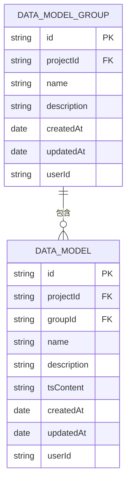
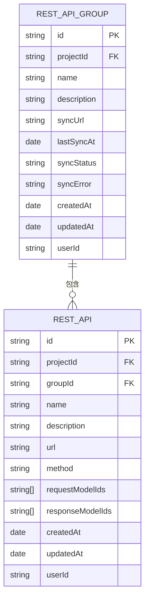
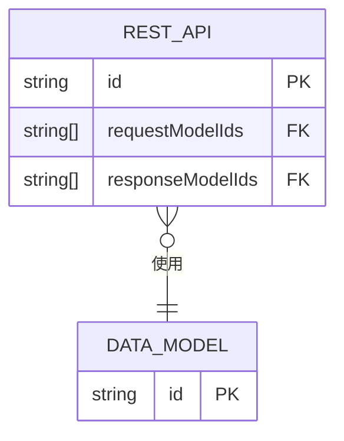
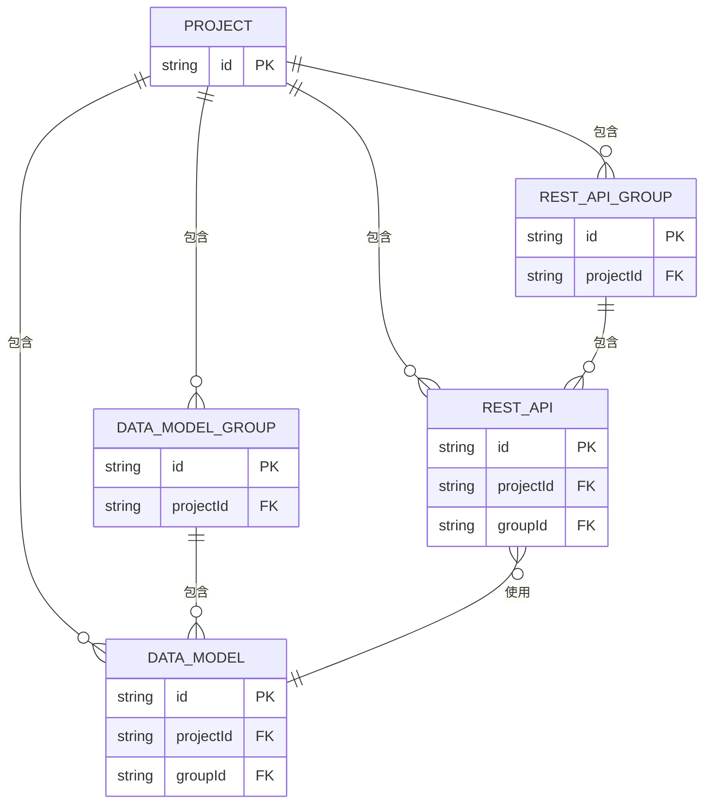
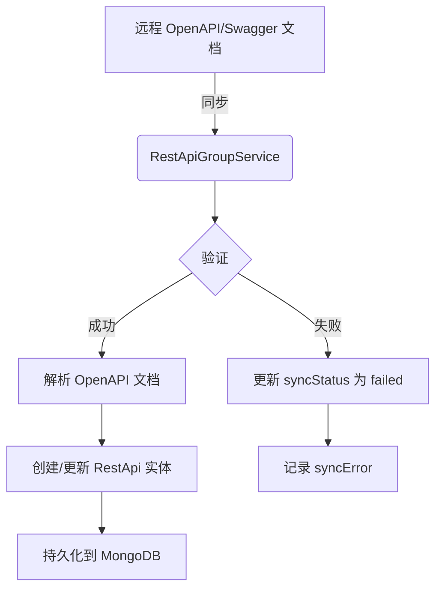
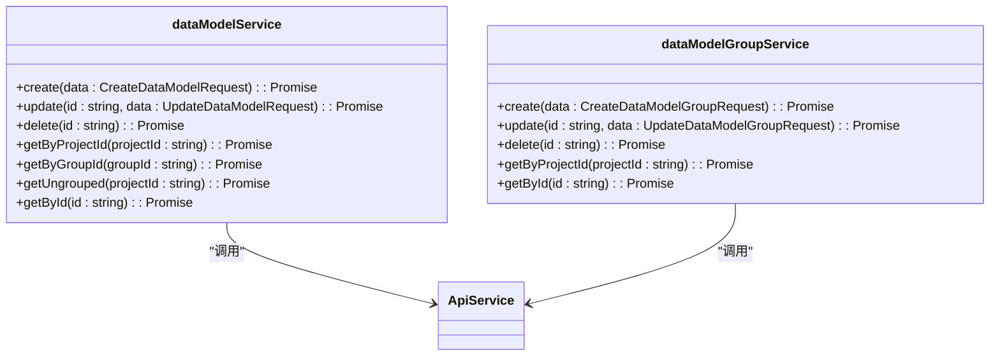

# 数据模型实体

<cite>
**本文档引用的文件**
- [data-model.ts](file://code-agent-backend/src/entity/code-agent/data-model.ts)
- [data-model-group.ts](file://code-agent-backend/src/entity/code-agent/data-model-group.ts)
- [rest-api.ts](file://code-agent-backend/src/entity/code-agent/rest-api.ts)
- [rest-api-group.ts](file://code-agent-backend/src/entity/code-agent/rest-api-group.ts)
- [data-model.ts](file://shared-types/src/dataModel.ts)
- [restApi.ts](file://shared-types/src/restApi.ts)
- [data-model.ts](file://code-agent-backend/src/service/code-agent/data-model.ts)
- [data-model-group.ts](file://code-agent-backend/src/service/code-agent/data-model-group.ts)
- [rest-api.ts](file://code-agent-backend/src/service/code-agent/rest-api.ts)
- [rest-api-group.ts](file://code-agent-backend/src/service/code-agent/rest-api-group.ts)
- [data-model.ts](file://code-agent-backend/src/controller/code-agent/data-model.ts)
- [data-model-group.ts](file://code-agent-backend/src/controller/code-agent/data-model-group.ts)
- [rest-api.ts](file://code-agent-backend/src/controller/code-agent/rest-api.ts)
- [rest-api-group.ts](file://code-agent-backend/src/controller/code-agent/rest-api-group.ts)
- [dataModelService.ts](file://fta-layout-design/src/services/dataModelService.ts)
- [restApiService.ts](file://fta-layout-design/src/services/restApiService.ts)
</cite>

## 目录
1. [简介](#简介)
2. [核心实体定义](#核心实体定义)
3. [数据模型与数据模型组](#数据模型与数据模型组)
4. [REST API与API组](#rest-api与api组)
5. [实体关系与数据流](#实体关系与数据流)
6. [数据访问与操作](#数据访问与操作)
7. [版本控制与变更审计](#版本控制与变更审计)
8. [最佳实践与使用示例](#最佳实践与使用示例)

## 简介
本文档全面介绍了项目中的核心数据模型实体，包括数据模型（DataModel）、数据模型组（DataModelGroup）、REST API（RestApi）和REST API组（RestApiGroup）。这些实体构成了系统数据管理的基础，用于定义和组织项目中的数据结构和接口规范。文档详细描述了每个实体的字段定义、数据类型、业务规则和数据库持久化方式，解释了实体间的层级关系和映射逻辑，并为开发者提供了数据访问和操作的指导。

## 核心实体定义

### 数据模型 (DataModel)
数据模型实体用于定义项目中的数据结构，使用TypeScript接口作为单一事实来源。

**字段定义：**
- **id**: 唯一标识符 (string, 必填)
- **projectId**: 关联的项目ID (string, 必填)
- **groupId**: 所属分组ID（可选）(string)
- **name**: 数据模型名称 (string, 必填)
- **description**: 数据模型描述 (string, 可选)
- **tsContent**: TypeScript接口定义内容 (string, 默认值: '')
- **createdAt**: 创建时间 (Date, 必填)
- **updatedAt**: 更新时间 (Date, 必填)
- **userId**: 用户ID (string, 必填)

**业务规则：**
- 每个数据模型必须关联到一个项目。
- 数据模型可以属于一个分组，也可以未分组（groupId为空）。
- 使用`@typegoose`装饰器将实体映射到MongoDB集合`code_agent_data_model`。
- 实体实现了自动时间戳（`timestamps: true`）。

**数据库持久化：**
- 集合名称：`code_agent_data_model`
- 数据库：MongoDB
- ORM框架：Typegoose

**Section sources**
- [data-model.ts](file://code-agent-backend/src/entity/code-agent/data-model.ts#L1-L55)

### 数据模型组 (DataModelGroup)
数据模型组实体用于对数据模型进行分组管理，实现项目级别的共享。

**字段定义：**
- **id**: 唯一标识符 (string, 必填)
- **projectId**: 关联的项目ID (string, 必填)
- **name**: 组名称 (string, 必填)
- **description**: 组描述 (string, 可选)
- **createdAt**: 创建时间 (Date, 必填)
- **updatedAt**: 更新时间 (Date, 必填)
- **userId**: 用户ID (string, 必填)

**业务规则：**
- 每个数据模型组必须关联到一个项目。
- 一个项目可以有多个数据模型组。
- 使用`@typegoose`装饰器将实体映射到MongoDB集合`code_agent_data_model_group`。
- 实体实现了自动时间戳（`timestamps: true`）。

**数据库持久化：**
- 集合名称：`code_agent_data_model_group`
- 数据库：MongoDB
- ORM框架：Typegoose

**Section sources**
- [data-model-group.ts](file://code-agent-backend/src/entity/code-agent/data-model-group.ts#L1-L48)

### REST API (RestApi)
REST API实体用于存储REST API接口的定义，并关联相关的数据模型。

**字段定义：**
- **id**: 唯一标识符 (string, 必填)
- **projectId**: 关联的项目ID (string, 必填)
- **groupId**: 关联的接口组ID (string, 可选)
- **name**: 接口名称 (string, 必填)
- **description**: 接口描述 (string, 可选)
- **url**: API地址 (string, 可选)
- **method**: HTTP请求方法 (HttpMethod, 可选, 枚举值: GET, POST, PUT, DELETE, PATCH, HEAD, OPTIONS)
- **requestModelIds**: 请求参数关联的数据模型ID列表 (string[], 默认值: [])
- **responseModelIds**: 响应数据关联的数据模型ID列表 (string[], 默认值: [])
- **createdAt**: 创建时间 (Date, 必填)
- **updatedAt**: 更新时间 (Date, 必填)
- **userId**: 用户ID (string, 必填)

**业务规则：**
- 每个REST API必须关联到一个项目。
- REST API可以属于一个API组，也可以未分组（groupId为空）。
- `requestModelIds`和`responseModelIds`用于建立与数据模型的关联。
- 使用`@typegoose`装饰器将实体映射到MongoDB集合`code_agent_rest_api`。
- 实体实现了自动时间戳（`timestamps: true`）。

**数据库持久化：**
- 集合名称：`code_agent_rest_api`
- 数据库：MongoDB
- ORM框架：Typegoose

**Section sources**
- [rest-api.ts](file://code-agent-backend/src/entity/code-agent/rest-api.ts#L1-L69)

### REST API组 (RestApiGroup)
REST API组实体用于对REST API接口进行分组管理，并支持从远程URL同步接口。

**字段定义：**
- **id**: 唯一标识符 (string, 必填)
- **projectId**: 关联的项目ID (string, 必填)
- **name**: 组名称 (string, 必填)
- **description**: 组描述 (string, 可选)
- **syncUrl**: 远程同步URL（OpenAPI/Swagger文档地址）(string, 可选)
- **lastSyncAt**: 最后同步时间 (Date, 可选)
- **syncStatus**: 同步状态 (string, 默认值: 'idle', 枚举值: idle, syncing, success, failed)
- **syncError**: 同步错误信息 (string, 可选)
- **createdAt**: 创建时间 (Date, 必填)
- **updatedAt**: 更新时间 (Date, 必填)
- **userId**: 用户ID (string, 必填)

**业务规则：**
- 每个REST API组必须关联到一个项目。
- 一个项目可以有多个REST API组。
- `syncUrl`用于配置远程OpenAPI/Swagger文档的地址。
- `syncStatus`跟踪同步过程的状态。
- 使用`@typegoose`装饰器将实体映射到MongoDB集合`code_agent_rest_api_group`。
- 实体实现了自动时间戳（`timestamps: true`）。

**数据库持久化：**
- 集合名称：`code_agent_rest_api_group`
- 数据库：MongoDB
- ORM框架：Typegoose

**Section sources**
- [rest-api-group.ts](file://code-agent-backend/src/entity/code-agent/rest-api-group.ts#L1-L64)

## 数据模型与数据模型组

### 层级关系
数据模型与数据模型组之间存在一对多的层级关系。一个数据模型组可以包含多个数据模型，而一个数据模型只能属于一个数据模型组或未分组。



**Diagram sources**
- [data-model-group.ts](file://code-agent-backend/src/entity/code-agent/data-model-group.ts#L1-L48)
- [data-model.ts](file://code-agent-backend/src/entity/code-agent/data-model.ts#L1-L55)

### 映射逻辑
数据模型通过`groupId`字段与数据模型组建立关联。当`groupId`字段有值时，表示该数据模型属于指定的分组；当`groupId`为空时，表示该数据模型未分组。

### 代码表示
在代码中，数据模型和数据模型组都作为TypeScript类实现，使用`@typegoose`装饰器进行ORM映射。它们的定义位于`code-agent-backend/src/entity/code-agent/`目录下。

**Section sources**
- [data-model.ts](file://code-agent-backend/src/entity/code-agent/data-model.ts#L1-L55)
- [data-model-group.ts](file://code-agent-backend/src/entity/code-agent/data-model-group.ts#L1-L48)

## REST API与API组

### 层级关系
REST API与REST API组之间存在一对多的层级关系。一个REST API组可以包含多个REST API，而一个REST API只能属于一个API组或未分组。



**Diagram sources**
- [rest-api-group.ts](file://code-agent-backend/src/entity/code-agent/rest-api-group.ts#L1-L64)
- [rest-api.ts](file://code-agent-backend/src/entity/code-agent/rest-api.ts#L1-L69)

### 映射逻辑
REST API通过`groupId`字段与REST API组建立关联。当`groupId`字段有值时，表示该API属于指定的分组；当`groupId`为空时，表示该API未分组。

### 与数据模型的关联
REST API通过`requestModelIds`和`responseModelIds`字段与数据模型建立关联，分别表示请求参数和响应数据所使用的数据模型。



**Diagram sources**
- [rest-api.ts](file://code-agent-backend/src/entity/code-agent/rest-api.ts#L1-L69)
- [data-model.ts](file://code-agent-backend/src/entity/code-agent/data-model.ts#L1-L55)

### 代码表示
在代码中，REST API和REST API组都作为TypeScript类实现，使用`@typegoose`装饰器进行ORM映射。它们的定义位于`code-agent-backend/src/entity/code-agent/`目录下。

**Section sources**
- [rest-api.ts](file://code-agent-backend/src/entity/code-agent/rest-api.ts#L1-L69)
- [rest-api-group.ts](file://code-agent-backend/src/entity/code-agent/rest-api-group.ts#L1-L64)

## 实体关系与数据流

### 整体架构
以下图表展示了所有核心实体之间的关系。



**Diagram sources**
- [data-model-group.ts](file://code-agent-backend/src/entity/code-agent/data-model-group.ts#L1-L48)
- [data-model.ts](file://code-agent-backend/src/entity/code-agent/data-model.ts#L1-L55)
- [rest-api-group.ts](file://code-agent-backend/src/entity/code-agent/rest-api-group.ts#L1-L64)
- [rest-api.ts](file://code-agent-backend/src/entity/code-agent/rest-api.ts#L1-L69)

### 数据流
数据流主要通过REST API组的同步功能实现。用户可以配置一个远程OpenAPI/Swagger文档的URL，系统会从该URL同步接口定义，并自动创建或更新REST API实体。



**Diagram sources**
- [rest-api-group.ts](file://code-agent-backend/src/service/code-agent/rest-api-group.ts#L1-L111)

## 数据访问与操作

### 后端服务层
后端服务层提供了对数据模型和REST API的CRUD操作。

**数据模型服务 (DataModelService):**
- `create(data: CreateDataModelRequest)`: 创建数据模型
- `update(id: string, data: UpdateDataModelRequest)`: 更新数据模型
- `delete(id: string)`: 删除数据模型
- `getByProjectId(projectId: string)`: 获取项目的所有数据模型
- `getByGroupId(groupId: string)`: 获取分组内的数据模型
- `getUngrouped(projectId: string)`: 获取未分组的数据模型
- `getById(id: string)`: 获取单个数据模型详情

**数据模型组服务 (DataModelGroupService):**
- `create(data: CreateDataModelGroupRequest)`: 创建数据模型组
- `update(id: string, data: UpdateDataModelGroupRequest)`: 更新数据模型组
- `delete(id: string)`: 删除数据模型组
- `getByProjectId(projectId: string)`: 获取项目的所有数据模型组
- `getById(id: string)`: 获取单个数据模型组详情

**Section sources**
- [data-model.ts](file://code-agent-backend/src/service/code-agent/data-model.ts#L1-L218)
- [data-model-group.ts](file://code-agent-backend/src/service/code-agent/data-model-group.ts#L1-L155)

### 前端服务层
前端服务层封装了对后端API的调用，提供了更简洁的接口。



**Diagram sources**
- [dataModelService.ts](file://fta-layout-design/src/services/dataModelService.ts#L1-L131)

### REST API暴露方式
后端通过MidwayJS控制器将服务层的功能暴露为REST API。

**数据模型控制器 (DataModelController):**
- `POST /code-agent/data-model`: 创建数据模型
- `PUT /code-agent/data-model/:id`: 更新数据模型
- `DELETE /code-agent/data-model/:id`: 删除数据模型
- `GET /code-agent/data-model/project/:projectId`: 获取项目的所有数据模型
- `GET /code-agent/data-model/group/:groupId`: 获取分组内的数据模型
- `GET /code-agent/data-model/project/:projectId/ungrouped`: 获取未分组的数据模型
- `GET /code-agent/data-model/:id`: 获取单个数据模型详情

**Section sources**
- [data-model.ts](file://code-agent-backend/src/controller/code-agent/data-model.ts#L1-L125)

## 版本控制与变更审计

### 版本控制
系统通过`createdAt`和`updatedAt`字段实现了基本的版本控制。每次实体创建或更新时，这些时间戳字段会自动更新，可以用来追踪实体的历史变更。

### 变更审计
变更审计主要通过以下方式实现：
1. **时间戳**: `createdAt`和`updatedAt`字段记录了实体的创建和最后修改时间。
2. **用户ID**: `userId`字段记录了执行操作的用户，可以追溯变更的责任人。
3. **同步状态**: 对于REST API组，`syncStatus`和`syncError`字段记录了同步操作的状态和错误信息，便于审计同步历史。

### 迁移策略
目前系统没有显式的数据库迁移策略，但通过以下方式支持数据模型的演进：
- **tsContent字段**: 数据模型的`tsContent`字段存储了TypeScript接口定义，允许在不改变数据库结构的情况下更新数据结构定义。
- **灵活的ORM**: 使用Typegoose作为ORM框架，支持MongoDB的灵活模式，允许在运行时动态添加或修改字段。

**Section sources**
- [data-model.ts](file://code-agent-backend/src/entity/code-agent/data-model.ts#L1-L55)
- [rest-api-group.ts](file://code-agent-backend/src/entity/code-agent/rest-api-group.ts#L1-L64)

## 最佳实践与使用示例

### 创建数据模型
```typescript
// 前端调用示例
const newDataModel = await dataModelService.create({
  projectId: 'project_123',
  groupId: 'dmg_456',
  name: '用户信息',
  description: '用户相关的数据结构',
  tsContent: 'interface User {\n  id: string;\n  name: string;\n}'
});
```

### 同步REST API组
```typescript
// 后端同步逻辑
const result = await restApiGroupService.sync('rag_789', 'https://api.example.com/swagger.json');
console.log(`成功同步 ${result.syncedCount} 个接口`);
```

### 查询未分组的数据模型
```typescript
// 获取项目中未分组的数据模型
const ungroupedModels = await dataModelService.getUngrouped('project_123');
```

**Section sources**
- [dataModelService.ts](file://fta-layout-design/src/services/dataModelService.ts#L1-L131)
- [rest-api-group.ts](file://code-agent-backend/src/service/code-agent/rest-api-group.ts#L1-L111)