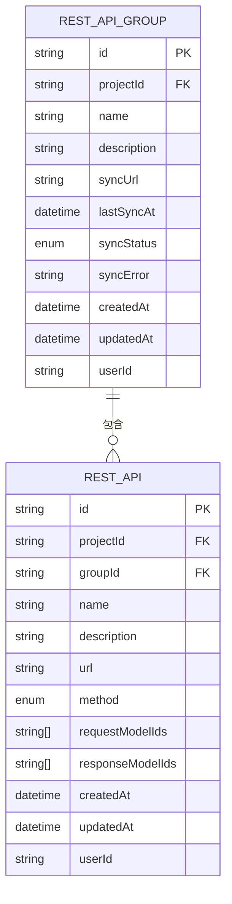
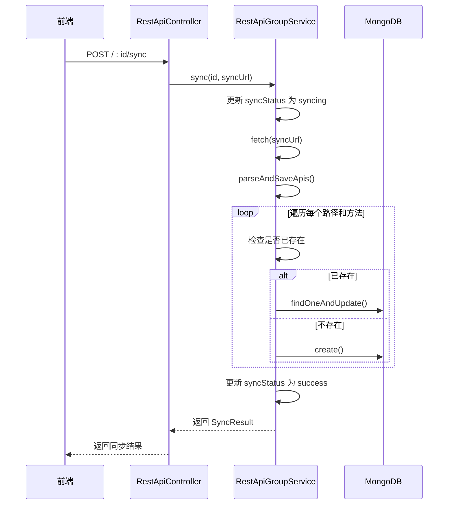

# REST API 实体

<cite>
**本文档引用的文件**   
- [rest-api.ts](file://code-agent-backend/src/entity/code-agent/rest-api.ts)
- [rest-api-group.ts](file://code-agent-backend/src/entity/code-agent/rest-api-group.ts)
- [rest-api.controller.ts](file://code-agent-backend/src/controller/code-agent/rest-api.ts)
- [rest-api-group.controller.ts](file://code-agent-backend/src/controller/code-agent/rest-api-group.ts)
- [rest-api.service.ts](file://code-agent-backend/src/service/code-agent/rest-api.ts)
- [rest-api-group.service.ts](file://code-agent-backend/src/service/code-agent/rest-api-group.ts)
- [req.ts](file://code-agent-backend/src/dto/code-agent/req.ts)
- [res.ts](file://code-agent-backend/src/dto/code-agent/res.ts)
- [restApi.ts](file://shared-types/src/restApi.ts)
- [restApiService.ts](file://fta-layout-design/src/services/restApiService.ts)
- [RestApiCreateModal.tsx](file://fta-layout-design/src/pages/EditorPage/components/RestApiCreateModal/index.tsx)
- [RestApiDetailModal.tsx](file://fta-layout-design/src/pages/EditorPage/components/RestApiDetailModal/index.tsx)
- [RestApiGroupPanel.tsx](file://fta-layout-design/src/pages/EditorPage/components/RestApiGroupPanel/index.tsx)
- [RestApiListPanel.tsx](file://fta-layout-design/src/pages/EditorPage/components/RestApiListPanel/index.tsx)
</cite>

## 目录
1. [引言](#引言)
2. [REST API 实体设计](#rest-api-实体设计)
3. [REST API 组实体设计](#rest-api-组实体设计)
4. [实体关联关系](#实体关联关系)
5. [数据模型集成](#数据模型集成)
6. [后端服务层操作流程](#后端服务层操作流程)
7. [前端管理界面流程](#前端管理界面流程)
8. [代码生成工作流中的作用](#代码生成工作流中的作用)
9. [API 定义与实现一致性保障](#api-定义与实现一致性保障)

## 引言
本文档详细阐述了 `rest-api` 和 `rest-api-group` 两个核心实体的设计与集成。`rest-api` 实体用于定义单个 RESTful 接口的元数据，包括路由、HTTP 方法和请求/响应模式。`rest-api-group` 实体则用于对相关 API 进行逻辑分组，并支持从远程 OpenAPI/Swagger 文档同步接口定义。这两个实体共同构成了 API 管理的基础，通过与数据模型（Data Model）的关联，实现了 API 请求和响应体的结构化定义。文档将深入解析其字段结构、数据库持久化方式、前后端交互流程以及在代码生成工作流中的关键作用。

## REST API 实体设计
`RestApi` 实体是系统中用于存储单个 REST API 接口定义的核心数据结构。它不仅包含了接口的基本信息，还通过关联关系与项目、数据模型等其他实体紧密集成。

### 字段结构
`RestApi` 实体的字段设计全面覆盖了 API 定义所需的关键信息：

- **id**: 唯一标识符，由系统生成，格式为 `api_随机字符串_时间戳`。
- **projectId**: 关联的项目 ID，用于将 API 归属于特定项目。
- **groupId**: 可选的关联接口组 ID，用于将 API 分配到一个逻辑分组中。
- **name**: 接口名称，如“获取用户信息”，是用户可读的标识。
- **description**: 接口描述，提供关于接口用途的详细说明。
- **url**: API 的路由地址，例如 `/api/v1/users/me`。
- **method**: HTTP 请求方法，枚举类型，支持 `GET`, `POST`, `PUT`, `DELETE`, `PATCH`, `HEAD`, `OPTIONS`。
- **requestModelIds**: 字符串数组，存储与请求参数关联的数据模型 ID 列表。
- **responseModelIds**: 字符串数组，存储与响应数据关联的数据模型 ID 列表。
- **createdAt** 和 **updatedAt**: 时间戳，记录实体的创建和更新时间。
- **userId**: 创建该 API 的用户 ID，用于权限控制。

### 数据库持久化
该实体通过 `@typegoose` 库映射到 MongoDB 数据库中的 `code_agent_rest_api` 集合。`@EntityModel()` 和 `@modelOptions()` 装饰器定义了其作为 Mongoose 模型的配置，`timestamps: true` 选项自动管理 `createdAt` 和 `updatedAt` 字段。所有字段都通过 `@prop()` 装饰器进行类型和验证规则的声明，确保了数据的完整性和一致性。

**Section sources**
- [rest-api.ts](file://code-agent-backend/src/entity/code-agent/rest-api.ts#L1-L69)

## REST API 组实体设计
`RestApiGroup` 实体提供了对 `RestApi` 实体进行逻辑聚合和管理的能力，是实现 API 分组和自动化同步的核心。

### 字段结构
`RestApiGroup` 实体的字段设计侧重于分组管理和远程同步功能：

- **id**: 唯一标识符，由系统生成，格式为 `rag_随机字符串_时间戳`。
- **projectId**: 关联的项目 ID，确保组内的所有 API 都属于同一项目。
- **name**: 组名称，如“用户模块接口”，用于对 API 进行分类。
- **description**: 组描述，提供关于该组内所有接口的总体说明。
- **syncUrl**: 可选的远程同步 URL，指向一个 OpenAPI/Swagger JSON 文档，用于自动拉取接口定义。
- **lastSyncAt**: 记录最后一次成功同步的时间。
- **syncStatus**: 同步状态，枚举类型，包括 `idle`（空闲）、`syncing`（同步中）、`success`（成功）、`failed`（失败）。
- **syncError**: 当同步失败时，存储错误信息。
- **createdAt** 和 **updatedAt**: 时间戳，记录实体的创建和更新时间。
- **userId**: 创建该组的用户 ID。

### 数据库持久化
该实体被持久化到 MongoDB 的 `code_agent_rest_api_group` 集合中。其数据库配置与 `RestApi` 类似，同样使用 `@EntityModel()` 和 `@modelOptions()` 进行定义，并启用了时间戳功能。`syncStatus` 字段的默认值为 `'idle'`，确保了新创建的组处于待同步状态。

**Section sources**
- [rest-api-group.ts](file://code-agent-backend/src/entity/code-agent/rest-api-group.ts#L1-L64)

## 实体关联关系
`rest-api` 和 `rest-api-group` 实体之间通过 `groupId` 字段建立了明确的关联关系，形成了一个清晰的层次结构。

### 一对多关系
一个 `RestApiGroup` 可以包含多个 `RestApi`。这种一对多的关系通过 `RestApi` 实体中的 `groupId` 字段实现。当一个 API 被创建或更新时，可以将其 `groupId` 设置为某个 `RestApiGroup` 的 `id`，从而将其归入该组。在数据库层面，这通过在 `code_agent_rest_api` 集合中查询 `groupId` 字段来实现。

### 未分组 API
系统支持未分组的 API。当 `RestApi` 的 `groupId` 字段为 `null` 或不存在时，该 API 被视为未分组。前端界面通过特殊标识 `__ungrouped__` 来处理和显示这些 API。

### 删除级联
当一个 `RestApiGroup` 被删除时，其下的所有 `RestApi` 也会被级联删除。这在 `RestApiGroupService` 的 `delete` 方法中实现，通过调用 `this.restApiEntity.deleteMany({ groupId: id, userId })` 来完成，确保了数据的一致性。

**Diagram sources **
- [rest-api.ts](file://code-agent-backend/src/entity/code-agent/rest-api.ts#L1-L69)
- [rest-api-group.ts](file://code-agent-backend/src/entity/code-agent/rest-api-group.ts#L1-L64)

**Section sources**
- [rest-api.ts](file://code-agent-backend/src/entity/code-agent/rest-api.ts#L1-L69)
- [rest-api-group.ts](file://code-agent-backend/src/entity/code-agent/rest-api-group.ts#L1-L64)

## 数据模型集成
REST API 实体通过与数据模型（Data Model）的关联，实现了对请求和响应数据结构的精确描述。

### 请求/响应模式映射
`RestApi` 实体中的 `requestModelIds` 和 `responseModelIds` 字段是实现此集成的关键。它们存储了指向 `DataModel` 实体的 ID 列表。当一个 API 需要定义其输入或输出结构时，开发者可以选择一个或多个已定义的数据模型。这些数据模型通常以 TypeScript 接口的形式存在，其结构被用来生成 API 的请求体和响应体的 JSON Schema。

### 前端选择器
在前端的 `RestApiDetailModal` 组件中，用户可以通过下拉选择器来关联数据模型。该选择器会显示所有可用的数据模型，并按其所属的 `DataModelGroup` 进行分组，方便用户查找和选择。选择的数据模型 ID 会被提交到后端，并存储在 `RestApi` 实体中。

**Section sources**
- [rest-api.ts](file://code-agent-backend/src/entity/code-agent/rest-api.ts#L48-L54)
- [RestApiDetailModal.tsx](file://fta-layout-design/src/pages/EditorPage/components/RestApiDetailModal/index.tsx#L176-L263)

## 后端服务层操作流程
后端通过 `Controller`、`Service` 和 `Entity` 三层架构来处理 REST API 实体的 CRUD 操作和同步逻辑。

### API 创建与更新流程
1.  **请求接收**: `RestApiController` 接收来自前端的 `POST /` 或 `PUT /:id` 请求。
2.  **参数验证**: 使用 `CreateRestApiRequest` 和 `UpdateRestApiRequest` DTO 进行参数验证和类型转换。
3.  **业务逻辑**: `RestApiService` 的 `create` 或 `update` 方法被调用。服务层会验证用户权限和项目归属，然后生成或更新 `RestApi` 实体。
4.  **数据持久化**: 通过 `@typegoose` 提供的 `create` 或 `findOneAndUpdate` 方法将数据写入 MongoDB。
5.  **响应返回**: `RestApiController` 将结果包装在 `CreateRestApiResponse` 或 `UpdateRestApiResponse` 中返回给前端。

### 同步流程
1.  **触发同步**: 前端调用 `POST /:id/sync` 接口。
2.  **状态更新**: `RestApiGroupService` 的 `sync` 方法首先将组的 `syncStatus` 更新为 `'syncing'`。
3.  **获取文档**: 使用 `fetch` 函数从 `syncUrl` 获取远程的 OpenAPI JSON 文档。
4.  **解析与保存**: `parseAndSaveApis` 私有方法遍历文档中的所有路径和方法，为每个操作创建或更新一个 `RestApi` 实体。
5.  **状态更新**: 同步成功后，将 `syncStatus` 更新为 `'success'`，并记录 `lastSyncAt`；若失败，则更新为 `'failed'` 并记录 `syncError`。

**Diagram sources **
- [rest-api-group.controller.ts](file://code-agent-backend/src/controller/code-agent/rest-api-group.ts#L108-L120)
- [rest-api-group.service.ts](file://code-agent-backend/src/service/code-agent/rest-api-group.ts#L197-L248)

**Section sources**
- [rest-api.controller.ts](file://code-agent-backend/src/controller/code-agent/rest-api.ts#L27-L36)
- [rest-api-group.controller.ts](file://code-agent-backend/src/controller/code-agent/rest-api-group.ts#L108-L120)
- [rest-api.service.ts](file://code-agent-backend/src/service/code-agent/rest-api.ts#L66-L96)
- [rest-api-group.service.ts](file://code-agent-backend/src/service/code-agent/rest-api-group.ts#L197-L248)

## 前端管理界面流程
前端管理界面提供了一套完整的可视化工具，用于创建、管理和测试 REST API。

### 创建 API
用户通过点击“新建”按钮打开 `RestApiCreateModal`。该模态框提供表单，允许用户输入 API 名称、描述、HTTP 方法、URL，并选择所属的接口组。提交后，表单数据被封装为 `CreateRestApiRequest` 并通过 `restApiService.create()` 发送到后端。

### 管理 API 组
`RestApiGroupPanel` 组件是管理 API 组的核心。它允许用户：
- **创建组**: 输入组名、描述和可选的 `syncUrl`。
- **编辑组**: 修改组的元数据。
- **删除组**: 删除组及其所有关联的 API。
- **同步接口**: 当组配置了 `syncUrl` 时，点击“同步”按钮即可触发从远程文档拉取 API 的操作。

### 查看与编辑 API
`RestApiListPanel` 显示当前选中组内的所有 API。用户可以点击某个 API 来在 `RestApiDetailModal` 中查看和编辑其详细信息。该模态框采用标签页设计，分别展示“基本信息”、“请求参数”和“响应数据”，用户可以在后两个标签页中关联数据模型。

**Section sources**
- [RestApiCreateModal.tsx](file://fta-layout-design/src/pages/EditorPage/components/RestApiCreateModal/index.tsx#L1-L125)
- [RestApiGroupPanel.tsx](file://fta-layout-design/src/pages/EditorPage/components/RestApiGroupPanel/index.tsx#L1-L440)
- [RestApiListPanel.tsx](file://fta-layout-design/src/pages/EditorPage/components/RestApiListPanel/index.tsx#L1-L178)
- [RestApiDetailModal.tsx](file://fta-layout-design/src/pages/EditorPage/components/RestApiDetailModal/index.tsx#L1-L302)

## 代码生成工作流中的作用
REST API 实体是代码生成工作流中的关键输入。当系统需要为前端生成调用后端 API 的代码时，它会查询 `RestApi` 实体。

### 生成 API 客户端
系统可以根据 `RestApi` 实体中的 `url`、`method`、`requestModelIds` 和 `responseModelIds` 信息，自动生成类型安全的 API 客户端代码。例如，可以生成一个 TypeScript 函数，其参数类型由 `requestModelIds` 指向的数据模型决定，返回值类型由 `responseModelIds` 决定。

### 生成 Mock 数据
在开发和测试阶段，系统可以利用这些实体生成模拟的 API 响应。通过读取 `responseModelIds` 关联的数据模型，可以生成符合预期结构的 JSON 数据，用于前端联调。

**Section sources**
- [rest-api.ts](file://code-agent-backend/src/entity/code-agent/rest-api.ts#L48-L54)

## API 定义与实现一致性保障
系统通过多种机制来确保 API 定义与后端实现之间的一致性。

### OpenAPI 同步
最核心的保障机制是 `RestApiGroup` 的 `syncUrl` 功能。通过定期或手动从权威的 OpenAPI/Swagger 文档同步接口定义，可以确保前端管理界面中的 API 列表与后端实际暴露的接口保持一致。任何后端的变更，只要更新了 OpenAPI 文档，就可以被前端同步。

### 状态监控
`syncStatus` 和 `syncError` 字段提供了同步过程的可见性。前端界面可以清晰地展示每个组的同步状态（成功、失败、同步中），并显示具体的错误信息，便于开发者排查问题。

### 手动维护
对于没有 OpenAPI 文档的场景，开发者可以手动在前端创建和维护 `RestApi` 实体。虽然这依赖于人工操作，但结合团队的开发规范，也能在一定程度上保证一致性。

**Section sources**
- [rest-api-group.ts](file://code-agent-backend/src/entity/code-agent/rest-api-group.ts#L35-L49)
- [rest-api-group.service.ts](file://code-agent-backend/src/service/code-agent/rest-api-group.ts#L197-L259)