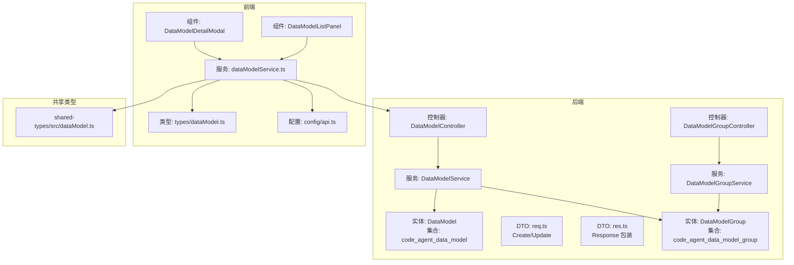
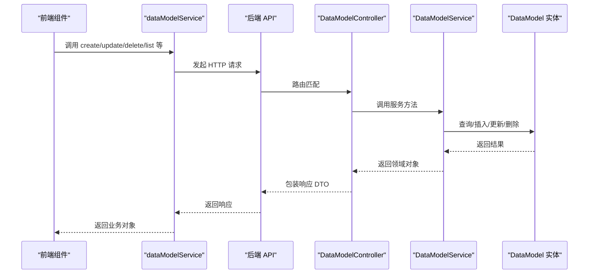
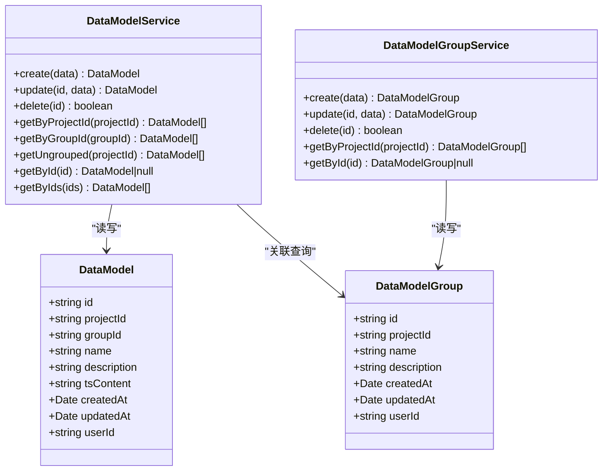

# 数据模型

<cite>
**本文引用的文件**
- [code-agent-backend/src/entity/code-agent/data-model.ts](file://code-agent-backend/src/entity/code-agent/data-model.ts)
- [code-agent-backend/src/service/code-agent/data-model.ts](file://code-agent-backend/src/service/code-agent/data-model.ts)
- [code-agent-backend/src/controller/code-agent/data-model.ts](file://code-agent-backend/src/controller/code-agent/data-model.ts)
- [code-agent-backend/src/dto/code-agent/req.ts](file://code-agent-backend/src/dto/code-agent/req.ts)
- [code-agent-backend/src/dto/code-agent/res.ts](file://code-agent-backend/src/dto/code-agent/res.ts)
- [code-agent-backend/src/entity/code-agent/data-model-group.ts](file://code-agent-backend/src/entity/code-agent/data-model-group.ts)
- [code-agent-backend/src/service/code-agent/data-model-group.ts](file://code-agent-backend/src/service/code-agent/data-model-group.ts)
- [code-agent-backend/src/controller/code-agent/data-model-group.ts](file://code-agent-backend/src/controller/code-agent/data-model-group.ts)
- [fta-layout-design/src/services/dataModelService.ts](file://fta-layout-design/src/services/dataModelService.ts)
- [fta-layout-design/src/pages/EditorPage/components/DataModelDetailModal/index.tsx](file://fta-layout-design/src/pages/EditorPage/components/DataModelDetailModal/index.tsx)
- [fta-layout-design/src/pages/EditorPage/components/DataModelListPanel/index.tsx](file://fta-layout-design/src/pages/EditorPage/components/DataModelListPanel/index.tsx)
- [fta-layout-design/src/types/dataModel.ts](file://fta-layout-design/src/types/dataModel.ts)
- [shared-types/src/dataModel.ts](file://shared-types/src/dataModel.ts)
- [fta-layout-design/src/config/api.ts](file://fta-layout-design/src/config/api.ts)
</cite>

## 目录
1. [简介](#简介)
2. [项目结构](#项目结构)
3. [核心组件](#核心组件)
4. [架构总览](#架构总览)
5. [详细组件分析](#详细组件分析)
6. [依赖分析](#依赖分析)
7. [性能考虑](#性能考虑)
8. [故障排查指南](#故障排查指南)
9. [结论](#结论)
10. [附录](#附录)

## 简介
本文件围绕“数据模型（DataModel）”实体展开，系统性说明其字段定义与用途、在 MongoDB 中的存储结构与索引策略、与数据模型分组（DataModelGroup）的一对多关系、后端 service 层的 CRUD 实现、前端通过 dataModelService 的交互方式，以及 UI 层 DataModelDetailModal 与 DataModelListPanel 的使用场景。同时提供数据验证规则、错误处理机制与性能优化建议，帮助开发者快速理解并正确使用该能力。

## 项目结构
数据模型功能横跨后端（Midway TypeORM/Mongoose 风格 Typegoose）、共享类型（shared-types）、前端（fta-layout-design）三层：
- 后端：实体定义、服务层、控制器、DTO（请求/响应）
- 前端：服务封装、类型定义、UI 组件
- 共享类型：前后端一致的类型契约

图表来源
- [code-agent-backend/src/entity/code-agent/data-model.ts](file://code-agent-backend/src/entity/code-agent/data-model.ts#L1-L55)
- [code-agent-backend/src/service/code-agent/data-model.ts](file://code-agent-backend/src/service/code-agent/data-model.ts#L1-L219)
- [code-agent-backend/src/controller/code-agent/data-model.ts](file://code-agent-backend/src/controller/code-agent/data-model.ts#L1-L125)
- [code-agent-backend/src/dto/code-agent/req.ts](file://code-agent-backend/src/dto/code-agent/req.ts#L438-L490)
- [code-agent-backend/src/dto/code-agent/res.ts](file://code-agent-backend/src/dto/code-agent/res.ts#L253-L338)
- [code-agent-backend/src/entity/code-agent/data-model-group.ts](file://code-agent-backend/src/entity/code-agent/data-model-group.ts#L1-L46)
- [code-agent-backend/src/service/code-agent/data-model-group.ts](file://code-agent-backend/src/service/code-agent/data-model-group.ts#L1-L155)
- [code-agent-backend/src/controller/code-agent/data-model-group.ts](file://code-agent-backend/src/controller/code-agent/data-model-group.ts#L55-L102)
- [fta-layout-design/src/services/dataModelService.ts](file://fta-layout-design/src/services/dataModelService.ts#L1-L132)
- [fta-layout-design/src/types/dataModel.ts](file://fta-layout-design/src/types/dataModel.ts#L1-L89)
- [shared-types/src/dataModel.ts](file://shared-types/src/dataModel.ts#L1-L54)
- [fta-layout-design/src/config/api.ts](file://fta-layout-design/src/config/api.ts#L90-L105)

章节来源
- [code-agent-backend/src/entity/code-agent/data-model.ts](file://code-agent-backend/src/entity/code-agent/data-model.ts#L1-L55)
- [code-agent-backend/src/service/code-agent/data-model.ts](file://code-agent-backend/src/service/code-agent/data-model.ts#L1-L219)
- [code-agent-backend/src/controller/code-agent/data-model.ts](file://code-agent-backend/src/controller/code-agent/data-model.ts#L1-L125)
- [fta-layout-design/src/services/dataModelService.ts](file://fta-layout-design/src/services/dataModelService.ts#L1-L132)
- [fta-layout-design/src/types/dataModel.ts](file://fta-layout-design/src/types/dataModel.ts#L1-L89)
- [shared-types/src/dataModel.ts](file://shared-types/src/dataModel.ts#L1-L54)
- [fta-layout-design/src/config/api.ts](file://fta-layout-design/src/config/api.ts#L90-L105)

## 核心组件
- 数据模型实体（DataModel）
  - 字段：id、projectId、groupId（可选）、name、description（可选）、tsContent（字符串，存储 TypeScript 接口定义）、createdAt、updatedAt、userId
  - 存储集合：code_agent_data_model
  - 时间戳：自动维护 createdAt/updatedAt
- 数据模型分组（DataModelGroup）
  - 字段：id、projectId、name、description（可选）、createdAt、updatedAt、userId
  - 存储集合：code_agent_data_model_group
- 服务层（DataModelService）
  - 提供 create/update/delete/getByProjectId/getByGroupId/getUngrouped/getById/getByIds 等方法
  - 用户隔离：基于 userId 进行查询/更新/删除校验
  - 项目存在性校验：创建时检查 projectId 对应的项目存在且属于当前用户
- 控制器（DataModelController）
  - 提供 REST API：POST / PUT / DELETE / GET 列表/详情
  - DTO 参数绑定与响应包装
- 前端服务（dataModelService）
  - 封装后端 API 调用，统一返回类型
  - 支持按项目、按分组、未分组、单条详情等查询
- UI 组件
  - DataModelListPanel：列表展示、搜索、分组筛选、删除
  - DataModelDetailModal：编辑基本信息与 TypeScript 内容，支持 AI 解析填充

章节来源
- [code-agent-backend/src/entity/code-agent/data-model.ts](file://code-agent-backend/src/entity/code-agent/data-model.ts#L1-L55)
- [code-agent-backend/src/entity/code-agent/data-model-group.ts](file://code-agent-backend/src/entity/code-agent/data-model-group.ts#L1-L46)
- [code-agent-backend/src/service/code-agent/data-model.ts](file://code-agent-backend/src/service/code-agent/data-model.ts#L1-L219)
- [code-agent-backend/src/controller/code-agent/data-model.ts](file://code-agent-backend/src/controller/code-agent/data-model.ts#L1-L125)
- [fta-layout-design/src/services/dataModelService.ts](file://fta-layout-design/src/services/dataModelService.ts#L1-L132)
- [fta-layout-design/src/pages/EditorPage/components/DataModelListPanel/index.tsx](file://fta-layout-design/src/pages/EditorPage/components/DataModelListPanel/index.tsx#L1-L166)
- [fta-layout-design/src/pages/EditorPage/components/DataModelDetailModal/index.tsx](file://fta-layout-design/src/pages/EditorPage/components/DataModelDetailModal/index.tsx#L1-L222)

## 架构总览
后端采用 Typegoose 定义实体，配合 Midway 控制器与 DTO，服务层负责业务逻辑与数据访问；前端通过 dataModelService 调用后端 API，UI 组件负责展示与交互。

图表来源
- [code-agent-backend/src/controller/code-agent/data-model.ts](file://code-agent-backend/src/controller/code-agent/data-model.ts#L1-L125)
- [code-agent-backend/src/service/code-agent/data-model.ts](file://code-agent-backend/src/service/code-agent/data-model.ts#L1-L219)
- [code-agent-backend/src/entity/code-agent/data-model.ts](file://code-agent-backend/src/entity/code-agent/data-model.ts#L1-L55)
- [fta-layout-design/src/services/dataModelService.ts](file://fta-layout-design/src/services/dataModelService.ts#L1-L132)
- [fta-layout-design/src/config/api.ts](file://fta-layout-design/src/config/api.ts#L90-L105)

## 详细组件分析

### 数据模型实体（DataModel）字段与用途
- id：全局唯一标识，服务层自动生成
- projectId：所属项目 ID，用于项目级隔离与查询
- groupId：所属分组 ID（可选），未分组时为空
- name：数据模型名称
- description：描述（可选）
- tsContent：TypeScript 接口定义内容（字符串），作为单一事实来源
- createdAt/updatedAt：自动时间戳
- userId：用户 ID，用于用户隔离

MongoDB 存储结构
- 集合：code_agent_data_model
- 时间戳：开启 timestamps，自动维护 createdAt/updatedAt
- 字段约束：部分字段必填，部分可选；tsContent 默认空字符串

章节来源
- [code-agent-backend/src/entity/code-agent/data-model.ts](file://code-agent-backend/src/entity/code-agent/data-model.ts#L1-L55)

### 与数据模型分组（DataModelGroup）的关系
- 关系：一对多（一个分组包含多个数据模型）
- 外键：DataModel.groupId 引用 DataModelGroup.id
- 分组集合：code_agent_data_model_group
- 服务与控制器：DataModelGroupService/Controller 提供分组 CRUD

章节来源
- [code-agent-backend/src/entity/code-agent/data-model-group.ts](file://code-agent-backend/src/entity/code-agent/data-model-group.ts#L1-L46)
- [code-agent-backend/src/service/code-agent/data-model-group.ts](file://code-agent-backend/src/service/code-agent/data-model-group.ts#L1-L155)
- [code-agent-backend/src/controller/code-agent/data-model-group.ts](file://code-agent-backend/src/controller/code-agent/data-model-group.ts#L55-L102)

### 服务层 CRUD 实现要点
- create
  - 校验用户上下文（userId）
  - 校验项目存在且属于当前用户
  - 生成唯一 id，填充默认值（tsContent 默认空字符串）
  - 插入文档并返回
- update
  - 支持更新 name/description/tsContent/groupId
  - groupId 支持设为 null（移出分组）
  - 使用 findOneAndUpdate 并启用 runValidators
- delete
  - 基于 id+userId 查询并删除
- 查询
  - getByProjectId：按项目与用户过滤，按创建时间倒序
  - getByGroupId：按分组与用户过滤
  - getUngrouped：按项目与用户过滤，且 groupId 不存在
  - getById/getByIds：按 id 与用户过滤

章节来源
- [code-agent-backend/src/service/code-agent/data-model.ts](file://code-agent-backend/src/service/code-agent/data-model.ts#L1-L219)

### 控制器 API 与 DTO
- 控制器路径：/code-agent/data-model
- 方法：
  - POST /：创建
  - PUT /:id：更新
  - DEL /:id：删除
  - GET /project/:projectId：按项目列表
  - GET /group/:groupId：按分组列表
  - GET /project/:projectId/ungrouped：未分组列表
  - GET /:id：单条详情
- 请求 DTO：CreateNewDataModelRequest、UpdateNewDataModelRequest
- 响应 DTO：Create/Update/Delete/List/Detail 系列

章节来源
- [code-agent-backend/src/controller/code-agent/data-model.ts](file://code-agent-backend/src/controller/code-agent/data-model.ts#L1-L125)
- [code-agent-backend/src/dto/code-agent/req.ts](file://code-agent-backend/src/dto/code-agent/req.ts#L438-L490)
- [code-agent-backend/src/dto/code-agent/res.ts](file://code-agent-backend/src/dto/code-agent/res.ts#L253-L338)

### 前端交互与 UI 使用
- dataModelService
  - 封装 create/update/delete/list/listByGroup/listUngrouped/detail
  - 统一错误处理与返回类型
- DataModelListPanel
  - 展示列表、搜索、分组筛选、删除
  - 与 EditorPageContext 协作，维护选中项与加载状态
- DataModelDetailModal
  - 编辑基本信息（名称、描述、分组）
  - 编辑 tsContent（TypeScript 接口定义），支持 AI 智能解析填充
  - 保存前进行语法校验，防止无效内容入库

章节来源
- [fta-layout-design/src/services/dataModelService.ts](file://fta-layout-design/src/services/dataModelService.ts#L1-L132)
- [fta-layout-design/src/pages/EditorPage/components/DataModelListPanel/index.tsx](file://fta-layout-design/src/pages/EditorPage/components/DataModelListPanel/index.tsx#L1-L166)
- [fta-layout-design/src/pages/EditorPage/components/DataModelDetailModal/index.tsx](file://fta-layout-design/src/pages/EditorPage/components/DataModelDetailModal/index.tsx#L1-L222)
- [fta-layout-design/src/config/api.ts](file://fta-layout-design/src/config/api.ts#L90-L105)

### TypeScript 接口定义存储（tsContent）
- 设计目标：以 TypeScript 接口作为单一事实来源，简化维护与 LLM 集成
- 存储形式：字符串，前端编辑器渲染与校验
- 前端模板：提供默认 TypeScript 接口模板，便于快速开始
- 后端不直接解析 tsContent，仅作为透明存储

章节来源
- [code-agent-backend/src/entity/code-agent/data-model.ts](file://code-agent-backend/src/entity/code-agent/data-model.ts#L1-L55)
- [fta-layout-design/src/types/dataModel.ts](file://fta-layout-design/src/types/dataModel.ts#L1-L89)
- [shared-types/src/dataModel.ts](file://shared-types/src/dataModel.ts#L1-L54)

### 数据验证规则与错误处理
- 用户隔离
  - 所有查询/更新/删除均需满足 id+userId 条件
  - 服务层从上下文中解析 userId，若缺失抛出错误
- 项目存在性
  - 创建时校验 projectId 对应项目存在且属于当前用户
- 更新语义
  - 支持将 groupId 设为 null 移出分组
  - runValidators 开启，确保字段级校验生效
- 前端校验
  - TypeScript 编辑器提供语法校验回调
  - 保存按钮禁用条件：无变更或存在语法错误
- 错误处理
  - 控制器捕获异常并设置合适的状态码
  - dataModelService 捕获并上抛错误，交由 UI 层提示

章节来源
- [code-agent-backend/src/service/code-agent/data-model.ts](file://code-agent-backend/src/service/code-agent/data-model.ts#L1-L219)
- [code-agent-backend/src/controller/code-agent/data-model.ts](file://code-agent-backend/src/controller/code-agent/data-model.ts#L1-L125)
- [fta-layout-design/src/pages/EditorPage/components/DataModelDetailModal/index.tsx](file://fta-layout-design/src/pages/EditorPage/components/DataModelDetailModal/index.tsx#L1-L222)

### MongoDB 索引策略建议
- 当前实体定义未显式声明索引
- 建议索引（根据查询模式）：
  - 用户隔离：(userId, projectId) 或 (userId, groupId) 或 (userId, id)
  - 查询排序：(projectId, createdAt)、(groupId, createdAt)
  - 未分组查询：(projectId, userId, groupId) 并利用 $exists
- 注意：Typegoose/TypeORM 风格的索引声明需在实体上显式定义，避免隐式依赖

章节来源
- [code-agent-backend/src/entity/code-agent/data-model.ts](file://code-agent-backend/src/entity/code-agent/data-model.ts#L1-L55)
- [code-agent-backend/src/service/code-agent/data-model.ts](file://code-agent-backend/src/service/code-agent/data-model.ts#L141-L199)

## 依赖分析
- 类图（实体与服务）

图表来源
- [code-agent-backend/src/entity/code-agent/data-model.ts](file://code-agent-backend/src/entity/code-agent/data-model.ts#L1-L55)
- [code-agent-backend/src/entity/code-agent/data-model-group.ts](file://code-agent-backend/src/entity/code-agent/data-model-group.ts#L1-L46)
- [code-agent-backend/src/service/code-agent/data-model.ts](file://code-agent-backend/src/service/code-agent/data-model.ts#L1-L219)
- [code-agent-backend/src/service/code-agent/data-model-group.ts](file://code-agent-backend/src/service/code-agent/data-model-group.ts#L1-L155)

## 性能考虑
- 查询排序与分页
  - 列表查询默认按 createdAt 倒序，建议在高并发下增加投影与分页
- 索引优化
  - 为高频查询组合建立复合索引，减少全表扫描
- 数据量增长
  - tsContent 为大文本，建议在 UI 层做懒加载与分页展示
- 并发控制
  - 更新时使用 findOneAndUpdate 并开启 runValidators，避免竞态
- 前端缓存
  - EditorPageContext 维护本地状态，减少重复请求

[本节为通用建议，无需特定文件来源]

## 故障排查指南
- “用户 ID 不能为空”
  - 触发点：服务层解析 userId 失败
  - 处理：确认鉴权中间件正确注入 user-id 或 ctx.state.user
- “项目不存在”
  - 触发点：创建数据模型时校验项目归属
  - 处理：确认 projectId 正确且属于当前用户
- “数据模型不存在”
  - 触发点：更新/删除/详情查询未命中 id+userId
  - 处理：确认 id 是否正确，或是否被他人删除
- 前端保存失败
  - 触发点：TypeScript 语法错误或无变更
  - 处理：修复语法或修改内容后重试

章节来源
- [code-agent-backend/src/service/code-agent/data-model.ts](file://code-agent-backend/src/service/code-agent/data-model.ts#L1-L219)
- [code-agent-backend/src/controller/code-agent/data-model.ts](file://code-agent-backend/src/controller/code-agent/data-model.ts#L1-L125)
- [fta-layout-design/src/pages/EditorPage/components/DataModelDetailModal/index.tsx](file://fta-layout-design/src/pages/EditorPage/components/DataModelDetailModal/index.tsx#L1-L222)

## 结论
DataModel 以 TypeScript 接口为单一事实来源，结合分组管理与严格的用户隔离，提供了清晰、可扩展的数据模型管理能力。后端通过服务层统一处理业务规则与数据访问，前端通过 dataModelService 与 UI 组件实现高效交互。建议尽快补充 MongoDB 复合索引以支撑高并发场景，并持续完善 tsContent 的解析与生成工具链。

[本节为总结性内容，无需特定文件来源]

## 附录

### API 定义（后端）
- 创建数据模型
  - 方法：POST
  - 路径：/code-agent/data-model
  - 请求 DTO：CreateNewDataModelRequest
  - 响应 DTO：CreateNewDataModelResponse
- 更新数据模型
  - 方法：PUT
  - 路径：/code-agent/data-model/:id
  - 请求 DTO：UpdateNewDataModelRequest
  - 响应 DTO：UpdateNewDataModelResponse
- 删除数据模型
  - 方法：DELETE
  - 路径：/code-agent/data-model/:id
  - 响应 DTO：DeleteNewDataModelResponse
- 获取项目数据模型列表
  - 方法：GET
  - 路径：/code-agent/data-model/project/:projectId
  - 响应 DTO：NewDataModelListResponse
- 获取分组内数据模型列表
  - 方法：GET
  - 路径：/code-agent/data-model/group/:groupId
  - 响应 DTO：NewDataModelListResponse
- 获取未分组数据模型列表
  - 方法：GET
  - 路径：/code-agent/data-model/project/:projectId/ungrouped
  - 响应 DTO：NewDataModelListResponse
- 获取单条数据模型详情
  - 方法：GET
  - 路径：/code-agent/data-model/:id
  - 响应 DTO：NewDataModelDetailResponse

章节来源
- [code-agent-backend/src/controller/code-agent/data-model.ts](file://code-agent-backend/src/controller/code-agent/data-model.ts#L1-L125)
- [code-agent-backend/src/dto/code-agent/req.ts](file://code-agent-backend/src/dto/code-agent/req.ts#L438-L490)
- [code-agent-backend/src/dto/code-agent/res.ts](file://code-agent-backend/src/dto/code-agent/res.ts#L253-L338)

### 前端调用示例（路径）
- 创建
  - dataModelService.create({...})
  - 路径：/code-agent/data-model
- 更新
  - dataModelService.update(id, {...})
  - 路径：/code-agent/data-model/:id
- 删除
  - dataModelService.delete(id)
  - 路径：/code-agent/data-model/:id
- 列表
  - dataModelService.getByProjectId(projectId)
  - 路径：/code-agent/data-model/project/:projectId
  - dataModelService.getByGroupId(groupId)
  - 路径：/code-agent/data-model/group/:groupId
  - dataModelService.getUngrouped(projectId)
  - 路径：/code-agent/data-model/project/:projectId/ungrouped
- 详情
  - dataModelService.getById(id)
  - 路径：/code-agent/data-model/:id

章节来源
- [fta-layout-design/src/services/dataModelService.ts](file://fta-layout-design/src/services/dataModelService.ts#L1-L132)
- [fta-layout-design/src/config/api.ts](file://fta-layout-design/src/config/api.ts#L90-L105)