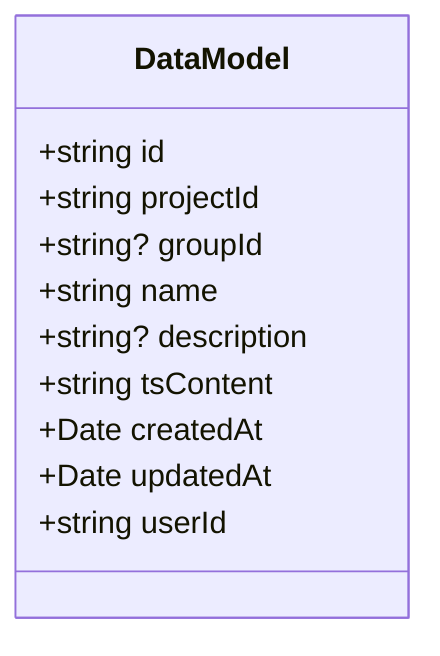
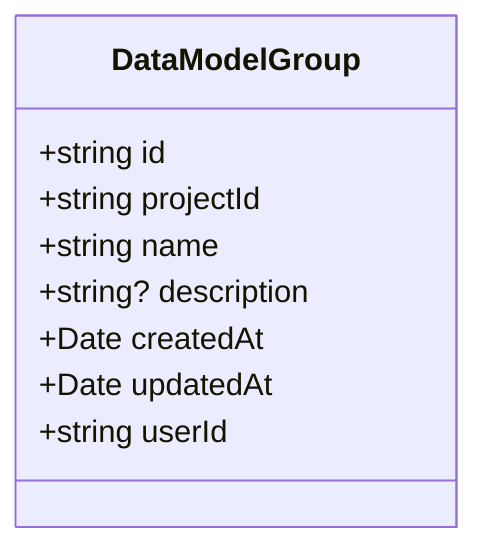
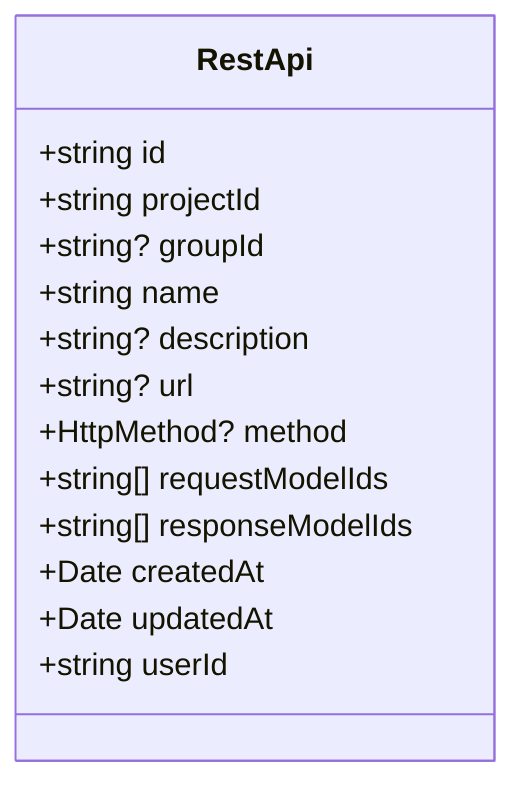
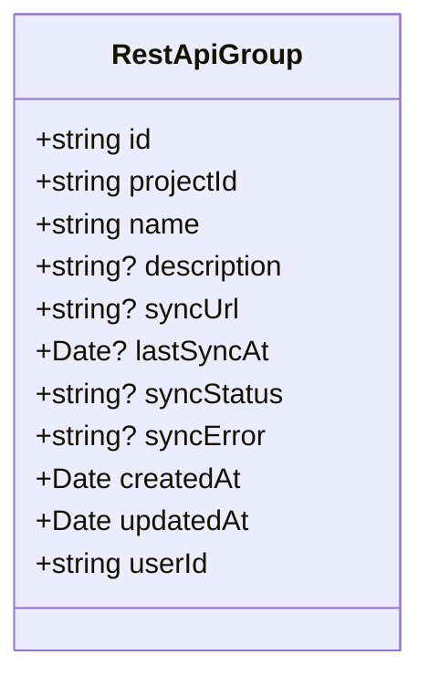
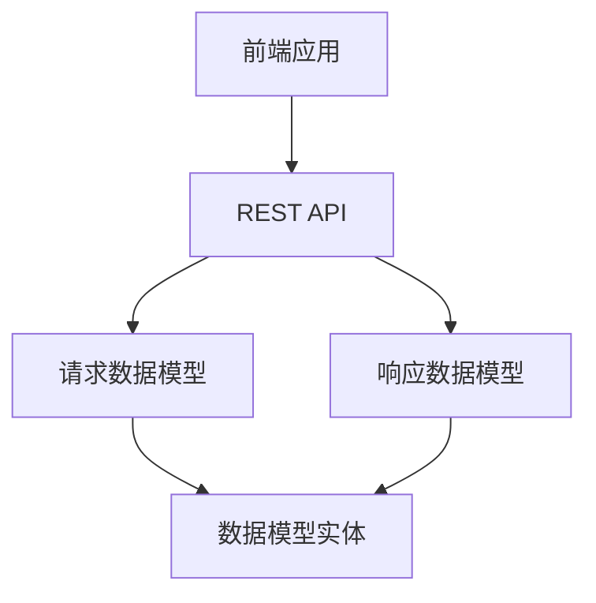
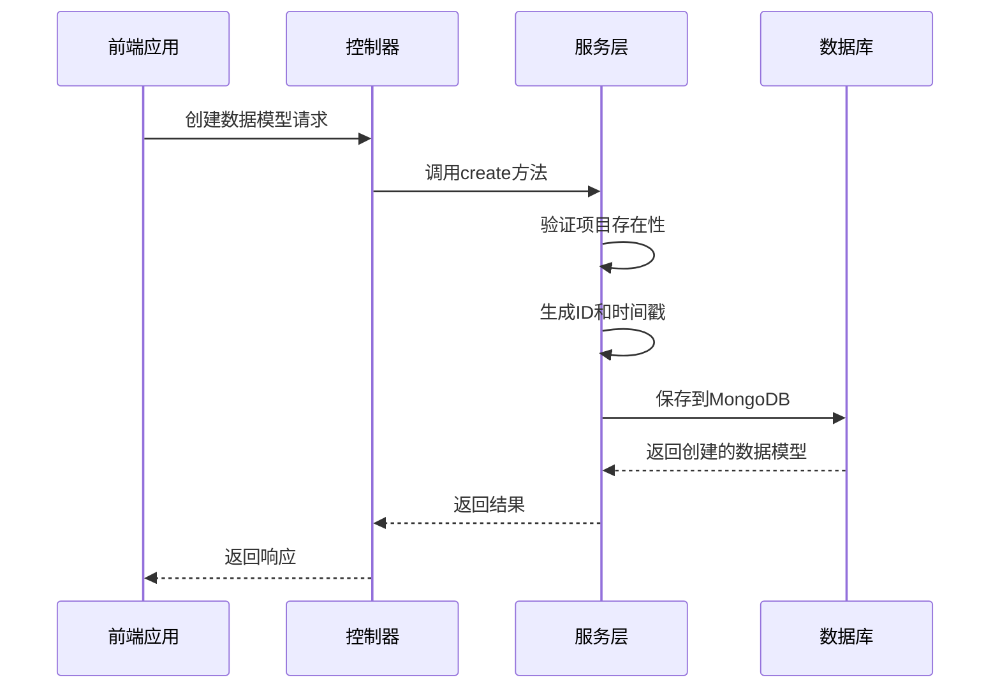
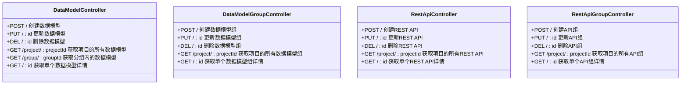
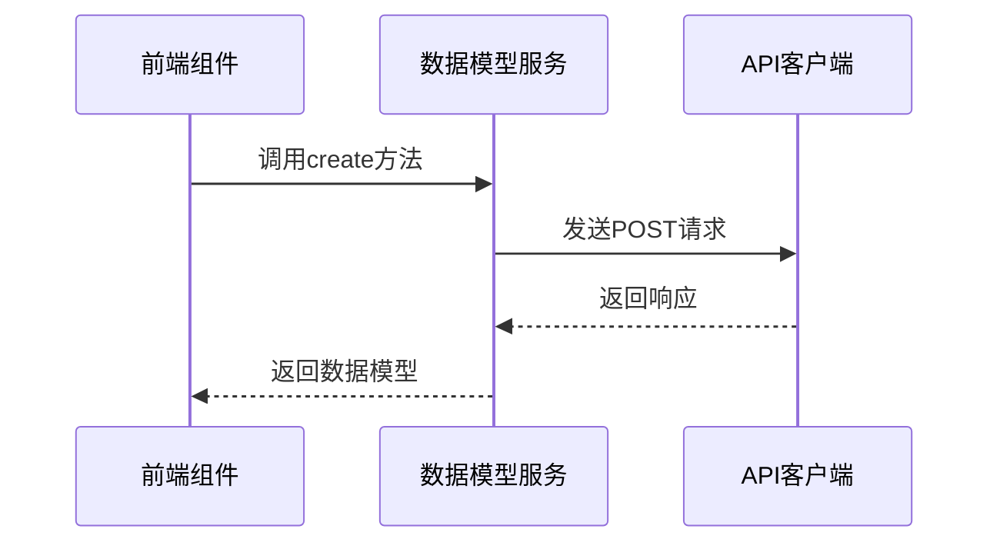
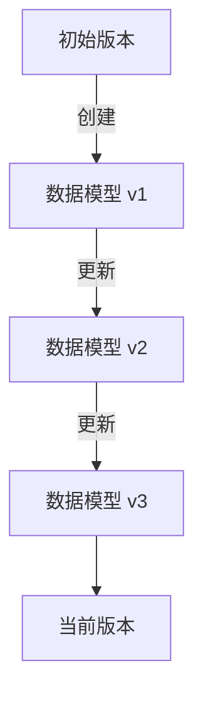

# 数据模型实体

<cite>
**本文档引用的文件**   
- [data-model.ts](file://code-agent-backend/src/entity/code-agent/data-model.ts)
- [data-model-group.ts](file://code-agent-backend/src/entity/code-agent/data-model-group.ts)
- [rest-api.ts](file://code-agent-backend/src/entity/code-agent/rest-api.ts)
- [rest-api-group.ts](file://code-agent-backend/src/entity/code-agent/rest-api-group.ts)
- [data-model.service.ts](file://code-agent-backend/src/service/code-agent/data-model.ts)
- [rest-api.service.ts](file://code-agent-backend/src/service/code-agent/rest-api.ts)
- [data-model.controller.ts](file://code-agent-backend/src/controller/code-agent/data-model.ts)
- [rest-api.controller.ts](file://code-agent-backend/src/controller/code-agent/rest-api.ts)
- [req.ts](file://code-agent-backend/src/dto/code-agent/req.ts)
- [res.ts](file://code-agent-backend/src/dto/code-agent/res.ts)
- [dataModel.ts](file://shared-types/src/dataModel.ts)
- [restApi.ts](file://shared-types/src/restApi.ts)
- [dataModelService.ts](file://fta-layout-design/src/services/dataModelService.ts)
</cite>

## 目录
1. [引言](#引言)
2. [核心实体概述](#核心实体概述)
3. [数据模型实体详解](#数据模型实体详解)
4. [数据模型组实体详解](#数据模型组实体详解)
5. [REST API 实体详解](#rest-api-实体详解)
6. [API 组实体详解](#api-组实体详解)
7. [实体关系与数据流](#实体关系与数据流)
8. [数据访问与操作](#数据访问与操作)
9. [数据模型版本控制与变更审计](#数据模型版本控制与变更审计)
10. [最佳实践与使用指南](#最佳实践与使用指南)

## 引言

本文档旨在全面阐述项目中的核心数据实体，包括数据模型（DataModel）、数据模型组（DataModelGroup）、REST API（RestApi）和API组（RestApiGroup）。这些实体构成了系统数据管理的基础，支持前端工作流的自动化和代码生成。文档将详细描述每个实体的字段定义、数据类型、业务规则和数据库持久化方式，并解释实体间的层级关系和映射逻辑。

**引言**
- [data-model.ts](file://code-agent-backend/src/entity/code-agent/data-model.ts#L1-L55)
- [data-model-group.ts](file://code-agent-backend/src/entity/code-agent/data-model-group.ts#L1-L48)

## 核心实体概述

本系统围绕四个核心实体构建：数据模型（DataModel）、数据模型组（DataModelGroup）、REST API（RestApi）和API组（RestApiGroup）。这些实体通过MongoDB进行持久化存储，并通过RESTful API暴露给前端应用。

- **数据模型（DataModel）**：代表一个TypeScript接口定义，用于描述业务数据结构。
- **数据模型组（DataModelGroup）**：对数据模型进行分组管理，实现项目级别的共享。
- **REST API（RestApi）**：定义RESTful接口，关联请求和响应的数据模型。
- **API组（RestApiGroup）**：对REST API进行分组管理，支持从远程OpenAPI/Swagger文档同步接口。

这些实体通过`projectId`字段与项目（Project）实体关联，确保数据的多租户隔离。

**核心实体概述**
- [data-model.ts](file://code-agent-backend/src/entity/code-agent/data-model.ts#L1-L55)
- [data-model-group.ts](file://code-agent-backend/src/entity/code-agent/data-model-group.ts#L1-L48)
- [rest-api.ts](file://code-agent-backend/src/entity/code-agent/rest-api.ts#L1-L69)
- [rest-api-group.ts](file://code-agent-backend/src/entity/code-agent/rest-api-group.ts#L1-L64)

## 数据模型实体详解

数据模型实体（DataModel）是系统中最基本的数据单元，用于存储TypeScript接口定义。

### 字段定义与数据类型

| 字段名 | 类型 | 必填 | 描述 |
| :--- | :--- | :--- | :--- |
| id | string | 是 | 唯一标识 |
| projectId | string | 是 | 关联的项目ID |
| groupId | string | 否 | 所属分组ID（未分组时为空） |
| name | string | 是 | 数据模型名称 |
| description | string | 否 | 数据模型描述 |
| tsContent | string | 否 | TypeScript接口定义内容 |
| createdAt | Date | 是 | 创建时间 |
| updatedAt | Date | 是 | 更新时间 |
| userId | string | 是 | 用户ID |

### 业务规则

- 数据模型必须属于一个项目（通过`projectId`关联）。
- 数据模型可以属于一个分组（通过`groupId`关联），也可以不归属于任何分组。
- 每个数据模型都有一个唯一的`id`，由系统生成。
- 数据模型的创建、更新和删除操作都需要验证用户身份。

### 数据库持久化

数据模型实体使用Typegoose进行MongoDB映射，持久化到`code_agent_data_model`集合中。实体定义如下：



**Diagram sources**
- [data-model.ts](file://code-agent-backend/src/entity/code-agent/data-model.ts#L1-L55)

**Section sources**
- [data-model.ts](file://code-agent-backend/src/entity/code-agent/data-model.ts#L1-L55)
- [dataModel.ts](file://shared-types/src/dataModel.ts#L1-L54)

## 数据模型组实体详解

数据模型组实体（DataModelGroup）用于对数据模型进行分组管理，实现项目级别的共享。

### 字段定义与数据类型

| 字段名 | 类型 | 必填 | 描述 |
| :--- | :--- | :--- | :--- |
| id | string | 是 | 唯一标识 |
| projectId | string | 是 | 关联的项目ID |
| name | string | 是 | 组名称 |
| description | string | 否 | 组描述 |
| createdAt | Date | 是 | 创建时间 |
| updatedAt | Date | 是 | 更新时间 |
| userId | string | 是 | 用户ID |

### 业务规则

- 数据模型组必须属于一个项目（通过`projectId`关联）。
- 一个数据模型组可以包含多个数据模型。
- 数据模型组的创建、更新和删除操作都需要验证用户身份。

### 数据库持久化

数据模型组实体使用Typegoose进行MongoDB映射，持久化到`code_agent_data_model_group`集合中。实体定义如下：



**Diagram sources**
- [data-model-group.ts](file://code-agent-backend/src/entity/code-agent/data-model-group.ts#L1-L48)

**Section sources**
- [data-model-group.ts](file://code-agent-backend/src/entity/code-agent/data-model-group.ts#L1-L48)

## REST API 实体详解

REST API实体（RestApi）用于存储RESTful接口定义，并关联数据模型。

### 字段定义与数据类型

| 字段名 | 类型 | 必填 | 描述 |
| :--- | :--- | :--- | :--- |
| id | string | 是 | 唯一标识 |
| projectId | string | 是 | 关联的项目ID |
| groupId | string | 否 | 关联的接口组ID |
| name | string | 是 | 接口名称 |
| description | string | 否 | 接口描述 |
| url | string | 否 | API地址 |
| method | HttpMethod | 否 | HTTP请求方法 |
| requestModelIds | string[] | 否 | 请求参数关联的数据模型ID列表 |
| responseModelIds | string[] | 否 | 响应数据关联的数据模型ID列表 |
| createdAt | Date | 是 | 创建时间 |
| updatedAt | Date | 是 | 更新时间 |
| userId | string | 是 | 用户ID |

### 业务规则

- REST API必须属于一个项目（通过`projectId`关联）。
- REST API可以属于一个API组（通过`groupId`关联），也可以不归属于任何组。
- `method`字段的取值范围为：GET、POST、PUT、DELETE、PATCH、HEAD、OPTIONS。
- `requestModelIds`和`responseModelIds`字段用于建立REST API与数据模型的映射关系。

### 数据库持久化

REST API实体使用Typegoose进行MongoDB映射，持久化到`code_agent_rest_api`集合中。实体定义如下：



**Diagram sources**
- [rest-api.ts](file://code-agent-backend/src/entity/code-agent/rest-api.ts#L1-L69)

**Section sources**
- [rest-api.ts](file://code-agent-backend/src/entity/code-agent/rest-api.ts#L1-L69)
- [restApi.ts](file://shared-types/src/restApi.ts#L1-L11)

## API 组实体详解

API组实体（RestApiGroup）用于对REST API进行分组管理，并支持从远程URL同步接口。

### 字段定义与数据类型

| 字段名 | 类型 | 必填 | 描述 |
| :--- | :--- | :--- | :--- |
| id | string | 是 | 唯一标识 |
| projectId | string | 是 | 关联的项目ID |
| name | string | 是 | 组名称 |
| description | string | 否 | 组描述 |
| syncUrl | string | 否 | 远程同步URL（OpenAPI/Swagger文档地址） |
| lastSyncAt | Date | 否 | 最后同步时间 |
| syncStatus | string | 否 | 同步状态：idle \| syncing \| success \| failed |
| syncError | string | 否 | 同步错误信息 |
| createdAt | Date | 是 | 创建时间 |
| updatedAt | Date | 是 | 更新时间 |
| userId | string | 是 | 用户ID |

### 业务规则

- API组必须属于一个项目（通过`projectId`关联）。
- `syncUrl`字段用于配置远程OpenAPI/Swagger文档的地址。
- `syncStatus`字段用于跟踪同步状态，支持`idle`、`syncing`、`success`和`failed`四种状态。
- 同步功能允许从远程文档自动导入API定义。

### 数据库持久化

API组实体使用Typegoose进行MongoDB映射，持久化到`code_agent_rest_api_group`集合中。实体定义如下：



**Diagram sources**
- [rest-api-group.ts](file://code-agent-backend/src/entity/code-agent/rest-api-group.ts#L1-L64)

**Section sources**
- [rest-api-group.ts](file://code-agent-backend/src/entity/code-agent/rest-api-group.ts#L1-L64)

## 实体关系与数据流

### 实体关系图（ERD）

```mermaid
erDiagram
DATA_MODEL_GROUP {
string id PK
string projectId FK
string name
string? description
timestamp createdAt
timestamp updatedAt
string userId
}
DATA_MODEL {
string id PK
string projectId FK
string? groupId FK
string name
string? description
string tsContent
timestamp createdAt
timestamp updatedAt
string userId
}
REST_API_GROUP {
string id PK
string projectId FK
string name
string? description
string? syncUrl
timestamp? lastSyncAt
string? syncStatus
string? syncError
timestamp createdAt
timestamp updatedAt
string userId
}
REST_API {
string id PK
string projectId FK
string? groupId FK
string name
string? description
string? url
string? method
string[] requestModelIds
string[] responseModelIds
timestamp createdAt
timestamp updatedAt
string userId
}
PROJECT {
string id PK
string name
string manager
string status
number progress
number members
string[] tags
string avatar
string[] workdirs
timestamp createdAt
timestamp updatedAt
string userId
string gitId
}
DATA_MODEL_GROUP ||--o{ DATA_MODEL : "包含"
REST_API_GROUP ||--o{ REST_API : "包含"
PROJECT ||--o{ DATA_MODEL_GROUP : "拥有"
PROJECT ||--o{ DATA_MODEL : "拥有"
PROJECT ||--o{ REST_API_GROUP : "拥有"
PROJECT ||--o{ REST_API : "拥有"
```

**Diagram sources**
- [data-model.ts](file://code-agent-backend/src/entity/code-agent/data-model.ts#L1-L55)
- [data-model-group.ts](file://code-agent-backend/src/entity/code-agent/data-model-group.ts#L1-L48)
- [rest-api.ts](file://code-agent-backend/src/entity/code-agent/rest-api.ts#L1-L69)
- [rest-api-group.ts](file://code-agent-backend/src/entity/code-agent/rest-api-group.ts#L1-L64)
- [project.ts](file://code-agent-backend/src/entity/code-agent/project.ts#L115-L167)

### 映射逻辑

数据模型与REST API的映射通过`requestModelIds`和`responseModelIds`字段实现。当一个REST API需要引用数据模型时，只需将数据模型的`id`添加到相应的字段中。



**Diagram sources**
- [rest-api.ts](file://code-agent-backend/src/entity/code-agent/rest-api.ts#L48-L54)
- [data-model.ts](file://code-agent-backend/src/entity/code-agent/data-model.ts#L1-L55)

**Section sources**
- [rest-api.ts](file://code-agent-backend/src/entity/code-agent/rest-api.ts#L1-L69)
- [data-model.ts](file://code-agent-backend/src/entity/code-agent/data-model.ts#L1-L55)

## 数据访问与操作

### 服务层实现

数据访问通过服务层（Service Layer）实现，每个实体都有对应的服务类：

- `DataModelService`：处理数据模型的CRUD操作
- `DataModelGroupService`：处理数据模型组的CRUD操作
- `RestApiService`：处理REST API的CRUD操作
- `RestApiGroupService`：处理API组的CRUD操作

服务层负责业务逻辑验证、数据转换和数据库操作。



**Diagram sources**
- [data-model.service.ts](file://code-agent-backend/src/service/code-agent/data-model.ts#L1-L219)
- [data-model.controller.ts](file://code-agent-backend/src/controller/code-agent/data-model.ts#L1-L125)

### 控制器层

控制器层（Controller Layer）暴露RESTful API，处理HTTP请求和响应：

- `/code-agent/data-model`：数据模型相关API
- `/code-agent/data-model-group`：数据模型组相关API
- `/code-agent/rest-api`：REST API相关API
- `/code-agent/rest-api-group`：API组相关API



**Diagram sources**
- [data-model.controller.ts](file://code-agent-backend/src/controller/code-agent/data-model.ts#L1-L125)
- [data-model-group.controller.ts](file://code-agent-backend/src/controller/code-agent/data-model-group.ts#L1-L102)
- [rest-api.controller.ts](file://code-agent-backend/src/controller/code-agent/rest-api.ts#L1-L132)
- [rest-api-group.controller.ts](file://code-agent-backend/src/controller/code-agent/rest-api-group.ts#L1-L102)

**Section sources**
- [data-model.controller.ts](file://code-agent-backend/src/controller/code-agent/data-model.ts#L1-L125)
- [data-model-group.controller.ts](file://code-agent-backend/src/controller/code-agent/data-model-group.ts#L1-L102)
- [rest-api.controller.ts](file://code-agent-backend/src/controller/code-agent/rest-api.ts#L1-L132)
- [rest-api-group.controller.ts](file://code-agent-backend/src/controller/code-agent/rest-api-group.ts#L1-L102)

### 前端数据访问

前端通过`dataModelService`和`restApiService`等服务类访问后端API：



**Diagram sources**
- [dataModelService.ts](file://fta-layout-design/src/services/dataModelService.ts#L1-L131)

**Section sources**
- [dataModelService.ts](file://fta-layout-design/src/services/dataModelService.ts#L1-L131)

## 数据模型版本控制与变更审计

### 版本控制

系统通过`createdAt`和`updatedAt`字段实现数据模型的版本控制。每次更新操作都会更新`updatedAt`字段，从而记录变更时间。

### 变更审计

所有实体都包含`userId`字段，用于记录创建和修改数据的用户。结合`createdAt`和`updatedAt`字段，可以实现完整的变更审计功能。

### 迁移策略

数据模型的迁移通过`tsContent`字段实现。当需要修改数据结构时，可以直接更新该字段的内容。系统支持从旧版本平滑迁移到新版本，因为历史数据仍然保留。



**Section sources**
- [data-model.ts](file://code-agent-backend/src/entity/code-agent/data-model.ts#L43-L49)
- [data-model.service.ts](file://code-agent-backend/src/service/code-agent/data-model.ts#L71-L82)

## 最佳实践与使用指南

### 数据模型设计

- 使用有意义的名称和描述
- 保持TypeScript接口定义的简洁性
- 合理使用分组管理大量数据模型

### API设计

- 使用标准的HTTP方法
- 保持API地址的语义化
- 合理关联请求和响应的数据模型

### 分组管理

- 按业务模块进行分组
- 避免创建过多的分组
- 定期清理不再使用的分组

### 性能优化

- 使用索引优化查询性能
- 批量操作减少数据库交互
- 合理使用缓存机制

**最佳实践与使用指南**
- [data-model.ts](file://code-agent-backend/src/entity/code-agent/data-model.ts#L1-L55)
- [rest-api.ts](file://code-agent-backend/src/entity/code-agent/rest-api.ts#L1-L69)