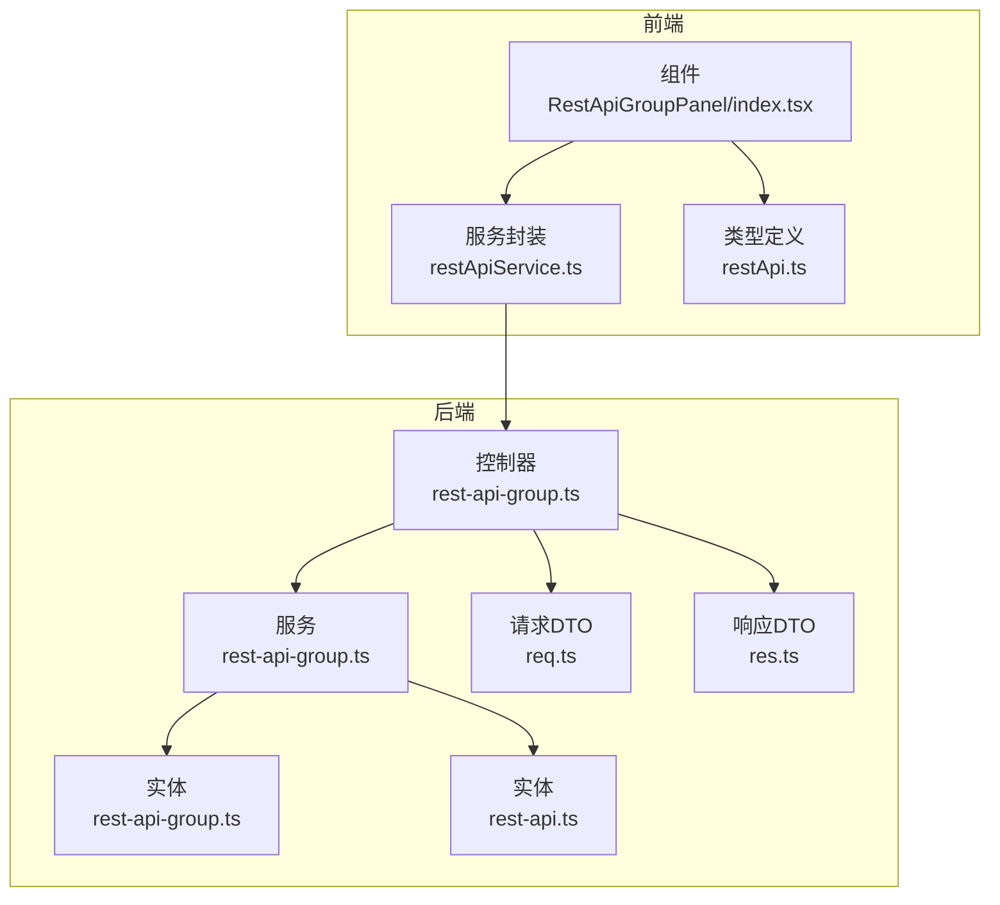
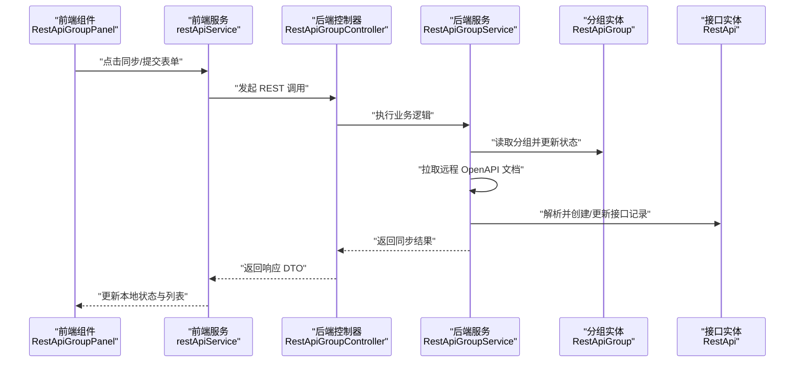
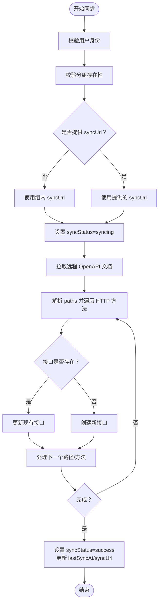
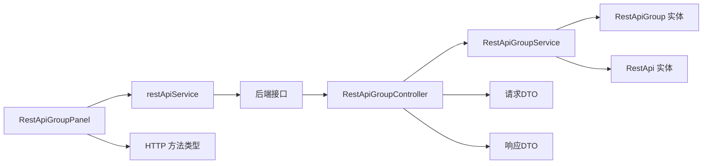

# REST API 分组

<cite>
**本文引用的文件**
- [rest-api-group.ts（实体）](file://code-agent-backend/src/entity/code-agent/rest-api-group.ts)
- [rest-api-group.ts（控制器）](file://code-agent-backend/src/controller/code-agent/rest-api-group.ts)
- [rest-api-group.ts（服务）](file://code-agent-backend/src/service/code-agent/rest-api-group.ts)
- [req.ts（请求DTO）](file://code-agent-backend/src/dto/code-agent/req.ts)
- [res.ts（响应DTO）](file://code-agent-backend/src/dto/code-agent/res.ts)
- [rest-api.ts（实体）](file://code-agent-backend/src/entity/code-agent/rest-api.ts)
- [restApi.ts（前端类型）](file://shared-types/src/restApi.ts)
- [restApiGroupPanel.tsx（前端组件）](file://fta-layout-design/src/pages/EditorPage/components/RestApiGroupPanel/index.tsx)
- [restApiService.ts（前端服务）](file://fta-layout-design/src/services/restApiService.ts)
- [restApi.ts（前端类型）](file://fta-layout-design/src/types/restApi.ts)
</cite>

## 目录
1. [简介](#简介)
2. [项目结构](#项目结构)
3. [核心组件](#核心组件)
4. [架构总览](#架构总览)
5. [详细组件分析](#详细组件分析)
6. [依赖分析](#依赖分析)
7. [性能考虑](#性能考虑)
8. [故障排查指南](#故障排查指南)
9. [结论](#结论)
10. [附录](#附录)

## 简介
本文件围绕 RestApiGroup 实体及其在系统中的职责展开，系统性梳理其字段定义、数据类型与业务规则，解释在 MongoDB 中的持久化方式，阐明 REST API 分组作为 REST API 容器的层级关系及在项目组织中的作用。重点阐述同步能力（syncRestApiGroup）如何从外部 OpenAPI/Swagger 文档拉取并生成/更新接口定义，给出前后端交互流程与前端工作台组件的交互逻辑，并说明分组与单个 REST API 的关联管理策略。

## 项目结构
围绕 REST API 分组的关键文件分布如下：
- 后端实体与服务：RestApiGroup 实体、RestApiGroup 控制器、RestApiGroup 服务
- 前端组件与服务：RestApiGroupPanel 组件、restApiService 封装
- 类型与DTO：请求/响应 DTO、共享 HTTP 方法类型

图表来源
- [rest-api-group.ts（控制器）](file://code-agent-backend/src/controller/code-agent/rest-api-group.ts#L1-L123)
- [rest-api-group.ts（服务）](file://code-agent-backend/src/service/code-agent/rest-api-group.ts#L1-L331)
- [rest-api-group.ts（实体）](file://code-agent-backend/src/entity/code-agent/rest-api-group.ts#L1-L64)
- [rest-api.ts（实体）](file://code-agent-backend/src/entity/code-agent/rest-api.ts#L1-L69)
- [req.ts（请求DTO）](file://code-agent-backend/src/dto/code-agent/req.ts#L492-L521)
- [res.ts（响应DTO）](file://code-agent-backend/src/dto/code-agent/res.ts#L339-L389)
- [restApiGroupPanel.tsx（前端组件）](file://fta-layout-design/src/pages/EditorPage/components/RestApiGroupPanel/index.tsx#L1-L440)
- [restApiService.ts（前端服务）](file://fta-layout-design/src/services/restApiService.ts#L1-L138)
- [restApi.ts（前端类型）](file://fta-layout-design/src/types/restApi.ts#L1-L139)

章节来源
- [rest-api-group.ts（控制器）](file://code-agent-backend/src/controller/code-agent/rest-api-group.ts#L1-L123)
- [rest-api-group.ts（服务）](file://code-agent-backend/src/service/code-agent/rest-api-group.ts#L1-L331)
- [rest-api-group.ts（实体）](file://code-agent-backend/src/entity/code-agent/rest-api-group.ts#L1-L64)
- [rest-api.ts（实体）](file://code-agent-backend/src/entity/code-agent/rest-api.ts#L1-L69)
- [req.ts（请求DTO）](file://code-agent-backend/src/dto/code-agent/req.ts#L492-L521)
- [res.ts（响应DTO）](file://code-agent-backend/src/dto/code-agent/res.ts#L339-L389)
- [restApiGroupPanel.tsx（前端组件）](file://fta-layout-design/src/pages/EditorPage/components/RestApiGroupPanel/index.tsx#L1-L440)
- [restApiService.ts（前端服务）](file://fta-layout-design/src/services/restApiService.ts#L1-L138)
- [restApi.ts（前端类型）](file://fta-layout-design/src/types/restApi.ts#L1-L139)

## 核心组件
- RestApiGroup 实体：定义分组的唯一标识、所属项目、名称、描述、远程同步 URL、最后同步时间、同步状态与错误信息、时间戳与用户标识等字段。
- RestApi 实体：定义单个 REST API 的唯一标识、所属项目、所属分组、名称、描述、URL、HTTP 方法、请求/响应模型关联 ID 列表、时间戳与用户标识。
- RestApiGroupService：实现创建、更新、删除、查询、同步等核心业务逻辑；负责从 OpenAPI 文档解析并创建/更新接口记录。
- RestApiGroupController：暴露 REST API 分组的增删改查与同步接口，返回标准化响应 DTO。
- RestApiGroupPanel：前端工作台组件，提供创建/编辑/删除/同步分组的操作入口与状态展示。
- restApiService：前端服务封装，统一调用后端接口，屏蔽具体 API 细节。

章节来源
- [rest-api-group.ts（实体）](file://code-agent-backend/src/entity/code-agent/rest-api-group.ts#L1-L64)
- [rest-api.ts（实体）](file://code-agent-backend/src/entity/code-agent/rest-api.ts#L1-L69)
- [rest-api-group.ts（服务）](file://code-agent-backend/src/service/code-agent/rest-api-group.ts#L1-L331)
- [rest-api-group.ts（控制器）](file://code-agent-backend/src/controller/code-agent/rest-api-group.ts#L1-L123)
- [restApiGroupPanel.tsx（前端组件）](file://fta-layout-design/src/pages/EditorPage/components/RestApiGroupPanel/index.tsx#L1-L440)
- [restApiService.ts（前端服务）](file://fta-layout-design/src/services/restApiService.ts#L1-L138)

## 架构总览
后端采用控制器-服务-实体三层结构，前端通过 restApiService 调用后端接口，RestApiGroupPanel 提供可视化操作与状态反馈。

图表来源
- [restApiGroupPanel.tsx（前端组件）](file://fta-layout-design/src/pages/EditorPage/components/RestApiGroupPanel/index.tsx#L158-L191)
- [restApiService.ts（前端服务）](file://fta-layout-design/src/services/restApiService.ts#L63-L70)
- [rest-api-group.ts（控制器）](file://code-agent-backend/src/controller/code-agent/rest-api-group.ts#L105-L121)
- [rest-api-group.ts（服务）](file://code-agent-backend/src/service/code-agent/rest-api-group.ts#L194-L328)
- [rest-api-group.ts（实体）](file://code-agent-backend/src/entity/code-agent/rest-api-group.ts#L1-L64)
- [rest-api.ts（实体）](file://code-agent-backend/src/entity/code-agent/rest-api.ts#L1-L69)

## 详细组件分析

### RestApiGroup 实体与字段定义
- 字段与类型
  - id: string（必填）
  - projectId: string（必填）
  - name: string（必填）
  - description: string（可选）
  - syncUrl: string（可选）
  - lastSyncAt: Date（可选）
  - syncStatus: 'idle' | 'syncing' | 'success' | 'failed'（默认 idle）
  - syncError: string（可选）
  - createdAt: Date（必填）
  - updatedAt: Date（必填）
  - userId: string（必填）

- 数据持久化
  - 使用 @EntityModel 与 @modelOptions 定义集合名为 code_agent_rest_api_group，并启用时间戳字段 createdAt/updatedAt。
  - 允许 Mixed 类型字段以兼容扩展属性。

- 业务规则
  - 必填字段校验由装饰器与服务层共同保障。
  - 同步状态机：idle -> syncing -> success 或 failed，失败时记录 syncError。
  - 与项目与用户绑定，确保权限隔离。

章节来源
- [rest-api-group.ts（实体）](file://code-agent-backend/src/entity/code-agent/rest-api-group.ts#L1-L64)

### RestApi 实体与字段定义
- 字段与类型
  - id: string（必填）
  - projectId: string（必填）
  - groupId?: string（可选）
  - name: string（必填）
  - description?: string（可选）
  - url?: string（可选）
  - method?: HttpMethod（枚举 GET/POST/PUT/DELETE/PATCH/HEAD/OPTIONS）
  - requestModelIds: string[]（默认空数组）
  - responseModelIds: string[]（默认空数组）
  - createdAt: Date（必填）
  - updatedAt: Date（必填）
  - userId: string（必填）

- 关联关系
  - 一个分组可包含多个接口；接口可为空分组或归属某个分组。

章节来源
- [rest-api.ts（实体）](file://code-agent-backend/src/entity/code-agent/rest-api.ts#L1-L69)

### 同步能力：syncRestApiGroup
- 触发方式
  - 前端：RestApiGroupPanel 提供“同步”按钮，若未配置 syncUrl，会提示先编辑配置。
  - 后端：控制器提供 POST /code-agent/rest-api-group/:id/sync，支持传入 syncUrl 或使用组内已配置的 URL。

- 后端流程
  - 校验用户身份与分组存在性。
  - 若未提供 syncUrl，则使用组内 syncUrl。
  - 设置同步状态为 syncing 并清空错误信息。
  - 拉取远程 OpenAPI 文档（Accept: application/json），解析 paths 下的方法与路径，逐条创建/更新接口记录。
  - 成功后设置 syncStatus 为 success，更新 lastSyncAt 与 syncUrl；失败则设置 failed 并记录错误信息。
  - 返回同步计数与新增/更新的接口列表。

- OpenAPI 解析要点
  - 支持的 HTTP 方法：GET/POST/PUT/DELETE/PATCH/HEAD/OPTIONS。
  - 优先使用 operation.summary 作为接口名称，否则使用 operationId，再不满足则使用 “方法 + 路径”。
  - 去重策略：按 groupId + url + method + userId 唯一匹配，存在则更新，不存在则创建。

图表来源
- [rest-api-group.ts（服务）](file://code-agent-backend/src/service/code-agent/rest-api-group.ts#L194-L328)

章节来源
- [rest-api-group.ts（控制器）](file://code-agent-backend/src/controller/code-agent/rest-api-group.ts#L105-L121)
- [rest-api-group.ts（服务）](file://code-agent-backend/src/service/code-agent/rest-api-group.ts#L194-L328)
- [restApiGroupPanel.tsx（前端组件）](file://fta-layout-design/src/pages/EditorPage/components/RestApiGroupPanel/index.tsx#L158-L191)
- [restApiService.ts（前端服务）](file://fta-layout-design/src/services/restApiService.ts#L63-L70)

### 前端工作台：RestApiGroupPanel 交互逻辑
- 功能概览
  - 展示“全部”、“未分组”与各分组项，支持点击切换选中分组。
  - 创建/编辑分组：表单包含名称、描述、可选的同步 URL；创建成功后可选择立即同步。
  - 删除分组：若分组下有接口，删除前会提示确认，删除同时会级联删除该分组下的所有接口。
  - 同步：当分组配置了 syncUrl 时显示同步按钮；同步成功后刷新分组状态与接口列表。

- 状态与提示
  - 同步状态标签：同步中、已同步、同步失败（带错误信息）、待同步（已配置 URL）。
  - 成功/失败消息提示，失败时刷新分组以显示最新错误信息。

- 与后端协作
  - 通过 restApiService 调用后端接口，成功后更新本地 store 中的分组与接口列表。

章节来源
- [restApiGroupPanel.tsx（前端组件）](file://fta-layout-design/src/pages/EditorPage/components/RestApiGroupPanel/index.tsx#L1-L440)
- [restApiService.ts（前端服务）](file://fta-layout-design/src/services/restApiService.ts#L1-L138)

### 分组与单个 REST API 的关联管理
- 关系模型
  - 一个分组可包含多个接口；接口可归属某一分组，也可为空分组（未分组）。
  - 查询接口时支持按项目、按分组、按未分组三种维度。

- 前端视角
  - “全部”表示项目内所有接口；“未分组”表示 groupId 为空的接口；分组项表示该分组下的接口。
  - 组件根据选中分组动态过滤接口列表。

- 后端视角
  - 删除分组时，服务层会级联删除该分组下的所有接口，保证数据一致性。
  - 查询接口时支持按 groupId 或未分组条件筛选。

章节来源
- [rest-api.ts（实体）](file://code-agent-backend/src/entity/code-agent/rest-api.ts#L1-L69)
- [rest-api-group.ts（服务）](file://code-agent-backend/src/service/code-agent/rest-api-group.ts#L144-L163)
- [restApiGroupPanel.tsx（前端组件）](file://fta-layout-design/src/pages/EditorPage/components/RestApiGroupPanel/index.tsx#L37-L46)

## 依赖分析
- 后端依赖
  - 控制器依赖服务；服务依赖实体模型与上下文；实体依赖 Typegoose/Mongoose 注解。
  - DTO 与响应 DTO 用于接口契约定义与文档生成。

- 前端依赖
  - 组件依赖 restApiService；restApiService 依赖通用 API 封装；类型定义来自 shared-types 与本地类型文件。

图表来源
- [restApiGroupPanel.tsx（前端组件）](file://fta-layout-design/src/pages/EditorPage/components/RestApiGroupPanel/index.tsx#L1-L440)
- [restApiService.ts（前端服务）](file://fta-layout-design/src/services/restApiService.ts#L1-L138)
- [rest-api-group.ts（控制器）](file://code-agent-backend/src/controller/code-agent/rest-api-group.ts#L1-L123)
- [rest-api-group.ts（服务）](file://code-agent-backend/src/service/code-agent/rest-api-group.ts#L1-L331)
- [rest-api-group.ts（实体）](file://code-agent-backend/src/entity/code-agent/rest-api-group.ts#L1-L64)
- [rest-api.ts（实体）](file://code-agent-backend/src/entity/code-agent/rest-api.ts#L1-L69)
- [req.ts（请求DTO）](file://code-agent-backend/src/dto/code-agent/req.ts#L492-L521)
- [res.ts（响应DTO）](file://code-agent-backend/src/dto/code-agent/res.ts#L339-L389)
- [restApi.ts（前端类型）](file://fta-layout-design/src/types/restApi.ts#L1-L139)
- [restApi.ts（共享类型）](file://shared-types/src/restApi.ts#L1-L11)

章节来源
- [rest-api-group.ts（控制器）](file://code-agent-backend/src/controller/code-agent/rest-api-group.ts#L1-L123)
- [rest-api-group.ts（服务）](file://code-agent-backend/src/service/code-agent/rest-api-group.ts#L1-L331)
- [rest-api-group.ts（实体）](file://code-agent-backend/src/entity/code-agent/rest-api-group.ts#L1-L64)
- [rest-api.ts（实体）](file://code-agent-backend/src/entity/code-agent/rest-api.ts#L1-L69)
- [req.ts（请求DTO）](file://code-agent-backend/src/dto/code-agent/req.ts#L492-L521)
- [res.ts（响应DTO）](file://code-agent-backend/src/dto/code-agent/res.ts#L339-L389)
- [restApiGroupPanel.tsx（前端组件）](file://fta-layout-design/src/pages/EditorPage/components/RestApiGroupPanel/index.tsx#L1-L440)
- [restApiService.ts（前端服务）](file://fta-layout-design/src/services/restApiService.ts#L1-L138)
- [restApi.ts（前端类型）](file://fta-layout-design/src/types/restApi.ts#L1-L139)
- [restApi.ts（共享类型）](file://shared-types/src/restApi.ts#L1-L11)

## 性能考虑
- 同步性能
  - OpenAPI 文档解析为 O(N×M)，其中 N 为路径数，M 为方法数；建议控制单次同步的文档规模。
  - 对于大规模接口，可考虑分批处理或后台任务队列。
- 数据访问
  - 查询分组与接口均按 projectId 与 userId 过滤，确保数据隔离；建议在相关字段建立索引以提升查询效率。
- 前端渲染
  - 列表渲染时避免不必要的重渲染，组件内部使用状态管理（如 valtio）以减少全局刷新。

## 故障排查指南
- 常见错误与定位
  - 用户 ID 为空：服务层在解析用户上下文失败时抛错，需检查鉴权中间件与请求头。
  - 项目不存在：创建/更新/同步前会校验项目与用户绑定，需确认 projectId 与当前用户一致。
  - 分组不存在：删除/同步前会校验分组存在性，需确认 id 与用户一致。
  - 同步 URL 未提供：若未传入 syncUrl 且分组未配置，会报错提示提供 URL。
  - 远程文档拉取失败：HTTP 非 2xx 会抛错，检查网络连通性与文档可达性。
  - 同步失败：服务层会记录 syncError，前端可查看并重试。

- 前端提示
  - 同步按钮禁用：当正在同步或未配置 syncUrl 时禁用。
  - 错误标签：同步失败时显示错误信息，便于快速定位问题。

章节来源
- [rest-api-group.ts（服务）](file://code-agent-backend/src/service/code-agent/rest-api-group.ts#L81-L111)
- [rest-api-group.ts（服务）](file://code-agent-backend/src/service/code-agent/rest-api-group.ts#L194-L260)
- [rest-api-group.ts（控制器）](file://code-agent-backend/src/controller/code-agent/rest-api-group.ts#L105-L121)
- [restApiGroupPanel.tsx（前端组件）](file://fta-layout-design/src/pages/EditorPage/components/RestApiGroupPanel/index.tsx#L193-L221)

## 结论
RestApiGroup 作为 REST API 的容器，承担了项目内接口的组织与生命周期管理职责。通过 OpenAPI/Swagger 文档的同步能力，系统实现了从外部规范到内部接口定义的自动化落地。后端以清晰的三层结构保障了业务逻辑与数据持久化的分离，前端通过 RestApiGroupPanel 提供直观的操作体验与状态反馈。结合分组与接口的关联管理，开发者可以高效地维护与组织项目内的接口资产。

## 附录

### API 定义与示例路径
- 创建分组
  - 方法与路径：POST /code-agent/rest-api-group/
  - 请求体：CreateRestApiGroupRequest
  - 响应体：CreateRestApiGroupResponse
  - 示例路径：[请求DTO](file://code-agent-backend/src/dto/code-agent/req.ts#L492-L504)、[响应DTO](file://code-agent-backend/src/dto/code-agent/res.ts#L366-L376)
- 更新分组
  - 方法与路径：PUT /code-agent/rest-api-group/:id
  - 请求体：UpdateRestApiGroupRequest
  - 响应体：UpdateRestApiGroupResponse
  - 示例路径：[请求DTO](file://code-agent-backend/src/dto/code-agent/req.ts#L506-L515)、[响应DTO](file://code-agent-backend/src/dto/code-agent/res.ts#L372-L376)
- 删除分组
  - 方法与路径：DELETE /code-agent/rest-api-group/:id
  - 响应体：DeleteRestApiGroupResponse
  - 示例路径：[响应DTO](file://code-agent-backend/src/dto/code-agent/res.ts#L378-L382)
- 获取项目分组列表
  - 方法与路径：GET /code-agent/rest-api-group/project/:projectId
  - 响应体：RestApiGroupListResponse
  - 示例路径：[响应DTO](file://code-agent-backend/src/dto/code-agent/res.ts#L354-L358)
- 获取单个分组详情
  - 方法与路径：GET /code-agent/rest-api-group/:id
  - 响应体：RestApiGroupDetailResponse
  - 示例路径：[响应DTO](file://code-agent-backend/src/dto/code-agent/res.ts#L360-L364)
- 同步分组
  - 方法与路径：POST /code-agent/rest-api-group/:id/sync
  - 请求体：SyncRestApiGroupRequest
  - 响应体：SyncRestApiGroupResponse
  - 示例路径：[请求DTO](file://code-agent-backend/src/dto/code-agent/req.ts#L517-L520)、[响应DTO](file://code-agent-backend/src/dto/code-agent/res.ts#L384-L388)

### 开发者示例（代码片段路径）
- 创建分组（后端）
  - 服务层创建逻辑：[创建实现](file://code-agent-backend/src/service/code-agent/rest-api-group.ts#L84-L111)
  - 控制器调用与响应封装：[控制器](file://code-agent-backend/src/controller/code-agent/rest-api-group.ts#L29-L38)
- 同步分组（后端）
  - 同步主流程与状态更新：[同步实现](file://code-agent-backend/src/service/code-agent/rest-api-group.ts#L194-L260)
  - OpenAPI 文档解析与接口创建/更新：[解析与保存](file://code-agent-backend/src/service/code-agent/rest-api-group.ts#L262-L328)
- 前端创建/同步（工作台）
  - 创建与立即同步逻辑：[创建处理](file://fta-layout-design/src/pages/EditorPage/components/RestApiGroupPanel/index.tsx#L55-L92)
  - 同步按钮与状态展示：[同步处理](file://fta-layout-design/src/pages/EditorPage/components/RestApiGroupPanel/index.tsx#L158-L191)
  - 服务封装调用：[服务封装](file://fta-layout-design/src/services/restApiService.ts#L63-L70)