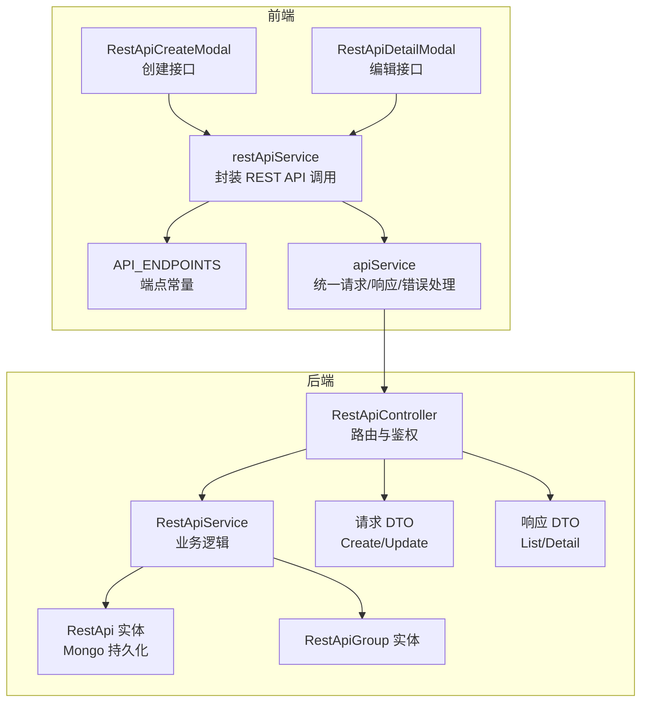
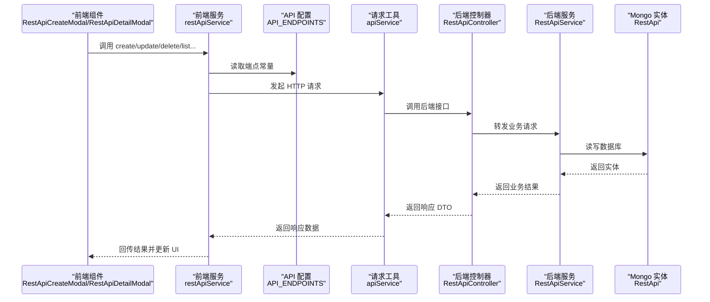
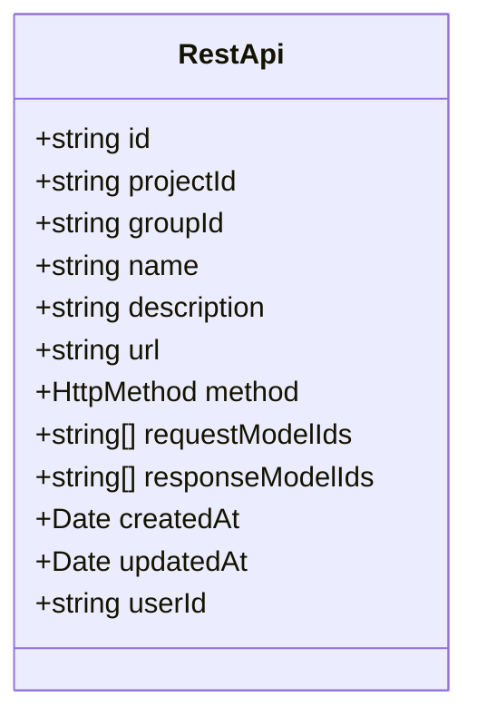
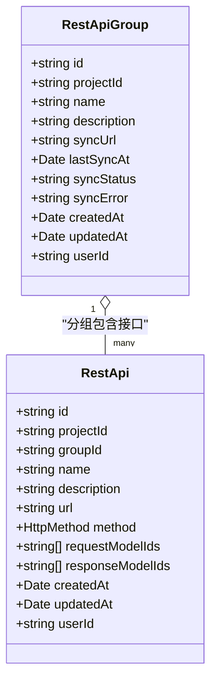
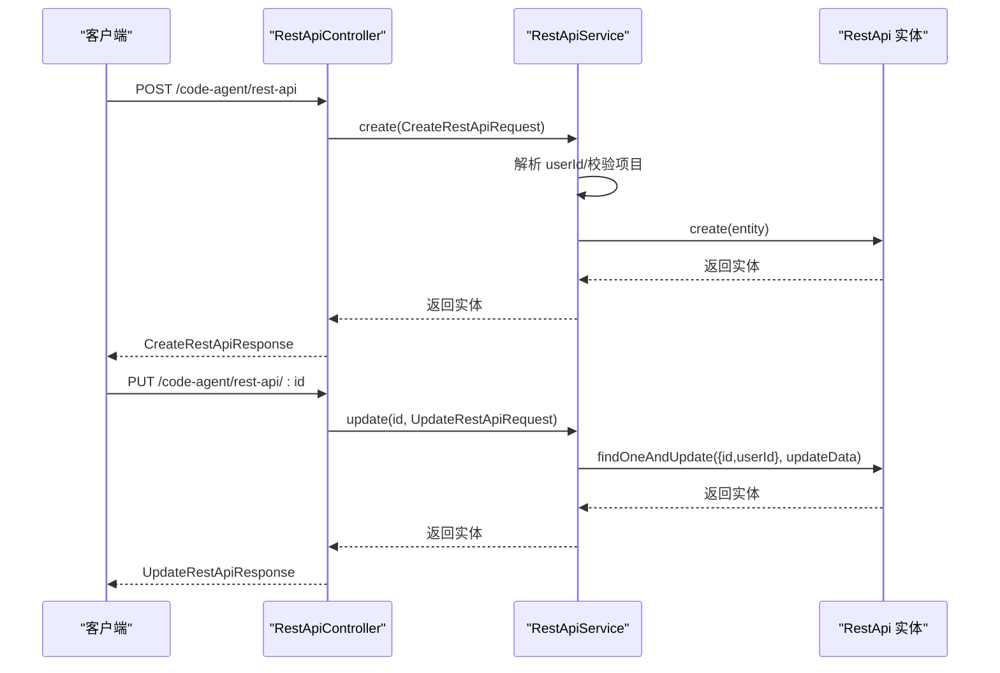
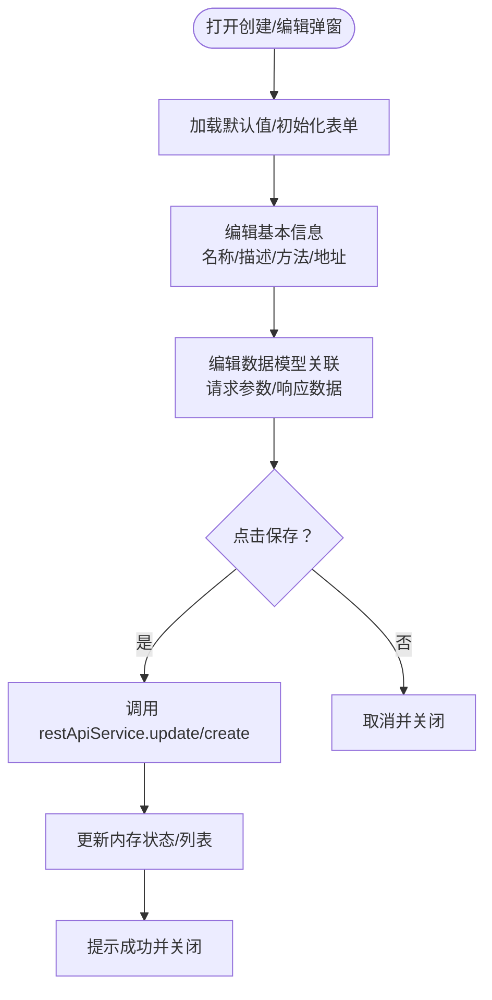
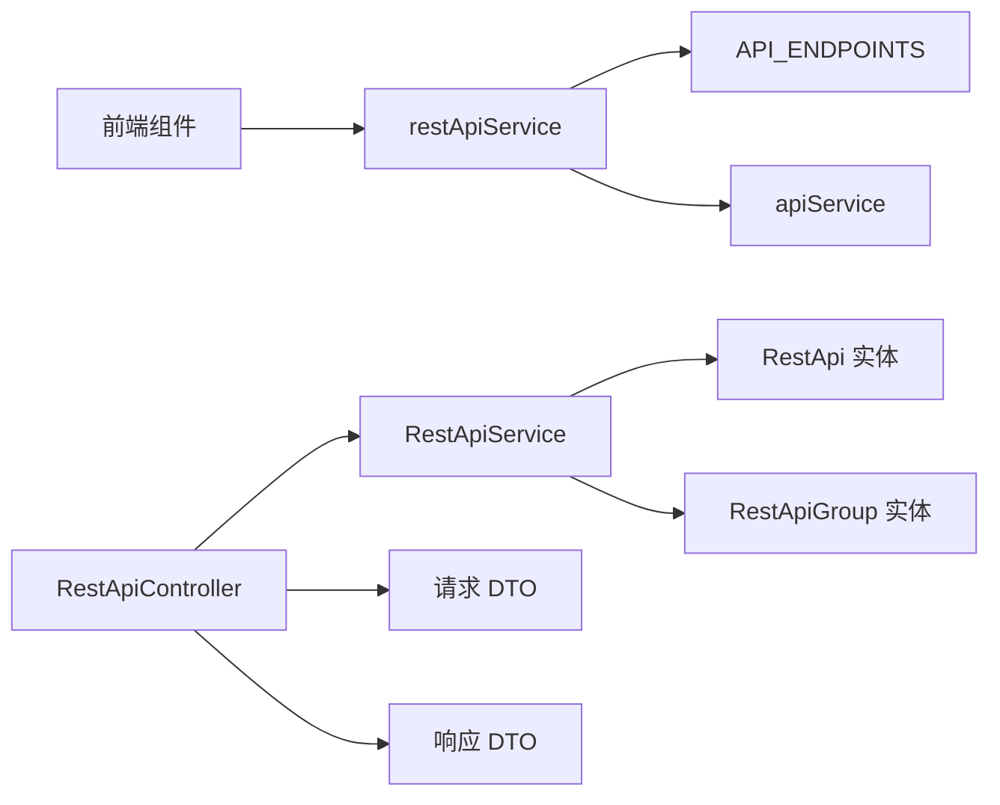

# REST API 管理

<cite>
**本文引用的文件**
- [code-agent-backend/src/entity/code-agent/rest-api.ts](file://code-agent-backend/src/entity/code-agent/rest-api.ts)
- [code-agent-backend/src/entity/code-agent/rest-api-group.ts](file://code-agent-backend/src/entity/code-agent/rest-api-group.ts)
- [code-agent-backend/src/controller/code-agent/rest-api.ts](file://code-agent-backend/src/controller/code-agent/rest-api.ts)
- [code-agent-backend/src/service/code-agent/rest-api.ts](file://code-agent-backend/src/service/code-agent/rest-api.ts)
- [code-agent-backend/src/dto/code-agent/req.ts](file://code-agent-backend/src/dto/code-agent/req.ts)
- [code-agent-backend/src/dto/code-agent/res.ts](file://code-agent-backend/src/dto/code-agent/res.ts)
- [shared-types/src/restApi.ts](file://shared-types/src/restApi.ts)
- [fta-layout-design/src/types/restApi.ts](file://fta-layout-design/src/types/restApi.ts)
- [fta-layout-design/src/services/restApiService.ts](file://fta-layout-design/src/services/restApiService.ts)
- [fta-layout-design/src/config/api.ts](file://fta-layout-design/src/config/api.ts)
- [fta-layout-design/src/utils/apiService.ts](file://fta-layout-design/src/utils/apiService.ts)
- [fta-layout-design/src/pages/EditorPage/components/RestApiCreateModal/index.tsx](file://fta-layout-design/src/pages/EditorPage/components/RestApiCreateModal/index.tsx)
- [fta-layout-design/src/pages/EditorPage/components/RestApiDetailModal/index.tsx](file://fta-layout-design/src/pages/EditorPage/components/RestApiDetailModal/index.tsx)
- [code-agent-backend/src/configuration.ts](file://code-agent-backend/src/configuration.ts)
</cite>

## 目录
1. [简介](#简介)
2. [项目结构](#项目结构)
3. [核心组件](#核心组件)
4. [架构总览](#架构总览)
5. [详细组件分析](#详细组件分析)
6. [依赖分析](#依赖分析)
7. [性能考虑](#性能考虑)
8. [故障排查指南](#故障排查指南)
9. [结论](#结论)
10. [附录](#附录)

## 简介
本文件面向开发者，系统性梳理“REST API 管理”能力，围绕后端实体 RestApi 的字段定义、数据类型与业务规则，解释其在 MongoDB 中的持久化方式与与数据模型的关联关系；阐明 REST API 在系统中的作用——作为后端服务接口的元数据定义；提供 CRUD 操作示例与 REST API 分组的层级关系说明；并结合前端工作台的 RestApiCreateModal 与 RestApiDetailModal 组件，说明 API 的创建与编辑流程。

## 项目结构
- 后端（Midway + TypeGoose + Mongo）：
  - 实体层：RestApi、RestApiGroup
  - 控制器层：RestApiController
  - 服务层：RestApiService
  - DTO 层：请求/响应 DTO
  - 类型共享：shared-types 与前端 types
- 前端（Vite + Ant Design + Valtio）：
  - 类型与服务封装：restApiService
  - API 配置：API_ENDPOINTS
  - 工具：apiService（统一请求/响应/错误处理）
  - 组件：RestApiCreateModal、RestApiDetailModal

图表来源
- [fta-layout-design/src/pages/EditorPage/components/RestApiCreateModal/index.tsx](file://fta-layout-design/src/pages/EditorPage/components/RestApiCreateModal/index.tsx#L1-L125)
- [fta-layout-design/src/pages/EditorPage/components/RestApiDetailModal/index.tsx](file://fta-layout-design/src/pages/EditorPage/components/RestApiDetailModal/index.tsx#L1-L302)
- [fta-layout-design/src/services/restApiService.ts](file://fta-layout-design/src/services/restApiService.ts#L1-L138)
- [fta-layout-design/src/config/api.ts](file://fta-layout-design/src/config/api.ts#L108-L127)
- [fta-layout-design/src/utils/apiService.ts](file://fta-layout-design/src/utils/apiService.ts#L458-L459)
- [code-agent-backend/src/controller/code-agent/rest-api.ts](file://code-agent-backend/src/controller/code-agent/rest-api.ts#L1-L132)
- [code-agent-backend/src/service/code-agent/rest-api.ts](file://code-agent-backend/src/service/code-agent/rest-api.ts#L1-L240)
- [code-agent-backend/src/entity/code-agent/rest-api.ts](file://code-agent-backend/src/entity/code-agent/rest-api.ts#L1-L69)
- [code-agent-backend/src/entity/code-agent/rest-api-group.ts](file://code-agent-backend/src/entity/code-agent/rest-api-group.ts#L1-L64)
- [code-agent-backend/src/dto/code-agent/req.ts](file://code-agent-backend/src/dto/code-agent/req.ts#L522-L578)
- [code-agent-backend/src/dto/code-agent/res.ts](file://code-agent-backend/src/dto/code-agent/res.ts#L390-L436)

章节来源
- [code-agent-backend/src/configuration.ts](file://code-agent-backend/src/configuration.ts#L1-L55)

## 核心组件
- RestApi 实体（Mongo 持久化）
  - 字段与类型：id、projectId、groupId、name、description、url、method、requestModelIds、responseModelIds、createdAt、updatedAt、userId
  - 约束与枚举：method 限定为 HTTP 方法集合；部分字段必填
  - 存储集合：code_agent_rest_api
- RestApiService（业务逻辑）
  - 提供 create/update/delete/getByProjectId/getByGroupId/getUngrouped/getById 等方法
  - 自动注入用户上下文，按 userId 与资源隔离
- RestApiController（路由与鉴权）
  - 提供 REST API 的 CRUD 与分组查询接口
  - 返回统一响应 DTO
- 类型与 DTO
  - shared-types 定义 HttpMethod
  - 前端 types 与后端 DTO 对齐，保证跨端一致性
- 前端服务与组件
  - restApiService 封装后端端点调用
  - RestApiCreateModal 与 RestApiDetailModal 提供可视化创建/编辑体验

章节来源
- [code-agent-backend/src/entity/code-agent/rest-api.ts](file://code-agent-backend/src/entity/code-agent/rest-api.ts#L1-L69)
- [code-agent-backend/src/service/code-agent/rest-api.ts](file://code-agent-backend/src/service/code-agent/rest-api.ts#L1-L240)
- [code-agent-backend/src/controller/code-agent/rest-api.ts](file://code-agent-backend/src/controller/code-agent/rest-api.ts#L1-L132)
- [shared-types/src/restApi.ts](file://shared-types/src/restApi.ts#L1-L11)
- [fta-layout-design/src/types/restApi.ts](file://fta-layout-design/src/types/restApi.ts#L1-L139)
- [fta-layout-design/src/services/restApiService.ts](file://fta-layout-design/src/services/restApiService.ts#L1-L138)
- [fta-layout-design/src/pages/EditorPage/components/RestApiCreateModal/index.tsx](file://fta-layout-design/src/pages/EditorPage/components/RestApiCreateModal/index.tsx#L1-L125)
- [fta-layout-design/src/pages/EditorPage/components/RestApiDetailModal/index.tsx](file://fta-layout-design/src/pages/EditorPage/components/RestApiDetailModal/index.tsx#L1-L302)

## 架构总览
后端通过控制器暴露 REST API，服务层负责业务校验与数据访问，实体层映射到 MongoDB；前端通过 restApiService 调用后端端点，组件负责交互与数据绑定。

图表来源
- [fta-layout-design/src/services/restApiService.ts](file://fta-layout-design/src/services/restApiService.ts#L75-L134)
- [fta-layout-design/src/config/api.ts](file://fta-layout-design/src/config/api.ts#L108-L127)
- [fta-layout-design/src/utils/apiService.ts](file://fta-layout-design/src/utils/apiService.ts#L458-L459)
- [code-agent-backend/src/controller/code-agent/rest-api.ts](file://code-agent-backend/src/controller/code-agent/rest-api.ts#L1-L132)
- [code-agent-backend/src/service/code-agent/rest-api.ts](file://code-agent-backend/src/service/code-agent/rest-api.ts#L1-L240)
- [code-agent-backend/src/entity/code-agent/rest-api.ts](file://code-agent-backend/src/entity/code-agent/rest-api.ts#L1-L69)

## 详细组件分析

### RestApi 实体与字段定义
- 字段说明
  - id：全局唯一标识，字符串
  - projectId：所属项目标识，字符串
  - groupId：所属接口组标识，可空
  - name：接口名称，字符串（必填）
  - description：接口描述，字符串（可空）
  - url：API 地址，字符串（可空）
  - method：HTTP 方法，枚举值（GET/POST/PUT/DELETE/PATCH/HEAD/OPTIONS）
  - requestModelIds：请求参数关联的数据模型 ID 列表，默认空数组
  - responseModelIds：响应数据关联的数据模型 ID 列表，默认空数组
  - createdAt/updatedAt：时间戳，自动维护
  - userId：创建者用户标识，字符串（必填）
- 约束与业务规则
  - method 仅允许预定义枚举值
  - name、projectId、userId 必填
  - groupId 可空，表示未分组
  - requestModelIds 与 responseModelIds 为空数组时，表示未关联任何数据模型
- MongoDB 持久化
  - 集合名：code_agent_rest_api
  - 时间戳：自动记录 createdAt/updatedAt

图表来源
- [code-agent-backend/src/entity/code-agent/rest-api.ts](file://code-agent-backend/src/entity/code-agent/rest-api.ts#L1-L69)

章节来源
- [code-agent-backend/src/entity/code-agent/rest-api.ts](file://code-agent-backend/src/entity/code-agent/rest-api.ts#L1-L69)

### REST API 分组关系
- RestApiGroup 实体
  - 字段：id、projectId、name、description、syncUrl、lastSyncAt、syncStatus、syncError、createdAt、updatedAt、userId
  - 作用：对 REST API 进行分组管理，支持从远程 URL 同步接口
- 层级关系
  - 一个 RestApiGroup 可包含多个 RestApi
  - 一个 RestApi 可属于某个 RestApiGroup，也可未分组（groupId 为空）

图表来源
- [code-agent-backend/src/entity/code-agent/rest-api-group.ts](file://code-agent-backend/src/entity/code-agent/rest-api-group.ts#L1-L64)
- [code-agent-backend/src/entity/code-agent/rest-api.ts](file://code-agent-backend/src/entity/code-agent/rest-api.ts#L1-L69)

章节来源
- [code-agent-backend/src/entity/code-agent/rest-api-group.ts](file://code-agent-backend/src/entity/code-agent/rest-api-group.ts#L1-L64)

### 后端控制器与服务（CRUD 与查询）
- 控制器层
  - POST /code-agent/rest-api：创建 REST API
  - PUT /code-agent/rest-api/:id：更新 REST API
  - DEL /code-agent/rest-api/:id：删除 REST API
  - GET /code-agent/rest-api/project/:projectId：按项目查询
  - GET /code-agent/rest-api/group/:groupId：按分组查询
  - GET /code-agent/rest-api/project/:projectId/ungrouped：查询项目内未分组接口
  - GET /code-agent/rest-api/:id：按 ID 查询详情
- 服务层
  - create：校验用户与项目，生成唯一 id，写入数据库
  - update：按 userId 与 id 更新，支持部分字段更新
  - delete：按 userId 与 id 删除
  - 查询：按 projectId/groupId/未分组/单条等维度查询，按创建时间倒序
- 鉴权与上下文
  - 通过中间件解析用户上下文，userId 作为资源隔离条件

图表来源
- [code-agent-backend/src/controller/code-agent/rest-api.ts](file://code-agent-backend/src/controller/code-agent/rest-api.ts#L1-L132)
- [code-agent-backend/src/service/code-agent/rest-api.ts](file://code-agent-backend/src/service/code-agent/rest-api.ts#L66-L131)
- [code-agent-backend/src/dto/code-agent/req.ts](file://code-agent-backend/src/dto/code-agent/req.ts#L522-L578)
- [code-agent-backend/src/dto/code-agent/res.ts](file://code-agent-backend/src/dto/code-agent/res.ts#L390-L436)

章节来源
- [code-agent-backend/src/controller/code-agent/rest-api.ts](file://code-agent-backend/src/controller/code-agent/rest-api.ts#L1-L132)
- [code-agent-backend/src/service/code-agent/rest-api.ts](file://code-agent-backend/src/service/code-agent/rest-api.ts#L1-L240)
- [code-agent-backend/src/dto/code-agent/req.ts](file://code-agent-backend/src/dto/code-agent/req.ts#L522-L578)
- [code-agent-backend/src/dto/code-agent/res.ts](file://code-agent-backend/src/dto/code-agent/res.ts#L390-L436)

### 前端工作台：创建与编辑流程
- RestApiCreateModal
  - 默认值：打开时根据当前选中的接口组自动填充 groupId（未分组时不填充）
  - 行为：收集基础字段（name/description/groupId/method/url），调用 restApiService.create，成功后刷新列表并提示
- RestApiDetailModal
  - 初始化：根据选中的接口 ID 从内存中加载当前接口数据
  - 编辑：支持修改基本信息与数据模型关联（请求参数/响应数据），保存时调用 restApiService.update
  - 数据模型选项：按分组组织，支持多选
- 类型与方法
  - HTTP_METHOD_OPTIONS/METHOD_COLORS 用于渲染与颜色区分
  - 通过 editorPageActions 更新内存状态

图表来源
- [fta-layout-design/src/pages/EditorPage/components/RestApiCreateModal/index.tsx](file://fta-layout-design/src/pages/EditorPage/components/RestApiCreateModal/index.tsx#L1-L125)
- [fta-layout-design/src/pages/EditorPage/components/RestApiDetailModal/index.tsx](file://fta-layout-design/src/pages/EditorPage/components/RestApiDetailModal/index.tsx#L1-L302)
- [fta-layout-design/src/types/restApi.ts](file://fta-layout-design/src/types/restApi.ts#L113-L139)

章节来源
- [fta-layout-design/src/pages/EditorPage/components/RestApiCreateModal/index.tsx](file://fta-layout-design/src/pages/EditorPage/components/RestApiCreateModal/index.tsx#L1-L125)
- [fta-layout-design/src/pages/EditorPage/components/RestApiDetailModal/index.tsx](file://fta-layout-design/src/pages/EditorPage/components/RestApiDetailModal/index.tsx#L1-L302)
- [fta-layout-design/src/types/restApi.ts](file://fta-layout-design/src/types/restApi.ts#L1-L139)

### API 端点与调用示例
- 端点定义（前端）
  - 创建：POST /code-agent/rest-api
  - 更新：PUT /code-agent/rest-api/:id
  - 删除：DELETE /code-agent/rest-api/:id
  - 列表（项目）：GET /code-agent/rest-api/project/:projectId
  - 列表（分组）：GET /code-agent/rest-api/group/:groupId
  - 未分组：GET /code-agent/rest-api/project/:projectId/ungrouped
  - 详情：GET /code-agent/rest-api/:id
- 前端调用
  - restApiService.create/update/delete/list/listByGroup/listUngrouped/detail
  - apiService 统一封装请求、超时、错误处理与 cookies 注入

章节来源
- [fta-layout-design/src/config/api.ts](file://fta-layout-design/src/config/api.ts#L108-L127)
- [fta-layout-design/src/services/restApiService.ts](file://fta-layout-design/src/services/restApiService.ts#L75-L134)
- [fta-layout-design/src/utils/apiService.ts](file://fta-layout-design/src/utils/apiService.ts#L1-L150)

## 依赖分析
- 后端依赖
  - 控制器依赖服务；服务依赖实体模型与上下文；实体依赖 TypeGoose/Mongoose
  - DTO 与类型共享在前后端之间保持一致
- 前端依赖
  - 组件依赖服务与类型；服务依赖 API 配置与请求工具
- 耦合与内聚
  - 控制器职责单一，仅做路由与响应包装
  - 服务层聚合业务规则与数据访问，内聚度高
  - 前端组件与服务解耦，便于测试与复用

图表来源
- [fta-layout-design/src/services/restApiService.ts](file://fta-layout-design/src/services/restApiService.ts#L1-L138)
- [fta-layout-design/src/config/api.ts](file://fta-layout-design/src/config/api.ts#L108-L127)
- [fta-layout-design/src/utils/apiService.ts](file://fta-layout-design/src/utils/apiService.ts#L458-L459)
- [code-agent-backend/src/controller/code-agent/rest-api.ts](file://code-agent-backend/src/controller/code-agent/rest-api.ts#L1-L132)
- [code-agent-backend/src/service/code-agent/rest-api.ts](file://code-agent-backend/src/service/code-agent/rest-api.ts#L1-L240)
- [code-agent-backend/src/entity/code-agent/rest-api.ts](file://code-agent-backend/src/entity/code-agent/rest-api.ts#L1-L69)
- [code-agent-backend/src/entity/code-agent/rest-api-group.ts](file://code-agent-backend/src/entity/code-agent/rest-api-group.ts#L1-L64)
- [code-agent-backend/src/dto/code-agent/req.ts](file://code-agent-backend/src/dto/code-agent/req.ts#L522-L578)
- [code-agent-backend/src/dto/code-agent/res.ts](file://code-agent-backend/src/dto/code-agent/res.ts#L390-L436)

## 性能考虑
- 查询优化
  - 按 projectId/groupId/未分组查询时，建议在数据库层面建立索引（如 projectId、groupId、userId）
- 写入优化
  - create/update 使用原子更新，避免并发冲突
- 前端渲染
  - 使用虚拟滚动与懒加载减少大数据集渲染压力
- 超时与重试
  - 前端请求工具内置超时与错误处理，建议在 UI 层提供重试按钮

## 故障排查指南
- 常见错误与定位
  - 404 未找到：检查 id 是否正确或资源是否被删除
  - 400 参数错误：检查请求 DTO 字段是否符合约束（如 method 枚举、必填字段）
  - 500 服务器错误：查看后端日志与堆栈
- 前端错误处理
  - apiService 统一捕获 HTTP 错误与业务错误，返回 ApiError，包含 code/message
- 资源隔离
  - 服务层均以 userId 作为过滤条件，若报“资源不存在”，请确认登录状态与用户上下文

章节来源
- [code-agent-backend/src/controller/code-agent/rest-api.ts](file://code-agent-backend/src/controller/code-agent/rest-api.ts#L111-L130)
- [code-agent-backend/src/service/code-agent/rest-api.ts](file://code-agent-backend/src/service/code-agent/rest-api.ts#L101-L149)
- [fta-layout-design/src/utils/apiService.ts](file://fta-layout-design/src/utils/apiService.ts#L1-L150)

## 结论
RestApi 实体为后端服务接口的元数据载体，通过 RestApiService 与 RestApiController 提供完善的 CRUD 与查询能力；前端通过 RestApiCreateModal 与 RestApiDetailModal 提供直观的创建与编辑体验。RestApiGroup 为接口分组提供了清晰的层级关系，支持未分组场景与远程同步能力。整体架构前后端类型对齐、职责清晰、易于扩展与维护。

## 附录
- 字段与类型对照（节选）
  - id：字符串（必填）
  - projectId：字符串（必填）
  - groupId：字符串（可空）
  - name：字符串（必填）
  - description：字符串（可空）
  - url：字符串（可空）
  - method：HTTP 方法枚举（可空）
  - requestModelIds：字符串数组（默认空）
  - responseModelIds：字符串数组（默认空）
  - createdAt/updatedAt：日期（自动维护）
  - userId：字符串（必填）

章节来源
- [code-agent-backend/src/entity/code-agent/rest-api.ts](file://code-agent-backend/src/entity/code-agent/rest-api.ts#L1-L69)
- [shared-types/src/restApi.ts](file://shared-types/src/restApi.ts#L1-L11)
- [fta-layout-design/src/types/restApi.ts](file://fta-layout-design/src/types/restApi.ts#L1-L139)