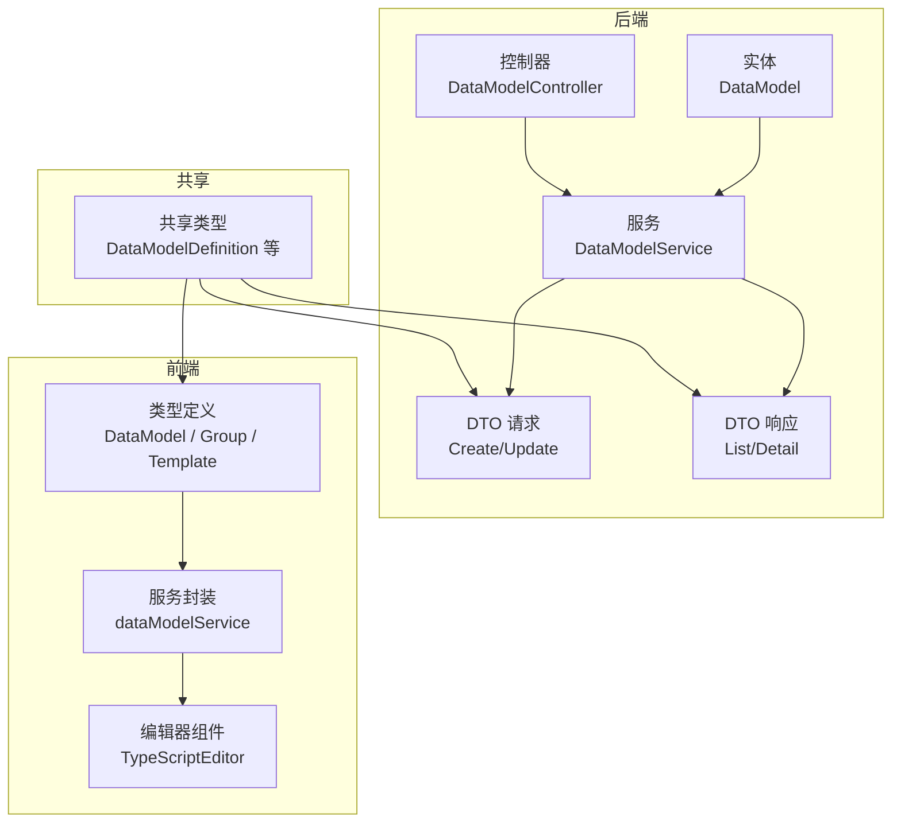
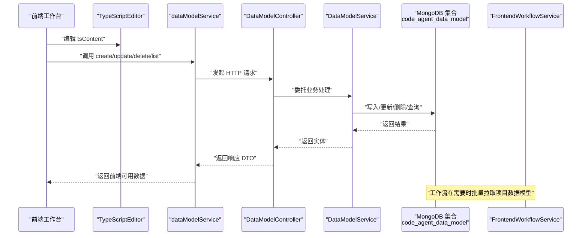
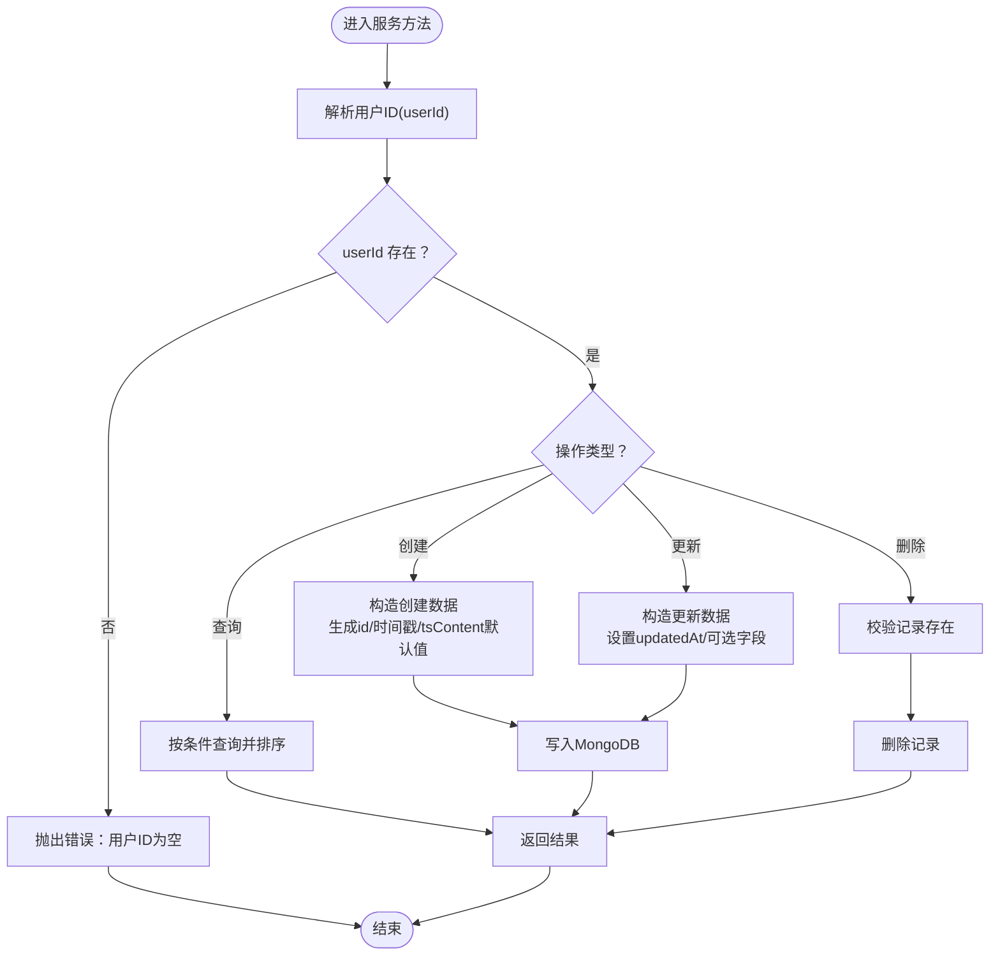
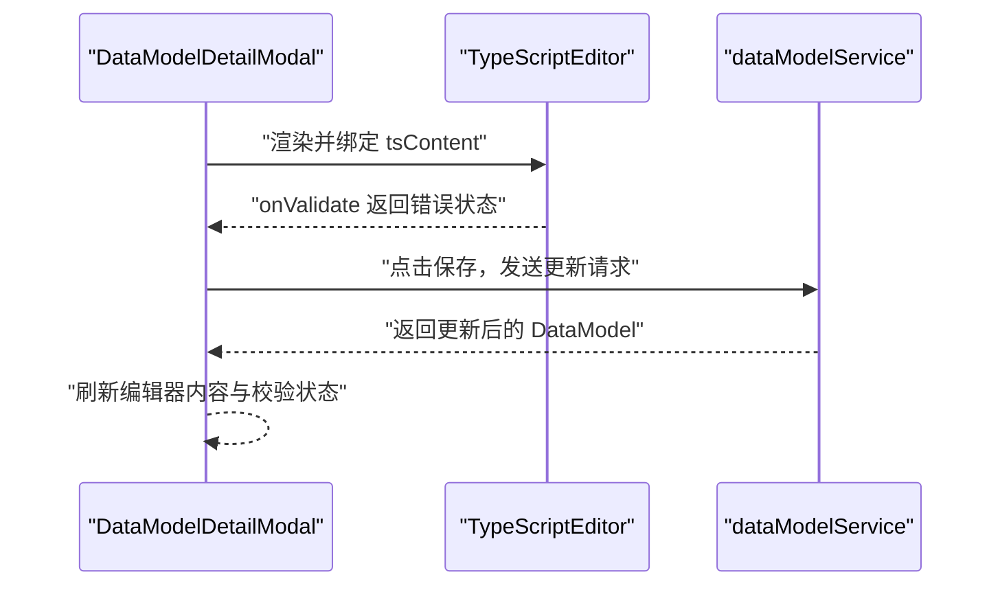
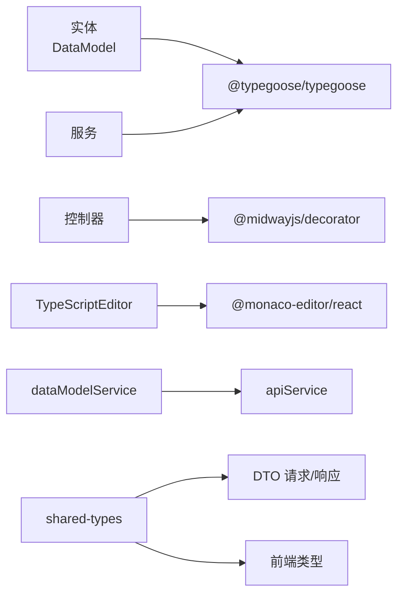

# 数据模型

<cite>
**本文引用的文件**
- [data-model.ts](file://code-agent-backend/src/entity/code-agent/data-model.ts)
- [data-model-group.ts](file://code-agent-backend/src/entity/code-agent/data-model-group.ts)
- [data-model.ts](file://shared-types/src/dataModel.ts)
- [data-model.ts](file://fta-layout-design/src/types/dataModel.ts)
- [data-model.ts](file://code-agent-backend/src/controller/code-agent/data-model.ts)
- [data-model.ts](file://code-agent-backend/src/service/code-agent/data-model.ts)
- [req.ts](file://code-agent-backend/src/dto/code-agent/req.ts)
- [res.ts](file://code-agent-backend/src/dto/code-agent/res.ts)
- [TypeScriptEditor.tsx](file://fta-layout-design/src/components/TypeScriptEditor.tsx)
- [dataModelService.ts](file://fta-layout-design/src/services/dataModelService.ts)
- [frontend-workflow.ts](file://code-agent-backend/src/service/code-agent/frontend-workflow.ts)
</cite>

## 目录
1. [简介](#简介)
2. [项目结构](#项目结构)
3. [核心组件](#核心组件)
4. [架构总览](#架构总览)
5. [详细组件分析](#详细组件分析)
6. [依赖分析](#依赖分析)
7. [性能考虑](#性能考虑)
8. [故障排查指南](#故障排查指南)
9. [结论](#结论)
10. [附录](#附录)

## 简介
本文件围绕 DataModel 实体展开，系统性梳理其字段定义、数据类型、业务规则与持久化策略，并阐明与 DataModelGroup 的关联关系。重点解释 tsContent 字段存储 TypeScript 接口定义的设计意图，以及在前端工作台中通过 Monaco 编辑器进行编辑的使用场景。同时提供面向初学者的实体关系图与面向开发者的创建/更新/查询示例路径，帮助快速上手与深入理解。

## 项目结构
DataModel 相关代码横跨后端实体与服务层、前端类型与服务层、以及共享类型定义，形成“后端实体/服务 + 前端类型/服务 + 共享类型”的协作模式：
- 后端实体与服务：定义 DataModel 实体、MongoDB 集合与时间戳管理、业务逻辑（创建/更新/删除/查询）。
- 前端类型与服务：定义 DataModel 类型、默认 TS 模板、封装 API 调用。
- 共享类型：在前后端之间传递一致的类型契约。

图表来源
- [data-model.ts](file://code-agent-backend/src/entity/code-agent/data-model.ts#L1-L55)
- [data-model.ts](file://code-agent-backend/src/service/code-agent/data-model.ts#L1-L219)
- [data-model.ts](file://code-agent-backend/src/controller/code-agent/data-model.ts#L1-L125)
- [req.ts](file://code-agent-backend/src/dto/code-agent/req.ts#L460-L489)
- [res.ts](file://code-agent-backend/src/dto/code-agent/res.ts#L296-L338)
- [data-model.ts](file://shared-types/src/dataModel.ts#L1-L54)
- [data-model.ts](file://fta-layout-design/src/types/dataModel.ts#L1-L89)
- [TypeScriptEditor.tsx](file://fta-layout-design/src/components/TypeScriptEditor.tsx#L1-L154)
- [dataModelService.ts](file://fta-layout-design/src/services/dataModelService.ts#L1-L132)

章节来源
- [data-model.ts](file://code-agent-backend/src/entity/code-agent/data-model.ts#L1-L55)
- [data-model.ts](file://code-agent-backend/src/service/code-agent/data-model.ts#L1-L219)
- [data-model.ts](file://code-agent-backend/src/controller/code-agent/data-model.ts#L1-L125)
- [req.ts](file://code-agent-backend/src/dto/code-agent/req.ts#L460-L489)
- [res.ts](file://code-agent-backend/src/dto/code-agent/res.ts#L296-L338)
- [data-model.ts](file://shared-types/src/dataModel.ts#L1-L54)
- [data-model.ts](file://fta-layout-design/src/types/dataModel.ts#L1-L89)
- [TypeScriptEditor.tsx](file://fta-layout-design/src/components/TypeScriptEditor.tsx#L1-L154)
- [dataModelService.ts](file://fta-layout-design/src/services/dataModelService.ts#L1-L132)

## 核心组件
- DataModel 实体：定义字段、数据类型与业务规则，持久化至 MongoDB 集合 code_agent_data_model，启用自动时间戳。
- DataModelGroup 实体：项目级分组，支持按组聚合数据模型。
- 共享类型：统一后端 DTO 与前端类型，保证 tsContent 字段一致性。
- 前端类型与服务：提供 DataModel 类型、默认 TS 模板、封装 CRUD API。
- 控制器与服务：暴露 REST 接口，实现创建/更新/删除/查询逻辑，并强制基于用户上下文的权限控制。

章节来源
- [data-model.ts](file://code-agent-backend/src/entity/code-agent/data-model.ts#L1-L55)
- [data-model-group.ts](file://code-agent-backend/src/entity/code-agent/data-model-group.ts#L1-L48)
- [data-model.ts](file://shared-types/src/dataModel.ts#L1-L54)
- [data-model.ts](file://fta-layout-design/src/types/dataModel.ts#L1-L89)
- [data-model.ts](file://code-agent-backend/src/controller/code-agent/data-model.ts#L1-L125)
- [data-model.ts](file://code-agent-backend/src/service/code-agent/data-model.ts#L1-L219)
- [dataModelService.ts](file://fta-layout-design/src/services/dataModelService.ts#L1-L132)

## 架构总览
下图展示 DataModel 在系统中的角色与交互：前端通过 TypeScriptEditor 编辑 tsContent，调用 dataModelService 发起请求；后端控制器接收请求，服务层校验用户上下文并访问 MongoDB；工作流服务在需要时拉取项目下的数据模型与 REST API。

图表来源
- [TypeScriptEditor.tsx](file://fta-layout-design/src/components/TypeScriptEditor.tsx#L1-L154)
- [dataModelService.ts](file://fta-layout-design/src/services/dataModelService.ts#L1-L132)
- [data-model.ts](file://code-agent-backend/src/controller/code-agent/data-model.ts#L1-L125)
- [data-model.ts](file://code-agent-backend/src/service/code-agent/data-model.ts#L1-L219)
- [frontend-workflow.ts](file://code-agent-backend/src/service/code-agent/frontend-workflow.ts#L120-L160)

## 详细组件分析

### DataModel 实体与字段定义
- 集合与时间戳
  - 集合名：code_agent_data_model
  - 自动时间戳：createdAt、updatedAt
- 字段与类型
  - id: string（必填）
  - projectId: string（必填）
  - groupId?: string（可选，未分组时为空）
  - name: string（必填）
  - description?: string（可选）
  - tsContent: string（默认空串）
  - userId: string（必填）
- 业务规则
  - 通过 userId 强制隔离用户可见范围
  - groupId 支持置空以移出分组
  - tsContent 作为单一事实来源，承载 TypeScript 接口定义

章节来源
- [data-model.ts](file://code-agent-backend/src/entity/code-agent/data-model.ts#L1-L55)

### DataModelGroup 实体与关联关系
- 字段与类型
  - id: string（必填）
  - projectId: string（必填）
  - name: string（必填）
  - description?: string（可选）
  - createdAt: Date（必填）
  - updatedAt: Date（必填）
  - userId: string（必填）
- 关联关系
  - DataModel 通过 groupId 关联到 DataModelGroup
  - 一个分组可包含多个数据模型

章节来源
- [data-model-group.ts](file://code-agent-backend/src/entity/code-agent/data-model-group.ts#L1-L48)

### 共享类型与前端类型
- 共享类型（共享包）
  - DataModelDefinition：id、projectId、groupId?、name、description?、tsContent、createdAt、updatedAt、userId
  - CreateDataModelRequest：projectId、groupId?、name、description?、tsContent?
  - UpdateDataModelRequest：groupId?（支持 null）、name?、description?、tsContent?
- 前端类型
  - DataModel：与共享类型保持一致，字段与类型一致
  - DEFAULT_TS_TEMPLATE：默认 TS 接口模板，便于初始化

章节来源
- [data-model.ts](file://shared-types/src/dataModel.ts#L1-L54)
- [data-model.ts](file://fta-layout-design/src/types/dataModel.ts#L1-L89)

### 控制器与服务：创建/更新/查询流程
- 控制器
  - POST /code-agent/data-model：创建
  - PUT /code-agent/data-model/:id：更新
  - DEL /code-agent/data-model/:id：删除
  - GET /code-agent/data-model/project/:projectId：按项目查询
  - GET /code-agent/data-model/group/:groupId：按分组查询
  - GET /code-agent/data-model/project/:projectId/ungrouped：查询未分组
  - GET /code-agent/data-model/:id：按 id 查询
- 服务层关键点
  - 强制从请求上下文中解析 userId，所有查询/更新/删除均以 userId 作为过滤条件
  - create：生成唯一 id，填充 createdAt/updatedAt，tsContent 默认空串
  - update：仅更新指定字段，支持将 groupId 设为 null 移出分组
  - 查询：按 projectId、groupId、或未分组条件过滤，按创建时间倒序返回

图表来源
- [data-model.ts](file://code-agent-backend/src/service/code-agent/data-model.ts#L1-L219)

章节来源
- [data-model.ts](file://code-agent-backend/src/controller/code-agent/data-model.ts#L1-L125)
- [data-model.ts](file://code-agent-backend/src/service/code-agent/data-model.ts#L1-L219)

### 前端工作台：Monaco 编辑器与 tsContent
- TypeScriptEditor 组件
  - 基于 Monaco Editor，提供 TypeScript 语法高亮与基础校验
  - 支持只读、占位符、忽略特定诊断码等配置
  - 暴露 hasErrors/getErrors 供父组件判断保存状态
- 使用场景
  - 在 DataModelDetailModal 中编辑 tsContent
  - 保存前通过编辑器校验错误状态，避免提交无效 TS

图表来源
- [TypeScriptEditor.tsx](file://fta-layout-design/src/components/TypeScriptEditor.tsx#L1-L154)
- [dataModelService.ts](file://fta-layout-design/src/services/dataModelService.ts#L1-L132)

章节来源
- [TypeScriptEditor.tsx](file://fta-layout-design/src/components/TypeScriptEditor.tsx#L1-L154)
- [dataModelService.ts](file://fta-layout-design/src/services/dataModelService.ts#L1-L132)

### 工作流集成：tsContent 的消费
- FrontendWorkflowService 在生成前端项目工作流时，会拉取项目下的数据模型与 REST API，并格式化为工作流可用的上下文
- 由于 DataModel 的 tsContent 为字符串，工作流侧可直接注入 tsContent 内容，无需解析 schema

章节来源
- [frontend-workflow.ts](file://code-agent-backend/src/service/code-agent/frontend-workflow.ts#L120-L160)

## 依赖分析
- 后端
  - 实体依赖 Typegoose 注解与 @midwayjs/typegoose
  - 控制器依赖 Midway 装饰器与 DTO
  - 服务层依赖 InjectEntityModel 访问 MongoDB
- 前端
  - TypeScriptEditor 依赖 @monaco-editor/react
  - dataModelService 依赖 apiService 封装的 HTTP 调用
- 共享
  - shared-types 提供跨端一致的类型契约

图表来源
- [data-model.ts](file://code-agent-backend/src/entity/code-agent/data-model.ts#L1-L55)
- [data-model.ts](file://code-agent-backend/src/controller/code-agent/data-model.ts#L1-L125)
- [data-model.ts](file://code-agent-backend/src/service/code-agent/data-model.ts#L1-L219)
- [TypeScriptEditor.tsx](file://fta-layout-design/src/components/TypeScriptEditor.tsx#L1-L154)
- [dataModelService.ts](file://fta-layout-design/src/services/dataModelService.ts#L1-L132)
- [data-model.ts](file://shared-types/src/dataModel.ts#L1-L54)

章节来源
- [data-model.ts](file://code-agent-backend/src/entity/code-agent/data-model.ts#L1-L55)
- [data-model.ts](file://code-agent-backend/src/controller/code-agent/data-model.ts#L1-L125)
- [data-model.ts](file://code-agent-backend/src/service/code-agent/data-model.ts#L1-L219)
- [TypeScriptEditor.tsx](file://fta-layout-design/src/components/TypeScriptEditor.tsx#L1-L154)
- [dataModelService.ts](file://fta-layout-design/src/services/dataModelService.ts#L1-L132)
- [data-model.ts](file://shared-types/src/dataModel.ts#L1-L54)

## 性能考虑
- 查询优化
  - 按 projectId、groupId、userId 等字段建立索引可显著提升查询性能
  - 使用 lean 查询减少文档转换开销
- 写入优化
  - 批量更新时尽量合并字段，避免多次往返
- 前端体验
  - Monaco 编辑器开启必要的最小化配置，避免不必要的语言服务开销
  - 仅在保存时触发严格校验，平时使用轻量校验提升交互流畅度

## 故障排查指南
- 常见错误与定位
  - 用户上下文缺失：服务层解析 userId 失败会抛错，检查中间件或请求头
  - 数据模型不存在：更新/删除时若找不到记录会抛错，确认 id 与 userId 组合
  - 参数校验失败：控制器/服务层对必填字段进行校验，检查 DTO 与 tsContent 内容
- 前端校验
  - 使用 TypeScriptEditor 的 hasErrors/getErrors 判断保存状态
  - 若编辑器出现大量诊断错误，优先修复 TS 语法与类型问题

章节来源
- [data-model.ts](file://code-agent-backend/src/service/code-agent/data-model.ts#L1-L219)
- [TypeScriptEditor.tsx](file://fta-layout-design/src/components/TypeScriptEditor.tsx#L1-L154)

## 结论
DataModel 通过 tsContent 将 TypeScript 接口定义作为单一事实来源，配合 MongoDB 的集合与自动时间戳，实现了清晰、可维护、可扩展的数据模型管理。前端使用 Monaco 编辑器提供良好的 TS 编辑体验，后端通过严格的用户隔离与查询优化保障了系统的安全与性能。结合工作流服务，tsContent 可直接注入到生成流程中，降低 LLM 消费成本并提升语义质量。

## 附录

### 字段定义与业务规则速查
- 字段
  - id: string（必填）
  - projectId: string（必填）
  - groupId?: string（可选）
  - name: string（必填）
  - description?: string（可选）
  - tsContent: string（默认空串）
  - createdAt: Date（自动）
  - updatedAt: Date（自动）
  - userId: string（必填）
- 规则
  - 所有 CRUD 操作均以 userId 作为过滤条件
  - 更新支持将 groupId 设为 null 移出分组
  - tsContent 为字符串，前端负责 TS 语法校验

章节来源
- [data-model.ts](file://code-agent-backend/src/entity/code-agent/data-model.ts#L1-L55)
- [data-model.ts](file://code-agent-backend/src/service/code-agent/data-model.ts#L1-L219)

### 创建/更新/查询示例（代码片段路径）
- 创建数据模型
  - 控制器入口：[POST /code-agent/data-model](file://code-agent-backend/src/controller/code-agent/data-model.ts#L24-L33)
  - 服务实现：[create](file://code-agent-backend/src/service/code-agent/data-model.ts#L59-L86)
  - 请求 DTO：[CreateNewDataModelRequest](file://code-agent-backend/src/dto/code-agent/req.ts#L460-L475)
  - 响应 DTO：[CreateNewDataModelResponse](file://code-agent-backend/src/dto/code-agent/res.ts#L321-L331)
- 更新数据模型
  - 控制器入口：[PUT /code-agent/data-model/:id](file://code-agent-backend/src/controller/code-agent/data-model.ts#L38-L47)
  - 服务实现：[update](file://code-agent-backend/src/service/code-agent/data-model.ts#L91-L118)
  - 请求 DTO：[UpdateNewDataModelRequest](file://code-agent-backend/src/dto/code-agent/req.ts#L477-L489)
  - 响应 DTO：[UpdateNewDataModelResponse](file://code-agent-backend/src/dto/code-agent/res.ts#L327-L331)
- 删除数据模型
  - 控制器入口：[DEL /code-agent/data-model/:id](file://code-agent-backend/src/controller/code-agent/data-model.ts#L52-L61)
  - 服务实现：[delete](file://code-agent-backend/src/service/code-agent/data-model.ts#L123-L136)
  - 响应 DTO：[DeleteNewDataModelResponse](file://code-agent-backend/src/dto/code-agent/res.ts#L333-L337)
- 查询数据模型
  - 按项目：[GET /code-agent/data-model/project/:projectId](file://code-agent-backend/src/controller/code-agent/data-model.ts#L66-L75)
  - 按分组：[GET /code-agent/data-model/group/:groupId](file://code-agent-backend/src/controller/code-agent/data-model.ts#L80-L89)
  - 未分组：[GET /code-agent/data-model/project/:projectId/ungrouped](file://code-agent-backend/src/controller/code-agent/data-model.ts#L94-L103)
  - 按 id：[GET /code-agent/data-model/:id](file://code-agent-backend/src/controller/code-agent/data-model.ts#L108-L123)
  - 服务实现：[getByProjectId/getByGroupId/getUngrouped/getById](file://code-agent-backend/src/service/code-agent/data-model.ts#L141-L218)
  - 响应 DTO：[NewDataModelListResponse/NewDataModelDetailResponse](file://code-agent-backend/src/dto/code-agent/res.ts#L309-L319)

### 前端使用场景
- Monaco 编辑器
  - 组件：[TypeScriptEditor](file://fta-layout-design/src/components/TypeScriptEditor.tsx#L1-L154)
  - 默认模板：[DEFAULT_TS_TEMPLATE](file://fta-layout-design/src/types/dataModel.ts#L77-L89)
- 服务封装
  - [dataModelService](file://fta-layout-design/src/services/dataModelService.ts#L1-L132)

章节来源
- [TypeScriptEditor.tsx](file://fta-layout-design/src/components/TypeScriptEditor.tsx#L1-L154)
- [data-model.ts](file://fta-layout-design/src/types/dataModel.ts#L77-L89)
- [dataModelService.ts](file://fta-layout-design/src/services/dataModelService.ts#L1-L132)