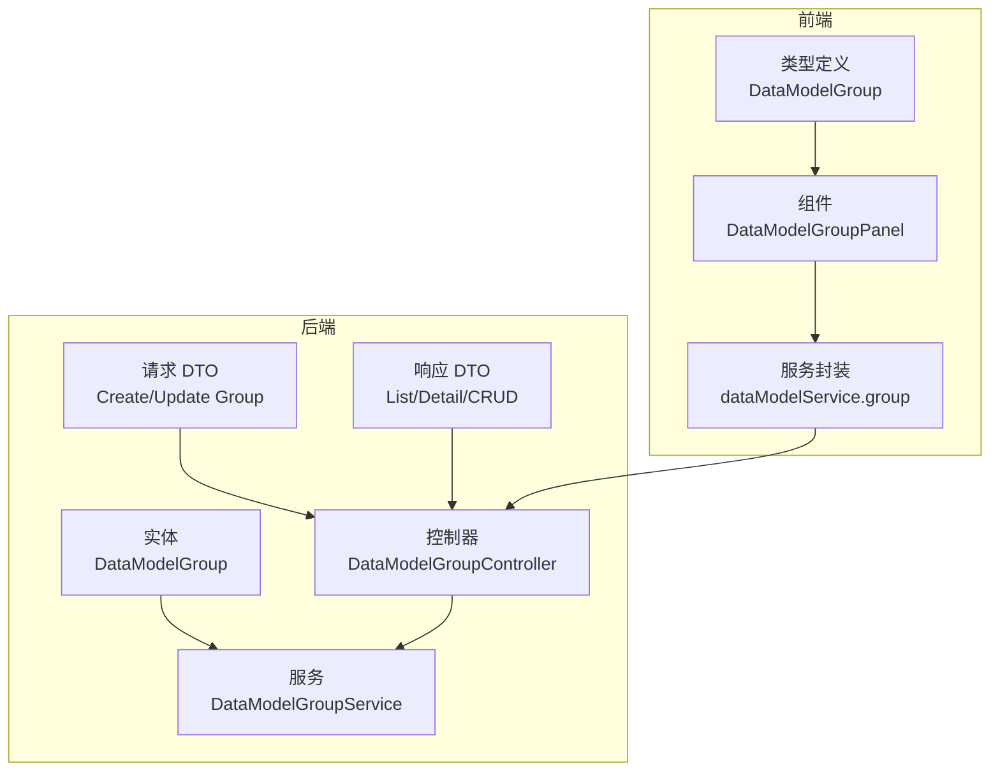
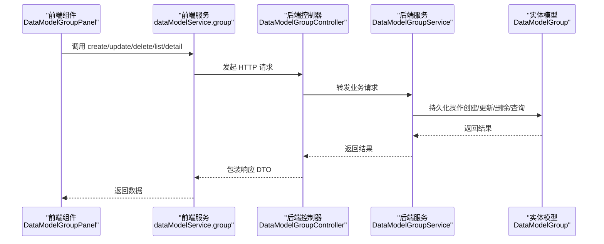
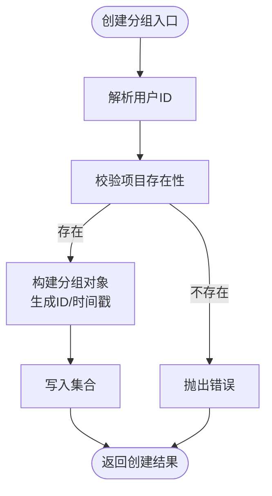
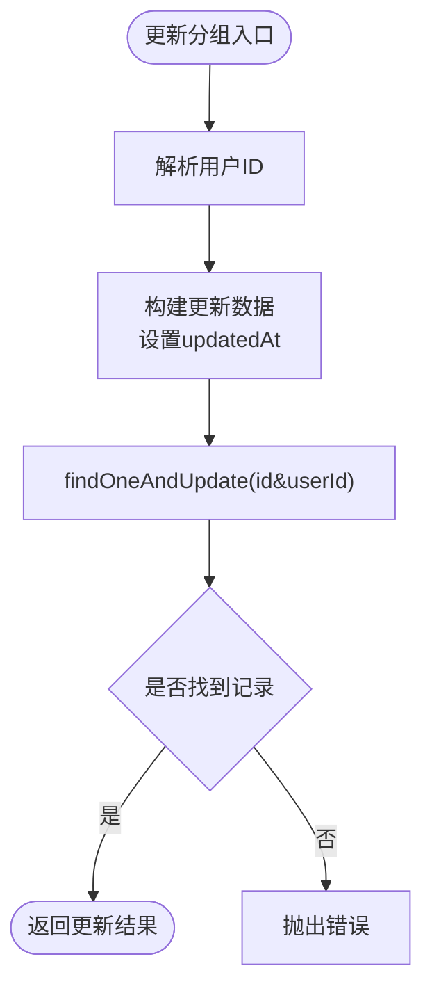
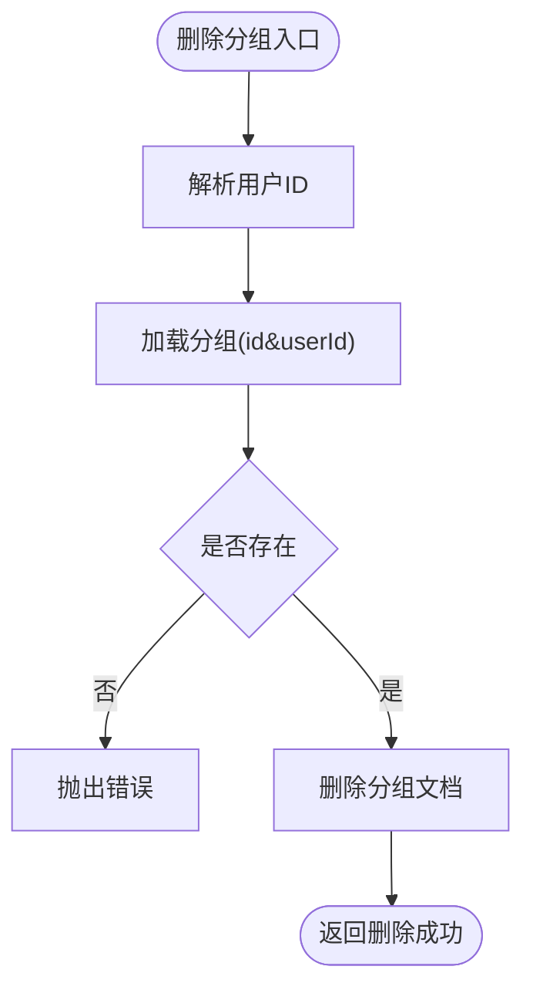
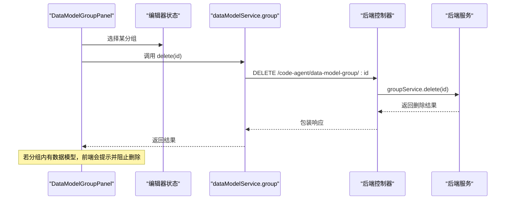

# 数据模型分组

<cite>
**本文引用的文件**
- [data-model-group.ts](file://code-agent-backend/src/entity/code-agent/data-model-group.ts)
- [data-model-group.ts](file://code-agent-backend/src/controller/code-agent/data-model-group.ts)
- [data-model-group.ts](file://code-agent-backend/src/service/code-agent/data-model-group.ts)
- [req.ts](file://code-agent-backend/src/dto/code-agent/req.ts)
- [res.ts](file://code-agent-backend/src/dto/code-agent/res.ts)
- [data-model.ts](file://code-agent-backend/src/entity/code-agent/data-model.ts)
- [index.tsx](file://fta-layout-design/src/pages/EditorPage/components/DataModelGroupPanel/index.tsx)
- [index.css](file://fta-layout-design/src/pages/EditorPage/components/DataModelGroupPanel/index.css)
- [dataModelService.ts](file://fta-layout-design/src/services/dataModelService.ts)
- [dataModel.ts](file://fta-layout-design/src/types/dataModel.ts)
</cite>

## 目录
1. [简介](#简介)
2. [项目结构](#项目结构)
3. [核心组件](#核心组件)
4. [架构总览](#架构总览)
5. [详细组件分析](#详细组件分析)
6. [依赖分析](#依赖分析)
7. [性能考虑](#性能考虑)
8. [故障排查指南](#故障排查指南)
9. [结论](#结论)
10. [附录](#附录)

## 简介
本文件围绕 DataModelGroup 实体及其在系统中的职责展开，重点说明：
- 字段定义、数据类型与业务规则
- 在 MongoDB 中的持久化集合与时间戳管理
- 作为 DataModel 容器的层级关系与项目组织作用
- 后端 API 的创建、更新、删除流程与约束
- 前端 DataModelGroupPanel 的交互逻辑与删除前的业务约束提示

## 项目结构
DataModelGroup 位于后端代码 Agent 子系统中，采用 TypeORM/Mongoose 风格的 Typegoose 注解进行实体定义；前端工作台通过服务封装调用后端 API，实现分组的增删改查与列表展示。



图表来源
- [data-model-group.ts](file://code-agent-backend/src/entity/code-agent/data-model-group.ts#L1-L48)
- [data-model-group.ts](file://code-agent-backend/src/controller/code-agent/data-model-group.ts#L1-L104)
- [data-model-group.ts](file://code-agent-backend/src/service/code-agent/data-model-group.ts#L1-L156)
- [req.ts](file://code-agent-backend/src/dto/code-agent/req.ts#L439-L457)
- [res.ts](file://code-agent-backend/src/dto/code-agent/res.ts#L255-L294)
- [index.tsx](file://fta-layout-design/src/pages/EditorPage/components/DataModelGroupPanel/index.tsx#L1-L313)
- [dataModel.ts](file://fta-layout-design/src/types/dataModel.ts#L16-L35)
- [dataModelService.ts](file://fta-layout-design/src/services/dataModelService.ts#L19-L61)

章节来源
- [data-model-group.ts](file://code-agent-backend/src/entity/code-agent/data-model-group.ts#L1-L48)
- [data-model-group.ts](file://code-agent-backend/src/controller/code-agent/data-model-group.ts#L1-L104)
- [data-model-group.ts](file://code-agent-backend/src/service/code-agent/data-model-group.ts#L1-L156)
- [req.ts](file://code-agent-backend/src/dto/code-agent/req.ts#L439-L457)
- [res.ts](file://code-agent-backend/src/dto/code-agent/res.ts#L255-L294)
- [index.tsx](file://fta-layout-design/src/pages/EditorPage/components/DataModelGroupPanel/index.tsx#L1-L313)
- [dataModel.ts](file://fta-layout-design/src/types/dataModel.ts#L16-L35)
- [dataModelService.ts](file://fta-layout-design/src/services/dataModelService.ts#L19-L61)

## 核心组件
- 实体层：DataModelGroup 定义了分组的字段、集合名与时间戳策略
- 控制器层：提供创建、更新、删除、按项目查询、按 ID 查询等接口
- 服务层：负责鉴权、生成 ID、校验项目存在性、执行 CRUD 操作
- DTO 层：定义请求与响应的数据契约
- 前端组件：DataModelGroupPanel 提供分组的创建、编辑、删除与选择交互

章节来源
- [data-model-group.ts](file://code-agent-backend/src/entity/code-agent/data-model-group.ts#L1-L48)
- [data-model-group.ts](file://code-agent-backend/src/controller/code-agent/data-model-group.ts#L1-L104)
- [data-model-group.ts](file://code-agent-backend/src/service/code-agent/data-model-group.ts#L1-L156)
- [req.ts](file://code-agent-backend/src/dto/code-agent/req.ts#L439-L457)
- [res.ts](file://code-agent-backend/src/dto/code-agent/res.ts#L255-L294)
- [index.tsx](file://fta-layout-design/src/pages/EditorPage/components/DataModelGroupPanel/index.tsx#L1-L313)

## 架构总览
后端以控制器为入口，服务层处理业务逻辑，实体层映射到 MongoDB 集合；前端通过 dataModelService.group 调用后端接口，DataModelGroupPanel 负责 UI 交互与删除前的业务约束提示。



图表来源
- [dataModelService.ts](file://fta-layout-design/src/services/dataModelService.ts#L19-L61)
- [data-model-group.ts](file://code-agent-backend/src/controller/code-agent/data-model-group.ts#L1-L104)
- [data-model-group.ts](file://code-agent-backend/src/service/code-agent/data-model-group.ts#L1-L156)
- [data-model-group.ts](file://code-agent-backend/src/entity/code-agent/data-model-group.ts#L1-L48)

## 详细组件分析

### 实体定义与持久化
- 集合名称：code_agent_data_model_group
- 时间戳：自动维护 createdAt/updatedAt
- 关键字段：
  - id: string，唯一标识
  - projectId: string，所属项目
  - name: string，分组名称
  - description?: string，描述
  - userId: string，创建者
  - createdAt/updatedAt: Date，自动时间戳

业务规则要点
- 必填字段：id、projectId、name、createdAt、updatedAt、userId
- 与项目的关系：按 projectId 进行范围查询与筛选
- 与数据模型的关系：DataModel 的 groupId 可为空，表示未分组；非空则指向某个 DataModelGroup

章节来源
- [data-model-group.ts](file://code-agent-backend/src/entity/code-agent/data-model-group.ts#L1-L48)
- [data-model.ts](file://code-agent-backend/src/entity/code-agent/data-model.ts#L1-L55)

### 后端 API 与业务流程

#### 创建分组
- 请求 DTO：CreateDataModelGroupRequest（projectId, name, description?）
- 服务层逻辑：
  - 解析用户上下文 userId
  - 校验项目存在性（id 与 userId 匹配）
  - 生成唯一 id（带前缀）
  - 写入 createdAt/updatedAt
  - 保存至集合



图表来源
- [data-model-group.ts](file://code-agent-backend/src/service/code-agent/data-model-group.ts#L55-L80)
- [req.ts](file://code-agent-backend/src/dto/code-agent/req.ts#L439-L449)

章节来源
- [data-model-group.ts](file://code-agent-backend/src/controller/code-agent/data-model-group.ts#L27-L36)
- [data-model-group.ts](file://code-agent-backend/src/service/code-agent/data-model-group.ts#L55-L80)
- [res.ts](file://code-agent-backend/src/dto/code-agent/res.ts#L278-L288)

#### 更新分组
- 请求 DTO：UpdateDataModelGroupRequest（name?, description?）
- 服务层逻辑：
  - 解析用户上下文 userId
  - 设置 updatedAt
  - 条件更新（id 与 userId 匹配）
  - 若未找到则抛错



图表来源
- [data-model-group.ts](file://code-agent-backend/src/service/code-agent/data-model-group.ts#L82-L109)
- [req.ts](file://code-agent-backend/src/dto/code-agent/req.ts#L451-L457)

章节来源
- [data-model-group.ts](file://code-agent-backend/src/controller/code-agent/data-model-group.ts#L41-L53)
- [data-model-group.ts](file://code-agent-backend/src/service/code-agent/data-model-group.ts#L82-L109)
- [res.ts](file://code-agent-backend/src/dto/code-agent/res.ts#L284-L288)

#### 删除分组
- 服务层逻辑：
  - 解析用户上下文 userId
  - 校验分组存在性（id 与 userId 匹配）
  - 删除对应文档
  - 返回成功



图表来源
- [data-model-group.ts](file://code-agent-backend/src/service/code-agent/data-model-group.ts#L111-L127)

章节来源
- [data-model-group.ts](file://code-agent-backend/src/controller/code-agent/data-model-group.ts#L55-L67)
- [data-model-group.ts](file://code-agent-backend/src/service/code-agent/data-model-group.ts#L111-L127)
- [res.ts](file://code-agent-backend/src/dto/code-agent/res.ts#L290-L294)

#### 查询分组
- 按项目查询：按 projectId 与 userId 查询，按创建时间倒序
- 按 ID 查询：返回单条记录

章节来源
- [data-model-group.ts](file://code-agent-backend/src/controller/code-agent/data-model-group.ts#L72-L101)
- [data-model-group.ts](file://code-agent-backend/src/service/code-agent/data-model-group.ts#L130-L155)
- [res.ts](file://code-agent-backend/src/dto/code-agent/res.ts#L266-L275)

### 前端交互与业务约束
- DataModelGroupPanel 提供：
  - 新建分组：调用 dataModelService.group.create
  - 编辑分组：调用 dataModelService.group.update
  - 删除分组：调用 dataModelService.group.delete
  - 选择分组：切换 selectedGroupId，联动数据模型列表筛选
- 删除前的业务约束：
  - 当分组下仍有数据模型时，弹窗提示“该分组下还有 N 个数据模型，请先移除或移动这些数据模型”，阻止直接删除



图表来源
- [index.tsx](file://fta-layout-design/src/pages/EditorPage/components/DataModelGroupPanel/index.tsx#L100-L121)
- [dataModelService.ts](file://fta-layout-design/src/services/dataModelService.ts#L36-L41)
- [data-model-group.ts](file://code-agent-backend/src/controller/code-agent/data-model-group.ts#L55-L67)
- [data-model-group.ts](file://code-agent-backend/src/service/code-agent/data-model-group.ts#L111-L127)

章节来源
- [index.tsx](file://fta-layout-design/src/pages/EditorPage/components/DataModelGroupPanel/index.tsx#L1-L313)
- [dataModelService.ts](file://fta-layout-design/src/services/dataModelService.ts#L19-L61)
- [dataModel.ts](file://fta-layout-design/src/types/dataModel.ts#L16-L35)

## 依赖分析
- 后端依赖关系
  - 控制器依赖服务层
  - 服务层依赖实体模型与项目实体（用于校验项目存在性）
  - DTO 定义请求与响应契约
- 前端依赖关系
  - 组件依赖类型定义与服务封装
  - 服务封装依赖后端 API

```mermaid
graph LR
DTO_REQ["请求 DTO"] --> CTRL["控制器"]
DTO_RES["响应 DTO"] <- --> CTRL
CTRL --> SRV["服务层"]
SRV --> ENTITY["实体模型"]
FE_COMP["DataModelGroupPanel"] --> FE_SVC["dataModelService.group"]
FE_SVC --> CTRL
```

图表来源
- [req.ts](file://code-agent-backend/src/dto/code-agent/req.ts#L439-L457)
- [res.ts](file://code-agent-backend/src/dto/code-agent/res.ts#L255-L294)
- [data-model-group.ts](file://code-agent-backend/src/controller/code-agent/data-model-group.ts#L1-L104)
- [data-model-group.ts](file://code-agent-backend/src/service/code-agent/data-model-group.ts#L1-L156)
- [index.tsx](file://fta-layout-design/src/pages/EditorPage/components/DataModelGroupPanel/index.tsx#L1-L313)
- [dataModelService.ts](file://fta-layout-design/src/services/dataModelService.ts#L19-L61)

章节来源
- [req.ts](file://code-agent-backend/src/dto/code-agent/req.ts#L439-L457)
- [res.ts](file://code-agent-backend/src/dto/code-agent/res.ts#L255-L294)
- [data-model-group.ts](file://code-agent-backend/src/controller/code-agent/data-model-group.ts#L1-L104)
- [data-model-group.ts](file://code-agent-backend/src/service/code-agent/data-model-group.ts#L1-L156)
- [index.tsx](file://fta-layout-design/src/pages/EditorPage/components/DataModelGroupPanel/index.tsx#L1-L313)
- [dataModelService.ts](file://fta-layout-design/src/services/dataModelService.ts#L19-L61)

## 性能考虑
- 查询排序：按创建时间倒序，有利于最近优先展示
- 条件查询：按 projectId 与 userId 组合查询，避免跨项目数据泄露
- 前端渲染：列表项按需渲染，删除前进行本地计数，减少不必要的网络请求

[本节为通用建议，无需特定文件来源]

## 故障排查指南
- 创建/更新/删除失败
  - 检查用户上下文是否正确注入（服务层解析 userId）
  - 确认项目存在且属于当前用户
  - 查看控制器状态码与错误信息
- 查询不到分组
  - 确认 projectId 与 userId 是否匹配
  - 检查前端 store 中 selectedGroupId 是否正确
- 删除被阻止
  - 前端会在分组内存在数据模型时提示，需先移除或移动模型后再删除

章节来源
- [data-model-group.ts](file://code-agent-backend/src/service/code-agent/data-model-group.ts#L36-L50)
- [data-model-group.ts](file://code-agent-backend/src/service/code-agent/data-model-group.ts#L61-L66)
- [data-model-group.ts](file://code-agent-backend/src/controller/code-agent/data-model-group.ts#L27-L36)
- [index.tsx](file://fta-layout-design/src/pages/EditorPage/components/DataModelGroupPanel/index.tsx#L100-L121)

## 结论
DataModelGroup 作为项目级的数据模型分组容器，通过严格的用户与项目维度校验、自动时间戳与集合命名规范，保障了数据一致性与安全性。前后端协作清晰，前端在删除前进行业务约束提示，有效避免误操作。后续可在服务层增加更细粒度的权限控制与审计日志，进一步提升可观测性与合规性。

[本节为总结性内容，无需特定文件来源]

## 附录

### API 定义概览（后端）
- 创建分组
  - 方法：POST
  - 路径：/code-agent/data-model-group
  - 请求体：CreateDataModelGroupRequest（projectId, name, description?）
  - 响应体：CreateDataModelGroupResponse
- 更新分组
  - 方法：PUT
  - 路径：/code-agent/data-model-group/:id
  - 请求体：UpdateDataModelGroupRequest（name?, description?）
  - 响应体：UpdateDataModelGroupResponse
- 删除分组
  - 方法：DELETE
  - 路径：/code-agent/data-model-group/:id
  - 响应体：DeleteDataModelGroupResponse
- 按项目查询
  - 方法：GET
  - 路径：/code-agent/data-model-group/project/:projectId
  - 响应体：DataModelGroupListResponse
- 按 ID 查询
  - 方法：GET
  - 路径：/code-agent/data-model-group/:id
  - 响应体：DataModelGroupDetailResponse

章节来源
- [data-model-group.ts](file://code-agent-backend/src/controller/code-agent/data-model-group.ts#L27-L101)
- [req.ts](file://code-agent-backend/src/dto/code-agent/req.ts#L439-L457)
- [res.ts](file://code-agent-backend/src/dto/code-agent/res.ts#L266-L294)

### 前端调用示例（概念性）
- 创建分组
  - dataModelService.group.create({ projectId, name, description? })
- 更新分组
  - dataModelService.group.update(id, { name?, description? })
- 删除分组
  - dataModelService.group.delete(id)
- 获取分组列表
  - dataModelService.group.getByProjectId(projectId)
- 获取分组详情
  - dataModelService.group.getById(id)

章节来源
- [dataModelService.ts](file://fta-layout-design/src/services/dataModelService.ts#L19-L61)
- [index.tsx](file://fta-layout-design/src/pages/EditorPage/components/DataModelGroupPanel/index.tsx#L42-L67)
- [index.tsx](file://fta-layout-design/src/pages/EditorPage/components/DataModelGroupPanel/index.tsx#L78-L98)
- [index.tsx](file://fta-layout-design/src/pages/EditorPage/components/DataModelGroupPanel/index.tsx#L100-L121)