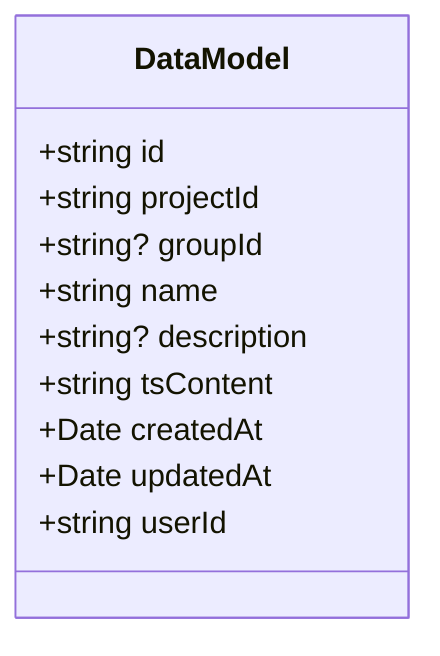
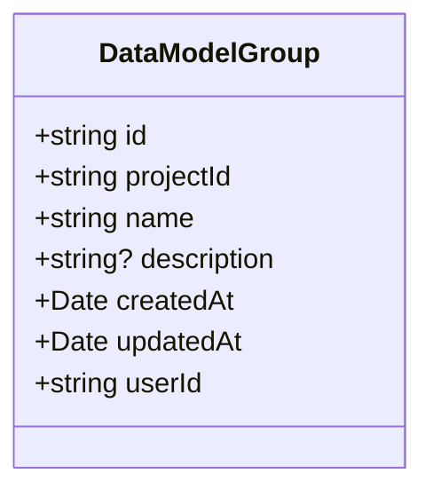
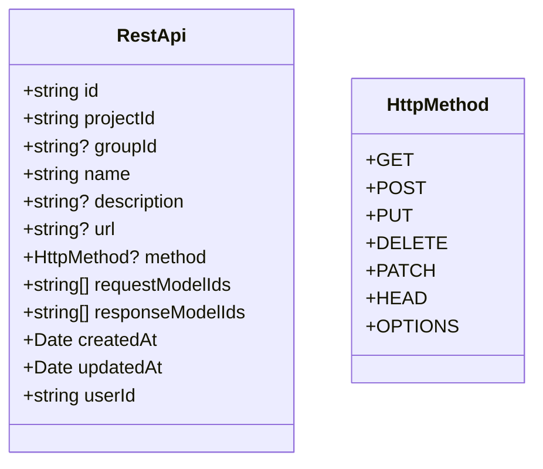
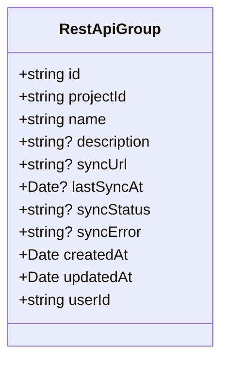
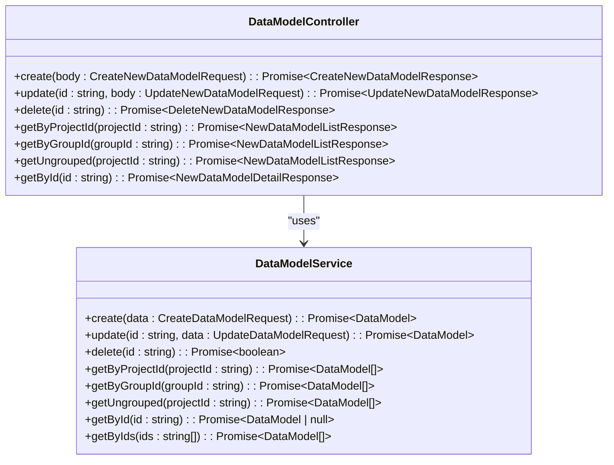
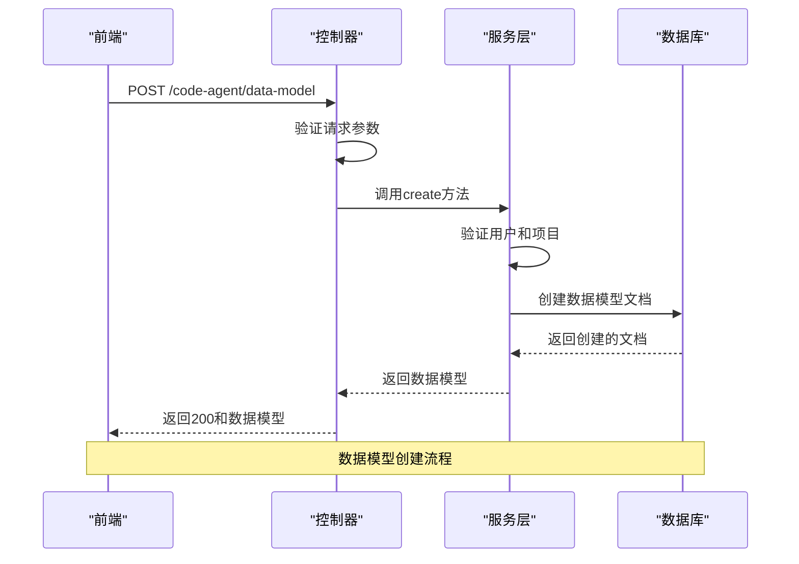

# 数据模型实体

<cite>
**本文档引用的文件**   
- [data-model.ts](file://code-agent-backend/src/entity/code-agent/data-model.ts)
- [data-model-group.ts](file://code-agent-backend/src/entity/code-agent/data-model-group.ts)
- [rest-api.ts](file://code-agent-backend/src/entity/code-agent/rest-api.ts)
- [rest-api-group.ts](file://code-agent-backend/src/entity/code-agent/rest-api-group.ts)
- [data-model.service.ts](file://code-agent-backend/src/service/code-agent/data-model.ts)
- [rest-api.service.ts](file://code-agent-backend/src/service/code-agent/rest-api.ts)
- [data-model.controller.ts](file://code-agent-backend/src/controller/code-agent/data-model.ts)
- [rest-api.controller.ts](file://code-agent-backend/src/controller/code-agent/rest-api.ts)
- [req.ts](file://code-agent-backend/src/dto/code-agent/req.ts)
- [res.ts](file://code-agent-backend/src/dto/code-agent/res.ts)
- [dataModel.ts](file://shared-types/src/dataModel.ts)
- [restApi.ts](file://shared-types/src/restApi.ts)
- [dataModelService.ts](file://fta-layout-design/src/services/dataModelService.ts)
</cite>

## 目录
1. [简介](#简介)
2. [核心实体概述](#核心实体概述)
3. [数据模型实体](#数据模型实体)
4. [数据模型组实体](#数据模型组实体)
5. [REST API 实体](#rest-api-实体)
6. [API 组实体](#api-组实体)
7. [实体关系与层级结构](#实体关系与层级结构)
8. [数据持久化与数据库设计](#数据持久化与数据库设计)
9. [实体在代码中的表示](#实体在代码中的表示)
10. [API 暴露方式](#api-暴露方式)
11. [数据访问与操作示例](#数据访问与操作示例)
12. [版本控制与变更审计](#版本控制与变更审计)
13. [数据迁移策略](#数据迁移策略)

## 简介
本文档全面阐述了项目中的核心数据模型实体，包括数据模型（DataModel）、数据模型组（DataModelGroup）、REST API（RestApi）和API组（RestApiGroup）。文档详细描述了每个实体的字段定义、数据类型、业务规则和数据库持久化方式。同时，解释了数据模型与数据模型组之间的层级关系，以及REST API与数据模型的映射逻辑。文档还阐述了这些实体在代码中的表示方式和在API中的暴露方式，为初学者提供了实体关系图（ERD），为开发者提供了数据访问和操作的代码示例，并说明了数据模型的版本控制、变更审计和迁移策略。

## 核心实体概述
系统围绕四个核心实体构建：数据模型（DataModel）、数据模型组（DataModelGroup）、REST API（RestApi）和API组（RestApiGroup）。这些实体共同构成了项目的数据定义和接口管理基础。数据模型用于定义应用中的数据结构，数据模型组用于对数据模型进行分类管理。REST API用于定义后端接口，API组则用于对API进行分组管理。所有实体都遵循项目级别的组织原则，即每个实体都必须关联到一个项目（Project），并支持用户级别的权限控制。

**Section sources**
- [data-model.ts](file://code-agent-backend/src/entity/code-agent/data-model.ts#L1-L55)
- [data-model-group.ts](file://code-agent-backend/src/entity/code-agent/data-model-group.ts#L1-L48)
- [rest-api.ts](file://code-agent-backend/src/entity/code-agent/rest-api.ts#L1-L69)
- [rest-api-group.ts](file://code-agent-backend/src/entity/code-agent/rest-api-group.ts#L1-L64)

## 数据模型实体
数据模型实体（DataModel）是系统中用于定义数据结构的核心实体。它使用TypeScript接口作为单一事实来源，确保前后端数据结构的一致性。

### 字段定义与数据类型
| 字段名 | 数据类型 | 是否必填 | 描述 |
| :--- | :--- | :--- | :--- |
| id | string | 是 | 唯一标识符，系统自动生成 |
| projectId | string | 是 | 关联的项目ID |
| groupId | string | 否 | 所属分组ID，未分组时为空 |
| name | string | 是 | 数据模型名称 |
| description | string | 否 | 数据模型描述 |
| tsContent | string | 否 | TypeScript接口定义内容 |
| createdAt | Date | 是 | 创建时间 |
| updatedAt | Date | 是 | 更新时间 |
| userId | string | 是 | 用户ID |

### 业务规则
- 每个数据模型必须关联到一个项目。
- 数据模型可以属于一个分组，也可以不归属于任何分组。
- 数据模型的创建、更新和删除操作都需要用户身份验证。
- 数据模型的tsContent字段存储了TypeScript接口的完整定义，作为前后端共享的类型定义。

### 数据库持久化
数据模型实体持久化到MongoDB的`code_agent_data_model`集合中。实体使用`@typegoose`库进行ORM映射，自动处理MongoDB文档与TypeScript类之间的转换。



**Diagram sources **
- [data-model.ts](file://code-agent-backend/src/entity/code-agent/data-model.ts#L1-L55)

**Section sources**
- [data-model.ts](file://code-agent-backend/src/entity/code-agent/data-model.ts#L1-L55)
- [dataModel.ts](file://shared-types/src/dataModel.ts#L8-L30)

## 数据模型组实体
数据模型组实体（DataModelGroup）用于对数据模型进行分组管理，实现项目级别的数据模型组织。

### 字段定义与数据类型
| 字段名 | 数据类型 | 是否必填 | 描述 |
| :--- | :--- | :--- | :--- |
| id | string | 是 | 唯一标识符，系统自动生成 |
| projectId | string | 是 | 关联的项目ID |
| name | string | 是 | 组名称 |
| description | string | 否 | 组描述 |
| createdAt | Date | 是 | 创建时间 |
| updatedAt | Date | 是 | 更新时间 |
| userId | string | 是 | 用户ID |

### 业务规则
- 每个数据模型组必须关联到一个项目。
- 数据模型组用于对数据模型进行分类，一个数据模型只能属于一个分组。
- 数据模型组的创建、更新和删除操作都需要用户身份验证。
- 删除数据模型组不会级联删除其包含的数据模型，只会解除关联。

### 数据库持久化
数据模型组实体持久化到MongoDB的`code_agent_data_model_group`集合中。实体使用`@typegoose`库进行ORM映射，自动处理MongoDB文档与TypeScript类之间的转换。



**Diagram sources **
- [data-model-group.ts](file://code-agent-backend/src/entity/code-agent/data-model-group.ts#L1-L48)

**Section sources**
- [data-model-group.ts](file://code-agent-backend/src/entity/code-agent/data-model-group.ts#L1-L48)

## REST API 实体
REST API实体（RestApi）用于存储REST API接口的定义，并关联相关的数据模型。

### 字段定义与数据类型
| 字段名 | 数据类型 | 是否必填 | 描述 |
| :--- | :--- | :--- | :--- |
| id | string | 是 | 唯一标识符，系统自动生成 |
| projectId | string | 是 | 关联的项目ID |
| groupId | string | 否 | 关联的接口组ID |
| name | string | 是 | 接口名称 |
| description | string | 否 | 接口描述 |
| url | string | 否 | API地址 |
| method | HttpMethod | 否 | HTTP请求方法 |
| requestModelIds | string[] | 否 | 请求参数关联的数据模型ID列表 |
| responseModelIds | string[] | 否 | 响应数据关联的数据模型ID列表 |
| createdAt | Date | 是 | 创建时间 |
| updatedAt | Date | 是 | 更新时间 |
| userId | string | 是 | 用户ID |

### 业务规则
- 每个REST API必须关联到一个项目。
- REST API可以属于一个API组，也可以不归属于任何组。
- REST API可以关联多个请求和响应数据模型，实现接口与数据结构的映射。
- HTTP方法枚举类型包括：GET、POST、PUT、DELETE、PATCH、HEAD、OPTIONS。

### 数据库持久化
REST API实体持久化到MongoDB的`code_agent_rest_api`集合中。实体使用`@typegoose`库进行ORM映射，自动处理MongoDB文档与TypeScript类之间的转换。



**Diagram sources **
- [rest-api.ts](file://code-agent-backend/src/entity/code-agent/rest-api.ts#L1-L69)
- [restApi.ts](file://shared-types/src/restApi.ts#L6-L9)

**Section sources**
- [rest-api.ts](file://code-agent-backend/src/entity/code-agent/rest-api.ts#L1-L69)
- [restApi.ts](file://shared-types/src/restApi.ts#L6-L9)

## API 组实体
API组实体（RestApiGroup）用于对REST API接口进行分组管理，并支持从远程URL同步接口。

### 字段定义与数据类型
| 字段名 | 数据类型 | 是否必填 | 描述 |
| :--- | :--- | :--- | :--- |
| id | string | 是 | 唯一标识符，系统自动生成 |
| projectId | string | 是 | 关联的项目ID |
| name | string | 是 | 组名称 |
| description | string | 否 | 组描述 |
| syncUrl | string | 否 | 远程同步URL（OpenAPI/Swagger文档地址） |
| lastSyncAt | Date | 否 | 最后同步时间 |
| syncStatus | string | 否 | 同步状态：idle \| syncing \| success \| failed |
| syncError | string | 否 | 同步错误信息 |
| createdAt | Date | 是 | 创建时间 |
| updatedAt | Date | 是 | 更新时间 |
| userId | string | 是 | 用户ID |

### 业务规则
- 每个API组必须关联到一个项目。
- API组支持从远程OpenAPI/Swagger文档同步接口定义。
- 同步状态包括：空闲（idle）、同步中（syncing）、成功（success）、失败（failed）。
- 删除API组不会级联删除其包含的API，只会解除关联。

### 数据库持久化
API组实体持久化到MongoDB的`code_agent_rest_api_group`集合中。实体使用`@typegoose`库进行ORM映射，自动处理MongoDB文档与TypeScript类之间的转换。



**Diagram sources **
- [rest-api-group.ts](file://code-agent-backend/src/entity/code-agent/rest-api-group.ts#L1-L64)

**Section sources**
- [rest-api-group.ts](file://code-agent-backend/src/entity/code-agent/rest-api-group.ts#L1-L64)

## 实体关系与层级结构
系统中的核心实体通过明确的关系和层级结构组织，形成了清晰的数据管理框架。

### 层级关系
数据模型与数据模型组之间存在一对多的层级关系。一个数据模型组可以包含多个数据模型，但一个数据模型只能属于一个分组。这种设计允许用户对项目中的数据模型进行有效的分类和管理。

```mermaid
erDiagram
PROJECT ||--o{ DATA_MODEL_GROUP : "contains"
PROJECT ||--o{ DATA_MODEL : "contains"
DATA_MODEL_GROUP ||--o{ DATA_MODEL : "contains"
PROJECT ||--o{ REST_API_GROUP : "contains"
PROJECT ||--o{ REST_API : "contains"
REST_API_GROUP ||--o{ REST_API : "contains"
DATA_MODEL }o--|| REST_API : "used by"
PROJECT {
string id PK
string name
string userId
timestamp createdAt
timestamp updatedAt
}
DATA_MODEL_GROUP {
string id PK
string projectId FK
string name
string? description
timestamp createdAt
timestamp updatedAt
string userId
}
DATA_MODEL {
string id PK
string projectId FK
string? groupId FK
string name
string? description
string tsContent
timestamp createdAt
timestamp updatedAt
string userId
}
REST_API_GROUP {
string id PK
string projectId FK
string name
string? description
string? syncUrl
timestamp? lastSyncAt
string? syncStatus
string? syncError
timestamp createdAt
timestamp updatedAt
string userId
}
REST_API {
string id PK
string projectId FK
string? groupId FK
string name
string? description
string? url
string? method
string[] requestModelIds
string[] responseModelIds
timestamp createdAt
timestamp updatedAt
string userId
}
```

**Diagram sources **
- [data-model.ts](file://code-agent-backend/src/entity/code-agent/data-model.ts#L1-L55)
- [data-model-group.ts](file://code-agent-backend/src/entity/code-agent/data-model-group.ts#L1-L48)
- [rest-api.ts](file://code-agent-backend/src/entity/code-agent/rest-api.ts#L1-L69)
- [rest-api-group.ts](file://code-agent-backend/src/entity/code-agent/rest-api-group.ts#L1-L64)

### 映射逻辑
REST API与数据模型之间存在双向映射关系。REST API通过`requestModelIds`和`responseModelIds`字段关联一个或多个数据模型，这定义了API请求和响应的数据结构。这种映射逻辑确保了API定义与数据结构的一致性，为代码生成和文档生成提供了基础。

**Section sources**
- [rest-api.ts](file://code-agent-backend/src/entity/code-agent/rest-api.ts#L48-L54)
- [data-model.ts](file://code-agent-backend/src/entity/code-agent/data-model.ts#L39-L41)

## 数据持久化与数据库设计
系统使用MongoDB作为数据持久化存储，通过Typegoose库实现TypeScript类与MongoDB文档的映射。

### 集合设计
系统为每个核心实体创建了独立的MongoDB集合：
- `code_agent_data_model`：存储数据模型实体
- `code_agent_data_model_group`：存储数据模型组实体
- `code_agent_rest_api`：存储REST API实体
- `code_agent_rest_api_group`：存储API组实体

### 索引策略
每个集合都自动创建了基于`_id`字段的主索引。此外，系统在`projectId`和`userId`字段上创建了复合索引，以优化基于项目和用户的查询性能。

### 数据一致性
系统通过业务逻辑层的验证确保数据一致性：
- 所有实体操作都验证用户身份和项目归属
- 创建和更新操作都验证必填字段
- 删除操作都检查实体是否存在

**Section sources**
- [data-model.ts](file://code-agent-backend/src/entity/code-agent/data-model.ts#L9-L15)
- [data-model-group.ts](file://code-agent-backend/src/entity/code-agent/data-model-group.ts#L9-L15)
- [rest-api.ts](file://code-agent-backend/src/entity/code-agent/rest-api.ts#L10-L16)
- [rest-api-group.ts](file://code-agent-backend/src/entity/code-agent/rest-api-group.ts#L10-L16)

## 实体在代码中的表示
系统中的实体在代码中通过TypeScript类和接口进行表示，确保类型安全和代码可维护性。

### 后端实体类
后端使用Typegoose装饰器定义实体类，这些类直接映射到MongoDB文档。实体类包含字段定义、数据验证和ORM配置。

### 共享类型定义
系统使用`shared-types`包在后端、前端和agent-core之间共享类型定义。这确保了所有组件使用相同的数据结构，避免了类型不一致的问题。

### 服务层接口
服务层定义了操作实体的接口，包括创建、更新、删除、查询等操作。这些接口提供了业务逻辑的抽象，使控制器层可以专注于HTTP请求处理。



**Diagram sources **
- [data-model.service.ts](file://code-agent-backend/src/service/code-agent/data-model.ts#L29-L219)
- [data-model.controller.ts](file://code-agent-backend/src/controller/code-agent/data-model.ts#L14-L125)

**Section sources**
- [data-model.ts](file://code-agent-backend/src/entity/code-agent/data-model.ts#L1-L55)
- [data-model.service.ts](file://code-agent-backend/src/service/code-agent/data-model.ts#L29-L219)
- [data-model.controller.ts](file://code-agent-backend/src/controller/code-agent/data-model.ts#L14-L125)
- [dataModel.ts](file://shared-types/src/dataModel.ts#L8-L54)

## API 暴露方式
系统通过RESTful API将数据模型实体暴露给前端和其他客户端。

### API 端点
系统为每个实体提供了一组标准的CRUD API端点：

| 实体 | HTTP方法 | 端点 | 描述 |
| :--- | :--- | :--- | :--- |
| 数据模型 | POST | /code-agent/data-model | 创建数据模型 |
| 数据模型 | PUT | /code-agent/data-model/{id} | 更新数据模型 |
| 数据模型 | DELETE | /code-agent/data-model/{id} | 删除数据模型 |
| 数据模型 | GET | /code-agent/data-model/project/{projectId} | 获取项目的所有数据模型 |
| 数据模型 | GET | /code-agent/data-model/group/{groupId} | 获取分组内的数据模型 |
| 数据模型 | GET | /code-agent/data-model/project/{projectId}/ungrouped | 获取未分组的数据模型 |
| 数据模型 | GET | /code-agent/data-model/{id} | 获取单个数据模型详情 |

### 请求与响应格式
API使用JSON格式进行数据交换。请求体包含操作所需的数据，响应体包含操作结果和状态信息。系统使用DTO（Data Transfer Object）模式定义请求和响应格式，确保API契约的清晰和稳定。

### 错误处理
API采用标准的HTTP状态码进行错误处理：
- 200：成功
- 400：客户端错误（如参数验证失败）
- 404：资源未找到
- 500：服务器内部错误



**Diagram sources **
- [data-model.controller.ts](file://code-agent-backend/src/controller/code-agent/data-model.ts#L24-L33)
- [data-model.service.ts](file://code-agent-backend/src/service/code-agent/data-model.ts#L59-L86)

**Section sources**
- [data-model.controller.ts](file://code-agent-backend/src/controller/code-agent/data-model.ts#L14-L125)
- [req.ts](file://code-agent-backend/src/dto/code-agent/req.ts#L460-L489)
- [res.ts](file://code-agent-backend/src/dto/code-agent/res.ts#L321-L336)

## 数据访问与操作示例
本节为开发者提供数据访问和操作的代码示例。

### 后端操作示例
```typescript
// 创建数据模型
const dataModel = await dataModelService.create({
  projectId: 'project_123',
  groupId: 'dmg_456',
  name: '用户信息',
  description: '用户相关的数据结构',
  tsContent: 'interface User {\n  id: string;\n  name: string;\n}'
});

// 获取项目的所有数据模型
const dataModels = await dataModelService.getByProjectId('project_123');

// 更新数据模型
await dataModelService.update('dm_789', {
  name: '更新的用户信息',
  description: '更新的用户相关的数据结构'
});
```

### 前端操作示例
```typescript
// 创建数据模型
const dataModel = await dataModelService.model.create({
  projectId: 'project_123',
  name: '用户信息',
  description: '用户相关的数据结构'
});

// 获取项目的所有数据模型
const dataModels = await dataModelService.model.getByProjectId('project_123');

// 获取单个数据模型详情
const dataModel = await dataModelService.model.getById('dm_789');
```

**Section sources**
- [data-model.service.ts](file://code-agent-backend/src/service/code-agent/data-model.ts#L59-L219)
- [dataModelService.ts](file://fta-layout-design/src/services/dataModelService.ts#L71-L125)

## 版本控制与变更审计
系统通过多种机制实现数据模型的版本控制和变更审计。

### 内置审计字段
每个实体都包含`createdAt`和`updatedAt`字段，自动记录实体的创建和更新时间。这些字段由Typegoose的`timestamps`选项自动管理。

### 用户身份追踪
每个实体都包含`userId`字段，记录创建和修改实体的用户。这为变更审计提供了用户级别的追踪能力。

### 变更历史
虽然当前实体设计中没有显式的变更历史记录，但系统可以通过监听数据库变更或在服务层添加审计日志来实现完整的变更历史追踪。

**Section sources**
- [data-model.ts](file://code-agent-backend/src/entity/code-agent/data-model.ts#L43-L49)
- [data-model-group.ts](file://code-agent-backend/src/entity/code-agent/data-model-group.ts#L35-L41)

## 数据迁移策略
系统采用灵活的数据迁移策略，确保数据模型的演进不会影响现有功能。

### 向后兼容
在修改数据模型时，遵循向后兼容原则：
- 添加新字段时，确保新字段为可选或提供默认值
- 修改字段类型时，确保新类型能兼容旧数据
- 删除字段时，先标记为废弃，逐步迁移

### 自动化迁移
系统可以通过服务层的初始化逻辑或独立的迁移脚本执行数据迁移。迁移脚本可以：
- 更新现有文档的结构
- 添加新的索引
- 重命名字段
- 转换数据格式

### 测试验证
在执行数据迁移前，必须在测试环境中验证迁移脚本的正确性。系统应提供数据备份和回滚机制，以应对迁移失败的情况。

**Section sources**
- [data-model.ts](file://code-agent-backend/src/entity/code-agent/data-model.ts#L40-L41)
- [data-model-group.ts](file://code-agent-backend/src/entity/code-agent/data-model-group.ts#L32-L33)