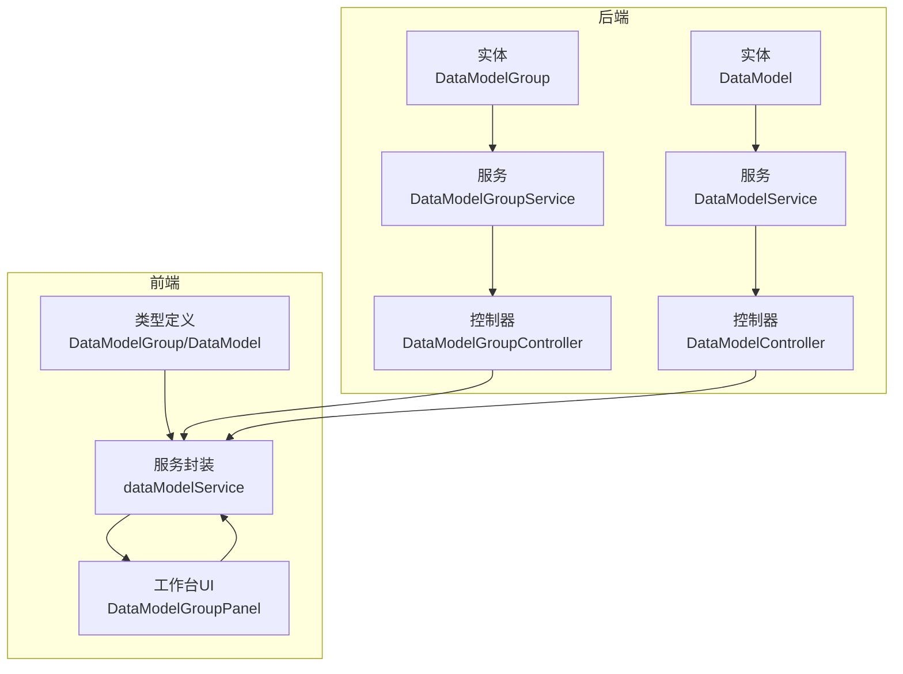
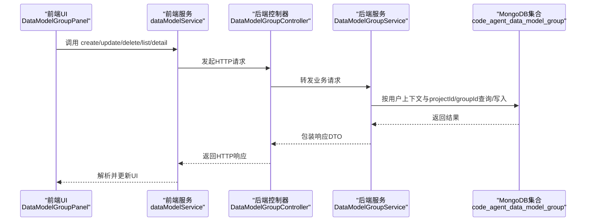
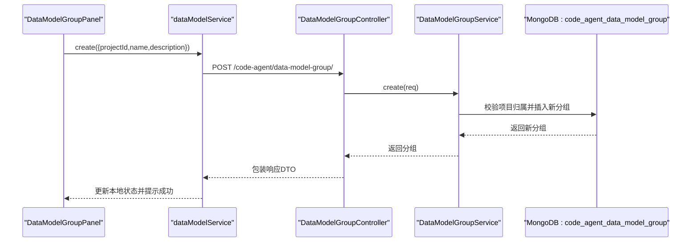
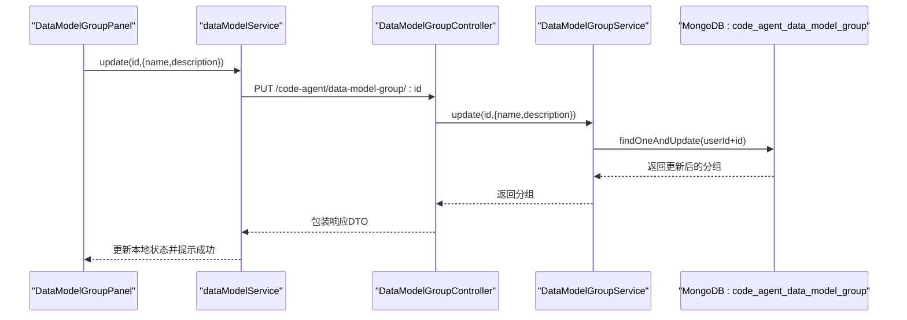
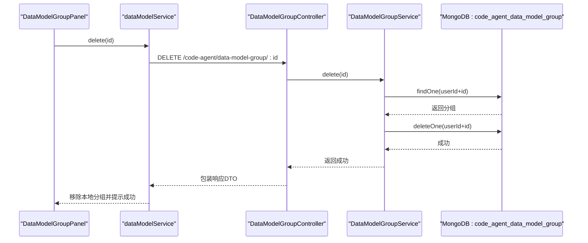
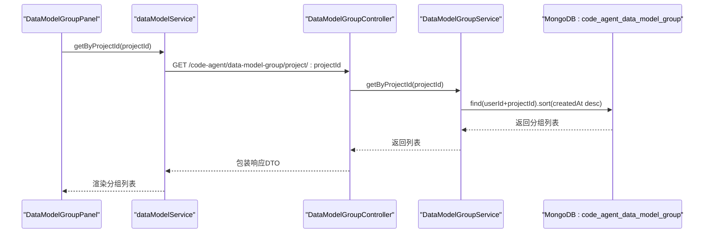
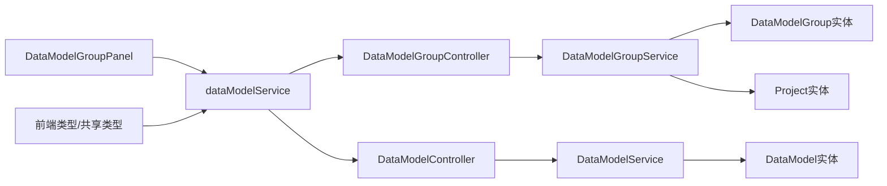
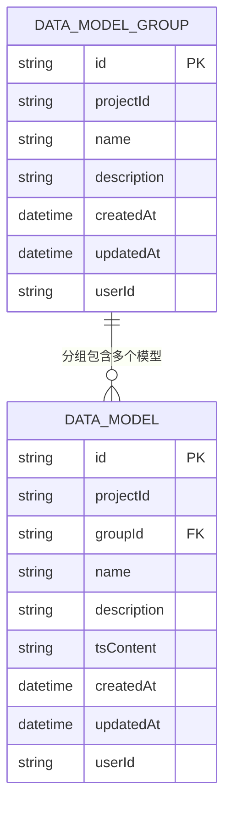

# 数据模型组

<cite>
**本文引用的文件**
- [data-model-group.ts（实体）](file://code-agent-backend/src/entity/code-agent/data-model-group.ts)
- [data-model-group.ts（服务）](file://code-agent-backend/src/service/code-agent/data-model-group.ts)
- [data-model-group.ts（控制器）](file://code-agent-backend/src/controller/code-agent/data-model-group.ts)
- [req.ts（请求DTO）](file://code-agent-backend/src/dto/code-agent/req.ts)
- [res.ts（响应DTO）](file://code-agent-backend/src/dto/code-agent/res.ts)
- [data-model.ts（实体）](file://code-agent-backend/src/entity/code-agent/data-model.ts)
- [data-model.ts（服务）](file://code-agent-backend/src/service/code-agent/data-model.ts)
- [data-model.ts（控制器）](file://code-agent-backend/src/controller/code-agent/data-model.ts)
- [dataModelService.ts（前端服务封装）](file://fta-layout-design/src/services/dataModelService.ts)
- [DataModelGroupPanel/index.tsx（前端分组面板）](file://fta-layout-design/src/pages/EditorPage/components/DataModelGroupPanel/index.tsx)
- [dataModel.ts（前端类型）](file://fta-layout-design/src/types/dataModel.ts)
- [dataModel.ts（共享类型）](file://shared-types/src/dataModel.ts)
</cite>

## 目录
1. [简介](#简介)
2. [项目结构](#项目结构)
3. [核心组件](#核心组件)
4. [架构总览](#架构总览)
5. [详细组件分析](#详细组件分析)
6. [依赖分析](#依赖分析)
7. [性能考虑](#性能考虑)
8. [故障排查指南](#故障排查指南)
9. [结论](#结论)
10. [附录](#附录)

## 简介
本文件围绕“数据模型组（DataModelGroup）”展开，系统性说明其作为数据模型分类容器的角色与实现。重点包括：
- 核心字段的业务含义与MongoDB集合映射
- 与数据模型（DataModel）的一对多关系及groupId逻辑分组机制
- 后端API与前端工作台的完整调用流程
- 特殊分组“未分组（__ungrouped__）”的处理逻辑
- 权限控制、数据一致性保障与常见使用模式

## 项目结构
数据模型组功能横跨后端实体/服务/控制器与前端类型/服务/UI组件，形成完整的前后端协作闭环。

图表来源
- [data-model-group.ts（实体）](file://code-agent-backend/src/entity/code-agent/data-model-group.ts#L1-L48)
- [data-model-group.ts（服务）](file://code-agent-backend/src/service/code-agent/data-model-group.ts#L1-L156)
- [data-model-group.ts（控制器）](file://code-agent-backend/src/controller/code-agent/data-model-group.ts#L1-L104)
- [data-model.ts（实体）](file://code-agent-backend/src/entity/code-agent/data-model.ts#L1-L55)
- [data-model.ts（服务）](file://code-agent-backend/src/service/code-agent/data-model.ts#L147-L199)
- [data-model.ts（控制器）](file://code-agent-backend/src/controller/code-agent/data-model.ts#L91-L124)
- [dataModelService.ts（前端服务封装）](file://fta-layout-design/src/services/dataModelService.ts#L1-L132)
- [DataModelGroupPanel/index.tsx（前端分组面板）](file://fta-layout-design/src/pages/EditorPage/components/DataModelGroupPanel/index.tsx#L1-L314)
- [dataModel.ts（前端类型）](file://fta-layout-design/src/types/dataModel.ts#L1-L89)
- [dataModel.ts（共享类型）](file://shared-types/src/dataModel.ts#L1-L54)

章节来源
- [data-model-group.ts（实体）](file://code-agent-backend/src/entity/code-agent/data-model-group.ts#L1-L48)
- [data-model-group.ts（服务）](file://code-agent-backend/src/service/code-agent/data-model-group.ts#L1-L156)
- [data-model-group.ts（控制器）](file://code-agent-backend/src/controller/code-agent/data-model-group.ts#L1-L104)
- [data-model.ts（实体）](file://code-agent-backend/src/entity/code-agent/data-model.ts#L1-L55)
- [data-model.ts（服务）](file://code-agent-backend/src/service/code-agent/data-model.ts#L147-L199)
- [data-model.ts（控制器）](file://code-agent-backend/src/controller/code-agent/data-model.ts#L91-L124)
- [dataModelService.ts（前端服务封装）](file://fta-layout-design/src/services/dataModelService.ts#L1-L132)
- [DataModelGroupPanel/index.tsx（前端分组面板）](file://fta-layout-design/src/pages/EditorPage/components/DataModelGroupPanel/index.tsx#L1-L314)
- [dataModel.ts（前端类型）](file://fta-layout-design/src/types/dataModel.ts#L1-L89)
- [dataModel.ts（共享类型）](file://shared-types/src/dataModel.ts#L1-L54)

## 核心组件
- 实体层（MongoDB）
  - DataModelGroup：项目级分组容器，字段包含唯一标识、所属项目、名称、描述、时间戳、用户ID等；集合名为“code_agent_data_model_group”。
  - DataModel：项目级数据模型，字段包含唯一标识、所属项目、可选分组ID、名称、描述、TS内容、时间戳、用户ID等；集合名为“code_agent_data_model”。

- 服务层
  - DataModelGroupService：负责创建、更新、删除、按项目查询、按ID查询数据模型组；内部校验用户上下文与项目归属。
  - DataModelService：负责按项目/分组/未分组查询数据模型；支持按ID查询与分组迁移。

- 控制器层
  - DataModelGroupController：暴露REST接口，完成鉴权错误码映射与DTO包装。
  - DataModelController：提供按项目/分组/未分组查询与详情接口。

- 前端
  - 类型与共享类型：统一前后端数据模型与分组的契约。
  - dataModelService：封装分组与模型的API调用。
  - DataModelGroupPanel：工作台UI，支持创建/编辑/删除分组，展示“全部/未分组/各分组”的计数与交互。

章节来源
- [data-model-group.ts（实体）](file://code-agent-backend/src/entity/code-agent/data-model-group.ts#L1-L48)
- [data-model.ts（实体）](file://code-agent-backend/src/entity/code-agent/data-model.ts#L1-L55)
- [data-model-group.ts（服务）](file://code-agent-backend/src/service/code-agent/data-model-group.ts#L1-L156)
- [data-model.ts（服务）](file://code-agent-backend/src/service/code-agent/data-model.ts#L147-L199)
- [data-model-group.ts（控制器）](file://code-agent-backend/src/controller/code-agent/data-model-group.ts#L1-L104)
- [data-model.ts（控制器）](file://code-agent-backend/src/controller/code-agent/data-model.ts#L91-L124)
- [dataModelService.ts（前端服务封装）](file://fta-layout-design/src/services/dataModelService.ts#L1-L132)
- [DataModelGroupPanel/index.tsx（前端分组面板）](file://fta-layout-design/src/pages/EditorPage/components/DataModelGroupPanel/index.tsx#L1-L314)
- [dataModel.ts（前端类型）](file://fta-layout-design/src/types/dataModel.ts#L1-L89)
- [dataModel.ts（共享类型）](file://shared-types/src/dataModel.ts#L1-L54)

## 架构总览
后端采用MVC分层：控制器接收请求，服务层执行业务规则与数据访问，实体层映射MongoDB集合。前端通过dataModelService调用后端API，DataModelGroupPanel驱动用户交互。

图表来源
- [data-model-group.ts（控制器）](file://code-agent-backend/src/controller/code-agent/data-model-group.ts#L1-L104)
- [data-model-group.ts（服务）](file://code-agent-backend/src/service/code-agent/data-model-group.ts#L1-L156)
- [data-model-group.ts（实体）](file://code-agent-backend/src/entity/code-agent/data-model-group.ts#L1-L48)
- [dataModelService.ts（前端服务封装）](file://fta-layout-design/src/services/dataModelService.ts#L1-L132)
- [DataModelGroupPanel/index.tsx（前端分组面板）](file://fta-layout-design/src/pages/EditorPage/components/DataModelGroupPanel/index.tsx#L1-L314)

## 详细组件分析

### 数据模型组实体与字段语义
- 集合映射：实体注解指定集合名为“code_agent_data_model_group”，用于持久化分组元数据。
- 关键字段
  - id：全局唯一标识，服务层生成带前缀的随机ID。
  - projectId：项目维度归属，确保分组隔离。
  - name/description：分组名称与描述，便于组织与检索。
  - userId：用户维度归属，配合权限控制。
  - createdAt/updatedAt：时间戳，用于排序与审计。

章节来源
- [data-model-group.ts（实体）](file://code-agent-backend/src/entity/code-agent/data-model-group.ts#L1-L48)

### 与数据模型的一对多关系
- DataModel的groupId字段可选，未分组时为空；分组存在时指向DataModelGroup.id。
- 查询策略
  - 按项目：查询所有模型，再由前端按groupId过滤。
  - 按分组：服务层按groupId精确匹配。
  - 未分组：服务层按projectId+groupId不存在条件查询。
- 特殊分组“未分组（__ungrouped__）”
  - 前端以特殊ID在UI上呈现“未分组”计数与筛选，实际数据库中未分组即groupId不存在。

章节来源
- [data-model.ts（实体）](file://code-agent-backend/src/entity/code-agent/data-model.ts#L1-L55)
- [data-model.ts（服务）](file://code-agent-backend/src/service/code-agent/data-model.ts#L147-L199)
- [DataModelGroupPanel/index.tsx（前端分组面板）](file://fta-layout-design/src/pages/EditorPage/components/DataModelGroupPanel/index.tsx#L27-L33)

### 后端API与DTO
- 请求DTO
  - CreateDataModelGroupRequest：包含projectId、name、description。
  - UpdateDataModelGroupRequest：包含name、description。
- 响应DTO
  - DataModelGroupListResponse、DataModelGroupDetailResponse、CreateDataModelGroupResponse、UpdateDataModelGroupResponse、DeleteDataModelGroupResponse。
- 控制器接口
  - POST /code-agent/data-model-group/：创建
  - PUT /code-agent/data-model-group/:id：更新
  - DEL /code-agent/data-model-group/:id：删除
  - GET /code-agent/data-model-group/project/:projectId：按项目查询
  - GET /code-agent/data-model-group/:id：按ID查询

章节来源
- [req.ts（请求DTO）](file://code-agent-backend/src/dto/code-agent/req.ts#L439-L458)
- [res.ts（响应DTO）](file://code-agent-backend/src/dto/code-agent/res.ts#L255-L294)
- [data-model-group.ts（控制器）](file://code-agent-backend/src/controller/code-agent/data-model-group.ts#L1-L104)

### 前端工作台与交互
- dataModelService封装
  - 提供create/update/delete/getByProjectId/getById等方法，统一调用后端API。
- DataModelGroupPanel
  - 支持创建/编辑/删除分组；点击“全部/未分组/某分组”切换视图；显示各分组模型数量。
  - 对“未分组”使用特殊ID并在UI上统计计数。
  - 删除分组前检查该分组内是否有模型，若有则提示先移除或移动模型。

章节来源
- [dataModelService.ts（前端服务封装）](file://fta-layout-design/src/services/dataModelService.ts#L1-L132)
- [DataModelGroupPanel/index.tsx（前端分组面板）](file://fta-layout-design/src/pages/EditorPage/components/DataModelGroupPanel/index.tsx#L1-L314)

### 完整API调用流程（创建/更新/删除/查询）

#### 创建数据模型组

图表来源
- [data-model-group.ts（控制器）](file://code-agent-backend/src/controller/code-agent/data-model-group.ts#L27-L36)
- [data-model-group.ts（服务）](file://code-agent-backend/src/service/code-agent/data-model-group.ts#L55-L79)
- [data-model-group.ts（实体）](file://code-agent-backend/src/entity/code-agent/data-model-group.ts#L1-L48)
- [dataModelService.ts（前端服务封装）](file://fta-layout-design/src/services/dataModelService.ts#L23-L26)
- [DataModelGroupPanel/index.tsx（前端分组面板）](file://fta-layout-design/src/pages/EditorPage/components/DataModelGroupPanel/index.tsx#L42-L67)

#### 更新数据模型组

图表来源
- [data-model-group.ts（控制器）](file://code-agent-backend/src/controller/code-agent/data-model-group.ts#L41-L53)
- [data-model-group.ts（服务）](file://code-agent-backend/src/service/code-agent/data-model-group.ts#L85-L109)
- [dataModelService.ts（前端服务封装）](file://fta-layout-design/src/services/dataModelService.ts#L31-L34)
- [DataModelGroupPanel/index.tsx（前端分组面板）](file://fta-layout-design/src/pages/EditorPage/components/DataModelGroupPanel/index.tsx#L78-L98)

#### 删除数据模型组

图表来源
- [data-model-group.ts（控制器）](file://code-agent-backend/src/controller/code-agent/data-model-group.ts#L58-L67)
- [data-model-group.ts（服务）](file://code-agent-backend/src/service/code-agent/data-model-group.ts#L114-L127)
- [dataModelService.ts（前端服务封装）](file://fta-layout-design/src/services/dataModelService.ts#L39-L41)
- [DataModelGroupPanel/index.tsx（前端分组面板）](file://fta-layout-design/src/pages/EditorPage/components/DataModelGroupPanel/index.tsx#L101-L121)

#### 查询数据模型组

图表来源
- [data-model-group.ts（控制器）](file://code-agent-backend/src/controller/code-agent/data-model-group.ts#L72-L81)
- [data-model-group.ts（服务）](file://code-agent-backend/src/service/code-agent/data-model-group.ts#L132-L141)
- [dataModelService.ts（前端服务封装）](file://fta-layout-design/src/services/dataModelService.ts#L46-L49)

### 未分组数据模型（__ungrouped__）的特殊逻辑
- 数据层面
  - 未分组即DataModel的groupId不存在；服务层通过“groupId不存在”条件查询未分组模型。
- 前端层面
  - UI使用特殊ID“__ungrouped__”表示未分组项，计算未分组数量时统计没有groupId的模型。
  - 删除分组前若该分组内有模型，则阻止删除并提示先移除或移动模型。

章节来源
- [data-model.ts（服务）](file://code-agent-backend/src/service/code-agent/data-model.ts#L174-L186)
- [DataModelGroupPanel/index.tsx（前端分组面板）](file://fta-layout-design/src/pages/EditorPage/components/DataModelGroupPanel/index.tsx#L27-L33)
- [DataModelGroupPanel/index.tsx（前端分组面板）](file://fta-layout-design/src/pages/EditorPage/components/DataModelGroupPanel/index.tsx#L101-L121)

### 权限控制与数据一致性
- 权限控制
  - 服务层从请求上下文解析userId，所有操作均以userId+id进行查询/更新/删除，防止越权访问。
  - 创建时校验项目存在且属于当前用户。
- 数据一致性
  - 创建/更新时统一设置createdAt/updatedAt，保证时间线一致。
  - 删除前先查询确认存在，避免误删。
  - 查询按createdAt倒序返回，保证最新优先展示。

章节来源
- [data-model-group.ts（服务）](file://code-agent-backend/src/service/code-agent/data-model-group.ts#L36-L46)
- [data-model-group.ts（服务）](file://code-agent-backend/src/service/code-agent/data-model-group.ts#L61-L70)
- [data-model-group.ts（服务）](file://code-agent-backend/src/service/code-agent/data-model-group.ts#L91-L109)
- [data-model-group.ts（服务）](file://code-agent-backend/src/service/code-agent/data-model-group.ts#L115-L127)
- [data-model-group.ts（服务）](file://code-agent-backend/src/service/code-agent/data-model-group.ts#L132-L141)

### 常见使用模式与最佳实践
- 分组命名规范：建议按业务域或模块命名，便于快速定位。
- 迁移策略：当需要将模型从一个分组移动到另一个分组时，更新模型的groupId即可；若要移出分组，将groupId置空。
- 清理策略：定期清理长期未使用的分组；删除分组前先迁移或删除其中的模型。
- 性能建议：分组列表按createdAt倒序，避免全量扫描；模型查询尽量带上projectId与userId限定范围。

章节来源
- [data-model.ts（服务）](file://code-agent-backend/src/service/code-agent/data-model.ts#L147-L199)
- [data-model-group.ts（服务）](file://code-agent-backend/src/service/code-agent/data-model-group.ts#L132-L141)

## 依赖分析
- 后端
  - DataModelGroupController依赖DataModelGroupService与DTO。
  - DataModelGroupService依赖DataModelGroup实体与Project实体，用于用户上下文与项目归属校验。
  - DataModelController依赖DataModelService与DTO。
  - DataModelService依赖DataModel实体，提供按项目/分组/未分组查询。
- 前端
  - dataModelService依赖API工具与类型定义。
  - DataModelGroupPanel依赖store与消息组件，负责UI交互与状态更新。
  - 类型定义来自前端与共享类型库，确保前后端契约一致。

图表来源
- [data-model-group.ts（控制器）](file://code-agent-backend/src/controller/code-agent/data-model-group.ts#L1-L104)
- [data-model-group.ts（服务）](file://code-agent-backend/src/service/code-agent/data-model-group.ts#L1-L156)
- [data-model.ts（控制器）](file://code-agent-backend/src/controller/code-agent/data-model.ts#L91-L124)
- [data-model.ts（服务）](file://code-agent-backend/src/service/code-agent/data-model.ts#L147-L199)
- [dataModelService.ts（前端服务封装）](file://fta-layout-design/src/services/dataModelService.ts#L1-L132)
- [DataModelGroupPanel/index.tsx（前端分组面板）](file://fta-layout-design/src/pages/EditorPage/components/DataModelGroupPanel/index.tsx#L1-L314)
- [dataModel.ts（前端类型）](file://fta-layout-design/src/types/dataModel.ts#L1-L89)
- [dataModel.ts（共享类型）](file://shared-types/src/dataModel.ts#L1-L54)

章节来源
- [data-model-group.ts（控制器）](file://code-agent-backend/src/controller/code-agent/data-model-group.ts#L1-L104)
- [data-model-group.ts（服务）](file://code-agent-backend/src/service/code-agent/data-model-group.ts#L1-L156)
- [data-model.ts（控制器）](file://code-agent-backend/src/controller/code-agent/data-model.ts#L91-L124)
- [data-model.ts（服务）](file://code-agent-backend/src/service/code-agent/data-model.ts#L147-L199)
- [dataModelService.ts（前端服务封装）](file://fta-layout-design/src/services/dataModelService.ts#L1-L132)
- [DataModelGroupPanel/index.tsx（前端分组面板）](file://fta-layout-design/src/pages/EditorPage/components/DataModelGroupPanel/index.tsx#L1-L314)
- [dataModel.ts（前端类型）](file://fta-layout-design/src/types/dataModel.ts#L1-L89)
- [dataModel.ts（共享类型）](file://shared-types/src/dataModel.ts#L1-L54)

## 性能考虑
- 查询优化
  - 分组列表按createdAt倒序，减少排序成本。
  - 模型查询默认带上userId与projectId限定，避免全表扫描。
- 写入优化
  - 创建/更新统一设置时间戳，减少重复字段写入。
- 前端渲染
  - UI侧按分组缓存计数，避免每次重算。
- 并发与一致性
  - 删除前先findOne确认存在，避免并发下的误删。
  - 更新使用findOneAndUpdate并启用验证器，保证字段合法性。

[本节为通用指导，无需列出具体文件来源]

## 故障排查指南
- 400错误（创建/更新/删除）
  - 可能原因：用户ID缺失、项目不存在、分组不存在。
  - 排查要点：确认请求上下文中携带用户信息；确认projectId与userId匹配；确认分组ID有效。
- 404错误（按ID查询分组/模型）
  - 可能原因：资源不存在或越权访问。
  - 排查要点：确认ID正确；确认当前用户是否拥有该项目/分组权限。
- 删除分组被阻止
  - 可能原因：分组内仍有模型。
  - 排查要点：先将模型迁移到其他分组或移出分组，再删除分组。
- 未分组计数异常
  - 可能原因：模型groupId为空但前端仍计入未分组。
  - 排查要点：确认服务层查询条件为“groupId不存在”；检查模型是否正确清空groupId。

章节来源
- [data-model-group.ts（控制器）](file://code-agent-backend/src/controller/code-agent/data-model-group.ts#L27-L36)
- [data-model-group.ts（控制器）](file://code-agent-backend/src/controller/code-agent/data-model-group.ts#L58-L67)
- [data-model-group.ts（控制器）](file://code-agent-backend/src/controller/code-agent/data-model-group.ts#L72-L81)
- [data-model-group.ts（控制器）](file://code-agent-backend/src/controller/code-agent/data-model-group.ts#L86-L101)
- [data-model-group.ts（服务）](file://code-agent-backend/src/service/code-agent/data-model-group.ts#L36-L46)
- [data-model-group.ts（服务）](file://code-agent-backend/src/service/code-agent/data-model-group.ts#L61-L70)
- [data-model-group.ts（服务）](file://code-agent-backend/src/service/code-agent/data-model-group.ts#L85-L109)
- [data-model-group.ts（服务）](file://code-agent-backend/src/service/code-agent/data-model-group.ts#L114-L127)
- [data-model.ts（服务）](file://code-agent-backend/src/service/code-agent/data-model.ts#L174-L186)
- [DataModelGroupPanel/index.tsx（前端分组面板）](file://fta-layout-design/src/pages/EditorPage/components/DataModelGroupPanel/index.tsx#L101-L121)

## 结论
数据模型组通过清晰的实体字段、严格的权限控制与完善的前后端协作，实现了项目级数据模型的灵活分组与高效管理。配合“未分组”特殊逻辑与前端工作台，用户可以直观地组织与维护数据模型，提升开发效率与一致性。

[本节为总结，无需列出具体文件来源]

## 附录

### 数据模型组ER图

图表来源
- [data-model-group.ts（实体）](file://code-agent-backend/src/entity/code-agent/data-model-group.ts#L1-L48)
- [data-model.ts（实体）](file://code-agent-backend/src/entity/code-agent/data-model.ts#L1-L55)