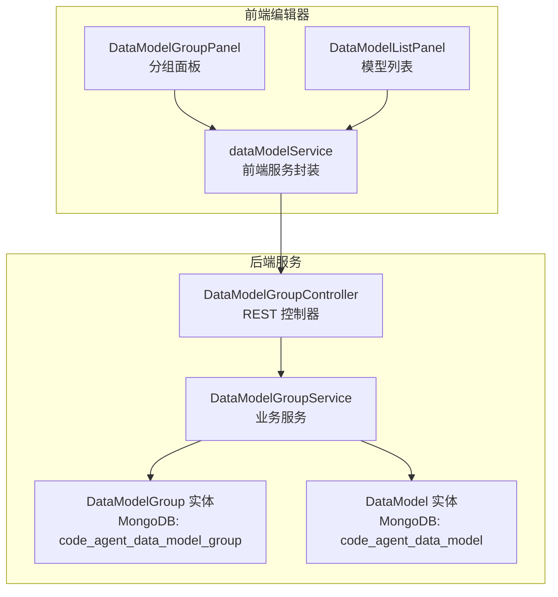
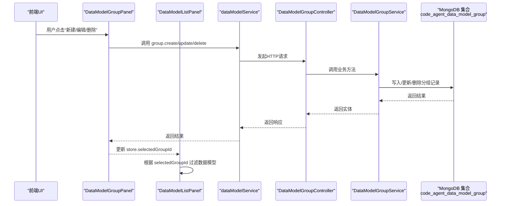
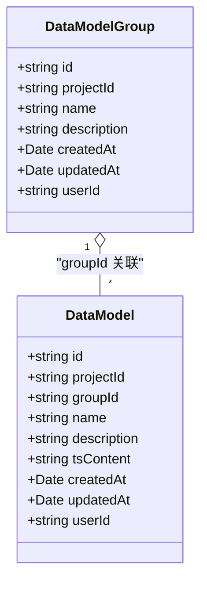
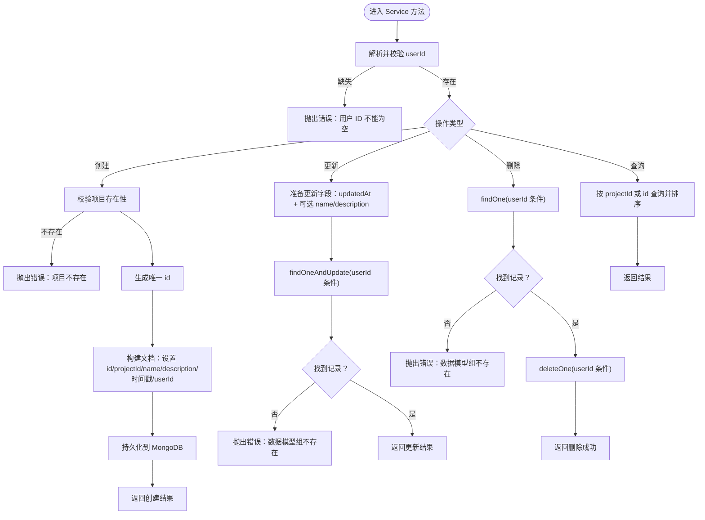
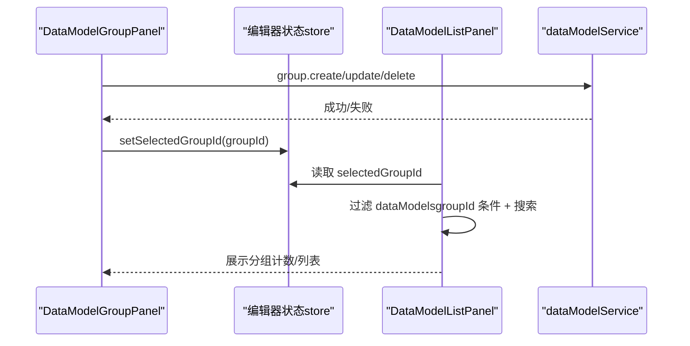
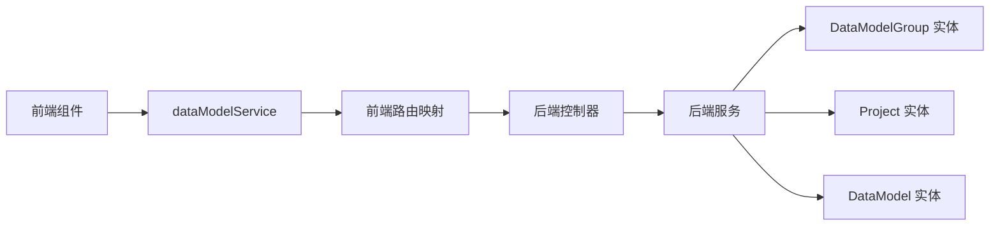

# 数据模型组

<cite>
**本文引用的文件**
- [code-agent-backend/src/entity/code-agent/data-model-group.ts](file://code-agent-backend/src/entity/code-agent/data-model-group.ts)
- [code-agent-backend/src/service/code-agent/data-model-group.ts](file://code-agent-backend/src/service/code-agent/data-model-group.ts)
- [code-agent-backend/src/controller/code-agent/data-model-group.ts](file://code-agent-backend/src/controller/code-agent/data-model-group.ts)
- [code-agent-backend/src/dto/code-agent/req.ts](file://code-agent-backend/src/dto/code-agent/req.ts)
- [code-agent-backend/src/dto/code-agent/res.ts](file://code-agent-backend/src/dto/code-agent/res.ts)
- [code-agent-backend/src/entity/code-agent/data-model.ts](file://code-agent-backend/src/entity/code-agent/data-model.ts)
- [fta-layout-design/src/pages/EditorPage/components/DataModelGroupPanel/index.tsx](file://fta-layout-design/src/pages/EditorPage/components/DataModelGroupPanel/index.tsx)
- [fta-layout-design/src/pages/EditorPage/components/DataModelListPanel/index.tsx](file://fta-layout-design/src/pages/EditorPage/components/DataModelListPanel/index.tsx)
- [fta-layout-design/src/services/dataModelService.ts](file://fta-layout-design/src/services/dataModelService.ts)
- [fta-layout-design/src/types/dataModel.ts](file://fta-layout-design/src/types/dataModel.ts)
- [shared-types/src/dataModel.ts](file://shared-types/src/dataModel.ts)
- [fta-layout-design/src/config/api.ts](file://fta-layout-design/src/config/api.ts)
</cite>

## 目录
1. [简介](#简介)
2. [项目结构](#项目结构)
3. [核心组件](#核心组件)
4. [架构总览](#架构总览)
5. [详细组件分析](#详细组件分析)
6. [依赖分析](#依赖分析)
7. [性能考虑](#性能考虑)
8. [故障排查指南](#故障排查指南)
9. [结论](#结论)
10. [附录](#附录)

## 简介
本文件围绕“数据模型组（DataModelGroup）”展开，系统性说明其作为数据模型分类管理容器的角色与实现。重点包括：
- 字段定义与语义：id、projectId、name、description、createdAt、updatedAt、userId
- 存储与关系：MongoDB 集合 code_agent_data_model_group；与 DataModel 的“一对多”关系（通过 DataModel 的 groupId 字段关联）
- 业务作用：在前端 DataModelListPanel 中依据 selectedGroupId 过滤数据模型，支持按分组浏览与管理
- 后端 Service（创建、更新、删除、查询）与前端 dataModelGroupService 的完整调用链路
- 实际使用场景：为“用户管理”和“订单系统”分别创建独立的数据模型组

## 项目结构
数据模型组功能横跨后端实体层、服务层、控制器层，以及前端编辑器页面与服务封装层，形成从 UI 到数据库的闭环。

图表来源
- [code-agent-backend/src/controller/code-agent/data-model-group.ts](file://code-agent-backend/src/controller/code-agent/data-model-group.ts#L1-L104)
- [code-agent-backend/src/service/code-agent/data-model-group.ts](file://code-agent-backend/src/service/code-agent/data-model-group.ts#L1-L156)
- [code-agent-backend/src/entity/code-agent/data-model-group.ts](file://code-agent-backend/src/entity/code-agent/data-model-group.ts#L1-L48)
- [code-agent-backend/src/entity/code-agent/data-model.ts](file://code-agent-backend/src/entity/code-agent/data-model.ts#L1-L55)
- [fta-layout-design/src/pages/EditorPage/components/DataModelGroupPanel/index.tsx](file://fta-layout-design/src/pages/EditorPage/components/DataModelGroupPanel/index.tsx#L1-L314)
- [fta-layout-design/src/pages/EditorPage/components/DataModelListPanel/index.tsx](file://fta-layout-design/src/pages/EditorPage/components/DataModelListPanel/index.tsx#L1-L166)
- [fta-layout-design/src/services/dataModelService.ts](file://fta-layout-design/src/services/dataModelService.ts#L1-L132)

章节来源
- [code-agent-backend/src/controller/code-agent/data-model-group.ts](file://code-agent-backend/src/controller/code-agent/data-model-group.ts#L1-L104)
- [code-agent-backend/src/service/code-agent/data-model-group.ts](file://code-agent-backend/src/service/code-agent/data-model-group.ts#L1-L156)
- [code-agent-backend/src/entity/code-agent/data-model-group.ts](file://code-agent-backend/src/entity/code-agent/data-model-group.ts#L1-L48)
- [code-agent-backend/src/entity/code-agent/data-model.ts](file://code-agent-backend/src/entity/code-agent/data-model.ts#L1-L55)
- [fta-layout-design/src/pages/EditorPage/components/DataModelGroupPanel/index.tsx](file://fta-layout-design/src/pages/EditorPage/components/DataModelGroupPanel/index.tsx#L1-L314)
- [fta-layout-design/src/pages/EditorPage/components/DataModelListPanel/index.tsx](file://fta-layout-design/src/pages/EditorPage/components/DataModelListPanel/index.tsx#L1-L166)
- [fta-layout-design/src/services/dataModelService.ts](file://fta-layout-design/src/services/dataModelService.ts#L1-L132)

## 核心组件
- 数据模型组实体（MongoDB 集合：code_agent_data_model_group）
  - 字段：id、projectId、name、description、createdAt、updatedAt、userId
  - 特性：项目级别共享，同一项目内由同一用户可见与操作
- 数据模型实体（MongoDB 集合：code_agent_data_model）
  - 字段：id、projectId、groupId（可选）、name、description、tsContent、createdAt、updatedAt、userId
  - 关系：一个分组包含多个数据模型（一对多）

章节来源
- [code-agent-backend/src/entity/code-agent/data-model-group.ts](file://code-agent-backend/src/entity/code-agent/data-model-group.ts#L1-L48)
- [code-agent-backend/src/entity/code-agent/data-model.ts](file://code-agent-backend/src/entity/code-agent/data-model.ts#L1-L55)

## 架构总览
从前端到后端的数据流如下：用户在 DataModelGroupPanel 中创建/更新/删除分组，随后 DataModelListPanel 根据 selectedGroupId 过滤数据模型。

图表来源
- [fta-layout-design/src/pages/EditorPage/components/DataModelGroupPanel/index.tsx](file://fta-layout-design/src/pages/EditorPage/components/DataModelGroupPanel/index.tsx#L1-L314)
- [fta-layout-design/src/pages/EditorPage/components/DataModelListPanel/index.tsx](file://fta-layout-design/src/pages/EditorPage/components/DataModelListPanel/index.tsx#L1-L166)
- [fta-layout-design/src/services/dataModelService.ts](file://fta-layout-design/src/services/dataModelService.ts#L1-L132)
- [code-agent-backend/src/controller/code-agent/data-model-group.ts](file://code-agent-backend/src/controller/code-agent/data-model-group.ts#L1-L104)
- [code-agent-backend/src/service/code-agent/data-model-group.ts](file://code-agent-backend/src/service/code-agent/data-model-group.ts#L1-L156)
- [code-agent-backend/src/entity/code-agent/data-model-group.ts](file://code-agent-backend/src/entity/code-agent/data-model-group.ts#L1-L48)

## 详细组件分析

### 数据模型组实体与字段定义
- id：全局唯一标识，服务端生成
- projectId：所属项目 ID，用于项目级隔离
- name：分组名称
- description：分组描述（可选）
- createdAt/updatedAt：自动维护的时间戳
- userId：创建者/归属用户 ID，确保资源访问控制

图表来源
- [code-agent-backend/src/entity/code-agent/data-model-group.ts](file://code-agent-backend/src/entity/code-agent/data-model-group.ts#L1-L48)
- [code-agent-backend/src/entity/code-agent/data-model.ts](file://code-agent-backend/src/entity/code-agent/data-model.ts#L1-L55)

章节来源
- [code-agent-backend/src/entity/code-agent/data-model-group.ts](file://code-agent-backend/src/entity/code-agent/data-model-group.ts#L1-L48)
- [code-agent-backend/src/entity/code-agent/data-model.ts](file://code-agent-backend/src/entity/code-agent/data-model.ts#L1-L55)

### 后端 Service：创建/更新/删除/查询
- 创建：校验用户身份与项目存在性，生成唯一 id，写入 createdAt/updatedAt，返回实体
- 更新：仅允许更新 name/description，自动更新 updatedAt
- 删除：先校验用户与分组存在性，再删除
- 查询：按 projectId+userId 查询，按创建时间倒序返回；支持按 id 查询

图表来源
- [code-agent-backend/src/service/code-agent/data-model-group.ts](file://code-agent-backend/src/service/code-agent/data-model-group.ts#L1-L156)

章节来源
- [code-agent-backend/src/service/code-agent/data-model-group.ts](file://code-agent-backend/src/service/code-agent/data-model-group.ts#L1-L156)

### 前端交互：分组面板与列表过滤
- DataModelGroupPanel
  - 支持新建/编辑/删除分组
  - 选择分组后通过 store.selectedGroupId 触发列表过滤
  - 未分组计数通过 groupId 是否为空统计
- DataModelListPanel
  - 根据 selectedGroupId 过滤：空值表示全部，__ungrouped__ 表示未分组，否则按 groupId 过滤
  - 支持搜索框二次过滤（名称/描述）

图表来源
- [fta-layout-design/src/pages/EditorPage/components/DataModelGroupPanel/index.tsx](file://fta-layout-design/src/pages/EditorPage/components/DataModelGroupPanel/index.tsx#L1-L314)
- [fta-layout-design/src/pages/EditorPage/components/DataModelListPanel/index.tsx](file://fta-layout-design/src/pages/EditorPage/components/DataModelListPanel/index.tsx#L1-L166)
- [fta-layout-design/src/services/dataModelService.ts](file://fta-layout-design/src/services/dataModelService.ts#L1-L132)

章节来源
- [fta-layout-design/src/pages/EditorPage/components/DataModelGroupPanel/index.tsx](file://fta-layout-design/src/pages/EditorPage/components/DataModelGroupPanel/index.tsx#L1-L314)
- [fta-layout-design/src/pages/EditorPage/components/DataModelListPanel/index.tsx](file://fta-layout-design/src/pages/EditorPage/components/DataModelListPanel/index.tsx#L1-L166)
- [fta-layout-design/src/services/dataModelService.ts](file://fta-layout-design/src/services/dataModelService.ts#L1-L132)

### API 定义与调用
- 后端控制器提供 REST 接口：创建、更新、删除、按项目列出、按 id 查询
- 前端 dataModelService 封装 HTTP 请求，统一返回 dataModelGroup 类型
- 前端路由映射见配置文件

章节来源
- [code-agent-backend/src/controller/code-agent/data-model-group.ts](file://code-agent-backend/src/controller/code-agent/data-model-group.ts#L1-L104)
- [code-agent-backend/src/dto/code-agent/req.ts](file://code-agent-backend/src/dto/code-agent/req.ts#L440-L457)
- [code-agent-backend/src/dto/code-agent/res.ts](file://code-agent-backend/src/dto/code-agent/res.ts#L255-L294)
- [fta-layout-design/src/services/dataModelService.ts](file://fta-layout-design/src/services/dataModelService.ts#L1-L62)
- [fta-layout-design/src/config/api.ts](file://fta-layout-design/src/config/api.ts#L90-L105)

## 依赖分析
- 前端依赖
  - dataModelService 依赖 apiService，apiService 将请求映射到后端路由
  - DataModelGroupPanel 与 DataModelListPanel 通过 store 通信，实现分组切换与列表过滤
- 后端依赖
  - DataModelGroupController 依赖 DataModelGroupService
  - DataModelGroupService 依赖 DataModelGroup 实体与 Project 实体（用于项目存在性校验）
  - DataModel 实体用于“一对多”关系的查询（按 groupId 过滤）

图表来源
- [fta-layout-design/src/services/dataModelService.ts](file://fta-layout-design/src/services/dataModelService.ts#L1-L132)
- [code-agent-backend/src/controller/code-agent/data-model-group.ts](file://code-agent-backend/src/controller/code-agent/data-model-group.ts#L1-L104)
- [code-agent-backend/src/service/code-agent/data-model-group.ts](file://code-agent-backend/src/service/code-agent/data-model-group.ts#L1-L156)
- [code-agent-backend/src/entity/code-agent/data-model-group.ts](file://code-agent-backend/src/entity/code-agent/data-model-group.ts#L1-L48)
- [code-agent-backend/src/entity/code-agent/data-model.ts](file://code-agent-backend/src/entity/code-agent/data-model.ts#L1-L55)

章节来源
- [fta-layout-design/src/services/dataModelService.ts](file://fta-layout-design/src/services/dataModelService.ts#L1-L132)
- [code-agent-backend/src/controller/code-agent/data-model-group.ts](file://code-agent-backend/src/controller/code-agent/data-model-group.ts#L1-L104)
- [code-agent-backend/src/service/code-agent/data-model-group.ts](file://code-agent-backend/src/service/code-agent/data-model-group.ts#L1-L156)
- [code-agent-backend/src/entity/code-agent/data-model-group.ts](file://code-agent-backend/src/entity/code-agent/data-model-group.ts#L1-L48)
- [code-agent-backend/src/entity/code-agent/data-model.ts](file://code-agent-backend/src/entity/code-agent/data-model.ts#L1-L55)

## 性能考虑
- 查询优化
  - 按 projectId+userId 查询分组列表，建议在 projectId 与 userId 上建立索引以提升排序与过滤性能
  - 按 groupId 查询数据模型时，建议在 groupId 上建立索引
- 写入优化
  - 创建/更新时仅写入必要字段，避免冗余字段导致的写放大
- 前端渲染
  - 列表过滤在内存中进行，建议在数据量较大时采用虚拟滚动与分页策略

## 故障排查指南
- 常见错误与定位
  - 用户 ID 为空：检查鉴权中间件或上下文注入是否正确
  - 项目不存在：确认 projectId 与 userId 组合是否有效
  - 分组不存在：更新/删除前先通过 getById 校验
- 前端提示
  - 删除分组前检查该分组下是否有数据模型，若有需先移除或移动后再删除
  - 创建/更新成功后刷新 store，确保 UI 即时反映最新状态

章节来源
- [code-agent-backend/src/service/code-agent/data-model-group.ts](file://code-agent-backend/src/service/code-agent/data-model-group.ts#L56-L155)
- [code-agent-backend/src/controller/code-agent/data-model-group.ts](file://code-agent-backend/src/controller/code-agent/data-model-group.ts#L27-L101)
- [fta-layout-design/src/pages/EditorPage/components/DataModelGroupPanel/index.tsx](file://fta-layout-design/src/pages/EditorPage/components/DataModelGroupPanel/index.tsx#L100-L121)

## 结论
数据模型组为项目级数据模型提供了清晰的分类与隔离能力。通过“分组 + 列表过滤”的前端模式，配合后端严格的用户与项目维度校验，实现了安全、直观的模型管理体验。未来可在索引与查询层面进一步优化性能，并在前端引入更完善的分页与缓存策略。

## 附录

### 字段定义与约束
- DataModelGroup
  - id：必填，字符串
  - projectId：必填，字符串
  - name：必填，字符串
  - description：可选，字符串
  - createdAt/updatedAt：必填，日期
  - userId：必填，字符串
- DataModel
  - id：必填，字符串
  - projectId：必填，字符串
  - groupId：可选，字符串
  - name：必填，字符串
  - description：可选，字符串
  - tsContent：必填，字符串
  - createdAt/updatedAt：必填，日期
  - userId：必填，字符串

章节来源
- [code-agent-backend/src/entity/code-agent/data-model-group.ts](file://code-agent-backend/src/entity/code-agent/data-model-group.ts#L1-L48)
- [code-agent-backend/src/entity/code-agent/data-model.ts](file://code-agent-backend/src/entity/code-agent/data-model.ts#L1-L55)
- [shared-types/src/dataModel.ts](file://shared-types/src/dataModel.ts#L1-L54)
- [fta-layout-design/src/types/dataModel.ts](file://fta-layout-design/src/types/dataModel.ts#L1-L89)

### 实际使用场景示例
- 用户管理
  - 在“用户管理”项目下创建名为“用户相关”的数据模型组，将用户信息、角色权限等模型归类至该组，便于集中管理与复用
- 订单系统
  - 在“订单系统”项目下创建名为“订单相关”的数据模型组，将订单、支付、物流等模型归类至该组，实现业务域隔离与检索便利

章节来源
- [fta-layout-design/src/pages/EditorPage/components/DataModelGroupPanel/index.tsx](file://fta-layout-design/src/pages/EditorPage/components/DataModelGroupPanel/index.tsx#L42-L67)
- [fta-layout-design/src/pages/EditorPage/components/DataModelListPanel/index.tsx](file://fta-layout-design/src/pages/EditorPage/components/DataModelListPanel/index.tsx#L24-L45)